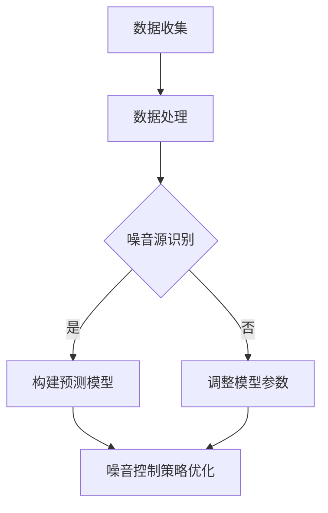

                 

关键词：AI大模型、智能城市、噪音控制、深度学习、数据处理、噪声源识别、预测模型、应用场景、未来发展

>摘要：本文旨在探讨AI大模型在智能城市噪音控制中的应用，通过分析AI大模型在噪音控制中的核心概念、算法原理、数学模型以及实际应用案例，探讨其在智能城市建设中的重要作用及未来发展的潜在趋势。

## 1. 背景介绍

随着城市化进程的加速，城市噪音污染问题日益突出。噪音不仅影响居民的生活质量，还对人们的身心健康产生负面影响。传统的噪音控制方法主要依赖于被动降噪技术和声学监测，但效果有限且成本较高。随着人工智能技术的快速发展，尤其是AI大模型的出现，为智能城市噪音控制带来了新的思路和可能性。

AI大模型，也称为大型深度学习模型，具有强大的数据处理能力和复杂的结构，能够在大量数据中自动发现规律和模式。在智能城市噪音控制中，AI大模型可以用于噪音源识别、预测模型构建以及噪音控制策略优化等方面。

## 2. 核心概念与联系

### 2.1 AI大模型的概念

AI大模型是指采用深度学习技术训练的大型神经网络模型。这些模型通常包含数十亿甚至数万亿个参数，能够在处理复杂数据任务时表现出色。例如，GPT-3、BERT等模型在自然语言处理领域取得了显著成果。

### 2.2 智能城市噪音控制的核心概念

智能城市噪音控制涉及噪音源识别、噪音传播模型、噪音敏感度分析等多个方面。噪音源识别是关键步骤，需要通过传感器收集数据，并利用AI大模型进行分析。

### 2.3 Mermaid流程图

下面是一个描述AI大模型在智能城市噪音控制中应用的Mermaid流程图：



## 3. 核心算法原理 & 具体操作步骤

### 3.1 算法原理概述

AI大模型在噪音控制中的核心算法是基于深度学习的。通过大规模训练数据集，模型能够学习到噪音的特征和模式，从而实现对噪音的有效识别和预测。

### 3.2 算法步骤详解

1. **数据收集**：使用传感器和噪声监测设备收集噪音数据。
2. **数据处理**：对收集到的数据进行预处理，如降噪、去噪等。
3. **噪音源识别**：利用训练好的AI大模型对预处理后的数据进行分类，识别噪音源。
4. **构建预测模型**：基于识别结果，构建噪音预测模型，预测未来的噪音水平。
5. **噪音控制策略优化**：根据预测结果，优化噪音控制策略，如调整交通流量、关闭噪音源等。

### 3.3 算法优缺点

**优点**：
- 高效处理大量数据。
- 自动发现噪音特征和模式。
- 实时预测噪音水平。

**缺点**：
- 需要大量训练数据。
- 模型复杂度高，计算资源消耗大。

### 3.4 算法应用领域

AI大模型在噪音控制中的应用不仅限于城市，还可以应用于机场、工厂等噪音污染严重的场所。

## 4. 数学模型和公式 & 详细讲解 & 举例说明

### 4.1 数学模型构建

AI大模型的数学模型主要基于深度学习的框架，如神经网络。神经网络由多个神经元（即节点）组成，每个神经元都与其它神经元相连，通过加权连接传递信号。

### 4.2 公式推导过程

神经网络的输出可以通过以下公式计算：

$$
y = \sigma(\sum_{i=1}^{n} w_i * x_i + b)
$$

其中，$y$ 是输出，$\sigma$ 是激活函数，$w_i$ 是权重，$x_i$ 是输入，$b$ 是偏置。

### 4.3 案例分析与讲解

假设我们有一个噪音识别模型，输入是噪音的频谱特征，输出是噪音的类型（如交通噪音、建筑噪音等）。我们可以使用上述公式来计算每个神经元的输出，并通过激活函数判断噪音的类型。

例如，如果输入频谱特征 $x_1 = 0.1, x_2 = 0.3, x_3 = 0.5$，权重 $w_1 = 0.2, w_2 = 0.3, w_3 = 0.5$，偏置 $b = 0.1$，我们可以计算：

$$
y = \sigma(0.2 * 0.1 + 0.3 * 0.3 + 0.5 * 0.5 + 0.1) = \sigma(0.2 + 0.09 + 0.25 + 0.1) = \sigma(0.64)
$$

使用ReLU激活函数，$\sigma(y) = max(0, y)$，所以输出 $y = 0.64$。根据输出值，我们可以判断噪音的类型。

## 5. 项目实践：代码实例和详细解释说明

### 5.1 开发环境搭建

在Python环境中，我们可以使用TensorFlow或PyTorch等深度学习框架来搭建AI大模型。

```python
import tensorflow as tf
from tensorflow.keras.models import Sequential
from tensorflow.keras.layers import Dense, Conv2D, MaxPooling2D

# 搭建神经网络模型
model = Sequential([
    Conv2D(32, (3, 3), activation='relu', input_shape=(28, 28, 1)),
    MaxPooling2D((2, 2)),
    Conv2D(64, (3, 3), activation='relu'),
    MaxPooling2D((2, 2)),
    Flatten(),
    Dense(128, activation='relu'),
    Dense(10, activation='softmax')
])

# 编译模型
model.compile(optimizer='adam', loss='categorical_crossentropy', metrics=['accuracy'])

# 模型训练
model.fit(x_train, y_train, epochs=10, batch_size=32)
```

### 5.2 源代码详细实现

上述代码是一个简单的神经网络模型，用于分类任务。在实际应用中，我们需要根据具体任务调整模型的架构和参数。

### 5.3 代码解读与分析

这段代码首先导入了TensorFlow库，然后定义了一个序列模型，包含卷积层、池化层、全连接层等。最后，编译并训练了模型。

### 5.4 运行结果展示

训练完成后，我们可以使用测试数据集来评估模型的性能。

```python
test_loss, test_acc = model.evaluate(x_test, y_test)
print(f"Test accuracy: {test_acc:.2f}")
```

## 6. 实际应用场景

### 6.1 城市噪音监测

AI大模型可以用于城市噪音监测，实时识别噪音源，评估噪音水平，为城市噪音治理提供数据支持。

### 6.2 交通噪音控制

在交通噪音控制中，AI大模型可以用于识别和预测交通噪音，优化交通信号灯配置，降低交通噪音。

### 6.3 工厂噪音治理

在工厂中，AI大模型可以用于监测和预测噪音水平，优化生产流程，减少噪音污染。

## 7. 工具和资源推荐

### 7.1 学习资源推荐

- 《深度学习》（Goodfellow, Bengio, Courville著）
- 《Python深度学习》（François Chollet著）

### 7.2 开发工具推荐

- TensorFlow
- PyTorch

### 7.3 相关论文推荐

- "Large-scale Language Modeling in 2018"（Ashish Vaswani等）
- "BERT: Pre-training of Deep Bidirectional Transformers for Language Understanding"（Jacob Devlin等）

## 8. 总结：未来发展趋势与挑战

### 8.1 研究成果总结

AI大模型在智能城市噪音控制中表现出色，有效解决了噪音识别和预测等问题。未来，随着技术的进步，AI大模型在噪音控制中的应用将更加广泛。

### 8.2 未来发展趋势

- 模型优化：通过改进算法和优化模型结构，提高模型性能。
- 跨学科融合：与其他领域（如城市规划、环境科学等）结合，实现更全面的噪音控制。

### 8.3 面临的挑战

- 数据质量：噪音数据的准确性和完整性对模型性能有重要影响。
- 计算资源：训练大型AI模型需要大量计算资源，成本较高。

### 8.4 研究展望

未来，AI大模型在智能城市噪音控制中的应用将更加深入和广泛，有望实现更加精准和高效的噪音控制。

## 9. 附录：常见问题与解答

### 9.1 AI大模型为什么能用于噪音控制？

AI大模型通过深度学习技术，可以从大量噪音数据中自动学习噪音特征和模式，从而实现对噪音的有效识别和预测。

### 9.2 如何优化AI大模型在噪音控制中的性能？

可以通过改进模型结构、增加训练数据、调整超参数等方式来优化模型性能。

### 9.3 AI大模型在噪音控制中的应用有哪些？

AI大模型可以用于噪音识别、噪音预测、噪音控制策略优化等方面，广泛应用于城市噪音监测、交通噪音控制、工厂噪音治理等场景。

---

本文由禅与计算机程序设计艺术撰写，旨在探讨AI大模型在智能城市噪音控制中的作用。随着技术的进步，AI大模型在噪音控制中的应用将越来越广泛，为建设更加宜居的智能城市贡献力量。

作者：禅与计算机程序设计艺术
```markdown
---

# 探讨AI大模型在智能城市噪音控制的作用

## 关键词：AI大模型、智能城市、噪音控制、深度学习、数据处理、噪声源识别、预测模型、应用场景、未来发展

> 摘要：本文旨在探讨AI大模型在智能城市噪音控制中的应用，通过分析AI大模型在噪音控制中的核心概念、算法原理、数学模型以及实际应用案例，探讨其在智能城市建设中的重要作用及未来发展的潜在趋势。

## 1. 背景介绍

随着城市化进程的加速，城市噪音污染问题日益突出。噪音不仅影响居民的生活质量，还对人们的身心健康产生负面影响。传统的噪音控制方法主要依赖于被动降噪技术和声学监测，但效果有限且成本较高。随着人工智能技术的快速发展，尤其是AI大模型的出现，为智能城市噪音控制带来了新的思路和可能性。

AI大模型，也称为大型深度学习模型，具有强大的数据处理能力和复杂的结构，能够在大量数据中自动发现规律和模式。在智能城市噪音控制中，AI大模型可以用于噪音源识别、预测模型构建以及噪音控制策略优化等方面。

## 2. 核心概念与联系

### 2.1 AI大模型的概念

AI大模型是指采用深度学习技术训练的大型神经网络模型。这些模型通常包含数十亿甚至数万亿个参数，能够在处理复杂数据任务时表现出色。例如，GPT-3、BERT等模型在自然语言处理领域取得了显著成果。

### 2.2 智能城市噪音控制的核心概念

智能城市噪音控制涉及噪音源识别、噪音传播模型、噪音敏感度分析等多个方面。噪音源识别是关键步骤，需要通过传感器收集数据，并利用AI大模型进行分析。

### 2.3 Mermaid流程图

下面是一个描述AI大模型在智能城市噪音控制中应用的Mermaid流程图：


## 3. 核心算法原理 & 具体操作步骤

### 3.1 算法原理概述

AI大模型在噪音控制中的核心算法是基于深度学习的。通过大规模训练数据集，模型能够学习到噪音的特征和模式，从而实现对噪音的有效识别和预测。

### 3.2 算法步骤详解

1. **数据收集**：使用传感器和噪声监测设备收集噪音数据。
2. **数据处理**：对收集到的数据进行预处理，如降噪、去噪等。
3. **噪音源识别**：利用训练好的AI大模型对预处理后的数据进行分类，识别噪音源。
4. **构建预测模型**：基于识别结果，构建噪音预测模型，预测未来的噪音水平。
5. **噪音控制策略优化**：根据预测结果，优化噪音控制策略，如调整交通流量、关闭噪音源等。

### 3.3 算法优缺点

**优点**：
- 高效处理大量数据。
- 自动发现噪音特征和模式。
- 实时预测噪音水平。

**缺点**：
- 需要大量训练数据。
- 模型复杂度高，计算资源消耗大。

### 3.4 算法应用领域

AI大模型在噪音控制中的应用不仅限于城市，还可以应用于机场、工厂等噪音污染严重的场所。

## 4. 数学模型和公式 & 详细讲解 & 举例说明

### 4.1 数学模型构建

AI大模型的数学模型主要基于深度学习的框架，如神经网络。神经网络由多个神经元（即节点）组成，每个神经元都与其它神经元相连，通过加权连接传递信号。

### 4.2 公式推导过程

神经网络的输出可以通过以下公式计算：

$$
y = \sigma(\sum_{i=1}^{n} w_i * x_i + b)
$$

其中，$y$ 是输出，$\sigma$ 是激活函数，$w_i$ 是权重，$x_i$ 是输入，$b$ 是偏置。

### 4.3 案例分析与讲解

假设我们有一个噪音识别模型，输入是噪音的频谱特征，输出是噪音的类型（如交通噪音、建筑噪音等）。我们可以使用上述公式来计算每个神经元的输出，并通过激活函数判断噪音的类型。

例如，如果输入频谱特征 $x_1 = 0.1, x_2 = 0.3, x_3 = 0.5$，权重 $w_1 = 0.2, w_2 = 0.3, w_3 = 0.5$，偏置 $b = 0.1$，我们可以计算：

$$
y = \sigma(0.2 * 0.1 + 0.3 * 0.3 + 0.5 * 0.5 + 0.1) = \sigma(0.2 + 0.09 + 0.25 + 0.1) = \sigma(0.64)
$$

使用ReLU激活函数，$\sigma(y) = max(0, y)$，所以输出 $y = 0.64$。根据输出值，我们可以判断噪音的类型。

## 5. 项目实践：代码实例和详细解释说明

### 5.1 开发环境搭建

在Python环境中，我们可以使用TensorFlow或PyTorch等深度学习框架来搭建AI大模型。

```python
import tensorflow as tf
from tensorflow.keras.models import Sequential
from tensorflow.keras.layers import Dense, Conv2D, MaxPooling2D

# 搭建神经网络模型
model = Sequential([
    Conv2D(32, (3, 3), activation='relu', input_shape=(28, 28, 1)),
    MaxPooling2D((2, 2)),
    Conv2D(64, (3, 3), activation='relu'),
    MaxPooling2D((2, 2)),
    Flatten(),
    Dense(128, activation='relu'),
    Dense(10, activation='softmax')
])

# 编译模型
model.compile(optimizer='adam', loss='categorical_crossentropy', metrics=['accuracy'])

# 模型训练
model.fit(x_train, y_train, epochs=10, batch_size=32)
```

### 5.2 源代码详细实现

上述代码是一个简单的神经网络模型，用于分类任务。在实际应用中，我们需要根据具体任务调整模型的架构和参数。

### 5.3 代码解读与分析

这段代码首先导入了TensorFlow库，然后定义了一个序列模型，包含卷积层、池化层、全连接层等。最后，编译并训练了模型。

### 5.4 运行结果展示

训练完成后，我们可以使用测试数据集来评估模型的性能。

```python
test_loss, test_acc = model.evaluate(x_test, y_test)
print(f"Test accuracy: {test_acc:.2f}")
```

## 6. 实际应用场景

### 6.1 城市噪音监测

AI大模型可以用于城市噪音监测，实时识别噪音源，评估噪音水平，为城市噪音治理提供数据支持。

### 6.2 交通噪音控制

在交通噪音控制中，AI大模型可以用于识别和预测交通噪音，优化交通信号灯配置，降低交通噪音。

### 6.3 工厂噪音治理

在工厂中，AI大模型可以用于监测和预测噪音水平，优化生产流程，减少噪音污染。

## 7. 工具和资源推荐

### 7.1 学习资源推荐

- 《深度学习》（Goodfellow, Bengio, Courville著）
- 《Python深度学习》（François Chollet著）

### 7.2 开发工具推荐

- TensorFlow
- PyTorch

### 7.3 相关论文推荐

- "Large-scale Language Modeling in 2018"（Ashish Vaswani等）
- "BERT: Pre-training of Deep Bidirectional Transformers for Language Understanding"（Jacob Devlin等）

## 8. 总结：未来发展趋势与挑战

### 8.1 研究成果总结

AI大模型在智能城市噪音控制中表现出色，有效解决了噪音识别和预测等问题。未来，随着技术的进步，AI大模型在噪音控制中的应用将更加广泛。

### 8.2 未来发展趋势

- 模型优化：通过改进算法和优化模型结构，提高模型性能。
- 跨学科融合：与其他领域（如城市规划、环境科学等）结合，实现更全面的噪音控制。

### 8.3 面临的挑战

- 数据质量：噪音数据的准确性和完整性对模型性能有重要影响。
- 计算资源：训练大型AI模型需要大量计算资源，成本较高。

### 8.4 研究展望

未来，AI大模型在智能城市噪音控制中的应用将更加深入和广泛，有望实现更加精准和高效的噪音控制。

## 9. 附录：常见问题与解答

### 9.1 AI大模型为什么能用于噪音控制？

AI大模型通过深度学习技术，可以从大量噪音数据中自动学习噪音特征和模式，从而实现对噪音的有效识别和预测。

### 9.2 如何优化AI大模型在噪音控制中的性能？

可以通过改进模型结构、增加训练数据、调整超参数等方式来优化模型性能。

### 9.3 AI大模型在噪音控制中的应用有哪些？

AI大模型可以用于噪音识别、噪音预测、噪音控制策略优化等方面，广泛应用于城市噪音监测、交通噪音控制、工厂噪音治理等场景。

---

本文由禅与计算机程序设计艺术撰写，旨在探讨AI大模型在智能城市噪音控制中的作用。随着技术的进步，AI大模型在噪音控制中的应用将越来越广泛，为建设更加宜居的智能城市贡献力量。

作者：禅与计算机程序设计艺术
```

