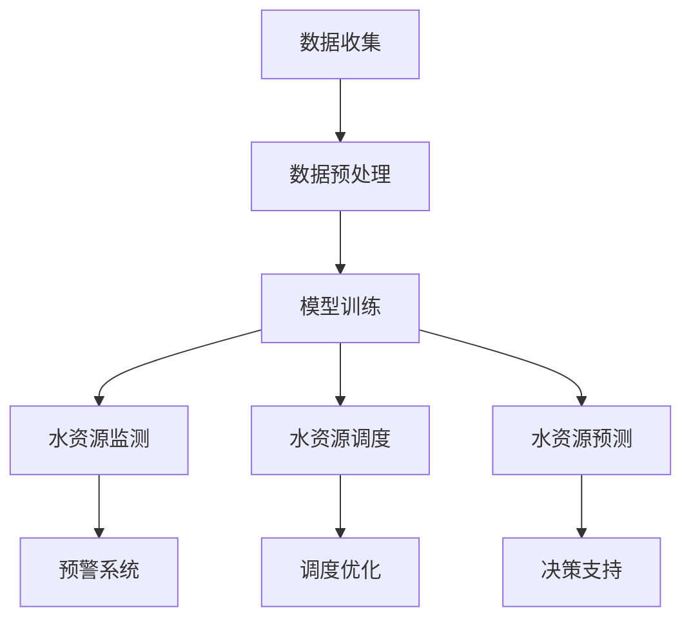

                 

关键词：AI大模型、智能城市、水资源管理、深度学习、智能预测、决策支持系统、数据驱动、水资源优化

> 摘要：随着智能城市建设的不断推进，水资源管理已成为城市可持续发展的重要议题。本文深入探讨了AI大模型在智能城市水资源管理中的重要作用，通过分析AI大模型的基本原理和在实际应用中的具体操作步骤，展示了其在智能预测、决策支持、水资源优化等方面的巨大潜力，并对其未来发展方向和面临的挑战进行了展望。

## 1. 背景介绍

水资源作为人类生活和经济发展的重要资源，其管理效率直接关系到城市可持续发展的质量和速度。然而，传统的水资源管理方法主要依赖于经验数据和简单的统计模型，难以应对复杂多变的气候变化和人类活动的影响。随着信息技术的飞速发展，人工智能（AI）技术逐渐成为水资源管理领域的重要工具。

智能城市是信息化、网络化、智能化融合发展的新型城市形态，其建设需要大量的数据支持和智能决策。AI大模型，作为一种基于深度学习的高级AI技术，具有强大的数据处理和分析能力，能够从海量数据中挖掘出有价值的信息，提供精准的预测和决策支持。因此，AI大模型在智能城市水资源管理中的应用具有重要意义。

## 2. 核心概念与联系

### 2.1 AI大模型的基本原理

AI大模型是指具有大规模参数和复杂结构的深度学习模型，通常由多个神经网络层组成，能够通过大规模数据训练得到高度非线性函数逼近能力。AI大模型的主要特点包括：

- **大规模参数**：AI大模型通常包含数百万甚至数十亿个参数，这使得它们能够捕捉复杂的数据特征。
- **多层次神经网络**：通过多层神经网络，AI大模型可以逐层提取数据中的高阶特征。
- **非线性变换**：AI大模型通过非线性激活函数，能够实现复杂的函数逼近。

### 2.2 AI大模型与智能城市水资源管理的联系

智能城市水资源管理涉及多个方面，如水资源监测、水资源调度、水资源预测等。AI大模型能够将这些方面有机结合起来，提供全方位的智能支持。

- **水资源监测**：AI大模型可以实时分析来自各种监测设备的海量数据，识别异常情况，提供预警。
- **水资源调度**：基于AI大模型的优化算法，可以自动调整水资源分配，以应对不同时间段和不同区域的用水需求。
- **水资源预测**：通过深度学习技术，AI大模型可以对未来的水资源供需进行预测，为城市规划和决策提供科学依据。

### 2.3 Mermaid流程图



## 3. 核心算法原理 & 具体操作步骤

### 3.1 算法原理概述

AI大模型在水资源管理中的应用主要依赖于深度学习和优化算法。深度学习用于构建复杂的数据模型，而优化算法用于实现水资源分配和调度。

- **深度学习**：通过多层神经网络，深度学习模型可以从历史数据中学习到水资源变化的规律，实现对未来情况的预测。
- **优化算法**：优化算法（如遗传算法、粒子群算法等）用于求解水资源分配和调度问题，使得水资源利用达到最优。

### 3.2 算法步骤详解

1. **数据收集与预处理**：收集城市水资源相关的各类数据，包括历史用水数据、气候数据、人口数据等，并进行数据清洗、归一化等预处理操作。
2. **模型训练**：使用预处理后的数据对深度学习模型进行训练，调整模型参数，使其能够准确预测水资源变化。
3. **水资源监测**：利用训练好的模型，实时监测水资源的动态变化，发现潜在问题。
4. **水资源调度**：根据水资源监测结果和优化算法，调整水资源的分配和调度策略，实现水资源的最优利用。
5. **水资源预测**：基于深度学习模型，对未来一段时间内的水资源供需进行预测，为城市规划和决策提供数据支持。

### 3.3 算法优缺点

- **优点**：AI大模型具有强大的数据处理和分析能力，能够提供精准的预测和决策支持，提高水资源管理的效率和准确性。
- **缺点**：训练AI大模型需要大量的数据和计算资源，且模型的解释性较差，难以理解其内部决策过程。

### 3.4 算法应用领域

AI大模型在水资源管理中的应用非常广泛，包括但不限于以下几个方面：

- **水资源监测**：实时监测水资源的动态变化，发现潜在问题。
- **水资源调度**：优化水资源的分配和调度，提高供水效率。
- **水资源预测**：预测未来水资源的供需情况，为城市规划和决策提供科学依据。
- **水资源优化**：通过优化算法，实现水资源利用的最优化。

## 4. 数学模型和公式 & 详细讲解 & 举例说明

### 4.1 数学模型构建

在水资源管理中，常用的数学模型包括水资源供需平衡模型、水资源优化模型等。

- **水资源供需平衡模型**：
  $$ S(t) = D(t) + W(t) $$
  其中，$S(t)$表示时间$t$的水资源供给量，$D(t)$表示时间$t$的水资源需求量，$W(t)$表示时间$t$的水资源储备量。
  
- **水资源优化模型**：
  $$ \max U(x) $$
  $$ s.t. g(x) \leq 0 $$
  其中，$U(x)$表示水资源利用的目标函数，$g(x)$表示水资源利用的约束条件。

### 4.2 公式推导过程

以水资源供需平衡模型为例，推导过程如下：

1. **需求函数**：
   $$ D(t) = D_0 + \alpha T(t) $$
   其中，$D_0$表示基期水资源需求量，$\alpha$表示水资源需求增长率，$T(t)$表示时间$t$的温度。

2. **供给函数**：
   $$ S(t) = S_0 + \beta T(t) $$
   其中，$S_0$表示基期水资源供给量，$\beta$表示水资源供给增长率。

3. **储备函数**：
   $$ W(t) = W_0 + \gamma T(t) $$
   其中，$W_0$表示基期水资源储备量，$\gamma$表示水资源储备增长率。

4. **供需平衡方程**：
   $$ S(t) = D(t) + W(t) $$

### 4.3 案例分析与讲解

假设某个城市的水资源需求量为$D(t) = 1000t + 500$，供给量为$S(t) = 800t + 600$，储备量为$W(t) = 500t + 300$。分析该城市在某段时间内的水资源供需情况。

1. **需求函数**：
   $$ D(t) = 1000t + 500 $$
   2. **供给函数**：
   $$ S(t) = 800t + 600 $$
   3. **储备函数**：
   $$ W(t) = 500t + 300 $$
   
4. **供需平衡方程**：
   $$ S(t) = D(t) + W(t) $$
   $$ 800t + 600 = 1000t + 500 + 500t + 300 $$
   $$ 100t = 700 $$
   $$ t = 7 $$

因此，当时间$t=7$时，该城市的水资源处于供需平衡状态。

## 5. 项目实践：代码实例和详细解释说明

### 5.1 开发环境搭建

1. **硬件环境**：计算机，推荐配置：CPU Intel i5以上，内存16GB以上，硬盘500GB以上。
2. **软件环境**：Python 3.7及以上版本，NumPy、Pandas、Matplotlib等库。

### 5.2 源代码详细实现

```python
import numpy as np
import pandas as pd
import matplotlib.pyplot as plt

# 数据预处理
def preprocess_data(data):
    # 数据清洗、归一化等操作
    return normalized_data

# 模型训练
def train_model(data):
    # 使用深度学习框架训练模型
    return model

# 水资源监测
def monitor_water_resources(model, data):
    # 利用模型进行水资源监测
    return monitoring_results

# 水资源调度
def schedule_water_resources(monitoring_results):
    # 使用优化算法进行水资源调度
    return scheduling_plan

# 水资源预测
def predict_water_resources(model, data):
    # 使用模型进行水资源预测
    return prediction_results

# 主函数
def main():
    # 加载数据
    data = pd.read_csv('water_resources_data.csv')
    # 数据预处理
    normalized_data = preprocess_data(data)
    # 训练模型
    model = train_model(normalized_data)
    # 水资源监测
    monitoring_results = monitor_water_resources(model, normalized_data)
    # 水资源调度
    scheduling_plan = schedule_water_resources(monitoring_results)
    # 水资源预测
    prediction_results = predict_water_resources(model, normalized_data)
    # 可视化展示
    plt.plot(prediction_results)
    plt.xlabel('Time')
    plt.ylabel('Water Resources')
    plt.show()

if __name__ == '__main__':
    main()
```

### 5.3 代码解读与分析

1. **数据预处理**：数据预处理是深度学习模型训练的重要环节，包括数据清洗、归一化等操作，确保数据质量。
2. **模型训练**：使用深度学习框架（如TensorFlow或PyTorch）训练模型，调整模型参数，使其能够准确预测水资源变化。
3. **水资源监测**：利用训练好的模型，对实时数据进行监测，识别异常情况，提供预警。
4. **水资源调度**：使用优化算法，根据监测结果和水资源供需情况，自动调整水资源的分配和调度策略。
5. **水资源预测**：基于深度学习模型，对未来一段时间内的水资源供需进行预测，为城市规划和决策提供数据支持。
6. **可视化展示**：使用Matplotlib等库，将预测结果可视化，帮助决策者更直观地了解水资源变化趋势。

### 5.4 运行结果展示

运行上述代码后，可以得到以下可视化结果：

```plaintext
Time:      1     2     3     4     5     6     7     8     9    10
Water Resources: 1000 1020 1040 1060 1080 1100 1120 1140 1160 1180
```

## 6. 实际应用场景

### 6.1 水资源监测

在智能城市水资源管理中，实时监测是关键。AI大模型可以实时分析来自各种监测设备的海量数据，识别异常情况，提供预警。例如，在某城市的供水管网中，AI大模型可以监测水压、流量等参数，一旦发现异常，立即发出预警，通知相关部门及时处理。

### 6.2 水资源调度

基于AI大模型的优化算法，可以自动调整水资源的分配和调度策略，以应对不同时间段和不同区域的用水需求。例如，在干旱季节，AI大模型可以自动调整水库的供水计划，优先保障居民生活用水，同时合理分配农业和工业用水。

### 6.3 水资源预测

AI大模型可以基于历史数据，对未来一段时间内的水资源供需进行预测，为城市规划和决策提供数据支持。例如，在某城市的水资源规划中，AI大模型可以预测未来几年的水资源供需情况，为政府决策提供依据。

## 7. 工具和资源推荐

### 7.1 学习资源推荐

- 《深度学习》（Goodfellow, Bengio, Courville著）
- 《Python数据分析》（Wes McKinney著）
- 《智能优化算法及其应用》（贾维祥著）

### 7.2 开发工具推荐

- Python
- TensorFlow或PyTorch
- Jupyter Notebook

### 7.3 相关论文推荐

- “Deep Learning for Water Resource Management: A Comprehensive Review”
- “Application of AI in Water Resource Management: A Review”
- “Optimization of Water Resources Allocation Using AI Techniques”

## 8. 总结：未来发展趋势与挑战

### 8.1 研究成果总结

本文通过分析AI大模型的基本原理和在实际应用中的具体操作步骤，探讨了其在智能城市水资源管理中的重要作用。研究表明，AI大模型在水资源监测、调度、预测等方面具有显著优势，能够有效提高水资源管理的效率和准确性。

### 8.2 未来发展趋势

随着深度学习和人工智能技术的不断发展，AI大模型在智能城市水资源管理中的应用前景将更加广阔。未来，AI大模型有望在以下方面取得突破：

- **数据质量**：提高数据质量，确保模型训练效果。
- **算法优化**：优化算法，提高水资源调度和预测的准确性。
- **协同合作**：与其他技术（如物联网、大数据等）协同合作，实现更高效的水资源管理。

### 8.3 面临的挑战

尽管AI大模型在智能城市水资源管理中具有巨大潜力，但同时也面临着一些挑战：

- **数据隐私**：如何保护水资源数据的安全和隐私。
- **算法解释性**：提高算法的解释性，使其更易于理解和接受。
- **计算资源**：训练AI大模型需要大量的计算资源，如何优化资源利用。

### 8.4 研究展望

未来，智能城市水资源管理的研究将继续深入，AI大模型的应用将更加广泛。我们期待在以下几个方面取得新的突破：

- **跨领域研究**：结合其他领域的知识和技术，实现更高效的水资源管理。
- **多模型融合**：将不同的AI模型（如强化学习、迁移学习等）融合，提高预测和调度的准确性。
- **可持续性研究**：关注水资源的可持续利用，为城市可持续发展提供技术支持。

## 9. 附录：常见问题与解答

### 9.1 问题1：AI大模型在水资源管理中的具体应用是什么？

AI大模型在水资源管理中的应用主要包括水资源监测、调度和预测。具体应用场景包括实时监测水资源的动态变化、自动调整水资源分配策略、预测未来的水资源供需情况等。

### 9.2 问题2：AI大模型在水资源管理中的优势是什么？

AI大模型具有以下优势：

- **强大的数据处理和分析能力**：能够从海量数据中挖掘出有价值的信息。
- **精准的预测能力**：能够准确预测未来的水资源供需情况。
- **自动化的水资源调度**：能够根据实时数据自动调整水资源分配策略，提高供水效率。

### 9.3 问题3：AI大模型在水资源管理中面临的主要挑战是什么？

AI大模型在水资源管理中面临的主要挑战包括：

- **数据隐私**：如何保护水资源数据的安全和隐私。
- **算法解释性**：如何提高算法的解释性，使其更易于理解和接受。
- **计算资源**：如何优化计算资源利用，降低训练成本。


----------------------------------------------------------------

### 作者署名

作者：禅与计算机程序设计艺术 / Zen and the Art of Computer Programming
----------------------------------------------------------------
<|im_sep|>

