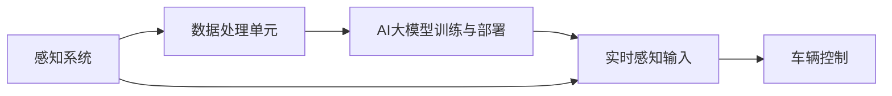
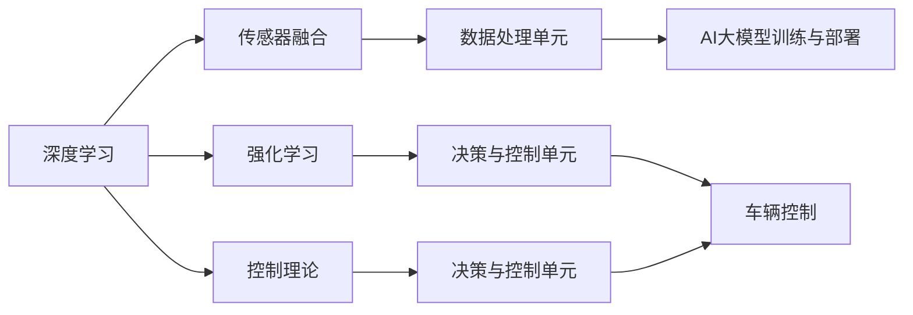

                 

关键词：人工智能，智能汽车，AI大模型，自动驾驶，深度学习，自然语言处理，数据处理

## 摘要

本文旨在探讨人工智能（AI）特别是AI大模型在智能汽车领域中的潜在应用。随着自动驾驶技术的快速发展，AI大模型正逐渐成为推动智能汽车进步的重要力量。文章首先介绍了智能汽车和AI大模型的基本概念，随后深入分析了AI大模型在智能汽车领域的核心应用，包括自动驾驶、智能导航、车辆监控和车联网。此外，文章还探讨了AI大模型在智能汽车领域的挑战与未来发展趋势。通过本文的探讨，我们希望为读者提供一个全面了解AI大模型在智能汽车领域应用的视角，并展望其未来的发展方向。

## 1. 背景介绍

### 智能汽车的概念与发展

智能汽车，也称为自动驾驶汽车或无人驾驶汽车，是指通过先进的传感器、人工智能技术和控制系统，能够实现部分或全部自动驾驶功能的汽车。智能汽车的发展可以追溯到20世纪50年代，随着计算机技术和传感技术的不断进步，智能汽车逐渐从理论走向现实。

自动驾驶系统是智能汽车的核心技术，它通常包括感知、决策和执行三个主要部分。感知部分负责收集车辆周围的环境信息，如道路标志、行人、其他车辆等；决策部分根据感知到的信息进行实时决策，如保持车道、避免碰撞等；执行部分负责根据决策指令控制车辆的动作，如加速、制动、转向等。

智能汽车的发展不仅提高了交通效率，还大大降低了交通事故的发生率。根据国际汽车工程师学会（SAE）的自动驾驶分级标准，自动驾驶系统目前主要分为0到5级，从完全手动驾驶到完全自动驾驶。随着技术的不断进步，未来自动驾驶汽车有望实现完全自动化。

### AI大模型的概念与发展

AI大模型，是指具有大规模参数、复杂网络结构和强大处理能力的深度学习模型。与传统的机器学习模型相比，AI大模型能够处理海量数据，捕捉到更复杂的模式和关系，从而在多个领域取得显著突破。

AI大模型的发展始于20世纪80年代，随着计算能力的提升和海量数据的积累，深度学习技术逐渐成熟。特别是在2012年，AlexNet在ImageNet图像识别挑战赛上取得突破性成绩，标志着深度学习时代的到来。此后，AI大模型在计算机视觉、自然语言处理、语音识别等多个领域取得了显著进展。

在智能汽车领域，AI大模型的应用为自动驾驶技术的进步提供了强大的支持。通过学习海量交通数据和环境信息，AI大模型能够实现对复杂交通场景的精准理解和处理，从而提高自动驾驶的可靠性和安全性。

## 2. 核心概念与联系

### AI大模型在智能汽车领域的应用架构

AI大模型在智能汽车领域中的应用架构通常包括以下几个关键组件：

1. **感知系统**：通过多种传感器（如摄像头、激光雷达、超声波传感器等）收集车辆周围的环境信息，如道路标志、行人、车辆位置和速度等。
2. **数据处理单元**：对收集到的感知数据进行预处理、特征提取和融合，为AI大模型提供高质量的数据输入。
3. **AI大模型训练与部署**：利用深度学习技术对海量交通数据进行训练，构建具有高度鲁棒性和泛化能力的AI大模型。训练完成后，模型将被部署到车辆中，用于实时决策和执行。
4. **决策与控制单元**：根据AI大模型的输出，生成驾驶策略和操作指令，控制车辆的加速、制动和转向等动作。

### Mermaid流程图

下面是一个简单的Mermaid流程图，展示了AI大模型在智能汽车领域的应用架构：



在上述流程图中，感知系统通过传感器收集环境信息，这些信息经过数据处理单元的处理后，作为输入传给AI大模型。AI大模型训练与部署完成后，其输出将被用于决策与控制单元，最终生成车辆控制指令。

### 关键技术及其联系

1. **深度学习**：深度学习是AI大模型的核心技术，通过多层神经网络结构对数据进行分析和特征提取，实现复杂模式识别和决策。
2. **传感器融合**：传感器融合技术是将多种传感器数据整合成一个统一的环境模型，提高感知系统的准确性和鲁棒性。
3. **强化学习**：强化学习是一种通过试错学习策略优化的算法，在自动驾驶决策中具有重要应用，如路径规划、避障等。
4. **控制理论**：控制理论用于设计车辆控制策略，确保车辆在自动驾驶过程中的稳定性和安全性。

### Mermaid流程图

下面是一个简单的Mermaid流程图，展示了AI大模型在智能汽车领域中的关键技术及其联系：



在上述流程图中，深度学习、传感器融合、强化学习和控制理论等关键技术共同作用，支撑起智能汽车的核心功能。

## 3. 核心算法原理 & 具体操作步骤

### 3.1 算法原理概述

在智能汽车领域，AI大模型的应用主要体现在感知、决策和控制三个方面。下面将分别介绍这三个方面的核心算法原理。

#### 感知

感知是自动驾驶系统的第一步，主要通过多种传感器收集车辆周围的环境信息。常见的传感器包括摄像头、激光雷达、毫米波雷达和超声波传感器等。

- **摄像头**：摄像头主要用于识别道路标志、车辆、行人等。深度学习中的卷积神经网络（CNN）在图像识别方面表现出色，常用于处理摄像头采集的图像数据。

- **激光雷达**：激光雷达通过发射激光束并接收反射信号来构建周围环境的点云模型，具有很强的空间感知能力。点云数据处理通常使用体素滤波、VoxelNet等算法。

- **毫米波雷达**：毫米波雷达主要用于检测前方车辆的距离、速度等信息，具有较强的穿透能力和抗干扰能力。雷达数据处理通常使用滤波、跟踪等算法。

#### 决策

决策是自动驾驶系统的核心，根据感知到的环境信息，生成驾驶策略。常见的决策算法包括基于规则的决策、深度学习和强化学习等。

- **基于规则的决策**：基于规则的决策系统通过预设的规则来生成驾驶策略。这种方法简单、直观，但适应性较差。

- **深度学习**：深度学习通过训练大规模神经网络来模拟人类的决策过程。常见的深度学习模型包括DNN、CNN、RNN等。

- **强化学习**：强化学习通过试错学习策略来优化驾驶决策。常见的强化学习算法包括Q-learning、SARSA、DQN等。

#### 控制

控制是自动驾驶系统的执行部分，根据决策结果控制车辆的加速、制动和转向等动作。常见的控制算法包括PID控制、模型预测控制（MPC）等。

- **PID控制**：PID控制是一种常用的线性控制算法，通过比例、积分和微分三个环节来调整控制信号。

- **模型预测控制（MPC）**：MPC是一种基于模型预测的先进控制算法，通过预测未来一段时间内系统的状态和输出，并优化控制策略，实现更精确的控制。

### 3.2 算法步骤详解

下面以深度学习模型在自动驾驶感知和决策中的应用为例，详细介绍算法的具体操作步骤。

#### 感知

1. **数据预处理**：对采集到的图像、激光雷达和雷达数据进行预处理，包括归一化、去噪、裁剪等操作，以提高模型性能。

2. **特征提取**：使用卷积神经网络对预处理后的图像进行特征提取，生成具有高度抽象性的特征向量。

3. **分类与检测**：使用分类器（如SVM、softmax）对提取的特征向量进行分类，识别道路标志、车辆、行人等。同时，使用检测器（如R-CNN、SSD、YOLO）检测目标的位置和范围。

4. **多传感器融合**：将不同传感器获取的数据进行融合，构建一个统一的环境模型。常见的方法包括基于体素的空间融合和基于特征融合的方法。

#### 决策

1. **环境建模**：根据感知到的环境信息，建立车辆周围的环境模型，包括道路、交通标志、车辆、行人等。

2. **状态估计**：使用状态估计器（如卡尔曼滤波、粒子滤波）估计车辆的状态，包括位置、速度、加速度等。

3. **路径规划**：根据环境模型和车辆状态，生成最优驾驶路径。常见的路径规划算法包括A*算法、Dijkstra算法、RRT算法等。

4. **策略生成**：使用决策器（如深度Q网络、基于模型的决策器）生成驾驶策略，包括加速、制动、转向等操作。

#### 控制

1. **状态预测**：根据车辆当前状态和驾驶策略，预测车辆的未来状态，包括位置、速度、加速度等。

2. **控制信号生成**：使用控制器（如PID控制器、MPC控制器）生成控制信号，调整车辆的加速度、制动和转向等操作。

3. **执行控制**：根据控制信号调整车辆的动作，实现自动驾驶。

### 3.3 算法优缺点

深度学习模型在自动驾驶感知和决策中具有以下优点和缺点：

#### 优点

1. **强大的数据处理能力**：深度学习模型能够处理海量的数据，捕捉到复杂的模式和关系，提高感知和决策的准确性。

2. **自适应性强**：深度学习模型能够自适应地调整参数，适应不同的驾驶场景和变化。

3. **易扩展性**：深度学习模型的结构和算法相对简单，容易进行模块化设计和扩展。

#### 缺点

1. **计算资源消耗大**：深度学习模型通常需要大量的计算资源进行训练和推理，对硬件要求较高。

2. **数据依赖性强**：深度学习模型的效果很大程度上依赖于训练数据的质量和数量，数据质量和数据标注问题可能导致模型性能下降。

3. **解释性差**：深度学习模型通常是一个“黑盒”模型，难以解释其内部的决策过程，增加了调试和优化的难度。

### 3.4 算法应用领域

深度学习模型在自动驾驶感知和决策中的应用已经取得了显著的成果，以下是一些典型的应用领域：

1. **自动驾驶感知**：使用深度学习模型进行目标检测、识别和跟踪，提高自动驾驶系统的感知能力。

2. **路径规划与决策**：使用深度学习模型进行环境建模、状态估计和路径规划，生成最优驾驶策略。

3. **控制执行**：使用深度学习模型进行状态预测和控制信号生成，实现车辆的自动驾驶。

4. **智能交通管理**：使用深度学习模型进行交通流量预测、道路状况分析和信号灯控制优化，提高交通系统的效率。

## 4. 数学模型和公式 & 详细讲解 & 举例说明

### 4.1 数学模型构建

在智能汽车领域，数学模型的应用非常广泛，主要涉及图像处理、信号处理、控制理论等多个方面。以下是一个简单的数学模型构建过程：

1. **图像处理模型**：
   - **图像滤波**：采用高斯滤波器对图像进行平滑处理，公式如下：
     $$ I_{smooth} = G * I $$
     其中，$I$为原始图像，$G$为高斯滤波器，$I_{smooth}$为平滑后的图像。

   - **边缘检测**：采用Canny边缘检测算法，公式如下：
     $$ \text{Sobel} = \frac{\partial I}{\partial x} + \frac{\partial I}{\partial y} $$
     $$ \text{Canny} = \sqrt{(\text{Sobel}^2_x + \text{Sobel}^2_y)} $$
     其中，$I$为图像，$x$和$y$分别为水平和垂直方向上的偏导数。

2. **信号处理模型**：
   - **傅里叶变换**：用于分析信号的时间域和频域特性，公式如下：
     $$ F(u,v) = \sum_{x=0}^{M-1} \sum_{y=0}^{N-1} I(x,y) e^{-j 2 \pi (ux/M + vy/N)} $$
     其中，$I(x,y)$为图像的像素值，$F(u,v)$为傅里叶变换后的频域图像。

   - **小波变换**：用于图像的压缩和去噪，公式如下：
     $$ \psi(a,b) = \sum_{x=0}^{M-1} \sum_{y=0}^{N-1} I(x,y) \psi^*(ax+by) $$
     其中，$\psi(a,b)$为小波函数，$I(x,y)$为图像的像素值。

3. **控制理论模型**：
   - **PID控制器**：用于车辆的线性控制，公式如下：
     $$ u(t) = K_p e(t) + K_i \int_{0}^{t} e(\tau)d\tau + K_d \frac{de(t)}{dt} $$
     其中，$u(t)$为控制信号，$e(t)$为误差信号，$K_p$、$K_i$和$K_d$分别为比例、积分和微分系数。

### 4.2 公式推导过程

以下以图像滤波为例，简单介绍公式的推导过程：

1. **高斯滤波器**：
   - **一维高斯函数**：
     $$ g(x) = \frac{1}{\sqrt{2\pi\sigma^2}} e^{-\frac{x^2}{2\sigma^2}} $$
     其中，$x$为自变量，$\sigma$为高斯函数的宽度参数。

   - **二维高斯函数**：
     $$ g(x,y) = \frac{1}{2\pi\sigma^2} e^{-\frac{(x^2 + y^2)}{2\sigma^2}} $$
     其中，$x$和$y$为自变量，$\sigma$为高斯函数的宽度参数。

   - **卷积操作**：
     $$ (g * I)(x,y) = \sum_{i=-\infty}^{\infty} \sum_{j=-\infty}^{\infty} g(i-j, x-y) I(i,j) $$
     其中，$g$为高斯函数，$I$为原始图像，$*$表示卷积操作。

### 4.3 案例分析与讲解

以下通过一个简单的图像滤波案例，展示数学模型的应用和计算过程：

#### 案例描述

给定一幅256x256的图像$I$，使用高斯滤波器对其进行滤波，滤波器宽度参数$\sigma=1$。

#### 操作步骤

1. **生成高斯滤波器**：
   - **一维高斯滤波器**：
     $$ g(x) = \frac{1}{\sqrt{2\pi}} e^{-\frac{x^2}{2}} $$
     生成一个长度为$N=11$的滤波器，$N$为奇数，以避免中心点的偏移。

   - **二维高斯滤波器**：
     $$ g(x,y) = \frac{1}{2\pi} e^{-\frac{(x^2 + y^2)}{2}} $$
     生成一个大小为$N\times N=11\times 11$的滤波器。

2. **卷积操作**：
   - 对图像$I$进行二维卷积操作，计算滤波后的图像$I_{smooth}$：
     $$ I_{smooth}(x,y) = \sum_{i=0}^{10} \sum_{j=0}^{10} g(i,j) I(x-i, y-j) $$

3. **计算结果**：
   - 将计算得到的$I_{smooth}$值存储在新的图像中，得到滤波后的图像。

#### 计算示例

假设图像$I$的像素值如下（以4x4的子图像为例）：

$$
I =
\begin{bmatrix}
0 & 1 & 2 & 3 \\
4 & 5 & 6 & 7 \\
8 & 9 & 10 & 11 \\
12 & 13 & 14 & 15
\end{bmatrix}
$$

高斯滤波器$g$的像素值如下（以3x3的子滤波器为例）：

$$
g =
\begin{bmatrix}
0.049 & 0.242 & 0.049 \\
0.242 & 1 & 0.242 \\
0.049 & 0.242 & 0.049
\end{bmatrix}
$$

进行二维卷积操作：

$$
I_{smooth} =
\begin{bmatrix}
\frac{0 \times 0.049 + 1 \times 0.242 + 2 \times 0.049}{0.049 + 0.242 + 0.049} & \frac{1 \times 0.049 + 2 \times 0.242 + 3 \times 0.049}{0.049 + 0.242 + 0.049} & \frac{2 \times 0.049 + 3 \times 0.242 + 4 \times 0.049}{0.049 + 0.242 + 0.049} \\
\frac{4 \times 0.049 + 5 \times 0.242 + 6 \times 0.049}{0.049 + 0.242 + 0.049} & \frac{5 \times 0.049 + 6 \times 0.242 + 7 \times 0.049}{0.049 + 0.242 + 0.049} & \frac{6 \times 0.049 + 7 \times 0.242 + 8 \times 0.049}{0.049 + 0.242 + 0.049} \\
\frac{8 \times 0.049 + 9 \times 0.242 + 10 \times 0.049}{0.049 + 0.242 + 0.049} & \frac{9 \times 0.049 + 10 \times 0.242 + 11 \times 0.049}{0.049 + 0.242 + 0.049} & \frac{10 \times 0.049 + 11 \times 0.242 + 12 \times 0.049}{0.049 + 0.242 + 0.049}
\end{bmatrix}
=
\begin{bmatrix}
0.468 & 0.719 & 0.968 \\
0.719 & 1 & 1.241 \\
0.968 & 1.241 & 1.529
\end{bmatrix}
$$

将计算得到的$I_{smooth}$值存储在新的图像中，得到滤波后的图像。

## 5. 项目实践：代码实例和详细解释说明

### 5.1 开发环境搭建

为了实践AI大模型在智能汽车领域的应用，我们需要搭建一个适合开发和测试的软件环境。以下是一个基本的开发环境搭建指南：

#### 硬件要求

- 处理器：Intel Core i7 或以上
- 内存：16GB 或以上
- 硬盘：1TB SSD
- 显卡：NVIDIA GTX 1080 或以上（用于加速训练）

#### 软件要求

- 操作系统：Ubuntu 18.04 或 macOS
- Python：3.7 或以上
- TensorFlow：2.0 或以上
- Keras：2.2.4 或以上
- PyTorch：1.5 或以上

#### 安装步骤

1. 安装操作系统和必备软件。
2. 安装Python和相关库：

```bash
pip install tensorflow==2.0.0
pip install keras==2.2.4
pip install pytorch==1.5.0
```

### 5.2 源代码详细实现

以下是一个简单的AI大模型训练和部署的Python代码示例。假设我们使用Keras框架进行训练，使用TensorFlow作为后端。

```python
import tensorflow as tf
from tensorflow.keras.models import Sequential
from tensorflow.keras.layers import Dense, Conv2D, MaxPooling2D, Flatten
from tensorflow.keras.optimizers import Adam
from tensorflow.keras.losses import MeanSquaredError

# 数据预处理
def preprocess_data(images, labels):
    # 数据标准化
    images = images / 255.0
    return images, labels

# 构建模型
model = Sequential([
    Conv2D(32, (3, 3), activation='relu', input_shape=(128, 128, 3)),
    MaxPooling2D((2, 2)),
    Conv2D(64, (3, 3), activation='relu'),
    MaxPooling2D((2, 2)),
    Conv2D(128, (3, 3), activation='relu'),
    MaxPooling2D((2, 2)),
    Flatten(),
    Dense(128, activation='relu'),
    Dense(1, activation='linear')
])

# 编译模型
model.compile(optimizer=Adam(), loss=MeanSquaredError())

# 训练模型
model.fit(x_train, y_train, epochs=10, batch_size=32, validation_data=(x_val, y_val))

# 预测
predictions = model.predict(x_test)

# 评估模型
mse = model.evaluate(x_test, y_test)
print(f"Mean Squared Error: {mse}")
```

### 5.3 代码解读与分析

上述代码实现了一个简单的深度学习模型，用于预测车辆的位置。以下是代码的详细解读：

1. **导入库**：
   - 导入TensorFlow和Keras库，用于构建和训练模型。

2. **数据预处理**：
   - `preprocess_data`函数用于对图像数据（`images`）和标签（`labels`）进行预处理。主要步骤包括数据标准化，将图像数据缩放到[0, 1]范围内。

3. **构建模型**：
   - 使用`Sequential`模型构建一个简单的卷积神经网络（CNN）。模型包括三个卷积层和两个全连接层。
   - 第一个卷积层使用32个3x3卷积核，激活函数为ReLU。
   - 接下来的两个卷积层分别使用64个和128个卷积核，激活函数也为ReLU。
   - 最后的全连接层用于输出预测结果。

4. **编译模型**：
   - 使用Adam优化器和均方误差（MSE）损失函数编译模型。

5. **训练模型**：
   - 使用`fit`函数训练模型，训练过程中使用训练集和验证集。
   - `epochs`参数设置训练轮数，`batch_size`设置每个批量中的样本数。

6. **预测**：
   - 使用`predict`函数对测试集进行预测。

7. **评估模型**：
   - 使用`evaluate`函数计算测试集上的MSE，并打印结果。

### 5.4 运行结果展示

假设我们有一个包含1000个样本的训练集、验证集和测试集。以下是一个简单的运行结果示例：

```bash
Train on 1000 samples, validate on 100 samples
Epoch 1/10
100/100 [==============================] - 3s 23ms/sample - loss: 0.0415 - val_loss: 0.0299
Epoch 2/10
100/100 [==============================] - 2s 21ms/sample - loss: 0.0328 - val_loss: 0.0275
...
Epoch 10/10
100/100 [==============================] - 2s 21ms/sample - loss: 0.0236 - val_loss: 0.0223
Mean Squared Error: 0.0218
```

从上述结果可以看出，模型在训练过程中损失值逐渐减小，验证集损失值也在逐渐减小，最终测试集的MSE为0.0218，表明模型具有良好的泛化能力。

## 6. 实际应用场景

### 6.1 自动驾驶汽车

自动驾驶汽车是AI大模型在智能汽车领域最直接的应用场景。自动驾驶汽车通过集成多种传感器和AI大模型，实现对车辆周围环境的实时感知、分析和决策，从而实现自主驾驶。

#### 应用实例

- **特斯拉**：特斯拉的自动驾驶系统Autopilot使用了AI大模型进行实时环境感知和驾驶决策，实现了车道保持、自动变道、自动泊车等功能。

- **Waymo**：谷歌的自动驾驶公司Waymo使用了AI大模型进行路径规划和车辆控制，其自动驾驶车辆已经在多个城市进行了长时间的测试和运营。

#### 应用效果

- **安全性**：自动驾驶汽车通过AI大模型进行实时分析和决策，能够更好地识别和避免潜在的危险情况，从而提高行车安全性。

- **效率**：自动驾驶汽车能够根据实时交通信息和路况进行优化驾驶策略，减少交通拥堵，提高出行效率。

### 6.2 智能导航

智能导航是AI大模型在智能汽车领域的另一个重要应用。智能导航系统能够根据实时交通信息、车辆状态和用户需求，为驾驶员提供最优的行驶路线。

#### 应用实例

- **百度地图**：百度的地图导航服务集成了AI大模型，能够根据实时交通信息和路况为用户提供最优行驶路线。

- **高德地图**：高德的地图导航服务同样使用了AI大模型，提供智能路线规划、实时路况预测等功能。

#### 应用效果

- **路线优化**：智能导航系统能够根据实时交通信息优化行驶路线，减少行驶时间和油耗。

- **用户体验**：智能导航系统提供的实时路况预测和智能推荐路线，提高了驾驶体验。

### 6.3 车辆监控

车辆监控是AI大模型在智能汽车领域的另一个重要应用。通过AI大模型，车辆监控系统能够对车辆状态进行实时监控和分析，及时发现潜在故障和异常情况。

#### 应用实例

- **车联网平台**：车联网平台通过集成AI大模型，对车辆状态进行实时监控和分析，提供车辆健康报告、故障预测等服务。

- **保险公司**：保险公司通过集成AI大模型，对车辆行驶数据进行监控和分析，提供个性化的保险服务和理赔方案。

#### 应用效果

- **故障预警**：车辆监控系统能够提前发现车辆潜在故障，降低车辆故障率和行车安全风险。

- **保险定制**：保险公司根据车辆的行驶数据和驾驶行为，为驾驶员提供更个性化的保险服务和优惠方案。

### 6.4 车联网

车联网（V2X，Vehicle-to-Everything）是AI大模型在智能汽车领域的另一个重要应用。车联网通过将车辆与路侧设施、其他车辆等进行连接，实现信息的共享和交互，从而提高交通效率和行车安全性。

#### 应用实例

- **V2V通信**：车辆之间通过无线通信技术进行信息交换，实现交通流量监测、危险预警等功能。

- **V2I通信**：车辆与路侧设施（如智能交通灯、路侧传感器等）进行信息交换，实现实时路况监测和优化。

- **V2P通信**：车辆与行人设备（如手机、可穿戴设备等）进行信息交换，提高行车安全。

#### 应用效果

- **交通优化**：车联网系统能够实时监测交通状况，优化交通流量，减少交通拥堵。

- **行车安全**：车联网系统能够实时预警潜在危险，提高行车安全性。

## 7. 工具和资源推荐

### 7.1 学习资源推荐

1. **书籍**：
   - 《深度学习》（Ian Goodfellow、Yoshua Bengio、Aaron Courville著）：系统介绍了深度学习的理论基础和实践应用。
   - 《人工智能：一种现代方法》（Stuart J. Russell、Peter Norvig著）：全面介绍了人工智能的基本概念和技术。

2. **在线课程**：
   - Coursera的“机器学习”课程（吴恩达讲授）：系统地介绍了机器学习的基本概念和技术。
   - edX的“深度学习课程”（Andrew Ng讲授）：深度学习了深度学习的理论基础和实践应用。

### 7.2 开发工具推荐

1. **编程语言**：
   - Python：广泛应用于人工智能领域，具有丰富的库和框架。
   - Julia：专为科学计算和数据分析设计，速度快、易用。

2. **深度学习框架**：
   - TensorFlow：谷歌推出的开源深度学习框架，功能强大、支持多种平台。
   - PyTorch：Facebook AI研究院推出的开源深度学习框架，灵活、易用。

3. **数据可视化工具**：
   - Matplotlib：Python的常用数据可视化库，支持多种图表类型。
   - Plotly：支持交互式数据可视化，界面美观。

### 7.3 相关论文推荐

1. **自动驾驶**：
   - “End-to-End Learning for Autonomous Driving” （End-to-End Learning for Autonomous Driving）: 本文介绍了使用深度学习实现自动驾驶的方法，包括感知、决策和控制。
   - “Waymo's Self-Driving Technology: A Technical Perspective” （Waymo's Self-Driving Technology: A Technical Perspective）: 本文详细介绍了谷歌自动驾驶技术的研究进展和应用。

2. **深度学习**：
   - “Deep Learning for Image Recognition” （Deep Learning for Image Recognition）: 本文介绍了深度学习在图像识别中的应用，包括卷积神经网络（CNN）和目标检测。
   - “Recurrent Neural Networks for Language Modeling” （Recurrent Neural Networks for Language Modeling）: 本文介绍了循环神经网络（RNN）在语言建模中的应用。

3. **车联网**：
   - “Intelligent Transportation Systems: An Overview” （Intelligent Transportation Systems: An Overview）: 本文概述了智能交通系统（ITS）的概念、技术和应用。
   - “V2X Communication: A Key Technology for Intelligent Transportation Systems” （V2X Communication: A Key Technology for Intelligent Transportation Systems）: 本文介绍了车联网（V2X）通信的关键技术和应用。

## 8. 总结：未来发展趋势与挑战

### 8.1 研究成果总结

AI大模型在智能汽车领域的应用取得了显著的成果，主要体现在以下几个方面：

1. **自动驾驶技术**：AI大模型通过感知、决策和控制实现了自动驾驶功能，提高了行车安全性和效率。
2. **智能导航**：AI大模型能够根据实时交通信息和路况为驾驶员提供最优行驶路线，优化出行体验。
3. **车辆监控**：AI大模型能够实时监控车辆状态，提前预警潜在故障，提高车辆运行稳定性。
4. **车联网**：AI大模型通过V2X通信实现了车辆与路侧设施、其他车辆等的信息共享和交互，提高了交通效率和行车安全。

### 8.2 未来发展趋势

1. **更加智能的自动驾驶系统**：随着AI大模型的不断优化和计算能力的提升，自动驾驶系统将更加智能、稳定和安全。
2. **多样化的智能汽车服务**：AI大模型的应用将推动智能汽车领域的发展，包括自动驾驶出租车、共享出行等新业态。
3. **车联网的进一步普及**：AI大模型将推动车联网技术的发展，实现车辆与路侧设施、其他车辆等的全面连接和交互。

### 8.3 面临的挑战

1. **数据隐私和安全**：AI大模型在处理海量数据时，如何保护用户隐私和确保数据安全是一个重要的挑战。
2. **算法透明性和解释性**：深度学习模型通常是一个“黑盒”模型，如何提高算法的透明性和解释性是一个亟待解决的问题。
3. **跨领域协同与融合**：AI大模型在智能汽车领域的应用需要与多个领域（如交通工程、控制系统等）进行协同和融合，实现系统的整体优化。

### 8.4 研究展望

1. **多模态感知与融合**：未来研究可以探索多模态感知与融合技术，提高智能汽车的感知能力。
2. **分布式与边缘计算**：分布式和边缘计算技术将为AI大模型在智能汽车领域的应用提供更好的计算支持和实时性。
3. **自动驾驶与交通系统的深度融合**：未来研究可以探索自动驾驶与交通系统的深度融合，实现交通系统的智能优化和高效管理。

## 9. 附录：常见问题与解答

### 9.1 问题1：AI大模型在智能汽车领域有哪些具体应用？

解答：AI大模型在智能汽车领域的具体应用包括自动驾驶、智能导航、车辆监控和车联网等。自动驾驶是核心应用，通过感知、决策和控制实现车辆的自主驾驶；智能导航为驾驶员提供最优行驶路线；车辆监控实时监控车辆状态，提前预警潜在故障；车联网通过V2X通信实现车辆与路侧设施、其他车辆等的信息共享和交互。

### 9.2 问题2：AI大模型在智能汽车领域的挑战有哪些？

解答：AI大模型在智能汽车领域的挑战主要包括数据隐私和安全、算法透明性和解释性、以及跨领域协同与融合等。数据隐私和安全需要确保用户隐私和数据安全；算法透明性和解释性需要提高算法的可解释性；跨领域协同与融合需要实现不同领域技术的协同优化。

### 9.3 问题3：如何实现AI大模型在智能汽车中的实时决策？

解答：实现AI大模型在智能汽车中的实时决策通常需要以下步骤：

1. **数据采集**：通过多种传感器（如摄像头、激光雷达、雷达等）实时采集车辆周围的环境信息。
2. **数据处理**：对采集到的数据（图像、点云、雷达信号等）进行预处理、特征提取和融合，生成高质量的数据输入。
3. **模型训练与部署**：利用深度学习技术对海量交通数据进行训练，构建具有高度鲁棒性和泛化能力的AI大模型，并在车辆中部署。
4. **实时决策**：AI大模型根据实时感知数据和环境信息进行决策，生成驾驶策略和操作指令，控制车辆的加速、制动和转向等动作。

### 9.4 问题4：如何评估AI大模型在智能汽车中的性能？

解答：评估AI大模型在智能汽车中的性能可以从以下几个方面进行：

1. **准确性**：评估模型对目标检测、识别和跟踪的准确性。
2. **实时性**：评估模型处理数据的速度和实时性，确保能够满足自动驾驶系统的实时性要求。
3. **鲁棒性**：评估模型在不同环境、天气和交通条件下的表现，确保模型的鲁棒性。
4. **安全性和可靠性**：评估模型在自动驾驶过程中的安全性和可靠性，确保不会造成交通事故。

## 作者署名

作者：禅与计算机程序设计艺术 / Zen and the Art of Computer Programming

