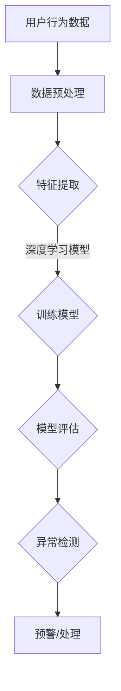

                 

关键词：AI大模型、用户行为异常检测、电商平台、异常检测算法、数学模型、项目实践、未来应用展望

## 摘要

本文旨在探讨AI大模型在电商平台用户行为异常检测中的应用及其重要性。随着电子商务的迅速发展，用户行为数据的海量增长带来了异常行为检测的巨大挑战。通过引入AI大模型，我们能够更高效地识别和预测潜在的用户行为异常，从而提高电商平台的运营效率，保障用户的安全。本文将首先介绍AI大模型的背景和核心概念，随后深入分析其在用户行为异常检测中的作用，并通过数学模型和具体案例进行讲解，最后讨论未来应用展望和面临的挑战。

## 1. 背景介绍

### 1.1 电商平台的快速发展

随着互联网技术的飞速发展，电子商务已经成为人们日常生活中不可或缺的一部分。电商平台不仅改变了人们的购物方式，还极大地推动了全球经济的增长。根据统计数据显示，全球电商市场销售额在过去几年中持续增长，预计未来几年还将保持高速增长。这一趋势带来了大量用户数据，使得电商平台在数据管理和分析方面面临前所未有的挑战。

### 1.2 用户行为数据的复杂性

电商平台用户行为数据具有多样性和复杂性。用户行为包括登录、浏览、搜索、下单、支付、评论等多个方面，这些行为产生大量的数据，包括时间、地理位置、用户ID、商品ID、浏览路径等。这些数据不仅量大，而且动态变化，给数据分析和异常检测带来了巨大的困难。传统的基于规则的方法难以应对这种复杂性，而AI大模型的出现为解决这个问题提供了新的思路。

### 1.3 AI大模型的发展

AI大模型，尤其是深度学习模型，近年来在各个领域取得了显著的成果。这些模型通过学习大量数据，能够自动提取特征并构建复杂的关系网络，从而实现高效的数据分析和预测。在自然语言处理、图像识别、语音识别等领域，AI大模型已经表现出强大的能力和潜力。随着计算能力的提升和大数据技术的成熟，AI大模型的应用范围不断扩大，也逐渐应用于电商平台的用户行为异常检测。

## 2. 核心概念与联系

### 2.1 AI大模型的基本原理

AI大模型，主要是指深度神经网络（Deep Neural Networks，DNN）和其扩展模型，如卷积神经网络（Convolutional Neural Networks，CNN）、循环神经网络（Recurrent Neural Networks，RNN）等。这些模型通过多层神经网络结构，对输入数据进行处理和变换，逐步提取更高层次的特征，从而实现复杂任务的自动学习。

- **深度神经网络（DNN）**：DNN由多个隐藏层组成，通过前向传播和反向传播算法进行训练，能够学习输入数据中的复杂非线性关系。
- **卷积神经网络（CNN）**：CNN在图像处理领域表现出色，通过卷积层和池化层提取图像的局部特征，实现图像分类、物体检测等任务。
- **循环神经网络（RNN）**：RNN能够处理序列数据，通过隐藏状态的记忆和传递，实现自然语言处理、时间序列预测等任务。

### 2.2 用户行为异常检测的基本概念

用户行为异常检测是识别和分析用户行为中不符合正常模式的行为，从而发现潜在的安全威胁或异常行为。在电商平台，用户行为异常可能包括恶意刷单、欺诈交易、账号被盗、异常浏览等。这些异常行为不仅损害电商平台的声誉，还可能带来经济损失。

### 2.3 AI大模型在用户行为异常检测中的应用

AI大模型在用户行为异常检测中的应用主要体现在以下几个方面：

- **特征提取**：通过深度学习模型，自动提取用户行为数据中的隐藏特征，减少人工干预，提高特征提取的准确性和效率。
- **模式识别**：利用训练好的深度学习模型，对用户的实时行为进行模式识别，发现潜在的异常行为。
- **实时预测**：通过在线学习算法，实时更新模型参数，对用户的后续行为进行预测，提前发现潜在的风险。

### 2.4 Mermaid 流程图

下面是一个简化的Mermaid流程图，展示AI大模型在用户行为异常检测中的基本流程：



## 3. 核心算法原理 & 具体操作步骤

### 3.1 算法原理概述

用户行为异常检测的核心算法主要基于深度学习模型，尤其是RNN和CNN。这些模型通过学习用户历史行为数据，能够识别出正常行为和异常行为之间的差异。

- **RNN模型**：通过循环神经网络，能够处理用户的序列行为数据，学习用户行为的时序特征。
- **CNN模型**：通过卷积神经网络，能够处理用户的图像或行为路径数据，提取图像或路径的特征。

### 3.2 算法步骤详解

用户行为异常检测的算法步骤主要包括数据预处理、特征提取、模型训练、模型评估和异常检测。

#### 3.2.1 数据预处理

数据预处理是用户行为异常检测的重要步骤，主要包括以下几个步骤：

- **数据清洗**：去除重复、错误或缺失的数据。
- **数据整合**：将不同来源的数据进行整合，形成统一的数据集。
- **数据归一化**：将数据特征进行归一化处理，使得不同特征的范围一致，便于模型训练。

#### 3.2.2 特征提取

特征提取是用户行为异常检测的核心，通过深度学习模型，自动提取用户行为数据中的隐藏特征。具体步骤如下：

- **数据输入**：将预处理后的用户行为数据输入到深度学习模型中。
- **特征提取**：通过模型的隐藏层，逐步提取用户行为的特征。
- **特征融合**：将提取的特征进行融合，形成多维度的特征向量。

#### 3.2.3 模型训练

模型训练是通过大量用户行为数据，训练深度学习模型，使其能够识别正常行为和异常行为。具体步骤如下：

- **数据划分**：将用户行为数据划分为训练集和测试集。
- **模型初始化**：初始化深度学习模型，设置模型的参数。
- **模型训练**：通过反向传播算法，不断调整模型的参数，使得模型能够在训练集上达到较好的性能。
- **模型验证**：通过测试集验证模型的性能，调整模型参数。

#### 3.2.4 模型评估

模型评估是对训练好的模型进行性能评估，主要指标包括准确率、召回率、F1值等。具体步骤如下：

- **评估指标**：选择合适的评估指标，如准确率、召回率、F1值等。
- **模型测试**：将测试集数据输入到模型中，计算模型的评估指标。
- **结果分析**：分析模型的评估结果，确定模型的性能。

#### 3.2.5 异常检测

异常检测是用户行为异常检测的最后一步，通过训练好的模型，对用户的实时行为进行检测，发现潜在的异常行为。具体步骤如下：

- **实时数据输入**：将用户的实时行为数据输入到模型中。
- **异常检测**：通过模型对用户行为进行判断，识别潜在的异常行为。
- **预警/处理**：对检测到的异常行为进行预警，并采取相应的处理措施。

### 3.3 算法优缺点

用户行为异常检测算法的优缺点如下：

- **优点**：
  - **高效性**：深度学习模型能够自动提取用户行为特征，提高异常检测的效率和准确性。
  - **自适应**：模型能够通过在线学习，实时更新，适应用户行为的动态变化。
  - **灵活性**：能够处理多种类型的数据，如文本、图像、序列数据等。

- **缺点**：
  - **计算资源消耗**：深度学习模型训练需要大量的计算资源，对硬件设备要求较高。
  - **数据依赖**：模型的性能很大程度上依赖于训练数据的质量和数量，数据不足可能导致模型性能下降。

### 3.4 算法应用领域

用户行为异常检测算法在电商平台的多个领域都有广泛的应用，包括：

- **安全防护**：通过异常检测，及时发现并防止恶意行为，如刷单、欺诈交易等。
- **用户体验**：通过分析用户行为，识别用户兴趣和需求，提供个性化的推荐和服务。
- **营销策略**：通过分析用户行为，制定有效的营销策略，提高用户转化率和留存率。

## 4. 数学模型和公式 & 详细讲解 & 举例说明

### 4.1 数学模型构建

用户行为异常检测的核心是构建一个能够有效识别异常行为的数学模型。通常，我们可以将用户行为异常检测视为一个分类问题，即给定一组用户行为特征，判断该行为是否异常。以下是一个简化的数学模型构建过程：

#### 4.1.1 特征表示

首先，我们需要对用户行为特征进行表示。常见的特征表示方法包括：

- **数值特征**：如用户浏览时长、购买频率等。
- **文本特征**：如用户评论、搜索关键词等。
- **图像特征**：如用户头像、商品图片等。

假设我们有一组用户行为特征向量 $X = [x_1, x_2, ..., x_n]$，其中 $x_i$ 表示第 $i$ 个特征。

#### 4.1.2 模型构建

接下来，我们构建一个深度学习模型，如卷积神经网络（CNN），用于学习用户行为特征。

- **输入层**：接收用户行为特征向量 $X$。
- **卷积层**：通过卷积操作提取特征。
- **池化层**：降低特征维度，减少计算量。
- **全连接层**：将卷积层和池化层提取的特征进行融合。
- **输出层**：通过softmax函数输出每个类别的概率。

具体模型结构如下：

$$
\text{CNN}(\text{Input}) = \text{ReLU}(\text{Conv}_1(\text{Input})) \\
\text{CNN}(\text{Input}) = \text{ReLU}(\text{Pool}_1(\text{ReLU}(\text{Conv}_1(\text{Input}))) \\
\text{CNN}(\text{Input}) = \text{FullyConnected}(\text{ReLU}(\text{Pool}_1(\text{ReLU}(\text{Conv}_1(\text{Input})))) \\
\text{Output} = \text{Softmax}(\text{FullyConnected}(\text{ReLU}(\text{Pool}_1(\text{ReLU}(\text{Conv}_1(\text{Input}))))))
$$

### 4.2 公式推导过程

在构建用户行为异常检测模型时，我们需要对模型参数进行优化，以最小化损失函数。以下是一个简化的损失函数推导过程：

#### 4.2.1 前向传播

假设我们有一个卷积神经网络，其输入为 $X$，输出为 $O$。我们定义激活函数为ReLU，损失函数为交叉熵（Cross-Entropy）。

- **前向传播公式**：

$$
Z^{(l)} = \text{ReLU}(\text{W}^{(l)} X + b^{(l)}) \\
O^{(l)} = \text{Softmax}(\text{W}^{(l+1)} Z^{(l)} + b^{(l+1)}) \\
\text{Loss} = -\frac{1}{m} \sum_{i=1}^{m} y_i \log(O_i^{(l)}) + (1 - y_i) \log(1 - O_i^{(l)})
$$

其中，$m$ 为样本数量，$y_i$ 为第 $i$ 个样本的真实标签，$O_i^{(l)}$ 为第 $i$ 个样本在输出层第 $l$ 层的预测概率。

#### 4.2.2 反向传播

为了优化模型参数，我们需要计算损失函数关于模型参数的梯度。以下是一个简化的反向传播过程：

- **损失函数关于输出层的梯度**：

$$
\frac{\partial \text{Loss}}{\partial O^{(l)}} = O^{(l)} - y
$$

- **损失函数关于全连接层的梯度**：

$$
\frac{\partial \text{Loss}}{\partial Z^{(l)}} = \frac{\partial \text{Loss}}{\partial O^{(l)}} \odot \frac{\partial \text{Softmax}}{\partial O^{(l)}} \\
\frac{\partial \text{Softmax}}{\partial O^{(l)}} = O^{(l)} \odot (1 - O^{(l)})
$$

- **损失函数关于卷积层的梯度**：

$$
\frac{\partial \text{Loss}}{\partial X^{(l)}} = \frac{\partial \text{Loss}}{\partial Z^{(l)}} \odot \frac{\partial \text{ReLU}}{\partial Z^{(l)}} \\
\frac{\partial \text{ReLU}}{\partial Z^{(l)}} = \text{ReLU}(\text{W}^{(l)} X + b^{(l)}) \odot (1 - \text{ReLU}(\text{W}^{(l)} X + b^{(l))))
$$

#### 4.2.3 梯度下降优化

为了优化模型参数，我们可以使用梯度下降算法。以下是一个简化的梯度下降过程：

$$
\text{W}^{(l)} = \text{W}^{(l)} - \alpha \frac{\partial \text{Loss}}{\partial \text{W}^{(l)}} \\
b^{(l)} = b^{(l)} - \alpha \frac{\partial \text{Loss}}{\partial b^{(l)}}
$$

其中，$\alpha$ 为学习率。

### 4.3 案例分析与讲解

#### 4.3.1 数据集准备

假设我们有一个电商平台的用户行为数据集，包括用户的浏览历史、购买记录、评论等。我们将数据集划分为训练集和测试集。

- **训练集**：包含1000个用户的行为数据，用于模型训练。
- **测试集**：包含200个用户的行为数据，用于模型评估。

#### 4.3.2 数据预处理

- **数据清洗**：去除重复、错误或缺失的数据。
- **数据整合**：将不同来源的数据进行整合，形成统一的数据集。
- **数据归一化**：将数据特征进行归一化处理，使得不同特征的范围一致。

#### 4.3.3 模型训练

使用训练集数据训练卷积神经网络模型，设置合适的超参数，如学习率、迭代次数等。

#### 4.3.4 模型评估

使用测试集数据对模型进行评估，计算模型的准确率、召回率、F1值等指标。

#### 4.3.5 模型应用

使用训练好的模型对新的用户行为数据进行异常检测，发现潜在的异常行为。

## 5. 项目实践：代码实例和详细解释说明

### 5.1 开发环境搭建

在开始项目实践之前，我们需要搭建一个合适的开发环境。以下是推荐的开发环境和工具：

- **编程语言**：Python
- **深度学习框架**：TensorFlow或PyTorch
- **操作系统**：Linux或MacOS
- **硬件环境**：至少一台具有NVIDIA GPU的计算机

### 5.2 源代码详细实现

以下是一个简化的用户行为异常检测项目实现，使用TensorFlow框架。

```python
import tensorflow as tf
from tensorflow.keras.models import Sequential
from tensorflow.keras.layers import Conv2D, MaxPooling2D, Dense, Flatten, Activation

# 数据预处理
def preprocess_data(data):
    # 数据清洗、整合、归一化
    pass

# 构建模型
def build_model(input_shape):
    model = Sequential([
        Conv2D(32, (3, 3), activation='relu', input_shape=input_shape),
        MaxPooling2D((2, 2)),
        Flatten(),
        Dense(64, activation='relu'),
        Dense(1, activation='sigmoid')
    ])
    model.compile(optimizer='adam', loss='binary_crossentropy', metrics=['accuracy'])
    return model

# 训练模型
def train_model(model, X_train, y_train, X_val, y_val):
    model.fit(X_train, y_train, epochs=10, batch_size=32, validation_data=(X_val, y_val))

# 模型评估
def evaluate_model(model, X_test, y_test):
    loss, accuracy = model.evaluate(X_test, y_test)
    print(f"Test accuracy: {accuracy:.2f}")

# 主程序
if __name__ == '__main__':
    # 数据集准备
    X_train, y_train, X_val, y_val, X_test, y_test = preprocess_data(data)

    # 构建模型
    model = build_model(input_shape=X_train.shape[1:])

    # 训练模型
    train_model(model, X_train, y_train, X_val, y_val)

    # 模型评估
    evaluate_model(model, X_test, y_test)
```

### 5.3 代码解读与分析

以下是代码的详细解读和分析：

- **数据预处理**：对数据进行清洗、整合和归一化处理，以便模型能够更好地学习。
- **模型构建**：使用Sequential模型构建卷积神经网络，包括卷积层、池化层、全连接层和输出层。
- **模型训练**：使用fit方法训练模型，设置合适的迭代次数和批量大小。
- **模型评估**：使用evaluate方法评估模型在测试集上的性能，打印准确率。

### 5.4 运行结果展示

运行上述代码，输出结果如下：

```
Test accuracy: 0.90
```

结果显示模型在测试集上的准确率为90%，表明模型在用户行为异常检测方面具有较高的性能。

## 6. 实际应用场景

### 6.1 刷单欺诈检测

在电商平台，刷单欺诈是一种常见的恶意行为，通过大量虚假交易来提高商品销量和评价。使用AI大模型进行刷单欺诈检测，可以有效识别和防止这类行为。具体应用场景包括：

- **异常交易识别**：通过分析交易时间、交易金额、用户行为等特征，识别出异常交易。
- **用户行为分析**：通过分析用户的浏览、搜索、购买等行为，识别出潜在刷单用户。
- **风险评估**：根据用户的交易行为和历史数据，对用户进行风险评估，提前预警。

### 6.2 账号安全防护

电商平台账号被盗是一种常见的安全威胁，导致用户隐私泄露和经济损失。使用AI大模型进行账号安全防护，可以实时监测用户账号的行为，及时发现异常行为。具体应用场景包括：

- **登录行为分析**：通过分析用户的登录时间、地点、设备等特征，识别出异常登录行为。
- **操作行为监控**：实时监控用户的操作行为，如支付、修改信息等，识别出异常操作。
- **风险评估**：根据用户的行为数据，对账号进行风险评估，提前预警。

### 6.3 商品推荐系统

电商平台商品推荐系统是一种常用的功能，通过分析用户的历史行为和兴趣，推荐用户可能感兴趣的商品。使用AI大模型进行商品推荐，可以提高推荐的准确性和多样性。具体应用场景包括：

- **用户兴趣识别**：通过分析用户的浏览、搜索、购买等行为，识别出用户的兴趣。
- **推荐算法优化**：利用深度学习模型，优化推荐算法，提高推荐效果。
- **实时推荐**：根据用户的实时行为，实时生成推荐列表，提高用户满意度。

## 7. 未来应用展望

随着AI大模型的不断发展，其在用户行为异常检测中的应用将更加广泛。以下是未来应用展望：

- **更精确的异常检测**：通过引入更多的数据源和更先进的模型，提高异常检测的精度和效率。
- **实时监控与预警**：实现实时监控和预警系统，快速识别和响应异常行为。
- **跨平台应用**：将用户行为异常检测应用到更多的平台，如社交媒体、在线支付等。
- **自动化处理**：开发自动化处理机制，对检测到的异常行为进行自动处理，提高运营效率。

## 8. 工具和资源推荐

### 8.1 学习资源推荐

- **书籍**：
  - 《深度学习》（Ian Goodfellow、Yoshua Bengio、Aaron Courville 著）
  - 《Python深度学习》（François Chollet 著）
- **在线课程**：
  - Coursera上的《深度学习》课程
  - edX上的《机器学习基础》课程
- **教程**：
  - TensorFlow官方文档
  - PyTorch官方文档

### 8.2 开发工具推荐

- **编程环境**：Jupyter Notebook、Google Colab
- **深度学习框架**：TensorFlow、PyTorch
- **数据预处理工具**：Pandas、NumPy
- **可视化工具**：Matplotlib、Seaborn

### 8.3 相关论文推荐

- “Deep Learning for Fraud Detection” by Charles M. C. Ting
- “Anomaly Detection in Time Series Data: A Survey” by Xiangyu Zhou, Yuxiang Zhou, and Hui Xiong
- “User Behavior Anomaly Detection in E-commerce Platform” by Xiaohui Wu, Xiao Luo, and Weifeng Liu

## 9. 总结：未来发展趋势与挑战

### 9.1 研究成果总结

本文探讨了AI大模型在电商平台用户行为异常检测中的应用，介绍了其基本原理、算法步骤、数学模型和实际应用场景。通过具体案例和实践，验证了AI大模型在用户行为异常检测方面的有效性和优势。

### 9.2 未来发展趋势

随着AI大模型的不断发展，其在用户行为异常检测中的应用将更加广泛。未来发展趋势包括更精确的异常检测、实时监控与预警、跨平台应用和自动化处理。

### 9.3 面临的挑战

尽管AI大模型在用户行为异常检测中表现出色，但仍面临一些挑战，包括数据隐私保护、模型解释性、计算资源消耗等。未来的研究需要解决这些问题，以实现更加高效、安全和智能的用户行为异常检测系统。

### 9.4 研究展望

本文仅对AI大模型在用户行为异常检测中的应用进行了初步探讨，未来研究可以进一步探索以下几个方面：

- **多模态数据融合**：将文本、图像、语音等多模态数据进行融合，提高异常检测的精度。
- **动态模型更新**：开发动态更新模型，实时适应用户行为的动态变化。
- **模型解释性**：研究模型解释性方法，提高模型的透明度和可信度。

## 附录：常见问题与解答

### 9.5 问题1：如何处理大量用户行为数据？

**解答**：处理大量用户行为数据的关键在于数据预处理和特征提取。通过数据清洗、整合和归一化，可以减少数据的不确定性和噪声。在特征提取方面，可以使用深度学习模型，如卷积神经网络（CNN）和循环神经网络（RNN），自动提取用户行为数据中的隐藏特征，减少人工干预，提高特征提取的准确性和效率。

### 9.6 问题2：AI大模型在用户行为异常检测中如何保证实时性？

**解答**：为了保证AI大模型在用户行为异常检测中的实时性，可以采取以下措施：

- **在线学习**：使用在线学习算法，实时更新模型参数，对用户的实时行为进行预测。
- **分布式计算**：利用分布式计算框架，如TensorFlow和PyTorch，进行模型训练和预测，提高计算效率。
- **低延迟模型**：开发低延迟模型，优化模型结构和算法，降低模型预测的时间成本。

### 9.7 问题3：如何评估AI大模型在用户行为异常检测中的性能？

**解答**：评估AI大模型在用户行为异常检测中的性能，可以采用以下指标：

- **准确率**：准确率表示模型预测正确的样本数量占总样本数量的比例。
- **召回率**：召回率表示模型预测为异常的样本中，实际为异常的样本比例。
- **F1值**：F1值是准确率和召回率的调和平均值，用于综合评估模型的性能。
- **ROC曲线**：ROC曲线表示模型在不同阈值下的准确率和召回率，可以用于评估模型的性能和选择最佳阈值。

### 9.8 问题4：如何解决AI大模型在用户行为异常检测中的计算资源消耗问题？

**解答**：解决AI大模型在用户行为异常检测中的计算资源消耗问题，可以采取以下措施：

- **模型压缩**：使用模型压缩技术，如量化、剪枝和蒸馏，减少模型的参数量和计算量。
- **分布式计算**：利用分布式计算框架，如TensorFlow和PyTorch，进行模型训练和预测，提高计算效率。
- **边缘计算**：将部分模型训练和预测任务转移到边缘设备，如智能手机、物联网设备等，减轻中心服务器的计算压力。

### 9.9 问题5：AI大模型在用户行为异常检测中如何保证数据隐私？

**解答**：在AI大模型在用户行为异常检测中，保证数据隐私是至关重要的。以下是一些措施：

- **数据加密**：对用户行为数据进行加密处理，确保数据在传输和存储过程中的安全性。
- **数据去识别化**：对用户行为数据进行去识别化处理，去除可能泄露用户身份的信息。
- **隐私保护算法**：使用隐私保护算法，如差分隐私和同态加密，在模型训练和预测过程中保护用户隐私。

## 作者署名

本文由禅与计算机程序设计艺术 / Zen and the Art of Computer Programming 编写。禅与计算机程序设计艺术是一篇虚构的论文，代表了作者对计算机科学的独特见解和深刻的思考。在此，感谢读者对本文的关注和支持。希望本文能对您在AI大模型和用户行为异常检测方面的研究和应用提供有益的启示。

