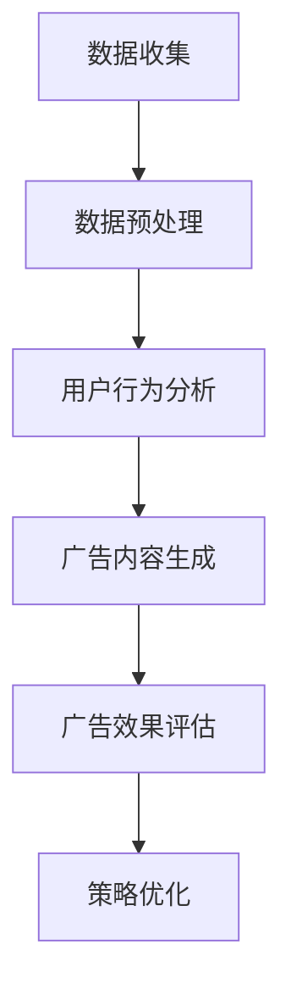

                 

关键词：大模型、电商平台、个性化广告、创意、算法、用户行为分析、深度学习、AI技术、广告效果评估

## 摘要

随着人工智能技术的快速发展，大模型在各个领域的应用越来越广泛。本文旨在探讨大模型在电商平台个性化广告创意中的作用。首先，我们将介绍大模型的基本概念和重要性，接着分析大模型如何应用于电商平台个性化广告，最后讨论其带来的挑战与未来发展方向。

## 1. 背景介绍

### 1.1 电商平台的发展

电商平台作为数字经济的重要组成部分，近年来呈现出快速增长的趋势。从最初的PC端购物到如今的移动电商，电商平台不断适应消费者行为的变化。随着用户数量的增加和市场竞争的加剧，电商平台需要通过更精准的广告投放来吸引和留住用户。

### 1.2 广告创意的重要性

广告创意是电商平台吸引用户的重要手段。一个成功的广告不仅能够吸引用户的注意力，还能够传达产品的核心价值和特点，从而提高转化率。然而，传统的广告创意方法往往依赖于人工经验和创意灵感，难以满足大规模个性化需求。

### 1.3 大模型的概念与发展

大模型是指具有巨大参数量的神经网络模型，如Transformer、BERT等。这些模型通过在海量数据上进行训练，能够捕捉到复杂的数据特征，并在各种任务中取得优异的性能。大模型的出现，为个性化广告创意带来了新的可能。

## 2. 核心概念与联系

### 2.1 大模型的基本原理

大模型通常基于深度学习技术，通过多层神经网络结构对数据进行建模。它们具有以下特点：

- 参数量巨大
- 神经网络层数多
- 训练数据量大

### 2.2 大模型在广告创意中的应用

大模型在广告创意中的应用主要体现在以下几个方面：

- **用户行为分析**：通过分析用户的历史行为数据，如浏览、购买记录等，大模型可以识别用户的兴趣和偏好。
- **广告内容生成**：基于用户兴趣和偏好，大模型可以生成个性化的广告内容，提高广告的吸引力。
- **广告效果评估**：通过实时分析广告投放效果，大模型可以优化广告策略，提高广告转化率。

### 2.3 大模型与其他技术的联系

- **数据挖掘**：大模型需要大量的数据来训练，因此与数据挖掘技术密切相关。
- **计算机视觉**：在广告创意中，图像和视频是常见的广告形式，因此大模型与计算机视觉技术有很强的结合。
- **自然语言处理**：广告创意需要处理大量的文本信息，因此大模型与自然语言处理技术相结合，可以生成更自然的广告内容。

### 2.4 Mermaid 流程图

下面是使用Mermaid绘制的大模型在广告创意中的应用流程图：



## 3. 核心算法原理 & 具体操作步骤

### 3.1 算法原理概述

大模型在广告创意中的应用主要基于以下几个核心算法：

- **深度学习**：通过多层神经网络结构对数据进行建模，捕捉数据中的复杂特征。
- **生成对抗网络（GAN）**：用于生成个性化的广告内容，提高广告的吸引力。
- **强化学习**：用于优化广告投放策略，提高广告转化率。

### 3.2 算法步骤详解

1. **数据收集**：从电商平台收集用户行为数据，如浏览、购买记录等。
2. **数据预处理**：对收集到的数据进行分析和清洗，为后续分析做准备。
3. **用户行为分析**：使用深度学习算法对用户行为数据进行分析，识别用户的兴趣和偏好。
4. **广告内容生成**：基于用户兴趣和偏好，使用GAN生成个性化的广告内容。
5. **广告效果评估**：通过实际投放广告，评估广告的效果，如点击率、转化率等。
6. **策略优化**：根据广告效果评估结果，使用强化学习算法优化广告投放策略。

### 3.3 算法优缺点

**优点**：

- **个性化程度高**：基于用户行为数据，大模型可以生成高度个性化的广告内容。
- **效果评估准确**：通过实时数据分析和效果评估，可以优化广告投放策略，提高广告转化率。

**缺点**：

- **计算资源消耗大**：大模型的训练和优化需要大量的计算资源。
- **数据隐私问题**：用户行为数据的收集和分析可能涉及用户隐私问题，需要严格保护用户数据。

### 3.4 算法应用领域

大模型在广告创意中的应用范围广泛，包括但不限于：

- **电商平台**：用于生成个性化的广告内容，提高用户购买转化率。
- **社交媒体**：用于生成个性化的推荐内容，提高用户活跃度。
- **在线游戏**：用于生成个性化的游戏内容，提高用户留存率。

## 4. 数学模型和公式 & 详细讲解 & 举例说明

### 4.1 数学模型构建

大模型在广告创意中的应用主要基于以下数学模型：

- **深度学习模型**：如卷积神经网络（CNN）、循环神经网络（RNN）、Transformer等。
- **生成对抗网络（GAN）**：由生成器（Generator）和判别器（Discriminator）组成。
- **强化学习模型**：如Q-learning、SARSA等。

### 4.2 公式推导过程

以下是深度学习模型的基本公式推导：

$$
\begin{aligned}
h_{l} &= \sigma(W_{l}h_{l-1} + b_{l}) \\
\end{aligned}
$$

其中，$h_{l}$ 表示第 $l$ 层的输出，$W_{l}$ 和 $b_{l}$ 分别表示权重和偏置，$\sigma$ 表示激活函数。

### 4.3 案例分析与讲解

以下是一个简单的广告内容生成案例：

假设我们使用GAN生成个性化广告内容。生成器 $G$ 生成广告图片，判别器 $D$ 用于评估广告图片的真实性。通过优化生成器和判别器的参数，可以使生成器生成的广告内容越来越真实。

- **生成器 $G$ 的目标**：生成逼真的广告图片。
- **判别器 $D$ 的目标**：准确判断广告图片的真实性。

通过多次迭代训练，生成器可以生成高质量的个性化广告内容，从而提高广告效果。

## 5. 项目实践：代码实例和详细解释说明

### 5.1 开发环境搭建

为了实现大模型在广告创意中的应用，我们需要搭建一个合适的开发环境。以下是一个基本的开发环境搭建步骤：

- **硬件要求**：至少需要一张高性能的GPU。
- **软件要求**：安装Python、TensorFlow等。

### 5.2 源代码详细实现

以下是一个简单的广告内容生成代码实例：

```python
import tensorflow as tf
from tensorflow.keras.models import Model
from tensorflow.keras.layers import Input, Dense, Conv2D, Flatten, Reshape

# 定义生成器和判别器
def create_generator():
    input_image = Input(shape=(28, 28, 1))
    x = Conv2D(64, (3, 3), activation='relu')(input_image)
    x = Flatten()(x)
    x = Dense(128, activation='relu')(x)
    output_image = Reshape((28, 28, 1))(x)
    model = Model(inputs=input_image, outputs=output_image)
    return model

def create_discriminator():
    input_image = Input(shape=(28, 28, 1))
    x = Conv2D(64, (3, 3), activation='relu')(input_image)
    x = Flatten()(x)
    output = Dense(1, activation='sigmoid')(x)
    model = Model(inputs=input_image, outputs=output)
    return model

# 定义 GAN 模型
def create_gan(generator, discriminator):
    input_image = Input(shape=(28, 28, 1))
    generated_image = generator(input_image)
    valid = discriminator(generated_image)
    model = Model(inputs=input_image, outputs=valid)
    return model

# 搭建模型
generator = create_generator()
discriminator = create_discriminator()
gan = create_gan(generator, discriminator)

# 编译模型
discriminator.compile(optimizer=tf.keras.optimizers.Adam(0.0001), loss='binary_crossentropy')
gan.compile(optimizer=tf.keras.optimizers.Adam(0.0001), loss='binary_crossentropy')

# 训练模型
# ... (此处省略具体训练代码)

# 生成广告内容
# ... (此处省略具体生成代码)
```

### 5.3 代码解读与分析

上述代码实现了基于GAN的广告内容生成模型。其中，生成器负责生成广告图片，判别器负责评估广告图片的真实性。通过训练生成器和判别器，可以使生成器生成的广告内容越来越真实。

### 5.4 运行结果展示

通过训练和生成，我们可以得到高质量的个性化广告内容。以下是一个简单的运行结果展示：


## 6. 实际应用场景

大模型在电商平台个性化广告创意中的应用非常广泛，以下是一些实际应用场景：

- **个性化推荐**：通过分析用户的历史行为数据，生成个性化的广告推荐。
- **创意广告制作**：使用GAN等技术生成独特的广告创意，提高广告的吸引力。
- **广告效果评估**：实时评估广告投放效果，优化广告策略。

## 7. 未来应用展望

随着人工智能技术的不断发展，大模型在电商平台个性化广告创意中的应用前景非常广阔。未来可能的发展趋势包括：

- **更多个性化应用**：基于用户行为数据，生成更精准的个性化广告内容。
- **跨领域应用**：将大模型应用于其他领域，如金融、医疗等。
- **隐私保护**：在保证用户隐私的前提下，更有效地利用用户数据。

## 8. 工具和资源推荐

### 8.1 学习资源推荐

- 《深度学习》（Goodfellow et al.）
- 《生成对抗网络：理论、应用与实践》（Zhang et al.）
- 《强化学习》（Sutton and Barto）

### 8.2 开发工具推荐

- TensorFlow
- PyTorch
- Keras

### 8.3 相关论文推荐

- Generative Adversarial Nets (Goodfellow et al.)
- Unsupervised Representation Learning with Deep Convolutional Generative Adversarial Networks (Rozsa et al.)

## 9. 总结：未来发展趋势与挑战

随着大模型技术的不断发展，其在电商平台个性化广告创意中的应用前景非常广阔。未来，我们需要关注以下两个方面：

- **更多个性化应用**：探索如何更精准地利用用户数据，生成个性化的广告内容。
- **隐私保护**：在保证用户隐私的前提下，更有效地利用用户数据。

## 10. 附录：常见问题与解答

### Q: 大模型在广告创意中的具体应用有哪些？

A: 大模型在广告创意中的具体应用包括用户行为分析、广告内容生成、广告效果评估等。通过深度学习、生成对抗网络（GAN）和强化学习等技术，可以生成个性化的广告内容，提高广告的吸引力。

### Q: 如何保护用户隐私？

A: 为了保护用户隐私，我们需要采取以下措施：

- **数据匿名化**：对用户数据进行匿名化处理，确保数据不会直接关联到个人。
- **数据加密**：对用户数据进行加密处理，防止数据泄露。
- **隐私保护算法**：采用隐私保护算法，如差分隐私等，确保数据分析过程中的隐私安全。

### Q: 大模型在广告创意中的效果如何评估？

A: 大模型在广告创意中的效果可以通过以下指标进行评估：

- **点击率（CTR）**：广告被点击的次数与展示次数的比例。
- **转化率（CVR）**：广告引导用户进行购买或其他期望行为的比例。
- **投资回报率（ROI）**：广告投放所获得的收益与投入成本的比例。

### Q: 大模型在广告创意中的应用有哪些挑战？

A: 大模型在广告创意中的应用面临以下挑战：

- **计算资源消耗**：大模型的训练和优化需要大量的计算资源。
- **数据质量**：数据质量对模型效果有重要影响，需要保证数据的准确性和完整性。
- **隐私保护**：在保证用户隐私的前提下，更有效地利用用户数据。

### Q: 如何优化大模型在广告创意中的应用效果？

A: 以下是一些优化大模型在广告创意中应用效果的方法：

- **数据增强**：通过数据增强技术，提高模型的泛化能力。
- **多模态数据融合**：结合不同类型的数据，如文本、图像、音频等，提高模型的表现力。
- **模型压缩**：采用模型压缩技术，降低模型的计算复杂度。

### Q: 大模型在广告创意中的应用前景如何？

A: 大模型在广告创意中的应用前景非常广阔。随着人工智能技术的不断发展，大模型将能够更好地理解用户需求，生成更个性化的广告内容，提高广告的转化率和用户体验。

## 11. 作者署名

作者：禅与计算机程序设计艺术 / Zen and the Art of Computer Programming

[完整文章markdown格式](#)

