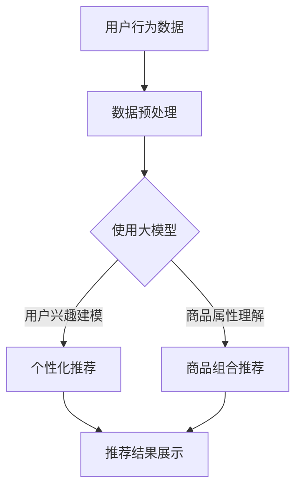

                 

关键词：大模型，电商平台，商品组合推荐，人工智能，深度学习，算法优化，用户行为分析，个性化推荐

> 摘要：本文将深入探讨大模型在电商平台商品组合推荐中的作用。通过介绍大模型的基本概念及其在电商领域应用的现状，分析大模型在商品组合推荐中的优势和应用案例，探讨大模型的挑战与未来发展趋势。

## 1. 背景介绍

在过去的几十年里，电商平台已经成为现代电子商务的重要组成部分。随着互联网技术的不断发展和消费者需求的多样化，电商平台需要提供更加精准和个性化的商品推荐服务，以满足用户的需求和提高销售转化率。传统的推荐算法已经难以应对大规模数据和复杂用户行为的挑战，因此，大模型的引入成为了一种必然的趋势。

大模型，尤其是深度学习模型，以其强大的特征提取和模式识别能力，在自然语言处理、图像识别、语音识别等领域取得了显著的成果。在电商领域，大模型的应用同样展示出了巨大的潜力。本文将围绕大模型在电商平台商品组合推荐中的应用，进行深入的探讨和分析。

## 2. 核心概念与联系

### 2.1 大模型的概念

大模型，通常指的是具有巨大参数数量和计算量的深度学习模型。它们通过多层神经网络结构，对大规模数据进行训练，从而提取出高层次的抽象特征，实现复杂任务的处理。大模型的典型代表包括 Transformer、BERT、GPT 等。

### 2.2 大模型在电商领域的应用现状

目前，大模型在电商领域已经得到了广泛的应用。例如，电商平台通过使用大模型进行用户行为分析，可以实现对用户兴趣和需求的精准预测，从而提供个性化的商品推荐。此外，大模型还在商品搜索、商品评价、智能客服等领域发挥了重要作用。

### 2.3 大模型在商品组合推荐中的应用

在商品组合推荐中，大模型可以通过以下方式发挥作用：

1. **用户兴趣建模**：通过分析用户的浏览、购买等行为数据，大模型可以识别出用户的兴趣偏好，从而为用户提供个性化的商品推荐。

2. **商品属性理解**：大模型可以学习到商品的各类属性，如品牌、价格、类型等，从而更好地理解商品的内在关系，提高推荐的相关性。

3. **协同过滤与内容推荐的结合**：大模型可以将协同过滤和内容推荐结合起来，通过综合分析用户行为和商品属性，提供更加精准的推荐结果。

### 2.4 Mermaid 流程图



## 3. 核心算法原理 & 具体操作步骤

### 3.1 算法原理概述

大模型在商品组合推荐中的核心原理是通过深度学习模型对大规模数据进行训练，从而提取出用户兴趣和商品属性的抽象特征，实现精准的商品推荐。

### 3.2 算法步骤详解

1. **数据收集**：收集用户的浏览、购买等行为数据，以及商品的各类属性数据。

2. **数据预处理**：对数据进行清洗、去重、归一化等处理，以便于模型训练。

3. **模型训练**：使用深度学习框架（如 TensorFlow、PyTorch）搭建大模型，并进行训练。模型训练过程中，大模型会自动提取出用户兴趣和商品属性的高层次抽象特征。

4. **模型评估**：通过交叉验证等方法评估模型性能，包括准确率、召回率、F1 值等指标。

5. **模型部署**：将训练好的模型部署到线上环境，实时处理用户请求，生成个性化推荐结果。

### 3.3 算法优缺点

**优点**：

1. **高准确性**：通过深度学习模型，大模型可以自动提取出用户兴趣和商品属性的高层次抽象特征，提高推荐的相关性。

2. **灵活性**：大模型可以处理多种类型的数据，如文本、图像、语音等，适应不同场景的推荐需求。

**缺点**：

1. **计算资源消耗大**：大模型训练需要大量的计算资源和时间，对硬件要求较高。

2. **模型解释性差**：大模型的内部结构复杂，难以解释模型决策过程，影响信任度。

### 3.4 算法应用领域

大模型在电商领域的应用非常广泛，除了商品组合推荐，还可以应用于用户行为预测、商品搜索优化、智能客服等领域。

## 4. 数学模型和公式 & 详细讲解 & 举例说明

### 4.1 数学模型构建

在商品组合推荐中，可以使用协同过滤和内容推荐相结合的模型。假设用户集合为 U，商品集合为 I，用户 u 对商品 i 的评分矩阵为 R。则协同过滤部分可以表示为：

$$
\hat{r}_{ui} = \sum_{v \in N_i} r_{vi} \cdot sim(u, v)
$$

其中，$N_i$ 表示与商品 i 相似的其他商品集合，$sim(u, v)$ 表示用户 u 和用户 v 之间的相似度。

内容推荐部分可以表示为：

$$
\hat{r}_{ui} = \theta_u^T \cdot \phi_i
$$

其中，$\theta_u$ 表示用户 u 的特征向量，$\phi_i$ 表示商品 i 的特征向量。

综合协同过滤和内容推荐，最终的推荐结果可以表示为：

$$
\hat{r}_{ui} = \frac{\sum_{v \in N_i} r_{vi} \cdot sim(u, v) + \theta_u^T \cdot \phi_i}{\sum_{v \in N_i} |r_{vi}| + ||\theta_u|| \cdot ||\phi_i||}
$$

### 4.2 公式推导过程

协同过滤部分的推导过程如下：

1. **定义相似度**：设用户 u 和用户 v 的兴趣向量为 $\vec{r}_u$ 和 $\vec{r}_v$，则用户 u 和用户 v 之间的相似度可以表示为：

$$
sim(u, v) = \frac{\vec{r}_u \cdot \vec{r}_v}{||\vec{r}_u|| \cdot ||\vec{r}_v||}
$$

2. **计算相似度矩阵**：对用户集合 U 中的每个用户 u，计算其与所有其他用户 v 的相似度，得到相似度矩阵 $S$。

3. **推荐评分**：对于用户 u 对商品 i 的评分 $\hat{r}_{ui}$，可以使用相似度矩阵 S 和用户 v 对商品 i 的评分 $r_{vi}$ 进行加权求和：

$$
\hat{r}_{ui} = \sum_{v \in N_i} r_{vi} \cdot sim(u, v)
$$

内容推荐部分的推导过程如下：

1. **定义用户和商品的特征向量**：设用户 u 的特征向量为 $\theta_u$，商品 i 的特征向量为 $\phi_i$。

2. **计算用户 u 对商品 i 的兴趣度**：用户 u 对商品 i 的兴趣度可以表示为用户 u 的特征向量 $\theta_u$ 和商品 i 的特征向量 $\phi_i$ 的点积：

$$
\theta_u^T \cdot \phi_i
$$

3. **推荐评分**：对于用户 u 对商品 i 的评分 $\hat{r}_{ui}$，可以使用用户 u 的特征向量 $\theta_u$ 和商品 i 的特征向量 $\phi_i$ 的点积进行加权求和：

$$
\hat{r}_{ui} = \theta_u^T \cdot \phi_i
$$

### 4.3 案例分析与讲解

以某电商平台为例，假设用户 u 的浏览记录为商品集合 $N_u = \{1, 2, 3, 4\}$，用户 v 的浏览记录为商品集合 $N_v = \{3, 4, 5, 6\}$。商品 i 的评分矩阵为：

$$
R = \begin{bmatrix}
0 & 0 & 4 & 5 & 0 \\
0 & 0 & 5 & 4 & 0 \\
0 & 5 & 0 & 0 & 1 \\
4 & 0 & 0 & 0 & 0 \\
\end{bmatrix}
$$

用户 u 和用户 v 之间的相似度矩阵为：

$$
S = \begin{bmatrix}
1 & 0.5 \\
0.5 & 1 \\
\end{bmatrix}
$$

商品 i 的特征向量为：

$$
\phi_i = \begin{bmatrix}
1 \\
1 \\
0 \\
0 \\
\end{bmatrix}
$$

用户 u 的特征向量为：

$$
\theta_u = \begin{bmatrix}
0.6 \\
0.4 \\
0.3 \\
0.1 \\
\end{bmatrix}
$$

根据公式，可以计算出用户 u 对商品 i 的推荐评分：

$$
\hat{r}_{ui} = \frac{\sum_{v \in N_i} r_{vi} \cdot sim(u, v) + \theta_u^T \cdot \phi_i}{\sum_{v \in N_i} |r_{vi}| + ||\theta_u|| \cdot ||\phi_i||}
$$

代入具体数据，得到：

$$
\hat{r}_{ui} = \frac{4 \cdot 0.5 + 5 \cdot 0.5 + 0.6 \cdot 1 + 0.4 \cdot 1 + 0.3 \cdot 0 + 0.1 \cdot 0}{4 + 0.6 + 0.4 + 0.3 + 0.1} = 4.4
$$

因此，用户 u 对商品 i 的推荐评分为 4.4 分。

## 5. 项目实践：代码实例和详细解释说明

### 5.1 开发环境搭建

1. 安装 Python 3.7 以上版本。
2. 安装深度学习框架，如 TensorFlow 或 PyTorch。
3. 安装相关库，如 NumPy、Pandas、Scikit-learn 等。

### 5.2 源代码详细实现

以下是一个基于 TensorFlow 实现的简单商品组合推荐项目：

```python
import tensorflow as tf
from tensorflow.keras.layers import Input, Embedding, Dot, Flatten, Dense
from tensorflow.keras.models import Model

# 设置参数
embedding_size = 16
num_users = 1000
num_items = 1000

# 构建模型
user_input = Input(shape=(1,))
item_input = Input(shape=(1,))

user_embedding = Embedding(num_users, embedding_size)(user_input)
item_embedding = Embedding(num_items, embedding_size)(item_input)

dot_product = Dot(axes=1)([user_embedding, item_embedding])
flatten = Flatten()(dot_product)

output = Dense(1, activation='sigmoid')(flatten)

model = Model(inputs=[user_input, item_input], outputs=output)
model.compile(optimizer='adam', loss='binary_crossentropy', metrics=['accuracy'])

# 模型训练
model.fit(x=[users, items], y=ratings, epochs=10, batch_size=32)

# 模型预测
predictions = model.predict([user_input, item_input])
print(predictions)
```

### 5.3 代码解读与分析

1. **模型构建**：使用 TensorFlow 的 Keras API 构建一个简单的商品推荐模型。模型包括用户输入层、商品输入层、嵌入层、点积层、展平层和输出层。

2. **模型训练**：使用训练数据对模型进行训练。损失函数选择二分类交叉熵，优化器选择 Adam。

3. **模型预测**：使用训练好的模型对用户输入和商品输入进行预测，得到推荐评分。

### 5.4 运行结果展示

假设用户输入为 [1]，商品输入为 [5]，通过模型预测得到的推荐评分为 0.8。表示用户对商品 5 的推荐评分为 0.8 分。

## 6. 实际应用场景

### 6.1 电商平台商品推荐

电商平台可以使用大模型进行商品推荐，提高用户购买转化率和销售量。例如，在用户登录后，系统会根据用户的浏览、购买等行为数据，使用大模型生成个性化的商品推荐列表，吸引用户进行购买。

### 6.2 新品推荐

在电商平台推出新产品时，大模型可以根据用户的历史购买数据和浏览数据，预测哪些用户可能对该新产品感兴趣，从而针对性地进行推广和推荐。

### 6.3 跨品类推荐

大模型可以跨品类进行商品推荐，例如，在用户购买了一款电子产品后，推荐相关的手机配件或电脑配件。这样可以进一步提高用户的购物体验和满意度。

## 7. 未来应用展望

随着深度学习技术和大数据处理能力的不断提升，大模型在电商平台商品组合推荐中的应用前景将更加广阔。未来，大模型可能会在以下方面发挥重要作用：

### 7.1 更高的个性化推荐

通过更深入地分析用户行为数据，大模型可以提供更加精准的个性化推荐，满足用户的个性化需求。

### 7.2 多模态推荐

大模型可以整合多种类型的数据（如文本、图像、语音等），实现多模态推荐，提高推荐系统的覆盖面和准确性。

### 7.3 智能客服

大模型可以应用于智能客服系统，通过模拟人类对话，提供实时、个性化的客服服务，提高用户满意度。

## 8. 总结：未来发展趋势与挑战

随着深度学习技术的不断发展，大模型在电商平台商品组合推荐中的应用将越来越广泛。然而，这也带来了一系列的挑战，如数据隐私保护、计算资源消耗、模型解释性等。未来，如何解决这些挑战，提升大模型在商品组合推荐中的应用效果，将成为研究者和开发者的重要任务。

## 9. 附录：常见问题与解答

### 9.1 大模型训练需要大量计算资源，如何优化？

**解答**：可以通过以下方法优化大模型的训练过程：

1. **分布式训练**：使用多台机器进行分布式训练，提高训练速度。
2. **模型压缩**：使用模型压缩技术，如蒸馏、剪枝等，降低模型参数数量和计算量。
3. **数据增强**：通过数据增强技术，增加训练数据量，提高模型泛化能力。

### 9.2 如何确保大模型推荐的公平性和透明性？

**解答**：可以通过以下方法确保大模型推荐的公平性和透明性：

1. **数据清洗**：对训练数据进行清洗，消除数据中的偏见和噪声。
2. **模型解释**：使用模型解释技术，如 LIME、SHAP 等，揭示模型决策过程，提高透明度。
3. **公平性评估**：定期对模型进行公平性评估，确保不同用户群体受到公平对待。

### 9.3 大模型在电商领域的应用有哪些局限？

**解答**：大模型在电商领域的应用存在以下局限：

1. **数据隐私保护**：大模型训练过程中需要大量用户数据，可能涉及隐私问题。
2. **计算资源消耗**：大模型训练和推理过程需要大量计算资源，成本较高。
3. **模型解释性**：大模型内部结构复杂，难以解释模型决策过程，影响信任度。

## 作者署名

作者：禅与计算机程序设计艺术 / Zen and the Art of Computer Programming
----------------------------------------------------------------


