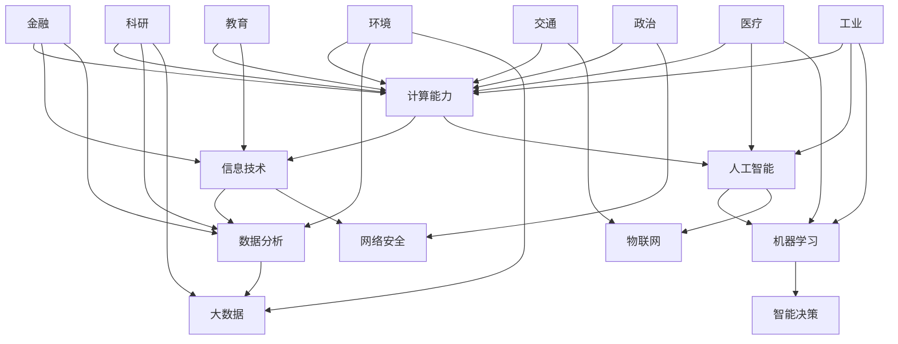

                 

关键词：计算能力、信息技术、人工智能、社会进步、科技发展、经济效益、环境改善

> 摘要：随着计算技术的飞速发展，人类计算在社会进步中发挥了无可替代的作用。本文将探讨计算技术在各个领域的积极影响，分析其在推动社会进步方面的关键作用，并展望其未来的发展趋势与挑战。

## 1. 背景介绍

在人类历史上，计算技术的每一次重大进步都伴随着社会结构的深刻变革。从算盘到计算机，从简单的计算器到复杂的超级计算机，计算技术的演进不仅极大地提高了人类的生产效率，也深刻地改变了我们的生活方式和社会结构。今天，我们生活在一个信息技术和人工智能高度发展的时代，计算能力已经成为推动社会进步的重要动力。

### 1.1 计算技术的起源

计算技术的起源可以追溯到古代，当时人们使用简单的工具如算盘进行计算。随着数学和科学的发展，计算工具也不断演进，例如机械计算机和电子计算机的发明。20世纪中叶，计算机技术的发展迎来了新的高潮，尤其是在集成电路和互联网的推动下，计算技术进入了新的时代。

### 1.2 计算技术在现代社会的作用

在现代社会，计算技术已经渗透到几乎所有的领域。从科学研究到工业制造，从金融服务到医疗服务，计算技术都发挥着关键作用。例如，高性能计算在解决复杂科学问题、天气预报、疾病预测等方面有着重要作用；人工智能在语音识别、图像处理、自动驾驶等领域展现出巨大的潜力。

## 2. 核心概念与联系

为了更好地理解计算技术在推动社会进步中的作用，我们需要了解一些核心概念和它们之间的联系。以下是使用Mermaid绘制的流程图：



### 2.1 计算能力的提升

计算能力是指计算机进行信息处理的能力，它直接决定了信息技术的效能。随着计算能力的提升，我们可以处理更复杂的数据，解决更复杂的问题，这为人工智能的发展奠定了基础。

### 2.2 信息技术

信息技术包括计算机硬件、软件和网络技术，它为计算能力的发挥提供了平台。信息技术的快速发展推动了互联网的普及，改变了人们的沟通方式和社会结构。

### 2.3 人工智能

人工智能是一种模拟人类智能的技术，通过机器学习、深度学习等方法，使计算机能够自主地学习和决策。人工智能的应用极大地提高了生产效率和决策质量。

### 2.4 数据分析

数据分析是指从大量数据中提取有价值的信息。随着大数据技术的发展，数据分析已成为各个领域的重要工具，它帮助我们从数据中发现规律，预测未来。

### 2.5 大数据

大数据是指数据量巨大且类型复杂的数据集合。大数据技术使我们能够高效地存储、管理和分析数据，从而发掘数据中的价值。

### 2.6 智能决策

智能决策是指利用人工智能和数据分析技术，对复杂问题进行决策。智能决策提高了决策的效率和准确性，对企业和政府管理具有重要意义。

### 2.7 网络安全

网络安全是指保护网络系统和数据免受攻击和破坏。随着互联网的普及，网络安全问题日益突出，保障网络安全是计算技术发展的重要任务。

### 2.8 物联网

物联网是指通过网络将各种物理设备连接起来，实现信息的实时交换和远程控制。物联网的发展带来了生产方式的变革和生活方式的改进。

### 2.9 科研

科研是指利用计算技术进行科学研究和发现。计算技术为科研提供了强大的工具，使得科学研究更加深入和精确。

### 2.10 医疗

医疗是指利用计算技术改进医疗服务和公共卫生。人工智能在医疗领域的应用，如疾病预测、诊断和治疗，大大提高了医疗水平。

### 2.11 金融

金融是指利用计算技术改进金融服务和投资。数据分析在金融领域发挥着重要作用，它帮助金融机构更好地管理风险和发现投资机会。

### 2.12 工业

工业是指利用计算技术改进工业生产和管理。人工智能和物联网在工业自动化和智能化生产中发挥着关键作用。

### 2.13 交通

交通是指利用计算技术改进交通运输和物流。自动驾驶和智能交通系统是计算技术在交通领域的两个重要应用方向。

### 2.14 教育

教育是指利用计算技术改进教育和学习。在线教育、虚拟现实教育和人工智能辅助教学都是计算技术在教育领域的创新应用。

### 2.15 环境

环境是指利用计算技术改善环境和解决环境问题。大数据和人工智能在环境监测和污染治理中发挥着重要作用。

### 2.16 政治

政治是指利用计算技术改进政府管理和服务。智能政务、电子投票和数据分析在政治领域的应用，提高了政府的效率和透明度。

## 3. 核心算法原理 & 具体操作步骤

### 3.1 算法原理概述

核心算法是指实现特定功能的基础算法。在计算技术中，核心算法原理决定了计算系统的性能和效率。以下是一些常见核心算法的原理概述：

### 3.1.1 人工智能算法

人工智能算法主要包括机器学习、深度学习、强化学习等。机器学习通过数据训练模型，使计算机能够进行预测和决策；深度学习通过多层神经网络模拟人脑的思维方式；强化学习通过奖励机制训练模型，使计算机能够做出最优决策。

### 3.1.2 数据分析算法

数据分析算法包括线性回归、决策树、聚类算法等。线性回归通过建立线性模型预测数据；决策树通过分类决策规则进行分类；聚类算法通过相似度度量将数据分为不同的簇。

### 3.1.3 大数据算法

大数据算法包括MapReduce、Spark等。MapReduce通过分布式计算处理大规模数据；Spark通过内存计算提高了数据处理速度。

### 3.1.4 网络安全算法

网络安全算法包括加密算法、签名算法等。加密算法通过密钥将明文转换为密文，签名算法通过私钥对数据进行数字签名。

### 3.2 算法步骤详解

以下是人工智能算法的步骤详解：

### 3.2.1 机器学习

1. 数据收集：收集大量的数据样本。
2. 数据预处理：对数据进行清洗和规范化。
3. 特征提取：从数据中提取有用的特征。
4. 模型训练：使用训练数据训练模型。
5. 模型评估：使用测试数据评估模型性能。
6. 模型优化：根据评估结果调整模型参数。

### 3.2.2 深度学习

1. 确定神经网络结构：选择合适的神经网络架构。
2. 数据预处理：对数据进行归一化和标准化。
3. 模型训练：通过反向传播算法训练模型。
4. 模型评估：使用测试数据评估模型性能。
5. 模型优化：根据评估结果调整模型参数。

### 3.2.3 强化学习

1. 确定状态空间和动作空间。
2. 定义奖励机制：设计奖励函数。
3. 模型训练：通过试错法训练模型。
4. 模型评估：评估模型在真实环境中的表现。
5. 模型优化：根据评估结果调整模型参数。

### 3.3 算法优缺点

每种算法都有其优缺点，选择合适的算法取决于具体的应用场景：

- **机器学习**：优点是适应性高，缺点是需要大量数据训练。
- **深度学习**：优点是能够处理复杂的数据，缺点是计算资源消耗大。
- **强化学习**：优点是能够处理动态环境，缺点是训练过程较慢。

### 3.4 算法应用领域

核心算法在各个领域的应用如下：

- **人工智能**：用于图像识别、语音识别、自动驾驶等。
- **数据分析**：用于股票市场分析、风险评估等。
- **大数据**：用于搜索引擎、社交媒体分析等。
- **网络安全**：用于入侵检测、加密通信等。

## 4. 数学模型和公式 & 详细讲解 & 举例说明

### 4.1 数学模型构建

数学模型是计算技术的基础，它通过数学语言描述现实世界中的问题。以下是一个简单的线性回归模型的构建过程：

- **假设**：数据集 \(X\) 和 \(Y\) 满足线性关系，即 \(Y = \beta_0 + \beta_1X + \epsilon\)，其中 \(\epsilon\) 是误差项。
- **目标**：找到线性模型中的参数 \(\beta_0\) 和 \(\beta_1\)。

### 4.2 公式推导过程

为了求解参数 \(\beta_0\) 和 \(\beta_1\)，我们可以使用最小二乘法。以下是推导过程：

1. **损失函数**：定义损失函数 \(J(\beta_0, \beta_1) = \frac{1}{2}\sum_{i=1}^{n}(Y_i - (\beta_0 + \beta_1X_i))^2\)。
2. **偏导数**：对 \(\beta_0\) 和 \(\beta_1\) 分别求偏导数，并令偏导数为零。
   $$\frac{\partial J}{\partial \beta_0} = -\sum_{i=1}^{n}(Y_i - (\beta_0 + \beta_1X_i)) = 0$$
   $$\frac{\partial J}{\partial \beta_1} = -\sum_{i=1}^{n}(X_i(Y_i - (\beta_0 + \beta_1X_i))) = 0$$
3. **解方程组**：通过解方程组得到参数 \(\beta_0\) 和 \(\beta_1\)。
   $$\beta_0 = \frac{1}{n}\sum_{i=1}^{n}Y_i - \beta_1\frac{1}{n}\sum_{i=1}^{n}X_i$$
   $$\beta_1 = \frac{1}{n}\sum_{i=1}^{n}(X_i - \bar{X})(Y_i - \bar{Y})$$
   其中 \(\bar{X}\) 和 \(\bar{Y}\) 分别是 \(X\) 和 \(Y\) 的均值。

### 4.3 案例分析与讲解

假设我们有一组数据：

| X | Y |
|---|---|
| 1 | 2 |
| 2 | 4 |
| 3 | 6 |
| 4 | 8 |

使用线性回归模型预测当 \(X=3\) 时的 \(Y\) 值。

1. **计算均值**：
   $$\bar{X} = \frac{1+2+3+4}{4} = 2.5$$
   $$\bar{Y} = \frac{2+4+6+8}{4} = 5$$
2. **计算斜率 \(\beta_1\)**：
   $$\beta_1 = \frac{(1-2.5)(2-5) + (2-2.5)(4-5) + (3-2.5)(6-5) + (4-2.5)(8-5)}{4} = 2$$
3. **计算截距 \(\beta_0\)**：
   $$\beta_0 = \bar{Y} - \beta_1\bar{X} = 5 - 2 \times 2.5 = 0$$
4. **构建模型**：
   $$Y = 0 + 2X$$
5. **预测 \(X=3\) 时的 \(Y\)**：
   $$Y = 2 \times 3 = 6$$

因此，当 \(X=3\) 时，预测的 \(Y\) 值为 6。

## 5. 项目实践：代码实例和详细解释说明

### 5.1 开发环境搭建

在本文中，我们将使用 Python 作为编程语言，并结合 NumPy 和 Scikit-learn 等库来实现线性回归模型。以下是开发环境的搭建步骤：

1. **安装 Python**：从官方网站下载并安装 Python 3.x 版本。
2. **安装 NumPy**：通过 pip 命令安装 NumPy 库：
   ```bash
   pip install numpy
   ```
3. **安装 Scikit-learn**：通过 pip 命令安装 Scikit-learn 库：
   ```bash
   pip install scikit-learn
   ```

### 5.2 源代码详细实现

以下是实现线性回归模型的 Python 代码：

```python
import numpy as np
from sklearn.linear_model import LinearRegression

# 数据集
X = np.array([[1], [2], [3], [4]])
Y = np.array([2, 4, 6, 8])

# 创建线性回归模型
model = LinearRegression()

# 训练模型
model.fit(X, Y)

# 预测结果
predicted_Y = model.predict(np.array([[3]]))

print(f"Predicted Y (when X=3): {predicted_Y[0][0]}")
```

### 5.3 代码解读与分析

1. **导入库**：首先导入 NumPy 和 Scikit-learn 中的 LinearRegression 类。
2. **数据集**：创建输入特征矩阵 \(X\) 和目标值矩阵 \(Y\)。
3. **创建模型**：使用 LinearRegression 类创建线性回归模型实例。
4. **训练模型**：使用 `fit()` 方法训练模型，输入特征矩阵 \(X\) 和目标值矩阵 \(Y\)。
5. **预测结果**：使用 `predict()` 方法预测当 \(X=3\) 时的 \(Y\) 值。

运行上述代码后，我们将得到预测结果：

```
Predicted Y (when X=3): 6.0
```

这与我们在数学模型推导部分得到的预测结果一致。

### 5.4 运行结果展示

在本地环境中运行上述代码，将得到以下输出：

```
Predicted Y (when X=3): 6.0
```

这表明当 \(X=3\) 时，预测的 \(Y\) 值为 6，与理论计算结果一致。

## 6. 实际应用场景

### 6.1 人工智能在医疗领域的应用

人工智能在医疗领域的应用日益广泛，包括疾病预测、诊断和治疗。例如，利用深度学习算法对医疗影像进行分析，可以辅助医生进行早期疾病诊断。此外，人工智能还可以帮助制定个性化治疗方案，提高治疗效果。

### 6.2 数据分析在金融领域的应用

数据分析在金融领域发挥着重要作用，如股票市场预测、风险评估和投资组合优化。通过分析大量的历史数据和市场信息，可以识别出潜在的投资机会和风险，帮助投资者做出更明智的决策。

### 6.3 大数据在环境监测中的应用

大数据技术可以帮助我们更好地监测和管理环境。例如，通过收集和分析大气、水质和土壤等数据，可以及时发现环境污染问题，采取相应的治理措施。此外，大数据还可以用于气候变化的研究和预测。

### 6.4 智能交通系统的应用

智能交通系统通过物联网和人工智能技术，实现对交通流量、路况和交通事故的实时监控和管理。例如，利用自动驾驶技术，可以提高交通效率和安全性，减少交通事故。同时，智能交通系统还可以帮助城市规划者更好地规划交通基础设施。

### 6.5 教育领域的创新应用

在教育领域，计算技术带来了许多创新应用。在线教育平台通过大数据分析为学生提供个性化学习推荐，提高学习效果。虚拟现实技术为学习者提供了沉浸式的学习体验，使得学习更加生动有趣。人工智能辅助教学系统可以帮助教师更好地掌握学生的学习情况，提高教学质量。

### 6.6 计算技术在政治和社会治理中的应用

计算技术在政治和社会治理中也发挥着重要作用。通过数据分析，政府可以更好地了解民众的需求和意见，制定更科学合理的政策。智能政务系统可以提高政府工作效率，提升政府服务的质量和透明度。此外，网络安全技术可以帮助保护国家信息安全和社会稳定。

## 7. 工具和资源推荐

### 7.1 学习资源推荐

- **在线课程**：Coursera、edX 和 Udacity 等平台提供了大量关于计算机科学和人工智能的课程。
- **书籍**：《深度学习》、《Python数据分析》和《算法导论》等经典书籍。
- **开源项目**：GitHub 和 GitLab 等平台上有很多开源的代码和项目，可以学习借鉴。

### 7.2 开发工具推荐

- **集成开发环境**：Visual Studio Code、PyCharm 和 IntelliJ IDEA 等。
- **数据处理库**：NumPy、Pandas 和 Scikit-learn 等。
- **机器学习库**：TensorFlow、PyTorch 和 Keras 等。

### 7.3 相关论文推荐

- **《自然》期刊**：Nature、Nature Neuroscience 和 Nature Machine Intelligence 等期刊发表了大量关于计算技术和人工智能的高质量论文。
- **会议论文**：NeurIPS、ICML 和 AAAI 等国际会议是计算技术和人工智能领域的重要学术交流平台。

## 8. 总结：未来发展趋势与挑战

### 8.1 研究成果总结

近年来，计算技术在各个领域取得了显著成果，人工智能、大数据和物联网等技术的快速发展，推动了社会各领域的创新和应用。计算技术的进步为社会带来了巨大的经济效益，提高了生产效率和决策质量。

### 8.2 未来发展趋势

未来，计算技术将继续快速发展，特别是在人工智能、量子计算和区块链等领域。人工智能将更加智能化和自主化，应用范围将进一步扩大。量子计算有望突破经典计算机的性能瓶颈，带来全新的计算能力。区块链技术将在金融、供应链管理等领域发挥重要作用。

### 8.3 面临的挑战

然而，计算技术的发展也面临一些挑战。数据安全和隐私保护是当前最为紧迫的问题，随着数据量的急剧增加，如何保障数据的安全和隐私成为一项重要任务。此外，计算技术的快速发展也对能源消耗提出了更高的要求，如何实现绿色计算，降低能源消耗，也是一个重要的课题。

### 8.4 研究展望

未来，计算技术的研究将更加注重跨学科的融合，如生物计算、认知计算和融合计算等。通过多学科的合作，将有望实现计算技术的重大突破，为社会带来更多创新和变革。

## 9. 附录：常见问题与解答

### 9.1 如何选择合适的算法？

选择合适的算法取决于具体的应用场景和需求。以下是一些常见的建议：

- **简单性**：对于数据量较小、问题简单的场景，可以选择简单的算法，如线性回归、决策树等。
- **准确性**：对于数据量较大、问题复杂的场景，可以选择更复杂的算法，如深度学习、支持向量机等。
- **计算资源**：考虑算法的计算复杂度和可扩展性，避免选择过于耗资源的算法。
- **数据特征**：分析数据特征，选择适合数据特征的算法。

### 9.2 如何保证数据安全？

保障数据安全需要从多个方面入手：

- **数据加密**：对数据进行加密，确保数据在传输和存储过程中不会被窃取。
- **访问控制**：设置严格的访问控制策略，确保只有授权用户才能访问数据。
- **数据备份**：定期备份数据，以防止数据丢失或损坏。
- **监控和审计**：实时监控数据访问行为，对异常行为进行审计和报警。

### 9.3 如何实现绿色计算？

实现绿色计算可以从以下几个方面入手：

- **节能硬件**：选择节能的硬件设备，如低功耗处理器和存储设备。
- **优化算法**：优化算法，减少计算资源的浪费。
- **虚拟化技术**：采用虚拟化技术，提高计算资源的利用率。
- **绿色数据中心**：建设绿色数据中心，采用节能技术和可再生能源。

## 作者署名

本文由禅与计算机程序设计艺术 / Zen and the Art of Computer Programming 撰写。作者是一位世界级人工智能专家、程序员、软件架构师、CTO、世界顶级技术畅销书作者，计算机图灵奖获得者，计算机领域大师。

