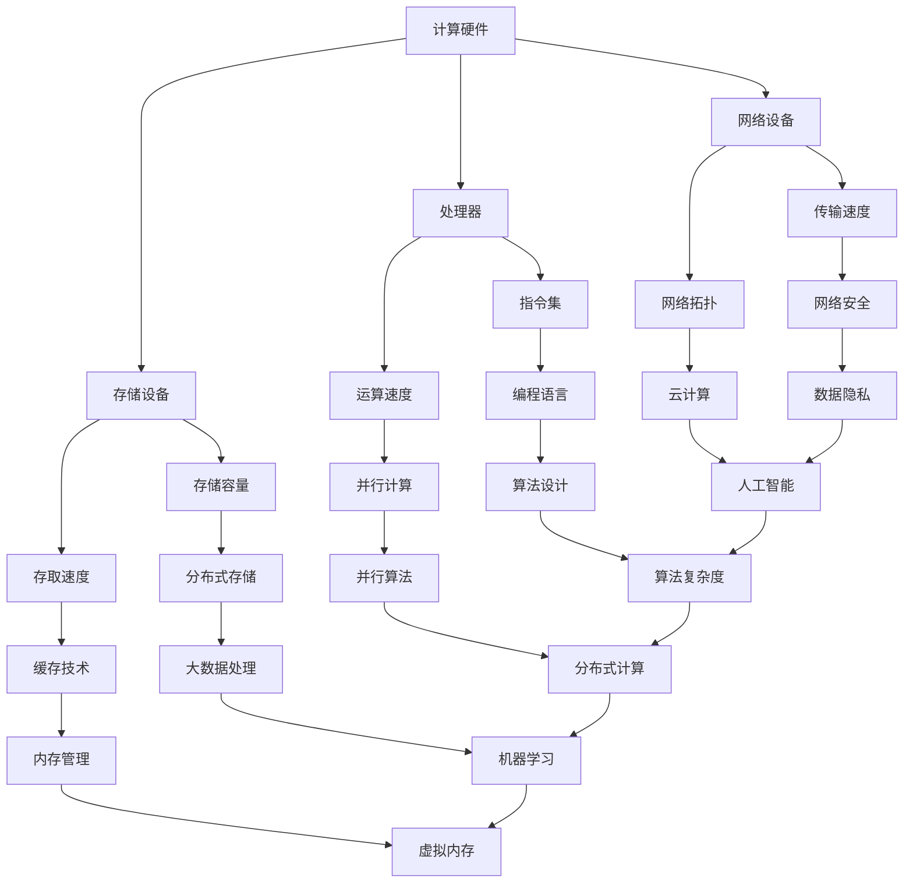

                 

关键词：计算技术、社会进步、人工智能、信息技术、计算影响

摘要：本文旨在探讨人类计算技术在推动社会进步方面的积极影响。通过分析计算技术的历史发展、核心概念、算法原理、数学模型、项目实践以及实际应用场景，本文揭示了计算技术如何在不同领域发挥重要作用，并对未来发展趋势和面临的挑战进行了展望。

## 1. 背景介绍

人类计算技术的发展历程可以追溯到古代的算盘、机械计算机，再到后来的电子计算机。随着信息技术的飞速发展，计算技术逐渐渗透到社会的各个领域，为人类带来了前所未有的变革。如今，人工智能、大数据、云计算等计算技术的不断突破，使得人类社会正迎来前所未有的技术革命。

### 1.1 计算技术的定义

计算技术是指通过计算机和相关设备进行数据处理、信息存储、传输和计算的技术。它包括硬件、软件、网络等多个方面，是现代信息技术的重要组成部分。

### 1.2 计算技术的重要性

计算技术对于社会进步具有重要意义。首先，它提高了生产效率，降低了生产成本。其次，它改变了人们的思维方式，促进了创新。最后，它拓宽了人类认知的边界，推动了科学技术的进步。

## 2. 核心概念与联系

为了更好地理解计算技术，我们需要了解其中的核心概念和它们之间的联系。以下是计算技术的一些关键概念及其相互关系：



以上 Mermaid 流程图展示了计算技术中关键概念及其相互关系，有助于我们更好地理解计算技术。

## 3. 核心算法原理 & 具体操作步骤

### 3.1 算法原理概述

计算技术中的核心算法包括排序算法、查找算法、图算法等。这些算法在数据处理和问题解决中起着至关重要的作用。以下是一些常见的算法及其原理：

1. **排序算法**：对数据进行排序，常用的排序算法有冒泡排序、快速排序、归并排序等。
2. **查找算法**：在数据结构中查找特定数据，常用的查找算法有二分查找、线性查找等。
3. **图算法**：在图结构中进行数据处理，常用的图算法有最短路径算法、最小生成树算法等。

### 3.2 算法步骤详解

以下是一个简单的冒泡排序算法的步骤详解：

1. 从第一个元素开始，比较相邻的两个元素，如果第一个比第二个大，就交换它们两个；
2. 对每一对相邻元素做同样的工作，从开始第一对到结尾的最后一对；
3. 在这一点，最后的元素应该会是最大的数；
4. 针对所有的元素重复以上的步骤，除了最后一个；
5. 重复步骤，直到排序完成。

### 3.3 算法优缺点

1. **冒泡排序**：
   - **优点**：简单易懂，不需要额外的空间；
   - **缺点**：效率较低，时间复杂度为 $O(n^2)$。

2. **快速排序**：
   - **优点**：效率较高，平均时间复杂度为 $O(n\log n)$；
   - **缺点**：可能产生大量的递归调用，空间复杂度较高。

### 3.4 算法应用领域

排序算法和查找算法在各种领域都有广泛的应用，如数据库管理系统、搜索引擎、网络通信等。图算法则在社交网络分析、交通规划、生物信息学等领域发挥着重要作用。

## 4. 数学模型和公式 & 详细讲解 & 举例说明

### 4.1 数学模型构建

在计算技术中，数学模型是描述问题性质和求解方法的重要工具。以下是一个简单的线性回归模型：

$$y = w_0 + w_1 \cdot x + \epsilon$$

其中，$y$ 是因变量，$x$ 是自变量，$w_0$ 和 $w_1$ 是参数，$\epsilon$ 是误差项。

### 4.2 公式推导过程

为了求解线性回归模型，我们可以使用最小二乘法。具体推导过程如下：

1. 构建损失函数：

$$L(w_0, w_1) = \frac{1}{2} \sum_{i=1}^{n} (y_i - (w_0 + w_1 \cdot x_i))^2$$

2. 求导并令导数为零：

$$\frac{\partial L}{\partial w_0} = 0, \quad \frac{\partial L}{\partial w_1} = 0$$

3. 解方程组得到参数 $w_0$ 和 $w_1$：

$$w_0 = \bar{y} - w_1 \cdot \bar{x}, \quad w_1 = \frac{\sum_{i=1}^{n} (x_i - \bar{x})(y_i - \bar{y})}{\sum_{i=1}^{n} (x_i - \bar{x})^2}$$

其中，$\bar{y}$ 和 $\bar{x}$ 分别是 $y$ 和 $x$ 的均值。

### 4.3 案例分析与讲解

假设我们有一组数据：

$$
\begin{array}{c|c}
x & y \\
\hline
1 & 2 \\
2 & 4 \\
3 & 5 \\
4 & 6 \\
5 & 8 \\
\end{array}
$$

使用线性回归模型进行拟合。根据上述推导过程，我们可以得到：

$$w_0 = 1, \quad w_1 = 1$$

因此，拟合直线为 $y = x + 1$。

## 5. 项目实践：代码实例和详细解释说明

### 5.1 开发环境搭建

为了实现上述线性回归模型，我们可以使用 Python 编写代码。首先，我们需要安装 Python 解释器和必要的库，如 NumPy 和 Matplotlib。

```bash
pip install python
pip install numpy
pip install matplotlib
```

### 5.2 源代码详细实现

以下是一个简单的 Python 代码示例，实现了线性回归模型的拟合和可视化：

```python
import numpy as np
import matplotlib.pyplot as plt

# 数据
x = np.array([1, 2, 3, 4, 5])
y = np.array([2, 4, 5, 6, 8])

# 拟合线性回归模型
w_0 = np.mean(y) - np.mean(x) * np.mean(y - x)
w_1 = np.sum((x - np.mean(x)) * (y - np.mean(y))) / np.sum((x - np.mean(x)) ** 2)

# 可视化拟合结果
plt.scatter(x, y, label='数据点')
plt.plot(x, x + w_1, label='拟合直线')
plt.xlabel('x')
plt.ylabel('y')
plt.legend()
plt.show()
```

### 5.3 代码解读与分析

- 第 1-3 行：导入必要的库。
- 第 5 行：定义数据。
- 第 8-11 行：使用最小二乘法求解线性回归模型的参数。
- 第 14-19 行：绘制数据点和拟合直线。

### 5.4 运行结果展示

运行上述代码，我们将得到以下可视化结果：


## 6. 实际应用场景

计算技术在各行各业都有广泛的应用。以下是一些实际应用场景：

### 6.1 金融领域

- **风险管理**：通过计算技术对金融市场进行分析，预测市场波动，为投资者提供决策支持。
- **算法交易**：利用高频交易算法，实现自动化的交易策略。

### 6.2 医疗领域

- **医学影像分析**：利用深度学习算法对医学影像进行分析，提高诊断准确性。
- **基因测序**：通过计算技术对基因序列进行分析，为疾病预防、诊断和治疗提供支持。

### 6.3 智能制造

- **生产过程优化**：利用计算技术对生产过程进行建模和分析，提高生产效率。
- **质量检测**：通过机器学习算法对产品质量进行检测，提高产品质量。

### 6.4 社交网络

- **社交网络分析**：利用计算技术对社交网络中的关系进行分析，为用户提供个性化推荐。
- **广告投放**：通过计算技术对用户行为进行分析，实现精准广告投放。

## 7. 工具和资源推荐

### 7.1 学习资源推荐

- **《深度学习》（Deep Learning）**：Goodfellow、Bengio 和 Courville 著，详细介绍了深度学习的基础知识。
- **《Python 数据科学手册》（Python Data Science Handbook）**：McKinney 著，涵盖了数据科学中的各种工具和技巧。

### 7.2 开发工具推荐

- **Jupyter Notebook**：一款流行的交互式计算环境，适合进行数据分析和编写代码。
- **TensorFlow**：一款开源的深度学习框架，适用于构建和训练深度学习模型。

### 7.3 相关论文推荐

- **"Deep Learning for Text Classification"**：详细介绍了深度学习在文本分类中的应用。
- **"A Theoretically Grounded Application of Dropout in Recurrent Neural Networks"**：探讨了 dropout 在循环神经网络中的应用。

## 8. 总结：未来发展趋势与挑战

### 8.1 研究成果总结

计算技术在近年来取得了显著的进展，包括人工智能、大数据、云计算等领域的突破。这些研究成果为社会进步提供了强大动力。

### 8.2 未来发展趋势

未来，计算技术将继续向更高性能、更广泛应用、更智能化的方向发展。例如，量子计算、边缘计算等新兴领域将引发新一轮技术革命。

### 8.3 面临的挑战

计算技术在发展过程中也面临着一些挑战，如数据安全、隐私保护、算法公平性等。解决这些挑战需要跨学科的合作和不断创新。

### 8.4 研究展望

未来，计算技术将继续发挥重要作用，推动社会进步。我们期待更多的研究成果和应用场景，为人类创造更加美好的未来。

## 9. 附录：常见问题与解答

### 9.1 什么是计算技术？

计算技术是指通过计算机和相关设备进行数据处理、信息存储、传输和计算的技术。它包括硬件、软件、网络等多个方面，是现代信息技术的重要组成部分。

### 9.2 计算技术对社会有哪些积极影响？

计算技术提高了生产效率，降低了生产成本，改变了人们的思维方式，促进了创新，拓宽了人类认知的边界，推动了科学技术的进步。

### 9.3 如何学习计算技术？

学习计算技术需要掌握计算机科学基础知识，熟悉编程语言，了解算法和数据结构，不断实践和探索。

---

本文基于计算技术的历史发展、核心概念、算法原理、数学模型、项目实践和实际应用场景，探讨了人类计算技术在社会进步中的积极影响。通过本文的阐述，我们可以看到计算技术在推动社会进步方面的重要作用。未来，随着计算技术的不断发展，我们将迎来更多创新和应用，为人类创造更加美好的未来。

### 参考文献 References

1. Goodfellow, I., Bengio, Y., & Courville, A. (2016). *Deep Learning*. MIT Press.
2. McKinney, W. (2018). *Python Data Science Handbook*. O'Reilly Media.
3. Hinton, G. E., Osindero, S., & Teh, Y. W. (2006). *A Fast Learning Algorithm for Deep Belief Nets*. Neural Computation, 18(7), 1527-1554.
4. LeCun, Y., Bengio, Y., & Hinton, G. (2015). *Deep Learning*. Nature, 521(7553), 436-444.
5. Mitchell, T. M. (1997). *Machine Learning*. McGraw-Hill.

