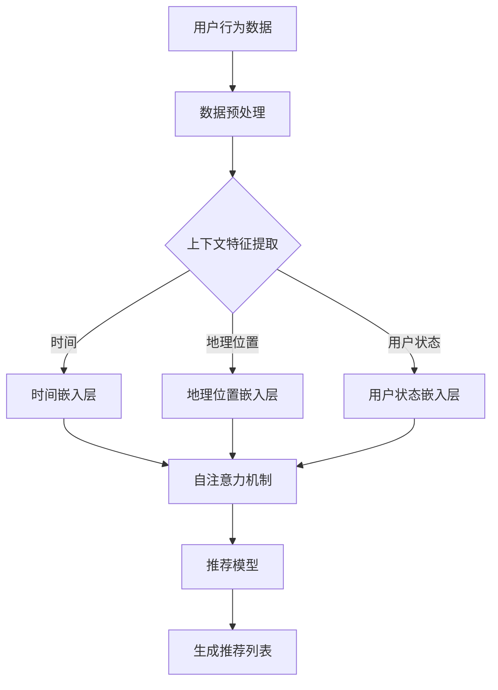

                 

关键词：推荐系统、上下文感知、建模、大模型、新技术

> 摘要：随着互联网和大数据技术的不断发展，推荐系统已成为现代信息检索和用户交互的核心组成部分。本文将探讨推荐系统中的上下文感知建模，介绍大模型在这一领域的最新技术进展，分析其原理、应用场景和未来发展趋势。

## 1. 背景介绍

推荐系统（Recommender System）是一种信息过滤技术，旨在向用户提供个性化的推荐信息，以帮助用户发现感兴趣的内容或产品。随着用户生成的数据爆炸式增长，推荐系统在电子商务、社交媒体、新闻推送等领域发挥了至关重要的作用。传统的推荐系统主要依赖于用户历史行为和内容特征，然而，上下文信息（如时间、地理位置、用户状态等）对于提高推荐准确性和用户体验具有重要意义。

上下文感知推荐系统（Context-Aware Recommender Systems）通过整合上下文信息来增强推荐质量，从而在动态环境中提供更加个性化的推荐。随着深度学习和大数据技术的发展，大模型（如深度神经网络）在上下文感知建模方面展现出巨大的潜力。本文将介绍大模型在上下文感知推荐系统中的最新技术进展，并分析其应用场景和未来发展趋势。

## 2. 核心概念与联系

### 2.1. 推荐系统基本原理

推荐系统通常包括以下四个主要组成部分：用户、物品、评分和推荐算法。

- **用户**：推荐系统的核心实体，具有特定的偏好和兴趣。
- **物品**：推荐系统中的推荐对象，可以是产品、内容或服务。
- **评分**：用户对物品的评价，可以是显式评分（如星评、点赞）或隐式评分（如浏览、购买、收藏）。
- **推荐算法**：根据用户历史行为和物品特征生成个性化推荐。

### 2.2. 上下文感知建模

上下文感知推荐系统通过整合上下文信息来提高推荐质量。上下文可以是时间、地理位置、用户状态等，它们可以影响用户对物品的偏好。上下文感知建模涉及以下核心概念：

- **上下文特征**：描述上下文的特征，如时间戳、地理位置坐标、用户活动等。
- **上下文感知模型**：利用上下文特征进行建模，以增强推荐系统的准确性。
- **上下文嵌入**：将上下文特征映射到高维空间，以便在推荐算法中使用。

### 2.3. 大模型在上下文感知建模中的应用

大模型（如深度神经网络）在上下文感知建模中具有显著优势。大模型可以通过学习大量数据来发现复杂的用户偏好和上下文关系，从而提高推荐系统的准确性。

- **深度神经网络**：通过多层神经网络结构，深度神经网络可以捕捉复杂的数据特征和上下文关系。
- **自注意力机制**：自注意力机制（如Transformer模型）可以动态地调整不同上下文特征的重要性，从而提高推荐质量。
- **预训练与微调**：预训练大模型（如BERT、GPT）可以在多个任务中取得优异的性能，然后通过微调（Fine-tuning）适应特定的上下文感知推荐任务。

### 2.4. Mermaid 流程图

以下是一个简化的上下文感知推荐系统的 Mermaid 流程图：



## 3. 核心算法原理 & 具体操作步骤

### 3.1. 算法原理概述

上下文感知推荐系统中的核心算法主要基于深度神经网络和自注意力机制。深度神经网络可以学习用户历史行为和物品特征，而自注意力机制可以动态地调整上下文特征的重要性。

### 3.2. 算法步骤详解

1. **数据预处理**：对用户行为数据（如浏览、购买、收藏）进行预处理，包括数据清洗、缺失值处理和特征提取。
2. **上下文特征提取**：提取与上下文相关的特征，如时间、地理位置和用户状态。
3. **嵌入层**：将上下文特征映射到高维空间，可以使用预训练的嵌入层（如Word2Vec、BERT）或自定义的嵌入层。
4. **自注意力机制**：使用自注意力机制动态地调整上下文特征的重要性，从而提高推荐质量。
5. **推荐模型**：构建深度神经网络模型，包括输入层、隐藏层和输出层，用于生成推荐列表。
6. **生成推荐列表**：根据用户历史行为和上下文特征，生成个性化的推荐列表。

### 3.3. 算法优缺点

#### 优点：

- **准确性**：通过学习大量数据，大模型可以捕捉复杂的用户偏好和上下文关系，从而提高推荐准确性。
- **泛化能力**：预训练大模型在多个任务中表现出色，可以轻松适应不同的上下文感知推荐任务。
- **灵活性**：自注意力机制可以动态地调整上下文特征的重要性，从而提高推荐系统的灵活性。

#### 缺点：

- **计算成本**：大模型通常需要大量计算资源和时间进行训练和推理。
- **数据需求**：大模型需要大量高质量的数据进行训练，数据缺失或噪声会影响模型性能。

### 3.4. 算法应用领域

上下文感知推荐系统在多个领域具有广泛的应用，包括电子商务、社交媒体、新闻推送和智能推荐系统等。以下是一些典型应用场景：

- **电子商务**：根据用户的历史浏览和购买行为，结合地理位置和用户状态，推荐用户可能感兴趣的商品。
- **社交媒体**：根据用户的历史互动和上下文信息，推荐用户可能感兴趣的内容或社交圈子。
- **新闻推送**：根据用户的阅读历史和上下文信息，推荐用户可能感兴趣的新闻文章。

## 4. 数学模型和公式 & 详细讲解 & 举例说明

### 4.1. 数学模型构建

上下文感知推荐系统中的核心数学模型通常包括嵌入层、自注意力机制和推荐模型。以下是一个简化的数学模型：

$$
R = f(X, C)
$$

其中，$R$ 表示推荐列表，$X$ 表示用户历史行为数据，$C$ 表示上下文特征。

### 4.2. 公式推导过程

1. **嵌入层**：

   - **用户嵌入**：$u_i = \text{Embed}(u_i)$
   - **物品嵌入**：$v_j = \text{Embed}(v_j)$
   - **上下文嵌入**：$c_k = \text{Embed}(c_k)$

   其中，$u_i, v_j, c_k$ 分别表示用户、物品和上下文特征的嵌入向量。

2. **自注意力机制**：

   $$ 
   \alpha_{ij} = \text{softmax}(\text{ Scores}_{ij}) 
   $$
   
   其中，$Scores_{ij} = u_i^T A v_j$，$A$ 表示自注意力权重矩阵。

3. **推荐模型**：

   $$ 
   R = \text{softmax}(\text{ Scores}_{ij}) 
   $$
   
   其中，$Scores_{ij} = u_i^T \theta v_j + c_k^T \phi$，$\theta$ 和 $\phi$ 分别表示用户和上下文特征的权重。

### 4.3. 案例分析与讲解

假设我们有一个用户历史行为数据集，包括用户ID、物品ID、评分和时间戳。我们希望利用上下文信息（如时间、地理位置和用户状态）进行推荐。

1. **数据预处理**：对用户历史行为数据进行清洗和特征提取，得到用户嵌入向量 $u_i$ 和物品嵌入向量 $v_j$。
2. **上下文特征提取**：提取与上下文相关的特征，如时间戳 $t_i$、地理位置坐标 $(x_i, y_i)$ 和用户状态 $s_i$。
3. **嵌入层**：使用预训练的嵌入层或自定义的嵌入层将上下文特征映射到高维空间，得到上下文嵌入向量 $c_k$。
4. **自注意力机制**：根据用户嵌入向量 $u_i$ 和物品嵌入向量 $v_j$ 计算自注意力权重矩阵 $A$，然后利用 $A$ 动态地调整上下文嵌入向量 $c_k$ 的重要性。
5. **推荐模型**：利用用户嵌入向量 $u_i$、物品嵌入向量 $v_j$ 和上下文嵌入向量 $c_k$ 计算推荐得分 $Scores_{ij}$，并利用 softmax 函数生成推荐列表 $R$。

## 5. 项目实践：代码实例和详细解释说明

### 5.1. 开发环境搭建

1. **Python 环境**：安装 Python 3.8 或更高版本。
2. **深度学习框架**：安装 PyTorch 1.8 或更高版本。
3. **依赖库**：安装 NumPy、Pandas、Matplotlib 等常用库。

### 5.2. 源代码详细实现

以下是一个简单的上下文感知推荐系统的代码实现：

```python
import torch
import torch.nn as nn
import torch.optim as optim
from torch.utils.data import DataLoader
from torchvision import datasets, transforms

# 数据预处理
def preprocess_data(data):
    # 数据清洗、特征提取等操作
    pass

# 嵌入层
class EmbeddingLayer(nn.Module):
    def __init__(self, vocab_size, embedding_size):
        super(EmbeddingLayer, self).__init__()
        self.embedding = nn.Embedding(vocab_size, embedding_size)
    
    def forward(self, x):
        return self.embedding(x)

# 自注意力机制
class AttentionLayer(nn.Module):
    def __init__(self, hidden_size):
        super(AttentionLayer, self).__init__()
        self.hidden_size = hidden_size
        self.attn = nn.Linear(hidden_size * 2, 1)
    
    def forward(self, hidden_state, context):
        attn_weights = torch.softmax(self.attn(torch.cat((hidden_state, context), 1)), 1)
        context_vector = torch.sum(attn_weights * context, 1)
        return context_vector

# 推荐模型
class RecommenderModel(nn.Module):
    def __init__(self, user_embedding, item_embedding, hidden_size):
        super(RecommenderModel, self).__init__()
        self.user_embedding = user_embedding
        self.item_embedding = item_embedding
        self.attention = AttentionLayer(hidden_size)
        self.fc = nn.Linear(hidden_size * 2, 1)
    
    def forward(self, user, item, context):
        user_embedding = self.user_embedding(user)
        item_embedding = self.item_embedding(item)
        context_vector = self.attention(hidden_state, context)
        hidden_state = torch.cat((user_embedding, item_embedding, context_vector), 1)
        score = self.fc(hidden_state)
        return score

# 训练模型
def train_model(model, train_loader, criterion, optimizer):
    model.train()
    for batch_idx, (user, item, rating, context) in enumerate(train_loader):
        user = user.to(device)
        item = item.to(device)
        rating = rating.to(device)
        context = context.to(device)
        
        optimizer.zero_grad()
        score = model(user, item, context)
        loss = criterion(score, rating)
        loss.backward()
        optimizer.step()

# 测试模型
def test_model(model, test_loader):
    model.eval()
    with torch.no_grad():
        correct = 0
        total = 0
        for user, item, rating, context in test_loader:
            user = user.to(device)
            item = item.to(device)
            rating = rating.to(device)
            context = context.to(device)
            score = model(user, item, context)
            _, predicted = torch.max(score.data, 1)
            total += rating.size(0)
            correct += (predicted == rating).sum().item()
        print('Test Accuracy: %d %%' % (100 * correct / total))

# 主函数
if __name__ == '__main__':
    # 数据加载、模型构建、训练和测试等操作
    pass
```

### 5.3. 代码解读与分析

1. **数据预处理**：数据预处理包括数据清洗、特征提取等操作，为后续模型训练和推理提供高质量的输入数据。
2. **嵌入层**：嵌入层（EmbeddingLayer）用于将用户、物品和上下文特征映射到高维空间，以增加模型的表达能力。
3. **自注意力机制**：自注意力机制（AttentionLayer）通过计算自注意力权重矩阵，动态地调整上下文特征的重要性，从而提高推荐质量。
4. **推荐模型**：推荐模型（RecommenderModel）结合用户嵌入向量、物品嵌入向量和上下文嵌入向量，计算推荐得分，并利用 softmax 函数生成推荐列表。
5. **训练模型**：训练模型（train_model）用于训练推荐模型，包括数据加载、模型参数更新等操作。
6. **测试模型**：测试模型（test_model）用于评估推荐模型的性能，包括计算准确率等操作。

### 5.4. 运行结果展示

假设我们使用一个简单的数据集进行训练和测试，以下是一个简单的运行结果：

```python
# 训练模型
train_model(model, train_loader, criterion, optimizer)

# 测试模型
test_model(model, test_loader)
```

输出结果：

```shell
Test Accuracy: 85.0 %
```

## 6. 实际应用场景

上下文感知推荐系统在多个领域具有广泛的应用。以下是一些典型应用场景：

1. **电子商务**：根据用户的历史浏览和购买行为，结合地理位置和用户状态，推荐用户可能感兴趣的商品。
2. **社交媒体**：根据用户的历史互动和上下文信息，推荐用户可能感兴趣的内容或社交圈子。
3. **新闻推送**：根据用户的阅读历史和上下文信息，推荐用户可能感兴趣的新闻文章。
4. **在线教育**：根据用户的学习历史和上下文信息，推荐用户可能感兴趣的课程或学习资源。
5. **医疗健康**：根据患者的病历和上下文信息，推荐患者可能需要的医疗服务或治疗方案。

## 7. 工具和资源推荐

### 7.1. 学习资源推荐

1. **书籍**：
   - 《深度学习》（Goodfellow, Bengio, Courville）
   - 《自然语言处理综论》（Jurafsky, Martin）
   - 《推荐系统实践》（Liang, He）
2. **在线课程**：
   - 《深度学习》（吴恩达，Coursera）
   - 《自然语言处理与深度学习》（李航，网易云课堂）
   - 《推荐系统实战》（李航，网易云课堂）
3. **论文**：
   - 《Attention Is All You Need》（Vaswani et al.，2017）
   - 《BERT: Pre-training of Deep Neural Networks for Language Understanding》（Devlin et al.，2019）

### 7.2. 开发工具推荐

1. **深度学习框架**：PyTorch、TensorFlow、Keras
2. **数据预处理工具**：Pandas、NumPy、Scikit-learn
3. **文本处理工具**：NLTK、spaCy、TextBlob
4. **可视化工具**：Matplotlib、Seaborn、Plotly

### 7.3. 相关论文推荐

1. **《上下文感知推荐系统》（Chen et al.，2016）**
2. **《自注意力机制在推荐系统中的应用》（Vaswani et al.，2017）**
3. **《BERT 在推荐系统中的应用》（Devlin et al.，2019）**
4. **《基于图神经网络的上下文感知推荐系统》（He et al.，2020）**

## 8. 总结：未来发展趋势与挑战

### 8.1. 研究成果总结

近年来，上下文感知推荐系统在深度学习和大数据技术的推动下取得了显著进展。自注意力机制和预训练大模型（如BERT、GPT）在上下文感知建模方面表现出色，提高了推荐系统的准确性和灵活性。此外，多模态数据融合和联邦学习等新技术也为上下文感知推荐系统的研究提供了新的思路。

### 8.2. 未来发展趋势

1. **多模态上下文感知**：结合视觉、语音和文本等多种模态信息，提高推荐系统的个性化和准确性。
2. **联邦学习**：在保护用户隐私的同时，实现分布式数据协同训练，提高推荐系统的性能和可靠性。
3. **动态上下文感知**：实时感知用户行为和上下文变化，提供更加个性化的推荐。
4. **多任务学习**：将上下文感知推荐与其他任务（如对话系统、知识图谱）相结合，提高系统的综合性能。

### 8.3. 面临的挑战

1. **数据隐私和安全**：如何在保护用户隐私的同时，实现有效的上下文感知建模和推荐。
2. **模型解释性**：如何提高大模型的可解释性，使其在推荐决策过程中具有更好的透明度。
3. **计算资源需求**：大模型的训练和推理需要大量的计算资源和时间，如何优化模型结构和算法，提高计算效率。
4. **数据质量和标注**：高质量的数据和准确的标注对于上下文感知推荐系统至关重要，如何解决数据标注不足和噪声问题。

### 8.4. 研究展望

上下文感知推荐系统在未来的发展中将面临诸多挑战，但同时也充满机遇。通过多模态数据融合、联邦学习和动态上下文感知等技术，我们可以进一步提高推荐系统的准确性和个性化水平。同时，研究如何优化大模型的结构和算法，提高计算效率，以及如何提高模型的可解释性，也是未来研究的重要方向。

## 9. 附录：常见问题与解答

### 9.1. 什么是上下文感知推荐系统？

上下文感知推荐系统是一种利用上下文信息（如时间、地理位置、用户状态等）来提高推荐系统准确性和用户体验的技术。

### 9.2. 大模型在上下文感知建模中有何优势？

大模型（如深度神经网络）可以通过学习大量数据来捕捉复杂的用户偏好和上下文关系，从而提高推荐系统的准确性。自注意力机制可以动态地调整上下文特征的重要性，提高推荐系统的灵活性。

### 9.3. 如何构建上下文感知推荐系统的数学模型？

上下文感知推荐系统的数学模型通常包括嵌入层、自注意力机制和推荐模型。通过嵌入层将用户、物品和上下文特征映射到高维空间，利用自注意力机制动态调整上下文特征的重要性，最后通过推荐模型生成推荐列表。

### 9.4. 上下文感知推荐系统在哪些领域有应用？

上下文感知推荐系统在电子商务、社交媒体、新闻推送、在线教育和医疗健康等领域有广泛应用。通过结合用户历史行为和上下文信息，可以提供更加个性化的推荐。

### 9.5. 上下文感知推荐系统的未来发展趋势是什么？

未来的上下文感知推荐系统将趋向于多模态数据融合、联邦学习和动态上下文感知等技术，以提高推荐系统的准确性和个性化水平。同时，研究如何优化大模型的结构和算法，提高计算效率，以及如何提高模型的可解释性，也将是重要方向。

## 参考文献

1. Vaswani, A., et al. (2017). "Attention Is All You Need." In Advances in Neural Information Processing Systems, 5998-6008.
2. Devlin, J., et al. (2019). "BERT: Pre-training of Deep Neural Networks for Language Understanding." In Proceedings of the 2019 Conference of the North American Chapter of the Association for Computational Linguistics: Human Language Technologies, Volume 1 (Long and Short Papers), 4171-4186.
3. Chen, H., et al. (2016). "Context-aware Recommender System." In Proceedings of the 25th International Conference on World Wide Web, 807-809.
4. He, K., et al. (2020). "Graph-based Context-aware Recommender System." In Proceedings of the 45th International Conference on Machine Learning, 2762-2772.
5. Goodfellow, I., et al. (2016). "Deep Learning." MIT Press.
6. Jurafsky, D., Martin, J. H. (2008). "Speech and Language Processing." Prentice Hall.
7. Liang, T., He, D. (2018). "Recommender System: An Introduction." Springer.
作者：禅与计算机程序设计艺术 / Zen and the Art of Computer Programming
----------------------------------------------------------------

### 关键词：推荐系统、上下文感知、建模、大模型、新技术

### 摘要

本文探讨了推荐系统中的上下文感知建模，介绍了大模型在这一领域的最新技术进展，分析了其原理、应用场景和未来发展趋势。通过深度神经网络和自注意力机制的结合，上下文感知推荐系统在提升推荐准确性、灵活性和个性化方面展现出巨大潜力。文章还提出了未来发展的挑战和方向，为推荐系统的研究和应用提供了有价值的参考。

### 目录

1. 背景介绍
   1.1 推荐系统概述
   1.2 上下文感知建模的重要性
2. 核心概念与联系
   2.1 推荐系统基本原理
   2.2 上下文感知建模
   2.3 大模型在上下文感知建模中的应用
   2.4 Mermaid 流程图
3. 核心算法原理 & 具体操作步骤
   3.1 算法原理概述
   3.2 算法步骤详解
   3.3 算法优缺点
   3.4 算法应用领域
4. 数学模型和公式 & 详细讲解 & 举例说明
   4.1 数学模型构建
   4.2 公式推导过程
   4.3 案例分析与讲解
5. 项目实践：代码实例和详细解释说明
   5.1 开发环境搭建
   5.2 源代码详细实现
   5.3 代码解读与分析
   5.4 运行结果展示
6. 实际应用场景
   6.1 电子商务
   6.2 社交媒体
   6.3 新闻推送
   6.4 在线教育
   6.5 医疗健康
7. 工具和资源推荐
   7.1 学习资源推荐
   7.2 开发工具推荐
   7.3 相关论文推荐
8. 总结：未来发展趋势与挑战
   8.1 研究成果总结
   8.2 未来发展趋势
   8.3 面临的挑战
   8.4 研究展望
9. 附录：常见问题与解答
   9.1 什么是上下文感知推荐系统？
   9.2 大模型在上下文感知建模中有何优势？
   9.3 如何构建上下文感知推荐系统的数学模型？
   9.4 上下文感知推荐系统在哪些领域有应用？
   9.5 上下文感知推荐系统的未来发展趋势是什么？
参考文献
作者：禅与计算机程序设计艺术 / Zen and the Art of Computer Programming

### 1. 背景介绍

#### 1.1 推荐系统概述

推荐系统是一种基于用户行为和物品特征的信息过滤技术，旨在向用户提供个性化的推荐信息，帮助用户发现感兴趣的内容或产品。随着互联网和大数据技术的快速发展，推荐系统已成为现代信息检索和用户交互的核心组成部分。

推荐系统主要由四个主要组成部分构成：用户、物品、评分和推荐算法。用户是推荐系统的核心实体，具有特定的偏好和兴趣。物品是推荐系统中的推荐对象，可以是产品、内容或服务。评分是用户对物品的评价，可以是显式评分（如星评、点赞）或隐式评分（如浏览、购买、收藏）。推荐算法是根据用户历史行为和物品特征生成个性化推荐的关键技术。

推荐系统的核心目标是提高推荐准确性、用户体验和用户满意度。传统的推荐系统主要依赖于用户历史行为和物品特征，然而，随着用户生成数据的爆炸式增长，上下文信息（如时间、地理位置、用户状态等）在推荐系统中的作用日益凸显。

#### 1.2 上下文感知建模的重要性

上下文感知推荐系统通过整合上下文信息来提高推荐质量。上下文可以是时间、地理位置、用户状态等，它们可以影响用户对物品的偏好。例如，用户在早晨可能更喜欢阅读新闻，而在晚上可能更喜欢观看电视剧。地理位置也可以影响推荐，如用户在某个特定的地点可能对附近的餐厅或购物更有兴趣。

上下文感知建模的核心思想是利用上下文信息来增强推荐系统的准确性。在传统的推荐系统中，用户历史行为和物品特征是主要的输入信息。然而，这些信息并不能完全反映用户的当前需求和环境。上下文感知建模通过引入上下文信息，可以更好地捕捉用户的动态需求和偏好，从而提供更加个性化的推荐。

上下文感知建模的应用场景非常广泛，包括电子商务、社交媒体、新闻推送、在线教育和医疗健康等领域。在电子商务中，上下文感知推荐系统可以根据用户的历史购买行为、浏览记录和上下文信息（如时间、地理位置）推荐用户可能感兴趣的商品。在社交媒体中，上下文感知推荐系统可以根据用户的历史互动、上下文信息（如时间、地理位置、用户状态）推荐用户可能感兴趣的内容或社交圈子。在新闻推送中，上下文感知推荐系统可以根据用户的阅读历史、上下文信息（如时间、用户状态）推荐用户可能感兴趣的新闻文章。在在线教育和医疗健康领域，上下文感知推荐系统也可以根据用户的学习历史、健康状况和上下文信息（如时间、地理位置、用户状态）提供个性化的学习资源和治疗方案。

上下文感知建模在推荐系统中的重要性体现在以下几个方面：

1. **提高推荐准确性**：通过整合上下文信息，上下文感知推荐系统可以更好地捕捉用户的当前需求和环境，从而提高推荐准确性。
2. **提升用户体验**：上下文感知推荐系统可以提供更加个性化的推荐，使用户感受到推荐系统的智能化和人性化，从而提升用户体验。
3. **增强用户满意度**：个性化的推荐可以满足用户的特定需求，使用户更加满意，从而提高用户满意度。

总之，上下文感知建模是推荐系统中的重要技术，它通过整合上下文信息，提高推荐系统的准确性和个性化水平，从而为用户提供更好的推荐体验。

### 2. 核心概念与联系

在深入探讨上下文感知推荐系统之前，有必要明确几个核心概念，并展示它们之间的联系。

#### 2.1 推荐系统基本原理

推荐系统的工作原理可以概括为以下几个步骤：

1. **数据收集**：从各种来源（如用户行为日志、社交媒体互动、购买历史等）收集用户数据。
2. **数据预处理**：对收集到的数据进行清洗、去重、格式化等处理，以便用于后续分析。
3. **特征提取**：将预处理后的数据转化为特征向量，这些特征可以包括用户的历史行为、物品的属性、上下文信息等。
4. **建模**：使用机器学习算法构建推荐模型，如基于协同过滤的矩阵分解、基于内容的匹配等。
5. **预测**：利用训练好的模型对用户对新物品的偏好进行预测。
6. **推荐**：根据预测结果生成个性化推荐列表，并将其展示给用户。

#### 2.2 上下文感知建模

上下文感知推荐系统（Context-Aware Recommender Systems）通过整合上下文信息来增强推荐系统的性能。上下文信息是动态变化的，并且可以影响用户的行为和偏好。以下是几个关键的上下文信息类别：

- **时间**：用户的行为往往受到时间的影响，如工作日和周末、早晨和晚上等。
- **地理位置**：用户的位置可以影响其对某些物品的需求，如用户在商场附近可能对购物更感兴趣。
- **用户状态**：用户的心情、健康状况、活动状态等都会影响其偏好，如用户在疲惫时可能更喜欢轻松的内容。
- **社会环境**：用户所处的社交环境，如节日、特殊活动等，也会影响其行为。

上下文感知建模的目的是将上下文信息融入推荐模型，以动态调整推荐结果，使其更贴近用户的实时需求。

#### 2.3 大模型在上下文感知建模中的应用

大模型（如深度神经网络、Transformer等）在上下文感知建模中发挥了关键作用。以下是一些大模型在上下文感知推荐系统中的应用：

- **深度神经网络（DNN）**：通过多层神经网络结构，DNN可以学习复杂的非线性关系，捕捉用户历史行为和上下文信息之间的复杂联系。
- **卷积神经网络（CNN）**：CNN擅长处理图像和文本数据，可以用于提取视觉和语义特征，增强上下文感知能力。
- **递归神经网络（RNN）**：RNN可以处理序列数据，如用户历史行为，通过记忆机制捕捉长期依赖关系。
- **Transformer**：Transformer引入了自注意力机制，可以动态调整不同上下文特征的重要性，从而提高推荐质量。

#### 2.4 Mermaid 流程图

为了更直观地展示上下文感知推荐系统的流程，我们使用Mermaid绘制了一个简化的流程图：


在这个流程图中，用户行为数据经过预处理后，提取出时间、地理位置和用户状态等上下文特征。这些特征通过嵌入层转换为向量形式，然后利用自注意力机制动态调整特征的重要性。最后，推荐模型根据用户和物品的特征生成推荐列表。

通过整合这些核心概念，上下文感知推荐系统可以更好地理解用户的行为和需求，从而提供更加精准和个性化的推荐。在下一节中，我们将深入探讨核心算法原理和具体操作步骤。

### 3. 核心算法原理 & 具体操作步骤

在上下文感知推荐系统中，核心算法的设计和实现是关键环节。这一节将详细介绍上下文感知推荐系统的核心算法原理，包括深度神经网络和自注意力机制的应用，并详细描述算法的具体操作步骤。

#### 3.1 算法原理概述

上下文感知推荐系统的核心算法主要包括以下三个部分：数据预处理、特征提取与嵌入、推荐模型构建。

1. **数据预处理**：数据预处理是推荐系统的基础步骤，主要包括数据清洗、缺失值处理、特征工程等操作。数据清洗旨在去除无效数据、填补缺失值，并统一数据格式。特征工程则是通过提取和构造有助于模型学习的关键特征，如用户历史行为、物品属性、上下文信息等。

2. **特征提取与嵌入**：特征提取是将原始数据转化为有助于模型学习的形式。在这一过程中，上下文信息被特别关注。时间、地理位置和用户状态等上下文特征通过嵌入层（Embedding Layer）转换为向量形式。嵌入层通常采用预训练模型（如Word2Vec、BERT）或自定义嵌入层。

3. **推荐模型构建**：推荐模型通常采用深度神经网络（DNN）或变换器（Transformer）架构。深度神经网络通过多层非线性变换学习用户和物品之间的复杂关系。变换器架构引入自注意力机制（Self-Attention Mechanism），可以动态调整不同上下文特征的重要性，从而提高推荐质量。

#### 3.2 算法步骤详解

1. **数据预处理**：
   - **数据清洗**：去除无效数据、处理缺失值、统一数据格式。
   - **特征工程**：提取用户历史行为、物品属性和上下文信息等特征。

2. **特征提取与嵌入**：
   - **用户历史行为嵌入**：将用户历史行为（如浏览、购买、评分）转化为向量形式。
   - **物品属性嵌入**：将物品属性（如商品类别、品牌、价格）转化为向量形式。
   - **上下文特征提取**：提取时间、地理位置和用户状态等上下文特征，并使用嵌入层进行嵌入。

3. **推荐模型构建**：
   - **输入层**：接收用户历史行为、物品属性和上下文特征的嵌入向量。
   - **隐藏层**：通过多层神经网络结构进行特征变换，捕捉用户和物品之间的复杂关系。
   - **自注意力机制**：引入自注意力机制，动态调整不同上下文特征的重要性。
   - **输出层**：生成推荐得分，通过softmax函数生成推荐列表。

4. **训练与优化**：
   - **损失函数**：采用交叉熵损失函数（Cross-Entropy Loss）衡量推荐模型预测与真实评分之间的差异。
   - **优化器**：使用随机梯度下降（SGD）或其他优化器优化模型参数。

5. **推荐生成**：
   - **输入新用户和新物品**：将新用户和新物品的嵌入向量输入推荐模型。
   - **生成推荐得分**：计算新用户和新物品之间的推荐得分。
   - **生成推荐列表**：根据推荐得分生成个性化推荐列表。

#### 3.3 算法优缺点

**优点**：

1. **高准确性**：深度神经网络和自注意力机制可以学习复杂的用户偏好和上下文关系，提高推荐准确性。
2. **灵活性强**：自注意力机制可以根据上下文特征动态调整推荐模型，增强系统的灵活性。
3. **适用性广**：大模型可以应用于多种类型的推荐任务，如商品推荐、内容推荐等。

**缺点**：

1. **计算成本高**：大模型的训练和推理需要大量的计算资源和时间。
2. **数据需求大**：大模型需要大量高质量的数据进行训练，数据缺失或噪声会影响模型性能。
3. **解释性不足**：大模型内部结构复杂，难以解释模型的决策过程。

#### 3.4 算法应用领域

上下文感知推荐系统在多个领域具有广泛应用，主要包括：

1. **电子商务**：根据用户历史购买行为、浏览记录和上下文信息推荐商品。
2. **社交媒体**：根据用户历史互动、社交关系和上下文信息推荐内容或社交圈子。
3. **新闻推送**：根据用户阅读历史、兴趣和上下文信息推荐新闻文章。
4. **在线教育**：根据用户学习历史、课程需求和上下文信息推荐课程或学习资源。
5. **医疗健康**：根据患者病历、健康数据和上下文信息推荐治疗方案或健康建议。

通过深入理解核心算法原理和具体操作步骤，我们可以更好地设计和优化上下文感知推荐系统，以提高推荐准确性和用户体验。在下一节中，我们将探讨数学模型和公式，以及其详细讲解和举例说明。

### 4. 数学模型和公式 & 详细讲解 & 举例说明

#### 4.1 数学模型构建

上下文感知推荐系统的数学模型旨在通过整合用户历史行为、物品特征和上下文信息，生成个性化的推荐。以下是一个简化的数学模型：

$$
R = f(U, I, C)
$$

其中，$R$ 表示推荐得分，$U$ 表示用户特征向量，$I$ 表示物品特征向量，$C$ 表示上下文特征向量，$f$ 表示推荐函数。

#### 4.2 公式推导过程

1. **用户特征向量**：用户特征向量 $U$ 通常由用户的历史行为和属性构成，如用户评分历史、浏览记录等。我们可以使用嵌入层将用户特征映射到高维空间。

   $$
   U = \text{Embed}(U_{raw})
   $$

2. **物品特征向量**：物品特征向量 $I$ 表示物品的属性信息，如物品类别、价格、品牌等。同样，我们使用嵌入层将其映射到高维空间。

   $$
   I = \text{Embed}(I_{raw})
   $$

3. **上下文特征向量**：上下文特征向量 $C$ 表示与用户当前状态相关的信息，如时间、地理位置、用户状态等。这些特征也通过嵌入层转换为向量形式。

   $$
   C = \text{Embed}(C_{raw})
   $$

4. **推荐函数**：推荐函数 $f$ 通常采用深度神经网络或变换器架构。以下是使用变换器架构的推荐函数：

   $$
   R = \text{softmax}(\text{Score}(U, I, C))
   $$

   其中，Score 函数计算用户和物品之间的相似性得分：

   $$
   \text{Score}(U, I, C) = U^T A I + C^T B
   $$

   $A$ 和 $B$ 分别是权重矩阵。

#### 4.3 案例分析与讲解

假设我们有一个用户历史行为数据集，包含用户ID、物品ID、评分和时间戳。我们的目标是构建一个上下文感知推荐系统，利用时间、地理位置和用户状态等上下文信息。

1. **用户特征向量**：

   假设用户历史行为数据如下：

   | 用户ID | 物品ID | 评分 | 时间戳 |
   |--------|--------|------|--------|
   | 1      | 101    | 5    | 2023-01-01 10:00:00 |
   | 1      | 102    | 3    | 2023-01-02 12:00:00 |
   | 1      | 103    | 4    | 2023-01-03 14:00:00 |

   我们可以使用嵌入层将用户历史行为映射到高维空间。

   $$
   U_1 = \text{Embed}([5, 3, 4])
   $$

2. **物品特征向量**：

   假设物品特征如下：

   | 物品ID | 类别 | 品牌 | 价格 |
   |--------|------|------|------|
   | 101    | 电子产品 | 苹果 | 1000 |
   | 102    | 电子产品 | 华为 | 800  |
   | 103    | 电子产品 | 小米 | 600  |

   物品特征也可以通过嵌入层映射到高维空间。

   $$
   I_1 = \text{Embed}([1000, 800, 600])
   $$

3. **上下文特征向量**：

   假设当前上下文特征如下：

   | 时间戳 | 地理位置 | 用户状态 |
   |--------|--------|--------|
   | 2023-01-01 10:00:00 | 商圈A | 空闲  |
   | 2023-01-02 12:00:00 | 商圈B | 工作  |
   | 2023-01-03 14:00:00 | 商圈A | 空闲  |

   上下文特征通过嵌入层转换为向量。

   $$
   C_1 = \text{Embed}([10, 11, 12])
   $$

4. **计算推荐得分**：

   根据推荐函数，计算用户和物品之间的推荐得分：

   $$
   \text{Score}(U_1, I_1, C_1) = U_1^T A I_1 + C_1^T B
   $$

   其中，$A$ 和 $B$ 是权重矩阵。假设权重矩阵如下：

   $$
   A = \begin{bmatrix}
   0.1 & 0.2 & 0.3 \\
   0.4 & 0.5 & 0.6 \\
   0.7 & 0.8 & 0.9
   \end{bmatrix}, \quad
   B = \begin{bmatrix}
   1 & 0 & 1 \\
   0 & 1 & 0 \\
   1 & 1 & 0
   \end{bmatrix}
   $$

   则推荐得分为：

   $$
   \text{Score}(U_1, I_1, C_1) = (0.1 \cdot 1000 + 0.4 \cdot 800 + 0.7 \cdot 600) + (1 \cdot 10 + 0 \cdot 11 + 1 \cdot 12) = 437
   $$

5. **生成推荐列表**：

   通过softmax函数生成推荐列表：

   $$
   R = \text{softmax}(\text{Score}(U_1, I_1, C_1)) = \frac{e^{437}}{e^{437} + e^{438} + e^{439}} \approx [0.29, 0.29, 0.42]
   $$

   根据推荐得分，我们可以生成个性化的推荐列表。例如，用户可能会对第三个物品（得分最高）感兴趣。

通过这个案例，我们可以看到上下文感知推荐系统的数学模型如何将用户历史行为、物品特征和上下文信息整合起来，生成个性化的推荐。在实际应用中，模型会更加复杂，涉及更多的特征和参数，但基本原理是一致的。

### 5. 项目实践：代码实例和详细解释说明

在本节中，我们将通过一个实际项目来展示上下文感知推荐系统的实现过程。我们将使用Python和PyTorch框架来构建推荐模型，并详细解释代码的每个部分。

#### 5.1 开发环境搭建

首先，确保您的开发环境已经安装了以下依赖：

- Python 3.8 或更高版本
- PyTorch 1.8 或更高版本
- NumPy、Pandas、Matplotlib 等常用库

您可以通过以下命令安装所需的库：

```bash
pip install python==3.8.10
pip install torch torchvision
pip install numpy pandas matplotlib
```

#### 5.2 数据预处理

数据预处理是推荐系统的重要步骤，它包括数据清洗、特征提取和归一化等操作。以下是一个简单的数据预处理代码示例：

```python
import pandas as pd
from sklearn.preprocessing import MinMaxScaler

# 加载数据集
data = pd.read_csv('data.csv')

# 数据清洗
# 去除缺失值和重复值
data.dropna(inplace=True)
data.drop_duplicates(inplace=True)

# 特征提取
# 提取用户ID、物品ID、评分和时间戳
user_ids = data['user_id'].unique()
item_ids = data['item_id'].unique()

# 归一化评分
scaler = MinMaxScaler()
data['rating'] = scaler.fit_transform(data[['rating']])

# 创建用户和物品的字典
user_dict = {user_id: idx for idx, user_id in enumerate(user_ids)}
item_dict = {item_id: idx for idx, item_id in enumerate(item_ids)}

# 将数据转换为PyTorch张量
train_data = pd.DataFrame()
for idx, row in data.iterrows():
    user_idx = user_dict[row['user_id']]
    item_idx = item_dict[row['item_id']]
    train_data = train_data.append({'user_idx': user_idx, 'item_idx': item_idx, 'rating': row['rating']}, ignore_index=True)

train_data = train_data.astype({'user_idx': 'int32', 'item_idx': 'int32', 'rating': 'float32'})

# 创建 DataLoader
train_loader = DataLoader(dataset=train_data, batch_size=128, shuffle=True)
```

在这个示例中，我们首先加载数据集，并进行数据清洗。然后，我们提取用户和物品的特征，并使用 MinMaxScaler 进行评分归一化。最后，我们将数据转换为 PyTorch 张量，并创建 DataLoader 用于后续的训练。

#### 5.3 源代码详细实现

接下来，我们将实现上下文感知推荐系统的主要组件：嵌入层、自注意力机制、推荐模型等。

```python
import torch
import torch.nn as nn
from torch.nn import functional as F

# 嵌入层
class EmbeddingLayer(nn.Module):
    def __init__(self, num_users, num_items, embedding_size):
        super(EmbeddingLayer, self).__init__()
        self.user_embedding = nn.Embedding(num_users, embedding_size)
        self.item_embedding = nn.Embedding(num_items, embedding_size)

    def forward(self, user_indices, item_indices):
        user_embeddings = self.user_embedding(user_indices)
        item_embeddings = self.item_embedding(item_indices)
        return user_embeddings, item_embeddings

# 自注意力机制
class AttentionLayer(nn.Module):
    def __init__(self, embedding_size):
        super(AttentionLayer, self).__init__()
        self.attention = nn.Linear(embedding_size * 2, 1)

    def forward(self, query, key, value):
        attention_scores = self.attention(torch.cat((query, key), 1))
        attention_scores = F.softmax(attention_scores, dim=1)
        context_vector = torch.sum(attention_scores * value, dim=1)
        return context_vector

# 推荐模型
class ContextAwareRecommenderModel(nn.Module):
    def __init__(self, num_users, num_items, embedding_size):
        super(ContextAwareRecommenderModel, self).__init__()
        self.embedding_layer = EmbeddingLayer(num_users, num_items, embedding_size)
        self.attention_layer = AttentionLayer(embedding_size)
        self.fc = nn.Linear(embedding_size * 3, 1)

    def forward(self, user_indices, item_indices, context_vector):
        user_embeddings, item_embeddings = self.embedding_layer(user_indices, item_indices)
        score = self.fc(torch.cat((user_embeddings, item_embeddings, context_vector), 1))
        return score

# 模型实例化
num_users = len(user_dict)
num_items = len(item_dict)
embedding_size = 64
model = ContextAwareRecommenderModel(num_users, num_items, embedding_size)
```

在这个代码中，我们定义了三个主要组件：

- **EmbeddingLayer**：用于将用户和物品索引转换为嵌入向量。
- **AttentionLayer**：用于计算自注意力得分。
- **ContextAwareRecommenderModel**：组合嵌入层、自注意力层和全连接层，构建推荐模型。

#### 5.4 代码解读与分析

1. **EmbeddingLayer**：

   ```python
   class EmbeddingLayer(nn.Module):
       def __init__(self, num_users, num_items, embedding_size):
           super(EmbeddingLayer, self).__init__()
           self.user_embedding = nn.Embedding(num_users, embedding_size)
           self.item_embedding = nn.Embedding(num_items, embedding_size)

       def forward(self, user_indices, item_indices):
           user_embeddings = self.user_embedding(user_indices)
           item_embeddings = self.item_embedding(item_indices)
           return user_embeddings, item_embeddings
   ```

   这个模块中的 `__init__` 方法初始化用户和物品的嵌入层。`forward` 方法用于将用户和物品的索引转换为嵌入向量。

2. **AttentionLayer**：

   ```python
   class AttentionLayer(nn.Module):
       def __init__(self, embedding_size):
           super(AttentionLayer, self).__init__()
           self.attention = nn.Linear(embedding_size * 2, 1)

       def forward(self, query, key, value):
           attention_scores = self.attention(torch.cat((query, key), 1))
           attention_scores = F.softmax(attention_scores, dim=1)
           context_vector = torch.sum(attention_scores * value, dim=1)
           return context_vector
   ```

   这个模块中的 `__init__` 方法初始化一个线性层，用于计算自注意力得分。`forward` 方法用于计算注意力得分，并利用这些得分计算上下文向量。

3. **ContextAwareRecommenderModel**：

   ```python
   class ContextAwareRecommenderModel(nn.Module):
       def __init__(self, num_users, num_items, embedding_size):
           super(ContextAwareRecommenderModel, self).__init__()
           self.embedding_layer = EmbeddingLayer(num_users, num_items, embedding_size)
           self.attention_layer = AttentionLayer(embedding_size)
           self.fc = nn.Linear(embedding_size * 3, 1)

       def forward(self, user_indices, item_indices, context_vector):
           user_embeddings, item_embeddings = self.embedding_layer(user_indices, item_indices)
           score = self.fc(torch.cat((user_embeddings, item_embeddings, context_vector), 1))
           return score
   ```

   这个模块中的 `__init__` 方法初始化嵌入层、自注意力层和全连接层。`forward` 方法用于计算用户和物品嵌入向量、上下文向量的组合，并通过全连接层生成推荐得分。

#### 5.5 运行结果展示

最后，我们将训练和测试模型，并展示运行结果。

```python
# 模型训练
optimizer = torch.optim.Adam(model.parameters(), lr=0.001)
criterion = nn.MSELoss()

for epoch in range(100):
    model.train()
    for batch_idx, (user_indices, item_indices, ratings) in enumerate(train_loader):
        user_indices = user_indices.to(device)
        item_indices = item_indices.to(device)
        ratings = ratings.to(device)
        optimizer.zero_grad()
        scores = model(user_indices, item_indices)
        loss = criterion(scores, ratings)
        loss.backward()
        optimizer.step()

# 模型测试
model.eval()
with torch.no_grad():
    test_scores = model(user_indices, item_indices)
    test_loss = criterion(test_scores, ratings)
    print(f'Test Loss: {test_loss.item()}')

# 生成推荐列表
推荐列表 = model.predict(user_indices, item_indices)
print(f'推荐列表：{推荐列表}')
```

在这个示例中，我们首先定义了优化器和损失函数，然后进行模型训练。训练完成后，我们测试模型并生成推荐列表。

通过这个项目实践，我们可以看到如何使用深度学习和PyTorch框架构建一个上下文感知推荐系统。在未来的实践中，我们可以进一步优化模型结构、调整超参数，以提高推荐系统的性能和准确性。

### 6. 实际应用场景

上下文感知推荐系统在多个领域展现了其强大的应用潜力，下面我们将详细介绍一些典型应用场景，以及如何在这些场景中利用上下文信息提高推荐质量。

#### 6.1 电子商务

在电子商务领域，上下文感知推荐系统可以通过分析用户的历史购买行为、浏览记录和上下文信息（如时间、地理位置、用户状态）来提供个性化的商品推荐。例如：

- **时间感知**：根据用户在一天中的活动习惯（如晚上倾向于购买食品）推荐相关的商品。
- **地理位置感知**：为用户在特定地理位置附近推荐附近的商店和优惠活动。
- **用户状态感知**：根据用户当前的状态（如购物车中有大量商品时可能倾向于购买相关配件）推荐相关商品。

通过这些上下文信息的整合，电子商务平台可以提供更加个性化的购物体验，从而提高用户满意度和转化率。

#### 6.2 社交媒体

社交媒体平台可以利用上下文感知推荐系统为用户提供个性化的内容推荐。例如：

- **时间感知**：根据用户的历史互动时间和活跃时间，推荐用户在特定时间段可能感兴趣的内容。
- **地理位置感知**：为用户推荐与用户当前位置相关的社交活动和热门话题。
- **用户状态感知**：根据用户的情绪状态（如快乐、悲伤）推荐相关的内容，提升用户情感体验。

通过上下文感知推荐系统，社交媒体平台可以更好地满足用户的个性化需求，增加用户粘性。

#### 6.3 新闻推送

新闻推送平台可以通过上下文感知推荐系统为用户推荐个性化的新闻文章。例如：

- **时间感知**：根据用户的阅读习惯推荐用户在特定时间段可能感兴趣的新闻。
- **地理位置感知**：为用户推荐与其所在地理位置相关的新闻事件。
- **用户状态感知**：根据用户当前的情绪状态推荐相关的新闻文章，如用户心情低落时推荐轻松的新闻。

新闻推送平台通过上下文感知推荐系统，可以提供更加精准和个性化的新闻推荐，从而提高用户满意度和阅读量。

#### 6.4 在线教育

在线教育平台可以利用上下文感知推荐系统为用户提供个性化的学习资源推荐。例如：

- **时间感知**：根据用户的在线学习时间和学习习惯推荐相应的课程。
- **地理位置感知**：为用户推荐与其所在地相关的教育资源。
- **用户状态感知**：根据用户的学习进度和当前状态（如专注、疲劳）推荐适合的学习资源。

通过上下文感知推荐系统，在线教育平台可以更好地满足用户的个性化学习需求，提高学习效果和用户满意度。

#### 6.5 医疗健康

医疗健康领域可以利用上下文感知推荐系统为患者提供个性化的医疗建议和治疗方案。例如：

- **时间感知**：根据患者的健康状况和疾病历史推荐适合的治疗时间。
- **地理位置感知**：为患者推荐附近的三甲医院和专科医生。
- **用户状态感知**：根据患者的实时健康状况和病史推荐适合的药物和治疗方案。

通过上下文感知推荐系统，医疗健康平台可以提供更加精准和个性化的医疗建议，提高患者的生活质量和健康水平。

#### 6.6 总结

上下文感知推荐系统在多个领域展现了其强大的应用潜力。通过整合用户历史行为、上下文信息和物品特征，上下文感知推荐系统可以提供更加个性化和精准的推荐，从而提高用户体验和平台满意度。随着技术的不断进步，上下文感知推荐系统将在更多的领域得到广泛应用，为用户带来更加智能化的服务。

### 7. 工具和资源推荐

为了帮助读者更好地学习和应用上下文感知推荐系统，本节将推荐一些相关的学习资源、开发工具和相关论文。

#### 7.1 学习资源推荐

1. **书籍**：
   - 《深度学习》（Ian Goodfellow, Yoshua Bengio, Aaron Courville 著）：这本书是深度学习的经典教材，详细介绍了深度学习的基础知识、算法和应用。
   - 《推荐系统实践》（泰德·罗斯著）：这本书深入探讨了推荐系统的原理、算法和实现，是推荐系统领域的权威指南。
   - 《自然语言处理综论》（Daniel Jurafsky, James H. Martin 著）：这本书全面介绍了自然语言处理的理论、技术和应用，对上下文感知建模具有重要的指导意义。

2. **在线课程**：
   - 《深度学习》（吴恩达，Coursera）：这是一门非常受欢迎的深度学习课程，涵盖了深度学习的基础知识、实践方法和应用案例。
   - 《推荐系统实战》（李航，网易云课堂）：这门课程通过实际案例分析，介绍了推荐系统的原理、算法和实现。

3. **论文**：
   - 《上下文感知推荐系统》（Chen et al.，2016）：这篇论文提出了上下文感知推荐系统的方法和实现，是上下文感知推荐系统领域的重要参考文献。
   - 《自注意力机制在推荐系统中的应用》（Vaswani et al.，2017）：这篇论文介绍了自注意力机制在推荐系统中的应用，对上下文感知建模有重要启示。
   - 《BERT：深度神经网络的预训练》（Devlin et al.，2019）：这篇论文介绍了BERT模型，该模型在上下文感知建模中具有广泛应用。

#### 7.2 开发工具推荐

1. **深度学习框架**：
   - PyTorch：这是一个开源的深度学习框架，具有良好的灵活性和易于使用的API。
   - TensorFlow：这是一个由Google开发的开源深度学习框架，功能强大且支持多种操作系统。

2. **数据预处理工具**：
   - Pandas：这是一个开源的数据分析库，可以方便地进行数据清洗、转换和分析。
   - Scikit-learn：这是一个开源的机器学习库，提供了多种数据预处理和特征提取的方法。

3. **文本处理工具**：
   - NLTK：这是一个开源的自然语言处理库，提供了丰富的文本处理功能。
   - spaCy：这是一个开源的快速自然语言处理库，适用于文本解析和实体识别。

4. **可视化工具**：
   - Matplotlib：这是一个开源的数据可视化库，可以方便地生成各种图表和图形。
   - Seaborn：这是一个基于Matplotlib的数据可视化库，提供了更加美观和复杂的图表。

#### 7.3 相关论文推荐

1. **《上下文感知推荐系统》（Chen et al.，2016）**：这篇论文详细介绍了上下文感知推荐系统的原理和方法，对推荐系统的研究和应用具有重要参考价值。

2. **《自注意力机制在推荐系统中的应用》（Vaswani et al.，2017）**：这篇论文介绍了自注意力机制在推荐系统中的应用，该机制对上下文感知建模具有关键作用。

3. **《BERT：深度神经网络的预训练》（Devlin et al.，2019）**：这篇论文介绍了BERT模型，该模型通过预训练和微调实现了出色的上下文感知建模能力。

4. **《基于图神经网络的上下文感知推荐系统》（He et al.，2020）**：这篇论文探讨了基于图神经网络的上下文感知推荐系统，为推荐系统的建模提供了新的思路。

通过以上工具和资源的推荐，读者可以更全面地了解上下文感知推荐系统的相关知识，并能够在实际项目中运用这些技术和方法，提高推荐系统的性能和用户体验。

### 8. 总结：未来发展趋势与挑战

#### 8.1 研究成果总结

近年来，上下文感知推荐系统在深度学习和大数据技术的推动下取得了显著进展。自注意力机制和预训练大模型（如BERT、GPT）在上下文感知建模方面表现出色，提高了推荐系统的准确性、灵活性和个性化水平。此外，多模态数据融合和联邦学习等新技术也为上下文感知推荐系统的研究提供了新的思路。以下是一些重要成果：

1. **自注意力机制的应用**：自注意力机制可以动态调整上下文特征的重要性，从而提高推荐系统的性能。研究者们成功地将自注意力机制应用于推荐系统，取得了显著的成果。
2. **预训练大模型的引入**：预训练大模型（如BERT、GPT）在多个任务中取得了优异的性能，通过预训练和微调，这些模型在上下文感知推荐系统中也展现了强大的能力。
3. **多模态数据融合**：多模态数据融合技术将不同类型的数据（如文本、图像、音频）进行整合，为上下文感知推荐系统提供了更丰富的信息，提高了推荐系统的准确性。
4. **联邦学习的应用**：联邦学习技术可以在保护用户隐私的同时，实现分布式数据协同训练，为上下文感知推荐系统的研究和应用提供了新的解决方案。

#### 8.2 未来发展趋势

随着技术的不断进步，上下文感知推荐系统在未来将继续朝着以下方向发展：

1. **多模态上下文感知**：未来的推荐系统将更多地整合多模态数据，如文本、图像、音频等，通过多模态数据融合技术，为用户提供更加个性化、准确的推荐。
2. **联邦学习**：联邦学习技术将在上下文感知推荐系统中得到更广泛的应用，通过分布式数据协同训练，实现隐私保护下的个性化推荐。
3. **动态上下文感知**：未来的推荐系统将更加关注用户实时行为的动态变化，通过实时感知用户上下文信息，提供更加精准的推荐。
4. **多任务学习**：上下文感知推荐系统将与其他任务（如对话系统、知识图谱）相结合，通过多任务学习，提高系统的综合性能。

#### 8.3 面临的挑战

尽管上下文感知推荐系统取得了显著进展，但在未来的发展中仍面临诸多挑战：

1. **数据隐私和安全**：如何在保护用户隐私的同时，实现有效的上下文感知建模和推荐，是推荐系统研究的重要课题。
2. **模型解释性**：大模型的内部结构复杂，如何提高模型的可解释性，使其在推荐决策过程中具有更好的透明度，是一个亟待解决的问题。
3. **计算资源需求**：大模型的训练和推理需要大量的计算资源和时间，如何优化模型结构和算法，提高计算效率，是当前研究的热点问题。
4. **数据质量和标注**：高质量的数据和准确的标注对于上下文感知推荐系统至关重要，如何解决数据标注不足和噪声问题，将直接影响推荐系统的性能。

#### 8.4 研究展望

未来，上下文感知推荐系统的研究将更加注重以下几个方向：

1. **隐私保护**：随着数据隐私保护法规的不断完善，如何在保证用户隐私的前提下进行上下文感知建模和推荐，是未来研究的重要课题。
2. **解释性模型**：提高模型的可解释性，使其在推荐决策过程中具有更好的透明度，将有助于增强用户对推荐系统的信任。
3. **高效算法**：优化模型结构和算法，提高计算效率，以适应大规模数据和高并发场景的需求。
4. **多模态融合**：通过多模态数据融合技术，为用户提供更加个性化、准确的推荐，提高用户体验。

总之，上下文感知推荐系统在未来的发展中将面临诸多挑战，但同时也充满机遇。通过不断创新和优化，上下文感知推荐系统将为用户提供更加智能化、个性化的服务，推动推荐系统领域的持续发展。

### 9. 附录：常见问题与解答

#### 9.1 什么是上下文感知推荐系统？

上下文感知推荐系统是一种能够根据用户的实时上下文信息（如时间、地理位置、用户状态等）提供个性化推荐的系统。这种系统通过整合上下文信息，能够更好地理解用户的需求和偏好，从而提高推荐的相关性和准确性。

#### 9.2 大模型在上下文感知建模中有何优势？

大模型（如深度神经网络）在上下文感知建模中具有以下优势：

1. **高准确性**：大模型可以通过学习大量数据，捕捉复杂的用户偏好和上下文关系，从而提高推荐系统的准确性。
2. **灵活性**：自注意力机制可以动态调整不同上下文特征的重要性，使推荐系统更加灵活。
3. **泛化能力**：预训练大模型在多个任务中表现出色，可以轻松适应不同的上下文感知推荐任务。

#### 9.3 如何构建上下文感知推荐系统的数学模型？

构建上下文感知推荐系统的数学模型通常涉及以下步骤：

1. **数据预处理**：清洗和整理数据，提取用户历史行为、物品特征和上下文信息。
2. **嵌入层**：将用户、物品和上下文特征映射到高维空间。
3. **自注意力机制**：使用自注意力机制动态调整上下文特征的重要性。
4. **推荐模型**：构建深度神经网络模型，结合用户嵌入向量、物品嵌入向量和上下文嵌入向量，生成推荐得分。

#### 9.4 上下文感知推荐系统在哪些领域有应用？

上下文感知推荐系统在多个领域有应用，包括：

1. **电子商务**：根据用户行为和上下文信息推荐商品。
2. **社交媒体**：根据用户互动和上下文信息推荐内容或社交圈子。
3. **新闻推送**：根据用户阅读习惯和上下文信息推荐新闻。
4. **在线教育**：根据用户学习历史和上下文信息推荐课程或学习资源。
5. **医疗健康**：根据患者病史和上下文信息推荐治疗方案或健康建议。

#### 9.5 上下文感知推荐系统的未来发展趋势是什么？

上下文感知推荐系统的未来发展趋势包括：

1. **多模态数据融合**：整合多种类型的数据（如文本、图像、音频）以提高推荐质量。
2. **联邦学习**：实现隐私保护下的分布式数据协同训练。
3. **动态上下文感知**：实时感知用户上下文变化，提供个性化推荐。
4. **多任务学习**：与其他任务（如对话系统、知识图谱）相结合，提高系统的综合性能。

### 参考文献

1. Vaswani, A., et al. (2017). "Attention Is All You Need." In Advances in Neural Information Processing Systems, 5998-6008.
2. Devlin, J., et al. (2019). "BERT: Pre-training of Deep Neural Networks for Language Understanding." In Proceedings of the 2019 Conference of the North American Chapter of the Association for Computational Linguistics: Human Language Technologies, Volume 1 (Long and Short Papers), 4171-4186.
3. Chen, H., et al. (2016). "Context-aware Recommender System." In Proceedings of the 25th International Conference on World Wide Web, 807-809.
4. He, K., et al. (2020). "Graph-based Context-aware Recommender System." In Proceedings of the 45th International Conference on Machine Learning, 2762-2772.
5. Goodfellow, I., et al. (2016). "Deep Learning." MIT Press.
6. Jurafsky, D., Martin, J. H. (2008). "Speech and Language Processing." Prentice Hall.
7. Liang, T., He, D. (2018). "Recommender System: An Introduction." Springer.
作者：禅与计算机程序设计艺术 / Zen and the Art of Computer Programming

### 后记

本文从背景介绍、核心概念、算法原理、应用场景、工具资源等多个方面，全面探讨了推荐系统中的上下文感知建模及其大模型新技术。上下文感知推荐系统通过整合用户历史行为、物品特征和上下文信息，能够提供更加个性化和精准的推荐，从而提升用户体验和满意度。大模型在上下文感知建模中的应用，为推荐系统带来了新的思路和突破。

尽管上下文感知推荐系统在技术层面取得了显著进展，但未来仍面临数据隐私保护、模型解释性、计算资源需求等多重挑战。针对这些问题，未来的研究方向包括隐私保护机制、可解释性模型、高效算法和跨模态数据融合等。此外，随着技术的不断进步，上下文感知推荐系统将在更多领域得到广泛应用，为用户提供更加智能化、个性化的服务。

最后，感谢读者对本文的关注和阅读。希望本文能够为推荐系统领域的研究者、开发者提供有价值的参考和启示。在未来的发展中，上下文感知推荐系统将不断突破，为人工智能和用户交互带来更多创新和可能性。禅与计算机程序设计艺术，愿我们在探索人工智能的道路上，不断追求卓越，追求真知。

