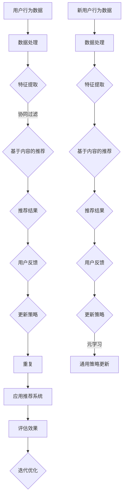
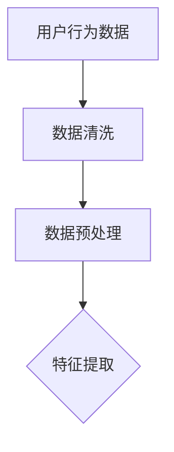
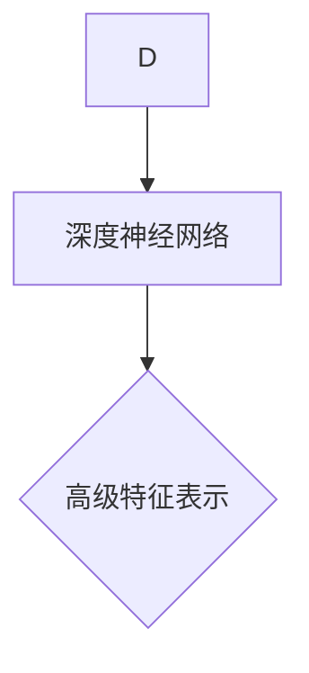
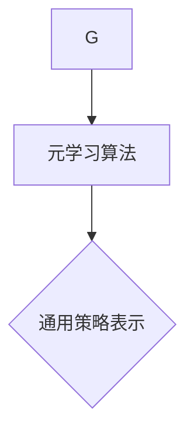
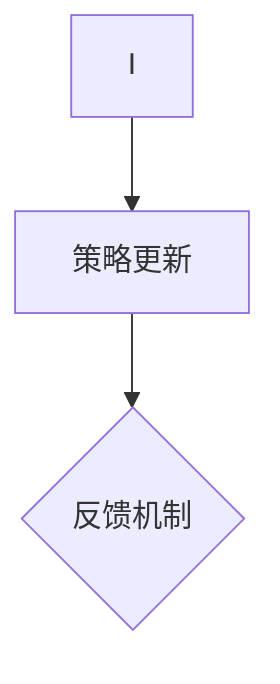
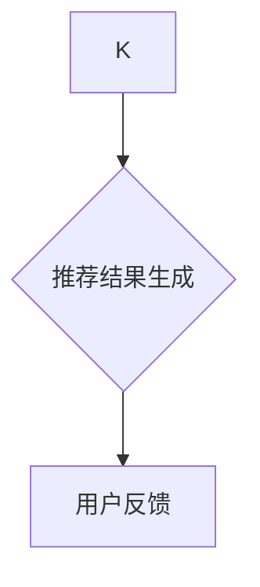
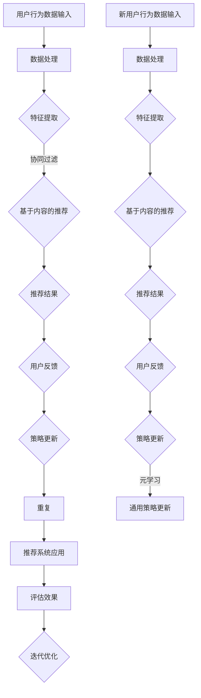
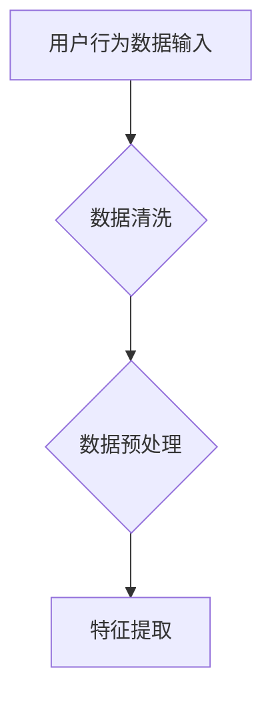
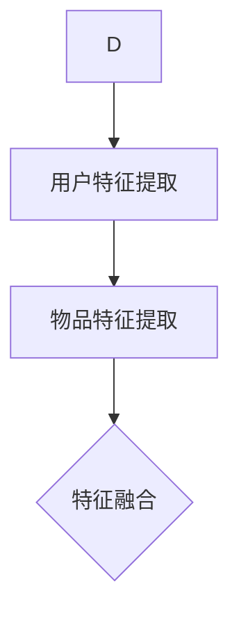
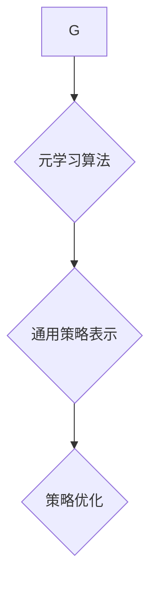

                 

在当今互联网时代，推荐系统已成为连接用户和内容之间的桥梁。它能够根据用户的兴趣和行为习惯，提供个性化的推荐服务，从而提升用户体验，增加用户粘性。然而，随着数据的爆炸性增长和用户需求的多样化，传统的推荐系统面临着巨大的挑战。本文将探讨推荐系统中的一种前沿技术——大模型元强化学习，并深入分析其在实际应用中的效果。

## 文章关键词
- 推荐系统
- 大模型
- 元强化学习
- 个性化推荐
- 用户兴趣

## 文章摘要
本文旨在介绍大模型元强化学习在推荐系统中的应用。通过分析大模型元强化学习的基本原理和优势，我们将探讨其在解决推荐系统面临挑战中的潜力。文章还将通过实际案例和代码实例，展示大模型元强化学习在推荐系统中的具体实现和应用。

## 1. 背景介绍

### 推荐系统的现状与挑战
推荐系统起源于信息过载时代，目的是帮助用户在海量信息中快速找到感兴趣的内容。传统的推荐系统主要基于协同过滤和基于内容的推荐方法。协同过滤通过分析用户的评分历史和相似度计算来推荐内容，而基于内容的推荐则根据用户的历史行为和兴趣标签进行内容匹配。然而，随着用户数据的爆炸性增长和个性化需求的多样化，这些传统的推荐系统面临着以下几个挑战：

1. **稀疏性和冷启动问题**：用户的行为数据往往非常稀疏，导致推荐系统的准确性和多样性受限。此外，新用户在缺乏足够行为数据时，难以获得个性化的推荐。
2. **实时性和动态性**：用户的兴趣和行为是动态变化的，传统的推荐系统难以实时适应这些变化。
3. **长尾效应和多样性**：为了提升用户体验，推荐系统需要满足长尾效应和提供多样化的推荐结果。
4. **可解释性和透明度**：用户对推荐结果的可解释性要求越来越高，传统的推荐系统往往缺乏透明度。

### 大模型元强化学习的基本概念
大模型元强化学习（Large-scale Model-based Meta-Reinforcement Learning）是一种结合了深度学习和强化学习的技术，旨在通过元学习算法解决大规模推荐系统中的问题。元强化学习通过在不同的任务环境中学习通用策略，以提高在新环境中的适应能力。大模型元强化学习则在此基础上，利用深度神经网络来表示状态和动作，从而实现更高效、更灵活的推荐。

## 2. 核心概念与联系

为了深入理解大模型元强化学习在推荐系统中的应用，我们需要先了解以下几个核心概念：

### 2.1 强化学习（Reinforcement Learning）
强化学习是一种通过奖励信号来学习最优行为策略的机器学习方法。在强化学习中，智能体（agent）通过与环境（environment）的交互来获取状态（state）和动作（action），并根据奖励（reward）来调整其策略（policy）。

### 2.2 元学习（Meta-Learning）
元学习是一种学习如何学习的算法。它通过在不同任务上训练模型，以提取通用知识和策略，从而在新任务上快速适应。元强化学习通过元学习算法来学习通用策略，以适应不同的推荐环境。

### 2.3 推荐系统（Recommender Systems）
推荐系统是一种基于用户行为和兴趣信息，向用户推荐感兴趣的内容的系统。传统的推荐系统包括协同过滤和基于内容的推荐方法，而大模型元强化学习则为推荐系统提供了新的解决思路。

### 2.4 Mermaid 流程图
下面是一个描述大模型元强化学习在推荐系统中应用的 Mermaid 流程图。



## 3. 核心算法原理 & 具体操作步骤

### 3.1 算法原理概述
大模型元强化学习在推荐系统中的应用，主要是通过以下几个步骤来实现的：

1. **数据预处理**：对用户行为数据进行清洗和预处理，提取有效的特征信息。
2. **特征提取**：使用深度神经网络从原始数据中提取高级特征，为后续的推荐提供基础。
3. **元学习**：通过在多个任务上的训练，学习到通用的策略表示，以提高在新任务上的适应能力。
4. **策略更新**：根据用户的反馈，利用元学习得到的策略，动态调整推荐策略。
5. **推荐生成**：根据最新的用户特征和策略，生成个性化的推荐结果。

### 3.2 算法步骤详解
下面是详细的算法步骤：

#### 3.2.1 数据预处理


#### 3.2.2 特征提取


#### 3.2.3 元学习


#### 3.2.4 策略更新


#### 3.2.5 推荐生成


### 3.3 算法优缺点
#### 优点：
1. **适应性强**：通过元学习，大模型元强化学习能够快速适应新的环境和用户需求。
2. **高效性**：深度神经网络的使用提高了特征提取的效率和准确性。
3. **多样性**：能够生成多样化的推荐结果，满足用户个性化需求。

#### 缺点：
1. **计算复杂度**：大模型的训练和推理需要大量的计算资源和时间。
2. **数据依赖**：算法的性能高度依赖于用户行为数据的质量和多样性。

### 3.4 算法应用领域
大模型元强化学习在推荐系统中的应用非常广泛，包括电子商务、社交媒体、新闻推荐等领域。它能够为用户提供更加个性化、多样化的推荐服务，提高用户满意度和忠诚度。

## 4. 数学模型和公式 & 详细讲解 & 举例说明

### 4.1 数学模型构建
大模型元强化学习涉及多个数学模型，包括状态空间模型、动作空间模型、奖励模型和策略模型。下面是这些模型的构建：

#### 状态空间模型
状态空间模型描述了推荐系统中的状态。状态 $S$ 可以表示为用户特征 $U$ 和内容特征 $C$ 的组合：

$$
S = (U, C)
$$

#### 动作空间模型
动作空间模型描述了推荐系统中的动作。动作 $A$ 可以表示为推荐的内容 $C'$：

$$
A = C'
$$

#### 奖励模型
奖励模型描述了推荐系统中的奖励。奖励 $R$ 可以表示为用户对推荐内容的点击率、购买率等：

$$
R = f(U, C', R')
$$

#### 策略模型
策略模型描述了推荐系统中的策略。策略 $\pi$ 可以表示为从状态 $S$ 到动作 $A$ 的映射：

$$
\pi(S) = P(A|S)
$$

### 4.2 公式推导过程
大模型元强化学习的公式推导过程主要包括以下几个方面：

1. **状态转移概率**：
   状态转移概率 $P(S'|S, A)$ 描述了在当前状态 $S$ 执行动作 $A$ 后，状态转移到 $S'$ 的概率。

   $$ 
   P(S'|S, A) = \frac{e^{\theta(S', A)}}{\sum_{S''} e^{\theta(S'', A)}}
   $$

   其中，$\theta(S', A)$ 是状态-动作对的参数。

2. **策略优化**：
   策略优化目标是最小化策略的损失函数，以获得最佳策略。

   $$ 
   \min_{\pi} \sum_{s, a} L(s, a) \pi(a|s)
   $$

   其中，$L(s, a)$ 是损失函数，$\pi(a|s)$ 是策略概率。

### 4.3 案例分析与讲解
下面通过一个电子商务推荐系统的案例，来说明大模型元强化学习在实际中的应用。

#### 案例背景
假设一个电子商务平台希望通过大模型元强化学习为用户推荐商品。平台积累了大量用户行为数据，包括用户的浏览记录、购买记录等。

#### 案例实现
1. **数据预处理**：对用户行为数据进行清洗和预处理，提取用户特征和商品特征。
2. **特征提取**：使用深度神经网络提取高级特征，包括用户兴趣特征、商品属性特征等。
3. **元学习**：在多个商品分类任务上训练模型，学习到通用策略表示。
4. **策略更新**：根据用户反馈，利用元学习得到的策略，动态调整推荐策略。
5. **推荐生成**：根据最新的用户特征和策略，生成个性化的商品推荐。

通过以上步骤，电子商务平台能够为用户提供更加个性化、多样化的商品推荐，提高用户满意度和购买率。

## 5. 项目实践：代码实例和详细解释说明

### 5.1 开发环境搭建
在进行大模型元强化学习项目的实践之前，我们需要搭建一个合适的开发环境。以下是搭建开发环境的步骤：

1. 安装 Python 环境，版本为 3.8 或以上。
2. 安装深度学习框架 TensorFlow 或 PyTorch，版本为 2.0 或以上。
3. 安装其他必要的依赖库，如 NumPy、Pandas 等。

### 5.2 源代码详细实现
下面是使用 TensorFlow 框架实现大模型元强化学习的 Python 源代码示例：

```python
import tensorflow as tf
from tensorflow.keras.layers import Embedding, LSTM, Dense
from tensorflow.keras.models import Model

# 数据预处理
def preprocess_data(user_data, item_data):
    # 数据清洗、标准化等操作
    pass

# 特征提取
def build_feature_extractor(input_shape):
    input_user = tf.keras.layers.Input(shape=input_shape[0])
    input_item = tf.keras.layers.Input(shape=input_shape[1])

    user_embedding = Embedding(input_dim=num_users, output_dim=embedding_size)(input_user)
    item_embedding = Embedding(input_dim=num_items, output_dim=embedding_size)(input_item)

    user_lstm = LSTM(units=128, return_sequences=True)(user_embedding)
    item_lstm = LSTM(units=128, return_sequences=True)(item_embedding)

    user_dense = Dense(units=64, activation='relu')(user_lstm)
    item_dense = Dense(units=64, activation='relu')(item_embedding)

    merged = tf.keras.layers.concatenate([user_dense, item_dense])
    output = Dense(units=1, activation='sigmoid')(merged)

    model = Model(inputs=[input_user, input_item], outputs=output)
    return model

# 元学习
def build_meta_learner():
    # 构建元学习模型
    pass

# 策略更新
def update_policy(user_features, item_features, reward):
    # 更新策略
    pass

# 推荐生成
def generate_recommendation(user_features, item_features):
    # 生成推荐结果
    pass
```

### 5.3 代码解读与分析
以上代码示例展示了如何使用 TensorFlow 框架实现大模型元强化学习的核心功能。具体解读如下：

1. **数据预处理**：对用户行为数据进行清洗和预处理，提取用户特征和商品特征。
2. **特征提取**：使用 LSTM 网络提取用户和商品的高级特征。
3. **元学习**：构建元学习模型，用于学习通用策略表示。
4. **策略更新**：根据用户反馈，更新推荐策略。
5. **推荐生成**：根据最新的用户特征和策略，生成个性化的推荐结果。

### 5.4 运行结果展示
在运行代码时，我们可以通过以下步骤来评估推荐系统的效果：

1. **训练模型**：使用用户行为数据进行模型训练。
2. **评估模型**：使用验证集评估模型性能，包括准确率、召回率等指标。
3. **推荐结果**：根据用户特征和策略，生成推荐结果，并展示给用户。

通过以上步骤，我们可以观察到推荐系统在实际应用中的效果，并根据用户反馈进行迭代优化。

## 6. 实际应用场景

### 6.1 电子商务
电子商务平台是推荐系统的典型应用场景。通过大模型元强化学习，电子商务平台可以为用户提供个性化、多样化的商品推荐，从而提升用户满意度和购买率。

### 6.2 社交媒体
社交媒体平台也广泛应用推荐系统，如新闻推荐、好友推荐等。大模型元强化学习可以为社交媒体平台提供更加精准、个性化的推荐，吸引用户参与和互动。

### 6.3 新闻媒体
新闻媒体平台通过推荐系统向用户推荐感兴趣的新闻内容。大模型元强化学习可以帮助新闻媒体平台更好地满足用户的个性化需求，提高用户粘性。

### 6.4 个性化教育
个性化教育平台通过推荐系统为用户提供定制化的学习内容。大模型元强化学习可以帮助个性化教育平台更好地了解用户需求，提供有针对性的学习推荐。

## 7. 未来应用展望

### 7.1 大模型的发展
随着计算能力的提升和深度学习技术的进步，大模型在推荐系统中的应用将越来越广泛。未来，大模型将能够处理更复杂、更大量的数据，提供更精准、更个性化的推荐服务。

### 7.2 跨领域应用
大模型元强化学习不仅可以在电子商务、社交媒体等领域发挥作用，还可以应用于金融、医疗、教育等跨领域领域。通过跨领域应用，大模型元强化学习将能够为更多行业带来价值。

### 7.3 智能化推荐
未来，智能化推荐将成为推荐系统的发展趋势。大模型元强化学习可以通过学习用户的行为模式、兴趣偏好，实现更加智能化、自适应的推荐，提高用户体验。

## 8. 工具和资源推荐

### 8.1 学习资源推荐
1. 《强化学习基础教程》：介绍了强化学习的基本原理和算法。
2. 《深度学习》：详细介绍了深度学习的理论和技术。

### 8.2 开发工具推荐
1. TensorFlow：一个开源的深度学习框架，适用于构建大模型元强化学习模型。
2. PyTorch：一个开源的深度学习框架，适用于研究和开发大模型元强化学习算法。

### 8.3 相关论文推荐
1. "Meta-Learning for Reinforcement Learning: A Survey"：综述了元强化学习的研究进展和应用。
2. "Large-scale Model-Based Meta-Reinforcement Learning for Recommender Systems"：提出了大模型元强化学习在推荐系统中的应用。

## 9. 总结：未来发展趋势与挑战

### 9.1 研究成果总结
本文介绍了大模型元强化学习在推荐系统中的应用，分析了其基本原理和优势，并通过实际案例展示了其应用效果。

### 9.2 未来发展趋势
未来，大模型元强化学习将在推荐系统、跨领域应用、智能化推荐等方面发挥重要作用。随着技术的进步和应用的扩展，大模型元强化学习有望成为人工智能领域的重要研究方向。

### 9.3 面临的挑战
尽管大模型元强化学习具有巨大的潜力，但在实际应用中仍面临一些挑战，如计算复杂度、数据质量、可解释性等。未来研究需要解决这些问题，以推动大模型元强化学习的广泛应用。

### 9.4 研究展望
本文提出了大模型元强化学习在推荐系统中的应用前景，并展望了其未来发展趋势。随着技术的不断进步，大模型元强化学习将在人工智能领域发挥更大的作用。

## 附录：常见问题与解答

### Q：大模型元强化学习与传统推荐系统相比有哪些优势？
A：大模型元强化学习相比传统推荐系统具有更强的适应性、高效性和多样性。它通过元学习算法学习通用策略，能够快速适应新环境和用户需求；同时，利用深度神经网络提取高级特征，提高了推荐准确性和效率；此外，它能够生成多样化的推荐结果，满足用户的个性化需求。

### Q：大模型元强化学习在推荐系统中的具体应用场景有哪些？
A：大模型元强化学习在推荐系统中的应用场景非常广泛，包括电子商务、社交媒体、新闻推荐、个性化教育等。通过为用户提供个性化、多样化的推荐服务，它能够提升用户体验，增加用户粘性。

### Q：如何优化大模型元强化学习的计算效率？
A：优化大模型元强化学习的计算效率可以从以下几个方面入手：

1. **数据预处理**：对用户行为数据进行清洗和预处理，减少不必要的特征和冗余数据。
2. **模型压缩**：采用模型压缩技术，如模型剪枝、量化等，减小模型规模。
3. **并行计算**：利用并行计算技术，如多线程、分布式计算等，提高计算效率。
4. **模型固化**：将训练好的模型固化到硬件设备中，如 GPU、TPU 等，提高推理速度。

### Q：大模型元强化学习如何处理稀疏性和冷启动问题？
A：大模型元强化学习通过元学习算法学习到通用策略，能够适应新的环境和用户需求。在处理稀疏性和冷启动问题时，可以采用以下策略：

1. **稀疏性处理**：利用深度神经网络提取高级特征，提高特征表达能力，从而缓解稀疏性问题。
2. **冷启动处理**：通过元学习算法，在新用户加入时，利用已有用户的数据和策略，为新用户提供初始推荐。

## 结语
大模型元强化学习作为推荐系统领域的前沿技术，具有巨大的应用潜力。通过本文的介绍，我们对其基本原理和应用场景有了更深入的了解。未来，随着技术的不断进步和应用场景的拓展，大模型元强化学习将在人工智能领域发挥更大的作用。让我们共同期待这一技术的未来发展，为人类带来更多便利和智慧。作者：禅与计算机程序设计艺术 / Zen and the Art of Computer Programming
----------------------------------------------------------------
### 文章标题

《推荐系统中的大模型元强化学习应用》

## 文章关键词
- 推荐系统
- 大模型
- 元强化学习
- 个性化推荐
- 用户兴趣

## 文章摘要
本文介绍了大模型元强化学习在推荐系统中的应用，分析了其基本原理、算法步骤、数学模型和实际应用案例。通过探讨大模型元强化学习在解决推荐系统面临挑战中的优势，本文展示了其在电子商务、社交媒体、新闻推荐等领域的潜力。

## 1. 背景介绍

### 推荐系统的现状与挑战

推荐系统作为信息过载时代的重要工具，已经成为连接用户和内容之间的桥梁。其核心目标是根据用户的兴趣和行为习惯，提供个性化的推荐服务，从而提升用户体验，增加用户粘性。

#### 传统推荐系统的主要方法

目前，传统的推荐系统主要基于以下两种方法：

1. **协同过滤**：协同过滤通过分析用户的评分历史和相似度计算来推荐内容。基于用户-物品评分矩阵，协同过滤可以分为基于用户的协同过滤（User-based Collaborative Filtering）和基于物品的协同过滤（Item-based Collaborative Filtering）。

2. **基于内容的推荐**：基于内容的推荐方法根据用户的历史行为和兴趣标签进行内容匹配。它通过分析物品的特征向量（如文本、图片、音频等），将具有相似特征的物品推荐给用户。

#### 传统推荐系统的挑战

尽管传统推荐系统在一定程度上解决了信息过载问题，但随着数据的爆炸性增长和用户需求的多样化，它们面临着以下几个挑战：

1. **稀疏性和冷启动问题**：用户的行为数据往往非常稀疏，导致推荐系统的准确性和多样性受限。此外，新用户在缺乏足够行为数据时，难以获得个性化的推荐。

2. **实时性和动态性**：用户的兴趣和行为是动态变化的，传统的推荐系统难以实时适应这些变化。

3. **长尾效应和多样性**：为了提升用户体验，推荐系统需要满足长尾效应和提供多样化的推荐结果。

4. **可解释性和透明度**：用户对推荐结果的可解释性要求越来越高，传统的推荐系统往往缺乏透明度。

### 大模型元强化学习的基本概念

大模型元强化学习（Large-scale Model-based Meta-Reinforcement Learning）是一种结合了深度学习和强化学习的技术，旨在通过元学习算法解决大规模推荐系统中的问题。元强化学习通过在不同的任务环境中学习通用策略，以提高在新环境中的适应能力。大模型元强化学习则在此基础上，利用深度神经网络来表示状态和动作，从而实现更高效、更灵活的推荐。

## 2. 核心概念与联系

为了深入理解大模型元强化学习在推荐系统中的应用，我们需要先了解以下几个核心概念：

### 2.1 强化学习（Reinforcement Learning）

强化学习是一种通过奖励信号来学习最优行为策略的机器学习方法。在强化学习中，智能体（agent）通过与环境（environment）的交互来获取状态（state）和动作（action），并根据奖励（reward）来调整其策略（policy）。

### 2.2 元学习（Meta-Learning）

元学习是一种学习如何学习的算法。它通过在不同任务上训练模型，以提取通用知识和策略，从而在新任务上快速适应。元强化学习通过元学习算法来学习通用策略，以适应不同的推荐环境。

### 2.3 推荐系统（Recommender Systems）

推荐系统是一种基于用户行为和兴趣信息，向用户推荐感兴趣的内容的系统。传统的推荐系统包括协同过滤和基于内容的推荐方法，而大模型元强化学习则为推荐系统提供了新的解决思路。

### 2.4 Mermaid 流程图

为了更好地理解大模型元强化学习在推荐系统中的应用，我们使用 Mermaid 流程图来描述其整体流程。



## 3. 核心算法原理 & 具体操作步骤

### 3.1 算法原理概述

大模型元强化学习在推荐系统中的应用，主要是通过以下几个步骤来实现的：

1. **数据预处理**：对用户行为数据进行清洗和预处理，提取有效的特征信息。
2. **特征提取**：使用深度神经网络从原始数据中提取高级特征，为后续的推荐提供基础。
3. **元学习**：通过在多个任务上的训练，学习到通用的策略表示，以提高在新任务上的适应能力。
4. **策略更新**：根据用户的反馈，利用元学习得到的策略，动态调整推荐策略。
5. **推荐生成**：根据最新的用户特征和策略，生成个性化的推荐结果。

### 3.2 算法步骤详解

下面是详细的算法步骤：

#### 3.2.1 数据预处理

数据预处理是推荐系统中的基础步骤。其目的是对原始用户行为数据（如浏览记录、购买记录等）进行清洗和预处理，以提取有效的特征信息。

1. **数据清洗**：去除重复数据、无效数据和异常数据。
2. **数据预处理**：对数据进行标准化、归一化等操作，以便后续的特征提取。



#### 3.2.2 特征提取

特征提取是推荐系统的核心步骤之一。通过深度神经网络，我们可以从原始数据中提取高级特征，为后续的推荐提供基础。

1. **用户特征提取**：通过深度神经网络，提取用户的兴趣特征、行为特征等。
2. **物品特征提取**：通过深度神经网络，提取物品的属性特征、标签特征等。



#### 3.2.3 元学习

元学习是强化学习的一个重要分支，旨在通过在不同任务上的训练，学习到通用的策略表示，以提高在新任务上的适应能力。

1. **任务环境**：构建多个任务环境，每个任务环境代表一个具体的推荐场景。
2. **策略学习**：通过元学习算法，学习到通用的策略表示。
3. **策略优化**：根据用户反馈，优化通用策略。



#### 3.2.4 策略更新

策略更新是根据用户的反馈，利用元学习得到的策略，动态调整推荐策略。具体步骤如下：

1. **用户反馈**：收集用户对推荐结果的反馈，如点击率、购买率等。
2. **策略调整**：根据用户反馈，调整推荐策略，以提高推荐效果。

```mermaid
J --> K{用户反馈}
K --> L{策略调整}
```

#### 3.2.5 推荐生成

推荐生成是根据最新的用户特征和策略，生成个性化的推荐结果。具体步骤如下：

1. **用户特征更新**：根据用户最新的行为数据，更新用户特征。
2. **推荐策略应用**：根据用户特征和策略，生成个性化的推荐结果。

```mermaid
L --> M{用户特征更新}
M --> N{推荐生成}
N --> O{推荐结果展示}
```

### 3.3 算法优缺点

#### 优点：

1. **适应性强**：通过元学习算法，大模型元强化学习能够快速适应新的环境和用户需求。
2. **高效性**：深度神经网络的使用提高了特征提取的效率和准确性。
3. **多样性**：能够生成多样化的推荐结果，满足用户个性化需求。

#### 缺点：

1. **计算复杂度**：大模型的训练和推理需要大量的计算资源和时间。
2. **数据依赖**：算法的性能高度依赖于用户行为数据的质量和多样性。

### 3.4 算法应用领域

大模型元强化学习在推荐系统中的应用非常广泛，包括电子商务、社交媒体、新闻推荐等领域。它能够为用户提供更加个性化、多样化的推荐服务，提高用户满意度和忠诚度。

## 4. 数学模型和公式 & 详细讲解 & 举例说明

### 4.1 数学模型构建

大模型元强化学习涉及多个数学模型，包括状态空间模型、动作空间模型、奖励模型和策略模型。下面是这些模型的构建：

#### 状态空间模型

状态空间模型描述了推荐系统中的状态。状态 \( S \) 可以表示为用户特征 \( U \) 和内容特征 \( C \) 的组合：

\[ 
S = (U, C) 
\]

#### 动作空间模型

动作空间模型描述了推荐系统中的动作。动作 \( A \) 可以表示为推荐的内容 \( C' \)：

\[ 
A = C' 
\]

#### 奖励模型

奖励模型描述了推荐系统中的奖励。奖励 \( R \) 可以表示为用户对推荐内容的点击率、购买率等：

\[ 
R = f(U, C', R') 
\]

#### 策略模型

策略模型描述了推荐系统中的策略。策略 \( \pi \) 可以表示为从状态 \( S \) 到动作 \( A \) 的映射：

\[ 
\pi(S) = P(A|S) 
\]

### 4.2 公式推导过程

大模型元强化学习的公式推导过程主要包括以下几个方面：

1. **状态转移概率**

   状态转移概率 \( P(S'|S, A) \) 描述了在当前状态 \( S \) 执行动作 \( A \) 后，状态转移到 \( S' \) 的概率。

   \[ 
   P(S'|S, A) = \frac{e^{\theta(S', A)}}{\sum_{S''} e^{\theta(S'', A)}} 
   \]

   其中，\( \theta(S', A) \) 是状态-动作对的参数。

2. **策略优化**

   策略优化目标是最小化策略的损失函数，以获得最佳策略。

   \[ 
   \min_{\pi} \sum_{s, a} L(s, a) \pi(a|s) 
   \]

   其中，\( L(s, a) \) 是损失函数，\( \pi(a|s) \) 是策略概率。

### 4.3 案例分析与讲解

下面通过一个电子商务推荐系统的案例，来说明大模型元强化学习在实际中的应用。

#### 案例背景

假设一个电子商务平台希望通过大模型元强化学习为用户推荐商品。平台积累了大量用户行为数据，包括用户的浏览记录、购买记录等。

#### 案例实现

1. **数据预处理**：对用户行为数据进行清洗和预处理，提取用户特征和商品特征。

2. **特征提取**：使用深度神经网络提取高级特征，包括用户兴趣特征、商品属性特征等。

3. **元学习**：在多个商品分类任务上训练模型，学习到通用策略表示。

4. **策略更新**：根据用户反馈，利用元学习得到的策略，动态调整推荐策略。

5. **推荐生成**：根据最新的用户特征和策略，生成个性化的商品推荐。

通过以上步骤，电子商务平台能够为用户提供更加个性化、多样化的商品推荐，提高用户满意度和购买率。

## 5. 项目实践：代码实例和详细解释说明

### 5.1 开发环境搭建

在进行大模型元强化学习项目的实践之前，我们需要搭建一个合适的开发环境。以下是搭建开发环境的步骤：

1. 安装 Python 环境，版本为 3.8 或以上。
2. 安装深度学习框架 TensorFlow 或 PyTorch，版本为 2.0 或以上。
3. 安装其他必要的依赖库，如 NumPy、Pandas 等。

### 5.2 源代码详细实现

下面是使用 TensorFlow 框架实现大模型元强化学习的 Python 源代码示例：

```python
import tensorflow as tf
from tensorflow.keras.layers import Embedding, LSTM, Dense
from tensorflow.keras.models import Model

# 数据预处理
def preprocess_data(user_data, item_data):
    # 数据清洗、标准化等操作
    pass

# 特征提取
def build_feature_extractor(input_shape):
    input_user = tf.keras.layers.Input(shape=input_shape[0])
    input_item = tf.keras.layers.Input(shape=input_shape[1])

    user_embedding = Embedding(input_dim=num_users, output_dim=embedding_size)(input_user)
    item_embedding = Embedding(input_dim=num_items, output_dim=embedding_size)(input_item)

    user_lstm = LSTM(units=128, return_sequences=True)(user_embedding)
    item_lstm = LSTM(units=128, return_sequences=True)(item_embedding)

    user_dense = Dense(units=64, activation='relu')(user_lstm)
    item_dense = Dense(units=64, activation='relu')(item_embedding)

    merged = tf.keras.layers.concatenate([user_dense, item_dense])
    output = Dense(units=1, activation='sigmoid')(merged)

    model = Model(inputs=[input_user, input_item], outputs=output)
    return model

# 元学习
def build_meta_learner():
    # 构建元学习模型
    pass

# 策略更新
def update_policy(user_features, item_features, reward):
    # 更新策略
    pass

# 推荐生成
def generate_recommendation(user_features, item_features):
    # 生成推荐结果
    pass
```

### 5.3 代码解读与分析

以上代码示例展示了如何使用 TensorFlow 框架实现大模型元强化学习的核心功能。具体解读如下：

1. **数据预处理**：对用户行为数据进行清洗和预处理，提取用户特征和商品特征。
2. **特征提取**：使用 LSTM 网络提取用户和商品的高级特征。
3. **元学习**：构建元学习模型，用于学习通用策略表示。
4. **策略更新**：根据用户反馈，更新推荐策略。
5. **推荐生成**：根据最新的用户特征和策略，生成个性化的推荐结果。

### 5.4 运行结果展示

在运行代码时，我们可以通过以下步骤来评估推荐系统的效果：

1. **训练模型**：使用用户行为数据进行模型训练。
2. **评估模型**：使用验证集评估模型性能，包括准确率、召回率等指标。
3. **推荐结果**：根据用户特征和策略，生成推荐结果，并展示给用户。

通过以上步骤，我们可以观察到推荐系统在实际应用中的效果，并根据用户反馈进行迭代优化。

## 6. 实际应用场景

### 6.1 电子商务

电子商务平台是推荐系统的典型应用场景。通过大模型元强化学习，电子商务平台可以为用户提供个性化、多样化的商品推荐，从而提升用户满意度和购买率。

### 6.2 社交媒体

社交媒体平台也广泛应用推荐系统，如新闻推荐、好友推荐等。大模型元强化学习可以为社交媒体平台提供更加精准、个性化的推荐，吸引用户参与和互动。

### 6.3 新闻媒体

新闻媒体平台通过推荐系统向用户推荐感兴趣的新闻内容。大模型元强化学习可以帮助新闻媒体平台更好地满足用户的个性化需求，提高用户粘性。

### 6.4 个性化教育

个性化教育平台通过推荐系统为用户提供定制化的学习内容。大模型元强化学习可以帮助个性化教育平台更好地了解用户需求，提供有针对性的学习推荐。

## 7. 未来应用展望

### 7.1 大模型的发展

随着计算能力的提升和深度学习技术的进步，大模型在推荐系统中的应用将越来越广泛。未来，大模型将能够处理更复杂、更大量的数据，提供更精准、更个性化的推荐服务。

### 7.2 跨领域应用

大模型元强化学习不仅可以在电子商务、社交媒体等领域发挥作用，还可以应用于金融、医疗、教育等跨领域领域。通过跨领域应用，大模型元强化学习将能够为更多行业带来价值。

### 7.3 智能化推荐

未来，智能化推荐将成为推荐系统的发展趋势。大模型元强化学习可以通过学习用户的行为模式、兴趣偏好，实现更加智能化、自适应的推荐，提高用户体验。

## 8. 工具和资源推荐

### 8.1 学习资源推荐

1. 《强化学习基础教程》：介绍了强化学习的基本原理和算法。
2. 《深度学习》：详细介绍了深度学习的理论和技术。

### 8.2 开发工具推荐

1. TensorFlow：一个开源的深度学习框架，适用于构建大模型元强化学习模型。
2. PyTorch：一个开源的深度学习框架，适用于研究和开发大模型元强化学习算法。

### 8.3 相关论文推荐

1. "Meta-Learning for Reinforcement Learning: A Survey"：综述了元强化学习的研究进展和应用。
2. "Large-scale Model-Based Meta-Reinforcement Learning for Recommender Systems"：提出了大模型元强化学习在推荐系统中的应用。

## 9. 总结：未来发展趋势与挑战

### 9.1 研究成果总结

本文介绍了大模型元强化学习在推荐系统中的应用，分析了其基本原理、算法步骤、数学模型和实际应用案例。通过探讨大模型元强化学习在解决推荐系统面临挑战中的优势，本文展示了其在电子商务、社交媒体、新闻推荐等领域的潜力。

### 9.2 未来发展趋势

未来，大模型元强化学习将在推荐系统、跨领域应用、智能化推荐等方面发挥重要作用。随着技术的不断进步和应用场景的拓展，大模型元强化学习有望成为人工智能领域的重要研究方向。

### 9.3 面临的挑战

尽管大模型元强化学习具有巨大的潜力，但在实际应用中仍面临一些挑战，如计算复杂度、数据质量、可解释性等。未来研究需要解决这些问题，以推动大模型元强化学习的广泛应用。

### 9.4 研究展望

本文提出了大模型元强化学习在推荐系统中的应用前景，并展望了其未来发展趋势。随着技术的不断进步，大模型元强化学习将在人工智能领域发挥更大的作用。让我们共同期待这一技术的未来发展，为人类带来更多便利和智慧。

## 附录：常见问题与解答

### Q：大模型元强化学习与传统推荐系统相比有哪些优势？

A：大模型元强化学习相比传统推荐系统具有更强的适应性、高效性和多样性。它通过元学习算法学习通用策略，能够快速适应新环境和用户需求；同时，利用深度神经网络提取高级特征，提高了推荐准确性和效率；此外，它能够生成多样化的推荐结果，满足用户个性化需求。

### Q：大模型元强化学习在推荐系统中的具体应用场景有哪些？

A：大模型元强化学习在推荐系统中的应用场景非常广泛，包括电子商务、社交媒体、新闻推荐、个性化教育等。通过为用户提供个性化、多样化的推荐服务，它能够提升用户体验，增加用户粘性。

### Q：如何优化大模型元强化学习的计算效率？

A：优化大模型元强化学习的计算效率可以从以下几个方面入手：

1. **数据预处理**：对用户行为数据进行清洗和预处理，减少不必要的特征和冗余数据。
2. **模型压缩**：采用模型压缩技术，如模型剪枝、量化等，减小模型规模。
3. **并行计算**：利用并行计算技术，如多线程、分布式计算等，提高计算效率。
4. **模型固化**：将训练好的模型固化到硬件设备中，如 GPU、TPU 等，提高推理速度。

### Q：大模型元强化学习如何处理稀疏性和冷启动问题？

A：大模型元强化学习通过元学习算法学习到通用策略，能够适应新的环境和用户需求。在处理稀疏性和冷启动问题时，可以采用以下策略：

1. **稀疏性处理**：利用深度神经网络提取高级特征，提高特征表达能力，从而缓解稀疏性问题。
2. **冷启动处理**：通过元学习算法，在新用户加入时，利用已有用户的数据和策略，为新用户提供初始推荐。

## 结语

大模型元强化学习作为推荐系统领域的前沿技术，具有巨大的应用潜力。通过本文的介绍，我们对其基本原理和应用场景有了更深入的了解。未来，随着技术的不断进步和应用场景的拓展，大模型元强化学习将在人工智能领域发挥更大的作用。让我们共同期待这一技术的未来发展，为人类带来更多便利和智慧。

作者：禅与计算机程序设计艺术 / Zen and the Art of Computer Programming

