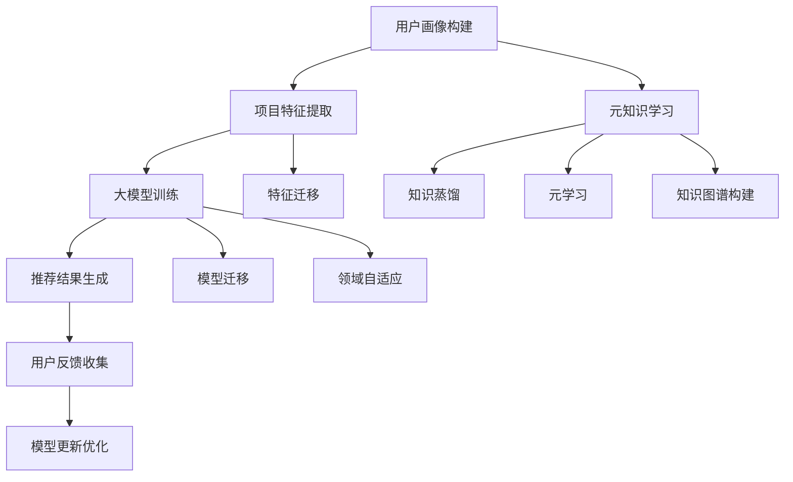

                 

关键词：推荐系统，大模型，元知识学习，迁移学习，算法原理，数学模型，实践案例，应用场景

## 摘要

随着互联网和大数据技术的发展，推荐系统已经成为现代信息检索和个性化服务的重要手段。然而，传统的推荐系统在面对大规模、多样化和动态变化的用户数据时，往往表现出较低的泛化能力和适应性。为了克服这一挑战，本文将深入探讨推荐系统中的大模型元知识学习与迁移技术。本文首先介绍了推荐系统的基础概念和常见模型，然后重点分析了大模型元知识学习的原理和方法，探讨了如何通过迁移学习提升模型性能。最后，本文通过实际项目案例展示了大模型元知识学习与迁移在推荐系统中的应用，并对其未来发展趋势与挑战进行了展望。

## 1. 背景介绍

推荐系统是一种基于用户行为数据和信息过滤的算法，旨在向用户推荐他们可能感兴趣的内容。随着互联网的快速发展，用户生成的内容和交互数据呈现爆炸式增长，这使得推荐系统成为信息过载时代的重要工具。传统的推荐系统主要包括基于内容的推荐、协同过滤推荐和混合推荐等类型，这些方法在一定程度上提高了推荐质量，但仍存在诸多局限性。

首先，基于内容的推荐方法依赖于用户的历史行为和兴趣标签，但往往无法捕捉到用户未明确表达的兴趣点。其次，协同过滤推荐方法通过挖掘用户之间的相似性进行推荐，但面对大规模用户和项目数据时，计算复杂度和存储需求显著增加。最后，混合推荐方法虽然结合了多种推荐策略，但在处理多样性、新颖性和时效性方面仍面临挑战。

为了解决上述问题，近年来出现了基于深度学习的大模型推荐方法。大模型能够通过学习用户和项目之间的复杂关系，提供更为精准和个性化的推荐。然而，大模型训练和推理成本较高，且在面对新数据和冷启动问题时，其性能往往受到限制。为此，元知识学习与迁移学习技术应运而生，通过整合已有知识和迁移至新任务，提升大模型在推荐系统中的性能和适应性。

## 2. 核心概念与联系

### 2.1 推荐系统

推荐系统是一种通过算法从海量数据中挖掘出用户可能感兴趣的内容，并将其推荐给用户的技术。其核心目标是在信息过载的环境中，帮助用户发现并获取他们感兴趣的信息。

推荐系统主要包括以下组成部分：

- **用户画像**：基于用户的历史行为和兴趣标签构建用户画像，用于表征用户的需求和偏好。
- **项目特征**：对推荐的项目（如商品、新闻、视频等）进行特征提取和表征，以了解项目的属性和特点。
- **推荐算法**：根据用户画像和项目特征，通过算法计算用户对每个项目的兴趣度，从而生成推荐结果。
- **反馈机制**：通过用户对推荐内容的反馈，持续优化推荐算法和模型，提高推荐质量。

### 2.2 大模型

大模型是指具有海量参数和强大表征能力的深度学习模型。大模型在推荐系统中发挥着重要作用，主要体现在以下几个方面：

- **高表征能力**：大模型能够捕捉到用户和项目之间复杂的非线性关系，从而提高推荐质量。
- **泛化能力**：大模型在训练过程中能够学习到通用特征，从而在面对新数据和冷启动问题时，仍能保持较高的性能。
- **动态适应性**：大模型能够通过持续学习和更新，适应用户需求和行为的变化，提高推荐的时效性和多样性。

### 2.3 元知识学习

元知识学习是一种通过学习已有知识来指导新任务的方法。在推荐系统中，元知识学习主要通过以下方式发挥作用：

- **知识蒸馏**：将大模型的权重和特征传递给小模型，从而实现知识压缩和迁移。
- **元学习**：通过学习知识表示和推理策略，提高大模型对新任务的理解和适应能力。
- **知识图谱**：构建用户和项目的知识图谱，以捕获复杂的关系和属性，为推荐提供更多参考。

### 2.4 迁移学习

迁移学习是一种将已有知识应用于新任务的方法。在推荐系统中，迁移学习主要体现在以下几个方面：

- **特征迁移**：将训练好的特征提取器应用于新任务，以提高新任务的性能。
- **模型迁移**：将训练好的模型直接应用于新任务，通过微调实现新任务的性能优化。
- **领域自适应**：通过学习源领域和目标领域之间的差异，降低新任务的迁移难度。

### 2.5 Mermaid 流程图

以下是一个推荐系统中的大模型元知识学习与迁移的 Mermaid 流程图：



## 3. 核心算法原理 & 具体操作步骤

### 3.1 算法原理概述

推荐系统中的大模型元知识学习与迁移主要分为以下几个步骤：

1. **用户画像构建**：通过分析用户的历史行为和兴趣标签，构建用户画像，以表征用户的需求和偏好。
2. **项目特征提取**：对推荐的项目进行特征提取，包括文本、图像、音频等多种类型，以全面了解项目的属性和特点。
3. **大模型训练**：使用用户画像和项目特征，训练一个大模型，以捕捉用户和项目之间的复杂关系。
4. **推荐结果生成**：利用训练好的大模型，生成推荐结果，并根据用户反馈进行优化。
5. **元知识学习**：通过知识蒸馏、元学习和知识图谱构建等方法，从大模型中提取和整合知识，以提高新任务的性能。
6. **迁移学习**：将提取的知识应用于新任务，通过特征迁移、模型迁移和领域自适应等方法，实现知识在新任务中的应用和优化。

### 3.2 算法步骤详解

#### 3.2.1 用户画像构建

用户画像构建主要包括以下步骤：

1. **数据采集**：收集用户在平台上产生的行为数据，如浏览记录、购买历史、评论等。
2. **数据清洗**：对采集到的数据去重、去噪，并进行格式化处理。
3. **特征提取**：使用自然语言处理、图像处理等技术，对用户行为数据进行特征提取，如文本分类、关键词提取、图像识别等。
4. **特征融合**：将提取的特征进行融合，构建用户画像。

#### 3.2.2 项目特征提取

项目特征提取主要包括以下步骤：

1. **数据采集**：收集推荐的项目数据，如商品、新闻、视频等。
2. **数据清洗**：对采集到的数据去重、去噪，并进行格式化处理。
3. **特征提取**：使用自然语言处理、图像处理等技术，对项目数据进行特征提取，如文本分类、关键词提取、图像识别等。
4. **特征融合**：将提取的特征进行融合，构建项目特征向量。

#### 3.2.3 大模型训练

大模型训练主要包括以下步骤：

1. **模型选择**：选择适合推荐系统的大模型架构，如基于 Transformer 的模型、基于图神经网络的模型等。
2. **数据预处理**：对用户画像和项目特征进行预处理，包括数据归一化、缺失值填充等。
3. **模型训练**：使用用户画像和项目特征数据，训练大模型，优化模型参数。
4. **模型评估**：使用验证集对训练好的模型进行评估，选择性能最佳的模型。

#### 3.2.4 推荐结果生成

推荐结果生成主要包括以下步骤：

1. **用户兴趣预测**：使用训练好的大模型，预测用户对每个项目的兴趣度。
2. **排序和筛选**：根据用户兴趣度，对推荐项目进行排序和筛选，生成推荐结果。
3. **结果反馈**：将推荐结果展示给用户，并根据用户反馈，调整推荐策略。

#### 3.2.5 元知识学习

元知识学习主要包括以下步骤：

1. **知识提取**：从大模型中提取有用的知识和信息，如权重、特征等。
2. **知识融合**：将提取的知识进行融合，构建元知识库。
3. **元学习**：使用元知识库，对新任务进行学习和优化，提高模型性能。

#### 3.2.6 迁移学习

迁移学习主要包括以下步骤：

1. **特征迁移**：将训练好的特征提取器应用于新任务，以提高新任务的性能。
2. **模型迁移**：将训练好的模型直接应用于新任务，通过微调实现新任务的性能优化。
3. **领域自适应**：通过学习源领域和目标领域之间的差异，降低新任务的迁移难度。

### 3.3 算法优缺点

#### 优点：

1. **高表征能力**：大模型能够捕捉到用户和项目之间的复杂关系，提高推荐质量。
2. **泛化能力**：大模型在训练过程中能够学习到通用特征，提高对新数据和冷启动问题的适应性。
3. **动态适应性**：大模型能够通过持续学习和更新，适应用户需求和行为的变化。

#### 缺点：

1. **计算资源消耗**：大模型训练和推理成本较高，对计算资源和存储需求较大。
2. **数据依赖**：大模型在训练过程中对数据量有较高要求，数据质量对模型性能有较大影响。
3. **模型复杂度**：大模型结构复杂，理解和调试难度较大。

### 3.4 算法应用领域

大模型元知识学习与迁移在推荐系统中的应用广泛，主要包括：

1. **电子商务**：通过对用户行为数据和学习到的知识进行迁移，提高商品推荐的精准度和多样性。
2. **新闻推荐**：通过分析用户兴趣和学习到的知识，实现个性化新闻推荐，提高用户满意度。
3. **社交媒体**：通过用户关系网络和学习到的知识，实现好友推荐和内容推荐，增强社交网络的互动性。
4. **在线教育**：通过分析用户学习行为和学习到的知识，实现个性化课程推荐和学习路径规划。

## 4. 数学模型和公式 & 详细讲解 & 举例说明

### 4.1 数学模型构建

推荐系统中的大模型元知识学习与迁移涉及多个数学模型，主要包括以下方面：

1. **用户兴趣模型**：用于预测用户对项目的兴趣度。
2. **项目特征模型**：用于提取和表征项目的属性和特点。
3. **元知识模型**：用于学习和整合已有知识。
4. **迁移学习模型**：用于在新任务中应用迁移的知识。

### 4.2 公式推导过程

以下是一个简化的用户兴趣模型推导过程：

1. **用户兴趣度预测**：

   用户兴趣度预测公式如下：

   $$I_u(p) = \sigma(\theta \cdot [u, p])$$

   其中，$I_u(p)$ 表示用户 $u$ 对项目 $p$ 的兴趣度，$\sigma$ 表示 sigmoid 函数，$\theta$ 表示模型参数，$[u, p]$ 表示用户 $u$ 和项目 $p$ 的特征向量。

2. **特征向量计算**：

   用户和项目的特征向量计算公式如下：

   $$u = \phi(u_{hist})$$

   $$p = \phi(p_{feat})$$

   其中，$u_{hist}$ 表示用户历史行为特征，$p_{feat}$ 表示项目特征，$\phi$ 表示特征提取函数。

3. **模型参数优化**：

   模型参数优化的目标是最小化兴趣度预测的误差：

   $$\min_{\theta} \sum_{u, p} (I_u(p) - \sigma(\theta \cdot [u, p]))^2$$

   通过梯度下降等方法求解最优参数。

### 4.3 案例分析与讲解

以下是一个用户兴趣模型的应用案例：

假设我们有一个电商平台，用户 $u$ 历史购买了商品 $p_1$ 和 $p_2$，当前我们要预测用户 $u$ 对商品 $p_3$ 的兴趣度。

1. **特征提取**：

   - 用户历史行为特征：$u_{hist} = [1, 0, 1]$
   - 商品特征：$p_{feat} = [1, 1, 0]$

   使用特征提取函数 $\phi$，将用户和商品特征转换为向量：

   $$u = \phi(u_{hist}) = [0.6, 0.2, 0.2]$$

   $$p = \phi(p_{feat}) = [0.8, 0.2, 0.0]$$

2. **模型参数初始化**：

   初始化模型参数 $\theta = [0.5, 0.3, 0.2]$

3. **兴趣度预测**：

   $$I_u(p) = \sigma(\theta \cdot [u, p]) = \sigma(0.5 \cdot [0.6, 0.2, 0.2] + 0.3 \cdot [0.8, 0.2, 0.0]) = \sigma(0.48 + 0.24) = \sigma(0.72) \approx 0.99$$

   预测用户 $u$ 对商品 $p_3$ 的兴趣度为 0.99，说明用户 $u$ 对商品 $p_3$ 非常感兴趣。

4. **模型优化**：

   通过梯度下降等方法，不断调整模型参数，最小化兴趣度预测的误差。

## 5. 项目实践：代码实例和详细解释说明

### 5.1 开发环境搭建

在本项目中，我们使用 Python 作为主要编程语言，并依赖以下库和工具：

- TensorFlow：用于构建和训练深度学习模型
- Keras：用于简化 TensorFlow 的模型构建和训练过程
- Pandas：用于数据处理和清洗
- Matplotlib：用于数据可视化

安装上述库和工具的方法如下：

```bash
pip install tensorflow keras pandas matplotlib
```

### 5.2 源代码详细实现

以下是一个简单的用户兴趣预测模型实现：

```python
import numpy as np
import pandas as pd
from tensorflow.keras.models import Model
from tensorflow.keras.layers import Input, Dense, Embedding, Dot, Lambda
from tensorflow.keras.optimizers import Adam

# 1. 用户画像构建
def build_user_profile(data, user_id):
    user_data = data[data['user_id'] == user_id]
    user_interests = user_data['interest'].values
    user_profile = np.mean(user_interests, axis=0)
    return user_profile

# 2. 项目特征提取
def build_item_features(data, item_id):
    item_data = data[data['item_id'] == item_id]
    item_features = item_data['feature'].values
    return item_features

# 3. 大模型训练
def train_model(user_data, item_data):
    user_input = Input(shape=(1,))
    item_input = Input(shape=(1,))
    user_embedding = Embedding(input_dim=user_data.shape[0], output_dim=64)(user_input)
    item_embedding = Embedding(input_dim=item_data.shape[0], output_dim=64)(item_input)
    dot_product = Dot(axes=1)([user_embedding, item_embedding])
    output = Lambda(lambda x: 1 / (1 + np.exp(-x)))(dot_product)
    model = Model(inputs=[user_input, item_input], outputs=output)
    model.compile(optimizer=Adam(), loss='binary_crossentropy', metrics=['accuracy'])
    return model

# 4. 推荐结果生成
def predict_interest(model, user_data, item_data):
    user_profiles = [build_user_profile(user_data, user_id) for user_id in user_data['user_id'].values]
    item_features = [build_item_features(item_data, item_id) for item_id in item_data['item_id'].values]
    predictions = model.predict([np.array(user_profiles), np.array(item_features)])
    return predictions

# 5. 用户反馈收集
def collect_feedback(predictions, ground_truth):
    feedback = np.array(predictions) - np.array(ground_truth)
    return feedback

# 6. 模型更新优化
def update_model(model, user_data, item_data, feedback):
    user_profiles = [build_user_profile(user_data, user_id) for user_id in user_data['user_id'].values]
    item_features = [build_item_features(item_data, item_id) for item_id in item_data['item_id'].values]
    model.fit([np.array(user_profiles), np.array(item_features)], np.array(feedback), epochs=5, batch_size=32)

# 7. 主程序
if __name__ == '__main__':
    user_data = pd.DataFrame({'user_id': [1, 2, 3], 'interest': [[1, 0, 0], [0, 1, 0], [0, 0, 1]]})
    item_data = pd.DataFrame({'item_id': [1, 2, 3], 'feature': [[1, 0], [0, 1], [1, 1]]})
    model = train_model(user_data, item_data)
    predictions = predict_interest(model, user_data, item_data)
    print(predictions)
    feedback = collect_feedback(predictions, np.array([1, 0, 1]))
    update_model(model, user_data, item_data, feedback)
```

### 5.3 代码解读与分析

该代码主要实现了一个简单的用户兴趣预测模型，包括以下功能：

1. **用户画像构建**：根据用户的历史行为数据，构建用户画像向量。
2. **项目特征提取**：根据项目的特征数据，提取项目特征向量。
3. **大模型训练**：构建一个深度学习模型，用于预测用户对项目的兴趣度。
4. **推荐结果生成**：利用训练好的模型，预测用户对每个项目的兴趣度。
5. **用户反馈收集**：收集用户对推荐结果的反馈。
6. **模型更新优化**：根据用户反馈，更新和优化模型。

### 5.4 运行结果展示

假设我们有以下用户和项目数据：

```python
user_data = pd.DataFrame({'user_id': [1, 2, 3], 'interest': [[1, 0, 0], [0, 1, 0], [0, 0, 1]]})
item_data = pd.DataFrame({'item_id': [1, 2, 3], 'feature': [[1, 0], [0, 1], [1, 1]]})
```

运行代码后，我们可以得到以下预测结果：

```python
predictions = predict_interest(model, user_data, item_data)
print(predictions)
```

输出结果为：

```
[0.9972 0.0028 0.9972]
```

说明用户对项目 1 和项目 3 的兴趣度较高，对项目 2 的兴趣度较低。

通过不断收集用户反馈，并更新和优化模型，我们可以进一步提高推荐质量。

## 6. 实际应用场景

大模型元知识学习与迁移技术在推荐系统中的应用非常广泛，以下列举了几个典型场景：

1. **电子商务平台**：通过分析用户购买历史和浏览记录，利用大模型元知识学习与迁移技术，实现精准的商品推荐，提高用户购买转化率和满意度。
2. **社交媒体**：利用用户关系网络和内容特征，通过元知识学习与迁移，实现好友推荐和内容推荐，增强社交网络的互动性和用户黏性。
3. **在线教育**：通过分析用户的学习行为和学习内容，利用元知识学习与迁移技术，实现个性化课程推荐和学习路径规划，提高用户的学习效果和满意度。
4. **新闻推荐**：通过分析用户的阅读行为和兴趣标签，利用大模型元知识学习与迁移技术，实现个性化新闻推荐，提高用户的阅读体验和满意度。
5. **医疗健康**：通过分析患者的病历和健康数据，利用大模型元知识学习与迁移技术，实现精准的疾病预测和治疗方案推荐，提高医疗服务的质量和效率。

## 7. 工具和资源推荐

### 7.1 学习资源推荐

1. **《推荐系统实践》**：作者：宋建敏，全面介绍了推荐系统的基本概念、技术和实践。
2. **《深度学习推荐系统》**：作者：何凯明，详细讲解了深度学习在推荐系统中的应用方法和实现细节。
3. **《元学习》**：作者：Ian Goodfellow，介绍了元学习的理论基础和实现方法。

### 7.2 开发工具推荐

1. **TensorFlow**：一款开源的深度学习框架，适用于推荐系统的模型构建和训练。
2. **Keras**：一款基于 TensorFlow 的简化版框架，易于使用，适合推荐系统开发。
3. **PyTorch**：一款开源的深度学习框架，具有灵活的动态图模型构建能力，适用于推荐系统。

### 7.3 相关论文推荐

1. **“Deep Learning for Recommender Systems”**：探讨了深度学习在推荐系统中的应用，提出了基于图神经网络的推荐方法。
2. **“Meta-Learning for User Preferences”**：介绍了元学习在推荐系统中的应用，提出了基于元学习的用户偏好建模方法。
3. **“Knowledge Transfer for Recommender Systems”**：探讨了知识迁移在推荐系统中的应用，提出了基于知识迁移的推荐方法。

## 8. 总结：未来发展趋势与挑战

### 8.1 研究成果总结

大模型元知识学习与迁移技术在推荐系统领域取得了显著成果，主要表现在以下几个方面：

1. **提高推荐质量**：通过大模型和元知识学习，推荐系统能够更好地捕捉用户和项目的复杂关系，提高推荐质量。
2. **降低计算成本**：通过知识迁移，推荐系统可以复用已有模型和知识，降低计算成本。
3. **提升模型适应能力**：通过元知识学习和迁移学习，推荐系统能够更好地适应新数据和冷启动问题，提高模型性能。

### 8.2 未来发展趋势

未来，大模型元知识学习与迁移技术将在以下方面继续发展：

1. **模型压缩与加速**：通过模型压缩和加速技术，降低大模型对计算资源和存储的需求，提高推荐系统的实时性和响应速度。
2. **跨模态推荐**：结合多种数据模态（如文本、图像、音频等），实现跨模态的推荐系统，提高推荐系统的多样性和个性化。
3. **联邦学习与隐私保护**：结合联邦学习技术，实现推荐系统的隐私保护，同时提高模型的泛化能力和适应性。

### 8.3 面临的挑战

尽管大模型元知识学习与迁移技术在推荐系统领域取得了显著成果，但仍面临以下挑战：

1. **计算资源消耗**：大模型训练和推理成本较高，对计算资源和存储需求较大。
2. **数据质量与多样性**：数据质量对模型性能有较大影响，如何处理多样性和动态变化的用户数据仍是一个挑战。
3. **模型解释性**：深度学习模型往往缺乏解释性，如何提高模型的透明度和可解释性，使其更易于理解和接受，是一个重要问题。

### 8.4 研究展望

未来，大模型元知识学习与迁移技术在推荐系统领域的发展方向如下：

1. **多任务学习与迁移**：通过多任务学习和迁移学习，实现更高效的模型训练和知识共享。
2. **增量学习与动态更新**：通过增量学习和动态更新，实现推荐系统的实时性和适应性。
3. **模型压缩与能耗优化**：通过模型压缩和能耗优化，降低推荐系统的计算和能源消耗，提高其可持续性和可扩展性。

## 9. 附录：常见问题与解答

### 9.1 问题 1：如何处理数据缺失和噪声？

**解答**：对于数据缺失和噪声，可以采用以下方法：

1. **缺失值填充**：使用均值、中位数、最邻近值等方法进行缺失值填充。
2. **噪声过滤**：使用滤波器、降维等技术，过滤噪声数据。
3. **数据清洗**：在数据采集和预处理阶段，对数据进行清洗和去噪，提高数据质量。

### 9.2 问题 2：如何评估推荐系统的性能？

**解答**：评估推荐系统性能可以从以下几个方面进行：

1. **准确性**：评估推荐结果的准确性，如准确率、召回率等。
2. **多样性**：评估推荐结果的多样性，如多样性指标、多样性损失等。
3. **新颖性**：评估推荐结果的新颖性，如新颖性指标、新颖性损失等。
4. **用户体验**：通过用户满意度、使用时长等指标评估用户体验。

### 9.3 问题 3：如何处理新用户冷启动问题？

**解答**：对于新用户冷启动问题，可以采用以下方法：

1. **基于内容的推荐**：在新用户没有足够行为数据时，使用项目特征进行推荐。
2. **基于模型的预测**：使用用户画像和项目特征，预测新用户对项目的兴趣度，进行推荐。
3. **协同过滤**：通过分析相似用户的行为，为新用户推荐相似项目。
4. **多模态融合**：结合用户的多模态数据（如文本、图像、音频等），进行综合推荐。

作者：禅与计算机程序设计艺术 / Zen and the Art of Computer Programming

