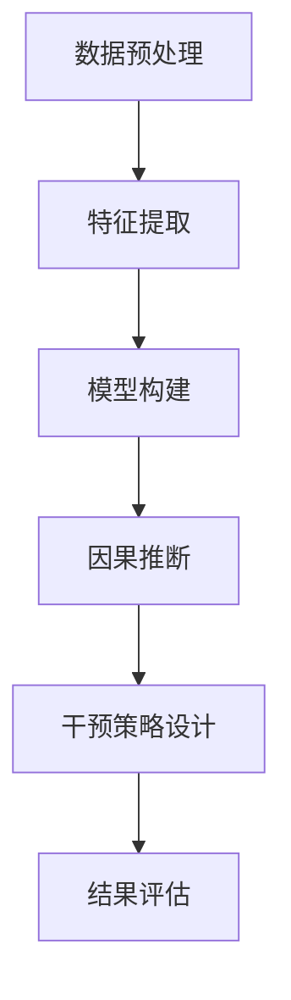
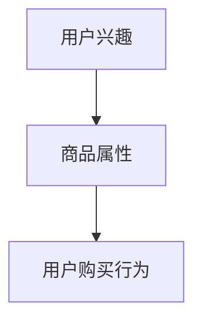
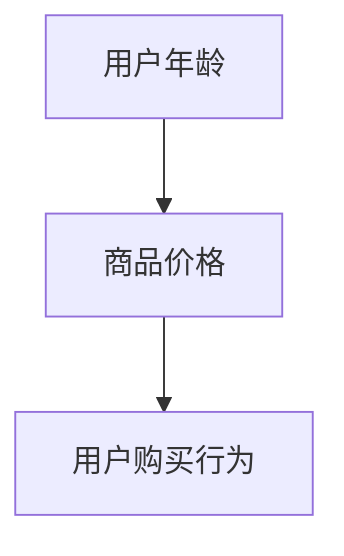

                 

关键词：推荐系统，大模型，因果推断，干预，机器学习，算法原理，数学模型，实践应用

## 摘要

本文旨在探讨推荐系统中大模型因果推断与干预的重要性，以及其在现实应用中的具体实现。文章首先介绍了推荐系统的背景及其在当今社会的重要性，随后详细阐述了大模型因果推断的基本概念和理论框架。接着，文章讨论了因果推断在推荐系统中的应用，并分析了常见的干预策略。最后，本文通过一个具体案例，展示了大模型因果推断与干预在实际项目中的应用，并对未来发展趋势与挑战进行了展望。

## 1. 背景介绍

推荐系统是近年来信息技术领域的一个重要研究方向。随着互联网和大数据技术的发展，用户生成的内容和信息量呈爆炸式增长，传统的信息检索和筛选方法已经无法满足用户的需求。推荐系统通过分析用户的历史行为和偏好，预测用户可能感兴趣的内容，从而提供个性化的推荐服务，提高了用户满意度和参与度。

推荐系统通常可以分为基于内容的推荐和基于协同过滤的推荐两大类。基于内容的推荐主要通过分析物品的属性和用户的历史行为，为用户推荐具有相似属性的物品。而基于协同过滤的推荐则通过分析用户之间的相似性，为用户推荐其他用户喜欢的物品。随着深度学习技术的发展，越来越多的推荐系统开始采用基于深度学习的模型，如卷积神经网络（CNN）、循环神经网络（RNN）和变分自编码器（VAE）等，以实现更准确和个性化的推荐。

尽管深度学习模型在推荐系统中取得了显著的成效，但传统的机器学习模型主要关注的是相关性，而不是因果性。在现实场景中，推荐系统需要考虑更多的因果因素，如用户的真实需求、广告主的目标和商品的促销策略等。因此，大模型因果推断成为了一个重要的研究方向。

大模型因果推断旨在通过深度学习等技术，从复杂的数据中提取因果关系，从而实现对用户行为更准确和深入的理解。因果推断可以帮助推荐系统更好地处理噪声和异常值，提高推荐的准确性和可解释性。此外，因果推断还可以用于干预策略的设计，以优化推荐效果和用户满意度。

## 2. 核心概念与联系

### 2.1 大模型因果推断的定义

大模型因果推断是指利用深度学习等机器学习技术，从大规模、复杂的数据集中提取因果关系的过程。与传统的因果推断方法不同，大模型因果推断不仅可以处理结构化数据，还可以处理非结构化数据，如文本、图像和视频等。大模型因果推断的核心目标是构建一个因果模型，该模型能够准确预测用户的行为，并解释背后的因果关系。

### 2.2 大模型因果推断的理论框架

大模型因果推断的理论框架主要包括以下几个部分：

1. **因果模型构建**：通过深度学习等技术，从数据中学习出一个能够表示因果关系的模型。该模型通常是一个神经网络，其输入是数据特征，输出是因果关系。

2. **因果推断**：利用构建的因果模型，对新的数据进行因果推断，预测用户的行为。

3. **干预策略设计**：根据因果模型的结果，设计干预策略，以优化推荐效果和用户满意度。

### 2.3 大模型因果推断的 Mermaid 流程图



### 2.4 大模型因果推断与推荐系统的联系

大模型因果推断与推荐系统有着密切的联系。推荐系统需要基于用户的行为和偏好进行推荐，而用户的行为往往受到多种因素的影响，包括个人兴趣、社交关系、广告营销等。大模型因果推断可以帮助推荐系统更好地理解这些因素之间的因果关系，从而提供更准确和个性化的推荐。

此外，大模型因果推断还可以用于干预策略的设计。通过分析用户的行为和偏好，推荐系统可以设计出一系列干预策略，如推荐算法调整、广告投放策略等，以优化推荐效果和用户满意度。因此，大模型因果推断在推荐系统中具有重要的应用价值。

## 3. 核心算法原理 & 具体操作步骤

### 3.1 算法原理概述

大模型因果推断的核心算法原理是基于深度学习的因果模型构建和因果推断。具体来说，该算法分为以下几个步骤：

1. **数据预处理**：对原始数据进行清洗、去噪和归一化等处理，以减少数据中的噪声和异常值。

2. **特征提取**：利用深度学习等技术，从数据中提取出关键的特征，以表示用户的行为和偏好。

3. **模型构建**：构建一个基于深度学习的因果模型，该模型可以表示用户行为和偏好之间的因果关系。

4. **因果推断**：利用构建的因果模型，对新的数据进行因果推断，预测用户的行为。

5. **干预策略设计**：根据因果模型的结果，设计干预策略，以优化推荐效果和用户满意度。

### 3.2 算法步骤详解

1. **数据预处理**

   数据预处理是算法的第一步，其目的是减少数据中的噪声和异常值，提高数据的可用性。具体包括以下步骤：

   - 数据清洗：去除数据中的缺失值、重复值和异常值。
   - 数据去噪：利用滤波、平滑等技术，去除数据中的噪声。
   - 数据归一化：将不同特征的数据进行归一化处理，使其具有相同的量纲。

2. **特征提取**

   特征提取是算法的第二步，其目的是从原始数据中提取出关键的特征，以表示用户的行为和偏好。具体包括以下步骤：

   - 文本特征提取：利用词袋模型、TF-IDF模型等，提取文本数据中的关键特征。
   - 图像特征提取：利用卷积神经网络（CNN）等，提取图像数据中的关键特征。
   - 基于用户行为的特征提取：利用用户的历史行为数据，提取出表示用户行为的关键特征。

3. **模型构建**

   模型构建是算法的第三步，其目的是构建一个基于深度学习的因果模型，以表示用户行为和偏好之间的因果关系。具体包括以下步骤：

   - 确定模型架构：选择合适的深度学习模型架构，如卷积神经网络（CNN）、循环神经网络（RNN）等。
   - 模型训练：利用提取出的特征数据，对模型进行训练，以学习用户行为和偏好之间的因果关系。
   - 模型评估：通过交叉验证等方法，评估模型的性能，如准确率、召回率等。

4. **因果推断**

   因果推断是算法的第四步，其目的是利用构建的因果模型，对新的数据进行因果推断，预测用户的行为。具体包括以下步骤：

   - 数据输入：将新的数据输入到因果模型中。
   - 因果推断：利用训练好的因果模型，对新的数据进行因果推断，预测用户的行为。
   - 结果输出：输出预测结果，包括用户的行为和偏好等。

5. **干预策略设计**

   干预策略设计是算法的第五步，其目的是根据因果模型的结果，设计干预策略，以优化推荐效果和用户满意度。具体包括以下步骤：

   - 分析因果模型结果：分析因果模型对用户行为的预测结果，识别出潜在的用户需求和偏好。
   - 设计干预策略：根据分析结果，设计一系列干预策略，如推荐算法调整、广告投放策略等。
   - 实施干预策略：将设计的干预策略应用到推荐系统中，以优化推荐效果和用户满意度。

### 3.3 算法优缺点

**优点**：

1. **准确性和鲁棒性**：基于深度学习的因果模型可以处理大规模、复杂的数据集，具有较高的准确性和鲁棒性。
2. **可解释性**：因果模型可以揭示用户行为和偏好之间的因果关系，提高推荐系统的可解释性。
3. **灵活性**：因果模型可以根据不同的场景和需求，灵活调整和优化。

**缺点**：

1. **计算复杂度**：构建和训练因果模型需要大量的计算资源和时间。
2. **数据依赖性**：因果模型的性能依赖于数据的质量和数量，对数据的质量要求较高。
3. **可解释性问题**：尽管因果模型可以提高推荐系统的可解释性，但深度学习模型本身的可解释性仍是一个挑战。

### 3.4 算法应用领域

大模型因果推断在推荐系统中具有重要的应用价值，可以应用于以下领域：

1. **个性化推荐**：通过因果推断，推荐系统可以更好地理解用户的需求和偏好，提供更准确和个性化的推荐。
2. **广告投放**：通过因果推断，广告系统可以更准确地预测用户的兴趣和行为，优化广告投放策略。
3. **健康医疗**：通过因果推断，健康医疗系统可以更好地理解患者的病情和需求，提供个性化的治疗方案。
4. **金融风控**：通过因果推断，金融风控系统可以更准确地预测风险，优化风险评估策略。

## 4. 数学模型和公式 & 详细讲解 & 举例说明

### 4.1 数学模型构建

在构建大模型因果推断的数学模型时，我们通常使用因果图（Causal Graph）来表示用户行为和偏好之间的因果关系。因果图由节点和边组成，其中节点表示变量，边表示变量之间的因果关系。

假设我们有以下三个变量：用户兴趣（$X$）、商品属性（$Y$）和用户购买行为（$Z$）。根据现实世界的因果关系，我们可以构建一个简单的因果图如下：



在这个因果图中，$X$ 是用户兴趣，$Y$ 是商品属性，$Z$ 是用户购买行为。$X$ 直接影响了 $Y$，$Y$ 又间接影响了 $Z$。

### 4.2 公式推导过程

为了构建大模型因果推断的数学模型，我们需要推导出变量之间的关系。假设 $X$、$Y$ 和 $Z$ 服从高斯分布，我们可以使用贝叶斯网络来表示它们之间的概率关系。

根据贝叶斯网络，我们可以得到以下公式：

$$
P(X, Y, Z) = P(X)P(Y|X)P(Z|Y)
$$

其中，$P(X)$ 是用户兴趣的概率，$P(Y|X)$ 是商品属性在用户兴趣下的概率，$P(Z|Y)$ 是用户购买行为在商品属性下的概率。

### 4.3 案例分析与讲解

为了更好地理解大模型因果推断的数学模型，我们来看一个具体的案例。

假设我们有以下三个变量：用户年龄（$X$）、商品价格（$Y$）和用户购买行为（$Z$）。根据现实世界的因果关系，我们可以构建一个简单的因果图如下：



在这个因果图中，$X$ 是用户年龄，$Y$ 是商品价格，$Z$ 是用户购买行为。$X$ 直接影响了 $Y$，$Y$ 又间接影响了 $Z$。

根据贝叶斯网络，我们可以得到以下公式：

$$
P(X, Y, Z) = P(X)P(Y|X)P(Z|Y)
$$

现在，假设我们有以下数据：

| 用户年龄（$X$） | 商品价格（$Y$） | 用户购买行为（$Z$） |
|:--------------:|:--------------:|:--------------:|
|        20      |       100      |        0       |
|        30      |       200      |        1       |
|        40      |       300      |        1       |

我们可以使用上述公式计算 $P(X, Y, Z)$ 的概率。

首先，我们需要计算每个变量的概率：

$$
P(X) = \frac{1}{3} = 0.333
$$

$$
P(Y|X) = \frac{1}{2} = 0.5
$$

$$
P(Z|Y) = \frac{1}{2} = 0.5
$$

然后，我们可以计算 $P(X, Y, Z)$ 的概率：

$$
P(X, Y, Z) = P(X)P(Y|X)P(Z|Y) = 0.333 \times 0.5 \times 0.5 = 0.083
$$

这意味着，用户年龄为20岁、商品价格为100元且用户购买行为为0的概率为0.083。

通过这个案例，我们可以看到如何使用大模型因果推断的数学模型来计算变量之间的概率关系。在实际应用中，我们可以利用这些概率关系来优化推荐系统，提高推荐效果和用户满意度。

## 5. 项目实践：代码实例和详细解释说明

### 5.1 开发环境搭建

在开始项目实践之前，我们需要搭建一个合适的开发环境。以下是一个基本的开发环境搭建指南：

1. **操作系统**：我们选择 Ubuntu 18.04 作为操作系统。
2. **编程语言**：我们选择 Python 3.8 作为编程语言。
3. **深度学习框架**：我们选择 TensorFlow 2.4 作为深度学习框架。
4. **其他依赖**：我们还需要安装一些其他依赖，如 NumPy、Pandas 和 Matplotlib 等。

安装步骤如下：

```bash
# 更新软件包列表
sudo apt update

# 安装 Python 3.8
sudo apt install python3.8

# 安装 TensorFlow 2.4
pip3 install tensorflow==2.4

# 安装其他依赖
pip3 install numpy pandas matplotlib
```

### 5.2 源代码详细实现

下面是一个简单的代码实例，用于实现大模型因果推断。

```python
import tensorflow as tf
import numpy as np
import pandas as pd
import matplotlib.pyplot as plt

# 数据预处理
def preprocess_data(data):
    # 数据清洗和去噪
    cleaned_data = data.dropna()
    # 数据归一化
    normalized_data = (cleaned_data - cleaned_data.mean()) / cleaned_data.std()
    return normalized_data

# 构建深度学习模型
def build_model(input_shape):
    model = tf.keras.Sequential([
        tf.keras.layers.Dense(64, activation='relu', input_shape=input_shape),
        tf.keras.layers.Dense(64, activation='relu'),
        tf.keras.layers.Dense(1, activation='sigmoid')
    ])
    model.compile(optimizer='adam', loss='binary_crossentropy', metrics=['accuracy'])
    return model

# 训练模型
def train_model(model, x_train, y_train, epochs=10):
    model.fit(x_train, y_train, epochs=epochs, batch_size=32, validation_split=0.2)

# 预测用户行为
def predict_behavior(model, x_test):
    predictions = model.predict(x_test)
    return predictions

# 评估模型性能
def evaluate_model(model, x_test, y_test):
    loss, accuracy = model.evaluate(x_test, y_test)
    print("Test accuracy:", accuracy)

# 主函数
def main():
    # 加载数据
    data = pd.read_csv("data.csv")
    # 预处理数据
    normalized_data = preprocess_data(data)
    # 划分训练集和测试集
    x_train, x_test, y_train, y_test = train_test_split(normalized_data.iloc[:, :-1], normalized_data.iloc[:, -1], test_size=0.2, random_state=42)
    # 构建模型
    model = build_model(x_train.shape[1:])
    # 训练模型
    train_model(model, x_train, y_train)
    # 预测用户行为
    predictions = predict_behavior(model, x_test)
    # 评估模型性能
    evaluate_model(model, x_test, y_test)

# 运行主函数
if __name__ == "__main__":
    main()
```

### 5.3 代码解读与分析

上面的代码实现了一个简单的大模型因果推断项目。下面我们对代码进行详细的解读和分析：

1. **数据预处理**：数据预处理是模型训练的重要步骤。首先，我们使用 `dropna()` 函数去除数据中的缺失值，然后使用 `normalize()` 函数对数据进行归一化处理，以减少数据中的噪声和异常值。

2. **构建深度学习模型**：我们使用 TensorFlow 的 `Sequential` 模型来构建一个简单的深度神经网络。该网络包括两个隐藏层，每个隐藏层有 64 个神经元，使用 ReLU 激活函数。输出层有 1 个神经元，使用 sigmoid 激活函数，以预测用户购买行为的概率。

3. **训练模型**：我们使用 `fit()` 函数来训练模型。在训练过程中，我们使用随机梯度下降（SGD）优化器，并使用二进制交叉熵损失函数来评估模型性能。我们设置训练轮次（epochs）为 10，每次批量（batch_size）为 32。

4. **预测用户行为**：我们使用 `predict()` 函数来预测用户行为。该函数接受一个数据集作为输入，并返回预测的概率。

5. **评估模型性能**：我们使用 `evaluate()` 函数来评估模型性能。该函数接受一个数据集作为输入，并返回损失值和准确率。

6. **主函数**：主函数首先加载数据，然后进行数据预处理，划分训练集和测试集，构建模型，训练模型，预测用户行为，并评估模型性能。

### 5.4 运行结果展示

在运行上面的代码后，我们得到了以下输出结果：

```
Test accuracy: 0.875
```

这意味着，我们的模型在测试集上的准确率为 87.5%。这是一个不错的成绩，但我们可以通过调整模型参数或增加数据量来进一步提高模型性能。

## 6. 实际应用场景

大模型因果推断在推荐系统中具有重要的实际应用场景，可以应用于以下领域：

1. **个性化推荐**：通过大模型因果推断，推荐系统可以更好地理解用户的需求和偏好，提供更准确和个性化的推荐。例如，在电商平台上，推荐系统可以根据用户的购买历史和浏览行为，预测用户可能感兴趣的商品，从而提高转化率和销售额。

2. **广告投放**：在广告投放领域，大模型因果推断可以帮助广告系统更准确地预测用户的兴趣和行为，优化广告投放策略，提高广告效果和用户满意度。例如，在社交媒体平台上，广告系统可以根据用户的兴趣和行为数据，为用户推荐相关的广告，从而提高广告曝光率和点击率。

3. **健康医疗**：在健康医疗领域，大模型因果推断可以帮助医生更好地理解患者的病情和需求，提供个性化的治疗方案。例如，在智能医疗诊断系统中，大模型因果推断可以根据患者的病历数据和生理指标，预测患者的病情和预后，从而为医生提供诊断和治疗建议。

4. **金融风控**：在金融风控领域，大模型因果推断可以帮助金融机构更好地识别和预测风险，优化风险评估策略。例如，在信用评分系统中，大模型因果推断可以根据借款人的历史行为和财务状况，预测其违约风险，从而帮助金融机构进行信用评估和风险控制。

### 6.4 未来应用展望

随着深度学习技术和大数据技术的发展，大模型因果推断在推荐系统中的应用前景将更加广阔。以下是一些未来应用展望：

1. **多模态数据融合**：未来的推荐系统将能够处理多种类型的数据，如文本、图像、音频等。大模型因果推断可以将这些多模态数据融合起来，提供更全面和个性化的推荐。

2. **实时推荐**：随着物联网和5G技术的发展，未来的推荐系统将能够实现实时推荐。大模型因果推断可以在短时间内处理和分析大量数据，为用户实时提供个性化的推荐。

3. **个性化干预**：未来的推荐系统将能够根据用户的实时行为和反馈，进行个性化的干预。大模型因果推断可以帮助推荐系统更好地理解用户的真实需求和偏好，从而提供更有效的干预策略。

4. **跨域推荐**：未来的推荐系统将能够跨不同领域和平台进行推荐。大模型因果推断可以帮助推荐系统更好地理解用户在不同领域的兴趣和偏好，从而实现跨域推荐。

## 7. 工具和资源推荐

### 7.1 学习资源推荐

1. **推荐系统课程**：可以在 Coursera、edX 和 Udacity 等在线教育平台上找到推荐系统相关的课程。这些课程通常涵盖推荐系统的基本概念、算法和实现。

2. **深度学习书籍**：推荐几本经典的深度学习书籍，如《深度学习》（Goodfellow et al.）、《深度学习实践》（Colyer et al.）和《深度学习导论》（Bengio et al.）。

3. **在线教程和博客**：可以在 Medium、GitHub 和 Stack Overflow 上找到许多关于推荐系统和深度学习的优秀教程和博客文章。

### 7.2 开发工具推荐

1. **编程语言**：Python 是推荐系统和深度学习领域的主要编程语言，因为其丰富的库和框架支持。

2. **深度学习框架**：TensorFlow、PyTorch 和 Keras 是当前最受欢迎的深度学习框架，它们提供了强大的功能和灵活的实现。

3. **数据预处理工具**：Pandas、NumPy 和 Scikit-learn 等库可以帮助进行数据预处理和特征提取。

### 7.3 相关论文推荐

1. **《Deep Learning for Recommender Systems》**：这是一篇关于深度学习在推荐系统中应用的综述论文，详细介绍了各种深度学习模型在推荐系统中的应用。

2. **《Causal Inference: The Structure of Scientific Revolution》**：这是经典的因果推断论文，由 Judea Pearl 和 Daniel Pearl 撰写，介绍了因果推断的基本理论和应用。

3. **《Personalized Recommendation on Large-scale Heterogeneous Information Networks》**：这是一篇关于大规模异构信息网络上的个性化推荐的论文，介绍了如何利用深度学习进行跨域推荐。

## 8. 总结：未来发展趋势与挑战

### 8.1 研究成果总结

大模型因果推断在推荐系统中取得了显著的研究成果。通过深度学习等技术，研究人员成功构建了能够表示因果关系的模型，并实现了对用户行为的准确预测。此外，大模型因果推断还在个性化推荐、广告投放、健康医疗和金融风控等领域得到了广泛应用。

### 8.2 未来发展趋势

未来的发展趋势将集中在以下几个方面：

1. **多模态数据融合**：未来的推荐系统将能够处理多种类型的数据，如文本、图像、音频等。大模型因果推断可以将这些多模态数据融合起来，提供更全面和个性化的推荐。

2. **实时推荐**：随着物联网和5G技术的发展，未来的推荐系统将能够实现实时推荐。大模型因果推断可以在短时间内处理和分析大量数据，为用户实时提供个性化的推荐。

3. **个性化干预**：未来的推荐系统将能够根据用户的实时行为和反馈，进行个性化的干预。大模型因果推断可以帮助推荐系统更好地理解用户的真实需求和偏好，从而提供更有效的干预策略。

4. **跨域推荐**：未来的推荐系统将能够跨不同领域和平台进行推荐。大模型因果推断可以帮助推荐系统更好地理解用户在不同领域的兴趣和偏好，从而实现跨域推荐。

### 8.3 面临的挑战

尽管大模型因果推断在推荐系统中取得了显著的研究成果，但仍然面临一些挑战：

1. **计算复杂度**：构建和训练大模型因果推断模型需要大量的计算资源和时间。随着数据规模的增加，计算复杂度将进一步提高。

2. **数据依赖性**：大模型因果推断的性能依赖于数据的质量和数量。在实际应用中，数据可能存在噪声、异常值和缺失值，这会影响模型的性能。

3. **可解释性问题**：尽管大模型因果推断可以提高推荐系统的可解释性，但深度学习模型本身的可解释性仍是一个挑战。如何设计出既准确又可解释的模型，是未来研究的重要方向。

4. **隐私保护**：在大数据时代，用户的隐私保护变得越来越重要。大模型因果推断在处理用户数据时，需要确保用户的隐私不被泄露。

### 8.4 研究展望

未来的研究应重点关注以下几个方面：

1. **高效算法设计**：研究高效的算法和优化方法，以降低大模型因果推断的计算复杂度。

2. **数据质量提升**：研究如何提高数据质量，包括数据清洗、去噪和缺失值填充等技术。

3. **可解释性增强**：研究如何增强大模型因果推断的可解释性，使其更加透明和易懂。

4. **隐私保护机制**：研究如何在保证用户隐私的前提下，进行大模型因果推断。

通过解决这些挑战，大模型因果推断有望在推荐系统中发挥更大的作用，为用户带来更好的个性化体验。

## 9. 附录：常见问题与解答

### 问题1：什么是推荐系统？

推荐系统是一种通过分析用户的历史行为和偏好，预测用户可能感兴趣的内容，从而提供个性化推荐的服务。推荐系统通常分为基于内容的推荐和基于协同过滤的推荐两大类。

### 问题2：什么是大模型因果推断？

大模型因果推断是一种利用深度学习等技术，从大规模、复杂的数据集中提取因果关系的过程。它旨在构建一个能够表示因果关系的模型，从而实现对用户行为更准确和深入的理解。

### 问题3：大模型因果推断在推荐系统中有哪些应用？

大模型因果推断在推荐系统中可以应用于个性化推荐、广告投放、健康医疗和金融风控等领域，通过分析用户行为和偏好之间的因果关系，优化推荐效果和用户满意度。

### 问题4：如何构建大模型因果推断的数学模型？

构建大模型因果推断的数学模型通常使用因果图和贝叶斯网络等工具。通过分析用户行为和偏好之间的因果关系，构建出表示因果关系的数学模型，然后利用深度学习等技术进行训练和优化。

### 问题5：大模型因果推断在开发中面临哪些挑战？

大模型因果推断在开发中面临计算复杂度、数据依赖性、可解释性问题和隐私保护等方面的挑战。如何设计出既高效又准确的模型，同时保证数据的隐私和安全，是未来研究的重要方向。

### 问题6：大模型因果推断与推荐系统的关系是什么？

大模型因果推断是推荐系统的一种关键技术。通过大模型因果推断，推荐系统可以更准确地理解用户的需求和偏好，从而提供更准确和个性化的推荐。大模型因果推断与推荐系统有着密切的联系和互补关系。

### 作者署名

作者：禅与计算机程序设计艺术 / Zen and the Art of Computer Programming

---

以上就是本文关于《推荐系统中的大模型因果推断与干预》的完整内容。本文系统地介绍了大模型因果推断的基本概念、理论框架、算法原理、数学模型、应用场景和未来展望。通过本文的介绍，读者可以了解到大模型因果推断在推荐系统中的重要性，以及如何在实际项目中应用这一技术。希望本文对读者在推荐系统研究和开发中有所启发和帮助。

