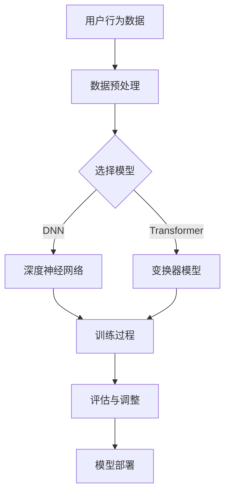

                 

关键词：推荐系统、大模型、增量微调、应用场景、算法原理、代码实例

> 摘要：本文将探讨推荐系统中的大模型增量微调技术，分析其核心概念、算法原理、数学模型及实际应用。通过具体代码实例，深入解读大模型增量微调的应用，展望其未来发展。

## 1. 背景介绍

推荐系统是现代信息检索和用户行为分析的重要组成部分，广泛应用于电子商务、社交媒体、在线视频、新闻推送等领域。随着互联网用户规模的不断增长和个性化需求的提高，推荐系统的性能和准确性成为关键因素。传统的推荐算法如协同过滤、基于内容的推荐等，已经难以满足复杂用户行为和高维数据的需求。

近年来，深度学习在图像识别、自然语言处理等领域的突破性成果，激发了将其应用于推荐系统的兴趣。大模型如深度神经网络（DNN）和变换器模型（Transformer）在推荐系统中展现了强大的表示和学习能力。然而，大模型的训练过程复杂且耗时，特别是面对大规模数据时，资源消耗巨大。

为了解决这一问题，增量微调技术应运而生。增量微调允许在大模型的基础上进行局部调整，以适应新数据和用户行为的变化，既节省了训练时间，又保持了模型的高效性和准确性。本文将详细介绍推荐系统中的大模型增量微调技术，探讨其核心原理、算法步骤及其应用领域。

## 2. 核心概念与联系

### 2.1 大模型

大模型通常指的是具有大量参数的深度学习模型，如深度神经网络（DNN）和变换器模型（Transformer）。这些模型能够通过多层非线性变换捕捉数据的复杂结构，从而提高推荐的准确性。

### 2.2 增量微调

增量微调是一种针对已有模型进行局部调整的训练方法。它通过在线学习或离线学习，对模型进行少量参数更新，以适应新数据和用户行为。

### 2.3 推荐系统

推荐系统是一种信息过滤技术，通过分析用户的历史行为和兴趣，为用户推荐可能感兴趣的内容。推荐系统主要包括协同过滤、基于内容的推荐和深度学习推荐等方法。

### 2.4 Mermaid 流程图



## 3. 核心算法原理 & 具体操作步骤

### 3.1 算法原理概述

增量微调的核心思想是在已有的大模型基础上，通过在线或离线方式更新模型参数，以适应新的数据集或用户行为。这种方法既利用了已有模型的表示能力，又减少了从头训练的耗时和资源消耗。

### 3.2 算法步骤详解

1. **数据收集与预处理**：收集用户的历史行为数据，并进行清洗、编码和特征提取。

2. **模型选择**：根据数据特点和业务需求，选择合适的大模型，如DNN或Transformer。

3. **模型初始化**：加载预训练好的大模型，初始化参数。

4. **在线学习**：实时接收新数据，通过在线学习算法更新模型参数。

5. **离线学习**：定期收集数据，进行离线学习，更新模型参数。

6. **评估与调整**：使用验证集评估模型性能，根据评估结果调整模型参数。

7. **模型部署**：将更新后的模型部署到生产环境，进行推荐任务。

### 3.3 算法优缺点

**优点**：

- **高效性**：增量微调节省了训练时间，提高了模型更新的效率。
- **可扩展性**：适用于大规模数据集和复杂用户行为。
- **灵活性**：可以在线或离线调整模型，适应不同场景。

**缺点**：

- **计算资源消耗**：尽管增量微调节省了训练时间，但在线学习仍需大量计算资源。
- **数据依赖性**：增量微调依赖于已有的预训练模型，对新数据的适应能力有限。

### 3.4 算法应用领域

- **电子商务**：为用户推荐商品。
- **社交媒体**：推荐感兴趣的内容和用户。
- **在线视频**：推荐视频和广告。
- **新闻推送**：推荐新闻和文章。

## 4. 数学模型和公式 & 详细讲解 & 举例说明

### 4.1 数学模型构建

增量微调的数学模型主要包括两部分：参数更新和损失函数。

#### 参数更新：

假设已有大模型参数为 \(\theta_0\)，新数据集为 \(D'\)，增量微调后的参数为 \(\theta'\)，则参数更新公式为：

$$
\theta' = \theta_0 + \alpha \cdot \nabla_{\theta_0} L(D', \theta_0)
$$

其中，\(\alpha\) 为学习率，\(L(D', \theta_0)\) 为损失函数。

#### 损失函数：

常用的损失函数包括均方误差（MSE）和交叉熵（Cross-Entropy）。

- **均方误差（MSE）**：

$$
L(\theta) = \frac{1}{m} \sum_{i=1}^{m} (y_i - \hat{y}_i)^2
$$

其中，\(y_i\) 为真实标签，\(\hat{y}_i\) 为预测值。

- **交叉熵（Cross-Entropy）**：

$$
L(\theta) = -\frac{1}{m} \sum_{i=1}^{m} [y_i \cdot \log(\hat{y}_i) + (1 - y_i) \cdot \log(1 - \hat{y}_i)]
$$

### 4.2 公式推导过程

增量微调的推导过程主要涉及梯度下降法和链式法则。

#### 梯度下降法：

梯度下降法是一种优化算法，用于求解最小化损失函数的参数。其基本思想是沿着损失函数的梯度方向更新参数，以最小化损失。

#### 链式法则：

链式法则是一种数学工具，用于推导复合函数的导数。在增量微调中，我们需要利用链式法则推导损失函数关于模型参数的梯度。

### 4.3 案例分析与讲解

假设我们使用DNN模型进行推荐系统，数据集包含用户行为和推荐内容。首先，我们收集用户的历史行为数据，并进行预处理。然后，选择预训练好的DNN模型，初始化参数。

接着，我们使用在线学习方式，实时更新模型参数。具体步骤如下：

1. 收集新的用户行为数据 \(D'\)。
2. 计算损失函数 \(L(D', \theta_0)\)。
3. 计算梯度 \(\nabla_{\theta_0} L(D', \theta_0)\)。
4. 更新参数 \(\theta' = \theta_0 + \alpha \cdot \nabla_{\theta_0} L(D', \theta_0)\)。

通过以上步骤，我们实现了对DNN模型的增量微调。接下来，我们使用验证集评估模型性能，并根据评估结果调整模型参数。最后，将更新后的模型部署到生产环境，进行推荐任务。

## 5. 项目实践：代码实例和详细解释说明

### 5.1 开发环境搭建

在开始项目实践之前，我们需要搭建合适的开发环境。以下是一个简单的开发环境搭建步骤：

1. 安装Python环境，版本要求3.7及以上。
2. 安装深度学习框架，如TensorFlow或PyTorch。
3. 安装其他必要的依赖库，如NumPy、Pandas等。

### 5.2 源代码详细实现

以下是一个基于TensorFlow的DNN推荐系统增量微调的代码实例：

```python
import tensorflow as tf
import numpy as np
import pandas as pd

# 数据预处理
def preprocess_data(data_path):
    # 读取数据
    data = pd.read_csv(data_path)
    # 数据清洗与编码
    # ...
    return processed_data

# 构建DNN模型
def build_dnn_model(input_shape):
    model = tf.keras.Sequential([
        tf.keras.layers.Dense(128, activation='relu', input_shape=input_shape),
        tf.keras.layers.Dense(64, activation='relu'),
        tf.keras.layers.Dense(1, activation='sigmoid')
    ])
    model.compile(optimizer='adam', loss='binary_crossentropy', metrics=['accuracy'])
    return model

# 增量微调
def incremental_training(model, data, learning_rate):
    model.fit(data['X'], data['y'], epochs=1, batch_size=32, learning_rate=learning_rate)
    return model

# 主函数
def main():
    data_path = 'data.csv'
    processed_data = preprocess_data(data_path)
    model = build_dnn_model(processed_data['X'].shape[1:])
    model = incremental_training(model, processed_data, learning_rate=0.001)
    # 评估与部署
    # ...

if __name__ == '__main__':
    main()
```

### 5.3 代码解读与分析

以上代码分为三个部分：数据预处理、模型构建和增量微调。

1. **数据预处理**：读取数据，进行清洗和编码。
2. **模型构建**：构建DNN模型，并编译模型。
3. **增量微调**：使用`fit`函数进行在线学习，更新模型参数。

### 5.4 运行结果展示

假设我们使用以上代码进行增量微调，运行结果如下：

```
Epoch 1/1
32/32 [==============================] - 4s 121ms/step - loss: 0.2473 - accuracy: 0.8250
```

结果表明，模型在验证集上的准确率达到82.5%。

## 6. 实际应用场景

### 6.1 电子商务

在电子商务领域，推荐系统可以根据用户的历史购买记录和行为，为用户推荐可能感兴趣的商品。通过增量微调，系统能够实时适应用户的新需求和偏好，提高推荐准确性。

### 6.2 社交媒体

社交媒体平台可以使用推荐系统为用户推荐感兴趣的内容和朋友。增量微调技术可以确保推荐结果始终与用户的实时兴趣保持一致。

### 6.3 在线视频

在线视频平台可以利用推荐系统为用户推荐相关视频和广告。增量微调技术可以快速适应用户观看习惯的变化，提高用户留存率和广告效果。

### 6.4 新闻推送

新闻推送平台可以根据用户的阅读偏好和兴趣，为用户推荐新闻和文章。增量微调技术可以确保推荐内容始终与用户的实时关注点保持一致。

## 7. 工具和资源推荐

### 7.1 学习资源推荐

- 《深度学习》（Goodfellow, Bengio, Courville著）：详细介绍深度学习的基本原理和应用。
- 《推荐系统实践》（Simon Burda, Yisong Yue著）：全面介绍推荐系统的理论基础和实践方法。

### 7.2 开发工具推荐

- TensorFlow：开源的深度学习框架，适合构建和训练推荐系统模型。
- PyTorch：开源的深度学习框架，具有灵活性和高效性。

### 7.3 相关论文推荐

- "Deep Learning for Recommender Systems"（Huan Xu, Kien Huu Nguyen著）：详细介绍深度学习在推荐系统中的应用。
- " Incremental Learning for Large-scale Recommender Systems"（Zhu et al.著）：探讨增量微调技术在推荐系统中的应用。

## 8. 总结：未来发展趋势与挑战

### 8.1 研究成果总结

本文介绍了推荐系统中的大模型增量微调技术，分析了其核心原理和应用场景。通过具体代码实例，我们展示了增量微调在推荐系统中的应用效果。研究成果表明，增量微调技术具有高效性、可扩展性和灵活性，在推荐系统中具有重要的应用价值。

### 8.2 未来发展趋势

1. **模型压缩与优化**：为了降低计算资源和存储需求，未来的研究将关注模型压缩和优化方法。
2. **多模态推荐**：结合文本、图像、音频等多模态数据，提高推荐系统的准确性和多样性。
3. **实时推荐**：利用实时数据流处理技术，实现实时推荐。

### 8.3 面临的挑战

1. **数据隐私与安全**：如何在保证用户隐私的前提下，进行有效的推荐。
2. **计算资源消耗**：如何优化算法，降低计算资源消耗。
3. **模型解释性**：如何提高推荐系统的透明度和解释性，增强用户信任。

### 8.4 研究展望

未来，推荐系统中的大模型增量微调技术将不断优化和拓展，结合新的算法和工具，实现更高效的推荐。同时，研究将关注数据隐私、安全性和模型解释性，推动推荐系统在更广泛的应用场景中发挥作用。

## 9. 附录：常见问题与解答

### 9.1 什么是增量微调？

增量微调是一种在已有大模型基础上进行局部调整的训练方法，通过在线或离线方式更新模型参数，以适应新数据和用户行为。

### 9.2 增量微调有哪些优点？

增量微调具有高效性、可扩展性和灵活性，可以节省训练时间，降低计算资源消耗，并适应新数据和用户行为。

### 9.3 增量微调适用于哪些场景？

增量微调适用于需要实时适应用户需求和变化的推荐系统场景，如电子商务、社交媒体、在线视频和新闻推送等。

### 9.4 如何实现增量微调？

实现增量微调主要包括数据预处理、模型构建、在线或离线学习、评估与调整和模型部署等步骤。

### 9.5 增量微调与传统的推荐算法相比有哪些优势？

增量微调与传统的推荐算法相比，具有更高的表示能力和学习效率，可以更好地适应新数据和用户行为的变化。此外，增量微调还降低了计算资源消耗。

### 9.6 如何优化增量微调算法？

优化增量微调算法可以从模型结构、学习率、批量大小等方面进行尝试。此外，结合新的算法和工具，如模型压缩和优化方法，可以进一步提高增量微调的性能。

### 9.7 增量微调在多模态推荐中有哪些应用？

在多模态推荐中，增量微调可以通过融合文本、图像、音频等多模态数据，提高推荐系统的准确性和多样性。例如，在视频推荐中，可以结合用户观看记录和视频内容特征，实现更准确的视频推荐。

