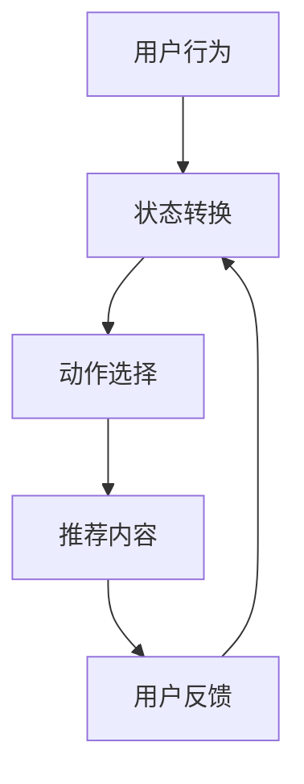

                 

关键词：推荐系统、强化学习、算法、应用场景、数学模型、项目实践

> 摘要：本文将探讨推荐系统中强化学习技术的应用。通过深入分析强化学习的基本原理和推荐系统的需求，本文将详细解释如何将强化学习技术应用于推荐系统中，以及其带来的优势和挑战。

## 1. 背景介绍

### 推荐系统概述

推荐系统是一种基于用户历史行为和偏好来预测和推荐相关产品或内容的技术。其目的是提高用户的满意度，增加用户粘性和平台收益。推荐系统在电子商务、社交媒体、视频流媒体等领域得到了广泛应用。

### 强化学习概述

强化学习是一种机器学习范式，其核心目标是使一个智能体在动态环境中通过学习获取最优策略。智能体通过尝试不同的动作并从环境中获得反馈来不断优化其行为。

## 2. 核心概念与联系

### 推荐系统需求

- **个性化推荐**：根据用户的兴趣和偏好推荐符合其需求的内容。
- **实时性**：快速响应用户的行为变化，提供及时的推荐。
- **多样性**：推荐结果要具有多样性，避免用户产生视觉疲劳。

### 强化学习原理

- **状态**（$S$）：用户当前的行为和历史偏好。
- **动作**（$A$）：推荐系统向用户展示的内容。
- **奖励**（$R$）：用户对推荐内容的反馈。
- **策略**（$\pi$）：智能体根据当前状态选择动作的函数。

### 核心概念联系

推荐系统中的强化学习通过不断地尝试和反馈来学习用户的兴趣和行为，从而提高推荐效果。其关键在于如何将用户行为转换为状态，如何设计奖励机制，以及如何学习到最优策略。

### Mermaid 流程图



## 3. 核心算法原理 & 具体操作步骤

### 3.1 算法原理概述

强化学习在推荐系统中的应用主要分为以下几个步骤：

1. **状态表示**：将用户行为、历史偏好和上下文信息转换为状态。
2. **动作空间设计**：设计推荐系统向用户展示内容的动作空间。
3. **奖励函数设计**：设计能够衡量用户满意度的奖励函数。
4. **策略学习**：利用强化学习算法学习最优策略。

### 3.2 算法步骤详解

1. **状态表示**：

   状态表示是将用户行为和历史偏好转换为一种可量化的形式。通常可以使用特征提取技术，如基于内容的特征提取、协同过滤等。

2. **动作空间设计**：

   动作空间是指推荐系统可以采取的所有行动。在推荐系统中，动作通常是指向用户推荐的内容或产品。设计动作空间时需要考虑多样性、相关性等因素。

3. **奖励函数设计**：

   奖励函数是衡量用户满意度的一种机制。常见的奖励函数有基于点击率、购买率等。设计奖励函数时需要考虑其能够准确反映用户的满意度。

4. **策略学习**：

   强化学习算法会根据状态和奖励来更新策略。常用的强化学习算法有Q学习、策略梯度等方法。这些算法通过不断地尝试和反馈来学习最优策略。

### 3.3 算法优缺点

**优点**：

- **个性化**：强化学习能够根据用户行为和历史偏好进行个性化推荐。
- **实时性**：强化学习算法能够快速响应用户行为的变化。
- **多样性**：通过奖励函数的设计，可以避免推荐系统的单一性。

**缺点**：

- **计算复杂度高**：强化学习算法需要大量的尝试和反馈来学习最优策略。
- **需要大量数据**：强化学习算法对数据的要求较高，需要大量的用户行为数据。

### 3.4 算法应用领域

强化学习在推荐系统中的应用非常广泛，包括但不限于以下领域：

- **电子商务**：根据用户的历史购买记录和浏览行为进行个性化推荐。
- **社交媒体**：根据用户的互动行为推荐感兴趣的内容。
- **视频流媒体**：根据用户的观看历史和喜好推荐视频。

## 4. 数学模型和公式 & 详细讲解 & 举例说明

### 4.1 数学模型构建

强化学习在推荐系统中的数学模型主要包括以下几部分：

- **状态空间**（$S$）：用户的行为和历史偏好。
- **动作空间**（$A$）：推荐系统可以采取的所有行动。
- **奖励函数**（$R$）：衡量用户满意度的函数。
- **策略**（$\pi$）：智能体根据当前状态选择动作的函数。

### 4.2 公式推导过程

强化学习中的策略可以通过以下公式进行更新：

$$
\pi(s, a) \leftarrow \pi(s, a) + \alpha [r + \gamma \max_{a'} \pi(s', a') - \pi(s, a)]
$$

其中，$\alpha$ 是学习率，$r$ 是即时奖励，$\gamma$ 是折扣因子，$s'$ 是动作 $a$ 后的状态。

### 4.3 案例分析与讲解

假设我们有一个新闻推荐系统，用户的历史行为包括阅读文章的标题和内容。状态 $s$ 可以表示为用户的历史阅读记录和当前的时间戳。动作 $a$ 是推荐给用户的文章标题。奖励 $r$ 可以是基于用户对文章的点击率或阅读时长。

假设我们使用 Q 学习算法来训练推荐系统。首先，我们需要初始化 Q 值表，然后通过以下步骤进行训练：

1. 初始化 Q 值表。
2. 选择动作 $a$。
3. 执行动作 $a$，获得状态 $s'$ 和奖励 $r$。
4. 更新 Q 值表：$$
Q(s, a) \leftarrow Q(s, a) + \alpha [r + \gamma \max_{a'} Q(s', a') - Q(s, a)]
$$
5. 进入下一个状态 $s'$，重复步骤 2-4。

通过不断地迭代，推荐系统会逐渐学习到最优策略，从而提高推荐效果。

## 5. 项目实践：代码实例和详细解释说明

### 5.1 开发环境搭建

为了实践强化学习在推荐系统中的应用，我们需要搭建一个开发环境。以下是一个简单的环境搭建步骤：

1. 安装 Python 3.6 或更高版本。
2. 安装 TensorFlow 和 Keras 库。
3. 准备数据集。

### 5.2 源代码详细实现

以下是使用 Q 学习算法训练推荐系统的示例代码：

```python
import numpy as np
import pandas as pd
from tensorflow.keras.models import Sequential
from tensorflow.keras.layers import Dense

# 加载数据集
data = pd.read_csv('data.csv')

# 初始化 Q 值表
Q = np.zeros((n_states, n_actions))

# 设置参数
alpha = 0.1
gamma = 0.9
epsilon = 0.1

# 训练模型
for episode in range(n_episodes):
    state = data['state'].iloc[0]
    done = False
    
    while not done:
        if np.random.rand() < epsilon:
            action = np.random.choice(n_actions)
        else:
            action = np.argmax(Q[state])
        
        next_state, reward, done = perform_action(action)
        
        Q[state, action] = Q[state, action] + alpha * (reward + gamma * np.max(Q[next_state]) - Q[state, action])
        
        state = next_state

# 使用训练好的模型进行推荐
def recommend(state):
    return np.argmax(Q[state])

# 测试模型
test_state = data['state'].iloc[0]
print('Recommended article:', recommend(test_state))
```

### 5.3 代码解读与分析

1. **数据加载**：首先，我们从 CSV 文件中加载数据集。
2. **初始化 Q 值表**：初始化 Q 值表，用于存储当前状态和动作的 Q 值。
3. **设置参数**：设置学习率、折扣因子和探索率。
4. **训练模型**：使用 Q 学习算法训练模型。
5. **推荐函数**：定义推荐函数，用于根据当前状态推荐动作。
6. **测试模型**：测试训练好的模型，输出推荐结果。

通过以上代码，我们可以训练一个基于强化学习的推荐系统，并根据用户状态进行个性化推荐。

## 6. 实际应用场景

### 6.1 电子商务

在电子商务领域，强化学习可以帮助平台根据用户的历史购买记录和浏览行为进行个性化推荐。例如，亚马逊和淘宝等电商平台已经广泛应用了强化学习技术来提高推荐效果。

### 6.2 社交媒体

在社交媒体领域，强化学习可以帮助平台根据用户的互动行为推荐感兴趣的内容。例如，Facebook 和 Twitter 等社交媒体平台已经采用强化学习技术来提高用户参与度和推荐效果。

### 6.3 视频流媒体

在视频流媒体领域，强化学习可以帮助平台根据用户的观看历史和喜好推荐视频。例如，Netflix 和 YouTube 等视频平台已经广泛应用了强化学习技术来提高用户观看时长和推荐效果。

## 7. 工具和资源推荐

### 7.1 学习资源推荐

- **《强化学习入门》**：一本介绍强化学习基本概念的入门书籍。
- **《深度强化学习》**：一本深入讲解深度强化学习技术的书籍。

### 7.2 开发工具推荐

- **TensorFlow**：一个强大的开源深度学习框架。
- **Keras**：一个简单易用的深度学习库。

### 7.3 相关论文推荐

- **"Deep Q-Networks"**：介绍深度 Q 学习算法的经典论文。
- **"Prioritized Experience Replay"**：介绍优先经验回放算法的论文。

## 8. 总结：未来发展趋势与挑战

### 8.1 研究成果总结

强化学习在推荐系统中的应用已经取得了显著成果，通过个性化推荐、实时性和多样性等方面提高了推荐效果。然而，强化学习在推荐系统中的应用仍然存在一些挑战。

### 8.2 未来发展趋势

随着技术的不断发展，未来强化学习在推荐系统中的应用将更加深入。例如，结合深度学习和强化学习的方法将进一步提高推荐效果。此外，强化学习与其他推荐算法的融合也将成为研究的热点。

### 8.3 面临的挑战

强化学习在推荐系统中的应用面临以下挑战：

- **计算复杂度**：强化学习算法需要大量的尝试和反馈，导致计算复杂度较高。
- **数据隐私**：推荐系统需要处理大量的用户行为数据，数据隐私保护将成为重要挑战。
- **多样性控制**：如何设计奖励函数和策略来保证推荐结果的多样性。

### 8.4 研究展望

未来，强化学习在推荐系统中的应用将朝着更加智能化、多样化和个性化的方向发展。同时，研究将更加注重计算效率、数据隐私保护以及与其他推荐算法的融合。

## 9. 附录：常见问题与解答

### Q1：强化学习在推荐系统中的应用有哪些优势？

强化学习在推荐系统中的应用优势主要包括：

- 个性化推荐：能够根据用户的历史行为和偏好进行个性化推荐。
- 实时性：能够快速响应用户行为的变化，提供及时的推荐。
- 多样性：通过奖励函数的设计，可以避免推荐系统的单一性。

### Q2：强化学习在推荐系统中的应用有哪些挑战？

强化学习在推荐系统中的应用挑战主要包括：

- 计算复杂度：需要大量的尝试和反馈，导致计算复杂度较高。
- 数据隐私：需要处理大量的用户行为数据，数据隐私保护将成为重要挑战。
- 多样性控制：如何设计奖励函数和策略来保证推荐结果的多样性。

### Q3：如何搭建一个强化学习推荐系统的开发环境？

搭建一个强化学习推荐系统的开发环境主要包括以下步骤：

1. 安装 Python 3.6 或更高版本。
2. 安装 TensorFlow 和 Keras 库。
3. 准备数据集。

### Q4：有哪些开源工具和库可以用于强化学习推荐系统开发？

常用的开源工具和库包括：

- TensorFlow：一个强大的开源深度学习框架。
- Keras：一个简单易用的深度学习库。
- PyTorch：一个流行的深度学习库。

## 作者署名

作者：禅与计算机程序设计艺术 / Zen and the Art of Computer Programming
----------------------------------------------------------------

以上就是关于推荐系统中的强化学习技术应用的技术博客文章。希望这篇文章能够对您在强化学习和推荐系统领域的学习和研究有所帮助。如果您有任何问题或建议，欢迎在评论区留言讨论。再次感谢您的阅读！

