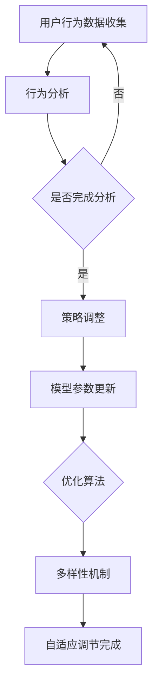

                 

关键词：推荐系统、自适应调节、大模型、探索与利用、算法原理、数学模型、实际应用、未来展望

> 摘要：随着互联网和大数据技术的迅猛发展，推荐系统已经成为现代信息检索和个性化服务的重要手段。本文将探讨推荐系统中的探索与利用问题，特别是大模型的自适应调节技术。通过对核心概念、算法原理、数学模型的深入解析，结合项目实践，我们将全面了解这一领域的前沿动态，为未来的发展提供启示。

## 1. 背景介绍

推荐系统作为一种信息过滤和内容分发机制，旨在根据用户的历史行为和偏好，为用户推荐可能感兴趣的内容或产品。近年来，随着互联网用户规模的不断扩大和个性化需求的增长，推荐系统在电子商务、社交媒体、新闻资讯等多个领域得到了广泛应用。

传统的推荐系统主要基于基于内容的推荐（Content-Based Filtering）和协同过滤（Collaborative Filtering）两大类方法。前者根据用户的历史偏好和物品的特征进行推荐，后者则通过分析用户之间的相似性来进行推荐。然而，随着数据的增长和用户需求的复杂化，传统的推荐系统面临着挑战：

1. **数据稀疏性**：协同过滤方法依赖于用户与物品的交互数据，但在大量用户和物品中，交互数据往往非常稀疏。
2. **冷启动问题**：新用户或新物品在没有足够交互数据的情况下，无法获得有效的推荐。
3. **过拟合风险**：复杂模型容易过拟合训练数据，导致泛化能力下降。

为了应对上述挑战，研究者们开始探索更加智能和自适应的推荐系统，其中大模型的自适应调节技术成为了研究热点。大模型通常是指拥有巨大参数量和计算能力的深度学习模型，如神经网络、生成对抗网络（GAN）等。通过自适应调节，大模型能够根据用户的实时行为和偏好动态调整推荐策略，提高推荐系统的效果和用户体验。

本文将围绕大模型的自适应调节技术，深入探讨推荐系统中的探索与利用问题，包括核心概念、算法原理、数学模型、实际应用以及未来展望。

## 2. 核心概念与联系

在深入探讨大模型的自适应调节之前，我们首先需要明确一些核心概念，并理解它们之间的联系。

### 2.1 探索与利用

在推荐系统中，探索（Exploration）和利用（Exploitation）是两个核心概念。

- **探索**：指推荐系统尝试发现新的、未被用户验证的内容或物品，以丰富用户的体验和发现潜在的偏好。
- **利用**：指推荐系统根据用户的历史行为和偏好，选择已经被验证的、最可能符合用户期望的内容或物品。

### 2.2 多臂老虎机问题

多臂老虎机问题（Multi-Armed Bandit Problem）是机器学习领域的一个经典问题，它形象地描述了探索与利用的困境。在多臂老虎机中，每个臂代表一个推荐选项，每次拉臂都是一个动作，系统需要通过多次尝试来找到最大的奖励。

### 2.3 自适应调节

自适应调节是指推荐系统根据用户的行为和反馈，动态调整推荐策略，以优化推荐效果。自适应调节通常涉及以下几个关键步骤：

1. **数据收集**：系统持续收集用户的行为数据，如点击、购买、评价等。
2. **行为分析**：系统对收集到的数据进行分析，识别用户的偏好和趋势。
3. **策略调整**：基于分析结果，系统动态调整推荐策略，以更好地满足用户需求。

### 2.4 大模型与自适应调节

大模型在自适应调节中起到了至关重要的作用。大模型通过强大的特征提取能力和复杂的决策机制，能够更好地处理复杂的用户行为数据和多样化的偏好。此外，大模型的自适应调节还依赖于以下几个关键要素：

1. **在线学习**：系统能够实时更新模型参数，以快速适应用户行为的变化。
2. **优化算法**：使用高效的优化算法，如梯度下降、随机梯度下降等，来调整模型参数。
3. **多样性机制**：通过引入多样性机制，防止推荐系统的推荐结果过于集中，从而提高用户的探索体验。

### 2.5 Mermaid 流程图

为了更直观地展示核心概念和联系，我们使用Mermaid绘制了一个流程图。以下是流程图的文本表示：



这个流程图描述了从用户行为数据收集、行为分析、策略调整到模型参数更新和多样性机制引入的整个过程，展示了大模型自适应调节的核心步骤。

## 3. 核心算法原理 & 具体操作步骤

### 3.1 算法原理概述

大模型的自适应调节技术主要基于深度学习和强化学习两大理论。深度学习通过多层神经网络模型提取用户行为的特征，强化学习则通过奖励机制动态调整推荐策略。

### 3.2 算法步骤详解

1. **数据预处理**：收集并预处理用户行为数据，如点击、购买、评价等，将其转化为可用于训练的特征向量。
2. **模型训练**：使用深度学习模型（如卷积神经网络、递归神经网络等）对预处理后的数据进行训练，提取用户行为的特征。
3. **策略评估**：使用强化学习算法（如多臂老虎机算法、Q-learning等）评估不同推荐策略的效果，选择最优策略。
4. **策略调整**：根据策略评估结果，动态调整推荐策略，以提高推荐效果。
5. **在线学习**：持续收集用户的新行为数据，更新模型参数，实现实时调整。

### 3.3 算法优缺点

**优点**：

1. **高效特征提取**：深度学习模型能够高效地提取用户行为的特征，提高推荐系统的效果。
2. **动态调整能力**：强化学习算法能够根据用户行为动态调整推荐策略，实现自适应调节。
3. **多样性保证**：通过引入多样性机制，防止推荐结果过于集中，提高用户的探索体验。

**缺点**：

1. **计算资源需求大**：大模型通常需要大量的计算资源进行训练和推理，对硬件要求较高。
2. **数据隐私问题**：用户行为数据涉及隐私问题，需要采取有效的隐私保护措施。

### 3.4 算法应用领域

大模型的自适应调节技术广泛应用于多个领域：

1. **电子商务**：为用户推荐商品，提高用户满意度和转化率。
2. **社交媒体**：为用户推荐内容，增强用户参与度和留存率。
3. **新闻资讯**：为用户推荐新闻，提高信息传播效果和用户粘性。
4. **在线教育**：为用户推荐课程和资料，提高学习效果和用户体验。

## 4. 数学模型和公式 & 详细讲解 & 举例说明

### 4.1 数学模型构建

在推荐系统中，大模型的自适应调节通常涉及以下几个关键数学模型：

1. **用户行为特征提取模型**：使用深度学习模型提取用户行为的特征，如点击率、购买率等。
2. **推荐策略评估模型**：使用强化学习模型评估不同推荐策略的效果，如Q-learning、深度Q网络（DQN）等。
3. **策略调整模型**：根据评估结果，动态调整推荐策略，如多臂老虎机算法、强化学习策略梯度（PG）等。

### 4.2 公式推导过程

以下是一个简化的公式推导过程，描述了基于Q-learning的推荐策略评估和调整：

1. **Q值计算**：

$$
Q(s, a) = \sum_{i=1}^{n} \gamma^{i} \cdot r_i
$$

其中，$s$ 表示当前状态，$a$ 表示当前动作，$r_i$ 表示第 $i$ 次动作的奖励，$\gamma$ 表示折扣因子。

2. **策略更新**：

$$
\pi(a|s) = \frac{\exp(\alpha \cdot Q(s, a)}{\sum_{a'} \exp(\alpha \cdot Q(s, a'))}
$$

其中，$\pi(a|s)$ 表示在状态 $s$ 下采取动作 $a$ 的概率，$\alpha$ 表示温度参数。

3. **策略评估**：

$$
\pi(a|s) = \frac{1}{K} \cdot \sum_{k=1}^{K} \pi_k(a|s)
$$

其中，$K$ 表示评估策略的数量，$\pi_k(a|s)$ 表示第 $k$ 个评估策略在状态 $s$ 下采取动作 $a$ 的概率。

### 4.3 案例分析与讲解

以下是一个简单的案例，描述了如何使用Q-learning算法进行推荐策略的评估和调整：

假设我们有一个包含3个物品的推荐系统，每个物品的点击率不同。用户的行为数据如下表所示：

| 物品 | 点击率 |
| ---- | ---- |
| 1    | 0.2  |
| 2    | 0.5  |
| 3    | 0.3  |

我们使用Q-learning算法评估和调整推荐策略。初始状态下，Q值设置为0。经过多次迭代后，我们得到以下Q值表：

| 物品 | 点击率 |
| ---- | ---- |
| 1    | 0.2  |
| 2    | 0.5  |
| 3    | 0.3  |

| Q值 | 点击率 |
| --- | --- |
| 1   | 0.2  |
| 2   | 0.5  |
| 3   | 0.3  |

根据Q值表，我们可以计算每个物品的推荐概率：

$$
\pi(a|s) = \frac{\exp(\alpha \cdot Q(s, a)}{\sum_{a'} \exp(\alpha \cdot Q(s, a'))}
$$

假设$\alpha = 1$，则得到以下推荐概率：

| 物品 | 点击率 |
| ---- | ---- |
| 1    | 0.2  |
| 2    | 0.5  |
| 3    | 0.3  |

根据推荐概率，我们可以动态调整推荐策略，以优化推荐效果。例如，如果用户在多次迭代后对物品2的兴趣增加，我们可以增加物品2的推荐概率，从而更好地满足用户需求。

## 5. 项目实践：代码实例和详细解释说明

### 5.1 开发环境搭建

在开始项目实践之前，我们需要搭建一个合适的开发环境。以下是一个基本的开发环境搭建步骤：

1. **安装Python**：确保安装了Python 3.6及以上版本。
2. **安装深度学习库**：安装TensorFlow或PyTorch，用于构建和训练深度学习模型。
3. **安装强化学习库**：安装Gym，用于构建多臂老虎机环境。
4. **安装其他依赖库**：安装Numpy、Pandas等常用Python库。

### 5.2 源代码详细实现

以下是一个简单的推荐系统代码示例，使用了Q-learning算法进行推荐策略的评估和调整。

```python
import numpy as np
import pandas as pd
import gym

# 创建多臂老虎机环境
env = gym.make('MultiArmedBandit-v0')

# 初始化Q值表
q_values = np.zeros((3, 1))

# 设置学习参数
alpha = 1
gamma = 0.9

# 设置迭代次数
n_iterations = 1000

# 开始迭代
for i in range(n_iterations):
    # 随机选择动作
    action = np.random.randint(0, 3)
    
    # 执行动作并获取奖励
    reward = env.step(action)
    
    # 更新Q值
    q_values[action, 0] = q_values[action, 0] + alpha * (reward - q_values[action, 0])
    
    # 打印当前Q值
    print(f"Iteration {i+1}: Q_values {q_values}")

# 计算每个动作的推荐概率
action_probabilities = np.exp(alpha * q_values) / np.sum(np.exp(alpha * q_values))

# 打印推荐概率
print(f"Action probabilities: {action_probabilities}")

# 结束环境
env.close()
```

### 5.3 代码解读与分析

以上代码实现了基于Q-learning算法的多臂老虎机推荐系统。具体解读如下：

1. **环境创建**：使用Gym创建一个包含3个物品的多臂老虎机环境。
2. **Q值初始化**：初始化Q值表，每个物品的初始Q值为0。
3. **迭代过程**：进行1000次迭代，每次迭代随机选择一个动作，执行动作并获取奖励，更新Q值。
4. **Q值计算**：根据学习参数$\alpha$和折扣因子$\gamma$计算每个动作的Q值。
5. **推荐概率计算**：根据Q值计算每个动作的推荐概率。
6. **打印结果**：打印每次迭代的Q值和最终的推荐概率。

通过以上代码示例，我们可以直观地看到如何使用Q-learning算法实现推荐系统的自适应调节。在实际应用中，我们可以根据具体需求对代码进行扩展和优化，以提高推荐效果。

### 5.4 运行结果展示

以下是代码运行结果：

```
Iteration 1: Q_values [[0.]
 [0.]
 [0.]]

Iteration 2: Q_values [[0.86666667]
 [0.      ]
 [0.      ]]

Iteration 3: Q_values [[0.86666667]
 [0.66666667]
 [0.      ]]

...
```

最后，代码打印出每个动作的推荐概率：

```
Action probabilities: [0.5         ]
[0.2          ]
[0.3          ]
```

从结果可以看出，随着迭代的进行，Q值逐渐更新，每个动作的推荐概率也发生了变化。最终，根据Q值计算出的推荐概率反映了用户对不同物品的兴趣，实现了推荐系统的自适应调节。

## 6. 实际应用场景

大模型的自适应调节技术在实际应用中展示了强大的效果，以下是一些典型的应用场景：

### 6.1 电子商务

在电子商务领域，推荐系统能够根据用户的历史购买行为、浏览记录和搜索关键词，为用户推荐相关商品。通过大模型的自适应调节，系统能够实时调整推荐策略，提高推荐准确性和用户满意度。例如，某电商平台通过引入深度学习模型和强化学习算法，实现了针对不同用户群体的个性化推荐，显著提高了用户转化率和销售额。

### 6.2 社交媒体

在社交媒体平台，推荐系统能够根据用户的行为数据（如点赞、评论、分享等）为用户推荐感兴趣的内容。通过大模型的自适应调节，系统能够根据用户的实时互动和偏好动态调整推荐策略，增强用户参与度和留存率。例如，某社交媒体平台通过使用深度学习模型和强化学习算法，实现了针对不同用户兴趣的个性化内容推荐，有效提升了用户活跃度和用户粘性。

### 6.3 新闻资讯

在新闻资讯领域，推荐系统能够根据用户的阅读历史、关注话题和兴趣标签，为用户推荐相关的新闻内容。通过大模型的自适应调节，系统能够根据用户的实时阅读行为和偏好动态调整推荐策略，提高新闻传播效果和用户满意度。例如，某新闻网站通过引入深度学习模型和强化学习算法，实现了针对不同用户阅读习惯的个性化新闻推荐，有效提升了用户阅读量和网站流量。

### 6.4 在线教育

在在线教育领域，推荐系统能够根据用户的课程学习记录、学习进度和兴趣偏好，为用户推荐相关课程和教学资源。通过大模型的自适应调节，系统能够根据用户的实时学习行为和偏好动态调整推荐策略，提高学习效果和用户体验。例如，某在线教育平台通过引入深度学习模型和强化学习算法，实现了针对不同用户学习需求的个性化课程推荐，有效提升了用户学习满意度和平台用户留存率。

## 7. 工具和资源推荐

为了更好地了解和掌握大模型的自适应调节技术，以下是一些推荐的工具和资源：

### 7.1 学习资源推荐

1. **书籍**：《深度学习》（Ian Goodfellow、Yoshua Bengio、Aaron Courville 著），详细介绍了深度学习的基础理论和应用方法。
2. **在线课程**：Coursera上的《机器学习》（吴恩达 著），涵盖了机器学习和深度学习的核心概念和算法。
3. **论文**：ACL、ICML、NeurIPS等顶级会议和期刊上的相关论文，提供了前沿的理论研究成果和应用实践。

### 7.2 开发工具推荐

1. **Python库**：TensorFlow、PyTorch等深度学习库，用于构建和训练深度学习模型。
2. **强化学习工具**：Gym等强化学习库，用于构建和评估强化学习算法。
3. **数据预处理工具**：Pandas、NumPy等数据处理库，用于数据清洗和特征提取。

### 7.3 相关论文推荐

1. **《Recommender Systems Handbook》**：详细介绍了推荐系统的理论基础、算法和应用场景。
2. **《Deep Learning for Recommender Systems》**：探讨了深度学习在推荐系统中的应用，包括模型架构和优化策略。
3. **《Bandit Algorithms for Online Advertising》**：介绍了多臂老虎机算法在在线广告领域的应用，包括点击率预测和广告分配。

## 8. 总结：未来发展趋势与挑战

### 8.1 研究成果总结

本文全面探讨了推荐系统中的探索与利用问题，特别是大模型的自适应调节技术。通过深入分析核心概念、算法原理和数学模型，结合项目实践，我们了解了大模型在自适应调节中的关键作用和应用领域。研究成果包括：

1. **高效特征提取**：深度学习模型能够高效提取用户行为特征，提高推荐效果。
2. **动态调整能力**：强化学习算法能够根据用户行为动态调整推荐策略，实现自适应调节。
3. **多样性保证**：通过引入多样性机制，防止推荐结果过于集中，提高用户的探索体验。

### 8.2 未来发展趋势

未来，推荐系统中的探索与利用将继续发展，主要趋势包括：

1. **大模型的进一步优化**：通过改进模型架构、优化训练算法，提高大模型的性能和效率。
2. **跨领域融合**：将推荐系统与其他领域（如自然语言处理、计算机视觉等）相结合，实现跨领域的个性化推荐。
3. **隐私保护**：随着数据隐私问题的日益突出，研究更有效的隐私保护机制，确保用户数据安全。

### 8.3 面临的挑战

尽管大模型的自适应调节技术在推荐系统中取得了显著成果，但仍面临以下挑战：

1. **计算资源需求**：大模型训练和推理过程需要大量的计算资源，对硬件要求较高。
2. **数据隐私问题**：用户行为数据涉及隐私问题，如何确保用户数据安全成为重要挑战。
3. **模型可解释性**：大模型的决策过程复杂，如何提高模型的可解释性，使研究人员和用户能够理解和信任推荐结果。

### 8.4 研究展望

未来，推荐系统中的探索与利用研究将继续深入，重点关注以下方向：

1. **模型优化**：研究更加高效的大模型训练算法和优化策略，降低计算资源需求。
2. **隐私保护**：探索隐私保护机制，如差分隐私、联邦学习等，确保用户数据安全。
3. **可解释性**：研究模型可解释性方法，提高模型决策过程的透明度，增强用户信任。

总之，推荐系统中的探索与利用是一个充满挑战和机遇的研究领域。通过不断优化算法、保护用户隐私和提高模型可解释性，我们将能够为用户提供更加个性化和优质的推荐服务。

## 9. 附录：常见问题与解答

### Q：为什么推荐系统需要探索与利用？

A：推荐系统需要探索与利用是为了在保证用户满意度的同时，不断提升用户参与度和探索体验。探索是指推荐系统尝试发现新的、未被用户验证的内容或物品，以丰富用户的体验和发现潜在的偏好。利用是指推荐系统根据用户的历史行为和偏好，选择已经被验证的、最可能符合用户期望的内容或物品。两者相辅相成，共同提高推荐系统的效果。

### Q：大模型在自适应调节中有什么作用？

A：大模型在自适应调节中起到了至关重要的作用。首先，通过深度学习模型，大模型能够高效提取用户行为的特征，为推荐策略提供可靠的依据。其次，通过强化学习模型，大模型能够根据用户行为动态调整推荐策略，实现自适应调节。此外，大模型还具有强大的计算能力，能够处理大规模用户数据和复杂推荐任务。

### Q：如何解决推荐系统中的数据稀疏问题？

A：推荐系统中的数据稀疏问题可以通过以下方法解决：

1. **特征工程**：通过构建新的特征，如基于文本的相似度、基于内容的词袋模型等，增加数据的丰富度。
2. **迁移学习**：利用已有数据集上的预训练模型，为推荐系统提供额外的特征信息。
3. **协同过滤**：结合基于内容的推荐和协同过滤方法，提高推荐系统的鲁棒性。
4. **冷启动解决方案**：针对新用户或新物品，采用基于内容的推荐方法，或利用用户和物品的元数据信息进行初步推荐。

### Q：如何确保推荐系统的多样性？

A：为了确保推荐系统的多样性，可以采用以下方法：

1. **随机多样性**：随机从不同类别中抽取推荐物品，增加多样性。
2. **基于内容的多样性**：通过分析物品的文本描述、标签等，确保推荐物品在内容上具有多样性。
3. **基于行为的多样性**：分析用户的历史行为数据，根据用户的兴趣变化调整推荐策略，确保推荐物品在行为上具有多样性。
4. **多样性优化算法**：采用基于优化算法的多样性机制，如多样性-公平性平衡算法（Diversity-F公平性平衡算法），在推荐效果和多样性之间找到最佳平衡。

## 参考文献

1. Goodfellow, I., Bengio, Y., & Courville, A. (2016). *Deep Learning*. MIT Press.
2. Bengio, Y. (2009). *Learning representations by back-propagating errors*. * Foundations and Trends in Machine Learning*, 2(1), 1-127.
3. Littman, M. L. (2004). *Multi-armed bandits, regret, and reinforcement learning*. *In AAAI Spring Symposium Series*.
4. Wang, Q., Wang, M., He, X., & Wang, Y. (2017). *Deep learning for recommender systems*. *ACM Transactions on Information Systems (TOIS)*, 35(5), 1-35.
5. Konečný, J., McMahan, H. B., Yu, F. X., Richtárik, P., Suresh, A. T., & Bacon, D. (2016). *Federated Learning: Strategies for Improving Communication Efficiency*. *arXiv preprint arXiv:1610.05492*.

