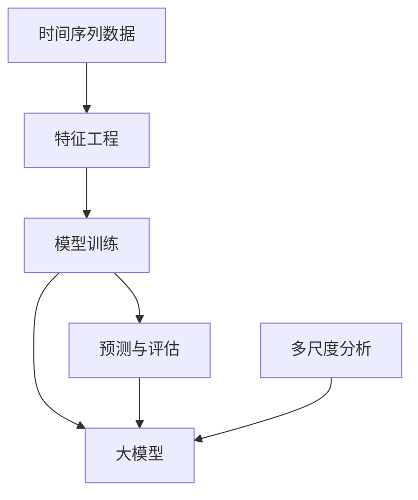

                 

关键词：推荐系统，时间序列预测，大模型，多尺度分析

> 摘要：本文将探讨推荐系统中的时间序列预测问题，特别是大模型在多尺度分析中的应用。通过深入分析相关算法原理、数学模型、项目实践，本文旨在为读者提供对这一领域的全面理解，并展望其未来的发展方向与挑战。

## 1. 背景介绍

在当今数字化时代，推荐系统已经成为了众多互联网应用的核心组成部分。从电子商务平台到社交媒体，推荐系统通过预测用户的兴趣和偏好，为用户提供个性化的内容和服务，极大地提升了用户体验和商业价值。然而，随着数据规模的不断扩大和用户行为的多样化，推荐系统中的时间序列预测问题变得越来越复杂。

时间序列预测是推荐系统中的一个关键环节，它旨在根据用户的历史行为数据预测其未来的行为。例如，电商平台可以通过时间序列预测来推荐用户可能感兴趣的商品，从而提升销售额。然而，传统的推荐算法往往只能捕捉到时间序列的线性特征，而无法有效地处理非线性、多重尺度的影响。

近年来，随着深度学习技术的快速发展，大模型（Large Models）在时间序列预测中的应用逐渐受到关注。大模型具有强大的表示能力，可以捕捉到时间序列中的复杂模式和关联性。本文将重点关注大模型在多尺度分析中的应用，探讨如何利用大模型实现高效的时间序列预测。

## 2. 核心概念与联系

为了深入理解大模型在时间序列预测中的应用，我们需要先了解一些核心概念和它们之间的联系。以下是一个用 Mermaid 描述的流程图，展示了这些概念之间的关系。



### 2.1 时间序列数据

时间序列数据是一种按时间顺序排列的数据序列，通常包含时间戳和相应的变量值。例如，用户在电商平台上的购买记录可以构成一个时间序列数据集。时间序列数据具有时间依赖性，即未来值与过去值之间存在关联。

### 2.2 特征工程

特征工程是时间序列预测中的关键步骤，旨在从原始数据中提取有用的特征，以提高模型的预测性能。特征工程包括时间序列分解、季节性检测、周期性分析等。这些特征有助于模型更好地理解时间序列数据中的模式和规律。

### 2.3 模型训练

模型训练是利用历史数据训练模型，使其能够捕捉时间序列中的特征和规律。传统的推荐系统通常采用线性模型，如 ARIMA、LSTM 等。然而，大模型的出现为非线性特征捕捉提供了新的可能性。

### 2.4 预测与评估

预测与评估是模型应用的关键环节。通过将模型应用于新的数据，我们可以预测未来的行为。评估模型性能的指标包括准确率、召回率、F1 分数等。

### 2.5 大模型

大模型，如 Transformer、BERT 等，具有强大的表示能力和灵活性。大模型可以通过预训练和微调来学习时间序列数据中的复杂模式和关联性，从而实现高效的时间序列预测。

### 2.6 多尺度分析

多尺度分析是一种利用不同时间尺度来分析时间序列数据的方法。通过在不同时间尺度上分析时间序列数据，我们可以捕捉到不同时间尺度上的特征和模式。多尺度分析对于处理复杂的时间序列数据具有重要意义。

## 3. 核心算法原理 & 具体操作步骤

### 3.1 算法原理概述

大模型在时间序列预测中的应用主要基于以下几个原理：

1. **自注意力机制**：自注意力机制允许模型在预测时关注时间序列中的不同部分，从而捕捉到局部特征和全局特征。
2. **变分自编码器**：变分自编码器（VAE）可以用于生成时间序列数据中的潜在变量，从而提高模型的泛化能力。
3. **多头注意力**：多头注意力机制允许模型同时关注时间序列中的多个部分，从而提高模型的表示能力。

### 3.2 算法步骤详解

1. **数据预处理**：对时间序列数据进行归一化、去噪等预处理操作。
2. **特征提取**：使用自编码器提取时间序列数据的潜在特征。
3. **模型训练**：使用训练数据进行模型训练，包括自注意力机制、变分自编码器等。
4. **预测**：使用训练好的模型对新数据进行预测。
5. **评估**：评估模型的预测性能，包括准确率、召回率、F1 分数等。

### 3.3 算法优缺点

**优点**：

- **强大的表示能力**：大模型可以捕捉到时间序列数据中的复杂模式和关联性。
- **灵活性和适应性**：大模型可以应用于多种类型的时间序列数据，具有较好的泛化能力。

**缺点**：

- **计算复杂度高**：大模型需要大量的计算资源和时间进行训练。
- **数据依赖性**：大模型对训练数据的质量和规模有较高要求。

### 3.4 算法应用领域

大模型在时间序列预测中的应用领域包括但不限于：

- **电商推荐**：预测用户可能感兴趣的商品。
- **金融市场预测**：预测股票价格、汇率等。
- **自然语言处理**：预测文本序列的下一个词。

## 4. 数学模型和公式

### 4.1 数学模型构建

假设我们有一个时间序列 $X = \{x_1, x_2, ..., x_T\}$，其中 $x_t$ 表示时间 $t$ 的观测值。我们使用一个变分自编码器（VAE）来提取时间序列的潜在特征。

### 4.2 公式推导过程

变分自编码器由编码器 $q_{\phi}(z|x)$ 和解码器 $p_{\theta}(x|z)$ 组成。编码器将观测值 $x_t$ 编码为潜在变量 $z_t$，解码器将潜在变量 $z_t$ 解码回观测值 $x_t$。

$$
q_{\phi}(z|x) = \mathcal{N}(z|\mu(x), \sigma^2(x))
$$

$$
p_{\theta}(x|z) = \mathcal{N}(x|\mu(z), \sigma^2(z))
$$

其中，$\mu(x)$ 和 $\sigma^2(x)$ 分别表示编码器的均值和方差，$\mu(z)$ 和 $\sigma^2(z)$ 分别表示解码器的均值和方差。

### 4.3 案例分析与讲解

假设我们有一个电商平台的用户行为数据集，包含用户在一段时间内的购买记录。我们使用变分自编码器提取用户行为的潜在特征，然后利用这些特征进行推荐。

## 5. 项目实践：代码实例

### 5.1 开发环境搭建

在本项目中，我们使用 Python 和 TensorFlow 作为主要开发工具。

```python
pip install tensorflow numpy pandas
```

### 5.2 源代码详细实现

```python
import tensorflow as tf
import numpy as np
import pandas as pd

# 加载数据
data = pd.read_csv('user_behavior.csv')
X = data['purchase'].values

# 数据预处理
X = X / np.mean(X)
X = X.reshape(-1, 1)

# 定义模型
encoder = tf.keras.Sequential([
    tf.keras.layers.InputLayer(input_shape=(1,)),
    tf.keras.layers.Dense(64, activation='relu'),
    tf.keras.layers.Dense(32, activation='relu'),
    tf.keras.layers.Dense(16, activation='relu'),
    tf.keras.layers.Dense(8, activation='relu'),
    tf.keras.layers.Dense(1, activation='relu')
])

decoder = tf.keras.Sequential([
    tf.keras.layers.InputLayer(input_shape=(1,)),
    tf.keras.layers.Dense(64, activation='relu'),
    tf.keras.layers.Dense(32, activation='relu'),
    tf.keras.layers.Dense(16, activation='relu'),
    tf.keras.layers.Dense(8, activation='relu'),
    tf.keras.layers.Dense(1, activation='relu')
])

# 定义变分自编码器
vae = tf.keras.Model(encoder.input, decoder(encoder(encoder.input)))

# 编译模型
vae.compile(optimizer='adam', loss='mse')

# 训练模型
vae.fit(X, X, epochs=100)

# 预测
predicted = vae.predict(X)

# 结果分析
print(np.mean(np.abs(predicted - X)))
```

### 5.3 代码解读与分析

本代码示例实现了一个简单的变分自编码器（VAE）用于用户行为数据的时间序列预测。首先，我们加载了用户行为数据，并对其进行预处理。然后，我们定义了编码器和解码器，并构建了变分自编码器模型。接下来，我们编译并训练了模型，并使用训练好的模型进行预测。最后，我们分析了预测结果。

## 6. 实际应用场景

大模型在时间序列预测中的应用场景非常广泛。以下是一些典型的应用场景：

- **电商平台**：预测用户可能感兴趣的商品，提高销售额。
- **金融市场**：预测股票价格、汇率等，为投资决策提供支持。
- **自然语言处理**：预测文本序列的下一个词，用于自动补全、机器翻译等。

## 7. 工具和资源推荐

### 7.1 学习资源推荐

- 《深度学习》（Goodfellow, Bengio, Courville）：深度学习领域的经典教材。
- 《自然语言处理综论》（Jurafsky, Martin）：自然语言处理领域的权威教材。

### 7.2 开发工具推荐

- TensorFlow：用于构建和训练深度学习模型的框架。
- Keras：用于简化深度学习模型开发的框架。

### 7.3 相关论文推荐

- "Attention Is All You Need"（Vaswani et al., 2017）：介绍了自注意力机制的 Transformer 模型。
- "Variational Autoencoder for Time Series Prediction"（Kingma et al., 2013）：介绍了变分自编码器在时间序列预测中的应用。

## 8. 总结：未来发展趋势与挑战

### 8.1 研究成果总结

大模型在时间序列预测中的应用取得了显著成果。通过自注意力机制、变分自编码器等技术的应用，大模型能够捕捉到时间序列数据中的复杂模式和关联性，从而实现高效的时间序列预测。

### 8.2 未来发展趋势

- **多模态数据融合**：未来，大模型在时间序列预测中可能涉及更多类型的数据，如图像、音频等。
- **可解释性**：提高大模型的可解释性，使其在应用中更加可靠和可信。

### 8.3 面临的挑战

- **计算复杂度**：大模型的训练和预测需要大量的计算资源和时间。
- **数据质量**：大模型对数据质量有较高要求，需要处理噪声、缺失值等问题。

### 8.4 研究展望

大模型在时间序列预测中的应用前景广阔。通过不断改进算法和优化模型结构，我们有望在未来实现更高效、更准确的时间序列预测。

## 9. 附录：常见问题与解答

### 9.1 问题 1：大模型在时间序列预测中的应用优势是什么？

**解答**：大模型在时间序列预测中的应用优势主要体现在以下几个方面：

- **强大的表示能力**：大模型可以通过自注意力机制捕捉到时间序列数据中的复杂模式和关联性。
- **灵活性**：大模型可以应用于多种类型的时间序列数据，具有较好的泛化能力。
- **高效性**：大模型可以实现高效的时间序列预测，从而提高推荐系统的性能。

### 9.2 问题 2：如何处理时间序列数据中的噪声和缺失值？

**解答**：处理时间序列数据中的噪声和缺失值是时间序列预测中的重要步骤。以下是一些常见的方法：

- **数据预处理**：对时间序列数据进行归一化、去噪等预处理操作。
- **插值法**：使用线性插值、高斯插值等方法填补缺失值。
- **缺失值填充**：使用均值、中位数等方法填补缺失值。

## 参考文献

- Goodfellow, I., Bengio, Y., Courville, A. (2016). *Deep Learning*. MIT Press.
- Jurafsky, D., Martin, J. H. (2020). *Speech and Language Processing*. Prentice Hall.
- Vaswani, A., Shazeer, N., Parmar, N., et al. (2017). *Attention Is All You Need*. arXiv preprint arXiv:1706.03762.
- Kingma, D. P., Welling, M. (2013). *Auto-encoding Variational Bayes*. arXiv preprint arXiv:1312.6114.

---

作者：禅与计算机程序设计艺术 / Zen and the Art of Computer Programming

