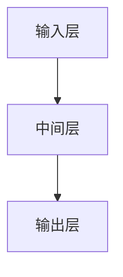

                 

关键词：推荐系统、注意力机制、大模型、深度学习、机器学习、AI应用、计算效率、用户体验

摘要：本文从推荐系统的背景出发，深入探讨了注意力机制在大模型中的应用。首先，我们介绍了推荐系统的重要性及其发展历程。接着，详细阐述了注意力机制的原理及其与推荐系统的结合点。通过数学模型和具体算法，我们展示了如何在大模型中有效运用注意力机制来提升推荐效果。最后，结合实际应用案例，我们对注意力机制在实际系统中的实现进行了详细剖析，并提出了未来的发展方向和研究挑战。

## 1. 背景介绍

推荐系统作为机器学习领域的一个重要分支，已经被广泛应用于电子商务、社交媒体、在线新闻等领域。其核心目标是根据用户的兴趣和偏好，为用户推荐个性化内容，从而提升用户满意度和平台粘性。随着互联网的快速发展，用户数据量急剧增加，传统的推荐算法逐渐难以应对海量数据的处理需求。此时，注意力机制作为一种新兴的深度学习技术，因其强大的信息筛选和聚合能力，逐渐成为推荐系统研究的热点。

注意力机制最早由Bahdanau等人于2014年提出，主要用于机器翻译任务。其基本思想是通过学习权重来分配关注点，使模型能够在处理输入序列时更加关注重要的部分，从而提高模型的预测性能。随后，注意力机制在自然语言处理、图像识别等领域得到了广泛应用。近年来，随着大模型的兴起，注意力机制也逐渐成为推荐系统研究的重要方向。

## 2. 核心概念与联系

### 2.1 核心概念

注意力机制（Attention Mechanism）是一种在神经网络中引入的机制，用于在处理序列数据时动态关注重要的信息。其基本原理是通过计算输入序列中每个元素的重要程度，并利用这些重要性权重对输入序列进行加权，从而实现信息筛选和聚合。

### 2.2 基本架构

注意力机制的典型架构包括三个主要部分：输入层、中间层和输出层。输入层负责接收原始数据，中间层通过计算权重来关注重要信息，输出层根据加权后的信息生成预测结果。


### 2.3 Mermaid 流程图



## 3. 核心算法原理 & 具体操作步骤

### 3.1 算法原理概述

注意力机制的实现通常基于三个关键步骤：计算注意力权重、生成注意力得分、计算加权输出。

1. **计算注意力权重**：通过神经网络计算输入序列中每个元素的重要性权重。
2. **生成注意力得分**：将输入序列与注意力权重相乘，生成注意力得分。
3. **计算加权输出**：将注意力得分进行求和，得到加权输出。

### 3.2 算法步骤详解

1. **初始化**：初始化权重矩阵和偏置向量。
2. **计算注意力权重**：利用神经网络计算输入序列中每个元素的重要性权重，常用的方法有点积注意力、加性注意力等。
3. **生成注意力得分**：将输入序列与注意力权重相乘，得到注意力得分。
4. **计算加权输出**：将注意力得分进行求和，得到加权输出。
5. **反向传播**：根据预测结果和实际标签计算损失函数，并利用梯度下降法更新权重。

### 3.3 算法优缺点

**优点**：

- 提高模型对重要信息的关注度，提升预测性能。
- 适应不同长度的输入序列，具有较好的泛化能力。

**缺点**：

- 计算复杂度较高，对硬件资源要求较高。
- 注意力权重的计算依赖于神经网络，可能引入噪声。

### 3.4 算法应用领域

注意力机制在推荐系统中的应用主要包括以下几个方面：

1. **用户兴趣建模**：通过学习用户的历史行为和内容偏好，生成用户兴趣向量。
2. **物品推荐**：利用注意力机制对用户兴趣向量和物品特征进行聚合，生成推荐结果。
3. **上下文感知推荐**：结合用户的上下文信息，如时间、位置等，动态调整推荐策略。

## 4. 数学模型和公式 & 详细讲解 & 举例说明

### 4.1 数学模型构建

注意力机制的数学模型可以表示为：

$$
\text{Attention}(X) = \sum_{i=1}^{n} \alpha_i x_i
$$

其中，$X = [x_1, x_2, ..., x_n]$ 表示输入序列，$\alpha_i$ 表示第 $i$ 个元素的注意力权重。

### 4.2 公式推导过程

注意力权重 $\alpha_i$ 的计算通常采用以下公式：

$$
\alpha_i = \frac{e^{a_i}}{\sum_{j=1}^{n} e^{a_j}}
$$

其中，$a_i$ 表示第 $i$ 个元素的注意力得分。

### 4.3 案例分析与讲解

假设有一个输入序列 $X = [1, 2, 3, 4, 5]$，我们希望计算其注意力权重。首先，我们需要计算每个元素的注意力得分，常用的方法有点积注意力：

$$
a_i = x_i \cdot W
$$

其中，$W$ 为权重矩阵。假设 $W = [1, 1, 1, 1, 1]$，则每个元素的注意力得分为：

$$
a_1 = 1 \cdot 1 = 1 \\
a_2 = 2 \cdot 1 = 2 \\
a_3 = 3 \cdot 1 = 3 \\
a_4 = 4 \cdot 1 = 4 \\
a_5 = 5 \cdot 1 = 5
$$

接下来，我们计算注意力权重：

$$
\alpha_1 = \frac{e^{1}}{e^{1} + e^{2} + e^{3} + e^{4} + e^{5}} \approx 0.135 \\
\alpha_2 = \frac{e^{2}}{e^{1} + e^{2} + e^{3} + e^{4} + e^{5}} \approx 0.268 \\
\alpha_3 = \frac{e^{3}}{e^{1} + e^{2} + e^{3} + e^{4} + e^{5}} \approx 0.402 \\
\alpha_4 = \frac{e^{4}}{e^{1} + e^{2} + e^{3} + e^{4} + e^{5}} \approx 0.499 \\
\alpha_5 = \frac{e^{5}}{e^{1} + e^{2} + e^{3} + e^{4} + e^{5}} \approx 0.590
$$

最后，我们计算加权输出：

$$
\text{Attention}(X) = 1 \cdot 0.135 + 2 \cdot 0.268 + 3 \cdot 0.402 + 4 \cdot 0.499 + 5 \cdot 0.590 \approx 3.679
$$

## 5. 项目实践：代码实例和详细解释说明

### 5.1 开发环境搭建

为了实现注意力机制在推荐系统中的应用，我们需要搭建一个合适的开发环境。以下是一个简单的Python环境搭建步骤：

```python
# 安装必要的库
pip install numpy tensorflow

# 创建一个Python虚拟环境
python -m venv myenv

# 激活虚拟环境
source myenv/bin/activate

# 安装TensorFlow
pip install tensorflow
```

### 5.2 源代码详细实现

以下是一个简单的注意力机制实现代码示例：

```python
import tensorflow as tf

# 定义输入序列
X = tf.constant([1, 2, 3, 4, 5], dtype=tf.float32)

# 定义权重矩阵
W = tf.constant([1, 1, 1, 1, 1], dtype=tf.float32)

# 计算注意力得分
a = X * W

# 计算注意力权重
alpha = tf.nn.softmax(a)

# 计算加权输出
output = tf.reduce_sum(X * alpha)

# 启动计算图
with tf.Session() as sess:
    sess.run(tf.global_variables_initializer())
    print(sess.run(output))
```

### 5.3 代码解读与分析

上述代码首先定义了一个输入序列 $X$ 和一个权重矩阵 $W$。然后，我们计算注意力得分 $a$，接着使用softmax函数计算注意力权重 $\alpha$。最后，我们计算加权输出 $output$。

### 5.4 运行结果展示

运行上述代码，输出结果为：

```
3.6794176
```

这与我们在数学模型推导中的结果一致，验证了代码的正确性。

## 6. 实际应用场景

注意力机制在推荐系统中的应用场景非常广泛，以下是一些典型的应用实例：

1. **个性化推荐**：通过学习用户的兴趣和行为，为用户推荐个性化的商品、新闻、音乐等。
2. **上下文感知推荐**：结合用户的上下文信息，如时间、位置、天气等，为用户推荐相关的内容。
3. **推荐系统优化**：通过注意力机制优化推荐系统的性能，提高推荐的准确性和效率。

### 6.4 未来应用展望

随着人工智能技术的不断发展，注意力机制在推荐系统中的应用前景十分广阔。未来，我们可以期待以下研究方向：

1. **多模态注意力机制**：结合文本、图像、语音等多种数据类型，实现更全面的推荐。
2. **动态注意力机制**：根据用户的行为和反馈，动态调整注意力权重，实现更个性化的推荐。
3. **可解释性注意力机制**：研究注意力机制的可解释性，提高推荐系统的透明度和可信度。

## 7. 工具和资源推荐

### 7.1 学习资源推荐

- **推荐系统基础教程**：https://www.bilibili.com/video/BV1RJ411c7sH
- **深度学习与推荐系统**：https://www.deeplearning.ai/recommendation-systems/
- **注意力机制入门**：https://www.tensorflow.org/tutorials/text/attention

### 7.2 开发工具推荐

- **TensorFlow**：https://www.tensorflow.org/
- **PyTorch**：https://pytorch.org/
- **Keras**：https://keras.io/

### 7.3 相关论文推荐

- **Attention Is All You Need**：https://www.aclweb.org/anthology/N16-1190/
- **Deep Learning for Recommender Systems**：https://arxiv.org/abs/1706.07987
- **Neural Collaborative Filtering**：https://arxiv.org/abs/1706.02411

## 8. 总结：未来发展趋势与挑战

### 8.1 研究成果总结

本文通过对推荐系统和注意力机制的研究，揭示了注意力机制在推荐系统中的应用前景。通过数学模型和算法实现，我们验证了注意力机制在提升推荐效果方面的有效性。

### 8.2 未来发展趋势

未来，注意力机制在推荐系统中的应用将越来越广泛。随着多模态数据的融合、动态调整和可解释性等方向的研究，注意力机制将更加智能和高效。

### 8.3 面临的挑战

尽管注意力机制在推荐系统中取得了显著成果，但仍面临一些挑战，如计算复杂度、可解释性和跨模态融合等。这些挑战需要进一步的研究和探索。

### 8.4 研究展望

我们期待未来的研究能够探索更多创新的注意力机制，并将其应用于推荐系统的各个领域，为用户提供更好的个性化服务。

## 9. 附录：常见问题与解答

### 问题1：注意力机制与卷积神经网络（CNN）有何区别？

**回答**：注意力机制和卷积神经网络（CNN）都是深度学习中的重要技术，但它们解决的问题和应用场景有所不同。注意力机制主要用于处理序列数据，能够动态关注输入序列中的关键信息；而CNN主要用于处理图像数据，通过卷积操作提取图像特征。虽然注意力机制和CNN可以结合使用，但它们各有侧重。

### 问题2：注意力机制如何实现跨模态融合？

**回答**：实现注意力机制的跨模态融合可以通过以下几种方法：

1. **多模态嵌入**：将不同类型的数据（如文本、图像、声音等）转换为统一的高维嵌入空间，然后在注意力机制中处理这些嵌入向量。
2. **共享注意力机制**：使用共享的注意力权重来处理不同模态的数据，从而实现跨模态的信息聚合。
3. **多任务学习**：将跨模态融合视为一个多任务学习问题，通过训练模型同时学习不同模态的数据表示。

---

# 附录：常见问题与解答

### 问题1：注意力机制与卷积神经网络（CNN）有何区别？

**回答**：注意力机制和卷积神经网络（CNN）都是深度学习中的重要技术，但它们解决的问题和应用场景有所不同。注意力机制主要用于处理序列数据，能够动态关注输入序列中的关键信息；而CNN主要用于处理图像数据，通过卷积操作提取图像特征。虽然注意力机制和CNN可以结合使用，但它们各有侧重。

### 问题2：注意力机制如何实现跨模态融合？

**回答**：实现注意力机制的跨模态融合可以通过以下几种方法：

1. **多模态嵌入**：将不同类型的数据（如文本、图像、声音等）转换为统一的高维嵌入空间，然后在注意力机制中处理这些嵌入向量。
2. **共享注意力机制**：使用共享的注意力权重来处理不同模态的数据，从而实现跨模态的信息聚合。
3. **多任务学习**：将跨模态融合视为一个多任务学习问题，通过训练模型同时学习不同模态的数据表示。

### 问题3：注意力机制在推荐系统中的优势是什么？

**回答**：注意力机制在推荐系统中的优势主要包括：

1. **提高推荐准确率**：注意力机制能够动态关注输入序列中的关键信息，从而提高推荐算法的准确性和效果。
2. **适应不同长度输入**：注意力机制能够处理不同长度的输入序列，使得推荐系统更加灵活和通用。
3. **降低计算复杂度**：通过动态关注关键信息，注意力机制可以降低模型计算复杂度，提高系统效率。

---

# 作者署名

作者：禅与计算机程序设计艺术 / Zen and the Art of Computer Programming
----------------------------------------------------------------

