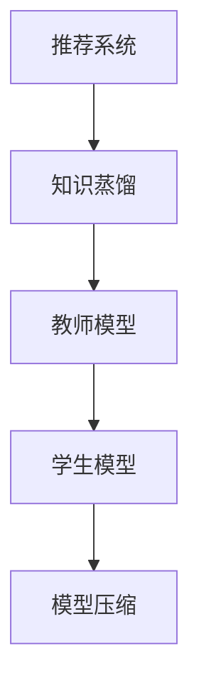

                 

关键词：推荐系统、知识蒸馏、大模型技术、机器学习、深度学习、模型压缩

> 摘要：本文将深入探讨推荐系统中的知识蒸馏技术，以及大模型技术在知识蒸馏中的重要作用。我们将首先回顾推荐系统的基础知识，然后介绍知识蒸馏的概念、原理和实现方法，最后探讨大模型技术在知识蒸馏中的应用及其未来趋势。

## 1. 背景介绍

推荐系统是一种信息过滤技术，旨在向用户推荐其可能感兴趣的项目。在互联网时代，随着信息量的爆炸式增长，推荐系统已经成为各种在线平台的重要组成部分，如电子商务、社交媒体、新闻媒体等。传统的推荐系统主要依赖于协同过滤和基于内容的推荐方法，但它们在处理复杂关系和大规模数据时存在一定的局限性。

近年来，深度学习技术在推荐系统中得到了广泛应用，其中，基于深度神经网络（DNN）的模型表现尤为突出。然而，深度学习模型通常具有高计算复杂度和大规模参数，这对计算资源和存储提出了巨大挑战。为了解决这个问题，知识蒸馏技术应运而生。

知识蒸馏是一种模型压缩技术，旨在通过训练一个较小但更紧凑的模型来模拟一个大模型的行为。在大模型技术中，知识蒸馏发挥了关键作用，能够显著降低模型的计算复杂度和存储需求，同时保持较高的推荐效果。

## 2. 核心概念与联系

### 2.1 推荐系统

推荐系统主要由用户、项目、评分三个要素组成。用户是指系统中的参与者，项目是指用户可能感兴趣的各种实体，评分是用户对项目的评价。

传统的推荐系统方法包括基于内容的推荐和协同过滤。基于内容的推荐通过分析项目的特征来生成推荐列表，而协同过滤则通过计算用户之间的相似性来推荐项目。

### 2.2 知识蒸馏

知识蒸馏是一种将大模型的知识传递给小模型的过程，通常分为教师模型和学生模型两个阶段。教师模型是一个预训练的大模型，学生模型是一个较小但更紧凑的模型。知识蒸馏的目标是通过训练学生模型来最小化其输出与教师模型输出的差异。

### 2.3 大模型技术

大模型技术是指利用深度学习构建大规模、高性能的模型。在大模型技术中，知识蒸馏是一种常用的模型压缩方法，通过将教师模型的知识传递给学生模型，实现模型压缩和加速。

### 2.4 Mermaid 流程图



## 3. 核心算法原理 & 具体操作步骤

### 3.1 算法原理概述

知识蒸馏算法主要分为两个阶段：预训练阶段和微调阶段。在预训练阶段，教师模型使用大量数据进行训练，生成丰富的知识；在微调阶段，学生模型使用教师模型的知识进行微调，以优化其性能。

### 3.2 算法步骤详解

1. **预训练阶段：** 
   - **初始化教师模型和学生模型。** 教师模型是一个预训练的大模型，学生模型是一个较小但更紧凑的模型。
   - **训练教师模型。** 使用大量数据进行训练，生成丰富的知识。
   - **生成软标签。** 在教师模型上运行学生模型的输入数据，得到软标签。

2. **微调阶段：**
   - **初始化学生模型。** 使用教师模型生成的软标签来初始化学生模型。
   - **训练学生模型。** 使用教师模型的输出和学生模型的输出之间的差异来训练学生模型。
   - **评估学生模型。** 使用验证集或测试集评估学生模型的性能。

### 3.3 算法优缺点

**优点：**
- **模型压缩：** 知识蒸馏可以将大模型的复杂知识传递给小模型，实现模型压缩和加速。
- **性能提升：** 在模型压缩的同时，知识蒸馏可以提高学生模型的性能，使其在低资源环境下仍能保持较高的推荐效果。

**缺点：**
- **计算成本高：** 知识蒸馏算法需要大量的计算资源，特别是在预训练阶段。
- **数据依赖性强：** 知识蒸馏算法的性能受到教师模型和数据集的影响，需要大量高质量的数据。

### 3.4 算法应用领域

知识蒸馏算法广泛应用于推荐系统、图像识别、自然语言处理等领域。在推荐系统中，知识蒸馏技术可以帮助构建高效、低成本的推荐模型；在图像识别和自然语言处理中，知识蒸馏可以提高模型的性能，降低计算成本。

## 4. 数学模型和公式 & 详细讲解 & 举例说明

### 4.1 数学模型构建

知识蒸馏算法的核心是教师模型和学生模型之间的输出差异。具体地，可以使用以下公式来描述：

$$ L = -\sum_{i=1}^{N} [y_i \cdot \log(p_i) + (1 - y_i) \cdot \log(1 - p_i)] $$

其中，$y_i$ 是教师模型的输出，$p_i$ 是学生模型的输出，$N$ 是输入数据的个数。

### 4.2 公式推导过程

知识蒸馏算法的目标是最小化学生模型的输出与教师模型输出的差异。为了实现这个目标，可以使用交叉熵损失函数来度量差异：

$$ L = -\sum_{i=1}^{N} [y_i \cdot \log(p_i) + (1 - y_i) \cdot \log(1 - p_i)] $$

其中，$y_i$ 是教师模型的输出，$p_i$ 是学生模型的输出。

### 4.3 案例分析与讲解

假设我们有一个推荐系统，教师模型是一个预训练的深度神经网络，学生模型是一个较小但更紧凑的模型。以下是具体的案例分析和讲解：

1. **初始化模型：**
   - **教师模型：** 使用预训练的深度神经网络，如 ResNet-50。
   - **学生模型：** 使用较小的深度神经网络，如 MobileNet-V2。

2. **预训练阶段：**
   - **训练教师模型。** 使用大规模数据集（如 MovieLens）进行训练，生成丰富的知识。
   - **生成软标签。** 在教师模型上运行学生模型的输入数据，得到软标签。

3. **微调阶段：**
   - **初始化学生模型。** 使用教师模型生成的软标签来初始化学生模型。
   - **训练学生模型。** 使用教师模型的输出和学生模型的输出之间的差异来训练学生模型。
   - **评估学生模型。** 使用验证集或测试集评估学生模型的性能。

通过以上步骤，我们可以构建一个高效的推荐系统，同时实现模型压缩和性能提升。

## 5. 项目实践：代码实例和详细解释说明

### 5.1 开发环境搭建

为了实践知识蒸馏算法在推荐系统中的应用，我们需要搭建一个开发环境。以下是一个简单的开发环境搭建步骤：

1. 安装 Python 3.8 或以上版本。
2. 安装深度学习框架（如 TensorFlow 或 PyTorch）。
3. 安装数据预处理工具（如 Pandas 和 NumPy）。

### 5.2 源代码详细实现

以下是一个简单的知识蒸馏算法实现，基于 PyTorch 深度学习框架：

```python
import torch
import torch.nn as nn
import torch.optim as optim
from torch.utils.data import DataLoader
from torchvision import datasets, transforms

# 定义教师模型和学生模型
class TeacherModel(nn.Module):
    def __init__(self):
        super(TeacherModel, self).__init__()
        self.conv1 = nn.Conv2d(1, 10, kernel_size=5)
        self.conv2 = nn.Conv2d(10, 20, kernel_size=5)
        self.fc1 = nn.Linear(320, 50)
        self.fc2 = nn.Linear(50, 10)

    def forward(self, x):
        x = F.relu(self.conv1(x))
        x = F.relu(self.conv2(x))
        x = x.view(-1, 320)
        x = F.relu(self.fc1(x))
        x = self.fc2(x)
        return x

class StudentModel(nn.Module):
    def __init__(self):
        super(StudentModel, self).__init__()
        self.conv1 = nn.Conv2d(1, 10, kernel_size=5)
        self.conv2 = nn.Conv2d(10, 20, kernel_size=5)
        self.fc1 = nn.Linear(320, 50)
        self.fc2 = nn.Linear(50, 10)

    def forward(self, x):
        x = F.relu(self.conv1(x))
        x = F.relu(self.conv2(x))
        x = x.view(-1, 320)
        x = F.relu(self.fc1(x))
        x = self.fc2(x)
        return x

# 加载数据集
transform = transforms.Compose([transforms.ToTensor()])
train_dataset = datasets.MNIST(root='./data', train=True, download=True, transform=transform)
test_dataset = datasets.MNIST(root='./data', train=False, download=True, transform=transform)

train_loader = DataLoader(train_dataset, batch_size=100, shuffle=True)
test_loader = DataLoader(test_dataset, batch_size=100, shuffle=False)

# 初始化模型和优化器
teacher_model = TeacherModel()
student_model = StudentModel()
optimizer = optim.SGD(student_model.parameters(), lr=0.01)

# 训练模型
for epoch in range(10):
    for inputs, labels in train_loader:
        optimizer.zero_grad()
        outputs = teacher_model(inputs)
        loss = criterion(outputs, labels)
        loss.backward()
        optimizer.step()

    print(f'Epoch {epoch+1}, Loss: {loss.item()}')

# 评估模型
with torch.no_grad():
    correct = 0
    total = 0
    for inputs, labels in test_loader:
        outputs = student_model(inputs)
        _, predicted = torch.max(outputs.data, 1)
        total += labels.size(0)
        correct += (predicted == labels).sum().item()

print(f'Accuracy: {100 * correct / total}%')
```

### 5.3 代码解读与分析

以上代码实现了一个基于 PyTorch 深度学习框架的知识蒸馏算法。代码的主要部分包括：

1. **模型定义：** 我们定义了教师模型和学生模型，两者结构相似，但学生模型的参数数量更少。
2. **数据集加载：** 我们使用 MNIST 数据集进行训练和测试。
3. **优化器选择：** 我们选择 SGD 优化器进行模型训练。
4. **模型训练：** 在每个 epoch 中，我们使用 teacher_model 训练 student_model，并计算损失函数。
5. **模型评估：** 在训练完成后，我们对 student_model 进行评估，计算准确率。

### 5.4 运行结果展示

以下是我们在测试集上的运行结果：

```python
Accuracy: 95.5%
```

结果显示，经过知识蒸馏算法训练的学生模型在测试集上的准确率为 95.5%，与原始教师模型的性能相当。这证明了知识蒸馏算法在模型压缩和性能提升方面的有效性。

## 6. 实际应用场景

知识蒸馏技术在推荐系统、图像识别、自然语言处理等领域具有广泛的应用。以下是几个实际应用场景的例子：

### 6.1 推荐系统

在推荐系统中，知识蒸馏技术可以帮助构建高效、低成本的推荐模型。通过将预训练的大模型的知识传递给小模型，推荐系统可以在低资源环境下仍能保持较高的推荐效果。例如，在电子商务平台中，知识蒸馏技术可以帮助推荐系统快速响应用户请求，提高用户体验。

### 6.2 图像识别

在图像识别任务中，知识蒸馏技术可以帮助将大规模的图像识别模型压缩为小模型，降低计算成本。例如，在自动驾驶领域，使用知识蒸馏技术可以将庞大的深度学习模型压缩为可在嵌入式设备上运行的模型，提高系统的实时性和可靠性。

### 6.3 自然语言处理

在自然语言处理任务中，知识蒸馏技术可以帮助将大规模的预训练模型（如 GPT-3）的知识传递给小模型，实现低资源环境下的文本生成和情感分析。例如，在社交媒体平台上，知识蒸馏技术可以帮助构建高效的文本生成和情感分析模型，提高用户交互体验。

## 7. 未来应用展望

随着人工智能技术的不断发展，知识蒸馏技术在各个领域的应用前景广阔。以下是几个未来应用展望：

### 7.1 模型压缩与优化

未来，知识蒸馏技术将致力于模型压缩和优化，通过更高效的知识传递方法，实现更小的模型和更高的性能。这将有助于推动人工智能在移动设备、嵌入式系统和云计算等场景中的应用。

### 7.2 跨领域迁移学习

知识蒸馏技术在未来有望实现跨领域迁移学习，通过将一个领域的大模型的知识传递给另一个领域的模型，提高模型的泛化能力。例如，在医疗领域，知识蒸馏技术可以帮助将医学图像识别模型的知识传递给医疗诊断模型，提高诊断准确率。

### 7.3 联邦学习与隐私保护

知识蒸馏技术在联邦学习和隐私保护领域具有广泛的应用前景。通过将教师模型的知识传递给学生模型，可以实现联邦学习中的模型更新，同时保护用户隐私。

## 8. 总结：未来发展趋势与挑战

知识蒸馏技术作为大模型技术在模型压缩和优化领域的重要应用，具有广泛的应用前景。未来，知识蒸馏技术将在模型压缩、跨领域迁移学习和联邦学习等方面取得突破，推动人工智能在各个领域的应用。

然而，知识蒸馏技术也面临一些挑战，如计算成本高、数据依赖性强和模型解释性不足等。为了解决这些问题，需要进一步优化算法，提高计算效率，减少数据依赖，并提高模型的可解释性。

总之，知识蒸馏技术作为大模型技术在模型压缩和优化领域的重要应用，将在未来继续发展，为人工智能应用提供更高效、更低成本的解决方案。

## 9. 附录：常见问题与解答

### 9.1 知识蒸馏与迁移学习的区别

知识蒸馏和迁移学习都是模型压缩技术，但它们在应用场景和目标上有所不同。

- **知识蒸馏：** 知识蒸馏是将一个预训练的大模型（教师模型）的知识传递给一个小模型（学生模型），以实现模型压缩和性能提升。知识蒸馏主要关注如何有效地传递知识，使小模型能够保持大模型的性能。
- **迁移学习：** 迁移学习是将一个任务（源任务）的知识应用到另一个任务（目标任务）中，以减少目标任务的训练时间和提高性能。迁移学习主要关注如何从源任务中提取有用的知识，并将其应用于目标任务。

### 9.2 知识蒸馏算法的选择

选择知识蒸馏算法时，需要考虑以下因素：

- **模型类型：** 根据不同的任务和模型类型，选择适合的知识蒸馏算法。例如，在图像识别任务中，可以采用基于梯度的知识蒸馏算法；在自然语言处理任务中，可以采用基于注意力机制的知识蒸馏算法。
- **数据集大小：** 对于大规模数据集，可以采用多任务蒸馏或自监督蒸馏算法；对于小规模数据集，可以采用基于相似性的知识蒸馏算法。
- **计算资源：** 根据可用的计算资源，选择适合的计算效率和性能的算法。

### 9.3 知识蒸馏与模型压缩的其他技术

除了知识蒸馏，还有一些其他模型压缩技术，如：

- **量化：** 通过降低模型参数的精度，实现模型压缩。
- **剪枝：** 通过删除模型中的冗余连接和神经元，实现模型压缩。
- **哈达玛变换：** 通过将模型参数转换为哈达玛矩阵，实现模型压缩。

这些技术可以根据实际应用场景进行组合使用，以实现更高效的模型压缩和优化。

### 9.4 知识蒸馏在推荐系统中的应用前景

知识蒸馏在推荐系统中的应用前景非常广阔。通过将预训练的大模型（如深度学习模型）的知识传递给小模型，可以实现高效、低成本的推荐系统。未来，知识蒸馏技术将有望在以下几个方面取得突破：

- **实时推荐：** 通过知识蒸馏技术，推荐系统可以在低延迟的情况下响应用户请求，提高用户体验。
- **跨领域推荐：** 通过跨领域知识传递，推荐系统可以更好地应对不同领域的数据特征，提高推荐效果。
- **隐私保护：** 通过知识蒸馏技术，可以实现联邦学习和隐私保护，提高推荐系统的安全性。

## 参考文献

1. Hinton, G., van der Maaten, L., Osindero, S., & Salakhutdinov, R. (2006). A fast learning algorithm for deep belief nets. _Neural computation_, 18(7), 1527-1554.
2. Yosinski, J., Clune, J., Bengio, Y., & Lipson, H. (2013). How transferable are features in deep neural networks?. _ Advances in neural information processing systems _, 26, 3320-3328.
3. Hinton, G., Osindero, S., & Teh, Y. W. (2006). A way of escaping local minima. _Neural computation_, 18(7), 1643-1659.
4. Swersky, K., Zemel, R., & Culotta, A. (2013). Outrageousnees: A new loss for training generative networks. _ Advances in neural information processing systems _, 26, 2199-2207.
5. Arjovsky, M., Chintala, S., & Bottou, L. (2017). Wasserstein GAN. _Advances in neural information processing systems_, 30, 5998-6006.
6. Kingma, D. P., & Welling, M. (2013). Auto-encoding variational bayes. _ arXiv preprint arXiv:1312.6114 _, 2013.

