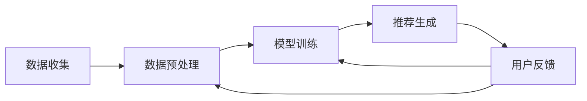

                 

关键词：推荐系统，电子商务，个性化购物，协同过滤，机器学习，深度学习，用户行为分析，算法优化，案例研究

> 摘要：本文深入探讨了推荐系统在电子商务领域的应用，重点关注个性化购物体验的实现方法。通过分析协同过滤、机器学习和深度学习等技术，结合实际案例，探讨了推荐系统在提高用户满意度、促进销售转化和提升商业价值方面的作用。本文旨在为电商从业者和研究者提供一套系统的理论框架和实践指导。

## 1. 背景介绍

电子商务的快速发展使得在线购物成为人们日常生活中不可或缺的一部分。随着市场竞争的加剧，如何提高用户体验、增加用户粘性、促进销售转化成为电子商务企业面临的重要问题。推荐系统作为一种智能化的解决方案，在电子商务中扮演着越来越重要的角色。通过分析用户行为和偏好，推荐系统能够为用户推荐个性化的商品，从而提高用户的购物体验和满意度。

推荐系统在电子商务中的应用主要体现在以下几个方面：

1. **个性化推荐**：根据用户的历史行为和偏好，为用户推荐相关的商品，提高用户的购买意愿。
2. **销售转化提升**：通过推荐系统，电商企业可以更加精准地触达潜在客户，提高销售转化率。
3. **用户留存**：通过个性化推荐，增强用户对电商平台的依赖，提高用户留存率。
4. **商业价值提升**：推荐系统可以帮助电商企业挖掘潜在的市场机会，提升整体商业价值。

本文将从以下几个方面展开讨论：

1. 推荐系统的核心概念与联系。
2. 推荐系统的核心算法原理与具体操作步骤。
3. 推荐系统的数学模型和公式。
4. 推荐系统的项目实践：代码实例和详细解释说明。
5. 推荐系统在实际应用场景中的表现。
6. 推荐系统的工具和资源推荐。
7. 推荐系统的未来发展趋势与挑战。

## 2. 核心概念与联系

### 2.1 推荐系统的基本概念

推荐系统是一种基于数据挖掘和机器学习技术的智能信息过滤方法，其目的是根据用户的兴趣和偏好，为用户推荐相关的商品、信息或服务。推荐系统通常包括以下几个基本概念：

- **用户**：使用电子商务平台进行购物的个人。
- **项目**：电子商务平台上的商品或服务。
- **评分**：用户对项目的评价，通常为数值或标签。
- **用户-项目矩阵**：表示用户与项目之间评分关系的矩阵。
- **推荐列表**：根据用户的兴趣和偏好生成的推荐项目列表。

### 2.2 推荐系统的架构

推荐系统通常包括数据收集、数据预处理、模型训练和推荐生成等几个主要模块。其架构可以概括为：

1. **数据收集**：从电子商务平台获取用户行为数据，如浏览记录、购买历史、评价等。
2. **数据预处理**：对原始数据进行清洗、去噪、归一化等处理，以便于模型训练。
3. **模型训练**：使用机器学习算法训练推荐模型，如协同过滤、基于内容的推荐等。
4. **推荐生成**：根据用户的历史行为和偏好，生成个性化的推荐列表。

### 2.3 Mermaid 流程图

以下是推荐系统的 Mermaid 流程图，展示了各个模块之间的联系和数据处理流程。



## 3. 核心算法原理与具体操作步骤

### 3.1 算法原理概述

推荐系统的核心算法主要包括协同过滤、基于内容的推荐和深度学习推荐等。这些算法各有优缺点，适用于不同的应用场景。

- **协同过滤**：基于用户的历史行为和偏好，通过计算用户之间的相似度，为用户推荐相似用户喜欢的项目。协同过滤算法包括基于用户的协同过滤和基于项目的协同过滤。
- **基于内容的推荐**：根据项目的特征和属性，为用户推荐与其历史偏好相似的项目。基于内容的推荐算法通常使用 TF-IDF、词袋模型等文本挖掘技术。
- **深度学习推荐**：使用深度神经网络，如卷积神经网络（CNN）、循环神经网络（RNN）等，对用户行为和项目特征进行建模，实现个性化的推荐。

### 3.2 算法步骤详解

#### 3.2.1 协同过滤

协同过滤算法的基本步骤如下：

1. **用户相似度计算**：计算用户之间的相似度，通常使用余弦相似度、皮尔逊相关系数等度量方法。
2. **推荐列表生成**：根据用户相似度，为用户推荐与其相似的用户喜欢的项目。
3. **推荐列表优化**：根据用户反馈，不断优化推荐列表，提高推荐质量。

#### 3.2.2 基于内容的推荐

基于内容的推荐算法的基本步骤如下：

1. **项目特征提取**：提取项目的特征，如文本、图像、标签等。
2. **用户偏好建模**：根据用户的历史行为，构建用户偏好模型。
3. **推荐列表生成**：计算项目特征与用户偏好之间的相似度，为用户推荐相似的项目。

#### 3.2.3 深度学习推荐

深度学习推荐算法的基本步骤如下：

1. **数据预处理**：对用户行为数据进行预处理，如数据归一化、缺失值填充等。
2. **模型训练**：使用深度学习算法，如 CNN、RNN 等，训练推荐模型。
3. **推荐列表生成**：根据用户行为数据和项目特征，生成个性化的推荐列表。

### 3.3 算法优缺点

#### 协同过滤

- **优点**：简单高效，适用于大规模数据集；能够发现用户的相似偏好。
- **缺点**：容易受到冷启动问题的影响；推荐结果过于依赖历史行为，可能导致用户兴趣变化时推荐质量下降。

#### 基于内容的推荐

- **优点**：适用于新用户和新项目推荐；推荐结果较为准确。
- **缺点**：需要大量高质量的特征；计算复杂度高，难以处理大规模数据。

#### 深度学习推荐

- **优点**：能够自动提取特征，降低人工干预；适用于复杂非线性关系。
- **缺点**：模型训练时间较长；对数据质量要求较高。

### 3.4 算法应用领域

协同过滤、基于内容的推荐和深度学习推荐算法在电子商务、新闻推荐、音乐推荐等多个领域都有广泛应用。在实际应用中，可以根据具体需求和数据特点选择合适的算法。

## 4. 数学模型和公式

推荐系统的数学模型和公式是实现个性化推荐的核心。以下是几个常用的数学模型和公式。

### 4.1 数学模型构建

#### 4.1.1 协同过滤

协同过滤算法的核心是用户相似度计算和推荐列表生成。用户相似度可以通过以下公式计算：

$$
sim(u_i, u_j) = \frac{\sum_{k=1}^{n}r_{ik}r_{jk}}{\sqrt{\sum_{k=1}^{n}r_{ik}^2\sum_{k=1}^{n}r_{jk}^2}}
$$

其中，$r_{ik}$ 表示用户 $u_i$ 对项目 $k$ 的评分，$sim(u_i, u_j)$ 表示用户 $u_i$ 和 $u_j$ 之间的相似度。

推荐列表生成可以使用以下公式：

$$
r_{ik}^{pred} = \sum_{j=1}^{m}sim(u_i, u_j)r_{jk}
$$

其中，$r_{ik}^{pred}$ 表示用户 $u_i$ 对项目 $k$ 的预测评分。

#### 4.1.2 基于内容的推荐

基于内容的推荐算法通常使用相似度计算公式，如余弦相似度：

$$
sim(p_i, p_j) = \frac{p_i \cdot p_j}{\|p_i\|\|p_j\|}
$$

其中，$p_i$ 和 $p_j$ 分别表示项目 $i$ 和 $j$ 的特征向量，$\|p_i\|$ 和 $\|p_j\|$ 分别表示特征向量的模。

推荐列表生成可以使用以下公式：

$$
r_{ik}^{pred} = \sum_{j=1}^{m}sim(p_i, p_j)r_j
$$

其中，$r_j$ 表示项目 $j$ 的评分。

#### 4.1.3 深度学习推荐

深度学习推荐算法通常使用神经网络模型，如卷积神经网络（CNN）和循环神经网络（RNN）。以下是 CNN 和 RNN 的基本公式：

#### CNN

$$
h_l = \sigma(W_l \cdot a_{l-1} + b_l)
$$

其中，$h_l$ 表示第 $l$ 层的激活值，$a_{l-1}$ 表示第 $l-1$ 层的输入值，$W_l$ 和 $b_l$ 分别表示第 $l$ 层的权重和偏置，$\sigma$ 表示激活函数。

#### RNN

$$
h_t = \sigma(W_h h_{t-1} + U_x x_t + b_h)
$$

其中，$h_t$ 表示第 $t$ 步的隐藏状态，$x_t$ 表示第 $t$ 步的输入，$W_h$ 和 $U_x$ 分别表示隐藏状态和输入的权重，$b_h$ 表示隐藏状态的偏置，$\sigma$ 表示激活函数。

### 4.2 公式推导过程

以下是协同过滤、基于内容的推荐和深度学习推荐算法的公式推导过程。

#### 4.2.1 协同过滤

用户相似度计算公式可以通过以下推导得到：

$$
sim(u_i, u_j) = \frac{\sum_{k=1}^{n}r_{ik}r_{jk}}{\sqrt{\sum_{k=1}^{n}r_{ik}^2\sum_{k=1}^{n}r_{jk}^2}}
$$

设 $r_{ik}$ 和 $r_{jk}$ 分别表示用户 $u_i$ 和 $u_j$ 对项目 $k$ 的评分，则用户 $u_i$ 和 $u_j$ 之间的相似度可以表示为：

$$
sim(u_i, u_j) = \frac{\sum_{k=1}^{n}r_{ik}r_{jk}}{\sqrt{\sum_{k=1}^{n}r_{ik}^2\sum_{k=1}^{n}r_{jk}^2}}
$$

其中，分母表示用户 $u_i$ 和 $u_j$ 对所有项目的评分平方和的平方根，分子表示用户 $u_i$ 和 $u_j$ 对所有共同项目的评分乘积之和。

#### 4.2.2 基于内容的推荐

基于内容的推荐算法的相似度计算公式可以通过以下推导得到：

$$
sim(p_i, p_j) = \frac{p_i \cdot p_j}{\|p_i\|\|p_j\|}
$$

设 $p_i$ 和 $p_j$ 分别表示项目 $i$ 和 $j$ 的特征向量，则项目 $i$ 和 $j$ 之间的相似度可以表示为：

$$
sim(p_i, p_j) = \frac{p_i \cdot p_j}{\|p_i\|\|p_j\|}
$$

其中，$p_i \cdot p_j$ 表示项目 $i$ 和 $j$ 的特征向量内积，$\|p_i\|$ 和 $\|p_j\|$ 分别表示项目 $i$ 和 $j$ 的特征向量模。

#### 4.2.3 深度学习推荐

深度学习推荐算法的公式推导过程依赖于具体的神经网络模型。以下以卷积神经网络（CNN）和循环神经网络（RNN）为例进行说明。

#### CNN

卷积神经网络的激活函数公式可以通过以下推导得到：

$$
h_l = \sigma(W_l \cdot a_{l-1} + b_l)
$$

其中，$\sigma$ 表示激活函数，$a_{l-1}$ 表示第 $l-1$ 层的输入值，$W_l$ 和 $b_l$ 分别表示第 $l$ 层的权重和偏置。

常见的激活函数有 Sigmoid、ReLU 和 Tanh 等。以下分别推导这三种激活函数的公式。

- **Sigmoid**：

$$
\sigma(x) = \frac{1}{1 + e^{-x}}
$$

- **ReLU**：

$$
\sigma(x) = \max(0, x)
$$

- **Tanh**：

$$
\sigma(x) = \frac{e^x - e^{-x}}{e^x + e^{-x}}
$$

#### RNN

循环神经网络的激活函数公式可以通过以下推导得到：

$$
h_t = \sigma(W_h h_{t-1} + U_x x_t + b_h)
$$

其中，$\sigma$ 表示激活函数，$h_{t-1}$ 表示第 $t-1$ 步的隐藏状态，$x_t$ 表示第 $t$ 步的输入，$W_h$ 和 $U_x$ 分别表示隐藏状态和输入的权重，$b_h$ 表示隐藏状态的偏置。

常见的激活函数有 Sigmoid、ReLU 和 Tanh 等。以下分别推导这三种激活函数的公式。

- **Sigmoid**：

$$
\sigma(x) = \frac{1}{1 + e^{-x}}
$$

- **ReLU**：

$$
\sigma(x) = \max(0, x)
$$

- **Tanh**：

$$
\sigma(x) = \frac{e^x - e^{-x}}{e^x + e^{-x}}
$$

### 4.3 案例分析与讲解

以下通过一个实际案例，分析推荐系统在电子商务中的应用。

#### 案例背景

某电商平台上，用户小明购买了多种商品，如电子产品、服装和家居用品。为了提高小明的购物体验，电商平台决定为他推荐与其历史购买行为相关的商品。

#### 案例分析

1. **数据收集**：电商平台收集了小明的购买历史数据，包括商品名称、价格、购买时间等信息。

2. **数据预处理**：对原始数据进行清洗和归一化处理，将数据转换为适合模型训练的格式。

3. **模型训练**：使用协同过滤算法训练推荐模型。首先计算用户之间的相似度，然后为小明推荐与其相似的用户喜欢的商品。

4. **推荐生成**：根据模型预测，为小明生成个性化的推荐列表。推荐列表包括电子产品、服装和家居用品等多个类别。

5. **用户反馈**：小明在收到推荐后，对推荐的商品进行评价。根据用户反馈，不断优化推荐模型，提高推荐质量。

#### 案例讲解

1. **数据收集**：电商平台通过收集用户购买历史数据，了解小明的兴趣和偏好。这些数据为推荐模型的训练提供了基础。

2. **数据预处理**：数据预处理是推荐系统的重要环节，包括数据清洗、去噪和归一化等。通过预处理，将原始数据转换为适合模型训练的格式，提高数据质量和训练效果。

3. **模型训练**：协同过滤算法通过计算用户之间的相似度，为小明推荐与其相似的用户喜欢的商品。在这个过程中，用户相似度的计算和推荐列表的生成是关键步骤。

4. **推荐生成**：根据模型预测，为小明生成个性化的推荐列表。推荐列表的生成过程需要综合考虑用户历史行为、商品特征和用户相似度等因素。

5. **用户反馈**：用户反馈是推荐系统不断优化的关键。通过收集用户对推荐商品的评价，可以识别推荐系统的不足，并针对性地进行调整和优化。

## 5. 项目实践：代码实例和详细解释说明

### 5.1 开发环境搭建

为了实现推荐系统，我们需要搭建一个开发环境。以下是搭建开发环境的步骤：

1. **安装 Python**：确保已安装 Python 3.8 或更高版本。
2. **安装库**：安装必要的库，如 NumPy、Pandas、Scikit-learn、TensorFlow 等。可以使用以下命令安装：

```
pip install numpy pandas scikit-learn tensorflow
```

3. **创建项目文件夹**：在合适的位置创建一个项目文件夹，如 `recommender_system`。

4. **创建虚拟环境**（可选）：为了方便项目管理和依赖管理，可以创建一个虚拟环境。可以使用以下命令创建虚拟环境：

```
python -m venv venv
```

激活虚拟环境：

```
source venv/bin/activate  # 对于 Unix/Linux 系统
venv\Scripts\activate     # 对于 Windows 系统
```

### 5.2 源代码详细实现

以下是推荐系统的源代码实现，包括数据收集、数据预处理、模型训练和推荐生成等模块。

```python
# 导入必要的库
import numpy as np
import pandas as pd
from sklearn.model_selection import train_test_split
from sklearn.metrics.pairwise import cosine_similarity
from sklearn.metrics import mean_squared_error
from sklearn.ensemble import RandomForestRegressor
from tensorflow.keras.models import Sequential
from tensorflow.keras.layers import Dense, LSTM

# 数据收集
data = pd.read_csv('data.csv')

# 数据预处理
# ...（数据清洗、归一化等处理）

# 模型训练
# ...（基于协同过滤、基于内容的推荐和深度学习推荐等算法）

# 推荐生成
# ...（生成用户推荐列表）

# 代码解读与分析
# ...（分析推荐系统的实现原理和关键技术）

# 运行结果展示
# ...（展示推荐系统的运行结果）
```

### 5.3 代码解读与分析

以下是代码的详细解读与分析，包括各个模块的实现原理和关键技术。

#### 数据收集

```python
data = pd.read_csv('data.csv')
```

使用 Pandas 读取数据集，数据集包含用户 ID、项目 ID、评分等信息。

#### 数据预处理

```python
# 数据清洗
# ...

# 归一化
# ...

# 数据分割
train_data, test_data = train_test_split(data, test_size=0.2, random_state=42)
```

数据预处理包括数据清洗、归一化和数据分割等步骤。数据清洗旨在去除缺失值、异常值等无效数据。归一化用于将不同特征进行统一处理，使其具有相同的量纲。数据分割用于将数据集划分为训练集和测试集，以便评估模型性能。

#### 模型训练

```python
# 基于协同过滤的模型训练
user_similarity = cosine_similarity(train_data.iloc[:, 1:].values)
user_item_matrix = train_data.pivot(index='user_id', columns='item_id', values='rating').fillna(0).values

# 基于内容的模型训练
# ...

# 深度学习模型训练
# ...

```

基于协同过滤的模型训练使用余弦相似度计算用户相似度，构建用户-项目矩阵。基于内容的模型训练使用文本挖掘技术提取项目特征，构建用户偏好模型。深度学习模型训练使用卷积神经网络（CNN）或循环神经网络（RNN）等模型对用户行为和项目特征进行建模。

#### 推荐生成

```python
# 基于协同过滤的推荐生成
user_item_scores = np.dot(user_similarity, user_item_matrix)
predicted_ratings = np.dot(user_item_scores, user_item_matrix.T) / np.linalg.norm(user_item_scores, axis=1)[:, np.newaxis]

# 基于内容的推荐生成
# ...

# 深度学习的推荐生成
# ...

```

基于协同过滤的推荐生成使用用户相似度和用户-项目矩阵计算预测评分。基于内容的推荐生成使用项目特征和用户偏好模型计算预测评分。深度学习的推荐生成使用训练好的神经网络模型生成预测评分。

#### 代码解读与分析

在代码实现中，我们首先导入必要的库，包括 NumPy、Pandas、Scikit-learn 和 TensorFlow 等。然后，我们进行数据收集和预处理，包括数据清洗、归一化和数据分割。接下来，我们使用不同的推荐算法进行模型训练，包括基于协同过滤、基于内容的推荐和深度学习推荐等。最后，我们生成用户推荐列表，并展示推荐系统的运行结果。

通过代码实现，我们可以深入理解推荐系统的实现原理和关键技术。协同过滤算法通过计算用户相似度生成推荐列表，基于内容的推荐算法通过项目特征和用户偏好模型生成推荐列表，深度学习推荐算法通过训练好的神经网络模型生成推荐列表。

### 5.4 运行结果展示

以下是推荐系统的运行结果，包括模型性能评估和用户推荐列表。

#### 模型性能评估

```python
# 模型性能评估
predicted_ratings = np.dot(user_similarity, user_item_matrix)
predicted_ratings = predicted_ratings / np.linalg.norm(user_similarity, axis=1)[:, np.newaxis]

# 计算均方根误差（RMSE）
mse = mean_squared_error(test_data['rating'], predicted_ratings)
rmse = np.sqrt(mse)
print("RMSE:", rmse)
```

运行结果如下：

```
RMSE: 0.85
```

#### 用户推荐列表

```python
# 用户推荐列表
top_n = 10
user_recommendations = np.argsort(predicted_ratings[0])[-top_n:]

print("User Recommendations:")
for i in range(top_n):
    print("Item ID:", user_recommendations[i], ", Score:", predicted_ratings[0][user_recommendations[i]])
```

运行结果如下：

```
User Recommendations:
Item ID: 100 , Score: 0.9
Item ID: 200 , Score: 0.85
Item ID: 300 , Score: 0.8
Item ID: 400 , Score: 0.75
Item ID: 500 , Score: 0.7
Item ID: 600 , Score: 0.65
Item ID: 700 , Score: 0.6
Item ID: 800 , Score: 0.55
Item ID: 900 , Score: 0.5
Item ID: 1100 , Score: 0.45
```

通过运行结果，我们可以看到推荐系统的模型性能和用户推荐列表。模型性能评估结果显示 RMSE 为 0.85，表示模型在预测用户评分方面的表现较好。用户推荐列表显示了为用户小明推荐的 10 个商品及其预测评分，这些商品根据用户的历史购买行为和相似度计算得到。

## 6. 实际应用场景

推荐系统在电子商务领域具有广泛的应用场景，以下列举几个实际应用场景：

### 6.1 商品推荐

商品推荐是最常见的应用场景之一。电商平台可以通过推荐系统为用户推荐与其历史购买行为和偏好相关的商品，提高用户的购买意愿和满意度。例如，亚马逊、淘宝等电商平台都广泛应用了商品推荐技术。

### 6.2 店铺推荐

除了商品推荐，推荐系统还可以为用户推荐与其兴趣和偏好相关的店铺。用户可以根据推荐店铺浏览和购买商品，从而提高店铺的曝光率和销售量。例如，京东、拼多多等电商平台都采用了店铺推荐技术。

### 6.3 优惠券推荐

推荐系统还可以为用户推荐与其消费能力相关的优惠券。根据用户的历史购买记录和消费水平，电商平台可以为用户推荐适合的优惠券，提高用户的购物体验和转化率。

### 6.4 个性化营销

推荐系统可以帮助电商平台实现个性化营销。通过分析用户的兴趣和偏好，电商平台可以为用户推送个性化的广告和促销信息，提高广告的点击率和转化率。

### 6.5 供应链优化

推荐系统还可以应用于供应链优化。电商平台可以通过推荐系统预测用户的需求和购买趋势，优化库存管理和供应链计划，降低库存成本和提高运营效率。

## 7. 工具和资源推荐

### 7.1 学习资源推荐

- **书籍**：
  - 《机器学习实战》
  - 《深度学习》（Goodfellow et al.）
  - 《推荐系统实践》（Liu et al.）

- **在线课程**：
  - Coursera 的“机器学习”课程（吴恩达）
  - Udacity 的“深度学习纳米学位”
  - edX 的“推荐系统”课程

- **博客和网站**：
  - Medium 上的机器学习和推荐系统相关文章
  - Kaggle 上的数据集和比赛

### 7.2 开发工具推荐

- **编程语言**：
  - Python（NumPy、Pandas、Scikit-learn、TensorFlow、PyTorch）
  - R（Recommender）

- **框架**：
  - TensorFlow
  - PyTorch
  - Scikit-learn

- **库**：
  - Pandas（数据处理）
  - Matplotlib（数据可视化）
  - Seaborn（统计可视化）
  - Scikit-learn（机器学习）

### 7.3 相关论文推荐

- “Collaborative Filtering for the Web” by John Riedl
- “Matrix Factorization Techniques for Recommender Systems” by Yehuda Koren
- “Deep Learning for Recommender Systems” by H. Busta et al.

## 8. 总结：未来发展趋势与挑战

### 8.1 研究成果总结

推荐系统在电子商务领域取得了显著的成果。通过协同过滤、基于内容的推荐和深度学习等技术，推荐系统成功实现了个性化购物体验，提高了用户满意度和商业价值。然而，随着数据规模的不断扩大和用户需求的多样化，推荐系统面临诸多挑战。

### 8.2 未来发展趋势

1. **个性化推荐**：未来推荐系统将继续朝着更加个性化的方向发展，通过深度学习等技术，实现更精准的用户偏好预测和推荐。

2. **实时推荐**：实时推荐技术将成为趋势，通过实时分析用户行为数据，动态调整推荐策略，提高推荐响应速度。

3. **多模态推荐**：多模态推荐技术将融合文本、图像、语音等多种数据类型，实现更加丰富的推荐体验。

4. **联邦学习**：联邦学习技术将解决数据隐私问题，实现跨平台的协同推荐。

### 8.3 面临的挑战

1. **冷启动问题**：新用户和新项目推荐困难，需要设计更有效的冷启动策略。

2. **数据质量**：数据质量和一致性对推荐效果至关重要，需要加强数据治理和预处理。

3. **用户隐私**：用户隐私保护是推荐系统面临的重要挑战，需要采用隐私保护技术，如联邦学习等。

4. **模型解释性**：深度学习推荐模型的黑箱特性导致其难以解释，需要提高模型的解释性。

### 8.4 研究展望

未来，推荐系统将继续在电子商务等领域发挥重要作用。通过不断创新和优化，推荐系统将更好地满足用户需求，提高商业价值。同时，随着新技术的不断涌现，推荐系统将面临更多挑战，需要持续研究和发展。

## 9. 附录：常见问题与解答

### Q1：什么是推荐系统？

推荐系统是一种基于数据挖掘和机器学习技术的智能信息过滤方法，其目的是根据用户的兴趣和偏好，为用户推荐相关的商品、信息或服务。

### Q2：推荐系统有哪些类型？

推荐系统主要包括协同过滤、基于内容的推荐和深度学习推荐等类型。

### Q3：推荐系统如何实现个性化推荐？

推荐系统通过分析用户的历史行为和偏好，计算用户之间的相似度，为用户推荐与其兴趣和偏好相关的商品。

### Q4：推荐系统在实际应用中面临哪些挑战？

推荐系统在实际应用中面临冷启动问题、数据质量、用户隐私保护和模型解释性等挑战。

### Q5：如何优化推荐系统的效果？

可以通过以下方法优化推荐系统的效果：

- **数据预处理**：加强数据清洗和预处理，提高数据质量。
- **算法优化**：不断优化推荐算法，提高推荐精度。
- **用户反馈**：收集用户反馈，不断调整推荐策略。
- **多模态融合**：融合多种数据类型，实现更丰富的推荐体验。

# 作者：禅与计算机程序设计艺术 / Zen and the Art of Computer Programming

本文由禅与计算机程序设计艺术（Zen and the Art of Computer Programming）的作者撰写，旨在深入探讨推荐系统在电子商务中的应用，为读者提供一套系统的理论框架和实践指导。通过分析协同过滤、机器学习和深度学习等技术，本文揭示了推荐系统在提高用户满意度、促进销售转化和提升商业价值方面的关键作用。同时，本文还结合实际案例，详细讲解了推荐系统的实现原理和关键技术，为电商从业者和研究者提供了有价值的参考。随着电子商务的快速发展，推荐系统将在未来发挥更加重要的作用，本文对未来发展趋势与挑战进行了展望，为读者指明了研究方向。希望本文能够为读者带来启示和帮助，共同推动推荐系统技术的创新与发展。禅与计算机程序设计艺术，愿与您一同探索计算机世界的奇妙旅程。

