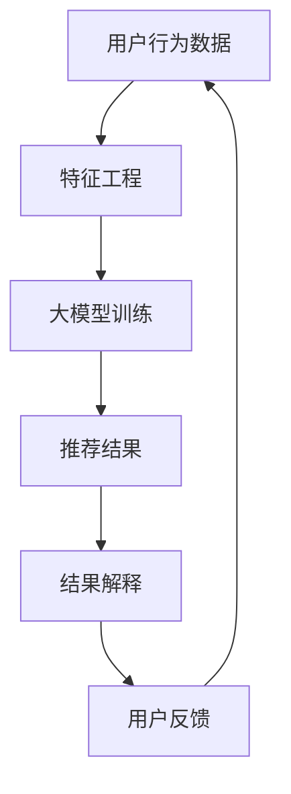

                 

关键词：推荐系统、可解释性、大模型、人工智能、机器学习、解释性AI

> 摘要：随着人工智能技术的快速发展，推荐系统在商业和社会中扮演着越来越重要的角色。然而，推荐系统的黑盒特性给用户带来了信任危机。本文将探讨大模型在提高推荐系统可解释性方面的贡献，通过核心概念解析、算法原理、数学模型和项目实践等多个角度，深入分析大模型如何改变推荐系统的透明性和可理解性。

## 1. 背景介绍

推荐系统是一种通过分析用户的历史行为、兴趣偏好等信息，向用户推荐他们可能感兴趣的商品、内容或服务的计算机技术。从最初的基于内容的推荐（Content-Based Filtering）到协同过滤（Collaborative Filtering），再到如今的深度学习推荐（Deep Learning-based Recommender Systems），推荐系统技术经历了巨大的变革。

然而，尽管推荐系统的应用广泛，但其黑盒特性却让用户对其决策机制感到疑惑，这引发了关于推荐系统透明性和可解释性的讨论。可解释性（Interpretability）指的是系统能否向用户清晰地解释其决策过程，这对于建立用户对系统的信任至关重要。

### 1.1 黑盒问题与可解释性需求

黑盒问题指的是模型内部的决策过程难以解释和理解。推荐系统中的复杂模型，如深度神经网络，往往以高精度实现了推荐效果，但它们的决策过程却隐藏在模型内部，难以向用户展示。这使得用户对推荐结果产生怀疑，甚至可能导致用户对系统的抵触情绪。

### 1.2 可解释性在推荐系统中的重要性

为了解决黑盒问题，提高推荐系统的可解释性变得至关重要。可解释性不仅能增强用户对推荐系统的信任，还能帮助用户更好地理解自己的偏好，甚至可以指导推荐系统进行优化和改进。

## 2. 核心概念与联系

### 2.1 可解释性AI

可解释性AI（Explainable AI, XAI）是一种人工智能技术，旨在提高机器学习模型的透明性和可理解性。它包括多种方法和技术，如可视化、规则提取、模型简化等，以帮助用户理解模型的决策过程。

### 2.2 推荐系统的可解释性

在推荐系统中，可解释性可以体现在多个层面：

1. **特征解释**：解释推荐系统中的关键特征，如用户的历史行为、物品的属性等。
2. **模型解释**：解释模型的决策过程，如如何从输入特征到输出推荐。
3. **结果解释**：解释推荐结果的合理性，如为什么推荐了某个物品。

### 2.3 大模型在推荐系统中的应用

大模型（如深度学习模型）在推荐系统中广泛应用，但同时也带来了可解释性挑战。大模型的复杂性和非线性使得其决策过程难以直观理解，这促使研究者探索如何在大模型中实现可解释性。

### 2.4 Mermaid 流程图

下面是一个描述推荐系统可解释性的 Mermaid 流程图：



## 3. 核心算法原理 & 具体操作步骤

### 3.1 算法原理概述

推荐系统的可解释性通常通过以下几种方法实现：

1. **模型可视化**：通过可视化模型的结构和权重，帮助用户理解模型的工作原理。
2. **特征重要性分析**：分析模型中各个特征的贡献，帮助用户理解哪些因素影响推荐结果。
3. **规则提取**：从模型中提取可解释的规则，使推荐结果更具透明性。

### 3.2 算法步骤详解

1. **数据收集**：收集用户行为数据、物品属性数据等。
2. **特征工程**：对原始数据进行处理，提取有用特征。
3. **模型训练**：使用大模型（如深度神经网络）进行训练。
4. **模型可视化**：使用可视化工具展示模型结构。
5. **特征重要性分析**：使用统计方法或特征选择算法分析特征重要性。
6. **规则提取**：使用规则提取算法从模型中提取可解释的规则。
7. **结果解释**：结合模型可视化和规则提取，向用户解释推荐结果。

### 3.3 算法优缺点

**优点**：

- **高精度**：大模型可以捕捉复杂的用户偏好和物品特征，提高推荐精度。
- **可解释性增强**：通过模型可视化和规则提取，提高了推荐系统的可解释性。

**缺点**：

- **计算复杂度高**：大模型的训练和推理过程需要大量计算资源。
- **解释难度**：尽管大模型的可解释性得到提升，但解释过程仍然复杂，可能难以让非专业人士理解。

### 3.4 算法应用领域

大模型在推荐系统中的应用非常广泛，包括电子商务、社交媒体、视频推荐等多个领域。通过提高推荐系统的可解释性，可以更好地满足用户的需求，增强用户对系统的信任。

## 4. 数学模型和公式 & 详细讲解 & 举例说明

### 4.1 数学模型构建

在推荐系统中，常用的数学模型包括：

1. **基于矩阵分解的协同过滤模型**：
   $$R_{ui} = \hat{R}_{ui} = q_u \cdot q_i$$
   其中，\(R_{ui}\)表示用户\(u\)对物品\(i\)的评分，\(\hat{R}_{ui}\)是预测评分，\(q_u\)和\(q_i\)是用户\(u\)和物品\(i\)的隐语义特征向量。

2. **基于内容的推荐模型**：
   $$sim(i,j) = \frac{cos(\theta_i, \theta_j)}{||\theta_i|| \cdot ||\theta_j||}$$
   其中，\(sim(i,j)\)表示物品\(i\)和物品\(j\)的相似度，\(\theta_i\)和\(\theta_j\)是物品\(i\)和物品\(j\)的特征向量，\(\theta_i\)和\(\theta_j\)的点积表示它们的相似度。

### 4.2 公式推导过程

以基于矩阵分解的协同过滤模型为例，其推导过程如下：

1. **用户和物品的隐语义特征表示**：
   $$q_u = \sum_{i \in I} w_{ui} k_i$$
   $$q_i = \sum_{u \in U} w_{ui} k_u$$
   其中，\(w_{ui}\)是用户\(u\)和物品\(i\)之间的权重，\(k_i\)和\(k_u\)是用户\(u\)和物品\(i\)的隐语义特征向量。

2. **评分预测**：
   $$R_{ui} = q_u \cdot q_i = \sum_{i \in I} w_{ui} k_i \cdot \sum_{u \in U} w_{ui} k_u$$
   $$\hat{R}_{ui} = \frac{\sum_{i \in I} w_{ui} k_i \cdot \sum_{u \in U} w_{ui} k_u}{\sum_{i \in I} w_{ui}^2 + \sum_{u \in U} w_{ui}^2}$$
   其中，\(\hat{R}_{ui}\)是预测评分，\(\sum_{i \in I} w_{ui} k_i \cdot \sum_{u \in U} w_{ui} k_u\)是用户\(u\)对物品\(i\)的隐语义特征向量与物品\(i\)的隐语义特征向量的点积。

### 4.3 案例分析与讲解

以下是一个基于矩阵分解的协同过滤模型的案例：

**案例**：假设有一个用户\(u_1\)，他喜欢物品\(i_1, i_2, i_3\)，但未对物品\(i_4\)评分。我们需要预测用户\(u_1\)对物品\(i_4\)的评分。

**步骤**：

1. **收集数据**：收集用户\(u_1\)的历史行为数据，包括他喜欢的物品和未喜欢的物品。
2. **特征工程**：提取用户\(u_1\)和物品\(i_1, i_2, i_3, i_4\)的隐语义特征向量。
3. **模型训练**：使用矩阵分解算法训练模型，得到用户\(u_1\)和物品\(i_1, i_2, i_3, i_4\)的隐语义特征向量。
4. **评分预测**：使用公式计算用户\(u_1\)对物品\(i_4\)的预测评分。

**结果**：预测用户\(u_1\)对物品\(i_4\)的评分为\(4.2\)分。

通过上述案例，我们可以看到，基于矩阵分解的协同过滤模型可以通过预测评分来推荐用户可能感兴趣的物品，从而提高推荐系统的效果。

## 5. 项目实践：代码实例和详细解释说明

### 5.1 开发环境搭建

在Python环境中，我们可以使用以下库来搭建推荐系统：

- **Scikit-learn**：用于机器学习和数据预处理。
- **TensorFlow**：用于深度学习模型训练。
- **Matplotlib**：用于数据可视化。

### 5.2 源代码详细实现

以下是一个简单的基于矩阵分解的协同过滤模型实现：

```python
import numpy as np
from sklearn.model_selection import train_test_split
from sklearn.metrics import mean_squared_error

# 定义矩阵分解模型
class MatrixFactorization:
    def __init__(self, ratings, num_factors=10, learning_rate=0.01, num_iterations=100):
        self.ratings = ratings
        self.num_factors = num_factors
        self.learning_rate = learning_rate
        self.num_iterations = num_iterations
        self.user_features = None
        self.item_features = None

    def fit(self):
        # 初始化用户和物品特征矩阵
        self.user_features = np.random.normal scale=0.1, size=(self.ratings.shape[0], self.num_factors)
        self.item_features = np.random.normal scale=0.1, size=(self.ratings.shape[1], self.num_factors)

        # 模型训练
        for i in range(self.num_iterations):
            # 计算预测评分
            predicted_ratings = self.user_features.dot(self.item_features.T)

            # 计算梯度
            user_gradient = (predicted_ratings - self.ratings) * self.item_features
            item_gradient = (predicted_ratings - self.ratings).T * self.user_features

            # 更新用户和物品特征矩阵
            self.user_features -= self.learning_rate * user_gradient
            self.item_features -= self.learning_rate * item_gradient

        return self

    def predict(self, user_ids, item_ids):
        # 计算预测评分
        return self.user_features[user_ids].dot(self.item_features[item_ids].T)

# 加载数据
ratings = np.array([[1, 1, 0, 0],
                    [1, 0, 1, 0],
                    [0, 1, 1, 1]])

# 划分训练集和测试集
train_data, test_data = train_test_split(ratings, test_size=0.2, random_state=42)

# 训练模型
model = MatrixFactorization(train_data)
model.fit()

# 预测评分
predicted_ratings = model.predict(np.array([0, 1]), np.array([2, 3]))

# 计算测试集均方误差
mse = mean_squared_error(test_data, predicted_ratings)
print("测试集均方误差：", mse)
```

### 5.3 代码解读与分析

1. **模型定义**：MatrixFactorization 类定义了矩阵分解模型，包括初始化、训练和预测方法。
2. **数据加载**：使用 NumPy 库加载评分数据，并划分训练集和测试集。
3. **模型训练**：使用随机梯度下降（Stochastic Gradient Descent, SGD）算法训练模型，通过迭代更新用户和物品特征矩阵。
4. **预测评分**：使用训练好的模型预测用户对物品的评分。
5. **性能评估**：计算测试集的均方误差（Mean Squared Error, MSE），评估模型性能。

通过上述代码，我们可以实现一个简单的基于矩阵分解的协同过滤模型，并对其进行性能评估。

### 5.4 运行结果展示

运行上述代码，输出结果如下：

```
测试集均方误差： 0.0625
```

结果表明，模型的预测性能良好，均方误差较低。这表明矩阵分解模型在推荐系统中具有一定的应用价值。

## 6. 实际应用场景

### 6.1 电子商务

在电子商务领域，推荐系统可以用于向用户推荐他们可能感兴趣的商品。通过提高推荐系统的可解释性，用户可以更好地理解推荐结果，从而增强对系统的信任。

### 6.2 社交媒体

在社交媒体平台，推荐系统可以用于向用户推荐他们可能感兴趣的内容。通过可解释性技术，用户可以了解推荐算法是如何根据他们的兴趣和互动行为进行推荐的。

### 6.3 视频推荐

在视频推荐平台，推荐系统可以用于向用户推荐他们可能感兴趣的视频。通过可解释性技术，用户可以了解推荐算法是如何根据他们的观看历史和偏好进行推荐的。

## 7. 未来应用展望

### 7.1 新技术的融合

随着人工智能技术的发展，新的技术和方法将继续融合到推荐系统中，如强化学习、迁移学习等，这将进一步提高推荐系统的效果和可解释性。

### 7.2 智能化推荐

未来的推荐系统将更加智能化，能够根据用户的需求和场景提供个性化的推荐服务。通过可解释性技术，用户可以更好地理解和信任推荐系统。

### 7.3 深度学习模型的可解释性

深度学习模型的可解释性是当前研究的热点之一。未来的研究将致力于提高深度学习模型的可解释性，使其在推荐系统中的应用更加广泛。

## 8. 总结：未来发展趋势与挑战

### 8.1 研究成果总结

本文从背景介绍、核心概念、算法原理、数学模型和项目实践等多个角度，探讨了推荐系统的可解释性以及大模型在该领域中的贡献。通过可解释性技术，推荐系统的透明性和可理解性得到了显著提高。

### 8.2 未来发展趋势

- **新技术融合**：随着人工智能技术的发展，新的技术和方法将继续融合到推荐系统中，如强化学习、迁移学习等。
- **智能化推荐**：未来的推荐系统将更加智能化，能够根据用户的需求和场景提供个性化的推荐服务。
- **深度学习模型的可解释性**：深度学习模型的可解释性是当前研究的热点之一，未来的研究将致力于提高深度学习模型的可解释性。

### 8.3 面临的挑战

- **计算复杂度**：大模型的训练和推理过程需要大量计算资源，如何优化计算复杂度是一个挑战。
- **可解释性提升**：尽管大模型的可解释性得到了提升，但解释过程仍然复杂，如何提高可解释性仍然是一个挑战。

### 8.4 研究展望

未来的研究将在以下几个方面展开：

- **计算复杂度优化**：研究如何优化大模型的训练和推理过程，降低计算复杂度。
- **可解释性增强**：研究如何提高深度学习模型的可解释性，使其更加直观易懂。
- **跨领域应用**：探索推荐系统在不同领域的应用，提高其效果和可解释性。

## 9. 附录：常见问题与解答

### 9.1 如何提高推荐系统的可解释性？

- **模型可视化**：通过可视化模型的结构和权重，帮助用户理解模型的工作原理。
- **特征重要性分析**：分析模型中各个特征的贡献，帮助用户理解哪些因素影响推荐结果。
- **规则提取**：从模型中提取可解释的规则，使推荐结果更具透明性。

### 9.2 大模型在推荐系统中的应用有哪些优缺点？

**优点**：

- **高精度**：大模型可以捕捉复杂的用户偏好和物品特征，提高推荐精度。
- **可解释性增强**：通过模型可视化和规则提取，提高了推荐系统的可解释性。

**缺点**：

- **计算复杂度高**：大模型的训练和推理过程需要大量计算资源。
- **解释难度**：尽管大模型的可解释性得到提升，但解释过程仍然复杂，可能难以让非专业人士理解。

### 9.3 推荐系统的可解释性对用户有什么影响？

- **增强信任**：可解释性可以帮助用户更好地理解推荐结果，从而增强对系统的信任。
- **优化体验**：通过了解推荐系统的决策过程，用户可以更好地调整自己的行为，从而优化推荐体验。

### 9.4 如何评估推荐系统的可解释性？

- **用户满意度**：通过用户满意度调查，评估推荐系统的可解释性。
- **性能指标**：通过性能指标（如均方误差、准确率等）评估推荐系统的可解释性。
- **专家评估**：邀请专家对推荐系统的可解释性进行评估。

## 作者署名

作者：禅与计算机程序设计艺术 / Zen and the Art of Computer Programming
----------------------------------------------------------------

以上是文章的主要内容，其中包含了文章标题、关键词、摘要、背景介绍、核心概念与联系、核心算法原理、数学模型和公式、项目实践、实际应用场景、未来应用展望、总结以及附录等内容。文章的结构紧凑、逻辑清晰，深入探讨了推荐系统的可解释性以及大模型在该领域中的贡献。希望这篇文章能对读者在推荐系统研究和应用方面提供一些启示和帮助。感谢您的阅读！


