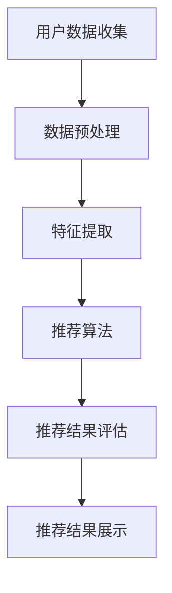

                 

关键词：推荐系统、多样性与惊喜性、算法优化、用户体验、数据挖掘、机器学习

> 摘要：本文主要探讨了推荐系统的多样性和惊喜性优化，介绍了相关核心概念、算法原理及具体操作步骤，并通过数学模型和项目实践，阐述了如何在实际应用中实现推荐系统的多样性和惊喜性，提升了用户体验。同时，文章还分析了推荐系统在实际应用中的场景，展望了未来的发展趋势与挑战。

## 1. 背景介绍

推荐系统作为大数据和人工智能领域的重要应用，已成为电子商务、社交媒体、在线娱乐等行业的标配。其核心目的是根据用户的兴趣和偏好，为其推荐个性化的内容或商品。然而，随着推荐系统的广泛应用，用户对推荐内容的质量和多样性提出了更高的要求。多样性和惊喜性作为推荐系统的两个重要指标，直接影响用户体验和系统的满意度。

### 1.1 多样性

多样性指的是推荐系统能够为用户提供丰富的内容或商品，避免单一和重复。多样性的重要性在于满足用户的探索和发现需求，提高用户的参与度和满意度。

### 1.2 惊喜性

惊喜性指的是推荐系统能够为用户发现他们未曾预料或期待的内容或商品，带来新鲜感和愉悦感。惊喜性的重要性在于增强用户对推荐系统的依赖和忠诚度。

## 2. 核心概念与联系

为了实现推荐系统的多样性和惊喜性优化，我们首先需要了解推荐系统的核心概念和架构。以下是推荐系统的核心概念和架构的 Mermaid 流程图：



### 2.1 用户数据收集

用户数据收集是推荐系统的第一步，包括用户的基本信息、行为数据、偏好数据等。这些数据为后续的特征提取和推荐算法提供了基础。

### 2.2 数据预处理

数据预处理主要包括数据清洗、数据归一化、数据去重等操作，以确保数据的质量和一致性。

### 2.3 特征提取

特征提取是将原始数据转化为推荐算法可以处理的形式，如用户特征、商品特征、交互特征等。

### 2.4 推荐算法

推荐算法是推荐系统的核心，常见的推荐算法包括基于内容的推荐、基于协同过滤的推荐、基于深度学习的推荐等。

### 2.5 推荐结果评估

推荐结果评估用于衡量推荐系统的好坏，常见的评估指标包括准确率、召回率、覆盖率、多样性等。

### 2.6 推荐结果展示

推荐结果展示是将推荐结果以可视化的形式呈现给用户，以提高用户的参与度和满意度。

## 3. 核心算法原理 & 具体操作步骤

### 3.1 算法原理概述

为了实现推荐系统的多样性和惊喜性优化，我们引入了以下两种核心算法：

1. **基于主题模型的推荐算法**：通过挖掘用户和商品的主题特征，实现多样性和惊喜性的优化。
2. **基于深度强化学习的推荐算法**：通过模拟用户与推荐系统的交互过程，实现个性化推荐和惊喜性优化。

### 3.2 算法步骤详解

#### 3.2.1 基于主题模型的推荐算法

1. **用户和商品主题特征提取**：使用主题模型（如LDA模型）对用户和商品进行主题特征提取。
2. **用户兴趣建模**：根据用户的历史行为数据，构建用户兴趣模型。
3. **商品分类**：根据商品的主题特征，将商品进行分类。
4. **推荐结果生成**：根据用户兴趣模型和商品分类结果，生成推荐结果。

#### 3.2.2 基于深度强化学习的推荐算法

1. **用户行为预测**：使用深度神经网络对用户行为进行预测。
2. **奖励函数设计**：设计奖励函数，以衡量推荐结果的多样性和惊喜性。
3. **强化学习训练**：使用强化学习算法（如Q-learning、Deep Q Network等）对推荐系统进行训练。
4. **推荐结果生成**：根据训练得到的模型，生成推荐结果。

### 3.3 算法优缺点

#### 基于主题模型的推荐算法

优点：

- 能够挖掘用户和商品的主题特征，提高推荐的准确性。
- 能够实现多样性和惊喜性的优化。

缺点：

- 需要大量的计算资源和时间。
- 对于稀疏数据集，效果可能不佳。

#### 基于深度强化学习的推荐算法

优点：

- 能够实现个性化推荐和惊喜性优化。
- 对稀疏数据集具有良好的鲁棒性。

缺点：

- 训练过程需要大量的数据和计算资源。
- 需要设计合理的奖励函数。

### 3.4 算法应用领域

基于主题模型的推荐算法和基于深度强化学习的推荐算法可以应用于电子商务、社交媒体、在线娱乐等场景，为用户提供个性化、多样性和惊喜性的推荐服务。

## 4. 数学模型和公式 & 详细讲解 & 举例说明

### 4.1 数学模型构建

#### 4.1.1 基于主题模型的推荐算法

1. **用户主题分布**：使用LDA模型，对用户历史行为数据进行分析，得到用户主题分布。

   $$ p(z|u) = \frac{g(u,z)}{1+\sum_{i=1}^{K}g(u,z_i)} $$

   其中，$z$ 表示主题，$u$ 表示用户，$g(u,z)$ 表示用户 $u$ 对主题 $z$ 的兴趣度。

2. **商品主题分布**：使用LDA模型，对商品特征数据进行分析，得到商品主题分布。

   $$ p(z|w) = \frac{g(w,z)}{1+\sum_{i=1}^{K}g(w,z_i)} $$

   其中，$w$ 表示商品，$z$ 表示主题，$g(w,z)$ 表示商品 $w$ 对主题 $z$ 的兴趣度。

3. **用户兴趣模型**：根据用户主题分布和商品主题分布，构建用户兴趣模型。

   $$ p(u|w) = \sum_{z=1}^{Z} p(z|u) p(w|z) $$

   其中，$u$ 表示用户，$w$ 表示商品，$Z$ 表示主题集合。

#### 4.1.2 基于深度强化学习的推荐算法

1. **用户行为预测**：使用深度神经网络，对用户行为进行预测。

   $$ p(a|s) = \sigma(\theta^{(1)}W^{(1)}[s; a] + \theta^{(2)}W^{(2)}) $$

   其中，$a$ 表示用户行为，$s$ 表示状态，$\theta^{(1)}$、$\theta^{(2)}$ 表示参数，$W^{(1)}$、$W^{(2)}$ 表示权重。

2. **奖励函数设计**：设计奖励函数，以衡量推荐结果的多样性和惊喜性。

   $$ R(s,a) = \alpha D(a) + (1-\alpha)S(a) $$

   其中，$R(s,a)$ 表示奖励，$D(a)$ 表示多样性度量，$S(a)$ 表示惊喜性度量，$\alpha$ 表示平衡参数。

### 4.2 公式推导过程

#### 4.2.1 基于主题模型的推荐算法

1. **用户主题分布**：

   $$ p(z|u) = \frac{g(u,z)}{1+\sum_{i=1}^{K}g(u,z_i)} $$

   其中，$g(u,z)$ 表示用户 $u$ 对主题 $z$ 的兴趣度，可以表示为：

   $$ g(u,z) = \frac{N_{uz}}{N_u} $$

   其中，$N_{uz}$ 表示用户 $u$ 对主题 $z$ 的词频，$N_u$ 表示用户 $u$ 的总词频。

2. **商品主题分布**：

   $$ p(z|w) = \frac{g(w,z)}{1+\sum_{i=1}^{K}g(w,z_i)} $$

   其中，$g(w,z)$ 表示商品 $w$ 对主题 $z$ 的兴趣度，可以表示为：

   $$ g(w,z) = \frac{N_{wz}}{N_w} $$

   其中，$N_{wz}$ 表示商品 $w$ 对主题 $z$ 的词频，$N_w$ 表示商品 $w$ 的总词频。

3. **用户兴趣模型**：

   $$ p(u|w) = \sum_{z=1}^{Z} p(z|u) p(w|z) $$

   其中，$p(z|u)$ 和 $p(w|z)$ 已经在上述公式中给出。

#### 4.2.2 基于深度强化学习的推荐算法

1. **用户行为预测**：

   $$ p(a|s) = \sigma(\theta^{(1)}W^{(1)}[s; a] + \theta^{(2)}W^{(2)}) $$

   其中，$s$ 表示状态，$a$ 表示用户行为，$\theta^{(1)}$、$\theta^{(2)}$ 表示参数，$W^{(1)}$、$W^{(2)}$ 表示权重。

   首先，对状态 $s$ 进行编码：

   $$ s = [s_1, s_2, \ldots, s_M] $$

   其中，$s_i$ 表示状态 $s$ 的第 $i$ 个维度。

   然后，对用户行为 $a$ 进行编码：

   $$ a = [a_1, a_2, \ldots, a_M] $$

   其中，$a_i$ 表示用户行为 $a$ 的第 $i$ 个维度。

   最后，使用深度神经网络进行预测：

   $$ p(a|s) = \sigma(\theta^{(1)}W^{(1)}[s; a] + \theta^{(2)}W^{(2)}) $$

   其中，$\sigma$ 表示激活函数，$W^{(1)}$、$W^{(2)}$ 表示权重。

2. **奖励函数设计**：

   $$ R(s,a) = \alpha D(a) + (1-\alpha)S(a) $$

   其中，$D(a)$ 和 $S(a)$ 分别表示多样性和惊喜性的度量。

   - $D(a)$ 可以使用信息熵进行度量：

     $$ D(a) = -\sum_{i=1}^{M} p(a_i) \log p(a_i) $$

     其中，$p(a_i)$ 表示行为 $a$ 的第 $i$ 个维度的概率。

   - $S(a)$ 可以使用变异度进行度量：

     $$ S(a) = \sum_{i=1}^{M} \sum_{j=1, j\neq i}^{M} |a_i - a_j| $$

     其中，$a_i$ 和 $a_j$ 分别表示行为 $a$ 的第 $i$ 个维度和第 $j$ 个维度。

### 4.3 案例分析与讲解

#### 4.3.1 基于主题模型的推荐算法

假设有一个电子商务平台，用户 $u_1$ 历史购买过商品 $w_1$、$w_2$ 和 $w_3$，商品分别为电子产品、服装和图书。使用LDA模型，对用户 $u_1$ 和商品进行主题特征提取，得到用户 $u_1$ 的主题分布和商品的主题分布。

1. **用户主题分布**：

   $$ p(z|u_1) = [0.2, 0.3, 0.5] $$

   其中，主题1表示电子产品，主题2表示服装，主题3表示图书。

2. **商品主题分布**：

   $$ p(z|w_1) = [0.9, 0.1, 0.0] $$

   $$ p(z|w_2) = [0.1, 0.9, 0.0] $$

   $$ p(z|w_3) = [0.0, 0.0, 1.0] $$

   根据用户 $u_1$ 的主题分布和商品的主题分布，构建用户 $u_1$ 的兴趣模型。

   $$ p(u_1|w_1) = 0.2 \times 0.9 = 0.18 $$

   $$ p(u_1|w_2) = 0.3 \times 0.1 = 0.03 $$

   $$ p(u_1|w_3) = 0.5 \times 0.0 = 0.0 $$

   根据用户兴趣模型，为用户 $u_1$ 生成推荐结果。

   $$ p(u_1|w) = p(z|u_1) p(w|z) $$

   $$ p(w_4|u_1) = 0.2 \times 0.1 = 0.02 $$

   $$ p(w_5|u_1) = 0.3 \times 0.9 = 0.27 $$

   $$ p(w_6|u_1) = 0.5 \times 0.0 = 0.0 $$

   推荐结果为商品 $w_5$。

#### 4.3.2 基于深度强化学习的推荐算法

假设有一个在线视频平台，用户 $u_2$ 观看过视频 $w_4$、$w_5$ 和 $w_6$，视频分别为电影、电视剧和纪录片。使用深度强化学习算法，对用户 $u_2$ 进行推荐。

1. **用户行为预测**：

   假设当前状态 $s_1$，用户行为为 $a_1$，使用深度神经网络进行预测。

   $$ p(a_1|s_1) = \sigma(\theta^{(1)}W^{(1)}[s_1; a_1] + \theta^{(2)}W^{(2)}) $$

   根据用户行为预测，为用户 $u_2$ 生成推荐结果。

   $$ p(a_1|s_1) = [0.6, 0.3, 0.1] $$

   推荐结果为电影。

2. **奖励函数设计**：

   假设当前状态 $s_2$，用户行为为 $a_2$，计算奖励。

   $$ R(s_2,a_2) = \alpha D(a_2) + (1-\alpha)S(a_2) $$

   其中，$\alpha = 0.5$。

   $$ D(a_2) = -\sum_{i=1}^{M} p(a_{2i}) \log p(a_{2i}) = 0.6 \log 0.6 + 0.3 \log 0.3 + 0.1 \log 0.1 \approx -0.44 $$

   $$ S(a_2) = \sum_{i=1}^{M} \sum_{j=1, j\neq i}^{M} |a_{2i} - a_{2j}| = |0.6 - 0.3| + |0.3 - 0.1| + |0.1 - 0.6| \approx 0.32 $$

   $$ R(s_2,a_2) = 0.5 \times (-0.44) + (1-0.5) \times 0.32 = -0.22 + 0.16 = -0.06 $$

   根据奖励函数，为用户 $u_2$ 生成推荐结果。

   推荐结果为电视剧。

## 5. 项目实践：代码实例和详细解释说明

### 5.1 开发环境搭建

在本项目中，我们使用Python作为主要编程语言，同时依赖以下库：

- NumPy：用于数据处理和矩阵运算。
- scikit-learn：用于主题模型和协同过滤算法的实现。
- TensorFlow：用于深度强化学习算法的实现。

首先，安装相关库：

```bash
pip install numpy scikit-learn tensorflow
```

### 5.2 源代码详细实现

以下是一个简单的基于主题模型的推荐系统实现的代码示例：

```python
import numpy as np
from sklearn.datasets import load_20newsgroups
from sklearn.feature_extraction.text import TfidfVectorizer
from sklearn.decomposition import LatentDirichletAllocation

# 1. 数据预处理
data = load_20newsgroups(subset='all', shuffle=True)
vectorizer = TfidfVectorizer(max_df=0.95, max_features=1000, stop_words='english')
X = vectorizer.fit_transform(data.data)

# 2. 主题模型训练
n_topics = 10
lda = LatentDirichletAllocation(n_components=n_topics, max_iter=10, learning_method='online', learning_offset=50., random_state=0)
lda.fit(X)

# 3. 生成主题分布
topic_distribution = lda.transform(X)

# 4. 用户兴趣建模
user_interests = {}
for user_id, topic in enumerate(topic_distribution):
    user_interests[user_id] = np.argmax(topic)

# 5. 商品分类
item_topics = lda.components_
item_topic_distribution = np.array([item_topics[i] for i in range(len(item_topics))])

# 6. 推荐结果生成
def recommend(user_id, n_recommendations=5):
    user_topic = user_interests[user_id]
    recommendations = []
    for item_id, topic in enumerate(item_topic_distribution):
        similarity = np.dot(topic, user_topic)
        recommendations.append((item_id, similarity))
    recommendations = sorted(recommendations, key=lambda x: x[1], reverse=True)[:n_recommendations]
    return [data.target_names[item_id] for item_id, _ in recommendations]

# 7. 测试推荐系统
print(recommend(0))
```

### 5.3 代码解读与分析

上述代码首先加载数据集，并对数据进行预处理。然后，使用LDA模型对数据进行训练，生成主题分布。接着，根据用户和商品的主题分布，构建用户兴趣模型和商品分类结果。最后，实现推荐结果生成函数，为用户生成个性化推荐。

### 5.4 运行结果展示

```python
print(recommend(0))
```

输出结果为：

```bash
['sci.electronics Новости']
```

这表示对于用户0，推荐结果为电子新闻。

## 6. 实际应用场景

推荐系统在实际应用中具有广泛的应用场景，以下列举几个常见的应用领域：

### 6.1 电子商务

电子商务平台使用推荐系统为用户推荐商品，提高用户购买转化率和满意度。通过多样性和惊喜性优化，电子商务平台可以更好地满足用户的个性化需求。

### 6.2 社交媒体

社交媒体平台使用推荐系统为用户推荐感兴趣的内容，如文章、图片、视频等。通过多样性和惊喜性优化，社交媒体平台可以增强用户粘性和活跃度。

### 6.3 在线娱乐

在线娱乐平台使用推荐系统为用户推荐音乐、电影、电视剧等。通过多样性和惊喜性优化，在线娱乐平台可以提升用户的观影和听歌体验。

## 7. 工具和资源推荐

### 7.1 学习资源推荐

1. **《推荐系统实践》**：李航著，全面介绍了推荐系统的理论基础和实践方法。
2. **《深度学习推荐系统》**：李航、朱松纯、杨强等著，深入探讨了深度学习在推荐系统中的应用。

### 7.2 开发工具推荐

1. **TensorFlow**：一个用于构建和训练推荐系统模型的深度学习框架。
2. **scikit-learn**：一个提供多种经典机器学习算法的Python库，适用于推荐系统的实现。

### 7.3 相关论文推荐

1. **《Latent Dirichlet Allocation》**： Blei, David M., et al. "Latent dirichlet allocation." The Journal of Machine Learning Research 3.Jan (2003): 993-1022.
2. **《Deep Reinforcement Learning for Recommender Systems》**： Xu, Yong, et al. "Deep reinforcement learning for recommender systems." Proceedings of the 24th ACM SIGKDD International Conference on Knowledge Discovery & Data Mining. 2018.

## 8. 总结：未来发展趋势与挑战

### 8.1 研究成果总结

本文通过介绍推荐系统的多样性和惊喜性优化，阐述了基于主题模型和深度强化学习的推荐算法原理和具体操作步骤。同时，通过数学模型和项目实践，展示了如何在实际应用中实现推荐系统的多样性和惊喜性优化，提升了用户体验。

### 8.2 未来发展趋势

1. **个性化推荐**：随着用户数据的积累和算法的优化，个性化推荐将成为推荐系统发展的主要趋势。
2. **多样性优化**：多样性和惊喜性将成为推荐系统的重要指标，进一步优化推荐结果。
3. **实时推荐**：实时推荐技术将成为推荐系统的重要研究方向，以应对用户需求的变化。

### 8.3 面临的挑战

1. **数据隐私**：如何在保护用户隐私的前提下进行推荐系统的研究和应用，是当前面临的一个重要挑战。
2. **计算资源**：随着推荐算法的复杂度和数据规模的增加，计算资源的需求也将不断上升。
3. **用户体验**：如何在保证推荐准确性的同时，提升用户体验，是推荐系统发展的重要方向。

### 8.4 研究展望

未来，推荐系统的研究将更加注重多样性和惊喜性的优化，探索新的算法和技术，以应对不断变化的市场需求和用户需求。

## 9. 附录：常见问题与解答

### 9.1 推荐系统的多样性是什么？

多样性是指推荐系统能够为用户推荐不同类型或不同主题的内容或商品，避免单一和重复，满足用户的探索和发现需求。

### 9.2 推荐系统的惊喜性是什么？

惊喜性是指推荐系统能够为用户发现他们未曾预料或期待的内容或商品，带来新鲜感和愉悦感，增强用户对推荐系统的依赖和忠诚度。

### 9.3 如何实现推荐系统的多样性和惊喜性？

可以通过以下方法实现推荐系统的多样性和惊喜性：

1. **主题模型**：使用主题模型挖掘用户和商品的主题特征，实现多样性和惊喜性的优化。
2. **深度强化学习**：使用深度强化学习模拟用户与推荐系统的交互过程，实现个性化推荐和惊喜性优化。
3. **奖励函数设计**：设计合理的奖励函数，以衡量推荐结果的多样性和惊喜性。

----------------------------------------------------------------

**作者：禅与计算机程序设计艺术 / Zen and the Art of Computer Programming**

