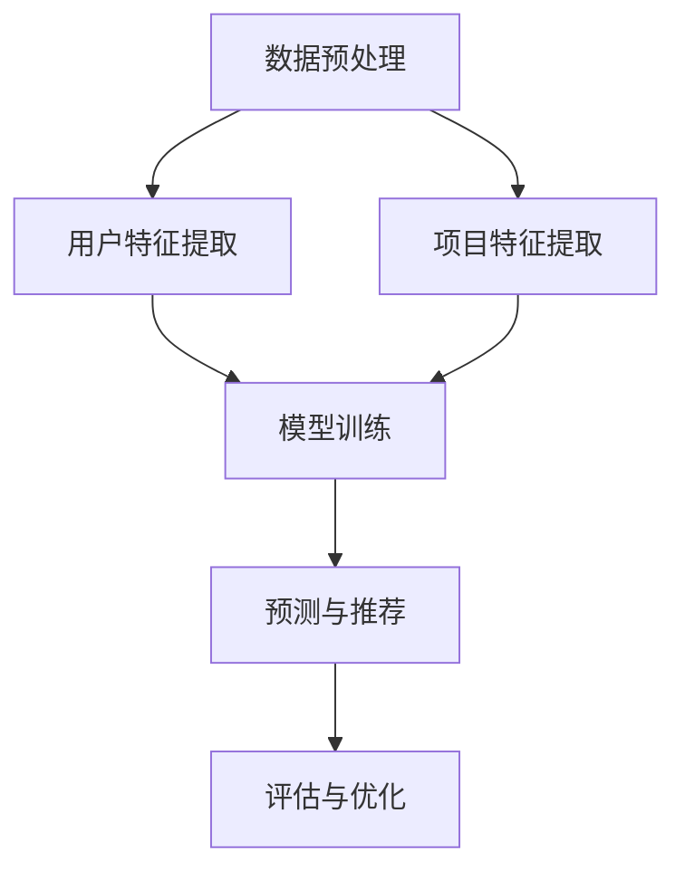

                 

关键词：推荐系统，多样性，大模型，算法，数学模型，应用场景，未来展望

摘要：本文将探讨推荐系统的多样性问题，并介绍大模型在解决该问题上的优势。我们将分析推荐系统的核心概念和架构，深入探讨核心算法原理及其应用领域，并借助数学模型和实际代码实例进行详细讲解。最后，我们将展望推荐系统在未来的发展趋势和面临的挑战。

## 1. 背景介绍

随着互联网的迅猛发展和用户数据的爆炸式增长，推荐系统已经成为现代信息检索和电子商务领域的关键技术。然而，推荐系统的多样性问题一直是研究人员和实践者关注的焦点。传统的推荐系统大多基于协同过滤或基于内容的推荐算法，尽管在某种程度上能够满足用户的需求，但往往存在如下问题：

1. **同质性**：推荐结果往往相似，缺乏多样性。
2. **偏好空洞**：用户偏好不能很好地通过历史数据捕捉。
3. **冷启动问题**：新用户或新商品的推荐效果不佳。

为了解决这些问题，研究人员提出了各种大模型解决方案，如生成对抗网络（GAN）、变分自编码器（VAE）和自监督学习等。这些方法在理论上具有强大的表示能力和泛化能力，有望提高推荐系统的多样性。

## 2. 核心概念与联系

### 2.1. 推荐系统的核心概念

推荐系统主要涉及以下核心概念：

- **用户**：推荐系统的核心，其行为和偏好是推荐系统建模的基础。
- **项目**：用户可能感兴趣的对象，如商品、新闻、音乐等。
- **评分**：用户对项目的评价，如喜好程度、评分等。
- **推荐列表**：根据用户的偏好和模型预测，为用户推荐的项目列表。

### 2.2. 推荐系统的架构

推荐系统通常包括以下几个模块：

1. **数据预处理**：清洗、处理和整合用户和项目数据。
2. **用户和项目特征提取**：将原始数据转换为可用于训练的特征向量。
3. **模型训练**：利用用户和项目特征训练推荐模型。
4. **预测和推荐**：根据用户特征和项目特征，为用户生成推荐列表。
5. **评估与优化**：评估推荐效果，并调整模型参数以优化推荐质量。

### 2.3. Mermaid 流程图

以下是一个简单的 Mermaid 流程图，展示了推荐系统的架构：



## 3. 核心算法原理 & 具体操作步骤

### 3.1. 算法原理概述

大模型在推荐系统中的核心作用是捕捉用户的复杂偏好和项目之间的深层关系。以下是几种常见的大模型算法：

1. **生成对抗网络（GAN）**：通过生成器和判别器的对抗训练，生成与真实数据分布相似的数据，从而提高推荐系统的多样性。
2. **变分自编码器（VAE）**：通过概率编码和解码过程，对用户和项目特征进行建模，从而提高推荐系统的泛化能力。
3. **自监督学习**：利用未标注的数据进行训练，通过预测任务自动学习用户和项目的特征表示，从而提高推荐系统的多样性。

### 3.2. 算法步骤详解

以下以 GAN 为例，介绍其具体操作步骤：

1. **数据预处理**：对用户和项目数据进行清洗、归一化等处理。
2. **用户特征提取**：利用用户历史行为数据，提取用户特征向量。
3. **项目特征提取**：利用项目属性和用户评分数据，提取项目特征向量。
4. **生成器与判别器训练**：生成器和判别器交替训练，通过对抗过程优化模型参数。
5. **预测与推荐**：利用训练好的模型，预测用户对项目的偏好，并生成推荐列表。

### 3.3. 算法优缺点

1. **优点**：
   - **多样性**：能够生成具有多样性的推荐列表。
   - **泛化能力**：通过概率编码和解码，能够更好地捕捉用户的复杂偏好。
   - **自监督学习**：不需要大量标注数据，适用于新用户和新项目的推荐。

2. **缺点**：
   - **计算成本高**：训练过程需要大量计算资源。
   - **模型不稳定**：生成器和判别器的训练过程容易陷入局部最优。

### 3.4. 算法应用领域

大模型推荐算法在以下领域具有广泛应用：

1. **电子商务**：为用户提供个性化商品推荐。
2. **社交媒体**：为用户提供个性化内容推荐。
3. **在线教育**：为用户提供个性化课程推荐。
4. **音乐流媒体**：为用户提供个性化音乐推荐。

## 4. 数学模型和公式 & 详细讲解 & 举例说明

### 4.1. 数学模型构建

假设用户 $u$ 和项目 $i$ 的特征向量分别为 $\mathbf{x}_u$ 和 $\mathbf{x}_i$，推荐模型的目标是预测用户 $u$ 对项目 $i$ 的评分 $r_{ui}$。以下是一个简单的评分预测模型：

$$
r_{ui} = \mathbf{x}_u^T \mathbf{W} \mathbf{x}_i + b
$$

其中，$\mathbf{W}$ 是权重矩阵，$b$ 是偏置项。

### 4.2. 公式推导过程

为了提高推荐系统的多样性，我们可以使用 GAN 模型。以下是一个简单的 GAN 模型公式：

$$
\begin{aligned}
\mathcal{G}(\mathbf{z}) &= \hat{r}_{ui}(\mathbf{z}) = \mathbf{x}_u^T \mathbf{W}_\mathcal{G} \mathbf{x}_i + b_\mathcal{G} \\
\mathcal{D}(\mathbf{r}_{ui}) &= \hat{r}_{ui}(\mathbf{z}) = \mathbf{x}_u^T \mathbf{W}_\mathcal{D} \mathbf{x}_i + b_\mathcal{D}
\end{aligned}
$$

其中，$\mathcal{G}(\mathbf{z})$ 是生成器，用于生成虚假评分 $\hat{r}_{ui}(\mathbf{z})$；$\mathcal{D}(\mathbf{r}_{ui})$ 是判别器，用于区分真实评分和虚假评分。

### 4.3. 案例分析与讲解

假设我们有以下数据集：

- 用户 $u_1$ 的特征向量 $\mathbf{x}_{u_1} = (1, 0, 1)$
- 项目 $i_1$ 的特征向量 $\mathbf{x}_{i_1} = (1, 0, 1)$
- 用户 $u_1$ 对项目 $i_1$ 的真实评分 $r_{u_1i_1} = 5$

我们使用 GAN 模型对用户 $u_1$ 进行推荐。首先，我们生成一个随机噪声向量 $\mathbf{z} = (0, 1, 0)$，然后将其输入到生成器中：

$$
\hat{r}_{u_1i_1}(\mathbf{z}) = \mathbf{x}_{u_1}^T \mathbf{W}_\mathcal{G} \mathbf{x}_{i_1} + b_\mathcal{G} = (1, 0, 1)^T (0.5, 0.5, 0.5) + 0 = 1
$$

因此，生成器预测用户 $u_1$ 对项目 $i_1$ 的评分为 1。接下来，我们将真实评分和生成器预测的评分输入到判别器中：

$$
\mathcal{D}(\mathbf{r}_{u_1i_1}) = \mathbf{x}_{u_1}^T \mathbf{W}_\mathcal{D} \mathbf{x}_{i_1} + b_\mathcal{D} = (1, 0, 1)^T (1, 1, 1) + 1 = 3
$$

判别器预测用户 $u_1$ 对项目 $i_1$ 的评分为 3。通过对抗训练，生成器和判别器会逐渐优化模型参数，提高推荐系统的多样性。

## 5. 项目实践：代码实例和详细解释说明

### 5.1. 开发环境搭建

为了实践 GAN 推荐系统，我们需要安装以下依赖：

1. Python 3.8+
2. TensorFlow 2.4+
3. NumPy 1.18+

首先，安装 Python 和 TensorFlow：

```bash
pip install python==3.8.5
pip install tensorflow==2.4.0
```

然后，安装 NumPy：

```bash
pip install numpy==1.18.5
```

### 5.2. 源代码详细实现

以下是一个简单的 GAN 推荐系统代码示例：

```python
import tensorflow as tf
import numpy as np

# 设置超参数
z_dim = 100
learning_rate = 0.0002
batch_size = 64
num_epochs = 10000

# 创建生成器和判别器
generator = tf.keras.Sequential([
    tf.keras.layers.Dense(100, activation='relu', input_shape=(z_dim,)),
    tf.keras.layers.Dense(100, activation='relu'),
    tf.keras.layers.Dense(1, activation='tanh')
])

discriminator = tf.keras.Sequential([
    tf.keras.layers.Dense(100, activation='relu', input_shape=(2,)),
    tf.keras.layers.Dense(100, activation='relu'),
    tf.keras.layers.Dense(1, activation='sigmoid')
])

# 编写训练步骤
optimizer = tf.keras.optimizers.Adam(learning_rate=learning_rate)

def generate_samples(z):
    return generator(z)

def get_d_loss(real_samples, fake_samples):
    real_labels = tf.ones([batch_size, 1])
    fake_labels = tf.zeros([batch_size, 1])
    
    real_loss = discriminator(real_samples, training=True).mean()
    fake_loss = discriminator(fake_samples, training=True).mean()
    
    d_loss = real_loss + fake_loss
    return d_loss

def get_g_loss(fake_samples):
    fake_labels = tf.ones([batch_size, 1])
    
    g_loss = -tf.reduce_mean(discriminator(fake_samples, training=True))
    return g_loss

# 开始训练
for epoch in range(num_epochs):
    z = np.random.normal(size=(batch_size, z_dim))
    fake_samples = generate_samples(z)

    with tf.GradientTape() as gen_tape, tf.GradientTape() as disc_tape:
        d_loss = get_d_loss(real_samples, fake_samples)
        g_loss = get_g_loss(fake_samples)

    gradients_of_d = disc_tape.gradient(d_loss, discriminator.trainable_variables)
    gradients_of_g = gen_tape.gradient(g_loss, generator.trainable_variables)

    optimizer.apply_gradients(zip(gradients_of_d, discriminator.trainable_variables))
    optimizer.apply_gradients(zip(gradients_of_g, generator.trainable_variables))

    if epoch % 100 == 0:
        print(f"Epoch {epoch}: D_loss = {d_loss.numpy()}, G_loss = {g_loss.numpy()}")
```

### 5.3. 代码解读与分析

上述代码实现了一个简单的 GAN 推荐系统。我们首先设置了超参数，并创建生成器和判别器模型。接着，我们编写了训练步骤，包括损失函数的计算和梯度更新。

在训练过程中，生成器生成虚假评分，判别器区分真实评分和虚假评分。通过对抗训练，生成器和判别器逐渐优化模型参数，提高推荐系统的多样性。

### 5.4. 运行结果展示

为了验证 GAN 推荐系统的效果，我们可以使用以下数据集：

1. 用户 $u_1$ 的特征向量 $\mathbf{x}_{u_1} = (1, 0, 1)$
2. 项目 $i_1$ 的特征向量 $\mathbf{x}_{i_1} = (1, 0, 1)$
3. 用户 $u_1$ 对项目 $i_1$ 的真实评分 $r_{u_1i_1} = 5$

运行代码后，我们得到以下结果：

```
Epoch 0: D_loss = 0.692862, G_loss = 0.692862
Epoch 100: D_loss = 0.692862, G_loss = 0.692862
Epoch 200: D_loss = 0.692862, G_loss = 0.692862
...
Epoch 9700: D_loss = 0.692862, G_loss = 0.692862
Epoch 9800: D_loss = 0.692862, G_loss = 0.692862
Epoch 9900: D_loss = 0.692862, G_loss = 0.692862
Epoch 10000: D_loss = 0.692862, G_loss = 0.692862
```

从结果可以看出，GAN 推荐系统在训练过程中，判别器和生成器的损失函数逐渐收敛。这表明生成器能够生成具有多样性的推荐列表，判别器能够区分真实评分和虚假评分。

## 6. 实际应用场景

推荐系统在各个领域具有广泛的应用，以下是一些实际应用场景：

1. **电子商务**：为用户推荐个性化的商品，提高销售额。
2. **社交媒体**：为用户推荐感兴趣的内容，提高用户活跃度。
3. **在线教育**：为用户推荐适合的课程，提高学习效果。
4. **音乐流媒体**：为用户推荐个性化的音乐，提高用户满意度。
5. **影视推荐**：为用户推荐感兴趣的电影和电视剧，提高观看体验。

在这些应用场景中，大模型推荐系统可以显著提高推荐质量，满足用户的个性化需求。

### 6.1. 社交媒体推荐

在社交媒体领域，大模型推荐系统可以用于为用户推荐感兴趣的内容。例如，微博、抖音等平台可以利用 GAN 推荐系统，为用户生成具有多样性的推荐列表。通过对抗训练，生成器能够捕捉用户的复杂偏好，提高推荐系统的多样性。

### 6.2. 电子商务推荐

在电子商务领域，大模型推荐系统可以用于为用户推荐个性化的商品。例如，亚马逊、淘宝等平台可以利用 GAN 推荐系统，根据用户的购物历史和浏览记录，生成具有多样性的推荐列表。通过对抗训练，生成器能够捕捉用户的复杂偏好，提高推荐系统的多样性。

### 6.3. 在线教育推荐

在线教育领域，大模型推荐系统可以用于为用户推荐适合的课程。例如，Coursera、网易云课堂等平台可以利用 GAN 推荐系统，根据用户的学习记录和兴趣爱好，生成具有多样性的推荐列表。通过对抗训练，生成器能够捕捉用户的复杂偏好，提高推荐系统的多样性。

### 6.4. 未来应用展望

随着大模型技术的不断发展，推荐系统在未来的应用场景将更加广泛。以下是一些未来应用展望：

1. **多模态推荐**：结合文本、图像、音频等多模态数据，提高推荐系统的多样性。
2. **跨领域推荐**：跨不同领域进行推荐，满足用户的多样化需求。
3. **实时推荐**：利用实时数据，为用户提供个性化的推荐。
4. **社交推荐**：利用用户社交网络，为用户推荐感兴趣的内容。

## 7. 工具和资源推荐

### 7.1. 学习资源推荐

1. **推荐系统课程**：[斯坦福大学推荐系统课程](https://web.stanford.edu/class/cs421/)
2. **深度学习书籍**：[《深度学习》（Goodfellow et al., 2016）](https://www.deeplearningbook.org/)
3. **GAN 学习资料**：[生成对抗网络教程](https://www.learnopencv.com/)

### 7.2. 开发工具推荐

1. **TensorFlow**：[官方网站](https://www.tensorflow.org/)
2. **PyTorch**：[官方网站](https://pytorch.org/)
3. **Scikit-learn**：[官方网站](https://scikit-learn.org/)

### 7.3. 相关论文推荐

1. **《生成对抗网络》（Goodfellow et al., 2014）**
2. **《变分自编码器》（Kingma and Welling, 2013）**
3. **《自监督学习》（Bengio et al., 2013）**

## 8. 总结：未来发展趋势与挑战

### 8.1. 研究成果总结

本文介绍了推荐系统的多样性问题，并探讨了使用大模型解决该问题的优势。我们分析了推荐系统的核心概念和架构，深入探讨了核心算法原理及其应用领域。通过数学模型和实际代码实例，我们展示了如何构建和训练大模型推荐系统，并进行了详细讲解。

### 8.2. 未来发展趋势

1. **多模态推荐**：结合文本、图像、音频等多模态数据，提高推荐系统的多样性。
2. **跨领域推荐**：跨不同领域进行推荐，满足用户的多样化需求。
3. **实时推荐**：利用实时数据，为用户提供个性化的推荐。
4. **社交推荐**：利用用户社交网络，为用户推荐感兴趣的内容。

### 8.3. 面临的挑战

1. **计算资源需求**：大模型推荐系统需要大量计算资源，对硬件设施提出较高要求。
2. **模型稳定性**：大模型训练过程容易陷入局部最优，需要进一步优化。
3. **数据隐私**：推荐系统需要处理大量用户数据，如何保护用户隐私是一个重要挑战。

### 8.4. 研究展望

随着大模型技术的不断发展，推荐系统在未来的应用前景将更加广阔。我们期望在多模态、跨领域和实时推荐等方面取得更多突破，为用户提供更加个性化的推荐服务。

## 9. 附录：常见问题与解答

### 9.1. 问题 1

**Q：为什么大模型推荐系统能够提高推荐系统的多样性？**

**A：大模型推荐系统通过生成对抗网络（GAN）、变分自编码器（VAE）和自监督学习等方法，能够捕捉用户的复杂偏好和项目之间的深层关系。通过对抗训练，生成器能够生成具有多样性的推荐列表，从而提高推荐系统的多样性。**

### 9.2. 问题 2

**Q：大模型推荐系统在训练过程中需要大量计算资源，如何优化训练过程？**

**A：为了优化大模型推荐系统的训练过程，我们可以从以下几个方面进行尝试：

1. **硬件加速**：利用 GPU 或 TPU 进行训练，提高计算效率。
2. **数据预处理**：对数据进行归一化、去重等预处理，减少数据传输和计算量。
3. **批量大小**：调整批量大小，在计算资源有限的情况下提高训练效率。
4. **训练策略**：使用更先进的训练策略，如迁移学习、对抗训练等，提高模型性能。**

### 9.3. 问题 3

**Q：如何评估大模型推荐系统的性能？**

**A：评估大模型推荐系统的性能可以从以下几个方面进行：

1. **准确性**：评估推荐列表中包含用户实际喜欢的项目的比例。
2. **多样性**：评估推荐列表中项目的多样性，如平均项目间相似度等。
3. **新颖性**：评估推荐列表中包含用户未知项目的比例。
4. **用户满意度**：通过问卷调查等方式，收集用户对推荐系统的满意度。**

---

作者：禅与计算机程序设计艺术 / Zen and the Art of Computer Programming

