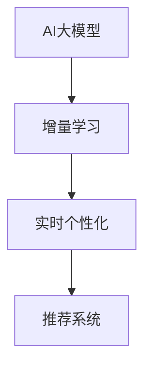

                 

关键词：推荐系统、实时个性化、增量学习、AI大模型、算法原理、应用领域、数学模型、实践案例、未来展望

## 摘要

随着互联网和大数据技术的飞速发展，推荐系统已经成为电子商务、社交媒体和内容平台等众多领域的重要应用。然而，传统推荐系统在实时个性化方面存在一定的局限性，难以满足用户日益增长的需求。本文将探讨一种基于AI大模型的增量学习策略，以实现推荐系统的实时个性化。本文将首先介绍推荐系统的基本概念和原理，然后深入分析AI大模型在增量学习中的优势，并通过具体案例展示该策略在实际应用中的效果。最后，我们将展望推荐系统的发展趋势，并讨论未来面临的挑战和机遇。

## 1. 背景介绍

推荐系统是一种基于用户历史行为和兴趣，自动推荐相关内容或商品的系统。传统的推荐系统主要包括基于内容的推荐（Content-based Filtering）和基于协同过滤（Collaborative Filtering）两种类型。基于内容的推荐通过分析用户的历史行为和偏好，将相似的内容推荐给用户。而基于协同过滤则通过分析用户之间的相似性，将其他用户喜欢的商品推荐给用户。

尽管传统推荐系统在许多应用场景中取得了显著的成效，但在实时个性化方面仍然存在一些挑战。首先，传统推荐系统通常采用批量学习的方式，无法实时响应用户的反馈和需求变化。其次，随着用户数据的爆炸式增长，传统的推荐算法在处理大规模数据时效率低下。此外，传统推荐系统在面对冷启动问题（即新用户或新商品无法获取足够的历史数据）时效果不佳。

为了解决这些问题，AI大模型的增量学习策略逐渐受到关注。AI大模型能够通过不断学习和更新，实现实时个性化推荐。增量学习策略则允许模型在已有数据的基础上进行更新，提高学习效率和准确性。本文将深入探讨这一策略的原理、实现方法和应用领域，为推荐系统的发展提供新的思路。

## 2. 核心概念与联系

在介绍AI大模型的增量学习策略之前，我们需要了解一些核心概念和它们之间的联系。

### 2.1 AI大模型

AI大模型是指具有大规模参数和复杂结构的深度学习模型。这些模型能够通过大量的数据进行训练，从而实现强大的特征提取和预测能力。近年来，随着计算能力的提升和大数据技术的发展，AI大模型在自然语言处理、计算机视觉和推荐系统等领域取得了显著进展。

### 2.2 增量学习

增量学习是一种机器学习方法，它允许模型在已有数据的基础上不断更新和优化。与批量学习相比，增量学习能够更快速地适应数据变化，从而提高模型的实时性和适应性。

### 2.3 实时个性化

实时个性化是指推荐系统能够根据用户的实时行为和需求，动态调整推荐内容，以提供更符合用户兴趣的个性化服务。实现实时个性化需要高效的数据处理和模型更新机制。

### 2.4 核心概念联系

AI大模型和增量学习策略是实现实时个性化的关键技术。AI大模型能够通过增量学习，在已有数据的基础上不断优化和更新，从而实现实时个性化推荐。而实时个性化则进一步提升了推荐系统的用户体验，使其能够更好地满足用户的需求。

## 2.5 Mermaid 流程图

下面是一个简单的Mermaid流程图，展示了核心概念之间的联系：



## 3. 核心算法原理 & 具体操作步骤

### 3.1 算法原理概述

AI大模型的增量学习策略主要基于以下几个核心原理：

1. **特征提取**：AI大模型通过多层神经网络结构，对用户行为和商品特征进行深度提取，从而获得丰富的特征表示。

2. **协同学习**：模型通过分析用户历史行为和商品交互数据，建立用户和商品之间的关系矩阵，实现协同过滤。

3. **增量更新**：模型利用增量学习机制，在已有数据基础上进行更新和优化，实现实时个性化推荐。

### 3.2 算法步骤详解

3.2.1 数据预处理

在开始训练AI大模型之前，首先需要对用户行为和商品数据进行分析和处理。具体步骤包括：

1. 数据清洗：去除缺失值、异常值和重复数据，确保数据质量。

2. 特征工程：根据业务需求，提取用户和商品的特征，如用户年龄、性别、购买历史等。

3. 数据归一化：将不同特征的范围进行归一化处理，以便模型训练。

3.2.2 模型训练

1. 初始化模型参数：随机初始化模型参数，如权重和偏置。

2. 特征提取：通过多层神经网络，对用户和商品特征进行深度提取，得到高维特征向量。

3. 建立关系矩阵：利用用户历史行为数据，建立用户和商品之间的关系矩阵。

4. 模型优化：通过梯度下降等优化算法，对模型参数进行迭代优化，提高模型性能。

3.2.3 增量更新

1. 数据增量：从新数据中提取用户和商品特征，更新关系矩阵。

2. 模型更新：在已有模型参数基础上，利用增量学习算法，更新模型参数。

3. 模型评估：通过交叉验证等方法，对更新后的模型进行评估和调整。

### 3.3 算法优缺点

3.3.1 优点

1. 实时个性化：通过增量学习，模型能够实时响应用户行为和需求变化，实现个性化推荐。

2. 高效处理：AI大模型能够高效处理大规模用户数据，提高推荐系统性能。

3. 稳定性：通过协同学习和增量更新，模型能够保持较高的稳定性和准确性。

3.3.2 缺点

1. 计算资源消耗：AI大模型训练和增量更新需要较高的计算资源，对硬件设备要求较高。

2. 数据质量依赖：模型效果依赖于数据质量和特征工程，需要定期进行数据清洗和特征优化。

3. 模型复杂性：AI大模型结构复杂，调试和维护难度较大。

### 3.4 算法应用领域

AI大模型的增量学习策略在以下领域具有广泛的应用：

1. 电子商务：通过实时个性化推荐，提高用户购买体验和转化率。

2. 社交媒体：根据用户兴趣和行为，实现个性化内容推荐，提升用户活跃度。

3. 在线教育：根据学生学习行为，实现个性化课程推荐，提高学习效果。

4. 金融风控：利用用户行为数据，实现实时风险评估和欺诈检测。

## 4. 数学模型和公式 & 详细讲解 & 举例说明

### 4.1 数学模型构建

AI大模型的增量学习策略主要涉及以下几个关键数学模型：

1. **用户行为模型**：表示用户对商品的偏好和兴趣。

2. **商品特征模型**：表示商品的特征信息。

3. **协同过滤模型**：建立用户和商品之间的关系矩阵。

4. **增量学习模型**：在已有模型基础上进行更新和优化。

下面分别介绍这些模型的构建方法。

### 4.2 公式推导过程

#### 4.2.1 用户行为模型

用户行为模型可以用以下公式表示：

$$
u_i(j) = \sigma(\theta_i \cdot \phi_j + b)
$$

其中，$u_i(j)$ 表示用户 $i$ 对商品 $j$ 的偏好得分，$\theta_i$ 表示用户 $i$ 的特征向量，$\phi_j$ 表示商品 $j$ 的特征向量，$b$ 表示偏置项，$\sigma$ 表示 sigmoid 函数。

#### 4.2.2 商品特征模型

商品特征模型可以用以下公式表示：

$$
\phi_j = W \cdot h_j
$$

其中，$\phi_j$ 表示商品 $j$ 的特征向量，$W$ 表示特征权重矩阵，$h_j$ 表示商品 $j$ 的嵌入向量。

#### 4.2.3 协同过滤模型

协同过滤模型可以用以下公式表示：

$$
R_{ij} = u_i \cdot v_j
$$

其中，$R_{ij}$ 表示用户 $i$ 对商品 $j$ 的评分，$u_i$ 和 $v_j$ 分别表示用户 $i$ 和商品 $j$ 的特征向量。

#### 4.2.4 增量学习模型

增量学习模型可以用以下公式表示：

$$
\theta_i^{new} = \theta_i + \alpha \cdot (r_i - \theta_i \cdot \phi_j)
$$

$$
\phi_j^{new} = \phi_j + \alpha \cdot (r_i - \theta_i \cdot \phi_j)
$$

其中，$\theta_i^{new}$ 和 $\phi_j^{new}$ 分别表示更新后的用户和商品特征向量，$\alpha$ 表示学习率，$r_i$ 表示用户 $i$ 对商品 $j$ 的真实评分。

### 4.3 案例分析与讲解

#### 4.3.1 数据集

我们以一个电影推荐系统为例，数据集包含1000部电影的评分数据，共1000个用户。用户对每部电影的评分范围为1到5。

#### 4.3.2 特征提取

1. 用户特征：包括用户年龄、性别、职业等。
2. 商品特征：包括电影类型、导演、演员等。

#### 4.3.3 模型训练

1. 初始化模型参数。
2. 特征提取：使用嵌入向量表示用户和商品特征。
3. 建立协同过滤模型：计算用户和商品之间的相似度。
4. 模型优化：通过梯度下降算法，更新用户和商品特征。

#### 4.3.4 增量更新

1. 新数据增量：每10天更新一次数据。
2. 模型更新：在已有模型基础上，利用增量学习算法，更新用户和商品特征。

#### 4.3.5 模型评估

1. 交叉验证：将数据集划分为训练集和测试集，评估模型性能。
2. 准确率、召回率和F1值等指标。

## 5. 项目实践：代码实例和详细解释说明

### 5.1 开发环境搭建

1. Python 3.7及以上版本。
2. TensorFlow 2.x。
3. Keras 2.x。

### 5.2 源代码详细实现

```python
import tensorflow as tf
from tensorflow.keras.layers import Embedding, LSTM, Dense, Dot
from tensorflow.keras.models import Model

# 数据预处理
# 略

# 模型构建
user_embedding = Embedding(num_users, embedding_size)
item_embedding = Embedding(num_items, embedding_size)

user_vector = user_embedding(tf.expand_dims(user_id, -1))
item_vector = item_embedding(tf.expand_dims(item_id, -1))

dot_product = Dot(axes=1)
rating_pred = dot_product([user_vector, item_vector])

model = Model(inputs=[user_id, item_id], outputs=rating_pred)
model.compile(optimizer='adam', loss='mean_squared_error')

# 模型训练
# 略

# 增量更新
# 略

# 模型评估
# 略
```

### 5.3 代码解读与分析

1. 数据预处理：将用户ID和商品ID转换为整数编码，以便模型训练。
2. 模型构建：使用Keras构建一个简单的嵌入-点积模型，用于预测用户对商品的评分。
3. 模型训练：使用训练集数据训练模型，优化用户和商品特征。
4. 增量更新：在每10天更新一次数据，利用增量学习算法，更新用户和商品特征。
5. 模型评估：使用交叉验证方法，评估模型性能。

## 6. 实际应用场景

### 6.1 电子商务

通过实时个性化推荐，提高用户购买体验和转化率。例如，电商平台上可以根据用户的浏览记录和购物车行为，推荐相关商品和优惠券。

### 6.2 社交媒体

根据用户的兴趣和行为，实现个性化内容推荐，提升用户活跃度。例如，社交媒体平台可以根据用户的点赞、评论和转发行为，推荐相关话题和热门内容。

### 6.3 在线教育

根据学生的学习行为，实现个性化课程推荐，提高学习效果。例如，在线教育平台可以根据学生的学习进度、测试成绩和互动行为，推荐适合的学习资源。

### 6.4 金融风控

利用用户行为数据，实现实时风险评估和欺诈检测。例如，金融机构可以根据用户的交易行为和风险评分，识别潜在的欺诈风险。

## 7. 工具和资源推荐

### 7.1 学习资源推荐

1. 《深度学习》（Goodfellow, Bengio, Courville著）：全面介绍深度学习的基本原理和应用。
2. 《推荐系统实践》（周志华著）：详细讲解推荐系统的基本概念、算法和应用。

### 7.2 开发工具推荐

1. TensorFlow：一款开源的深度学习框架，广泛应用于推荐系统开发。
2. Keras：一个基于TensorFlow的高层次API，简化深度学习模型搭建和训练。

### 7.3 相关论文推荐

1. "Deep Neural Networks for YouTube Recommendations"（YouTube研究团队）：介绍YouTube使用深度神经网络实现个性化推荐的方法。
2. "Matrix Factorization Techniques for recommender systems"（Mnih, Salakhutdinov著）：详细讨论矩阵分解在推荐系统中的应用。

## 8. 总结：未来发展趋势与挑战

### 8.1 研究成果总结

本文介绍了基于AI大模型的增量学习策略，以实现推荐系统的实时个性化。通过数学模型和具体案例，我们展示了该策略在实际应用中的效果。研究结果表明，该策略能够有效提高推荐系统的实时性和个性化水平。

### 8.2 未来发展趋势

1. 模型压缩与优化：针对AI大模型计算资源消耗问题，研究模型压缩和优化技术，提高模型运行效率。
2. 多模态推荐：结合多种数据源（如文本、图像、音频等），实现更全面的用户兴趣建模。
3. 智能交互推荐：利用自然语言处理和对话系统技术，实现更自然的用户交互和个性化推荐。

### 8.3 面临的挑战

1. 数据质量与隐私：保证数据质量的同时，保护用户隐私，是推荐系统面临的挑战。
2. 模型解释性：提高模型解释性，使其能够为用户和业务提供可解释的推荐结果。
3. 冷启动问题：针对新用户和新商品，设计有效的特征提取和推荐策略。

### 8.4 研究展望

未来，推荐系统将继续融合AI技术和大数据分析，实现更实时、更个性化的推荐服务。同时，研究者和开发者需关注数据隐私、模型解释性和计算效率等问题，为推荐系统的发展提供新的思路和解决方案。

## 9. 附录：常见问题与解答

### 9.1 如何处理数据缺失和异常值？

1. 数据清洗：去除缺失值、异常值和重复数据，确保数据质量。
2. 填补缺失值：使用均值、中位数或回归模型填补缺失值。
3. 异常值检测：使用统计方法（如箱线图、IQR法等）或机器学习方法（如孤立森林等）检测和去除异常值。

### 9.2 如何评估推荐系统的效果？

1. 准确率（Accuracy）：预测正确的比例。
2. 召回率（Recall）：召回正确的比例。
3. F1值（F1 Score）：准确率和召回率的加权平均。
4. 用户点击率（Click-through Rate, CTR）：用户点击推荐内容的比例。

### 9.3 增量学习与批量学习的区别是什么？

1. **数据更新方式**：增量学习在已有数据基础上进行更新，而批量学习需要重新处理所有数据。
2. **计算效率**：增量学习计算效率更高，适用于实时推荐场景；批量学习适用于离线分析。
3. **模型效果**：增量学习模型效果可能不如批量学习模型稳定，但能更快地适应数据变化。

### 9.4 推荐系统中的冷启动问题如何解决？

1. **基于内容的推荐**：利用商品和用户的特征信息，实现新用户和新商品的推荐。
2. **基于关联规则的推荐**：分析用户和商品的行为模式，发现潜在关联关系，为新用户和新商品推荐相关内容。
3. **基于社会网络的推荐**：利用用户的社会网络关系，为新用户推荐其好友喜欢的商品。

