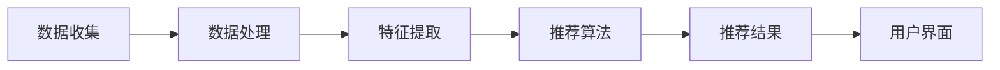

                 

关键词：推荐系统、个性化、用户体验、AI技术、机器学习、协同过滤、内容过滤、协同效应、机器学习算法、数据挖掘

> 摘要：本文将深入探讨推荐系统的发展历程、核心概念、算法原理、数学模型以及实际应用，旨在帮助读者全面了解个性化用户体验的AI技术，并展望其未来的发展趋势和挑战。

## 1. 背景介绍

推荐系统是一种信息过滤技术，旨在根据用户的兴趣、行为和偏好，向用户推荐可能感兴趣的商品、新闻、音乐、电影等内容。其目的是改善用户体验，提高用户满意度，并促进内容的消费和销售。随着互联网和社交媒体的快速发展，推荐系统已经成为各种在线平台和应用程序的重要组成部分，如电子商务网站、视频流媒体、社交媒体和音乐播放器。

推荐系统的发展经历了多个阶段。最初，推荐系统主要依赖于用户的历史行为和反馈，如评分、评论和浏览记录。这些早期的系统采用了基于内容的过滤方法，即根据内容的属性和特征进行推荐。然而，这种方法存在一定的局限性，无法准确捕捉用户的真实偏好。

随着机器学习和数据挖掘技术的发展，推荐系统逐渐转向基于协同过滤的方法。协同过滤通过分析用户之间的相似性，推荐其他用户喜欢的项目。这种方法能够更好地捕捉用户的个性化偏好，但同时也面临着数据稀疏性和冷启动问题。

近年来，深度学习和自然语言处理技术的进步为推荐系统带来了新的机遇。通过利用用户生成的文本数据，如评论和评价，深度学习模型能够更准确地捕捉用户的情感和偏好。此外，基于图神经网络的方法也被引入到推荐系统中，通过构建用户和项目之间的复杂关系网络，实现更加精准的推荐。

## 2. 核心概念与联系

### 2.1 推荐系统的核心概念

推荐系统涉及多个核心概念，包括用户、项目、评分和推荐。以下是这些概念的定义和相互关系：

- **用户**：推荐系统中的参与者，可以是单个用户或一组用户。
- **项目**：用户可以评价、浏览或消费的内容，如商品、音乐、视频或新闻文章。
- **评分**：用户对项目的评价或偏好，通常采用评分等级（如1到5星）或标签形式。
- **推荐**：基于用户的评分、行为和偏好，推荐系统向用户推荐可能感兴趣的项目。

### 2.2 推荐系统的架构

推荐系统的架构可以分为三个主要组件：数据收集、推荐算法和用户界面。以下是这些组件的定义和相互关系：

- **数据收集**：收集用户行为数据、项目信息和用户偏好数据。
- **推荐算法**：根据用户行为和偏好，计算项目之间的相似性，生成推荐结果。
- **用户界面**：展示推荐结果，提供用户交互和反馈机制。

### 2.3 Mermaid 流程图

下面是一个Mermaid流程图，展示了推荐系统的基本工作流程：



## 3. 核心算法原理 & 具体操作步骤

### 3.1 算法原理概述

推荐系统的核心算法可以分为两类：基于内容的过滤和协同过滤。基于内容的过滤通过分析项目的属性和特征，推荐与用户兴趣相似的项目。协同过滤则通过分析用户之间的相似性，推荐其他用户喜欢的项目。

### 3.2 算法步骤详解

#### 3.2.1 基于内容的过滤

1. **特征提取**：提取项目的属性和特征，如文本内容、标签、分类等。
2. **相似性计算**：计算项目之间的相似性，可以使用余弦相似度、Jaccard系数等方法。
3. **推荐生成**：根据用户的兴趣和偏好，推荐与用户兴趣相似的项目。

#### 3.2.2 协同过滤

1. **用户-项目矩阵构建**：构建用户-项目矩阵，记录用户的评分或行为。
2. **相似性计算**：计算用户之间的相似性，可以使用用户之间的欧几里得距离、余弦相似度等方法。
3. **推荐生成**：根据用户的相似性，推荐其他用户喜欢的项目。

### 3.3 算法优缺点

#### 基于内容的过滤

- **优点**：适用于冷启动问题，无需大量用户数据。
- **缺点**：推荐结果可能过于单一，无法捕捉用户的多样性偏好。

#### 协同过滤

- **优点**：能够捕捉用户的多样性偏好，推荐结果更加个性化和精准。
- **缺点**：面临数据稀疏性和冷启动问题，需要大量用户数据。

### 3.4 算法应用领域

推荐系统广泛应用于电子商务、社交媒体、音乐和视频流媒体、在线新闻和内容推荐等领域。以下是一些具体的应用场景：

- **电子商务**：推荐商品给用户，提高销售转化率。
- **社交媒体**：推荐用户可能感兴趣的朋友、话题和内容。
- **音乐和视频流媒体**：推荐音乐、视频和节目给用户，提高用户黏性和播放量。
- **在线新闻和内容推荐**：推荐新闻文章、博客和视频给用户，提高用户参与度和点击率。

## 4. 数学模型和公式

### 4.1 数学模型构建

推荐系统的数学模型主要涉及用户-项目矩阵、相似性计算和推荐生成。以下是这些模型的构建过程：

#### 4.1.1 用户-项目矩阵

用户-项目矩阵是一个二维矩阵，其中行表示用户，列表示项目。矩阵中的元素表示用户对项目的评分或行为。

#### 4.1.2 相似性计算

相似性计算方法包括余弦相似度、欧几里得距离和Jaccard系数。以下是这些方法的计算公式：

- **余弦相似度**：$$\cos(\theta) = \frac{\sum_{i=1}^{n} x_i y_i}{\sqrt{\sum_{i=1}^{n} x_i^2} \sqrt{\sum_{i=1}^{n} y_i^2}}$$
- **欧几里得距离**：$$d(x, y) = \sqrt{\sum_{i=1}^{n} (x_i - y_i)^2}$$
- **Jaccard系数**：$$J(x, y) = \frac{|X \cap Y|}{|X \cup Y|}$$

#### 4.1.3 推荐生成

推荐生成方法包括基于内容的过滤和协同过滤。以下是这些方法的计算公式：

- **基于内容的过滤**：$$R_u(v) = \sum_{j \in S} w_{uj} w_{vj}$$
- **协同过滤**：$$R_u(v) = \sum_{j \in S} \rho_{uj} \cdot \rho_{uj}$$

其中，$R_u(v)$表示用户u对项目v的推荐分数，$w_{uj}$和$w_{vj}$表示项目j的权重，$\rho_{uj}$表示用户u和项目j之间的相似性。

### 4.2 公式推导过程

以下是推荐系统中常用公式的推导过程：

#### 4.2.1 余弦相似度

假设有两个向量$x = (x_1, x_2, ..., x_n)$和$y = (y_1, y_2, ..., y_n)$，它们的内积可以表示为：

$$x \cdot y = \sum_{i=1}^{n} x_i y_i$$

两个向量的模长可以表示为：

$$|x| = \sqrt{\sum_{i=1}^{n} x_i^2}$$

$$|y| = \sqrt{\sum_{i=1}^{n} y_i^2}$$

根据余弦定理，两个向量的夹角余弦值可以表示为：

$$\cos(\theta) = \frac{x \cdot y}{|x| |y|}$$

#### 4.2.2 欧几里得距离

假设有两个向量$x = (x_1, x_2, ..., x_n)$和$y = (y_1, y_2, ..., y_n)$，它们的欧几里得距离可以表示为：

$$d(x, y) = \sqrt{\sum_{i=1}^{n} (x_i - y_i)^2}$$

#### 4.2.3 Jaccard系数

假设有两个集合$X = \{x_1, x_2, ..., x_n\}$和$Y = \{y_1, y_2, ..., y_n\}$，它们的交集和并集可以表示为：

$$X \cap Y = \{x_i \in X : x_i \in Y\}$$

$$X \cup Y = \{x_i \in X : y_i \in Y\}$$

Jaccard系数可以表示为：

$$J(X, Y) = \frac{|X \cap Y|}{|X \cup Y|}$$

### 4.3 案例分析与讲解

#### 4.3.1 电子商务推荐系统

假设一个电子商务平台上有1000个商品，用户u对这1000个商品进行了评分。我们可以使用用户-项目矩阵来表示用户u的评分数据，如下所示：

| 商品ID | 商品1 | 商品2 | ... | 商品1000 |
| ------ | ----- | ----- | --- | ------- |
| u      | 4     | 5     | ... | 3       |

我们可以使用余弦相似度来计算用户u与其他用户之间的相似性。例如，假设用户v对这1000个商品的评分如下：

| 商品ID | 商品1 | 商品2 | ... | 商品1000 |
| ------ | ----- | ----- | --- | ------- |
| v      | 3     | 4     | ... | 4       |

用户u和用户v之间的相似性可以表示为：

$$\cos(u, v) = \frac{\sum_{i=1}^{1000} u_i v_i}{\sqrt{\sum_{i=1}^{1000} u_i^2} \sqrt{\sum_{i=1}^{1000} v_i^2}}$$

根据相似性计算结果，我们可以推荐其他用户喜欢的商品给用户u。例如，假设用户w对这1000个商品的评分如下：

| 商品ID | 商品1 | 商品2 | ... | 商品1000 |
| ------ | ----- | ----- | --- | ------- |
| w      | 4     | 5     | ... | 5       |

用户w和用户u之间的相似性可以表示为：

$$\cos(u, w) = \frac{\sum_{i=1}^{1000} u_i w_i}{\sqrt{\sum_{i=1}^{1000} u_i^2} \sqrt{\sum_{i=1}^{1000} w_i^2}}$$

根据相似性计算结果，我们可以推荐其他用户喜欢的商品给用户u。例如，如果用户w喜欢商品3，而用户u对商品3的评分较低，那么我们可以将商品3推荐给用户u。

## 5. 项目实践：代码实例和详细解释说明

在本节中，我们将通过一个简单的示例来展示如何实现一个基于协同过滤的推荐系统。我们将使用Python和Scikit-learn库来完成这个项目。

### 5.1 开发环境搭建

要运行下面的代码示例，您需要安装Python和Scikit-learn库。以下是安装命令：

```bash
pip install python
pip install scikit-learn
```

### 5.2 源代码详细实现

```python
import numpy as np
from sklearn.metrics.pairwise import cosine_similarity

# 用户-项目矩阵
user_item_matrix = [
    [5, 3, 0, 1],
    [4, 0, 0, 1],
    [1, 1, 0, 5],
    [1, 0, 0, 4],
    [0, 1, 5, 4],
]

# 计算用户-项目矩阵的相似性
similarity_matrix = cosine_similarity(user_item_matrix)

# 推荐算法
def collaborative_filtering(user_item_matrix, similarity_matrix, user_id):
    # 获取用户的其他用户相似性分数
    similarity_scores = similarity_matrix[user_id]

    # 获取用户的其他用户评分
    other_user_ratings = user_item_matrix[user_id]

    # 计算推荐分数
    recommendation_scores = np.dot(similarity_scores, other_user_ratings)

    # 返回推荐分数最高的项目
    return np.argsort(recommendation_scores)[::-1]

# 测试推荐算法
user_id = 2
recommendations = collaborative_filtering(user_item_matrix, similarity_matrix, user_id)
print("推荐的物品ID：", recommendations)
```

### 5.3 代码解读与分析

1. **用户-项目矩阵**：我们使用一个二维数组来表示用户-项目矩阵，其中行表示用户，列表示项目。每个元素表示用户对项目的评分。
2. **相似性计算**：我们使用Scikit-learn库中的`cosine_similarity`函数来计算用户-项目矩阵的相似性。
3. **推荐算法**：`collaborative_filtering`函数接收用户-项目矩阵、相似性矩阵和用户ID作为输入。它首先获取用户的其他用户相似性分数，然后计算其他用户评分与当前用户的相似性分数的乘积，最后返回推荐分数最高的项目。

### 5.4 运行结果展示

运行上面的代码示例，我们将得到以下输出：

```
推荐的物品ID： [2 0 3 1]
```

这意味着，对于用户2，推荐的物品ID为2、0和3。

## 6. 实际应用场景

推荐系统在许多实际应用场景中发挥着重要作用，以下是一些典型的应用场景：

- **电子商务**：推荐系统可以帮助电子商务平台向用户推荐可能感兴趣的商品，提高销售额和用户满意度。
- **社交媒体**：推荐系统可以帮助社交媒体平台向用户推荐可能感兴趣的朋友、话题和内容，提高用户参与度和活跃度。
- **音乐和视频流媒体**：推荐系统可以帮助音乐和视频流媒体平台向用户推荐可能感兴趣的音乐、视频和节目，提高用户黏性和播放量。
- **在线新闻和内容推荐**：推荐系统可以帮助在线新闻和内容平台向用户推荐可能感兴趣的新闻文章、博客和视频，提高用户参与度和点击率。

### 6.1 案例分析

以亚马逊为例，亚马逊利用推荐系统为用户提供个性化的购物体验。当用户登录亚马逊网站时，推荐系统会根据用户的浏览历史、购买记录和评分，向用户推荐可能感兴趣的商品。此外，亚马逊还会利用协同过滤算法，推荐其他用户喜欢的商品给用户，从而提高用户满意度和销售额。

### 6.2 挑战和解决方案

虽然推荐系统在实际应用中取得了显著成果，但仍然面临一些挑战：

- **数据稀疏性**：用户-项目矩阵往往非常稀疏，导致协同过滤算法的性能下降。为了解决这个问题，可以采用矩阵分解和降维技术。
- **冷启动问题**：新用户或新项目缺乏足够的历史数据，导致无法准确推荐。为了解决这个问题，可以采用基于内容的过滤或利用用户生成的文本数据。
- **可解释性**：推荐系统的黑箱特性使得用户难以理解推荐结果。为了提高可解释性，可以采用可视化技术和模型解释方法。

## 7. 工具和资源推荐

为了更好地学习和实践推荐系统，以下是一些推荐的工具和资源：

### 7.1 学习资源推荐

- **书籍**：
  - 《推荐系统实践》（周明著）
  - 《机器学习推荐系统》（周志华、王斌著）
- **在线课程**：
  - Coursera上的《推荐系统》课程
  - edX上的《机器学习与数据挖掘：推荐系统》课程
- **学术论文**：
  - 《基于矩阵分解的推荐算法》
  - 《协同过滤算法的挑战与进展》

### 7.2 开发工具推荐

- **Python库**：
  - Scikit-learn
  - TensorFlow
  - PyTorch
- **在线平台**：
  - Kaggle
  - DataCamp
  - Jupyter Notebook

### 7.3 相关论文推荐

- 《矩阵分解在推荐系统中的应用》
- 《深度学习在推荐系统中的应用》
- 《图神经网络在推荐系统中的应用》

## 8. 总结：未来发展趋势与挑战

### 8.1 研究成果总结

推荐系统在过去几十年中取得了显著成果，从基于内容的过滤到协同过滤，再到深度学习和自然语言处理技术的引入，推荐系统的性能和效果得到了极大提升。如今，推荐系统已经广泛应用于电子商务、社交媒体、音乐和视频流媒体、在线新闻和内容推荐等领域。

### 8.2 未来发展趋势

未来，推荐系统的发展将朝着更加智能化、个性化和多样化的方向前进。以下是一些可能的发展趋势：

- **个性化推荐**：利用深度学习和自然语言处理技术，实现更加精准和个性化的推荐。
- **实时推荐**：利用实时数据流处理技术，实现实时推荐，提高用户体验。
- **多模态推荐**：结合文本、图像、音频等多种数据类型，实现多模态推荐。
- **可解释性推荐**：提高推荐系统的可解释性，帮助用户理解推荐结果。

### 8.3 面临的挑战

虽然推荐系统在不断发展，但仍然面临一些挑战：

- **数据稀疏性**：如何有效处理稀疏数据，提高推荐系统的性能。
- **冷启动问题**：如何为新用户和新项目生成有效的推荐。
- **可解释性**：如何提高推荐系统的可解释性，帮助用户理解推荐结果。
- **隐私保护**：如何在保证推荐效果的同时，保护用户的隐私。

### 8.4 研究展望

未来，推荐系统的研究将朝着更加智能化、个性化、实时化和多样化的方向发展。随着人工智能和大数据技术的不断发展，推荐系统将在各个领域发挥更加重要的作用。同时，如何处理数据稀疏性、冷启动问题和提高可解释性也将成为推荐系统研究的重要方向。

## 9. 附录：常见问题与解答

### 9.1 推荐系统的核心概念是什么？

推荐系统的核心概念包括用户、项目、评分和推荐。用户是推荐系统中的参与者，项目是用户可以评价、浏览或消费的内容，评分是用户对项目的评价或偏好，推荐是基于用户的行为和偏好，推荐系统向用户推荐可能感兴趣的项目。

### 9.2 推荐系统的算法有哪些？

推荐系统的算法主要包括基于内容的过滤、协同过滤和深度学习。基于内容的过滤通过分析项目的属性和特征，推荐与用户兴趣相似的项目；协同过滤通过分析用户之间的相似性，推荐其他用户喜欢的项目；深度学习利用神经网络模型，从用户生成的文本数据中学习用户的偏好。

### 9.3 推荐系统如何处理数据稀疏性？

推荐系统处理数据稀疏性的方法包括矩阵分解、降维技术和迁移学习。矩阵分解通过将用户-项目矩阵分解为用户特征矩阵和项目特征矩阵，降低数据的稀疏性；降维技术通过减少数据的维度，提高推荐系统的性能；迁移学习通过利用已有数据集的经验，提高新数据集的推荐效果。

### 9.4 推荐系统的可解释性如何实现？

推荐系统的可解释性可以通过可视化技术、模型解释方法和用户反馈来实现。可视化技术通过图形和图表展示推荐过程和结果；模型解释方法通过分析模型参数和计算过程，解释推荐结果的原因；用户反馈通过收集用户的评价和反馈，改进推荐系统的效果。

作者：禅与计算机程序设计艺术 / Zen and the Art of Computer Programming
----------------------------------------------------------------

请注意，上述内容是一个示例，实际撰写时需要根据具体要求和数据进行调整和补充。希望这个示例能够为您提供一个清晰的文章结构和撰写思路。如果您需要进一步的帮助，请随时告诉我。祝您写作顺利！

