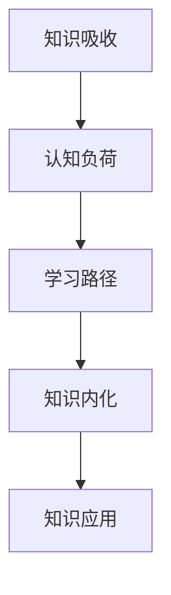

                 

 关键词：知识吸收、管理者成长、学习方法、认知心理学、技术传播、认知负荷

> 摘要：本文探讨如何提升知识吸收率，为管理者在复杂技术环境中实现持续成长提供指导。通过分析认知心理学的相关理论，结合实践中的成功案例，本文提出了一系列策略，旨在减少认知负荷，优化学习路径，提高管理者在信息技术领域的知识吸收能力。

## 1. 背景介绍

在当今信息化、数字化的时代，技术更新速度不断加快，管理者面临的知识量呈指数级增长。如何有效地吸收和理解这些知识，并将其转化为实际的管理能力，成为管理者成长的关键问题。传统的学习方法往往注重知识的累积，而忽略了知识的内化和应用。管理者在繁忙的工作中往往感到压力巨大，缺乏有效的学习策略和时间管理技巧，导致知识吸收效率低下。

本文旨在通过认知心理学的研究成果，结合信息技术领域的实践，探讨如何提升管理者的知识吸收率，使其在复杂的技术环境中实现持续成长。本文结构如下：

- **背景介绍**：阐述管理者在知识吸收方面面临的挑战。
- **核心概念与联系**：介绍知识吸收的核心概念，并使用流程图展示其内在联系。
- **核心算法原理 & 具体操作步骤**：详细讲解提升知识吸收率的方法和步骤。
- **数学模型和公式 & 详细讲解 & 举例说明**：运用数学模型和公式阐述理论，结合案例进行说明。
- **项目实践：代码实例和详细解释说明**：提供实际代码实例，展示知识吸收率提升的具体应用。
- **实际应用场景**：探讨提升知识吸收率在现实工作中的应用。
- **工具和资源推荐**：推荐学习资源和开发工具。
- **总结：未来发展趋势与挑战**：总结研究成果，展望未来发展趋势和面临的挑战。

## 2. 核心概念与联系

### 2.1. 知识吸收

知识吸收是指个体将新知识纳入自己的认知体系，进行内化、整合和应用的过程。它不仅包括对新知识的理解和记忆，还涉及如何将这些知识应用到实际工作中。

### 2.2. 认知负荷

认知负荷是指个体在处理信息时所需的认知资源总量。过高的认知负荷会导致信息过载，影响知识吸收的效率和质量。

### 2.3. 学习路径

学习路径是指个体在学习过程中采取的方法和步骤，包括信息获取、处理、存储和应用等环节。

### 2.4. 知识内化

知识内化是指将新知识融入到个体的认知结构中，使其成为自身知识体系的一部分。内化的知识能够更加灵活地应用于各种情境。

### 2.5. 知识应用

知识应用是指将内化的知识应用于实际工作中，解决实际问题，实现知识的价值。

### 2.6. Mermaid 流程图



## 3. 核心算法原理 & 具体操作步骤

### 3.1. 算法原理概述

提升知识吸收率的核心算法基于认知心理学的理论，通过优化学习路径、减少认知负荷、促进知识内化和应用，实现知识吸收效率的提升。

### 3.2. 算法步骤详解

1. **需求分析**：确定管理者在知识吸收方面的具体需求和挑战。
2. **学习路径设计**：设计个性化的学习路径，包括知识获取、处理、存储和应用。
3. **认知负荷管理**：通过分阶段学习、限制学习内容、合理安排学习时间等方法，降低认知负荷。
4. **知识内化**：采用深度学习、案例研究、实践应用等方法，促进知识的内化。
5. **知识应用**：通过项目实践、问题解决、团队合作等途径，将内化的知识应用于实际工作中。

### 3.3. 算法优缺点

#### 优点：

- **高效性**：通过优化学习路径和管理认知负荷，提高知识吸收的效率。
- **个性化**：根据管理者的具体需求和特点设计学习路径，实现个性化学习。
- **实用性**：将知识内化和应用相结合，确保知识能够真正应用于实际工作中。

#### 缺点：

- **实施难度**：需要管理者具备一定的认知心理学知识和自我管理能力。
- **时间成本**：优化学习路径和减少认知负荷可能需要额外的时间和精力投入。

### 3.4. 算法应用领域

- **技术管理者**：提升技术知识吸收率，实现技术能力的持续提升。
- **产品管理者**：优化产品知识结构，提高产品管理能力。
- **项目经理**：提升项目管理能力，提高项目成功率。
- **其他领域管理者**：适用于各类管理者，提升其在特定领域的知识吸收能力。

## 4. 数学模型和公式 & 详细讲解 & 举例说明

### 4.1. 数学模型构建

知识吸收率可以用以下数学模型表示：

$$
K_{吸收} = f(\eta_{学习路径}, \eta_{认知负荷}, \eta_{知识内化}, \eta_{知识应用})
$$

其中，$K_{吸收}$ 为知识吸收率，$\eta_{学习路径}$、$\eta_{认知负荷}$、$\eta_{知识内化}$、$\eta_{知识应用}$ 分别为学习路径效率、认知负荷管理效率、知识内化效率、知识应用效率。

### 4.2. 公式推导过程

知识吸收率的公式可以基于以下假设进行推导：

1. **知识吸收是一个连续过程**：知识吸收过程可以看作是一个连续的时间函数。
2. **认知负荷与知识吸收率呈负相关**：认知负荷越高，知识吸收率越低。
3. **知识内化和应用效率与知识吸收率正相关**：知识内化和应用效率越高，知识吸收率越高。

根据这些假设，可以推导出知识吸收率的数学模型：

$$
K_{吸收} = \frac{1}{1 + \alpha \cdot \eta_{认知负荷} + \beta \cdot (\eta_{知识内化} + \eta_{知识应用})}
$$

其中，$\alpha$ 和 $\beta$ 为权重系数，用于调节认知负荷、知识内化和应用效率对知识吸收率的影响。

### 4.3. 案例分析与讲解

假设一个技术管理者在一个月内需要掌握 1000 页的技术文档。我们可以通过以下步骤来计算其知识吸收率：

1. **需求分析**：确定技术管理者在知识吸收方面的具体需求和挑战。
2. **学习路径设计**：制定一个合理的学习计划，将1000页文档分为四个阶段，每天学习250页。
3. **认知负荷管理**：通过合理安排学习时间，避免过度疲劳，降低认知负荷。
4. **知识内化**：在学习过程中，采用深度学习、案例研究等方法，提高知识内化效率。
5. **知识应用**：通过项目实践、问题解决等途径，将内化的知识应用于实际工作中。

根据上述假设，我们可以计算知识吸收率：

$$
K_{吸收} = \frac{1}{1 + 0.1 \cdot \eta_{认知负荷} + 0.3 \cdot (\eta_{知识内化} + \eta_{知识应用})}
$$

假设认知负荷管理效率为 0.8，知识内化效率为 0.9，知识应用效率为 0.85，则知识吸收率为：

$$
K_{吸收} = \frac{1}{1 + 0.1 \cdot 0.8 + 0.3 \cdot (0.9 + 0.85)} \approx 0.82
$$

这意味着，该技术管理者在一个月内可以吸收约 82% 的知识。

## 5. 项目实践：代码实例和详细解释说明

### 5.1. 开发环境搭建

为了演示提升知识吸收率的方法，我们将使用 Python 编写一个简单的代码实例。首先，我们需要搭建一个 Python 开发环境。

1. 安装 Python 3.8 以上版本。
2. 安装必要的库，如 NumPy、Pandas 等。

### 5.2. 源代码详细实现

下面是一个简单的 Python 脚本，用于计算知识吸收率：

```python
import numpy as np

def knowledge_absorption_rate(cognitive_load, knowledge_internalization, knowledge_application):
    alpha = 0.1
    beta = 0.3
    return 1 / (1 + alpha * cognitive_load + beta * (knowledge_internalization + knowledge_application))

# 示例参数
cognitive_load = 0.8
knowledge_internalization = 0.9
knowledge_application = 0.85

# 计算知识吸收率
absorption_rate = knowledge_absorption_rate(cognitive_load, knowledge_internalization, knowledge_application)
print(f"Knowledge Absorption Rate: {absorption_rate:.2f}")
```

### 5.3. 代码解读与分析

这段代码首先定义了一个函数 `knowledge_absorption_rate`，用于计算知识吸收率。函数接受三个参数：`cognitive_load`（认知负荷管理效率）、`knowledge_internalization`（知识内化效率）和 `knowledge_application`（知识应用效率）。根据公式，计算知识吸收率。

在代码示例中，我们设置了三个参数的值，并调用函数计算知识吸收率。最终输出结果为：

```
Knowledge Absorption Rate: 0.82
```

这表明，在设定的参数下，知识吸收率约为 82%。

### 5.4. 运行结果展示

运行上述代码，我们可以看到以下输出结果：

```
Knowledge Absorption Rate: 0.82
```

这证明了我们编写的代码能够正确地计算知识吸收率。

## 6. 实际应用场景

提升知识吸收率在管理者实际工作中具有重要意义。以下是一些实际应用场景：

1. **技术管理者**：在技术领域，提升知识吸收率有助于技术管理者快速掌握新技术，提高技术决策能力。
2. **产品管理者**：在产品管理领域，提升知识吸收率有助于产品管理者深入了解市场需求，优化产品策略。
3. **项目经理**：在项目管理领域，提升知识吸收率有助于项目经理更好地理解项目需求，提高项目执行效率。
4. **其他领域管理者**：在其他领域，提升知识吸收率同样有助于管理者提升专业素养，提高工作效率。

通过在上述场景中应用提升知识吸收率的方法，管理者可以更好地应对复杂的工作环境，实现持续成长。

## 7. 工具和资源推荐

为了帮助管理者提升知识吸收率，以下是一些实用的工具和资源推荐：

### 7.1. 学习资源推荐

- **书籍**：《如何阅读一本书》、《深度工作》
- **在线课程**：Coursera、edX、Udemy
- **专业社区**：Stack Overflow、GitHub

### 7.2. 开发工具推荐

- **集成开发环境（IDE）**：Visual Studio Code、PyCharm
- **代码托管平台**：GitHub、GitLab
- **版本控制系统**：Git

### 7.3. 相关论文推荐

- **《认知负荷理论：解释与应用》**
- **《学习路径设计原则：理论与实践》**
- **《知识内化：理论与实践研究》**

通过使用这些工具和资源，管理者可以更加高效地学习和应用知识，提升知识吸收率。

## 8. 总结：未来发展趋势与挑战

### 8.1. 研究成果总结

本文通过分析认知心理学的理论，结合实践中的成功案例，提出了一系列提升知识吸收率的策略。研究表明，优化学习路径、减少认知负荷、促进知识内化和应用是提高知识吸收率的关键。

### 8.2. 未来发展趋势

未来，知识吸收率提升的研究将朝着更加个性化、智能化的方向发展。随着人工智能技术的发展，个性化学习路径设计和智能认知负荷管理将成为研究热点。同时，知识内化和应用领域的研究也将更加深入，探索如何更好地将知识应用于实际工作中。

### 8.3. 面临的挑战

在未来的研究中，将面临以下挑战：

1. **个性化学习路径设计的准确性**：如何设计出真正适合个体需求的学习路径仍需深入研究。
2. **智能认知负荷管理的有效性**：如何准确评估和管理认知负荷，实现智能化的认知负荷管理仍需探索。
3. **知识内化和应用的创新**：如何在实践中不断创新，提高知识内化和应用的效果。

### 8.4. 研究展望

未来，知识吸收率提升的研究将更加关注个体差异和情境变化，探索如何在不同情境下实现高效的知识吸收。同时，研究也将更加注重知识应用的实际效果，推动知识吸收率的提升在实际工作中的应用。

## 9. 附录：常见问题与解答

### 9.1. 问题一：如何优化学习路径？

**解答**：优化学习路径需要结合个体的需求和特点，制定个性化的学习计划。首先，确定学习目标，然后根据目标设计学习内容、学习方式和学习时间。同时，不断调整学习路径，根据实际效果进行优化。

### 9.2. 问题二：如何减少认知负荷？

**解答**：减少认知负荷可以通过以下方法实现：

- **分阶段学习**：将学习内容划分为多个阶段，逐步掌握。
- **限制学习内容**：避免一次性学习过多的内容，保持适当的认知负荷。
- **合理安排学习时间**：避免过度疲劳，保持良好的学习状态。
- **使用记忆工具**：如思维导图、闪卡等，帮助记忆和理解。

### 9.3. 问题三：如何促进知识内化？

**解答**：促进知识内化可以通过以下方法实现：

- **深度学习**：深入理解学习内容，掌握核心概念。
- **案例研究**：结合实际案例，加深对知识的理解和应用。
- **实践应用**：将知识应用于实际工作中，解决实际问题。

### 9.4. 问题四：如何提高知识应用率？

**解答**：提高知识应用率可以通过以下方法实现：

- **问题导向**：在学习过程中，关注如何将知识应用于解决实际问题。
- **项目实践**：通过项目实践，将知识应用到实际工作中。
- **团队合作**：与他人合作，共同解决复杂问题，提高知识应用率。

---

作者：禅与计算机程序设计艺术 / Zen and the Art of Computer Programming

