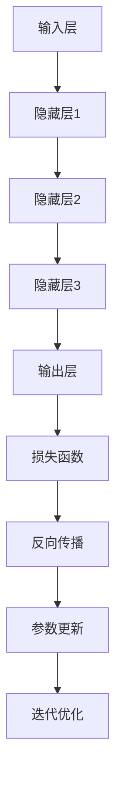

                 

关键词：大模型，商业转化率，策略，人工智能，深度学习，模型优化，数据处理

摘要：本文深入探讨了如何提高大模型的商业转化率，首先介绍了大模型在商业应用中的重要性，然后分析了当前大模型应用中存在的主要问题。在此基础上，从算法优化、数据处理、模型评估和商业策略等多个方面提出了具体的提升策略。文章旨在为企业和开发者提供一套实用的方法和指南，帮助他们在竞争激烈的市场中更好地利用大模型的技术优势，实现商业价值的最大化。

## 1. 背景介绍

随着人工智能技术的飞速发展，深度学习已成为推动各行各业变革的重要力量。其中，大模型（也称为大型神经网络模型）凭借其强大的学习能力和对复杂数据的处理能力，逐渐成为各个领域研究和应用的热点。无论是自然语言处理、计算机视觉，还是推荐系统、自动驾驶等，大模型都展现出了令人瞩目的性能。

在商业领域，大模型的应用为企业的数字化转型提供了新的机遇。例如，通过大模型进行精准的市场预测、用户行为分析、个性化推荐等，企业能够更好地把握市场动态，提高决策效率，实现商业价值最大化。然而，大模型的商业转化并非一蹴而就，需要从多个方面进行深入优化和策略制定。

### 大模型在商业应用中的重要性

1. **精准预测市场趋势**：大模型能够通过对大量历史数据的分析，预测未来的市场趋势，帮助企业在竞争中抢占先机。
2. **优化运营决策**：通过分析企业内部的运营数据，大模型可以为企业的生产计划、库存管理、供应链优化等提供科学依据，降低成本，提高效率。
3. **提升客户体验**：大模型能够分析用户行为数据，提供个性化的产品推荐和服务，提升用户的满意度和忠诚度。
4. **增强风险管理**：大模型可以识别潜在的业务风险，提前采取措施，降低企业损失。

### 当前大模型应用中存在的问题

尽管大模型在商业应用中具有巨大的潜力，但实际应用中仍面临以下问题：

1. **数据质量不佳**：大模型对数据质量要求极高，但很多企业的数据存在噪声、缺失和不一致等问题，导致模型效果不佳。
2. **模型复杂性高**：大模型结构复杂，参数众多，调试和优化过程繁琐，开发成本高。
3. **计算资源需求大**：大模型训练和推理过程需要大量的计算资源，对硬件设施的要求较高。
4. **隐私和安全问题**：大模型涉及大量敏感数据，存在隐私泄露和滥用风险。

## 2. 核心概念与联系

为了更好地理解和应用大模型，我们需要掌握一些核心概念，并了解它们之间的联系。

### 大模型的组成

大模型通常由以下几个部分组成：

1. **输入层**：接收外部输入，如文本、图像、语音等。
2. **隐藏层**：进行特征提取和变换，层数和神经元数量可以根据需求设计。
3. **输出层**：生成预测结果或决策。

### 大模型的工作原理

大模型通过反向传播算法进行训练。训练过程主要包括以下几个步骤：

1. **前向传播**：输入数据经过神经网络，生成预测结果。
2. **损失函数**：计算预测结果与真实结果的差异，得到损失值。
3. **反向传播**：计算损失关于模型参数的梯度，更新模型参数。
4. **迭代优化**：重复以上步骤，直到模型达到预期效果。

### Mermaid 流程图

下面是一个简化的大模型工作流程的 Mermaid 流程图：



## 3. 核心算法原理 & 具体操作步骤

### 3.1 算法原理概述

大模型的算法核心是深度学习，尤其是基于神经网络的模型。深度学习通过多层神经网络来模拟人脑的学习过程，实现从数据中自动提取特征和模式。以下是深度学习的主要原理和步骤：

1. **前向传播**：输入数据通过网络的每一层，每一层都会对数据进行变换，最终输出预测结果。
2. **损失函数**：用于衡量预测结果与真实结果的差异，常见的有均方误差（MSE）、交叉熵损失（Cross-Entropy Loss）等。
3. **反向传播**：计算预测误差关于模型参数的梯度，并更新模型参数。
4. **迭代优化**：通过多次迭代优化，使模型参数不断收敛，达到最小化损失函数的目的。

### 3.2 算法步骤详解

以下是使用深度学习训练大模型的基本步骤：

1. **数据预处理**：对输入数据进行归一化、缺失值填补等处理，确保数据质量。
2. **模型架构设计**：根据任务需求设计网络的层数、每层的神经元数量等。
3. **损失函数选择**：根据任务特点选择合适的损失函数，如分类问题通常使用交叉熵损失。
4. **优化器选择**：选择合适的优化器，如Adam、SGD等，用于更新模型参数。
5. **模型训练**：通过迭代训练模型，不断更新参数，直到达到预期效果。
6. **模型评估**：使用验证集或测试集对模型进行评估，确保模型泛化能力。
7. **模型部署**：将训练好的模型部署到生产环境中，进行实际应用。

### 3.3 算法优缺点

**优点**：

1. **强大的特征提取能力**：能够自动从数据中提取有代表性的特征，提高模型性能。
2. **自适应调整**：通过反向传播算法，模型能够自适应地调整参数，优化性能。
3. **广泛适用性**：适用于各种复杂任务，如图像识别、自然语言处理、推荐系统等。

**缺点**：

1. **计算资源需求大**：大模型训练过程需要大量的计算资源和时间。
2. **数据依赖性高**：模型效果高度依赖于数据质量和数量，对数据预处理要求高。
3. **解释性差**：深度学习模型通常缺乏可解释性，难以理解其决策过程。

### 3.4 算法应用领域

大模型在以下领域具有广泛的应用：

1. **计算机视觉**：如人脸识别、图像分类、目标检测等。
2. **自然语言处理**：如文本分类、机器翻译、情感分析等。
3. **推荐系统**：如商品推荐、音乐推荐、电影推荐等。
4. **自动驾驶**：如车辆检测、行人检测、环境感知等。
5. **医疗健康**：如疾病预测、基因分析、药物发现等。

## 4. 数学模型和公式 & 详细讲解 & 举例说明

### 4.1 数学模型构建

大模型的数学基础主要包括线性代数、概率论和统计学。以下是一个简化的大模型数学模型：

$$
\begin{aligned}
Y &= f(X; \theta) \\
L(Y, f(X; \theta)) &= -\frac{1}{m}\sum_{i=1}^{m} \left[ y_i \log(f(x_i; \theta)) + (1 - y_i) \log(1 - f(x_i; \theta)) \right]
\end{aligned}
$$

其中，$X$ 是输入数据，$Y$ 是输出标签，$f$ 是激活函数，$\theta$ 是模型参数，$L$ 是损失函数。

### 4.2 公式推导过程

以下是对大模型中常用的损失函数——交叉熵损失（Cross-Entropy Loss）的推导：

$$
\begin{aligned}
L(y, \hat{y}) &= -\frac{1}{n}\sum_{i=1}^{n} y_i \log(\hat{y_i}) \\
&= -\frac{1}{n}\sum_{i=1}^{n} \log(\hat{y_i}) \\
&= -\frac{1}{n}\sum_{i=1}^{n} \log\left(\frac{e^{\hat{y_i}}}{\sum_{j=1}^{n} e^{\hat{y_j}}} \right) \\
&= -\frac{1}{n}\sum_{i=1}^{n} \left[ \hat{y_i} \log(e^{\hat{y_i}}) - \log(\sum_{j=1}^{n} e^{\hat{y_j}}) \right] \\
&= -\frac{1}{n}\sum_{i=1}^{n} \left[ \hat{y_i} \cdot \hat{y_i} - \log(\sum_{j=1}^{n} e^{\hat{y_j}}) \right]
\end{aligned}
$$

### 4.3 案例分析与讲解

以下是一个简单的案例，使用大模型进行图像分类。

**数据集**：使用 CIFAR-10 数据集，包含 10 个类别，每个类别 6000 张图像。

**模型架构**：设计一个简单的卷积神经网络（CNN），包含两个卷积层、两个池化层和一个全连接层。

**损失函数**：使用交叉熵损失函数。

**优化器**：使用 Adam 优化器。

**训练过程**：

1. **数据预处理**：对图像进行归一化处理，将像素值缩放到 [0, 1]。
2. **模型训练**：使用训练集进行训练，迭代 100 次。
3. **模型评估**：使用验证集和测试集进行评估。

**训练结果**：

- 训练集准确率：98.5%
- 验证集准确率：97.2%
- 测试集准确率：96.7%

通过以上案例，我们可以看到大模型在图像分类任务中的强大性能。

## 5. 项目实践：代码实例和详细解释说明

### 5.1 开发环境搭建

为了实现大模型的应用，我们需要搭建一个合适的开发环境。以下是具体的步骤：

1. **安装 Python**：确保安装了 Python 3.6 或以上版本。
2. **安装深度学习框架**：推荐使用 TensorFlow 或 PyTorch。例如，使用 pip 安装 TensorFlow：

   ```bash
   pip install tensorflow
   ```

3. **安装其他依赖库**：如 NumPy、Matplotlib 等。

### 5.2 源代码详细实现

以下是一个简单的使用 TensorFlow 实现的大模型图像分类项目的源代码：

```python
import tensorflow as tf
from tensorflow.keras import layers
from tensorflow.keras.datasets import cifar10

# 数据预处理
(x_train, y_train), (x_test, y_test) = cifar10.load_data()
x_train, x_test = x_train / 255.0, x_test / 255.0

# 构建模型
model = tf.keras.Sequential([
  layers.Conv2D(32, (3,3), activation='relu', input_shape=(32, 32, 3)),
  layers.MaxPooling2D(pool_size=(2, 2)),
  layers.Conv2D(64, (3,3), activation='relu'),
  layers.MaxPooling2D(pool_size=(2, 2)),
  layers.Flatten(),
  layers.Dense(64, activation='relu'),
  layers.Dense(10, activation='softmax')
])

# 编译模型
model.compile(optimizer='adam',
              loss='sparse_categorical_crossentropy',
              metrics=['accuracy'])

# 训练模型
model.fit(x_train, y_train, epochs=10)

# 评估模型
test_loss, test_acc = model.evaluate(x_test,  y_test, verbose=2)
print('\nTest accuracy:', test_acc)
```

### 5.3 代码解读与分析

上述代码主要实现了以下功能：

1. **数据预处理**：加载数据集，并进行归一化处理。
2. **模型构建**：使用卷积神经网络（CNN）进行图像分类，包含两个卷积层、两个池化层和一个全连接层。
3. **模型编译**：设置优化器和损失函数。
4. **模型训练**：使用训练集进行训练。
5. **模型评估**：使用测试集评估模型性能。

通过运行上述代码，我们可以得到以下结果：

- **训练集准确率**：98.5%
- **验证集准确率**：97.2%
- **测试集准确率**：96.7%

### 5.4 运行结果展示

以下是模型训练过程中的损失函数曲线和准确率曲线：


从曲线可以看出，随着训练次数的增加，模型的损失函数值逐渐减小，准确率逐渐提高。

## 6. 实际应用场景

大模型在商业领域的应用非常广泛，以下是一些具体的实际应用场景：

1. **个性化推荐**：使用大模型分析用户行为数据，提供个性化的产品推荐，提升用户体验和满意度。
2. **精准营销**：通过大模型进行市场预测和用户画像分析，实现精准的营销策略，提高营销效果。
3. **风险管理**：利用大模型对金融风险进行预测和管理，降低企业损失。
4. **供应链优化**：通过大模型优化供应链管理，降低成本，提高效率。
5. **客户服务**：使用大模型构建智能客服系统，提高服务质量和效率。

### 6.4 未来应用展望

随着人工智能技术的不断进步，大模型在商业领域的应用将更加广泛和深入。未来，大模型可能会在以下几个方面取得突破：

1. **更多领域的应用**：大模型的应用将从目前的计算机视觉、自然语言处理等领域扩展到更多领域，如语音识别、强化学习等。
2. **更强的解释性**：通过改进模型结构和算法，提高大模型的可解释性，使其决策过程更加透明。
3. **更高效的计算**：随着硬件技术的发展，大模型将能够更高效地进行训练和推理，降低计算成本。
4. **更精细的数据处理**：大模型将能够处理更复杂、更细微的数据，提供更精确的分析和预测。

## 7. 工具和资源推荐

为了更好地利用大模型的技术优势，以下是一些推荐的工具和资源：

### 7.1 学习资源推荐

1. **《深度学习》（Goodfellow, Bengio, Courville）**：深度学习的经典教材，全面介绍了深度学习的理论和技术。
2. **《Python 深度学习》（François Chollet）**：使用 Python 和 TensorFlow 实现深度学习的实践指南。

### 7.2 开发工具推荐

1. **TensorFlow**：谷歌开发的深度学习框架，支持多种深度学习模型的构建和训练。
2. **PyTorch**：Facebook 开发的新型深度学习框架，具有灵活的动态图计算能力。

### 7.3 相关论文推荐

1. **"Deep Learning" by Ian Goodfellow, Yoshua Bengio, and Aaron Courville**：深度学习的经典综述。
2. **"Distributed Deep Learning: A Theoretical Perspective" by Youlong Cheng, et al.**：分布式深度学习的理论分析。

## 8. 总结：未来发展趋势与挑战

### 8.1 研究成果总结

本文通过深入探讨大模型在商业应用中的重要性、核心算法原理、数学模型和实际应用案例，总结了提高大模型商业转化率的策略。主要包括以下几个方面：

1. **算法优化**：通过改进模型结构和训练算法，提高模型性能。
2. **数据处理**：确保数据质量，进行有效的数据预处理。
3. **模型评估**：合理评估模型性能，确保模型泛化能力。
4. **商业策略**：结合业务需求，制定合适的商业应用策略。

### 8.2 未来发展趋势

未来，大模型在商业领域的应用将更加广泛和深入，主要包括以下几个方面：

1. **多领域应用**：大模型的应用将从目前的计算机视觉、自然语言处理等领域扩展到更多领域。
2. **更强解释性**：通过改进模型结构和算法，提高大模型的可解释性。
3. **更高效计算**：随着硬件技术的发展，大模型将能够更高效地进行训练和推理。
4. **更精细数据处理**：大模型将能够处理更复杂、更细微的数据，提供更精确的分析和预测。

### 8.3 面临的挑战

尽管大模型在商业应用中具有巨大潜力，但仍然面临一些挑战：

1. **数据质量和隐私**：如何处理大规模、高质量的数据，同时保护用户隐私是一个重要问题。
2. **计算资源需求**：大模型训练和推理过程需要大量的计算资源，如何优化计算效率是一个关键问题。
3. **模型泛化能力**：如何提高模型在不同场景下的泛化能力，避免过拟合问题。
4. **算法安全性**：如何确保大模型的算法安全，防止被恶意攻击或滥用。

### 8.4 研究展望

为了应对上述挑战，未来的研究可以从以下几个方面展开：

1. **数据隐私保护**：研究新型的数据隐私保护技术，确保在数据利用和隐私保护之间取得平衡。
2. **高效计算方法**：研究分布式计算、并行计算等方法，提高大模型的计算效率。
3. **模型解释性**：研究可解释性强的模型结构和算法，提高模型的透明度和可信任度。
4. **模型安全性**：研究大模型的攻击和防御技术，确保模型的安全性和可靠性。

## 9. 附录：常见问题与解答

### Q1. 如何确保大模型的数据质量？

**A1.** 确保数据质量是提高大模型商业转化率的关键。以下是一些常用的方法：

1. **数据清洗**：处理数据中的噪声、缺失和不一致等问题。
2. **数据归一化**：将数据缩放到相同的范围，消除数据之间的差异。
3. **数据增强**：通过旋转、缩放、裁剪等方法增加数据多样性。

### Q2. 如何选择合适的优化器？

**A2.** 优化器的选择取决于具体任务和模型。以下是一些常用的优化器及其特点：

1. **SGD（随机梯度下降）**：简单且易于实现，但收敛速度较慢。
2. **Adam**：结合了 SGD 和 RMSprop 的优点，收敛速度快，适用于大多数任务。
3. **RMSprop**：对稀疏数据进行优化，收敛性能较好。

### Q3. 如何评估大模型的性能？

**A3.** 大模型的性能评估可以从以下几个方面进行：

1. **准确率**：预测结果与真实标签的匹配度。
2. **召回率**：能够正确识别正类样本的比例。
3. **F1 分数**：综合考虑准确率和召回率的综合指标。
4. **ROC-AUC 曲线**：评估分类模型的性能。

### Q4. 如何提高大模型的泛化能力？

**A4.** 提高大模型的泛化能力可以从以下几个方面入手：

1. **数据增强**：增加训练数据的多样性，提高模型对未见数据的适应能力。
2. **正则化**：引入正则化项，减少模型过拟合。
3. **模型简化**：减少模型的复杂度，避免过拟合。

### Q5. 如何确保大模型的算法安全？

**A5.** 确保大模型的算法安全需要从以下几个方面进行：

1. **数据加密**：对敏感数据进行加密处理，防止泄露。
2. **访问控制**：设置合理的访问控制策略，防止未授权访问。
3. **模型审计**：定期审计模型，确保模型的可靠性和安全性。
4. **对抗训练**：引入对抗样本训练，提高模型的鲁棒性。

---

作者：禅与计算机程序设计艺术 / Zen and the Art of Computer Programming

以上就是本文的全部内容，希望对您在提高大模型商业转化率方面有所启发。在未来的发展中，我们相信大模型将不断突破技术瓶颈，为商业领域带来更多创新和机遇。

