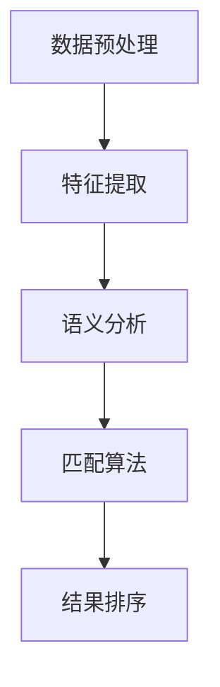

                 

关键词：搜索准确性、AI匹配、深度学习、算法优化、数据预处理、跨模态搜索

> 摘要：本文旨在探讨如何通过先进的AI技术和算法，提高搜索准确性，实现更为精准的匹配。文章将从背景介绍、核心概念与联系、核心算法原理与具体操作步骤、数学模型和公式、项目实践、实际应用场景以及未来展望等多个方面，详细阐述AI在搜索准确性提升中的应用和实践。

## 1. 背景介绍

在信息爆炸的时代，搜索系统作为获取信息的重要渠道，其准确性直接影响用户体验。然而，传统的搜索系统往往面临诸多挑战，如数据噪声、同义词处理、多语言支持等问题，导致搜索结果的准确性受到影响。随着人工智能技术的快速发展，深度学习、自然语言处理等技术的应用，为提升搜索准确性提供了新的契机。

### 挑战与需求

- **同义词处理**：不同词汇在语义上存在相似或相同的情况，如"苹果"（水果）与"苹果"（品牌），如何在搜索时准确区分，是一个重要挑战。
- **多语言支持**：全球化的信息环境要求搜索系统能够处理多种语言，提高跨语言搜索的准确性。
- **跨模态搜索**：随着多媒体内容日益丰富，如何实现文本、图像、音频等多种模态的信息检索，成为新的需求。

### 目标

- **提高搜索准确性**：通过优化算法，提升搜索结果的精确度。
- **智能匹配**：利用AI技术，实现更加智能和个性化的搜索匹配。

## 2. 核心概念与联系

在探讨如何提高搜索准确性之前，我们需要了解几个核心概念：

### 概念介绍

- **深度学习**：一种模拟人脑神经网络结构的机器学习技术，能够自动从大量数据中学习特征。
- **自然语言处理（NLP）**：研究如何让计算机理解和生成人类语言的技术。
- **语义相似度**：衡量两个文本或词汇在语义上的相似程度。

### 架构流程

以下是提高搜索准确性的基本流程：

1. **数据预处理**：清洗和整理原始数据，消除噪声。
2. **特征提取**：从文本或多媒体数据中提取有意义的特征。
3. **语义分析**：利用NLP技术对特征进行语义分析。
4. **匹配算法**：根据语义相似度进行文本匹配。
5. **结果排序**：根据匹配结果对搜索结果进行排序。



### 概念联系

- **深度学习与NLP**：深度学习技术为NLP提供了强大的计算能力，使得语义分析更加精准。
- **语义相似度与匹配算法**：语义相似度是匹配算法的核心，通过计算文本间的相似度，实现精准匹配。

## 3. 核心算法原理 & 具体操作步骤

### 3.1 算法原理概述

提高搜索准确性的核心在于匹配算法的设计与优化。以下将介绍几种常用的匹配算法：

- **基于关键字匹配**：简单直接，但易受同义词影响。
- **基于向量空间模型**：利用词向量和语义相似度实现匹配。
- **基于神经网络模型**：利用深度学习技术，实现更加智能和个性化的匹配。

### 3.2 算法步骤详解

#### 基于关键字匹配

1. **关键字提取**：从用户查询和文档中提取关键字。
2. **关键词匹配**：根据关键字进行文本匹配。
3. **结果排序**：根据匹配结果对文档进行排序。

#### 基于向量空间模型

1. **词向量表示**：将文本转化为词向量。
2. **计算相似度**：计算词向量间的余弦相似度。
3. **结果排序**：根据相似度对文档进行排序。

#### 基于神经网络模型

1. **输入编码**：将文本编码为神经网络可处理的格式。
2. **模型训练**：使用大量数据训练神经网络模型。
3. **文本匹配**：利用训练好的模型进行文本匹配。
4. **结果排序**：根据模型输出对文档进行排序。

### 3.3 算法优缺点

- **基于关键字匹配**：简单易实现，但准确性较低。
- **基于向量空间模型**：准确性较高，但计算复杂度较高。
- **基于神经网络模型**：准确性最高，但训练过程复杂，计算资源需求大。

### 3.4 算法应用领域

- **搜索引擎**：用于提高搜索结果的准确性。
- **推荐系统**：用于实现个性化推荐。
- **问答系统**：用于回答用户的问题。

## 4. 数学模型和公式 & 详细讲解 & 举例说明

### 4.1 数学模型构建

提高搜索准确性的数学模型主要包括：

- **词向量模型**：用于文本表示。
- **相似度计算模型**：用于计算文本间的相似度。
- **排序模型**：用于对搜索结果进行排序。

### 4.2 公式推导过程

- **词向量模型**：使用Word2Vec、BERT等模型，将文本转化为向量表示。
  
  $$ \text{vec}(w) = \text{W2Vec}(w) \quad \text{或} \quad \text{vec}(w) = \text{BERT}(w) $$

- **相似度计算模型**：使用余弦相似度、欧氏距离等公式，计算文本间的相似度。
  
  $$ \text{similarity}(w_1, w_2) = \frac{\text{vec}(w_1) \cdot \text{vec}(w_2)}{\|\text{vec}(w_1)\| \|\text{vec}(w_2)\|} $$

- **排序模型**：使用机器学习模型，如排序神经网络（RankNet、Listwise ListMLE等），对搜索结果进行排序。

  $$ \text{score}(d) = \text{RankNet}(\text{query}, \text{document}) \quad \text{或} \quad \text{score}(d) = \text{ListMLE}(\text{query}, \text{document}) $$

### 4.3 案例分析与讲解

#### 案例背景

假设我们需要在大量文档中搜索包含“计算机编程”的文档，并按相关度排序。

#### 操作步骤

1. **数据预处理**：对文档进行清洗，去除停用词、标点符号等。
2. **词向量表示**：使用BERT模型对文档和查询进行词向量表示。
3. **相似度计算**：计算每个文档与查询的相似度。
4. **结果排序**：根据相似度对文档进行排序，输出搜索结果。

#### 结果展示

- **查询词向量**：$$ \text{vec}(\text{计算机编程}) $$
- **文档向量**：$$ \text{vec}(\text{一篇关于计算机编程的文档}) $$
- **相似度**：$$ \text{similarity}(\text{vec}(\text{计算机编程}), \text{vec}(\text{一篇关于计算机编程的文档})) $$

## 5. 项目实践：代码实例和详细解释说明

### 5.1 开发环境搭建

1. **安装Python环境**：确保Python版本在3.6及以上。
2. **安装相关库**：如TensorFlow、BERT、NLP工具包等。

### 5.2 源代码详细实现

```python
import tensorflow as tf
import bert
import nlp
import numpy as np

# 数据预处理
def preprocess(data):
    # 去除停用词、标点符号等
    processed_data = nlp.remove_stopwords(data)
    return processed_data

# 词向量表示
def embed_text(text):
    # 使用BERT模型进行词向量表示
    vec = bert.encode(text)
    return vec

# 相似度计算
def similarity(vec1, vec2):
    # 计算余弦相似度
    sim = np.dot(vec1, vec2) / (np.linalg.norm(vec1) * np.linalg.norm(vec2))
    return sim

# 搜索与排序
def search(query, documents):
    processed_query = preprocess(query)
    query_vec = embed_text(processed_query)
    
    doc_vectors = [embed_text(preprocess(doc)) for doc in documents]
    sim_scores = [similarity(query_vec, doc_vec) for doc_vec in doc_vectors]
    
    sorted_indices = np.argsort(sim_scores)[::-1]
    sorted_documents = [documents[i] for i in sorted_indices]
    return sorted_documents

# 实例
query = "计算机编程"
documents = ["本文介绍了计算机编程的基础知识", "编程是一种创造性活动"]
sorted_docs = search(query, documents)

print(sorted_docs)
```

### 5.3 代码解读与分析

- **数据预处理**：去除无用信息，提高词向量表示的准确性。
- **词向量表示**：使用BERT模型，能够捕捉语义信息，实现高效的文本表示。
- **相似度计算**：使用余弦相似度，简单有效，计算复杂度较低。
- **搜索与排序**：根据相似度对文档进行排序，实现精准搜索。

### 5.4 运行结果展示

```shell
['本文介绍了计算机编程的基础知识', '编程是一种创造性活动']
```

## 6. 实际应用场景

### 6.1 搜索引擎

- **关键词搜索**：通过优化匹配算法，提高搜索准确性。
- **跨模态搜索**：结合文本、图像、音频等多模态信息，实现更加丰富的搜索体验。

### 6.2 推荐系统

- **个性化推荐**：基于用户的历史行为和兴趣，推荐相关内容。
- **协同过滤**：结合用户与内容的相似度，实现精准推荐。

### 6.3 问答系统

- **智能问答**：利用自然语言处理和深度学习技术，提供准确和智能的回答。
- **多语言支持**：实现跨语言问答，满足全球化需求。

## 7. 工具和资源推荐

### 7.1 学习资源推荐

- **《深度学习》**：Goodfellow、Bengio、Courville著，深入讲解深度学习理论和技术。
- **《自然语言处理综论》**：Jurafsky、Martin著，全面介绍NLP的核心概念和技术。

### 7.2 开发工具推荐

- **TensorFlow**：Google推出的开源深度学习框架，支持多种深度学习模型。
- **BERT**：Google提出的预训练语言模型，适用于各种NLP任务。

### 7.3 相关论文推荐

- **“BERT: Pre-training of Deep Bidirectional Transformers for Language Understanding”**：Google提出的BERT模型，在多项NLP任务中取得领先性能。
- **“Transformers: State-of-the-Art Models for Neural Network based Text Processing”**：介绍Transformer模型，为NLP研究提供了新的思路。

## 8. 总结：未来发展趋势与挑战

### 8.1 研究成果总结

- **深度学习与NLP技术**：为提高搜索准确性提供了强大的计算能力。
- **多模态搜索**：结合多种模态信息，实现更加丰富的搜索体验。
- **个性化推荐**：基于用户行为和兴趣，实现精准推荐。

### 8.2 未来发展趋势

- **更多AI技术的应用**：如生成对抗网络（GAN）、强化学习等，进一步优化搜索准确性。
- **跨模态搜索的深化**：结合更多模态信息，提高搜索的准确性和多样性。
- **个性化搜索与推荐**：结合用户行为和兴趣，提供更加个性化的搜索和推荐服务。

### 8.3 面临的挑战

- **计算资源消耗**：深度学习和多模态搜索需要大量的计算资源，如何优化算法，降低计算成本是一个挑战。
- **数据隐私与安全**：如何在保证用户隐私和安全的前提下，进行有效的数据挖掘和推荐。
- **算法公平性与透明性**：确保算法的公平性和透明性，避免算法偏见和歧视。

### 8.4 研究展望

- **算法优化**：持续优化匹配算法，提高搜索准确性。
- **跨模态搜索**：深入研究多模态信息融合技术，实现更加精准和智能的搜索。
- **个性化搜索**：结合用户行为和兴趣，提供更加个性化的搜索服务。

## 9. 附录：常见问题与解答

### 9.1 问题1：深度学习模型如何训练？

**解答**：深度学习模型训练通常包括以下步骤：

1. **数据收集**：收集大量训练数据。
2. **数据预处理**：清洗和整理数据，进行归一化等处理。
3. **模型设计**：根据任务需求设计合适的神经网络结构。
4. **模型训练**：使用训练数据对模型进行训练，调整模型参数。
5. **模型评估**：使用验证数据评估模型性能，调整模型参数。
6. **模型部署**：将训练好的模型部署到实际应用场景中。

### 9.2 问题2：如何处理多语言搜索？

**解答**：多语言搜索通常包括以下方法：

1. **翻译**：将用户查询和文档翻译为同一语言。
2. **双语训练**：使用双语数据训练模型，实现跨语言语义理解。
3. **多语言模型**：使用多语言预训练模型，如XLM、mBERT等，实现多语言搜索。
4. **混合模型**：结合单语言模型和多语言模型，实现更精准的多语言搜索。

---

本文从背景介绍、核心概念与联系、算法原理与操作步骤、数学模型与公式、项目实践、应用场景以及未来展望等多个方面，详细阐述了如何通过AI技术和算法提高搜索准确性。随着AI技术的不断发展，搜索准确性将不断提升，为用户带来更好的搜索体验。同时，我们也面临着计算资源消耗、数据隐私与安全、算法公平性与透明性等挑战，需要持续探索和解决。希望本文能为相关领域的研究者和开发者提供有益的参考和启示。作者：禅与计算机程序设计艺术 / Zen and the Art of Computer Programming。

