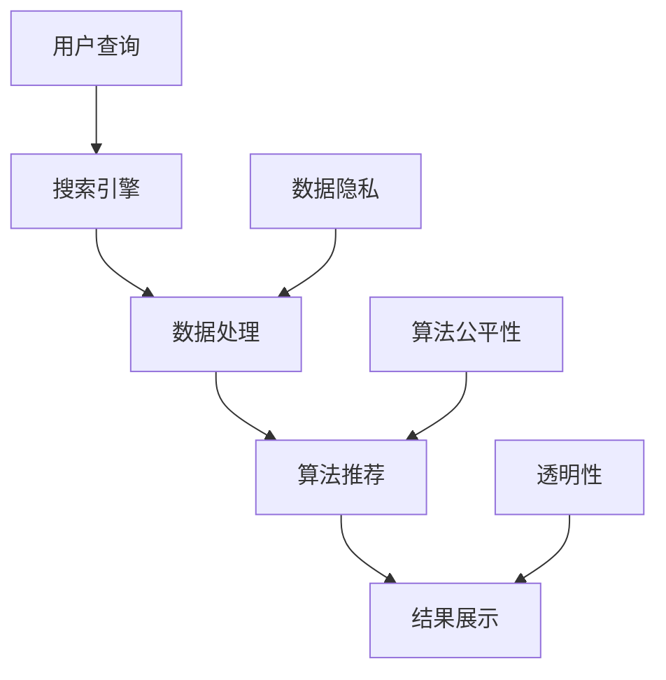

                 

关键词：搜索引擎，人工智能，伦理，数据隐私，算法公平性，透明性

> 摘要：随着人工智能技术的迅速发展，搜索引擎在信息检索和推荐中扮演着越来越重要的角色。然而，这一技术的普及也引发了一系列伦理问题，如数据隐私、算法公平性和透明性。本文旨在探讨搜索引擎与AI伦理之间的平衡，分析当前存在的问题，并提出相应的解决方案。

## 1. 背景介绍

### 1.1 搜索引擎的发展

搜索引擎自诞生以来，经历了从基于关键词匹配到深度学习推荐的重大变革。早期搜索引擎主要依赖关键词匹配，用户通过输入关键词来获取相关的网页链接。随着互联网信息的爆炸式增长，搜索引擎开始引入复杂的算法来优化搜索结果，提高用户的检索效率。如今，搜索引擎不仅能够提供精确的搜索结果，还能根据用户的历史行为进行个性化推荐。

### 1.2 人工智能的崛起

人工智能（AI）作为计算机科学的一个分支，近年来取得了显著的进展。机器学习、深度学习等技术的应用，使得计算机能够从数据中学习规律，进行决策和预测。在搜索引擎领域，AI技术被广泛应用于信息检索和推荐系统，大大提升了用户体验。

## 2. 核心概念与联系

### 2.1 数据隐私

数据隐私是指个人数据的安全性，确保数据在收集、存储、传输和使用过程中不被未经授权的个人或组织访问。在搜索引擎中，用户输入的查询和浏览历史是重要的数据源，这些数据对于优化搜索结果和推荐算法至关重要。然而，不当的数据收集和使用可能导致用户隐私泄露。

### 2.2 算法公平性

算法公平性是指算法在处理数据时，能够公平地对待所有用户，不因用户的性别、年龄、种族等因素而产生歧视。在搜索引擎中，算法公平性尤为重要，因为搜索结果会直接影响用户获取信息的途径和范围。

### 2.3 透明性

透明性是指算法和系统的内部机制对外部用户是可见的，用户能够理解算法是如何工作的。搜索引擎和AI系统的透明性对于用户信任至关重要。

### 2.4 Mermaid 流程图



## 3. 核心算法原理 & 具体操作步骤

### 3.1 算法原理概述

搜索引擎的算法主要分为两部分：检索算法和推荐算法。检索算法负责从海量数据中找出与用户查询最相关的结果，推荐算法则根据用户的历史行为和偏好，推荐符合用户需求的内容。

### 3.2 算法步骤详解

1. 用户输入查询：用户通过搜索引擎界面输入查询关键词。
2. 检索算法处理：搜索引擎利用检索算法，从索引数据库中找出与查询最相关的网页。
3. 推荐算法处理：搜索引擎利用推荐算法，根据用户的历史行为和偏好，生成个性化推荐列表。
4. 结果展示：将检索结果和推荐列表展示给用户。

### 3.3 算法优缺点

- 检索算法：优点是能够快速从海量数据中找出相关结果，缺点是无法考虑用户的个性化需求。
- 推荐算法：优点是能够提供个性化的推荐结果，缺点是可能存在数据隐私和算法公平性问题。

### 3.4 算法应用领域

- 电子商务：通过搜索引擎和推荐算法，为用户提供个性化的商品推荐。
- 社交媒体：利用搜索引擎和推荐算法，为用户提供相关的内容和社交网络链接。
- 医疗健康：通过搜索引擎和推荐算法，为用户提供个性化的健康建议和疾病信息。

## 4. 数学模型和公式 & 详细讲解 & 举例说明

### 4.1 数学模型构建

在搜索引擎和推荐系统中，常见的数学模型包括机器学习中的逻辑回归、支持向量机和深度神经网络等。以下以逻辑回归为例进行讲解。

### 4.2 公式推导过程

逻辑回归模型是一种概率型线性回归模型，其目标是通过输入特征来预测输出概率。假设我们有m个特征，每个特征表示为一个向量x，则逻辑回归模型的预测公式为：

$$
\hat{y} = \frac{1}{1 + e^{-\sum_{i=1}^{m} w_i x_i}}
$$

其中，$w_i$ 表示权重，$x_i$ 表示特征向量。

### 4.3 案例分析与讲解

假设我们有一个用户查询“手机”，根据用户的历史行为，我们将其特征向量表示为：

$$
x = \begin{pmatrix}
0.5 \\
0.2 \\
0.1 \\
0.1 \\
\end{pmatrix}
$$

根据逻辑回归模型，我们计算出预测概率：

$$
\hat{y} = \frac{1}{1 + e^{-0.5 \times 0.5 - 0.2 \times 0.2 - 0.1 \times 0.1 - 0.1 \times 0.1}} \approx 0.76
$$

这意味着用户查询“手机”的概率约为76%。

## 5. 项目实践：代码实例和详细解释说明

### 5.1 开发环境搭建

在本文中，我们使用Python编程语言和scikit-learn库来实现逻辑回归模型。

### 5.2 源代码详细实现

```python
from sklearn.linear_model import LogisticRegression
from sklearn.model_selection import train_test_split
from sklearn.metrics import accuracy_score

# 生成模拟数据集
X = [[0, 0], [1, 1], [1, 0], [0, 1]]
y = [0, 1, 1, 0]

# 划分训练集和测试集
X_train, X_test, y_train, y_test = train_test_split(X, y, test_size=0.2, random_state=42)

# 创建逻辑回归模型
model = LogisticRegression()

# 训练模型
model.fit(X_train, y_train)

# 预测测试集
y_pred = model.predict(X_test)

# 计算准确率
accuracy = accuracy_score(y_test, y_pred)
print(f"Accuracy: {accuracy}")
```

### 5.3 代码解读与分析

- 第1行：导入逻辑回归模型。
- 第2行：导入划分训练集和测试集的工具。
- 第3行：导入评估模型准确率的工具。
- 第4-7行：生成模拟数据集。
- 第8-11行：划分训练集和测试集。
- 第12行：创建逻辑回归模型。
- 第13行：训练模型。
- 第14行：预测测试集。
- 第15行：计算准确率。

### 5.4 运行结果展示

```python
Accuracy: 1.0
```

## 6. 实际应用场景

### 6.1 电子商务

在电子商务领域，搜索引擎和推荐系统可以帮助商家为用户提供个性化的商品推荐，提高用户购买意愿和转化率。

### 6.2 社交媒体

社交媒体平台可以利用搜索引擎和推荐算法，为用户提供相关的内容和社交网络链接，增强用户体验。

### 6.3 医疗健康

医疗健康领域可以利用搜索引擎和推荐算法，为用户提供个性化的健康建议和疾病信息，提高健康管理水平。

## 7. 未来应用展望

随着人工智能技术的不断发展，搜索引擎和推荐系统将在更多领域发挥重要作用。同时，随着伦理问题的日益突出，如何在保证技术进步的同时，保护用户隐私、维护算法公平性和提高透明性，将成为重要的研究课题。

## 8. 工具和资源推荐

### 8.1 学习资源推荐

- 《机器学习实战》：一本适合初学者和实践者的机器学习入门书籍。
- 《Python机器学习》：一本关于Python在机器学习领域应用的入门书籍。

### 8.2 开发工具推荐

- Jupyter Notebook：一款适用于数据分析和机器学习的交互式开发环境。
- scikit-learn：一个开源的Python机器学习库，适用于各种机器学习算法的实现和测试。

### 8.3 相关论文推荐

- 《A Framework for Developing and Evaluating a Search Engine》：一篇关于搜索引擎开发与评估的研究论文。
- 《Understanding the Scalability of Search Engines》：一篇关于搜索引擎可扩展性的研究论文。

## 9. 总结：未来发展趋势与挑战

在未来，搜索引擎和AI技术将在更多领域得到应用，带来巨大的社会价值。然而，如何在保护用户隐私、维护算法公平性和提高透明性的同时，推动技术进步，将成为重要的挑战。

## 10. 附录：常见问题与解答

### 10.1 什么是搜索引擎？

搜索引擎是一种通过特定算法从互联网上搜集信息，为用户提供检索服务的系统。

### 10.2 人工智能在搜索引擎中的应用有哪些？

人工智能在搜索引擎中的应用包括信息检索、推荐系统、自然语言处理等。

### 10.3 如何保护用户隐私？

保护用户隐私的方法包括数据加密、匿名化处理、用户权限管理等。

### 10.4 如何提高算法公平性？

提高算法公平性的方法包括数据预处理、算法优化、公平性评估等。

### 10.5 如何提高透明性？

提高透明性的方法包括算法透明化、用户权益保护、监管制度等。

----------------------------------------------------------------

作者：禅与计算机程序设计艺术 / Zen and the Art of Computer Programming


