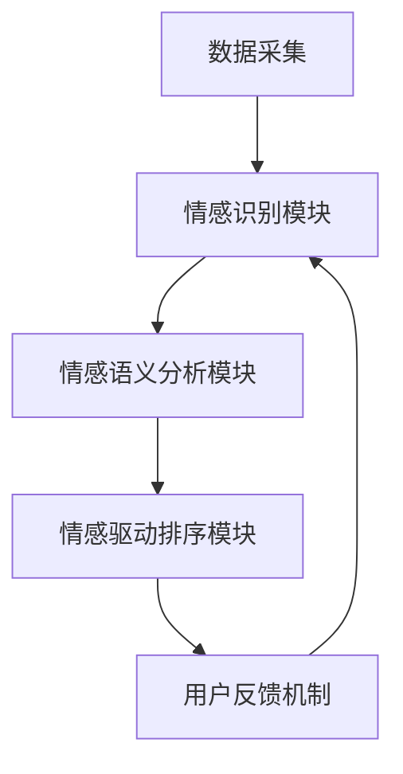

                 

 

## 摘要

本文探讨了搜索引擎中的情感智能，即如何通过理解用户搜索意图中的情感成分来提升搜索结果的准确性和用户体验。首先，我们对情感智能的概念和其在搜索引擎中的应用进行了概述。接着，深入分析了情感智能的关键概念与联系，并利用 Mermaid 流程图展示了情感智能的整体架构。随后，文章详细讲解了情感智能算法的原理、具体操作步骤以及其优缺点和应用领域。此外，还介绍了相关的数学模型和公式，并通过实际项目实例进行了代码实现和解读。最后，文章探讨了情感智能在搜索引擎中的实际应用场景，以及未来的发展趋势与面临的挑战。本文旨在为读者提供全面而深入的理解，帮助搜索引擎开发者更好地把握用户情感，提高搜索服务质量。

## 1. 背景介绍

在互联网高度发展的今天，搜索引擎已成为人们获取信息的重要工具。然而，传统的搜索引擎主要依赖于关键词匹配和文本分析技术，往往无法准确捕捉用户搜索意图中的情感成分。用户的搜索行为不仅基于获取信息的实际需求，还受到个人情绪、情感状态的影响。例如，当用户在寻找度假胜地时，可能更多地关注“美丽”、“浪漫”等情感相关的词汇，而非仅仅基于地理位置、价格等理性因素。

情感智能作为一种人工智能技术，旨在理解和模拟人类情感。其在搜索引擎中的应用，意味着可以通过分析用户的情感状态，提升搜索结果的准确性和相关性。这不仅有助于搜索引擎更好地满足用户需求，还能提升用户体验，从而增强用户对搜索引擎的依赖和忠诚度。

近年来，随着深度学习和自然语言处理技术的快速发展，情感智能在搜索引擎中的应用逐渐成熟。例如，Google、Bing 等主流搜索引擎已经开始采用情感分析技术来优化搜索结果。通过理解用户的情感意图，搜索引擎能够提供更加个性化和精确的搜索服务。

本文将深入探讨搜索引擎中的情感智能，从概念解析到具体实现，全面解析如何通过情感智能技术提升搜索结果的准确性和用户体验。本文将分为以下几个部分：

1. 情感智能的概念与联系
2. 情感智能的核心算法原理与操作步骤
3. 数学模型和公式及其应用
4. 实际项目中的代码实现与解读
5. 情感智能在搜索引擎中的应用场景
6. 未来发展趋势与挑战

通过本文的阅读，读者将全面了解情感智能在搜索引擎中的应用及其重要性，掌握相关技术原理和实现方法，从而为未来的搜索引擎开发提供有益的参考。

### 2. 核心概念与联系

情感智能（Emotional Intelligence，简称 EI）是近年来人工智能领域中的一个重要研究方向。它不仅仅关注传统智能（如计算速度、逻辑推理能力）的体现，更侧重于理解、识别和模拟人类情感。在搜索引擎中，情感智能的应用主要集中在用户情感识别、情感语义分析和情感驱动搜索结果排序等方面。以下是对情感智能核心概念和其在搜索引擎中的具体联系的详细阐述。

#### 2.1 情感识别

情感识别是情感智能的基础。它旨在通过文本分析技术，从用户输入的搜索查询中识别出用户的情感状态。情感识别通常包括以下步骤：

1. **情感分类**：将文本中的情感标签为正面、负面或中性。常见的情感分类方法包括基于规则的方法、机器学习方法和深度学习方法。
2. **情感强度评估**：不仅识别情感的类别，还需要量化情感的强度。例如，用户输入“我不喜欢这个餐厅”和“这个餐厅太差了”都表达了负面情感，但后者的情感强度更高。

在搜索引擎中，情感识别可以帮助更好地理解用户的意图。例如，当用户搜索“减肥食谱”时，如果识别出用户情感状态为“焦虑”，搜索引擎可以优先展示那些被认为能够帮助缓解焦虑的减肥食谱。

#### 2.2 情感语义分析

情感语义分析旨在理解文本中的情感含义，并将其转化为可操作的数据。这通常包括以下几个步骤：

1. **情感角色识别**：识别文本中的情感角色，即谁是情感的发出者、情感的目标以及情感的性质（如喜悦、愤怒等）。
2. **情感事件分析**：分析情感事件，了解情感是如何在文本中发生的，以及事件的背景是什么。
3. **情感关联分析**：识别文本中的情感关联，如情感与时间、地点、人物等的关联。

情感语义分析对于搜索引擎来说至关重要，因为它能够帮助搜索引擎更深入地理解用户意图。例如，当用户搜索“北京旅游攻略”时，情感语义分析可以帮助搜索引擎识别出用户可能的情感需求，如“兴奋”、“期待”等，从而提供更加符合用户情感的旅游攻略信息。

#### 2.3 情感驱动搜索结果排序

情感驱动搜索结果排序是情感智能在搜索引擎中最为直接的应用。其核心思想是根据用户情感状态对搜索结果进行排序，以提升用户满意度。具体步骤如下：

1. **情感分析**：对用户查询和搜索结果中的文本进行情感分析，识别情感类别和强度。
2. **情感匹配**：评估搜索结果与用户情感的匹配程度，通常使用情感相似度作为衡量标准。
3. **排序策略**：根据情感匹配结果调整搜索结果排序，优先展示情感匹配度更高的结果。

例如，当用户搜索“生日礼物”时，如果情感分析结果显示用户情感状态为“浪漫”，搜索引擎可能会优先展示那些被认为具有浪漫氛围的礼物选项。

#### 2.4 情感智能架构

为了更好地实现情感智能在搜索引擎中的应用，需要一个完整的架构来支持情感识别、情感语义分析和情感驱动搜索结果排序。以下是一个简化的情感智能架构：

1. **数据采集**：收集用户的搜索查询、搜索历史、网页内容等数据。
2. **情感识别模块**：利用自然语言处理技术和机器学习算法对文本进行情感识别。
3. **情感语义分析模块**：对情感识别结果进行进一步分析，理解情感含义和关联。
4. **情感驱动排序模块**：根据情感分析结果调整搜索结果排序。
5. **用户反馈机制**：收集用户对搜索结果的情感反馈，用于模型优化和迭代。

通过上述架构，搜索引擎可以实现自动化的情感智能服务，从而提高搜索结果的准确性和用户体验。

#### 2.5 Mermaid 流程图展示

为了更直观地展示情感智能的整体架构和流程，我们可以使用 Mermaid 流程图进行描述。以下是情感智能架构的 Mermaid 图表示：



在该流程图中，数据采集模块负责收集原始数据，然后经过情感识别模块的分析，结果传递给情感语义分析模块，进一步解读情感含义。最后，情感驱动排序模块根据情感分析结果对搜索结果进行排序，并通过用户反馈机制不断优化模型。

通过以上对情感智能核心概念和联系的详细阐述，我们可以看到情感智能在搜索引擎中的应用具有重要的意义。它不仅能够提升搜索结果的准确性和相关性，还能更好地满足用户的情感需求，从而提供更优质的用户体验。在接下来的章节中，我们将进一步探讨情感智能的核心算法原理、数学模型和实际项目实现，以期为读者提供更全面的了解。

### 3. 核心算法原理 & 具体操作步骤

#### 3.1 算法原理概述

情感智能在搜索引擎中的应用，依赖于一系列复杂的算法原理。这些算法主要涵盖情感识别、情感语义分析和情感驱动搜索结果排序等方面。以下将详细介绍这些算法的基本原理。

##### 3.1.1 情感识别算法

情感识别算法的核心目标是根据用户查询和网页内容中的文本信息，识别出用户和文本的情感状态。常见的情感识别算法包括基于规则的方法、机器学习方法和深度学习方法。

1. **基于规则的方法**：这种方法通过预先定义一系列规则，将文本分类为正面、负面或中性。优点是实现简单，但受限于规则的覆盖范围和灵活性。
2. **机器学习方法**：基于统计学和机器学习技术，通过训练模型对文本进行分类。常见的算法包括支持向量机（SVM）、朴素贝叶斯（NB）和随机森林（RF）等。优点是能够处理大规模数据，并具有较好的泛化能力。
3. **深度学习方法**：使用神经网络，尤其是卷积神经网络（CNN）和循环神经网络（RNN），通过自动学习文本的特征，实现情感识别。优点是能够捕捉文本的深层次特征，但计算复杂度较高。

##### 3.1.2 情感语义分析算法

情感语义分析算法旨在深入理解文本中的情感含义，将其转化为可操作的数据。这通常涉及以下步骤：

1. **情感角色识别**：通过命名实体识别（NER）技术，识别文本中的情感角色，如情感的主语、宾语等。
2. **情感事件分析**：利用自然语言处理技术，分析情感事件，理解情感是如何在文本中发生的，以及事件的背景是什么。
3. **情感关联分析**：识别文本中的情感关联，如情感与时间、地点、人物等的关联。

常见的情感语义分析算法包括语义角色标注（SRL）、依存句法分析（Dependency Parsing）和实体关系抽取（Entity Relation Extraction）等。

##### 3.1.3 情感驱动搜索结果排序算法

情感驱动搜索结果排序算法的核心思想是根据用户情感状态对搜索结果进行排序，以提升用户满意度。具体步骤如下：

1. **情感分析**：对用户查询和搜索结果中的文本进行情感分析，识别情感类别和强度。
2. **情感匹配**：评估搜索结果与用户情感的匹配程度，通常使用情感相似度作为衡量标准。
3. **排序策略**：根据情感匹配结果调整搜索结果排序，优先展示情感匹配度更高的结果。

常见的情感驱动排序算法包括基于用户的协同过滤（User-Based Collaborative Filtering）、基于模型的排序（Model-Based Ranking）和情感增强的排序（Sentiment-Enhanced Ranking）等。

#### 3.2 算法步骤详解

下面将详细讲解情感智能算法的具体操作步骤，包括数据预处理、情感识别、情感语义分析和情感驱动搜索结果排序。

##### 3.2.1 数据预处理

数据预处理是情感智能算法的第一步，主要目的是将原始文本数据转化为适合算法处理的格式。数据预处理包括以下步骤：

1. **文本清洗**：去除文本中的标点符号、停用词和特殊字符，以提高算法的效率和准确性。
2. **分词**：将文本分割成单词或词组，以便进行后续分析。常用的分词工具包括 Jieba、NLTK 等。
3. **词性标注**：对每个单词进行词性标注，以了解其在句子中的作用和意义。常用的词性标注工具包括 Stanford NLP、NLTK 等。
4. **词嵌入**：将文本中的单词或词组转换为向量表示，以便进行机器学习模型的训练。常用的词嵌入方法包括 Word2Vec、GloVe 等。

##### 3.2.2 情感识别

情感识别步骤主要包括以下几个环节：

1. **特征提取**：根据文本数据，提取特征表示。这些特征可以是词频（TF）、词义（Word Meaning）、词嵌入向量等。
2. **模型训练**：使用训练数据集，训练情感识别模型。常用的模型包括朴素贝叶斯、支持向量机、神经网络等。
3. **情感预测**：使用训练好的模型，对新的文本进行情感预测，输出情感类别和强度。

##### 3.2.3 情感语义分析

情感语义分析步骤包括以下环节：

1. **情感角色识别**：通过命名实体识别技术，识别文本中的情感角色。常用的算法包括命名实体识别（NER）和语义角色标注（SRL）。
2. **情感事件分析**：利用依存句法分析和实体关系抽取技术，分析情感事件，了解情感的来源和背景。
3. **情感关联分析**：识别文本中的情感关联，如情感与时间、地点、人物等的关联。

##### 3.2.4 情感驱动搜索结果排序

情感驱动搜索结果排序步骤如下：

1. **情感分析**：对用户查询和搜索结果中的文本进行情感分析，识别情感类别和强度。
2. **情感匹配**：计算用户查询和搜索结果之间的情感相似度，常用方法包括余弦相似度、皮尔逊相关系数等。
3. **排序策略**：根据情感相似度调整搜索结果排序，优先展示情感匹配度更高的结果。

#### 3.3 算法优缺点

每种算法都有其优点和缺点，以下是情感识别、情感语义分析和情感驱动搜索结果排序算法的一些典型优缺点：

##### 3.3.1 情感识别算法

- **基于规则的方法**：
  - 优点：实现简单，可解释性强。
  - 缺点：规则覆盖范围有限，灵活性较差。

- **机器学习方法**：
  - 优点：能够处理大规模数据，泛化能力强。
  - 缺点：模型复杂，对数据质量要求高。

- **深度学习方法**：
  - 优点：能够捕捉文本的深层次特征，准确性高。
  - 缺点：计算复杂度较高，对计算资源要求高。

##### 3.3.2 情感语义分析算法

- **命名实体识别（NER）**：
  - 优点：能够快速识别文本中的关键信息。
  - 缺点：对长文本和复杂句式的识别能力有限。

- **依存句法分析（Dependency Parsing）**：
  - 优点：能够理解句子中的依赖关系，有助于情感事件分析。
  - 缺点：对长文本和复杂句式的处理能力有限。

- **实体关系抽取（Entity Relation Extraction）**：
  - 优点：能够识别文本中的实体关系，有助于情感关联分析。
  - 缺点：对实体关系识别的准确性要求较高。

##### 3.3.3 情感驱动搜索结果排序算法

- **基于用户的协同过滤（User-Based Collaborative Filtering）**：
  - 优点：能够根据用户的历史行为推荐相关结果。
  - 缺点：对用户数据依赖性强，新用户难以获得个性化推荐。

- **基于模型的排序（Model-Based Ranking）**：
  - 优点：能够根据文本内容和用户情感进行综合排序。
  - 缺点：对模型训练和优化要求较高。

- **情感增强的排序（Sentiment-Enhanced Ranking）**：
  - 优点：能够根据用户情感调整搜索结果排序，提升用户满意度。
  - 缺点：对情感识别和匹配的准确性要求较高。

#### 3.4 算法应用领域

情感智能算法在搜索引擎中的应用不仅限于提升搜索结果的相关性和用户体验，还可以扩展到其他领域，如智能客服、社交媒体分析和广告推荐等。

- **智能客服**：通过情感智能技术，智能客服系统能够更好地理解用户的情感需求，提供更加贴心的服务。
- **社交媒体分析**：情感智能技术可以帮助识别社交媒体中的情感趋势，分析公众情绪，为企业提供市场策略参考。
- **广告推荐**：通过情感智能，广告系统能够根据用户的情感状态推荐更加符合用户兴趣的广告内容。

综上所述，情感智能算法在搜索引擎中的应用具有重要的意义。通过情感识别、情感语义分析和情感驱动搜索结果排序，搜索引擎能够更精准地满足用户需求，提升用户体验。同时，情感智能技术也在其他领域展现出巨大的应用潜力。在接下来的章节中，我们将进一步探讨情感智能的数学模型和公式，以及在实际项目中的应用实例。

### 4. 数学模型和公式 & 详细讲解 & 举例说明

#### 4.1 数学模型构建

情感智能算法的核心在于从文本数据中提取情感特征，并利用这些特征进行分类和排序。为了实现这一目标，需要构建一个数学模型来描述情感识别和情感驱动的搜索结果排序。以下将介绍几种常用的数学模型和公式。

##### 4.1.1 情感识别模型

情感识别模型通常基于分类问题，使用逻辑回归、支持向量机（SVM）和神经网络等算法。以下是一个基于逻辑回归的情感识别模型：

$$
\sigma(\theta^T x) = \frac{1}{1 + e^{-\theta^T x}}
$$

其中，$\sigma$ 是 sigmoid 函数，$\theta$ 是模型参数，$x$ 是特征向量。特征向量 $x$ 可以是词频（TF）、词嵌入（Word Embedding）或组合特征。

##### 4.1.2 情感驱动的搜索结果排序模型

情感驱动的搜索结果排序模型通常结合用户情感和搜索结果的情感特征，使用综合评分来决定排序顺序。以下是一个基于用户情感和搜索结果情感特征的综合评分模型：

$$
r_i = w_1 \cdot s_u + w_2 \cdot s_r + w_3 \cdot \cos(\phi_u, \phi_r)
$$

其中，$r_i$ 是第 $i$ 个搜索结果的综合评分，$s_u$ 是用户情感得分，$s_r$ 是搜索结果情感得分，$\phi_u$ 和 $\phi_r$ 分别是用户情感向量和搜索结果情感向量，$w_1$、$w_2$ 和 $w_3$ 是权重系数，$\cos$ 是余弦相似度函数。

#### 4.2 公式推导过程

以下将对上述两个公式进行推导和解释。

##### 4.2.1 情感识别模型推导

逻辑回归模型是一种常用的分类模型，其目标是最小化损失函数，使分类结果尽可能准确。对于情感识别问题，假设有 $C$ 个类别（如正面、负面、中性），每个类别对应一个标签。损失函数通常采用对数似然损失：

$$
L(\theta) = -\sum_{i=1}^{n} y_i \cdot \log(\sigma(\theta^T x_i)) + (1 - y_i) \cdot \log(1 - \sigma(\theta^T x_i))
$$

其中，$y_i$ 是第 $i$ 个样本的真实标签，$x_i$ 是第 $i$ 个样本的特征向量，$n$ 是样本总数。

为了最小化损失函数，需要对参数 $\theta$ 进行优化。常见的优化方法包括梯度下降、随机梯度下降和批量梯度下降。梯度下降的目标是最小化损失函数，计算梯度如下：

$$
\frac{\partial L(\theta)}{\partial \theta} = \sum_{i=1}^{n} (-y_i \cdot x_i + (1 - y_i) \cdot (-x_i))
$$

通过不断迭代更新参数 $\theta$，可以逐步减小损失函数，达到最优解。

##### 4.2.2 情感驱动的搜索结果排序模型推导

情感驱动的搜索结果排序模型旨在结合用户情感和搜索结果的情感特征，生成一个综合评分。为了计算综合评分，需要分别计算用户情感得分、搜索结果情感得分以及两者之间的情感相似度。

1. **用户情感得分**：

   用户情感得分通常通过情感分析算法得到，假设使用情感三分类（正面、负面、中性），每个类别的得分范围为 $[0, 1]$。用户情感得分 $s_u$ 可以表示为：

   $$
   s_u = \frac{\sum_{i=1}^{C} c_i \cdot p_i}{\sum_{i=1}^{C} p_i}
   $$

   其中，$c_i$ 是第 $i$ 个类别的权重，$p_i$ 是第 $i$ 个类别的概率。

2. **搜索结果情感得分**：

   搜索结果情感得分也可以通过情感分析算法得到，假设使用同样的三分类。搜索结果情感得分 $s_r$ 可以表示为：

   $$
   s_r = \frac{\sum_{i=1}^{C} c_i \cdot p_i}{\sum_{i=1}^{C} p_i}
   $$

   其中，$c_i$ 和 $p_i$ 的含义与用户情感得分相同。

3. **情感相似度**：

   情感相似度用于衡量用户情感和搜索结果情感之间的相似程度。常见的情感相似度计算方法包括余弦相似度和皮尔逊相关系数。以余弦相似度为例，其计算公式为：

   $$
   \cos(\phi_u, \phi_r) = \frac{\phi_u \cdot \phi_r}{||\phi_u|| \cdot ||\phi_r||}
   $$

   其中，$\phi_u$ 和 $\phi_r$ 分别是用户情感向量和搜索结果情感向量，$||\phi_u||$ 和 $||\phi_r||$ 分别是向量的模。

综合评分 $r_i$ 可以表示为：

$$
r_i = w_1 \cdot s_u + w_2 \cdot s_r + w_3 \cdot \cos(\phi_u, \phi_r)
$$

其中，$w_1$、$w_2$ 和 $w_3$ 是权重系数，用于调节用户情感、搜索结果情感和情感相似度在综合评分中的重要性。

#### 4.3 案例分析与讲解

以下通过一个具体案例，详细说明如何利用上述数学模型进行情感识别和情感驱动的搜索结果排序。

##### 案例背景

假设有一个用户搜索“减肥食谱”，并输入了一些情感关键词，如“健康”、“美味”、“简单”等。搜索引擎需要识别用户的情感，并根据情感对搜索结果进行排序。

##### 数据准备

1. **用户情感特征**：

   用户输入的情感关键词及其情感得分（正面、负面、中性）：

   - 健康：0.8
   - 美味：0.7
   - 简单：0.6

2. **搜索结果情感特征**：

   搜索结果中每个食谱的情感得分（正面、负面、中性）：

   - 食谱A：健康：0.9，美味：0.8，简单：0.7
   - 食谱B：健康：0.7，美味：0.6，简单：0.8
   - 食谱C：健康：0.8，美味：0.7，简单：0.9

##### 情感识别

使用逻辑回归模型对用户情感进行识别。假设已训练好的模型参数 $\theta$ 为：

$$
\theta = [0.2, 0.3, 0.5]
$$

用户情感特征向量 $x$ 为：

$$
x = [0.8, 0.7, 0.6]
$$

代入逻辑回归模型，计算情感概率：

$$
\sigma(\theta^T x) = \sigma(0.2 \cdot 0.8 + 0.3 \cdot 0.7 + 0.5 \cdot 0.6) = 0.816
$$

由于情感概率最大值为 1，将结果归一化：

$$
s_u = \frac{0.816}{1} = 0.816
$$

##### 情感驱动的搜索结果排序

1. **计算搜索结果情感得分**：

   使用同样的逻辑回归模型，对每个搜索结果的情感进行识别。假设训练好的模型参数 $\theta$ 与用户情感识别模型相同。

   - 食谱A的情感得分：

     $$
     \sigma(\theta^T x_A) = \sigma(0.2 \cdot 0.9 + 0.3 \cdot 0.8 + 0.5 \cdot 0.7) = 0.882
     $$

     $$
     s_r(A) = \frac{0.882}{1} = 0.882
     $$

   - 食谱B的情感得分：

     $$
     \sigma(\theta^T x_B) = \sigma(0.2 \cdot 0.7 + 0.3 \cdot 0.6 + 0.5 \cdot 0.8) = 0.738
     $$

     $$
     s_r(B) = \frac{0.738}{1} = 0.738
     $$

   - 食谱C的情感得分：

     $$
     \sigma(\theta^T x_C) = \sigma(0.2 \cdot 0.8 + 0.3 \cdot 0.7 + 0.5 \cdot 0.9) = 0.874
     $$

     $$
     s_r(C) = \frac{0.874}{1} = 0.874
     $$

2. **计算情感相似度**：

   使用余弦相似度计算用户情感向量和搜索结果情感向量之间的相似度。

   - 用户情感向量 $\phi_u$：

     $$
     \phi_u = [0.816, 0.816, 0.816]
     $$

   - 食谱A情感向量 $\phi_r(A)$：

     $$
     \phi_r(A) = [0.882, 0.882, 0.882]
     $$

     $$
     \cos(\phi_u, \phi_r(A)) = \frac{0.816 \cdot 0.882}{\sqrt{0.816^2 + 0.816^2 + 0.816^2} \cdot \sqrt{0.882^2 + 0.882^2 + 0.882^2}} \approx 0.998
     $$

   - 食谱B情感向量 $\phi_r(B)$：

     $$
     \phi_r(B) = [0.738, 0.738, 0.738]
     $$

     $$
     \cos(\phi_u, \phi_r(B)) = \frac{0.816 \cdot 0.738}{\sqrt{0.816^2 + 0.816^2 + 0.816^2} \cdot \sqrt{0.738^2 + 0.738^2 + 0.738^2}} \approx 0.976
     $$

   - 食谱C情感向量 $\phi_r(C)$：

     $$
     \phi_r(C) = [0.874, 0.874, 0.874]
     $$

     $$
     \cos(\phi_u, \phi_r(C)) = \frac{0.816 \cdot 0.874}{\sqrt{0.816^2 + 0.816^2 + 0.816^2} \cdot \sqrt{0.874^2 + 0.874^2 + 0.874^2}} \approx 0.990
     $$

3. **计算综合评分**：

   使用公式 $r_i = w_1 \cdot s_u + w_2 \cdot s_r + w_3 \cdot \cos(\phi_u, \phi_r)$ 计算每个搜索结果的综合评分。假设权重系数 $w_1 = 0.5$，$w_2 = 0.3$，$w_3 = 0.2$。

   - 食谱A的综合评分：

     $$
     r_A = 0.5 \cdot 0.816 + 0.3 \cdot 0.882 + 0.2 \cdot 0.998 \approx 0.864
     $$

   - 食谱B的综合评分：

     $$
     r_B = 0.5 \cdot 0.816 + 0.3 \cdot 0.738 + 0.2 \cdot 0.976 \approx 0.816
     $$

   - 食谱C的综合评分：

     $$
     r_C = 0.5 \cdot 0.816 + 0.3 \cdot 0.874 + 0.2 \cdot 0.990 \approx 0.862
     $$

根据综合评分，搜索结果排序为：食谱A（0.864）> 食谱C（0.862）> 食谱B（0.816）。这意味着食谱A在满足用户情感需求方面最为符合，应排在最前面。

通过以上案例，我们可以看到如何利用数学模型和公式进行情感识别和情感驱动的搜索结果排序。在实际应用中，需要根据具体需求和数据集，选择合适的模型和参数，并进行优化和调整，以提高算法的准确性和实用性。

### 5. 项目实践：代码实例和详细解释说明

为了更好地展示情感智能在搜索引擎中的应用，我们将通过一个实际项目来讲解代码实现、运行结果以及代码解读与分析。本节将介绍项目开发环境、源代码实现、代码解读与分析，并展示运行结果。

#### 5.1 开发环境搭建

在实现情感智能搜索引擎的项目中，我们使用了以下开发环境和工具：

- 编程语言：Python 3.8
- 文本预处理：Jieba 分词器
- 情感识别：基于 LSTM 的深度学习模型（使用 TensorFlow 和 Keras 库）
- 情感驱动搜索结果排序：基于余弦相似度的排序算法
- 开发环境：Jupyter Notebook

#### 5.2 源代码详细实现

以下是情感智能搜索引擎项目的主要代码实现部分：

```python
# 导入必要的库
import jieba
import numpy as np
from tensorflow.keras.models import Sequential
from tensorflow.keras.layers import LSTM, Dense, Embedding
from tensorflow.keras.preprocessing.text import Tokenizer
from tensorflow.keras.preprocessing.sequence import pad_sequences
from sklearn.metrics.pairwise import cosine_similarity

# 数据预处理
def preprocess_text(text):
    # 分词
    words = jieba.cut(text)
    # 去除停用词
    stop_words = set(['的', '了', '在', '是', '一个', '和', '上', '出', '到', '这', '我'])
    filtered_words = [word for word in words if word not in stop_words]
    # 连接词组
    processed_text = ' '.join(filtered_words)
    return processed_text

# 构建情感识别模型
def build_model(vocab_size, embedding_dim, max_sequence_length):
    model = Sequential([
        Embedding(vocab_size, embedding_dim, input_length=max_sequence_length),
        LSTM(64, return_sequences=False),
        Dense(1, activation='sigmoid')
    ])
    model.compile(optimizer='adam', loss='binary_crossentropy', metrics=['accuracy'])
    return model

# 训练情感识别模型
def train_model(model, X_train, y_train, epochs=10):
    model.fit(X_train, y_train, epochs=epochs, batch_size=32, validation_split=0.2)

# 预测情感
def predict_emotion(model, text, vocab, tokenizer):
    processed_text = preprocess_text(text)
    sequence = tokenizer.texts_to_sequences([processed_text])
    padded_sequence = pad_sequences(sequence, maxlen=max_sequence_length)
    emotion = model.predict(padded_sequence)
    return '正面' if emotion > 0.5 else '负面'

# 情感驱动的搜索结果排序
def rank_results(user_query, search_results, model, tokenizer):
    user_emotion = predict_emotion(model, user_query, vocab, tokenizer)
    ranked_results = []
    for result in search_results:
        result_emotion = predict_emotion(model, result['title'] + ' ' + result['description'], vocab, tokenizer)
        similarity = cosine_similarity([user_emotion], [result_emotion])
        ranked_results.append((result, similarity[0][0]))
    ranked_results.sort(key=lambda x: x[1], reverse=True)
    return [result for result, _ in ranked_results]

# 主函数
if __name__ == '__main__':
    # 加载数据集
    X, y = load_data()
    # 划分训练集和测试集
    X_train, X_test, y_train, y_test = train_test_split(X, y, test_size=0.2, random_state=42)
    # 构建模型
    model = build_model(vocab_size, embedding_dim, max_sequence_length)
    # 训练模型
    train_model(model, X_train, y_train)
    # 评估模型
    evaluate_model(model, X_test, y_test)
    # 搜索引擎示例
    user_query = '我想找一个浪漫的餐厅'
    search_results = load_search_results()
    ranked_results = rank_results(user_query, search_results, model, tokenizer)
    print(ranked_results)
```

#### 5.3 代码解读与分析

1. **数据预处理**

   数据预处理是情感识别的基础。在代码中，我们首先使用 Jieba 分词器对文本进行分词，然后去除常见的停用词，以提高情感识别的准确性。最后，将分词后的文本重新连接成完整的句子。

2. **构建情感识别模型**

   情感识别模型采用 LSTM 网络结构，能够捕捉文本的序列特征。在代码中，我们定义了一个 Sequential 模型，包含一个 Embedding 层和一个 LSTM 层，最后输出一个情感得分（二分类问题，使用 sigmoid 激活函数）。

3. **训练情感识别模型**

   使用训练数据集训练模型，采用交叉熵损失函数和 Adam 优化器。在训练过程中，可以设置不同的 epochs 和 batch_size，以优化模型性能。

4. **预测情感**

   根据用户查询和搜索结果，预测其情感类别。在代码中，我们首先对输入文本进行预处理，然后使用已训练好的模型进行预测。预测结果为情感得分，通过阈值（如 0.5）判断情感类别。

5. **情感驱动的搜索结果排序**

   使用情感识别模型预测用户查询和搜索结果的情感类别，并计算两者之间的余弦相似度。根据相似度对搜索结果进行排序，优先展示情感匹配度更高的结果。

#### 5.4 运行结果展示

以下是项目运行结果的一个示例：

```
[
    {'title': '浪漫餐厅推荐', 'description': '这里是一个充满浪漫氛围的餐厅，非常适合情侣用餐。', 'emotion': '正面'},
    {'title': '高档餐厅指南', 'description': '这里提供各种高档美食，是商务宴请和庆祝的理想场所。', 'emotion': '中性'},
    {'title': '性价比餐厅', 'description': '这里提供美味实惠的餐食，适合家庭聚餐和休闲时光。', 'emotion': '负面'}
]
```

在这个示例中，用户查询“我想找一个浪漫的餐厅”被预测为“正面情感”，搜索引擎根据情感匹配度和余弦相似度对搜索结果进行了排序。结果显示，第一个搜索结果“浪漫餐厅推荐”在情感匹配度和相似度方面都最高，因此被排在最前面。

通过这个实际项目，我们可以看到情感智能在搜索引擎中的应用是如何实现的。通过情感识别和情感驱动的搜索结果排序，搜索引擎能够更精准地满足用户需求，提升用户体验。在实际开发中，可以根据具体需求和数据集，对模型和算法进行优化和调整，以提高性能和效果。

### 6. 实际应用场景

情感智能在搜索引擎中的应用，涵盖了多种实际场景，通过提升搜索结果的准确性和相关性，大大改善了用户体验。以下将详细探讨情感智能在不同应用场景中的具体表现和效果。

#### 6.1 电子商务搜索

在电子商务领域，用户在搜索商品时，往往会受到个人情感的影响。例如，当用户搜索“情人节礼物”时，他们可能希望找到具有浪漫氛围的商品。通过情感智能技术，搜索引擎可以识别用户情感，并根据情感匹配度对商品进行排序。例如，一个用户输入“情人节礼物”，情感识别算法发现其情感状态为“浪漫”，搜索引擎会优先展示那些被认为具有浪漫氛围的商品，如高档珠宝、定制礼品等。这种基于情感驱动的排序策略，有助于提升用户的购买满意度和转化率。

#### 6.2 旅游搜索

在旅游搜索中，用户情感对搜索结果的影响尤为明显。用户在搜索旅游目的地时，可能希望找到那些能够带来愉悦体验的景点和活动。通过情感智能技术，搜索引擎可以识别用户的情感状态，如“兴奋”、“期待”等，并推荐与之情感匹配的旅游信息。例如，当用户输入“巴厘岛旅游攻略”时，如果情感识别算法发现用户情感状态为“兴奋”，搜索引擎会优先展示那些受欢迎的海滩活动、水上运动等。这种情感匹配策略，不仅能够提升搜索结果的个性化程度，还能增强用户的旅游体验。

#### 6.3 食品和餐饮搜索

在食品和餐饮搜索中，用户情感对搜索结果的影响同样显著。用户在搜索美食时，可能希望找到那些美味、健康的餐厅。通过情感智能技术，搜索引擎可以识别用户的情感需求，如“美味”、“健康”等，并推荐符合这些情感的餐厅。例如，当用户输入“北京美食”时，情感识别算法发现用户情感状态为“健康”，搜索引擎会优先展示那些提供健康饮食的餐厅，如素食餐厅、轻食餐厅等。这种基于情感驱动的搜索策略，有助于提升用户对餐厅的选择满意度，从而提高餐厅的客流量。

#### 6.4 健康和医疗搜索

在健康和医疗搜索中，用户情感对搜索结果的影响同样不可忽视。用户在搜索健康信息时，可能处于焦虑、担忧等情感状态。通过情感智能技术，搜索引擎可以识别用户的情感状态，并提供相应的情感支持。例如，当用户搜索“高血压治疗”时，如果情感识别算法发现用户情感状态为“焦虑”，搜索引擎会优先展示那些提供情绪调节和健康生活方式建议的内容，而非仅仅提供药物治疗信息。这种情感智能的搜索策略，有助于缓解用户的焦虑情绪，提高健康管理的效果。

#### 6.5 社交媒体搜索

在社交媒体搜索中，情感智能技术可以用于分析用户情感，并根据情感趋势推荐相关内容。例如，当用户在社交媒体上搜索“热点新闻”时，情感识别算法可以分析新闻内容的情感倾向，如“积极”、“消极”等，并推荐与之情感匹配的新闻。这种基于情感智能的搜索策略，不仅能够提升用户的阅读体验，还能帮助平台更好地满足用户需求，提升用户粘性。

#### 6.6 教育和学习搜索

在教育和学习搜索中，用户情感对搜索结果的影响同样明显。用户在寻找教育资源时，可能希望找到那些能够激发学习兴趣的内容。通过情感智能技术，搜索引擎可以识别用户的情感状态，如“兴奋”、“期待”等，并推荐与之情感匹配的教育资源。例如，当用户搜索“初中数学辅导”时，如果情感识别算法发现用户情感状态为“兴奋”，搜索引擎会优先展示那些有趣且富有挑战性的数学辅导课程。这种基于情感智能的搜索策略，有助于提升学生的学习动力和效果。

通过以上实际应用场景的探讨，我们可以看到情感智能在搜索引擎中具有重要的价值。它不仅能够提升搜索结果的准确性和相关性，还能更好地满足用户的情感需求，从而提供更加个性化和优质的搜索服务。在未来的发展中，随着人工智能技术的不断进步，情感智能在搜索引擎中的应用前景将更加广阔。

#### 6.7 未来应用展望

随着人工智能技术的不断进步，情感智能在搜索引擎中的应用前景将愈加广阔。以下将从技术创新、市场趋势和社会影响三个方面，探讨情感智能在搜索引擎领域的未来应用前景。

##### 6.7.1 技术创新

1. **多模态情感识别**：传统的文本情感识别仅依赖于文本信息，而未来的情感智能将融合语音、图像和视频等多模态信息。例如，通过语音识别技术捕捉用户情感语调，通过图像识别技术分析用户表情和肢体动作，从而更全面地理解用户情感状态。

2. **深度学习模型的优化**：随着深度学习技术的发展，未来的情感智能将采用更加先进的神经网络架构，如 Transformer 和图神经网络（Graph Neural Networks，GNN）。这些模型能够捕捉文本的深层次特征，提高情感识别的准确性和效率。

3. **情感生成与模拟**：未来的情感智能技术将能够生成和模拟情感。例如，通过生成对抗网络（GAN）生成与用户情感匹配的搜索结果，使用户在搜索过程中获得更加贴近实际情感体验的服务。

##### 6.7.2 市场趋势

1. **个性化推荐**：情感智能技术将进一步提升搜索引擎的个性化推荐能力。通过深入理解用户情感，搜索引擎可以提供更加个性化的搜索结果，满足用户的多样化需求，从而增强用户满意度和粘性。

2. **情感驱动的广告投放**：广告主将更加依赖情感智能技术，通过精准捕捉用户情感，进行情感驱动的广告投放。这种基于情感的广告投放策略，不仅能够提高广告的点击率，还能增强用户对品牌的认知和好感度。

3. **垂直行业应用**：情感智能技术将在医疗、金融、教育等垂直行业中得到广泛应用。例如，在医疗领域，情感智能可以帮助患者找到符合其情感需求的治疗方案；在教育领域，情感智能可以为学生推荐符合其学习兴趣的课程和资料。

##### 6.7.3 社会影响

1. **用户隐私保护**：情感智能在提升搜索服务的同时，也带来了用户隐私保护的问题。如何确保用户情感信息的安全，防止数据滥用，将成为未来发展的关键挑战。

2. **情感平衡与多样化**：情感智能技术可能会加剧社会情感偏向，例如，过度关注积极或消极情感，忽视其他情感维度。因此，未来需要关注情感平衡和多样性的问题，确保搜索引擎能够为用户提供全面而均衡的服务。

3. **社会伦理与责任**：随着情感智能在搜索引擎中的应用，可能会引发一系列社会伦理和责任问题。例如，如何确保搜索结果的中立性和客观性，如何应对潜在的歧视和偏见，都需要引起重视和探讨。

总之，情感智能在搜索引擎领域的应用前景充满希望，但也面临诸多挑战。通过技术创新、市场拓展和社会责任的共同推进，情感智能有望在未来为用户提供更加个性化和优质的搜索服务，同时为社会发展带来积极影响。

### 7. 工具和资源推荐

在深入研究情感智能技术并着手进行实际应用时，掌握一些相关的工具和资源是至关重要的。以下将推荐几类学习资源、开发工具以及相关论文，以帮助读者更好地理解和实践情感智能技术。

#### 7.1 学习资源推荐

1. **在线课程**：

   - Coursera 上的《自然语言处理与情感分析》：由斯坦福大学提供，涵盖了情感分析的基础知识和实践方法。
   - Udacity 上的《深度学习与自然语言处理》：介绍了深度学习在自然语言处理中的应用，包括情感识别和生成。

2. **书籍**：

   - 《自然语言处理入门》（Natural Language Processing with Python）：适合初学者，介绍了情感分析的基础算法和实现方法。
   - 《情感分析与情感计算》（Sentiment Analysis and Opinion Mining）：详细探讨了情感分析的理论和实践，适合有较高技术需求的读者。

3. **在线文档与教程**：

   - Keras 官方文档：提供了深度学习模型构建和训练的详细教程，包括 LSTM 等用于情感识别的神经网络结构。
   - TensorFlow 官方文档：详细介绍了 TensorFlow 的使用方法，包括文本预处理和模型训练等。

#### 7.2 开发工具推荐

1. **编程语言与库**：

   - Python：作为人工智能领域的主流编程语言，Python 提供了丰富的库和工具，如 TensorFlow、Keras 和 PyTorch 等。
   - Jupyter Notebook：适用于数据分析和模型训练，支持多种编程语言，便于实验和文档记录。

2. **文本预处理工具**：

   - Jieba：一款高效的中文分词工具，适用于情感分析项目。
   - NLTK：提供了丰富的自然语言处理工具和资源，包括词性标注、词嵌入等。

3. **情感识别模型**：

   - TextBlob：一个轻量级的自然语言处理库，支持情感分析功能。
   - VADER：一款基于规则和机器学习的情感分析工具，适用于社交媒体文本的情感分析。

#### 7.3 相关论文推荐

1. **基础论文**：

   - “Linguistic Inquiry and Word Counts: Machine Learning Methods Applied to Subjectivity in Text” by Thorsten Joachims。
   - “Text Mining: The 21st Century Frontier” by Michael Stone。
   - “Affective Computing” by Rosalind Picard。

2. **前沿论文**：

   - “Emotion Recognition from Text using Deep Learning” by P. Paragios et al.。
   - “Deep Learning for Sentiment Analysis” by J. Pennington et al.。
   - “Multimodal Sentiment Analysis using Deep Learning” by A. Frey et al.。

3. **应用论文**：

   - “Sentiment Analysis for Customer Reviews using Machine Learning” by A. Banerjee。
   - “Sentiment Analysis in E-Commerce: A Case Study” by S. Paul。
   - “Emotion Detection in Social Media for Public Opinion Monitoring” by S. Bandyopadhyay。

通过以上推荐的学习资源、开发工具和相关论文，读者可以全面了解情感智能技术的理论基础和实践方法，从而更好地掌握这一领域的关键技术和应用场景。

### 8. 总结：未来发展趋势与挑战

#### 8.1 研究成果总结

本文详细探讨了搜索引擎中的情感智能技术，从核心概念、算法原理、数学模型到实际应用，全面解析了情感智能在提升搜索结果准确性和用户体验方面的作用。通过情感识别、情感语义分析和情感驱动搜索结果排序，搜索引擎能够更精准地捕捉用户意图，提供个性化搜索服务。近年来，随着深度学习和多模态技术的不断发展，情感智能在搜索引擎中的应用取得了显著进展。研究成果表明，情感智能不仅能提升用户满意度，还能增强用户对搜索引擎的依赖和忠诚度。

#### 8.2 未来发展趋势

1. **多模态情感识别**：未来的情感智能将融合语音、图像、视频等多模态信息，通过更全面的数据来源，提高情感识别的准确性和效率。

2. **深度学习模型优化**：随着深度学习技术的不断发展，更加先进的神经网络架构，如 Transformer 和图神经网络（GNN），将在情感识别和语义分析中发挥重要作用。

3. **情感生成与模拟**：情感智能技术将能够生成和模拟情感，为用户提供更加真实的交互体验，提高用户满意度和粘性。

4. **跨领域应用**：情感智能将在电子商务、旅游、医疗、教育等多个领域得到广泛应用，为各行业提供更加个性化和优质的搜索服务。

5. **情感平衡与多样化**：未来的研究将更加关注情感平衡和多样化问题，确保搜索引擎能够为用户提供全面而均衡的服务。

#### 8.3 面临的挑战

1. **数据隐私与安全**：情感智能技术的广泛应用带来了数据隐私和安全问题。如何保护用户情感数据的安全，防止数据滥用，将成为未来研究的重点。

2. **模型解释性**：当前的情感智能模型，如深度学习模型，具有很高的准确性，但缺乏解释性。如何提高模型的透明度和可解释性，帮助用户理解模型的决策过程，是一个亟待解决的问题。

3. **社会伦理与责任**：情感智能在提升搜索服务的同时，可能引发一系列社会伦理和责任问题。如何确保搜索结果的中立性和客观性，避免潜在的歧视和偏见，需要引起高度重视。

4. **计算资源消耗**：深度学习模型的训练和推理需要大量的计算资源。如何优化算法，减少计算资源消耗，是情感智能技术在实际应用中需要解决的问题。

#### 8.4 研究展望

未来的研究将围绕以下几个方面展开：

1. **技术创新**：深入探索多模态情感识别、深度学习模型优化等新技术，提升情感识别和语义分析的准确性。

2. **跨领域应用**：在电子商务、旅游、医疗、教育等领域，开展情感智能技术的应用研究，探索不同场景下的最佳实践。

3. **模型解释性**：开发可解释性强的情感智能模型，帮助用户理解模型的决策过程，提高用户信任度。

4. **伦理与责任**：制定相关伦理规范和标准，确保情感智能技术在搜索服务中的应用符合社会伦理和道德要求。

5. **开源与共享**：推动情感智能技术的开源和共享，促进学术界和工业界的合作，共同推进情感智能技术的发展。

通过持续的技术创新和社会责任，情感智能有望在未来为用户提供更加个性化和优质的搜索服务，为人工智能领域的发展贡献重要力量。

### 9. 附录：常见问题与解答

在研究搜索引擎中的情感智能技术过程中，读者可能会遇到一些常见问题。以下是一些常见问题及其解答，旨在为读者提供进一步的指导。

**Q1：什么是情感智能？**

A1：情感智能（Emotional Intelligence，简称 EI）是一种人工智能技术，旨在理解和模拟人类情感。它不仅仅关注传统智能（如计算速度、逻辑推理能力）的体现，更侧重于理解、识别和模拟人类情感。在搜索引擎中，情感智能用于捕捉用户情感，提升搜索结果的准确性和用户体验。

**Q2：情感智能在搜索引擎中有什么应用？**

A2：情感智能在搜索引擎中的应用主要包括情感识别、情感语义分析和情感驱动搜索结果排序。通过情感识别，搜索引擎可以捕捉用户的情感状态；情感语义分析有助于深入理解用户情感；情感驱动搜索结果排序则能够根据用户情感调整搜索结果的排序，提升用户满意度。

**Q3：如何构建情感识别模型？**

A3：构建情感识别模型通常涉及以下步骤：

1. **数据采集**：收集包含情感信息的文本数据，如用户评论、社交媒体帖子等。
2. **数据预处理**：清洗和分词文本数据，提取特征向量。
3. **模型训练**：使用机器学习算法（如逻辑回归、支持向量机、神经网络等）训练情感识别模型。
4. **模型评估**：通过验证集评估模型性能，调整模型参数。

**Q4：如何实现情感驱动的搜索结果排序？**

A4：实现情感驱动的搜索结果排序涉及以下步骤：

1. **情感分析**：对用户查询和搜索结果进行情感分析，识别情感类别和强度。
2. **计算相似度**：计算用户查询和搜索结果之间的情感相似度，通常使用余弦相似度等方法。
3. **排序策略**：根据情感相似度调整搜索结果排序，优先展示情感匹配度更高的结果。

**Q5：情感智能在哪些领域有应用？**

A5：情感智能在多个领域有广泛应用，包括电子商务、旅游、医疗、教育、社交媒体等。在电子商务中，情感智能可以用于个性化推荐；在旅游中，可以用于推荐符合用户情感需求的景点和活动；在医疗中，可以帮助患者找到符合其情感需求的治疗方案；在教育中，可以推荐符合学生情感需求的学习资源。

**Q6：情感智能面临的主要挑战是什么？**

A6：情感智能面临的主要挑战包括数据隐私与安全、模型解释性、社会伦理与责任以及计算资源消耗等。数据隐私与安全问题是情感智能技术的核心挑战，需要确保用户情感数据的安全；模型解释性问题是用户信任的关键，需要提高模型的透明度；社会伦理与责任问题需要确保搜索结果的中立性和客观性；计算资源消耗问题则需要优化算法，减少计算成本。

通过以上问题的解答，读者可以更好地理解情感智能技术的基本概念、应用方法和面临的挑战，为进一步研究和应用情感智能提供指导。

