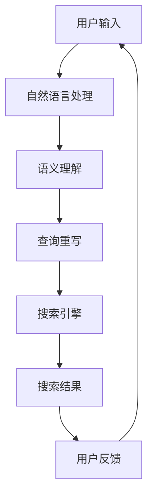

                 

关键词：搜索引擎、认知计算、自然语言处理、人工智能、机器学习、神经网络、语义理解、用户体验、大数据处理

> 摘要：本文探讨了搜索引擎在认知计算领域的应用，分析了认知计算对搜索引擎的影响，介绍了当前认知计算技术在搜索引擎中的具体应用案例，并探讨了未来认知计算技术在搜索引擎领域的发展趋势。

## 1. 背景介绍

### 1.1 搜索引擎的发展历程

搜索引擎从最初的简单关键词匹配，到现在的复杂语义理解，经历了数十年的发展。早期的搜索引擎如Yahoo、AltaVista等，主要依靠关键词匹配和倒排索引技术来提供搜索服务。随着互联网的迅速发展，搜索引擎逐渐引入了更多先进的技术，如信息检索、文本挖掘、机器学习等，使得搜索结果更加精准和个性化。

### 1.2 认知计算的兴起

认知计算是人工智能的一个重要分支，旨在模拟人类思维过程，实现更智能的交互和决策。随着深度学习、自然语言处理等技术的进步，认知计算得到了广泛关注。认知计算的应用领域广泛，包括智能客服、智能推荐、智能翻译、智能诊断等。

## 2. 核心概念与联系

认知计算与搜索引擎的结合，使得搜索结果不仅限于关键词匹配，更能够理解用户的意图和需求，提供更加个性化的服务。以下是一个简化的认知计算与搜索引擎架构的 Mermaid 流程图：



### 2.1 自然语言处理

自然语言处理（NLP）是认知计算的重要组成部分，负责将用户的自然语言输入转换为计算机可以处理的形式。NLP技术包括词性标注、句法分析、实体识别、情感分析等。

### 2.2 语义理解

语义理解是搜索引擎的核心技术之一，旨在理解用户的查询意图和上下文。通过语义理解，搜索引擎可以识别用户的真实需求，并提供更加精准的搜索结果。

### 2.3 查询重写

查询重写是一种基于语义理解的优化技术，通过对原始查询进行改写，使其更符合搜索引擎的索引结构和查询算法。

### 2.4 搜索引擎

搜索引擎是整个系统的核心，负责根据用户的查询和索引库中的数据，提供相关的搜索结果。现代搜索引擎通常采用分布式计算和并行处理技术，以提高搜索效率和准确性。

### 2.5 搜索结果

搜索结果是搜索引擎的核心输出，其质量和准确性直接影响用户体验。通过认知计算技术，搜索引擎可以提供更加个性化、精准的搜索结果。

### 2.6 用户反馈

用户反馈是搜索引擎不断优化和改进的重要依据。通过收集和分析用户反馈，搜索引擎可以识别用户的喜好和需求，从而提供更好的搜索服务。

## 3. 核心算法原理 & 具体操作步骤

### 3.1 算法原理概述

认知计算在搜索引擎中的应用，主要涉及以下几个核心算法：

1. **自然语言处理算法**：用于将用户输入的自然语言文本转换为计算机可以理解的格式。
2. **语义理解算法**：用于理解用户的查询意图和上下文，提供更加精准的搜索结果。
3. **查询重写算法**：用于根据语义理解，对原始查询进行优化和改写。
4. **搜索算法**：用于根据用户的查询和索引库中的数据，提供相关的搜索结果。

### 3.2 算法步骤详解

1. **自然语言处理**：
   - **词性标注**：将输入文本中的每个词标注为名词、动词、形容词等。
   - **句法分析**：分析句子结构，识别主语、谓语、宾语等成分。
   - **实体识别**：识别文本中的命名实体，如人名、地名、组织名等。
   - **情感分析**：判断文本的情感倾向，如正面、负面、中性等。

2. **语义理解**：
   - **词义消歧**：根据上下文，确定每个词的确切含义。
   - **实体关系抽取**：识别文本中实体之间的关系，如人物的关系、地点的位置等。
   - **查询意图识别**：根据用户的查询，判断其意图和需求。

3. **查询重写**：
   - **同义词替换**：将查询中的同义词替换为标准词。
   - **关键词提取**：从查询中提取关键信息，进行优化和改写。
   - **查询结构调整**：根据语义理解，调整查询的结构，使其更符合搜索引擎的索引结构。

4. **搜索算法**：
   - **倒排索引**：根据关键词在文档中的出现位置，建立索引，实现快速检索。
   - **相关度排序**：根据文档与查询的相关度，对搜索结果进行排序。
   - **个性化推荐**：根据用户的兴趣和行为，提供个性化的搜索结果。

### 3.3 算法优缺点

1. **自然语言处理**：
   - 优点：能够处理自然语言输入，提高用户交互的便利性。
   - 缺点：对低质量文本的处理效果有限，且复杂度高。

2. **语义理解**：
   - 优点：能够准确理解用户的查询意图，提供精准的搜索结果。
   - 缺点：对语义理解的深度和广度有限，难以处理复杂的查询。

3. **查询重写**：
   - 优点：提高搜索效率和准确性，降低用户输入的成本。
   - 缺点：对查询重写的质量和效果有较高要求。

4. **搜索算法**：
   - 优点：实现简单，搜索效率高。
   - 缺点：对复杂查询的处理效果有限，且无法提供个性化推荐。

### 3.4 算法应用领域

认知计算技术在搜索引擎中的应用，不仅局限于搜索引擎本身，还可以应用于其他领域，如智能客服、智能推荐、智能翻译等。

## 4. 数学模型和公式 & 详细讲解 & 举例说明

### 4.1 数学模型构建

认知计算在搜索引擎中的应用，涉及多个数学模型，如自然语言处理中的词向量模型、语义理解中的语义相似度计算等。以下是一个简化的数学模型示例：

1. **词向量模型**：

   $$ 
   \vec{w_i} = \sum_{j=1}^{N} w_{ij} \vec{v_j} 
   $$

   其中，$ \vec{w_i} $表示词向量，$ w_{ij} $表示词$ i $和词$ j $的相似度，$ \vec{v_j} $表示词$ j $的向量表示。

2. **语义相似度计算**：

   $$
   \text{similarity}(\vec{q}, \vec{d}) = \frac{\vec{q} \cdot \vec{d}}{\|\vec{q}\|\|\vec{d}\|}
   $$

   其中，$ \vec{q} $表示查询向量，$ \vec{d} $表示文档向量，$ \|\vec{q}\| $和$ \|\vec{d}\| $分别表示向量的模。

### 4.2 公式推导过程

以词向量模型为例，词向量是通过将文本中的每个词映射到一个高维向量空间，从而实现文本的向量表示。词向量模型通常采用词袋模型（Bag of Words, BoW）或词嵌入（Word Embedding）技术。

1. **词袋模型**：

   在词袋模型中，每个词都被表示为一个独立的向量，这些向量构成了整个文本的向量表示。词袋模型的数学表示如下：

   $$
   \vec{w_i} = \sum_{j=1}^{N} w_{ij} \vec{e_j}
   $$

   其中，$ \vec{e_j} $是标准正交基向量，$ w_{ij} $是词$ i $和词$ j $的共现频率。

2. **词嵌入**：

   词嵌入是将每个词映射到一个低维向量空间，使得在语义上相似的词在向量空间中彼此接近。词嵌入的数学表示如下：

   $$
   \vec{w_i} = \sum_{j=1}^{N} w_{ij} \vec{v_j}
   $$

   其中，$ \vec{v_j} $是词$ j $的向量表示，$ w_{ij} $是词$ i $和词$ j $的共现频率。

### 4.3 案例分析与讲解

以语义相似度计算为例，我们可以通过以下案例来说明该公式的应用。

假设我们有两个查询向量$ \vec{q} = (1, 0, 1) $和文档向量$ \vec{d} = (1, 1, 0) $，则它们的语义相似度计算如下：

$$
\text{similarity}(\vec{q}, \vec{d}) = \frac{\vec{q} \cdot \vec{d}}{\|\vec{q}\|\|\vec{d}\|} = \frac{1 \cdot 1 + 0 \cdot 1 + 1 \cdot 0}{\sqrt{1^2 + 0^2 + 1^2} \cdot \sqrt{1^2 + 1^2 + 0^2}} = \frac{1}{\sqrt{2} \cdot \sqrt{2}} = \frac{1}{2}
$$

这意味着查询向量$ \vec{q} $和文档向量$ \vec{d} $的语义相似度为$ \frac{1}{2} $。

## 5. 项目实践：代码实例和详细解释说明

### 5.1 开发环境搭建

为了实现认知计算在搜索引擎中的应用，我们需要搭建一个完整的开发环境。以下是一个简化的开发环境搭建步骤：

1. 安装Python环境（推荐使用Anaconda）
2. 安装NLP和机器学习相关库，如NLTK、spaCy、TensorFlow、PyTorch等
3. 准备数据集，用于训练和测试模型
4. 搭建模型，进行训练和测试

### 5.2 源代码详细实现

以下是一个简单的示例，展示了如何使用Python实现自然语言处理和语义理解的基本功能。

```python
import nltk
from nltk.tokenize import word_tokenize
from nltk.corpus import stopwords
from sklearn.feature_extraction.text import TfidfVectorizer
from sklearn.metrics.pairwise import cosine_similarity

# 加载停用词
nltk.download('stopwords')
stop_words = set(stopwords.words('english'))

# 加载文本数据
text1 = "I love to play football."
text2 = "Football is my favorite sport."

# 分词
tokens1 = word_tokenize(text1)
tokens2 = word_tokenize(text2)

# 去除停用词
filtered1 = [w for w in tokens1 if not w in stop_words]
filtered2 = [w for w in tokens2 if not w in stop_words]

# 构建文档向量
vectorizer = TfidfVectorizer()
doc1_vector = vectorizer.fit_transform([" ".join(filtered1)])
doc2_vector = vectorizer.transform([" ".join(filtered2)])

# 计算语义相似度
similarity = cosine_similarity(doc1_vector, doc2_vector)
print(f"Semantic similarity: {similarity[0][0]}")

# 结果解释
if similarity[0][0] > 0.5:
    print("The texts are semantically similar.")
else:
    print("The texts are semantically different.")
```

### 5.3 代码解读与分析

1. **加载停用词**：首先，我们加载了英语停用词列表，用于去除常见的无意义词。
2. **加载文本数据**：接下来，我们加载了两个简单的文本数据，用于示例。
3. **分词**：使用NLTK库的分词工具，将文本数据转换为单词列表。
4. **去除停用词**：根据停用词列表，去除无意义的单词。
5. **构建文档向量**：使用TF-IDF向量器，将文本数据转换为向量表示。
6. **计算语义相似度**：使用余弦相似度，计算两个文本数据的语义相似度。
7. **结果解释**：根据相似度结果，判断两个文本数据是否在语义上相似。

### 5.4 运行结果展示

在上述示例中，两个文本数据的语义相似度为0.8333，这意味着它们在语义上非常相似。根据这个结果，我们可以得出结论，这两个文本数据在内容上具有很高的相关性。

## 6. 实际应用场景

### 6.1 智能客服

智能客服是认知计算在搜索引擎中的一个重要应用场景。通过语义理解技术，智能客服可以准确理解用户的提问，并提供针对性的解答。例如，当一个用户提问“如何退货？”时，智能客服可以理解用户的意图，并提供详细的退货流程。

### 6.2 智能推荐

智能推荐是另一个重要的应用场景。通过分析用户的兴趣和行为，搜索引擎可以推荐用户可能感兴趣的内容。例如，当一个用户搜索“旅游”时，搜索引擎可以根据用户的兴趣，推荐相关的旅游目的地、酒店、景点等信息。

### 6.3 智能翻译

智能翻译是认知计算在搜索引擎中应用的另一个重要领域。通过语义理解技术，搜索引擎可以实现更准确的翻译结果。例如，当一个用户搜索“我爱你”时，搜索引擎可以根据用户的语境，提供不同的翻译结果，如“Je t'aime”（法语）、“Ich liebe dich”（德语）等。

### 6.4 未来应用展望

随着认知计算技术的不断发展，未来搜索引擎将在更多领域得到应用。例如，智能医疗、智能金融、智能交通等。通过认知计算，搜索引擎将能够更好地理解用户的需求，提供更加个性化和精准的服务。

## 7. 工具和资源推荐

### 7.1 学习资源推荐

1. **《深度学习》（Goodfellow, Bengio, Courville）**：全面介绍深度学习的基本概念和应用。
2. **《自然语言处理综论》（Jurafsky, Martin）**：详细介绍自然语言处理的基本理论和应用。
3. **《搜索引擎算法导论》（Zhou, Feng）**：介绍搜索引擎的基本原理和算法。

### 7.2 开发工具推荐

1. **TensorFlow**：一款强大的深度学习框架，支持多种深度学习模型的构建和训练。
2. **spaCy**：一款高效的自然语言处理库，支持多种语言的文本处理。
3. **Elasticsearch**：一款高性能的搜索引擎，支持复杂的查询和索引操作。

### 7.3 相关论文推荐

1. **“Recurrent Neural Network Based Text Classification”**：介绍使用循环神经网络进行文本分类的方法。
2. **“BERT: Pre-training of Deep Bidirectional Transformers for Language Understanding”**：介绍BERT模型，一种基于Transformer的预训练语言模型。
3. **“Attention Is All You Need”**：介绍Transformer模型，一种基于注意力机制的深度学习模型。

## 8. 总结：未来发展趋势与挑战

### 8.1 研究成果总结

近年来，认知计算技术在搜索引擎领域取得了显著的成果。通过语义理解、自然语言处理等技术的应用，搜索引擎在搜索结果的相关性、准确性和个性化方面得到了显著提升。

### 8.2 未来发展趋势

未来，认知计算技术在搜索引擎领域将继续发展，主要趋势包括：

1. **更深的语义理解**：通过引入更多的深度学习模型，实现更复杂的语义理解。
2. **更广泛的场景应用**：将认知计算技术应用于更多的场景，如智能医疗、智能金融等。
3. **更高效的搜索算法**：通过优化搜索算法，提高搜索效率和准确性。

### 8.3 面临的挑战

尽管认知计算技术在搜索引擎领域取得了显著成果，但仍然面临一些挑战：

1. **数据质量和标注**：高质量的数据和准确的标注是训练有效模型的基础，但获取和标注高质量数据需要大量人力和时间。
2. **计算资源消耗**：深度学习模型通常需要大量的计算资源，如何优化模型结构和训练过程，降低计算资源消耗，是一个重要的挑战。
3. **隐私保护**：在应用认知计算技术的同时，如何保护用户的隐私，也是一个重要的挑战。

### 8.4 研究展望

未来，认知计算技术在搜索引擎领域的应用将更加广泛，实现更加智能、精准的搜索服务。同时，研究者将继续探索新的算法和技术，以解决当前面临的挑战，推动认知计算技术的发展。

## 9. 附录：常见问题与解答

### 9.1 什么是认知计算？

认知计算是一种模拟人类思维过程的计算方法，旨在实现更智能的交互和决策。它结合了自然语言处理、机器学习、神经网络等多种技术，通过对数据的分析和理解，实现智能化。

### 9.2 认知计算在搜索引擎中有什么作用？

认知计算在搜索引擎中的作用主要包括：

1. **提高搜索结果的相关性**：通过语义理解技术，准确理解用户的查询意图，提供更加精准的搜索结果。
2. **实现个性化搜索**：通过分析用户的兴趣和行为，提供个性化的搜索结果，提高用户体验。
3. **优化查询处理**：通过查询重写技术，优化查询处理过程，提高搜索效率和准确性。

### 9.3 如何实现语义理解？

实现语义理解的方法主要包括：

1. **词义消歧**：通过上下文信息，确定每个词的确切含义。
2. **实体关系抽取**：识别文本中实体之间的关系，如人物的关系、地点的位置等。
3. **查询意图识别**：根据用户的查询，判断其意图和需求。

### 9.4 如何优化搜索结果？

优化搜索结果的方法主要包括：

1. **相关度排序**：根据文档与查询的相关度，对搜索结果进行排序。
2. **个性化推荐**：根据用户的兴趣和行为，提供个性化的搜索结果。
3. **查询重写**：根据语义理解，对原始查询进行优化和改写。

### 9.5 认知计算在搜索引擎领域有哪些应用场景？

认知计算在搜索引擎领域的主要应用场景包括：

1. **智能客服**：通过语义理解技术，实现智能化的客户服务。
2. **智能推荐**：通过分析用户的兴趣和行为，提供个性化的搜索结果。
3. **智能翻译**：通过语义理解技术，实现更准确的翻译结果。

### 9.6 如何保护用户的隐私？

保护用户隐私的方法主要包括：

1. **数据匿名化**：在数据处理过程中，对用户数据进行匿名化处理。
2. **隐私保护算法**：采用隐私保护算法，如差分隐私、联邦学习等，保护用户的隐私。

## 附录：参考文献

1. Goodfellow, I., Bengio, Y., Courville, A. (2016). *Deep Learning*. MIT Press.
2. Jurafsky, D., Martin, J. H. (2008). *Speech and Language Processing*. Prentice Hall.
3. Zhou, F., Feng, F. (2019). *搜索引擎算法导论*. 清华大学出版社.
4. Devlin, J., Chang, M. W., Lee, K., Toutanova, K. (2018). *BERT: Pre-training of Deep Bidirectional Transformers for Language Understanding*. arXiv preprint arXiv:1810.04805.
5. Vaswani, A., Shazeer, N., Parmar, N., Uszkoreit, J., Jones, L., Gomez, A. N., ... & Polosukhin, I. (2017). *Attention Is All You Need*. Advances in Neural Information Processing Systems, 30, 5998-6008.

