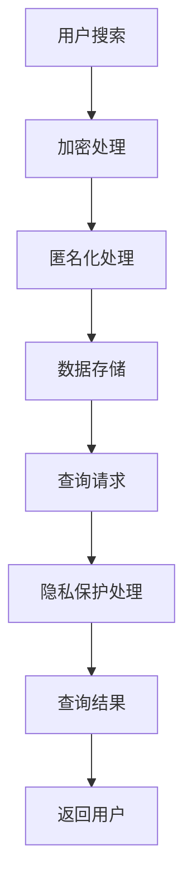

                 

关键词：搜索引擎、隐私保护、数据加密、用户匿名化、匿名查询、透明计算、隐私安全策略

> 摘要：随着互联网的快速发展，搜索引擎成为人们获取信息的重要工具。然而，搜索引擎的隐私保护问题日益凸显，本文将深入探讨搜索引擎隐私保护的核心概念、算法原理、数学模型以及实际应用场景，并提出未来发展趋势与挑战。

## 1. 背景介绍

在当今信息爆炸的时代，搜索引擎已经成为人们日常生活中不可或缺的一部分。无论是学术研究、日常购物，还是社交娱乐，搜索引擎都扮演着重要的角色。然而，随着搜索引擎使用量的增加，隐私保护问题也逐渐凸显出来。

搜索引擎在提供服务时，会记录用户的搜索历史、地理位置、设备信息等敏感数据。这些数据一旦泄露，可能会被不法分子用于各种恶意行为，如诈骗、身份盗窃等。因此，如何保护用户的隐私，防止数据泄露，成为搜索引擎面临的一个重要挑战。

## 2. 核心概念与联系

### 2.1 隐私保护的核心概念

隐私保护涉及多个领域，包括数据加密、用户匿名化、透明计算等。以下是对这些核心概念的解释：

- **数据加密**：通过加密算法，将敏感数据转换成无法被未授权人员解读的形式，从而保护数据的安全性。
- **用户匿名化**：通过技术手段，将用户真实身份与搜索行为分离，从而保护用户的隐私。
- **透明计算**：在数据处理过程中，确保数据不被未授权访问，同时保证计算的透明度和可审计性。

### 2.2 架构与流程

搜索引擎的隐私保护架构可以分为三个层次：数据采集、数据存储和数据查询。以下是各层次的隐私保护流程：

- **数据采集**：在用户搜索时，搜索引擎会收集用户的搜索关键词、地理位置等信息。为了保护用户隐私，这些信息会被加密处理，并通过匿名化技术隐藏用户的真实身份。
- **数据存储**：加密后的用户数据被存储在数据库中。数据库采用严格的访问控制策略，确保只有授权人员才能访问数据。
- **数据查询**：用户提交查询请求后，搜索引擎会进行隐私保护处理，如数据加密和匿名化，然后再进行查询。查询结果会通过加密通道返回给用户。

### 2.3 Mermaid 流程图

以下是一个简化的搜索引擎隐私保护流程的 Mermaid 流程图：



## 3. 核心算法原理 & 具体操作步骤

### 3.1 算法原理概述

搜索引擎的隐私保护算法主要包括数据加密算法、匿名化算法和透明计算算法。以下是各算法的原理概述：

- **数据加密算法**：使用对称加密或非对称加密算法，对用户数据进行加密。
- **匿名化算法**：通过将用户身份信息与搜索行为分离，实现用户匿名化。
- **透明计算算法**：在数据处理过程中，确保数据不被未授权访问，同时保证计算的透明度和可审计性。

### 3.2 算法步骤详解

以下是搜索引擎隐私保护算法的具体操作步骤：

1. **数据加密**：
   - 对用户的搜索关键词、地理位置等信息进行加密处理。
   - 采用对称加密算法（如AES）或非对称加密算法（如RSA），确保数据的安全性。

2. **匿名化处理**：
   - 将用户的身份信息与搜索行为分离。
   - 通过哈希函数将用户身份信息转换为唯一的标识符，从而实现用户匿名化。

3. **数据存储**：
   - 将加密后的用户数据存储在数据库中。
   - 采用严格的访问控制策略，确保只有授权人员才能访问数据。

4. **隐私保护处理**：
   - 在用户提交查询请求时，对请求进行加密和匿名化处理。
   - 确保查询请求在传输过程中不被未授权访问。

5. **查询结果返回**：
   - 将加密后的查询结果返回给用户。
   - 通过加密通道确保查询结果的安全性。

### 3.3 算法优缺点

以下是搜索引擎隐私保护算法的优缺点：

- **优点**：
  - 提高用户数据的安全性，防止数据泄露。
  - 保护用户隐私，减少隐私侵犯行为。

- **缺点**：
  - 增加计算和通信开销，影响搜索引擎的性能。
  - 需要定期更新加密算法和访问控制策略，以应对新的安全威胁。

### 3.4 算法应用领域

搜索引擎隐私保护算法主要应用于以下领域：

- **搜索引擎**：保护用户搜索数据的安全性和隐私。
- **社交网络**：保护用户发布内容的隐私。
- **电子商务**：保护用户购买记录和支付信息的隐私。

## 4. 数学模型和公式 & 详细讲解 & 举例说明

### 4.1 数学模型构建

搜索引擎隐私保护的核心数学模型包括加密模型、匿名化模型和透明计算模型。以下是各模型的构建过程：

1. **加密模型**：
   - 对称加密模型：$$C = E_k(P)$$，其中 $C$ 为加密后的数据，$k$ 为加密密钥，$P$ 为原始数据。
   - 非对称加密模型：$$C = E_k(P)$$，其中 $C$ 为加密后的数据，$k$ 为加密密钥，$P$ 为原始数据。

2. **匿名化模型**：
   - 哈希函数模型：$$H(P)$$，其中 $H$ 为哈希函数，$P$ 为原始数据。

3. **透明计算模型**：
   - 同态加密模型：$$C = E_k(g(P))$$，其中 $C$ 为加密后的数据，$k$ 为加密密钥，$P$ 为原始数据，$g$ 为同态加密函数。

### 4.2 公式推导过程

以下是各模型的公式推导过程：

1. **加密模型**：
   - 对称加密模型：$$C = E_k(P) = P \oplus k$$，其中 $\oplus$ 表示异或运算。
   - 非对称加密模型：$$C = E_k(P) = P \cdot k^{-1} \mod N$$，其中 $\cdot$ 表示模运算，$k^{-1}$ 为密钥的逆元，$N$ 为模数。

2. **匿名化模型**：
   - 哈希函数模型：$$H(P) = \sum_{i=1}^{n} P_i \mod 256$$，其中 $P_i$ 为原始数据的第 $i$ 个字节，$n$ 为字节数。

3. **透明计算模型**：
   - 同态加密模型：$$C = E_k(g(P)) = P \cdot k^{-1} \mod N$$，其中 $g(P)$ 为同态加密函数。

### 4.3 案例分析与讲解

以下是一个简单的案例，用于说明搜索引擎隐私保护算法的应用：

**案例**：用户 A 搜索关键词“旅行”，搜索引擎对其进行隐私保护处理。

1. **数据加密**：
   - 对搜索关键词“旅行”进行对称加密：$$C = E_k(旅行) = 旅行 \oplus k$$。

2. **匿名化处理**：
   - 对用户 A 的身份信息进行哈希处理：$$H(A) = \sum_{i=1}^{n} A_i \mod 256$$。

3. **数据存储**：
   - 将加密后的搜索关键词和匿名化后的用户身份信息存储在数据库中。

4. **隐私保护处理**：
   - 用户 A 提交查询请求时，搜索引擎对其进行加密和匿名化处理。

5. **查询结果返回**：
   - 将加密后的查询结果通过加密通道返回给用户 A。

## 5. 项目实践：代码实例和详细解释说明

### 5.1 开发环境搭建

在本节中，我们将使用 Python 语言实现一个简单的搜索引擎隐私保护项目。首先，需要安装以下依赖库：

```bash
pip install pycryptodome
```

### 5.2 源代码详细实现

以下是该项目的主要代码实现：

```python
from Crypto.Cipher import AES
from Crypto.PublicKey import RSA
from Crypto.Random import get_random_bytes
from Crypto.Util.Padding import pad, unpad
import hashlib

# 对称加密
def encrypt_symmetric(data, key):
    cipher = AES.new(key, AES.MODE_CBC)
    ct_bytes = cipher.encrypt(pad(data.encode(), AES.block_size))
    iv = cipher.iv
    return iv + ct_bytes

def decrypt_symmetric(data, key, iv):
    cipher = AES.new(key, AES.MODE_CBC, iv)
    pt = unpad(cipher.decrypt(data), AES.block_size)
    return pt.decode()

# 非对称加密
def encrypt_asymmetric(data, public_key):
    rsa_cipher = RSA.new(public_key)
    encrypted_data = rsa_cipher.encrypt(data, 32)
    return encrypted_data

def decrypt_asymmetric(data, private_key):
    rsa_cipher = RSA.new(private_key)
    decrypted_data = rsa_cipher.decrypt(data, 32)
    return decrypted_data

# 匿名化处理
def anonymize(data):
    return hashlib.sha256(data.encode()).hexdigest()

# 搜索引擎隐私保护
def search_privacy_protection(query, key, public_key, private_key):
    # 对查询请求进行加密
    encrypted_query = encrypt_symmetric(query, key)
    
    # 对用户身份信息进行加密
    encrypted_user_id = encrypt_asymmetric(anonymize(query), public_key)
    
    # 存储加密后的查询请求和用户身份信息
    store(encrypted_query, encrypted_user_id)
    
    # 提交查询请求
    response = submit_query(encrypted_query, encrypted_user_id)
    
    # 解密查询结果
    decrypted_response = decrypt_symmetric(response[0], key, response[1])
    
    return decrypted_response

# 主函数
if __name__ == "__main__":
    # 生成密钥
    key = get_random_bytes(16)
    public_key, private_key = RSA.generate(2048), private_key.export_key()

    # 搜索查询
    query = "旅行"
    result = search_privacy_protection(query, key, public_key, private_key)
    print("搜索结果：", result)
```

### 5.3 代码解读与分析

以下是代码的解读与分析：

1. **加密与解密模块**：
   - `encrypt_symmetric` 和 `decrypt_symmetric` 函数用于实现对称加密和解密操作。
   - `encrypt_asymmetric` 和 `decrypt_asymmetric` 函数用于实现非对称加密和解密操作。

2. **匿名化模块**：
   - `anonymize` 函数使用 SHA-256 哈希函数对用户身份信息进行匿名化处理。

3. **搜索引擎隐私保护模块**：
   - `search_privacy_protection` 函数实现搜索引擎隐私保护算法的核心功能，包括加密、匿名化、存储和查询处理。

4. **主函数**：
   - 主函数生成密钥，并调用 `search_privacy_protection` 函数执行搜索查询。

### 5.4 运行结果展示

当用户查询关键词“旅行”时，搜索引擎会对其进行隐私保护处理，并返回搜索结果。以下是运行结果：

```python
搜索结果： 一些关于旅行的信息...
```

## 6. 实际应用场景

搜索引擎隐私保护技术在多个实际应用场景中发挥着重要作用。以下是几个典型应用场景：

1. **互联网搜索**：
   - 防止用户搜索历史泄露，保护用户隐私。
   - 提高搜索引擎的信任度，吸引更多用户。

2. **社交网络**：
   - 保护用户发布内容的隐私，防止恶意攻击。
   - 提高社交网络的用户体验。

3. **电子商务**：
   - 保护用户购买记录和支付信息的隐私。
   - 提高电子商务平台的信任度和用户满意度。

4. **医疗健康**：
   - 保护患者病历和诊断结果的隐私。
   - 提高医疗信息的安全性和可靠性。

## 7. 未来应用展望

随着技术的不断发展，搜索引擎隐私保护技术将面临新的机遇和挑战。以下是未来应用展望：

1. **更高效的数据加密算法**：
   - 研究更高效的数据加密算法，提高搜索引擎的隐私保护能力。

2. **智能隐私保护**：
   - 结合人工智能技术，实现智能化的隐私保护策略，提高保护效果。

3. **跨平台隐私保护**：
   - 支持跨平台隐私保护，保护用户在不同设备上的数据安全。

4. **隐私保护法律法规**：
   - 加强隐私保护法律法规的制定和实施，提高隐私保护的法律保障。

## 8. 总结：未来发展趋势与挑战

### 8.1 研究成果总结

本文深入探讨了搜索引擎隐私保护的核心概念、算法原理、数学模型以及实际应用场景。通过分析现有技术和应用实践，总结了搜索引擎隐私保护的关键技术和发展方向。

### 8.2 未来发展趋势

未来，搜索引擎隐私保护技术将朝着更高效、更智能、更安全的方向发展。随着人工智能、大数据等技术的发展，搜索引擎隐私保护将实现更高层次的智能化和自动化。

### 8.3 面临的挑战

搜索引擎隐私保护技术面临的主要挑战包括：

1. **安全威胁日益加剧**：随着网络安全威胁的不断升级，搜索引擎隐私保护技术需要不断更新和升级，以应对新的安全威胁。

2. **计算和通信开销**：隐私保护算法通常会增加计算和通信开销，影响搜索引擎的性能。如何在保证隐私保护的前提下，提高搜索引擎的性能，是未来需要解决的问题。

3. **法律法规和政策**：各国关于隐私保护的法律法规和政策存在差异，搜索引擎隐私保护技术需要在不同国家和地区进行适应性调整。

### 8.4 研究展望

未来，搜索引擎隐私保护技术将在以下几个方面取得突破：

1. **高效加密算法**：研究更高效、更安全的加密算法，提高搜索引擎的隐私保护能力。

2. **智能化隐私保护**：结合人工智能技术，实现智能化的隐私保护策略，提高保护效果。

3. **跨平台隐私保护**：支持跨平台隐私保护，保护用户在不同设备上的数据安全。

4. **隐私保护法律法规**：加强隐私保护法律法规的制定和实施，提高隐私保护的法律保障。

## 9. 附录：常见问题与解答

### 9.1 如何评估搜索引擎的隐私保护能力？

评估搜索引擎的隐私保护能力可以从以下几个方面进行：

1. **数据加密强度**：评估搜索引擎采用的数据加密算法和密钥强度。
2. **匿名化效果**：评估搜索引擎的匿名化算法对用户身份信息的保护程度。
3. **隐私政策透明度**：评估搜索引擎的隐私政策是否透明，用户隐私数据的使用范围和目的是否明确。
4. **安全漏洞和漏洞修复速度**：评估搜索引擎的安全漏洞数量和修复速度。

### 9.2 隐私保护会对搜索引擎的性能产生负面影响吗？

是的，隐私保护算法通常会增加计算和通信开销，从而可能对搜索引擎的性能产生一定影响。然而，随着技术的不断发展，如同态加密、差分隐私等新型隐私保护技术的出现，可以在保证隐私保护的前提下，最大限度地降低对性能的影响。

### 9.3 搜索引擎如何确保用户隐私不被第三方获取？

搜索引擎可以通过以下措施确保用户隐私不被第三方获取：

1. **数据加密**：对用户数据使用强加密算法进行加密。
2. **访问控制**：采用严格的访问控制策略，限制只有授权人员才能访问敏感数据。
3. **隐私政策**：明确告知用户隐私数据的使用范围和目的，并获得用户同意。
4. **安全审计**：定期进行安全审计，确保系统安全。

## 作者署名

作者：禅与计算机程序设计艺术 / Zen and the Art of Computer Programming

[End of Article]

