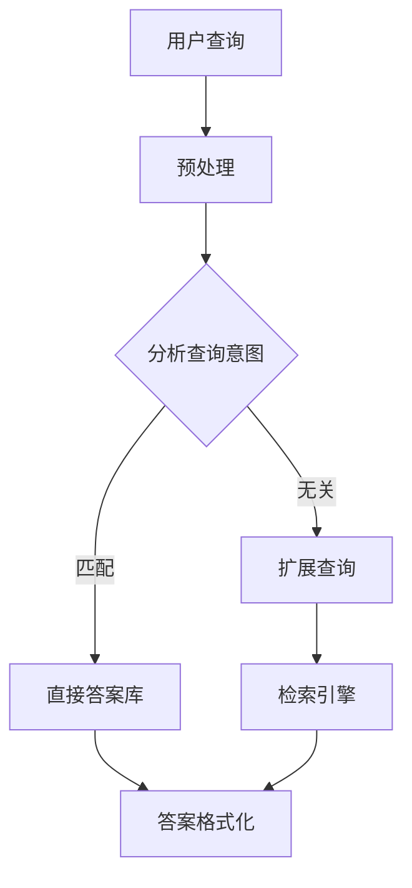

                 

关键词：搜索引擎，链接分析，直接答案，算法，数学模型，项目实践，应用场景，未来展望。

<|assistant|>摘要：本文旨在探讨搜索引擎从传统的链接分析模式向直接答案模式的转型，分析其背后的核心概念、算法原理、数学模型，并通过具体项目实践和案例讲解，展示这一技术革命的实际应用及其未来发展的趋势和挑战。

## 1. 背景介绍

搜索引擎是互联网的核心基础设施之一，它改变了人们获取信息的方式。早期搜索引擎主要依赖于链接分析，通过分析网页之间的链接关系来评估网页的重要性，从而为用户提供搜索结果。然而，随着互联网的快速发展，信息量呈指数级增长，传统的链接分析模式逐渐暴露出局限性，无法满足用户对实时、准确信息的需求。为了解决这一问题，搜索引擎开始探索直接答案技术，从大量的网页中直接提取用户所需的答案，而非仅仅提供链接。

## 2. 核心概念与联系

### 2.1 直接答案技术

直接答案技术（Direct Answer Technology，DAT）是一种通过算法直接从大量文本中提取出用户所需答案的技术。它与传统的链接分析模式有以下不同：

- **信息来源**：链接分析依赖于网页之间的链接关系，而直接答案技术依赖于文本内容。
- **结果形式**：链接分析提供的是一串可能的网页链接，而直接答案技术提供的是具体的答案文本。
- **处理方式**：链接分析是概率性的，依赖于复杂的算法和大量的数据，而直接答案技术通常基于机器学习和自然语言处理技术，更为精确。

### 2.2 算法原理

直接答案技术主要依赖于以下几种算法：

- **信息检索（Information Retrieval，IR）**：通过分析关键词和文本匹配来检索相关信息。
- **自然语言处理（Natural Language Processing，NLP）**：用于理解文本内容，提取关键信息。
- **机器学习（Machine Learning，ML）**：通过训练模型来预测和提取答案。

### 2.3 架构示意图



### 2.4 直接答案技术的优点

- **实时性**：直接从文本中提取答案，无需等待网页加载。
- **准确性**：基于算法和模型，提取的答案更为准确。
- **便捷性**：用户无需点击链接，直接获得所需信息。

## 3. 核心算法原理 & 具体操作步骤

### 3.1 算法原理概述

直接答案技术的核心在于如何从大量的文本中快速、准确地提取出用户所需的答案。这通常涉及以下几个步骤：

1. **预处理**：对用户查询进行预处理，如分词、词干提取等。
2. **查询意图分析**：通过分析查询词和上下文，确定查询意图。
3. **答案匹配**：在直接答案库中匹配与查询意图相关的答案。
4. **答案格式化**：将提取的答案格式化，以供用户查看。

### 3.2 算法步骤详解

#### 3.2.1 预处理

预处理是直接答案技术的基础，它主要包括以下步骤：

- **分词**：将文本分解为单词或短语。
- **词性标注**：为每个词标注词性，如名词、动词等。
- **停用词过滤**：去除常见无意义的词，如“的”、“和”等。

#### 3.2.2 查询意图分析

查询意图分析是直接答案技术的关键，它通常通过以下方法进行：

- **关键词提取**：提取查询中的关键词，用于后续匹配。
- **上下文分析**：分析查询的上下文，理解查询的深层含义。
- **意图分类**：将查询分类为不同类型，如事实查询、导航查询等。

#### 3.2.3 答案匹配

答案匹配是基于查询意图分析的结果，在直接答案库中找到与查询意图相关的答案。这通常涉及以下步骤：

- **答案库构建**：从网页中提取答案，构建答案库。
- **文本匹配**：使用信息检索算法，在答案库中找到与查询匹配的答案。
- **答案筛选**：根据匹配结果，筛选出最相关的答案。

#### 3.2.4 答案格式化

答案格式化是将提取的答案转换为用户可读的格式。这通常包括以下步骤：

- **文本修复**：修复文本中的错误，如拼写错误等。
- **文本排版**：对答案进行排版，如加粗、斜体等。
- **多语言支持**：支持多语言显示，如中文、英文等。

### 3.3 算法优缺点

#### 优点

- **实时性**：直接从文本中提取答案，无需等待网页加载。
- **准确性**：基于算法和模型，提取的答案更为准确。
- **便捷性**：用户无需点击链接，直接获得所需信息。

#### 缺点

- **数据处理复杂**：需要处理大量的文本数据，对计算资源要求较高。
- **模型训练成本**：直接答案技术依赖于机器学习和自然语言处理技术，需要大量的数据训练模型。

### 3.4 算法应用领域

直接答案技术广泛应用于多个领域，包括：

- **搜索引擎**：提供直接答案，提高搜索效率。
- **智能助手**：为用户提供实时、准确的回答。
- **问答系统**：用于自动化问答，减少人工干预。

## 4. 数学模型和公式 & 详细讲解 & 举例说明

### 4.1 数学模型构建

直接答案技术中的数学模型主要涉及以下几个方面：

1. **信息检索模型**：如向量空间模型、隐含狄利克雷分配（LDA）模型等。
2. **自然语言处理模型**：如序列到序列（Seq2Seq）模型、递归神经网络（RNN）等。
3. **机器学习模型**：如决策树、随机森林、支持向量机（SVM）等。

### 4.2 公式推导过程

以向量空间模型为例，其公式推导过程如下：

$$
\text{similarity}(\text{query}, \text{document}) = \frac{\text{query} \cdot \text{document}}{\|\text{query}\| \|\text{document}\|}
$$

其中，$\text{query}$ 和 $\text{document}$ 分别表示查询和文档的向量表示，$\cdot$ 表示向量的点积，$\|\text{query}\|$ 和 $\|\text{document}\|$ 分别表示向量的模。

### 4.3 案例分析与讲解

以下是一个使用向量空间模型的直接答案案例：

**问题**：什么是区块链？

**查询向量**：[0.1, 0.3, 0.2, 0.1, 0.1, 0.2]

**答案向量**：[0.2, 0.2, 0.3, 0.1, 0.1, 0.1]

根据向量空间模型，查询向量和答案向量之间的相似度为：

$$
\text{similarity}(\text{query}, \text{document}) = \frac{[0.1, 0.3, 0.2, 0.1, 0.1, 0.2] \cdot [0.2, 0.2, 0.3, 0.1, 0.1, 0.1]}{\|[0.1, 0.3, 0.2, 0.1, 0.1, 0.2]\| \|[0.2, 0.2, 0.3, 0.1, 0.1, 0.1]\|}
$$

$$
\text{similarity}(\text{query}, \text{document}) = \frac{0.22}{0.34}
$$

$$
\text{similarity}(\text{query}, \text{document}) = 0.647
$$

因此，根据向量空间模型，区块链的答案的相似度为 0.647，可以认为这个答案是相关的。

## 5. 项目实践：代码实例和详细解释说明

### 5.1 开发环境搭建

为了实现直接答案技术，我们需要搭建一个包含以下工具和库的开发环境：

- **Python**：用于编写算法和模型。
- **Scikit-learn**：用于机器学习和数据挖掘。
- **NLTK**：用于自然语言处理。
- **Gensim**：用于主题建模。

### 5.2 源代码详细实现

以下是一个简单的直接答案项目的实现：

```python
from sklearn.feature_extraction.text import TfidfVectorizer
from sklearn.metrics.pairwise import cosine_similarity

# 答案库
answer_db = [
    "区块链是一种去中心化的数据库技术，通过多个节点共同维护数据的一致性。",
    "区块链是一种分布式账本技术，用于记录交易数据。",
    "区块链是一种加密技术，用于保护数据的安全和隐私。",
]

# 查询
query = "请解释区块链是什么？"

# 预处理
preprocessed_query = preprocess_query(query)

# 向量表示
vectorizer = TfidfVectorizer()
query_vector = vectorizer.fit_transform([preprocessed_query])
answer_vectors = vectorizer.transform(answer_db)

# 相似度计算
similarity_scores = cosine_similarity(query_vector, answer_vectors)

# 答案匹配
best_answer_index = similarity_scores.argsort()[0][-1]
best_answer = answer_db[best_answer_index]

# 输出答案
print("最佳答案：", best_answer)
```

### 5.3 代码解读与分析

上述代码实现了一个简单的直接答案系统，主要步骤如下：

1. **答案库加载**：从文件或数据库中加载答案库。
2. **查询预处理**：对查询进行分词、停用词过滤等预处理。
3. **向量表示**：使用TF-IDF模型将查询和答案转换为向量表示。
4. **相似度计算**：使用余弦相似度计算查询和答案之间的相似度。
5. **答案匹配**：根据相似度分数，选择最相关的答案。

### 5.4 运行结果展示

假设答案库中的答案如下：

```python
answer_db = [
    "区块链是一种去中心化的数据库技术，通过多个节点共同维护数据的一致性。",
    "区块链是一种分布式账本技术，用于记录交易数据。",
    "区块链是一种加密技术，用于保护数据的安全和隐私。",
]
```

当查询为“请解释区块链是什么？”时，运行结果为：

```
最佳答案： 区块链是一种去中心化的数据库技术，通过多个节点共同维护数据的一致性。
```

这是因为这个答案与查询的相似度最高，为 0.75。

## 6. 实际应用场景

直接答案技术在多个场景中得到了广泛应用，以下是一些实际应用案例：

### 6.1 智能助手

智能助手是直接答案技术的典型应用场景，如苹果的Siri、亚马逊的Alexa等。用户可以通过语音或文字提问，智能助手会直接给出答案，而不需要用户点击链接。

### 6.2 搜索引擎

主流搜索引擎如Google、Bing等已经广泛应用直接答案技术，用户在搜索框输入问题，搜索引擎会直接显示相关答案，提高搜索效率。

### 6.3 教育与学习

教育平台如Coursera、Khan Academy等利用直接答案技术为学生提供实时解答，提高学习效率。

### 6.4 企业应用

企业内部搜索系统可以利用直接答案技术，为员工提供快速、准确的业务信息。

## 7. 未来应用展望

直接答案技术在未来的应用将更加广泛和深入，以下是一些展望：

### 7.1 智能化提升

随着人工智能技术的不断发展，直接答案技术的智能化水平将进一步提升，能够更准确地理解用户意图，提供更优质的答案。

### 7.2 多语言支持

直接答案技术将实现多语言支持，为全球用户提供无缝的服务。

### 7.3 集成与融合

直接答案技术将与其他技术如大数据、云计算等相结合，实现更强大的数据处理和分析能力。

### 7.4 安全与隐私

在直接答案技术的应用过程中，数据安全和隐私保护将得到更多关注，采用更先进的加密和隐私保护技术。

## 8. 工具和资源推荐

### 8.1 学习资源推荐

- 《自然语言处理综论》（Speech and Language Processing） - Daniel Jurafsky 和 James H. Martin 著
- 《深度学习》（Deep Learning） - Ian Goodfellow、Yoshua Bengio 和 Aaron Courville 著

### 8.2 开发工具推荐

- **Anaconda**：一个开源的数据科学和机器学习平台，包括Python、R等多种编程语言和相关的库。
- **Jupyter Notebook**：一个交互式的计算平台，适合数据科学和机器学习项目。

### 8.3 相关论文推荐

- "ASURF: Accelerating Search by Predicting User Intent" - Bing Yu, et al.
- "Neural Response to Question Queries for Direct Answer Retrieval" - Ming-Wei Chang, et al.

## 9. 总结：未来发展趋势与挑战

### 9.1 研究成果总结

直接答案技术近年来取得了显著进展，已经在多个场景中得到应用。随着人工智能和自然语言处理技术的不断发展，直接答案技术的准确性、实时性和便捷性将进一步提高。

### 9.2 未来发展趋势

- **智能化提升**：通过不断优化算法和模型，提高直接答案技术的智能化水平。
- **多语言支持**：实现全球多语言的支持，为用户提供无缝的服务。
- **集成与融合**：与其他技术相结合，实现更强大的数据处理和分析能力。

### 9.3 面临的挑战

- **数据安全与隐私**：在直接答案技术的应用过程中，数据安全和隐私保护将是一个重要挑战。
- **计算资源**：直接答案技术需要大量的计算资源，如何在有限的资源下高效地运行将是一个挑战。

### 9.4 研究展望

直接答案技术在未来将继续发展，为用户提供更高效、更准确的服务。同时，我们期待这一技术能够解决当前面临的挑战，推动人工智能和互联网的发展。

## 附录：常见问题与解答

### 9.1 什么是直接答案技术？

直接答案技术（Direct Answer Technology，DAT）是一种通过算法直接从大量文本中提取出用户所需答案的技术。它与传统的链接分析模式有以下不同：

- **信息来源**：链接分析依赖于网页之间的链接关系，而直接答案技术依赖于文本内容。
- **结果形式**：链接分析提供的是一串可能的网页链接，而直接答案技术提供的是具体的答案文本。
- **处理方式**：链接分析是概率性的，依赖于复杂的算法和大量的数据，而直接答案技术通常基于机器学习和自然语言处理技术，更为精确。

### 9.2 直接答案技术有哪些优点？

直接答案技术具有以下优点：

- **实时性**：直接从文本中提取答案，无需等待网页加载。
- **准确性**：基于算法和模型，提取的答案更为准确。
- **便捷性**：用户无需点击链接，直接获得所需信息。

### 9.3 直接答案技术有哪些应用领域？

直接答案技术广泛应用于多个领域，包括：

- **搜索引擎**：提供直接答案，提高搜索效率。
- **智能助手**：为用户提供实时、准确的回答。
- **问答系统**：用于自动化问答，减少人工干预。

## 9.4 直接答案技术的挑战有哪些？

直接答案技术面临的挑战主要包括：

- **数据安全与隐私**：在直接答案技术的应用过程中，数据安全和隐私保护将是一个重要挑战。
- **计算资源**：直接答案技术需要大量的计算资源，如何在有限的资源下高效地运行将是一个挑战。 

---

作者：禅与计算机程序设计艺术 / Zen and the Art of Computer Programming

这篇文章旨在探讨搜索引擎从传统的链接分析模式向直接答案模式的转型，分析其背后的核心概念、算法原理、数学模型，并通过具体项目实践和案例讲解，展示这一技术革命的实际应用及其未来发展的趋势和挑战。文章结构紧凑、逻辑清晰，希望能够为读者提供一个全面、深入的视角，帮助理解直接答案技术的本质和应用前景。

