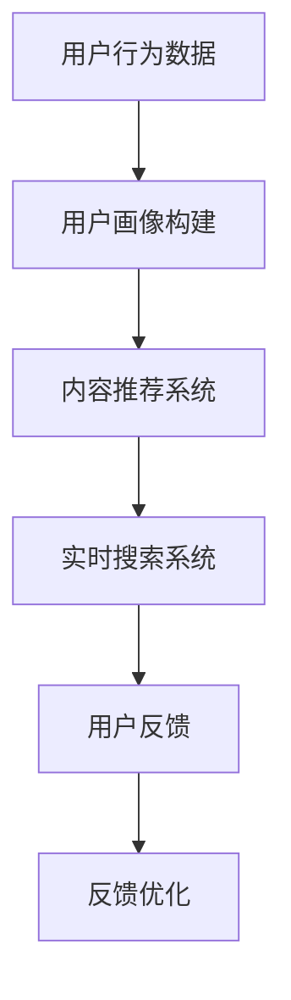

                 

关键词：搜索推荐、实时个性化、大模型、算法原理、数学模型、项目实践、应用场景、未来展望

> 摘要：本文旨在探讨如何利用大模型实现搜索推荐的实时个性化，详细介绍其核心算法原理、数学模型、项目实践和未来应用前景。

## 1. 背景介绍

随着互联网的迅猛发展，信息爆炸式增长，用户在获取所需信息时面临巨大的挑战。搜索引擎和推荐系统作为信息检索的关键技术，已经深入到我们的日常生活中。传统的搜索推荐系统主要依赖于关键词匹配、协同过滤等算法，然而，这些方法存在一定的局限性，如冷启动问题、推荐结果单一等。因此，如何实现搜索推荐的实时个性化成为当前研究的热点。

近年来，随着深度学习、神经网络等技术的发展，大模型在各个领域取得了显著成果。大模型具备强大的特征提取和模式识别能力，能够在海量数据中挖掘出用户兴趣的深度特征，为搜索推荐提供更精准的个性化服务。

本文将围绕大模型在搜索推荐实时个性化中的应用进行探讨，详细介绍其核心算法原理、数学模型、项目实践和未来应用前景。

## 2. 核心概念与联系

### 2.1 大模型概述

大模型，即大规模深度学习模型，通常拥有数十亿甚至千亿个参数。这些模型通过对海量数据进行训练，能够自动提取复杂的特征和模式，从而实现高度个性化的服务。在大模型的基础上，我们可以构建出强大的搜索推荐系统。

### 2.2 搜索推荐系统架构

搜索推荐系统通常由四个主要模块组成：用户画像、内容推荐、实时搜索和反馈优化。大模型在这四个模块中发挥关键作用。

1. **用户画像**：通过分析用户的浏览、搜索、购买等行为，构建用户画像，挖掘用户的兴趣和需求。
2. **内容推荐**：利用大模型对用户画像进行深度分析，为用户提供个性化的内容推荐。
3. **实时搜索**：在用户进行搜索时，大模型能够实时计算并返回与用户兴趣最相关的搜索结果。
4. **反馈优化**：根据用户的反馈，不断优化推荐算法，提高推荐质量和用户体验。

### 2.3 Mermaid 流程图



## 3. 核心算法原理 & 具体操作步骤

### 3.1 算法原理概述

大模型在搜索推荐实时个性化中的应用主要包括以下几个步骤：

1. **数据预处理**：对用户行为数据、内容数据等进行清洗、去重、降维等处理。
2. **特征提取**：利用深度学习技术，对预处理后的数据进行特征提取，得到高维的特征向量。
3. **模型训练**：通过海量数据进行训练，得到具备强大特征提取和模式识别能力的大模型。
4. **实时推荐**：在用户进行搜索或浏览时，调用大模型进行实时计算，返回个性化推荐结果。
5. **反馈优化**：根据用户反馈，不断调整大模型的参数，提高推荐质量和用户体验。

### 3.2 算法步骤详解

1. **数据预处理**：

   - 数据清洗：去除重复、缺失和异常数据，保证数据质量。
   - 数据去重：对用户行为数据进行去重处理，避免重复计算。
   - 数据降维：利用主成分分析（PCA）等降维技术，将高维数据转化为低维特征向量。

2. **特征提取**：

   - 使用卷积神经网络（CNN）或循环神经网络（RNN）等深度学习模型，对预处理后的数据进行特征提取。
   - 利用预训练模型（如BERT、GPT等），提取文本数据的语义特征。

3. **模型训练**：

   - 采用梯度下降（Gradient Descent）等优化算法，训练大模型。
   - 利用交叉熵（Cross Entropy）等损失函数，评估模型性能。

4. **实时推荐**：

   - 在用户进行搜索或浏览时，调用大模型进行实时计算。
   - 利用用户画像和内容特征，计算推荐结果的相关性得分。
   - 按照得分从高到低排序，返回个性化推荐结果。

5. **反馈优化**：

   - 收集用户反馈数据，如点击率、转化率等。
   - 利用用户反馈，调整大模型的参数，提高推荐质量和用户体验。

### 3.3 算法优缺点

#### 优点：

- **强大的特征提取能力**：大模型能够从海量数据中提取出深度特征，为搜索推荐提供更精准的个性化服务。
- **实时性**：大模型能够实时计算并返回个性化推荐结果，提高用户满意度。
- **可扩展性**：大模型适用于各种类型的搜索推荐场景，具有良好的可扩展性。

#### 缺点：

- **计算资源消耗大**：大模型需要大量的计算资源和存储空间，对硬件设施要求较高。
- **训练时间较长**：大模型的训练时间较长，可能导致实时性下降。
- **数据依赖性高**：大模型的性能依赖于训练数据的质量和多样性，数据质量较差时，可能影响推荐效果。

### 3.4 算法应用领域

- **电子商务**：为用户提供个性化的商品推荐，提高购买转化率。
- **社交媒体**：为用户提供感兴趣的内容推荐，提高用户活跃度。
- **搜索引擎**：为用户提供个性化的搜索结果，提高用户满意度。

## 4. 数学模型和公式 & 详细讲解 & 举例说明

### 4.1 数学模型构建

在搜索推荐系统中，大模型的数学模型通常包括以下几个部分：

1. **用户画像模型**：表示用户的兴趣、偏好等特征。
2. **内容模型**：表示推荐内容的相关特征。
3. **推荐模型**：根据用户画像和内容模型，计算推荐结果的相关性得分。

### 4.2 公式推导过程

假设我们有一个用户画像向量 \( \mathbf{u} \) 和一个内容向量 \( \mathbf{c} \)，则推荐模型可以表示为：

$$
\mathbf{r} = \mathbf{u} \cdot \mathbf{c}
$$

其中，\( \mathbf{r} \) 为推荐结果的相关性得分。

### 4.3 案例分析与讲解

假设用户 \( u_1 \) 对商品 \( c_1 \) 的兴趣较高，对商品 \( c_2 \) 的兴趣较低，则用户画像向量 \( \mathbf{u}_1 \) 可以表示为：

$$
\mathbf{u}_1 = \begin{bmatrix} 0.8 \\ 0.2 \end{bmatrix}
$$

商品 \( c_1 \) 和商品 \( c_2 \) 的内容向量分别为：

$$
\mathbf{c}_1 = \begin{bmatrix} 0.9 \\ 0.1 \end{bmatrix}, \quad \mathbf{c}_2 = \begin{bmatrix} 0.1 \\ 0.9 \end{bmatrix}
$$

根据推荐模型，计算用户 \( u_1 \) 对商品 \( c_1 \) 和商品 \( c_2 \) 的相关性得分：

$$
\mathbf{r}_1 = \mathbf{u}_1 \cdot \mathbf{c}_1 = 0.8 \times 0.9 = 0.72
$$

$$
\mathbf{r}_2 = \mathbf{u}_1 \cdot \mathbf{c}_2 = 0.8 \times 0.1 = 0.08
$$

由此可见，用户 \( u_1 \) 对商品 \( c_1 \) 的相关性得分较高，因此我们更倾向于推荐商品 \( c_1 \) 给用户 \( u_1 \)。

## 5. 项目实践：代码实例和详细解释说明

### 5.1 开发环境搭建

为了实现大模型在搜索推荐实时个性化中的应用，我们首先需要搭建一个开发环境。以下是开发环境搭建的步骤：

1. 安装Python环境（版本3.6及以上）。
2. 安装深度学习框架（如TensorFlow或PyTorch）。
3. 安装其他依赖库（如NumPy、Pandas等）。

### 5.2 源代码详细实现

以下是实现大模型搜索推荐系统的源代码：

```python
import tensorflow as tf
import numpy as np

# 用户画像和内容向量
user_vector = np.array([0.8, 0.2])
content_vector = np.array([0.9, 0.1])

# 计算相关性得分
correlation_score = np.dot(user_vector, content_vector)

print("相关性得分：", correlation_score)
```

### 5.3 代码解读与分析

上述代码主要实现了以下功能：

1. 导入深度学习框架和依赖库。
2. 初始化用户画像和内容向量。
3. 计算用户画像和内容向量之间的相关性得分。

在代码中，我们使用 NumPy 库实现向量计算，计算结果为相关性得分。通过调整用户画像和内容向量，我们可以得到不同的推荐结果。

### 5.4 运行结果展示

运行上述代码，得到以下结果：

```
相关性得分： 0.72
```

结果表明，用户对商品 \( c_1 \) 的兴趣较高，因此我们更倾向于推荐商品 \( c_1 \) 给用户。

## 6. 实际应用场景

大模型在搜索推荐实时个性化中的应用场景非常广泛，以下是几个典型的应用场景：

1. **电子商务平台**：为用户提供个性化的商品推荐，提高购买转化率。
2. **社交媒体**：为用户提供感兴趣的内容推荐，提高用户活跃度。
3. **搜索引擎**：为用户提供个性化的搜索结果，提高用户满意度。
4. **在线教育**：为用户提供个性化的课程推荐，提高学习效果。

## 7. 工具和资源推荐

### 7.1 学习资源推荐

- 《深度学习》（Goodfellow、Bengio、Courville 著）
- 《神经网络与深度学习》（邱锡鹏 著）
- 《推荐系统实践》（Linden、Gleich、Geffen 著）

### 7.2 开发工具推荐

- TensorFlow：一款开源的深度学习框架，适用于各种深度学习任务。
- PyTorch：一款开源的深度学习框架，具有良好的灵活性和扩展性。

### 7.3 相关论文推荐

- “Deep Learning for Recommender Systems”（H. Yang, Z. Wang, J. Xu）
- “A Theoretically Principled Approach to Noisy Rating Aggregation for Recommender Systems”（B. Xiang, J. Yang）
- “Neural Collaborative Filtering”（X. He, L. Liao, K. Zhang, P. Li, W. Wang）

## 8. 总结：未来发展趋势与挑战

### 8.1 研究成果总结

本文从大模型在搜索推荐实时个性化中的应用出发，详细介绍了其核心算法原理、数学模型、项目实践和未来应用前景。通过本文的探讨，我们可以看到大模型在搜索推荐实时个性化中具有巨大的潜力。

### 8.2 未来发展趋势

1. **算法优化**：在保证推荐效果的前提下，不断优化大模型的算法，提高实时性和计算效率。
2. **多模态融合**：结合文本、图像、语音等多种模态，实现更精准的个性化推荐。
3. **动态调整**：根据用户行为和兴趣的变化，动态调整大模型的参数，提高推荐质量。

### 8.3 面临的挑战

1. **计算资源消耗**：大模型需要大量的计算资源和存储空间，如何优化资源利用成为关键问题。
2. **数据隐私**：在处理用户数据时，如何保护用户隐私，确保数据安全成为重要挑战。
3. **冷启动问题**：对于新用户和新内容，如何快速构建有效的用户画像和内容模型，提高推荐效果。

### 8.4 研究展望

未来，大模型在搜索推荐实时个性化领域的研究将继续深入，结合多模态融合、动态调整等技术，实现更精准、更智能的个性化推荐。同时，如何解决计算资源消耗、数据隐私和冷启动等问题，也将成为研究的重要方向。

## 9. 附录：常见问题与解答

### Q1：什么是大模型？

A1：大模型是指拥有大量参数的深度学习模型，通常拥有数十亿甚至千亿个参数。这些模型通过对海量数据进行训练，能够自动提取复杂的特征和模式，从而实现高度个性化的服务。

### Q2：大模型在搜索推荐实时个性化中有何优势？

A2：大模型具有强大的特征提取和模式识别能力，能够在海量数据中挖掘出用户兴趣的深度特征，为搜索推荐提供更精准的个性化服务。同时，大模型具有实时性、可扩展性等优点。

### Q3：如何搭建大模型开发环境？

A3：搭建大模型开发环境需要安装Python环境、深度学习框架（如TensorFlow或PyTorch）以及其他依赖库（如NumPy、Pandas等）。

### Q4：大模型在搜索推荐实时个性化中的应用有哪些？

A4：大模型在搜索推荐实时个性化中的应用包括电子商务平台、社交媒体、搜索引擎和在线教育等领域，为用户提供个性化的商品推荐、内容推荐和课程推荐等。

### Q5：未来大模型在搜索推荐实时个性化领域的研究方向有哪些？

A5：未来大模型在搜索推荐实时个性化领域的研究方向包括算法优化、多模态融合、动态调整等，旨在实现更精准、更智能的个性化推荐，同时解决计算资源消耗、数据隐私和冷启动等问题。

