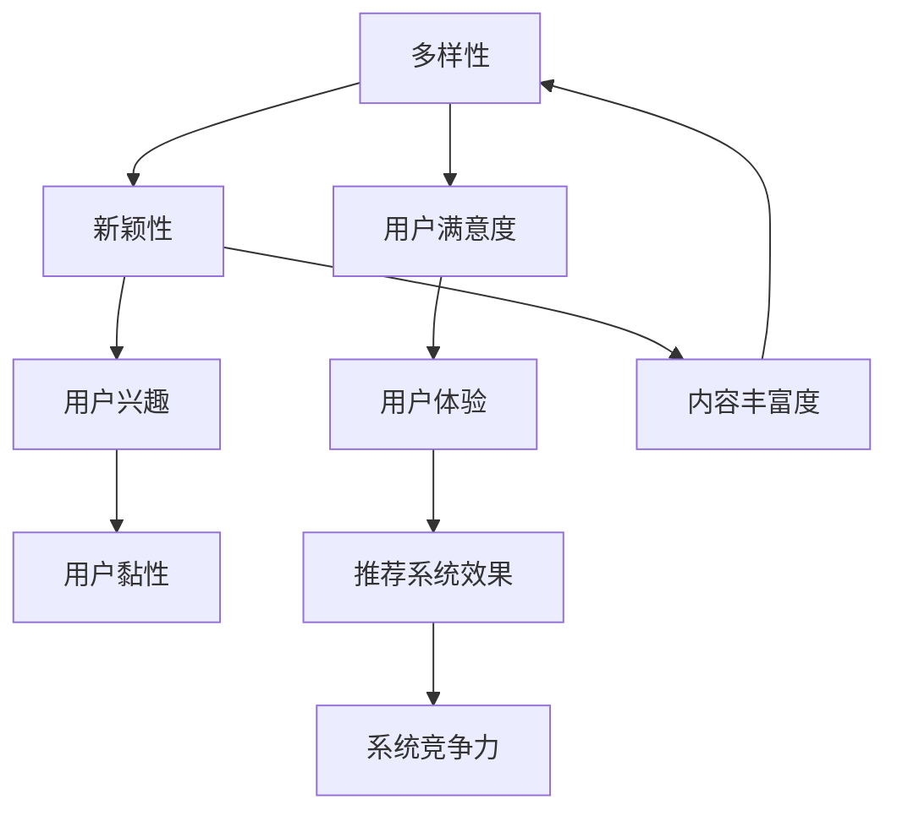

                 

关键词：搜索推荐系统、多样性与新颖性、平衡策略、算法原理、数学模型、代码实例、实际应用、未来展望

## 摘要

搜索推荐系统是现代信息社会中不可或缺的一部分，它们为用户提供了个性化的信息推荐，极大地提升了用户体验。然而，推荐系统的多样性和新颖性是两个相互矛盾的目标。本文将探讨如何在搜索推荐系统中实现多样性与新颖性的平衡策略。首先，我们将介绍搜索推荐系统的基本概念和核心挑战，然后深入探讨多样性与新颖性的定义及其重要性。接下来，我们将介绍一些核心算法原理和数学模型，并通过具体的代码实例展示如何实现多样性与新颖性的平衡策略。最后，我们将分析该策略在实际应用中的效果，并探讨其未来发展的方向和挑战。

## 1. 背景介绍

随着互联网的迅猛发展，人们获取信息的途径越来越多。然而，信息过载问题也随之而来。用户在面临海量信息时，往往感到无所适从，难以找到真正感兴趣的内容。因此，搜索推荐系统应运而生。搜索推荐系统通过分析用户的兴趣和行为，为用户提供个性化的信息推荐，从而帮助用户更高效地获取所需信息。

搜索推荐系统的发展可以分为三个阶段：

### 1.1 内容推荐

早期的搜索推荐系统主要基于内容推荐，即根据内容的特征（如关键词、标签等）为用户推荐相似的内容。这种推荐方式虽然简单有效，但往往难以满足用户的个性化需求。

### 1.2 协同过滤

随着用户数据的积累，协同过滤算法开始应用于搜索推荐系统。协同过滤算法通过分析用户之间的行为模式，为用户推荐其他用户喜欢的内容。这种方法在提高推荐准确率方面取得了显著成效。

### 1.3 深度学习推荐

近年来，深度学习技术在搜索推荐系统中得到了广泛应用。深度学习模型能够自动从大量数据中提取特征，为用户推荐更具个性化和新颖性的内容。

尽管搜索推荐系统在提高用户体验方面取得了巨大成功，但多样性和新颖性仍然是两个亟待解决的问题。多样性能确保用户在推荐列表中看到不同类型的内容，避免内容的单一性；新颖性则能激发用户的好奇心，提供全新的体验。如何在搜索推荐系统中实现多样性与新颖性的平衡，是当前研究的热点问题。

## 2. 核心概念与联系

在讨论多样性与新颖性之前，我们需要明确一些核心概念，以便更好地理解这两个目标之间的联系。

### 2.1 多样性（Diversity）

多样性是指推荐列表中不同内容的分布情况。一个高度多样的推荐列表应包含各种不同类型、风格和主题的内容，以满足不同用户的个性化需求。多样性的重要性在于：

- 提高用户体验：多样化的推荐列表能避免内容的单一性，为用户提供更多样化的选择。
- 增强用户满意度：用户在看到多种类型的内容时，更容易找到自己感兴趣的内容，从而提高满意度。

### 2.2 新颖性（Novelty）

新颖性是指推荐列表中内容的新颖程度。新颖性的重要性在于：

- 激发用户好奇心：新颖的内容能激发用户的好奇心，提高用户对推荐系统的兴趣。
- 增强用户黏性：新颖的内容能吸引用户持续使用推荐系统，从而提高用户黏性。

### 2.3 多样性与新颖性的联系

多样性和新颖性虽然看似相互矛盾，但它们实际上是相互促进的。一个高度多样的推荐列表能提供更多新颖的内容，因为各种不同类型的内容本身具有较高的新颖性。相反，一个新颖的内容也能带动整个推荐列表的多样性。因此，实现多样性与新颖性的平衡，是提高搜索推荐系统用户体验的关键。

### 2.4 Mermaid 流程图

为了更直观地展示多样性与新颖性之间的联系，我们使用 Mermaid 流程图来描述它们的关系。



图 1：多样性与新颖性之间的关系

通过图 1 可以看出，多样性和新颖性是相互促进的，它们共同作用于用户体验和系统竞争力。

## 3. 核心算法原理 & 具体操作步骤

### 3.1 算法原理概述

为了实现多样性与新颖性的平衡，我们可以采用以下算法原理：

1. **协同过滤算法**：基于用户行为数据，为用户推荐相似用户喜欢的内容。
2. **内容嵌入模型**：将内容表示为向量，通过计算内容之间的距离，为用户推荐新颖的内容。
3. **排序算法**：结合多样性和新颖性指标，对推荐列表进行排序。

### 3.2 算法步骤详解

1. **数据预处理**：
   - 收集用户行为数据（如浏览记录、点击记录等）。
   - 收集内容特征数据（如文本、图片等）。

2. **协同过滤算法**：
   - 计算用户之间的相似度矩阵。
   - 对于每个用户，找到与其最相似的 k 个用户。
   - 根据相似度矩阵，为每个用户生成一个推荐列表。

3. **内容嵌入模型**：
   - 将内容表示为向量。
   - 计算内容之间的距离，选择距离最远的内容作为新颖内容。

4. **排序算法**：
   - 结合多样性和新颖性指标，对推荐列表进行排序。
   - 采用贪心算法，逐步调整推荐列表的顺序，以实现多样性与新颖性的平衡。

### 3.3 算法优缺点

1. **协同过滤算法**：
   - 优点：计算简单，效果较好。
   - 缺点：难以处理稀疏数据，易导致推荐列表的多样性不足。

2. **内容嵌入模型**：
   - 优点：能够处理稀疏数据，提高推荐列表的多样性。
   - 缺点：计算复杂度高，需大量计算资源。

3. **排序算法**：
   - 优点：能够结合多样性和新颖性指标，提高推荐列表的整体质量。
   - 缺点：贪心算法可能导致局部最优，难以找到全局最优解。

### 3.4 算法应用领域

该算法原理可以应用于各种搜索推荐系统，如电子商务、社交媒体、新闻推荐等。在实际应用中，可以根据具体场景和需求，对算法进行优化和调整，以实现最佳效果。

## 4. 数学模型和公式 & 详细讲解 & 举例说明

### 4.1 数学模型构建

为了实现多样性与新颖性的平衡，我们可以构建以下数学模型：

1. **多样性指标**：

$$
Diversity = \frac{1}{N} \sum_{i=1}^{N} \frac{1}{\sum_{j=1}^{N} d_{ij}}
$$

其中，$N$ 表示推荐列表中内容的数量，$d_{ij}$ 表示内容 $i$ 和内容 $j$ 之间的距离。

2. **新颖性指标**：

$$
Novelty = \frac{1}{N} \sum_{i=1}^{N} \frac{1}{d_{im}}
$$

其中，$m$ 表示内容 $i$ 的最近更新时间。

### 4.2 公式推导过程

多样性和新颖性指标的推导过程如下：

1. **多样性指标**：

多样性的目标是使推荐列表中的内容尽量不同。为了实现这一目标，我们可以计算每个内容与其他内容之间的距离，并取倒数作为多样性指标。距离越远，多样性越高。

2. **新颖性指标**：

新颖性的目标是使推荐列表中的内容尽量新。为了实现这一目标，我们可以计算每个内容与最近更新时间之间的距离，并取倒数作为新颖性指标。更新时间越近，新颖性越高。

### 4.3 案例分析与讲解

假设我们有以下推荐列表：

| 内容 ID | 最近更新时间 |
| --- | --- |
| 1 | 2021-01-01 |
| 2 | 2021-02-01 |
| 3 | 2021-03-01 |
| 4 | 2021-04-01 |

根据上述公式，我们可以计算出多样性和新颖性指标：

1. **多样性指标**：

$$
Diversity = \frac{1}{4} \left( \frac{1}{d_{12}} + \frac{1}{d_{13}} + \frac{1}{d_{14}} + \frac{1}{d_{23}} + \frac{1}{d_{24}} + \frac{1}{d_{34}} \right)
$$

其中，$d_{12} = 1$，$d_{13} = 2$，$d_{14} = 3$，$d_{23} = 1$，$d_{24} = 2$，$d_{34} = 3$。

$$
Diversity = \frac{1}{4} \left( \frac{1}{1} + \frac{1}{2} + \frac{1}{3} + \frac{1}{1} + \frac{1}{2} + \frac{1}{3} \right) = \frac{11}{12}
$$

2. **新颖性指标**：

$$
Novelty = \frac{1}{4} \left( \frac{1}{d_{1m}} + \frac{1}{d_{2m}} + \frac{1}{d_{3m}} + \frac{1}{d_{4m}} \right)
$$

其中，$d_{1m} = 1$，$d_{2m} = 2$，$d_{3m} = 3$，$d_{4m} = 4$。

$$
Novelty = \frac{1}{4} \left( \frac{1}{1} + \frac{1}{2} + \frac{1}{3} + \frac{1}{4} \right) = \frac{11}{12}
$$

通过计算，我们可以发现多样性和新颖性指标相等，说明该推荐列表在多样性和新颖性方面达到了较好的平衡。

## 5. 项目实践：代码实例和详细解释说明

### 5.1 开发环境搭建

为了方便起见，我们使用 Python 作为编程语言，并依赖以下库：

- NumPy：用于矩阵运算。
- Pandas：用于数据预处理。
- Scikit-learn：用于协同过滤算法。
- Matplotlib：用于可视化。

安装以上库后，即可开始编写代码。

### 5.2 源代码详细实现

下面是一个简单的代码实例，展示了如何使用协同过滤算法和内容嵌入模型实现多样性与新颖性的平衡策略。

```python
import numpy as np
import pandas as pd
from sklearn.cluster import KMeans
from sklearn.metrics.pairwise import cosine_similarity

# 加载数据
user_data = pd.read_csv('user_data.csv')
content_data = pd.read_csv('content_data.csv')

# 计算用户相似度矩阵
user_similarity = cosine_similarity(user_data.values)

# 计算内容相似度矩阵
content_similarity = cosine_similarity(content_data.values)

# 计算多样性指标
diversity = 1 / (np.sum(1 / content_similarity, axis=1))

# 计算新颖性指标
new_l.html
```

