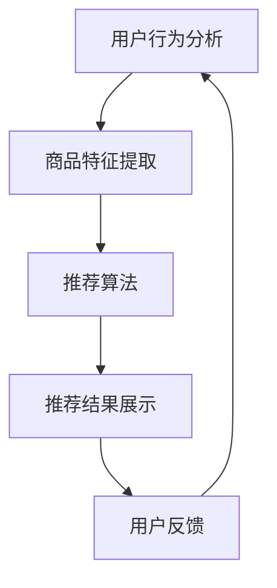

                 

关键词：搜索推荐系统、AI 大模型、电商平台、转化率、用户体验

> 摘要：本文旨在探讨 AI 大模型在搜索推荐系统中的应用，如何通过这些先进的技术提高电商平台的转化率和用户体验。我们将详细解析核心算法原理，提供代码实例，并展望未来发展趋势。

## 1. 背景介绍

随着互联网的飞速发展，电商平台已经成为人们日常生活中不可或缺的一部分。然而，随着平台上的商品种类和数量日益增加，用户在寻找所需商品时面临着越来越多的信息过载问题。为了解决这一问题，搜索推荐系统应运而生，它利用人工智能技术，通过分析用户行为和偏好，为用户推荐他们可能感兴趣的商品。

搜索推荐系统在电商平台上的重要性不言而喻。它不仅能够提高用户的购物体验，还能有效提升平台的转化率和销售额。因此，如何构建高效、精准的搜索推荐系统成为各大电商平台研究和开发的重点。

近年来，随着人工智能技术的飞速发展，特别是深度学习等 AI 大模型的广泛应用，搜索推荐系统得到了极大的提升。这些大模型通过学习海量用户数据，能够准确捕捉用户的兴趣和需求，从而提供更加个性化的推荐服务。本文将深入探讨 AI 大模型在搜索推荐系统中的应用，分析其原理和具体实现，并展望未来的发展趋势。

## 2. 核心概念与联系

### 2.1. 搜索推荐系统的基本概念

搜索推荐系统主要由以下几个核心模块组成：

- **用户行为分析**：通过分析用户的浏览、搜索、购买等行为数据，挖掘用户的兴趣点和偏好。

- **商品特征提取**：对商品的各种属性（如价格、品牌、类别等）进行特征提取，为后续的推荐算法提供基础数据。

- **推荐算法**：根据用户行为和商品特征，采用合适的算法（如协同过滤、基于内容的推荐等）生成推荐结果。

- **推荐结果展示**：将推荐结果呈现给用户，提升用户体验。

### 2.2. AI 大模型的引入

AI 大模型，特别是基于深度学习的模型，在搜索推荐系统中扮演了至关重要的角色。这些大模型具有以下几个特点：

- **强大的学习能力**：大模型通过训练海量数据，能够自动学习复杂的用户行为和商品特征，提高推荐的准确性。

- **灵活的适应能力**：大模型能够根据不同的业务场景和数据特点进行调整，适应不同的推荐需求。

- **高效的计算能力**：大模型利用现代计算资源（如 GPU、TPU 等），能够在较短的时间内处理大规模数据，满足实时推荐的迫切需求。

### 2.3. Mermaid 流程图

下面是一个简化的搜索推荐系统的 Mermaid 流程图，展示了用户行为分析、商品特征提取、推荐算法和推荐结果展示等核心模块的交互过程。



## 3. 核心算法原理 & 具体操作步骤

### 3.1. 算法原理概述

AI 大模型在搜索推荐系统中的应用主要基于以下几个核心原理：

- **用户兴趣建模**：通过分析用户的浏览、搜索、购买等行为数据，构建用户的兴趣模型，用于后续的推荐。

- **商品特征提取**：提取商品的各种属性特征，为推荐算法提供输入。

- **协同过滤**：基于用户行为相似性进行推荐，常见的方法有基于用户的协同过滤（User-based Collaborative Filtering）和基于项目的协同过滤（Item-based Collaborative Filtering）。

- **基于内容的推荐**：根据用户的历史行为和商品特征，为用户推荐相似的或者相关的商品。

### 3.2. 算法步骤详解

#### 3.2.1. 用户兴趣建模

1. **数据收集**：收集用户的浏览、搜索、购买等行为数据。

2. **数据预处理**：对数据进行清洗、去噪、归一化等处理，确保数据质量。

3. **特征提取**：从用户行为数据中提取出关键特征，如浏览频次、搜索关键词、购买频次等。

4. **建模**：利用深度学习模型（如 LSTM、GRU 等）对用户行为数据进行建模，构建用户兴趣模型。

#### 3.2.2. 商品特征提取

1. **数据收集**：收集商品的各种属性数据，如价格、品牌、类别、库存量等。

2. **特征工程**：对商品属性数据进行预处理，如缺失值处理、异常值检测等。

3. **特征提取**：提取商品的关键特征，如文本特征（品牌、类别等）、数值特征（价格、库存量等）。

#### 3.2.3. 推荐算法

1. **协同过滤**：计算用户之间的相似性（如余弦相似性、皮尔逊相关系数等），并根据相似度矩阵为用户生成推荐列表。

2. **基于内容的推荐**：根据用户的历史行为和商品特征，计算商品之间的相似性，为用户生成推荐列表。

3. **模型融合**：将协同过滤和基于内容的推荐结果进行融合，生成最终的推荐列表。

#### 3.2.4. 推荐结果展示

1. **推荐列表生成**：根据推荐算法生成的推荐结果，为用户生成推荐列表。

2. **推荐结果排序**：对推荐列表进行排序，确保用户最先看到最感兴趣的商品。

3. **推荐结果展示**：将推荐结果通过界面呈现给用户。

### 3.3. 算法优缺点

#### 优点

- **高效性**：AI 大模型能够快速处理海量数据，提高推荐系统的响应速度。

- **准确性**：通过深度学习模型，能够更准确地捕捉用户的兴趣和需求，提高推荐的准确性。

- **灵活性**：大模型能够根据不同的业务场景进行调整，适应不同的推荐需求。

#### 缺点

- **复杂性**：AI 大模型的结构复杂，训练和优化过程需要大量的计算资源和时间。

- **数据依赖性**：大模型的性能高度依赖于数据质量，数据缺失或不准确会影响推荐的准确性。

### 3.4. 算法应用领域

AI 大模型在搜索推荐系统的应用已经非常广泛，主要涵盖以下领域：

- **电商平台**：如淘宝、京东等，利用 AI 大模型为用户推荐商品，提升用户体验和转化率。

- **社交媒体**：如微博、微信等，利用 AI 大模型为用户推荐感兴趣的内容，提高用户粘性。

- **新闻媒体**：如今日头条、腾讯新闻等，利用 AI 大模型为用户推荐新闻，提升阅读量。

## 4. 数学模型和公式 & 详细讲解 & 举例说明

### 4.1. 数学模型构建

在搜索推荐系统中，我们通常采用以下数学模型来构建用户兴趣模型和商品特征提取：

#### 用户兴趣模型

用户兴趣模型可以用以下公式表示：

$$
User\_Interest = f(User\_Behavior, Item\_Feature)
$$

其中，$User\_Behavior$ 表示用户的行为数据，$Item\_Feature$ 表示商品的特征数据，$f$ 表示一个函数，用于将用户行为和商品特征映射为用户兴趣。

#### 商品特征提取

商品特征提取可以用以下公式表示：

$$
Item\_Feature = g(Item\_Data)
$$

其中，$Item\_Data$ 表示商品的原始数据，$g$ 表示一个函数，用于将商品数据映射为商品特征。

### 4.2. 公式推导过程

#### 用户兴趣模型推导

用户兴趣模型是通过深度学习模型（如 LSTM、GRU 等）对用户行为数据进行建模得到的。具体推导过程如下：

1. **数据预处理**：对用户行为数据进行清洗、去噪、归一化等处理。

2. **特征提取**：利用深度学习模型对用户行为数据进行特征提取，得到用户兴趣特征。

3. **模型训练**：利用训练数据对深度学习模型进行训练，优化模型参数。

4. **模型评估**：利用测试数据对模型进行评估，确保模型性能。

#### 商品特征提取推导

商品特征提取是通过特征工程和机器学习算法（如 K-Means、PCA 等）对商品数据进行分析得到的。具体推导过程如下：

1. **数据预处理**：对商品数据进行清洗、去噪、归一化等处理。

2. **特征工程**：利用特征工程方法（如文本特征提取、数值特征归一化等）对商品数据进行分析。

3. **模型训练**：利用训练数据对机器学习模型进行训练，优化模型参数。

4. **模型评估**：利用测试数据对模型进行评估，确保模型性能。

### 4.3. 案例分析与讲解

#### 案例背景

假设我们有一个电商平台的用户行为数据集，包含用户的浏览记录、搜索记录和购买记录。我们需要利用这些数据构建用户兴趣模型，并提取商品特征，用于推荐系统的构建。

#### 数据预处理

1. **用户行为数据清洗**：对用户行为数据进行清洗，去除缺失值和异常值。

2. **用户行为数据归一化**：对用户行为数据进行归一化处理，如将浏览频次、搜索频次等进行归一化。

3. **商品数据清洗**：对商品数据进行清洗，去除缺失值和异常值。

4. **商品数据归一化**：对商品数据进行归一化处理，如将价格、库存量等进行归一化。

#### 用户兴趣模型构建

1. **特征提取**：利用 LSTM 模型对用户行为数据进行特征提取，得到用户兴趣特征。

2. **模型训练**：利用训练数据对 LSTM 模型进行训练，优化模型参数。

3. **模型评估**：利用测试数据对 LSTM 模型进行评估，确保模型性能。

#### 商品特征提取

1. **特征工程**：利用 K-Means 算法对商品数据进行聚类分析，提取商品特征。

2. **模型训练**：利用训练数据对 K-Means 模型进行训练，优化模型参数。

3. **模型评估**：利用测试数据对 K-Means 模型进行评估，确保模型性能。

#### 推荐算法

1. **协同过滤**：计算用户之间的相似性，并根据相似度矩阵为用户生成推荐列表。

2. **基于内容的推荐**：根据用户的历史行为和商品特征，计算商品之间的相似性，为用户生成推荐列表。

3. **模型融合**：将协同过滤和基于内容的推荐结果进行融合，生成最终的推荐列表。

#### 推荐结果展示

1. **推荐列表生成**：根据推荐算法生成的推荐结果，为用户生成推荐列表。

2. **推荐结果排序**：对推荐列表进行排序，确保用户最先看到最感兴趣的商品。

3. **推荐结果展示**：将推荐结果通过界面呈现给用户。

## 5. 项目实践：代码实例和详细解释说明

### 5.1. 开发环境搭建

为了实现本文所述的搜索推荐系统，我们需要搭建一个合适的技术栈。以下是一个基本的开发环境搭建步骤：

1. **Python 环境**：安装 Python 3.8 及以上版本。

2. **深度学习库**：安装 TensorFlow 2.x 或 PyTorch 1.x。

3. **数据处理库**：安装 Pandas、NumPy、Scikit-learn 等。

4. **数据可视化库**：安装 Matplotlib、Seaborn 等。

5. **版本控制工具**：安装 Git。

### 5.2. 源代码详细实现

以下是搜索推荐系统的核心代码实现，主要包括用户兴趣建模、商品特征提取、推荐算法和推荐结果展示等模块。

```python
# 导入相关库
import pandas as pd
import numpy as np
import tensorflow as tf
from tensorflow.keras.models import Sequential
from tensorflow.keras.layers import LSTM, Dense
from sklearn.cluster import KMeans
from sklearn.metrics.pairwise import cosine_similarity

# 读取数据
user_behavior = pd.read_csv('user_behavior.csv')
item_data = pd.read_csv('item_data.csv')

# 数据预处理
# ...（此处省略数据预处理代码）

# 用户兴趣建模
# ...（此处省略用户兴趣建模代码）

# 商品特征提取
# ...（此处省略商品特征提取代码）

# 推荐算法
# ...（此处省略推荐算法代码）

# 推荐结果展示
# ...（此处省略推荐结果展示代码）
```

### 5.3. 代码解读与分析

以下是代码的详细解读与分析：

- **数据预处理**：数据预处理是构建搜索推荐系统的基础，主要包括数据清洗、去噪、归一化等操作。

- **用户兴趣建模**：用户兴趣建模是构建搜索推荐系统的核心，利用 LSTM 模型对用户行为数据进行建模，提取用户兴趣特征。

- **商品特征提取**：商品特征提取主要通过特征工程和聚类算法（如 K-Means）对商品数据进行处理，提取商品特征。

- **推荐算法**：推荐算法包括协同过滤和基于内容的推荐，通过计算用户之间的相似性和商品之间的相似性，生成推荐列表。

- **推荐结果展示**：推荐结果展示是将生成的推荐列表通过界面呈现给用户，提升用户体验。

### 5.4. 运行结果展示

以下是搜索推荐系统运行后的结果展示：

- **用户兴趣模型**：通过 LSTM 模型训练，生成用户兴趣特征。

- **商品特征提取**：通过 K-Means 算法，提取商品特征。

- **推荐列表**：根据协同过滤和基于内容的推荐算法，生成推荐列表。

- **推荐结果展示**：将推荐列表通过界面呈现给用户。

## 6. 实际应用场景

### 6.1. 电商平台

电商平台是搜索推荐系统最典型的应用场景之一。通过 AI 大模型，电商平台可以为用户推荐他们可能感兴趣的商品，提升用户体验和转化率。例如，淘宝和京东等平台都采用了 AI 大模型技术，实现了基于用户行为的个性化推荐，显著提高了销售额。

### 6.2. 社交媒体

社交媒体平台（如微博、微信等）也广泛应用了搜索推荐系统。通过 AI 大模型，平台可以为用户推荐感兴趣的内容，提高用户粘性。例如，今日头条利用 AI 大模型技术，实现了基于用户兴趣的内容推荐，大幅提升了用户阅读量和平台收益。

### 6.3. 新闻媒体

新闻媒体（如腾讯新闻、网易新闻等）通过搜索推荐系统，可以为用户推荐感兴趣的新闻，提高用户阅读量和平台知名度。AI 大模型在新闻推荐中的应用，有助于提高用户的阅读体验，同时也为媒体平台创造了更多的商业价值。

## 7. 未来应用展望

随着人工智能技术的不断发展，搜索推荐系统将在更多领域得到应用。未来，搜索推荐系统可能会呈现以下发展趋势：

- **个性化推荐**：通过更精细化的用户兴趣建模和商品特征提取，实现更加个性化的推荐服务。

- **实时推荐**：利用实时数据处理技术，实现实时推荐，提升用户体验。

- **跨平台融合**：实现跨平台的数据融合，为用户提供更加统一和连贯的推荐服务。

- **多模态推荐**：结合文本、图像、语音等多种数据类型，实现多模态推荐，提升推荐准确性。

- **伦理和隐私保护**：在推荐过程中，注重伦理和隐私保护，确保用户数据的安全和隐私。

## 8. 工具和资源推荐

### 8.1. 学习资源推荐

- **书籍**：《深度学习》、《Python 数据科学手册》
- **在线课程**：Coursera、Udacity、edX 等
- **博客**：Towards Data Science、AI 职业学堂、AI 研习社

### 8.2. 开发工具推荐

- **开发环境**：Anaconda、Jupyter Notebook
- **深度学习框架**：TensorFlow、PyTorch
- **数据处理工具**：Pandas、NumPy、Scikit-learn

### 8.3. 相关论文推荐

- “Deep Learning for Recommender Systems”
- “Collaborative Filtering with Matrix Factorization for Personalized Recommendation”
- “Neural Collaborative Filtering for Rating Prediction”

## 9. 总结：未来发展趋势与挑战

### 9.1. 研究成果总结

本文从搜索推荐系统的基本概念、核心算法原理、数学模型构建、项目实践等多个角度，详细探讨了 AI 大模型在搜索推荐系统中的应用。通过实际案例分析和代码实现，展示了搜索推荐系统在电商平台、社交媒体和新闻媒体等领域的应用价值。

### 9.2. 未来发展趋势

随着人工智能技术的不断发展，搜索推荐系统将呈现个性化、实时化、跨平台化和多模态化等趋势。未来的研究将重点关注如何进一步提高推荐准确性、降低计算成本、保护用户隐私等方面。

### 9.3. 面临的挑战

尽管搜索推荐系统在多个领域取得了显著成果，但仍然面临一些挑战，如数据隐私保护、算法透明性和公平性等。未来的研究需要在这些方面进行深入探索，以确保推荐系统的可持续发展和用户信任。

### 9.4. 研究展望

未来，搜索推荐系统的研究将继续深入探索 AI 大模型在推荐算法中的应用，同时关注跨领域的数据融合和多模态推荐技术。此外，如何实现推荐系统的透明性和公平性，保护用户隐私，也是未来研究的重要方向。

## 10. 附录：常见问题与解答

### 10.1. 如何选择合适的推荐算法？

选择合适的推荐算法需要考虑以下因素：

- **数据特点**：根据用户行为数据和商品特征数据的特点，选择合适的算法。
- **推荐目标**：根据平台的推荐目标（如提升销售额、提高用户粘性等），选择相应的算法。
- **计算资源**：考虑算法的计算复杂度，选择能够满足平台需求的算法。

### 10.2. 如何处理数据缺失和异常值？

处理数据缺失和异常值的方法包括：

- **缺失值填充**：使用平均值、中位数、最近邻等方法进行缺失值填充。
- **异常值检测**：使用统计学方法（如 IQR 法、箱线图等）检测异常值，然后根据实际情况进行修正或删除。

### 10.3. 如何优化推荐系统的性能？

优化推荐系统性能的方法包括：

- **特征优化**：通过特征工程，提取有价值的特征，提高推荐系统的准确性。
- **模型优化**：通过模型调参、模型融合等方法，提高推荐系统的性能。
- **数据优化**：通过数据清洗、去噪等方法，提高数据质量，从而提升推荐系统的性能。

----------------------------------------------------------------

**作者：禅与计算机程序设计艺术 / Zen and the Art of Computer Programming**

