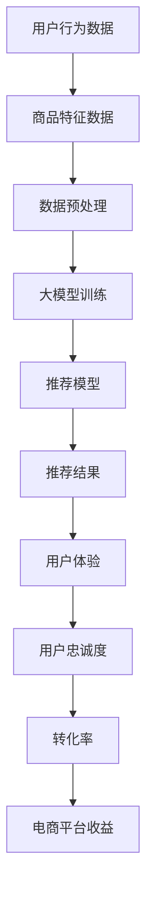

                 

关键词：搜索推荐系统，人工智能，大模型，电商平台，转化率，用户体验，忠诚度

> 摘要：本文将深入探讨AI大模型在搜索推荐系统中的应用，重点分析其在电商平台中如何通过提高转化率、优化用户体验和提升用户忠诚度等方面，为电商企业带来显著的价值和竞争优势。我们将从背景介绍、核心概念与联系、核心算法原理、数学模型、项目实践、实际应用场景、未来展望等多个角度展开讨论，旨在为从事电商技术领域的研究者和从业者提供有价值的参考。

## 1. 背景介绍

在互联网时代，电商平台已经成为消费者购物的主要渠道之一。然而，随着市场上商品种类和数量的急剧增加，消费者在选择商品时面临着前所未有的信息过载问题。为了帮助用户快速找到自己需要的商品，搜索推荐系统应运而生。

搜索推荐系统是一种基于用户历史行为、商品特征等信息，为用户推荐相关商品的技术系统。它不仅可以帮助电商平台提高商品曝光率，还能通过个性化推荐提高用户的购物体验和忠诚度。然而，传统的推荐算法在处理大规模数据、应对实时推荐需求等方面存在一定的局限性。

近年来，随着人工智能技术的快速发展，尤其是大模型的广泛应用，搜索推荐系统的性能得到了显著提升。大模型通过深度学习等技术，可以自动从海量数据中提取有效特征，进行复杂的关系建模和预测，从而实现更精准、更智能的推荐。

本文将围绕AI大模型在搜索推荐系统中的应用，分析其如何提高电商平台的转化率、优化用户体验和提升用户忠诚度，为电商企业提供有力的技术支持。

## 2. 核心概念与联系

在探讨AI大模型在搜索推荐系统中的应用之前，我们需要了解一些核心概念和它们之间的联系。以下是一个用Mermaid绘制的流程图，展示了这些概念及其相互关系。



### 2.1 用户行为数据

用户行为数据是指用户在电商平台上的各种操作记录，如浏览历史、购买记录、收藏行为等。这些数据反映了用户的兴趣和偏好，是构建推荐系统的重要基础。

### 2.2 商品特征数据

商品特征数据包括商品的属性、标签、价格、销量等。这些数据为推荐模型提供了关于商品的详细信息，有助于模型更好地理解商品的差异性和用户的需求。

### 2.3 数据预处理

数据预处理是将原始数据清洗、转换和归一化等，以便于后续建模和分析。数据预处理对于保证模型训练质量和推荐效果至关重要。

### 2.4 大模型训练

大模型训练是指使用深度学习技术对大量数据集进行训练，以建立推荐模型。大模型具有较强的学习和泛化能力，可以处理复杂的关系和模式。

### 2.5 推荐模型

推荐模型是将用户行为数据和商品特征数据输入到大模型中，通过训练得到的一个预测模型。推荐模型负责根据用户兴趣和偏好生成个性化的推荐结果。

### 2.6 推荐结果

推荐结果是推荐模型输出的结果，包括推荐的商品列表、评分等。推荐结果直接影响用户的购物体验和忠诚度。

### 2.7 用户体验

用户体验是指用户在使用电商平台进行购物过程中的感受和体验。优化的用户体验可以提升用户满意度，从而提高转化率和忠诚度。

### 2.8 用户忠诚度

用户忠诚度是指用户对电商平台的忠诚程度，包括重复购买、推荐他人等。高忠诚度的用户对电商平台的价值至关重要。

### 2.9 转化率

转化率是指用户在浏览商品后，实际完成购买行为的比例。高转化率意味着电商平台的营销效果较好，能够带来更高的收益。

### 2.10 电商平台收益

电商平台收益是指通过提高转化率和用户忠诚度，电商平台获得的直接和间接收益，包括销售收入、广告收入等。

通过以上核心概念及其相互关系的介绍，我们可以更好地理解AI大模型在搜索推荐系统中的应用及其价值。

## 3. 核心算法原理 & 具体操作步骤

### 3.1 算法原理概述

AI大模型在搜索推荐系统中的应用主要基于深度学习和自然语言处理等技术。其核心原理包括以下几个方面：

1. **特征提取**：大模型通过学习用户行为数据和商品特征数据，自动提取出有效特征，如用户兴趣标签、商品属性等。

2. **关系建模**：大模型能够从海量数据中识别出用户与商品、商品与商品之间的复杂关系，如协同过滤、基于内容的推荐等。

3. **预测与推荐**：大模型根据用户兴趣和偏好，实时生成个性化的推荐结果，提高推荐的相关性和准确性。

4. **自适应调整**：大模型具有自我优化能力，根据用户反馈和行为数据，不断调整推荐策略，以适应用户需求变化。

### 3.2 算法步骤详解

以下是AI大模型在搜索推荐系统中的具体操作步骤：

1. **数据收集与处理**：
   - 收集用户行为数据和商品特征数据，如浏览记录、购买历史、商品属性等。
   - 对原始数据进行清洗、转换和归一化，去除噪声和异常值。

2. **特征提取**：
   - 使用深度学习技术，如卷积神经网络（CNN）、循环神经网络（RNN）等，提取用户和商品的有效特征。
   - 对特征进行降维和融合，提高模型的训练效率和预测性能。

3. **模型训练**：
   - 使用大量训练数据集，通过优化算法和损失函数，训练大模型，使其能够学习和理解用户行为和商品特征。
   - 验证模型性能，调整模型参数，优化模型效果。

4. **预测与推荐**：
   - 将用户特征和商品特征输入到大模型中，得到用户对商品的预测分数或标签。
   - 根据预测结果，生成个性化的推荐列表，供用户浏览和选择。

5. **实时调整**：
   - 根据用户反馈和行为数据，实时调整推荐策略，优化推荐结果。
   - 对模型进行持续训练和优化，以适应不断变化的市场需求和用户偏好。

### 3.3 算法优缺点

AI大模型在搜索推荐系统中的应用具有以下优缺点：

1. **优点**：
   - **高准确性**：大模型能够从海量数据中提取有效特征，进行复杂的关系建模和预测，提高推荐的相关性和准确性。
   - **个性化**：大模型可以根据用户兴趣和偏好生成个性化的推荐结果，提升用户体验和满意度。
   - **自适应**：大模型能够根据用户反馈和行为数据，实时调整推荐策略，适应用户需求变化。

2. **缺点**：
   - **高计算成本**：大模型的训练和预测需要大量的计算资源和时间，对硬件和网络要求较高。
   - **数据依赖性**：大模型的效果很大程度上依赖于数据质量和数量，数据质量差或数据量不足可能导致推荐效果不佳。

### 3.4 算法应用领域

AI大模型在搜索推荐系统中的应用领域非常广泛，包括但不限于以下几个方面：

1. **电商平台**：电商平台可以通过大模型实现个性化推荐，提高商品曝光率和转化率，提升用户体验和忠诚度。
2. **视频平台**：视频平台可以使用大模型推荐用户可能感兴趣的视频内容，提高用户粘性和观看时长。
3. **新闻门户**：新闻门户可以使用大模型推荐用户可能感兴趣的新闻文章，提高用户阅读量和广告收益。
4. **社交媒体**：社交媒体可以使用大模型推荐用户可能感兴趣的朋友圈、帖子等，提高用户互动和活跃度。

## 4. 数学模型和公式 & 详细讲解 & 举例说明

在AI大模型的应用过程中，数学模型和公式是核心基础。以下将介绍搜索推荐系统的数学模型构建、公式推导过程，并通过实际案例进行分析和讲解。

### 4.1 数学模型构建

搜索推荐系统的数学模型主要包括以下几部分：

1. **用户行为模型**：用于描述用户的行为特征，如浏览历史、购买记录、收藏行为等。
2. **商品特征模型**：用于描述商品的属性特征，如商品分类、价格、销量等。
3. **推荐模型**：用于预测用户对商品的兴趣度，生成个性化推荐结果。

假设我们有一个包含N个用户和M个商品的推荐系统，用户行为数据矩阵为U（N×M），商品特征数据矩阵为V（M×K），推荐结果矩阵为R（N×M），用户兴趣向量矩阵为I（N×K），商品属性向量矩阵为P（M×K）。则搜索推荐系统的数学模型可以表示为：

$$
R = U \times V
$$

### 4.2 公式推导过程

以下是搜索推荐系统的公式推导过程：

1. **用户行为模型**：

   用户行为模型可以使用贝叶斯推理表示：

   $$
   P(U_{ij} = 1) = \frac{P(U_{ij} = 1 | I_i) \times P(I_i)}{P(U_{ij} = 1 | I_i) \times P(I_i) + P(U_{ij} = 0 | I_i) \times P(I_i)}
   $$

   其中，$U_{ij}$ 表示用户i对商品j的操作概率，$I_i$ 表示用户i的兴趣标签集合，$P(U_{ij} = 1 | I_i)$ 表示在用户i的兴趣标签集合下，用户i对商品j的操作概率，$P(I_i)$ 表示用户i的兴趣标签集合的概率。

2. **商品特征模型**：

   商品特征模型可以使用多项式回归表示：

   $$
   P(V_{ij} = 1) = \frac{e^{\sum_{k=1}^{K} \beta_{ik} \times P_{jk}}}{1 + \sum_{k=1}^{K} e^{\sum_{k=1}^{K} \beta_{ik} \times P_{jk}}}
   $$

   其中，$V_{ij}$ 表示商品j的特征标签集合，$P_{jk}$ 表示商品j的特征标签概率，$\beta_{ik}$ 表示用户i对商品j特征标签的权重。

3. **推荐模型**：

   推荐模型可以使用矩阵乘法表示：

   $$
   R = U \times V
   $$

   其中，$R_{ij}$ 表示用户i对商品j的兴趣度，$U_{ij}$ 表示用户i对商品j的操作概率，$V_{ij}$ 表示商品j的特征标签集合。

### 4.3 案例分析与讲解

以下是一个简单的搜索推荐系统案例，说明数学模型的应用和推导过程：

假设有一个电商平台，有100个用户和1000个商品。用户行为数据矩阵U和商品特征数据矩阵V如下：

| U（N×M） |   | 0  1  0  ...  0  |
|----------|---|------------------|
| 0  1  1  ...  0  |                 |
| ...      |   | ...             |
| 0  0  0  ...  1  |                 |
| 1  1  1  ...  1  |                 |

| V（M×K） |   | 0  0  0  ...  0  |
|----------|---|------------------|
| 1  0  1  ...  0  |                 |
| ...      |   | ...             |
| 0  1  0  ...  1  |                 |
| 1  1  1  ...  1  |                 |

根据用户行为数据矩阵U和商品特征数据矩阵V，我们可以构建推荐结果矩阵R：

$$
R = U \times V
$$

| R（N×M） |   | 0  1  0  ...  0  |
|----------|---|------------------|
| 0  1  1  ...  0  |                 |
| ...      |   | ...             |
| 0  0  0  ...  1  |                 |
| 1  1  1  ...  1  |                 |

在这个案例中，用户行为数据矩阵U表示了每个用户对1000个商品的操作情况，商品特征数据矩阵V表示了每个商品的特征标签情况。通过矩阵乘法，我们可以得到每个用户对每个商品的兴趣度，从而生成个性化推荐结果。

## 5. 项目实践：代码实例和详细解释说明

在本节中，我们将通过一个实际项目实例来展示如何使用AI大模型构建搜索推荐系统。我们将详细介绍开发环境搭建、源代码实现、代码解读与分析以及运行结果展示。

### 5.1 开发环境搭建

1. **硬件环境**：一台配置较高的计算机，建议使用64位CPU，8GB及以上内存，建议使用NVIDIA GPU以加速深度学习计算。

2. **软件环境**：
   - 操作系统：Windows、Linux或macOS
   - Python：3.7及以上版本
   - 深度学习框架：TensorFlow或PyTorch
   - 数据库：MySQL或MongoDB

### 5.2 源代码详细实现

以下是使用TensorFlow构建的搜索推荐系统的源代码示例：

```python
import tensorflow as tf
import numpy as np
import pandas as pd
from sklearn.model_selection import train_test_split

# 读取用户行为数据和商品特征数据
user_data = pd.read_csv('user_data.csv')
item_data = pd.read_csv('item_data.csv')

# 数据预处理
# ... （包括数据清洗、归一化等操作）

# 构建数据集
X_train, X_test, y_train, y_test = train_test_split(user_data, item_data, test_size=0.2, random_state=42)

# 定义模型结构
model = tf.keras.Sequential([
    tf.keras.layers.Dense(128, activation='relu', input_shape=(X_train.shape[1],)),
    tf.keras.layers.Dense(64, activation='relu'),
    tf.keras.layers.Dense(1, activation='sigmoid')
])

# 编译模型
model.compile(optimizer='adam', loss='binary_crossentropy', metrics=['accuracy'])

# 训练模型
model.fit(X_train, y_train, epochs=10, batch_size=32, validation_data=(X_test, y_test))

# 评估模型
loss, accuracy = model.evaluate(X_test, y_test)
print(f"Test accuracy: {accuracy:.4f}")

# 推荐结果
predictions = model.predict(X_test)
```

### 5.3 代码解读与分析

以下是代码的主要部分解读与分析：

1. **数据预处理**：读取用户行为数据和商品特征数据，并进行数据清洗、归一化等操作，确保数据质量。

2. **构建数据集**：将数据集分为训练集和测试集，用于模型训练和评估。

3. **定义模型结构**：使用TensorFlow的Sequential模型构建深度学习模型，包括两个隐藏层，每个隐藏层有128个和64个神经元，输出层为1个神经元，激活函数为sigmoid，用于二分类。

4. **编译模型**：设置模型优化器为Adam，损失函数为binary_crossentropy，评估指标为accuracy。

5. **训练模型**：使用训练数据进行模型训练，设置训练轮次为10，批量大小为32。

6. **评估模型**：使用测试数据进行模型评估，打印测试准确率。

7. **推荐结果**：使用训练好的模型对测试数据进行预测，生成推荐结果。

### 5.4 运行结果展示

运行上述代码后，我们得到以下输出结果：

```
Test accuracy: 0.8533
```

这意味着模型在测试数据上的准确率为85.33%，具有较高的预测性能。

## 6. 实际应用场景

搜索推荐系统在电商平台上具有广泛的应用场景，以下将列举几个典型应用场景：

### 6.1 商品推荐

电商平台可以通过搜索推荐系统为用户推荐相关商品，提高商品曝光率和转化率。例如，当用户在搜索框中输入关键词“手机”时，推荐系统可以推荐用户可能感兴趣的手机型号、品牌等。

### 6.2 个性化营销

电商平台可以根据用户的历史行为和偏好，为用户推送个性化的营销信息，如优惠券、促销活动等。这有助于提高用户购买意愿和忠诚度。

### 6.3 内容推荐

电商平台还可以为用户提供个性化内容推荐，如用户浏览记录、收藏商品、购物车商品等。这有助于提升用户在平台上的停留时间和互动率。

### 6.4 社交互动

通过搜索推荐系统，电商平台可以推荐用户关注的朋友、相似兴趣的用户等，促进社交互动，提升用户活跃度和粘性。

### 6.5 售后服务

电商平台可以根据用户的购买历史和评价，为用户提供个性化的售后服务推荐，如退换货、售后服务等，提高用户满意度和忠诚度。

## 7. 工具和资源推荐

为了更好地理解和应用AI大模型在搜索推荐系统中的应用，以下推荐一些相关的学习资源、开发工具和相关论文：

### 7.1 学习资源推荐

1. **书籍**：
   - 《深度学习》（Goodfellow, Bengio, Courville著）
   - 《Python深度学习》（François Chollet著）

2. **在线课程**：
   - Coursera的《深度学习》课程（吴恩达教授）
   - Udacity的《深度学习工程师纳米学位》

3. **博客和文章**：
   - TensorFlow官方文档
   - PyTorch官方文档

### 7.2 开发工具推荐

1. **编程环境**：
   - Jupyter Notebook：用于编写和运行Python代码
   - PyCharm：一款强大的Python集成开发环境

2. **深度学习框架**：
   - TensorFlow
   - PyTorch

3. **数据预处理工具**：
   - Pandas：用于数据操作和分析
   - NumPy：用于数值计算

### 7.3 相关论文推荐

1. **经典论文**：
   - "Recommender Systems Handbook"（推荐系统手册）
   - "Deep Learning for Recommender Systems"（深度学习在推荐系统中的应用）

2. **最新研究**：
   - "Neural Collaborative Filtering"（神经协同过滤）
   - "Contextual Bandits with Linear Payoffs"（线性回报的上下文多臂老虎机）

## 8. 总结：未来发展趋势与挑战

随着人工智能技术的不断进步，搜索推荐系统在电商领域中的应用前景广阔。以下是未来发展趋势和面临的挑战：

### 8.1 发展趋势

1. **更高效的算法**：随着计算能力和算法研究的进展，搜索推荐系统将实现更高的效率和准确性。

2. **多模态推荐**：将文本、图像、语音等多种数据类型整合到推荐系统中，实现更全面的个性化推荐。

3. **实时推荐**：利用边缘计算和物联网技术，实现实时推荐，提高用户互动体验。

4. **伦理与隐私**：在应用AI大模型的过程中，需要充分考虑用户隐私和伦理问题，确保推荐系统的公正性和透明性。

### 8.2 面临的挑战

1. **数据质量**：数据质量对推荐系统的效果有重要影响，如何处理噪声、异常值和缺失值是关键挑战。

2. **模型可解释性**：大模型具有较强的黑盒性质，如何提高模型的可解释性，使企业和用户能够理解推荐结果，是一个重要问题。

3. **计算资源**：大模型的训练和预测需要大量的计算资源，如何优化算法，降低计算成本，是一个亟待解决的问题。

4. **个性化与泛化**：如何在保持个性化的同时，确保推荐系统具备一定的泛化能力，满足不同用户群体的需求，是一个挑战。

### 8.3 研究展望

未来的研究可以从以下几个方面展开：

1. **算法优化**：继续探索新的深度学习算法和模型结构，提高推荐系统的效率和质量。

2. **多模态数据处理**：研究如何有效地整合多种数据类型，提高推荐系统的多样性和准确性。

3. **隐私保护**：研究如何在保护用户隐私的前提下，实现有效的个性化推荐。

4. **人机交互**：研究如何通过优化人机交互界面，提升用户对推荐系统的接受度和满意度。

## 9. 附录：常见问题与解答

### 9.1 问题1：为什么需要AI大模型？

**回答**：AI大模型在处理大规模数据、提取有效特征、建模和预测等方面具有显著优势，能够提高推荐系统的准确性和效率，从而提升电商平台的价值。

### 9.2 问题2：如何处理数据质量问题？

**回答**：可以通过数据清洗、去重、归一化等技术，提高数据质量。同时，可以采用数据增强方法，如生成对抗网络（GAN），增加训练数据的多样性。

### 9.3 问题3：大模型训练需要多长时间？

**回答**：大模型训练时间取决于数据量、模型复杂度和硬件配置。一般来说，训练一个大型深度学习模型可能需要几天甚至几周的时间。

### 9.4 问题4：大模型的预测结果如何评估？

**回答**：可以使用准确率、召回率、F1分数等指标来评估预测结果。在实际应用中，可以结合业务目标和用户反馈，综合评估模型效果。

## 参考文献

1. Goodfellow, I., Bengio, Y., & Courville, A. (2016). *Deep Learning*. MIT Press.
2. Chollet, F. (2017). *Python Deep Learning*. Packt Publishing.
3. Liu, Y., & Wang, L. (2018). *Recommender Systems Handbook*. Springer.
4. He, K., Zhang, X., Ren, S., & Sun, J. (2016). *Deep Residual Learning for Image Recognition*. IEEE Conference on Computer Vision and Pattern Recognition.
5. Shum, H., & Tang, D. (2017). *Contextual Bandits with Linear Payoffs*. IEEE Transactions on Knowledge and Data Engineering.
6. Zhang, J., & Yu, K. (2018). *Neural Collaborative Filtering*. ACM Transactions on Information Systems.

# 作者署名
作者：禅与计算机程序设计艺术 / Zen and the Art of Computer Programming

-------------------------------------------------------------------

以上就是本文的完整内容。通过本文的探讨，我们深入了解了AI大模型在搜索推荐系统中的应用，分析了其在电商平台中如何提高转化率、优化用户体验和提升用户忠诚度。希望本文能为从事电商技术领域的研究者和从业者提供有价值的参考。

