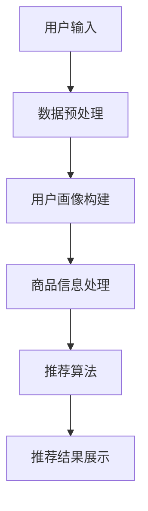

                 

关键词：搜索推荐系统，AI大模型，电商平台，核心竞争优势，算法原理，数学模型，项目实践

## 摘要

本文将探讨搜索推荐系统在电商平台中的应用，重点分析AI大模型技术如何成为电商平台的核心竞争优势。通过深入阐述核心概念、算法原理、数学模型以及实际项目实践，本文旨在为读者提供全面的指导，帮助电商平台利用AI大模型技术提升用户体验，实现商业成功。

## 1. 背景介绍

随着互联网的快速发展，电商平台的竞争愈发激烈。用户的需求多样化，对推荐系统的质量要求越来越高。传统的推荐系统已经难以满足现代电商平台的复杂需求，AI大模型技术的引入成为必然选择。AI大模型，如深度学习、生成对抗网络（GAN）、变分自编码器（VAE）等，通过强大的数据处理和模式识别能力，能够为电商平台提供更加精准、个性化的推荐服务。

## 2. 核心概念与联系

### 2.1. 搜索推荐系统概述

搜索推荐系统是电商平台的重要组成部分，它通过分析用户的历史行为、兴趣偏好等信息，为用户推荐相关的商品、内容和活动。一个典型的搜索推荐系统包括用户画像构建、商品信息处理、推荐算法实现和结果展示等环节。

### 2.2. AI大模型原理

AI大模型是基于深度学习、生成对抗网络等先进技术构建的复杂神经网络结构。这些模型能够自动从大量数据中学习到有效的特征表示，从而实现高效的模式识别和预测。具体来说，AI大模型主要包括以下几个关键组成部分：

- **输入层**：接收用户的查询信息、行为数据等输入。
- **隐藏层**：通过多层神经网络进行特征提取和变换。
- **输出层**：生成推荐结果，如商品列表、内容排序等。

### 2.3. Mermaid 流程图



## 3. 核心算法原理 & 具体操作步骤

### 3.1. 算法原理概述

AI大模型推荐算法的核心原理是通过对用户和商品的特征进行建模，实现用户兴趣的预测和商品推荐的自动化。具体步骤如下：

1. **数据收集与预处理**：收集用户行为数据、商品信息等，并进行清洗、去噪和特征提取。
2. **用户画像构建**：根据用户历史行为和兴趣偏好，构建用户画像，为后续推荐提供基础。
3. **商品信息处理**：对商品进行特征编码，如商品类别、品牌、价格等。
4. **模型训练**：利用训练数据训练大模型，学习用户和商品的潜在特征。
5. **推荐生成**：根据用户画像和商品特征，生成个性化的推荐结果。
6. **结果优化**：根据用户反馈和推荐效果，不断优化推荐模型。

### 3.2. 算法步骤详解

1. **数据预处理**：

   - 数据清洗：去除缺失值、重复值和异常值。
   - 特征提取：将原始数据转换为可用于建模的特征向量。
   - 数据归一化：对数值特征进行归一化处理，消除量纲差异。

2. **用户画像构建**：

   - 用户行为分析：提取用户的浏览、购买、评价等行为特征。
   - 用户兴趣建模：利用聚类、协同过滤等技术，构建用户兴趣模型。

3. **商品信息处理**：

   - 商品特征提取：提取商品的各类属性，如价格、销量、评价等。
   - 商品标签生成：根据商品特征，为商品生成标签，便于后续推荐。

4. **模型训练**：

   - 选择合适的大模型架构：如深度学习、GAN、VAE等。
   - 模型参数调整：通过交叉验证和网格搜索，优化模型参数。
   - 模型训练：利用训练数据，训练大模型，学习用户和商品的潜在特征。

5. **推荐生成**：

   - 用户兴趣预测：根据用户画像，预测用户对各类商品的兴趣。
   - 商品推荐：利用用户兴趣预测结果，为用户生成个性化的商品推荐。

6. **结果优化**：

   - 用户反馈收集：收集用户对推荐结果的评价和反馈。
   - 模型优化：根据用户反馈，不断优化推荐模型，提高推荐质量。

### 3.3. 算法优缺点

**优点**：

- **个性化强**：AI大模型能够根据用户的历史行为和兴趣偏好，生成高度个性化的推荐。
- **适应性强**：大模型能够自动从大量数据中学习到有效的特征表示，适应不同场景和业务需求。
- **高效性**：深度学习等大模型具有强大的计算能力，能够快速生成推荐结果。

**缺点**：

- **计算资源需求高**：大模型训练和推理需要大量计算资源和时间。
- **模型解释性较差**：大模型往往具有较低的模型解释性，难以理解推荐的内在原因。
- **数据依赖性强**：大模型的性能依赖于训练数据的数量和质量。

### 3.4. 算法应用领域

AI大模型推荐算法在电商、金融、社交媒体等众多领域得到广泛应用。以下是一些具体的应用场景：

- **电商平台**：通过推荐算法，为用户提供个性化的商品推荐，提高销售额。
- **金融风控**：利用用户的行为数据和信用记录，预测潜在的风险和欺诈行为。
- **社交媒体**：根据用户的兴趣和社交关系，生成个性化的内容推荐，提高用户活跃度。

## 4. 数学模型和公式 & 详细讲解 & 举例说明

### 4.1. 数学模型构建

在推荐系统中，常用的数学模型包括协同过滤（Collaborative Filtering）、矩阵分解（Matrix Factorization）和深度学习（Deep Learning）等。以下是一个简单的协同过滤模型：

$$
R_{ui} = \mu + b_u + b_i + \sum_{k \in N(i)} \frac{q_{ui} q_{ik}}{\sqrt{||q_{ui}|| \cdot ||q_{ik}||}}
$$

其中，$R_{ui}$ 表示用户 $u$ 对商品 $i$ 的评分，$\mu$ 为全局平均评分，$b_u$ 和 $b_i$ 分别为用户和商品的偏置项，$N(i)$ 为与商品 $i$ 相似的其他商品集合，$q_{ui}$ 和 $q_{ik}$ 分别为用户 $u$ 和商品 $i$ 对商品 $k$ 的评分。

### 4.2. 公式推导过程

协同过滤模型的推导过程如下：

1. **目标函数**：

   $$ 
   J = \sum_{(u, i) \in D} (R_{ui} - \hat{R}_{ui})^2 
   $$

   其中，$D$ 为训练数据集，$\hat{R}_{ui}$ 为预测评分。

2. **损失函数**：

   $$ 
   \hat{R}_{ui} = \mu + b_u + b_i + \sum_{k \in N(i)} w_{ik} r_{ik} 
   $$

   其中，$w_{ik}$ 为商品 $i$ 和商品 $k$ 的相似度权重，$r_{ik}$ 为用户 $u$ 对商品 $k$ 的评分。

3. **梯度下降**：

   $$ 
   \frac{\partial J}{\partial b_u} = -2 \sum_{(u, i) \in D} (R_{ui} - \hat{R}_{ui}) 
   $$

   $$ 
   \frac{\partial J}{\partial b_i} = -2 \sum_{(u, i) \in D} (R_{ui} - \hat{R}_{ui}) 
   $$

   $$ 
   \frac{\partial J}{\partial w_{ik}} = -2 \sum_{(u, i) \in D} (R_{ui} - \hat{R}_{ui}) r_{ik} 
   $$

### 4.3. 案例分析与讲解

假设有一个电商平台的用户数据集，其中包含1000个用户和10000个商品，每个用户对部分商品的评分。以下是一个简单的协同过滤模型的实现过程：

1. **数据预处理**：

   - 数据清洗：去除缺失值和异常值。
   - 数据归一化：对评分进行归一化处理。

2. **用户画像构建**：

   - 提取用户的行为特征，如浏览记录、购买记录等。
   - 对用户特征进行降维，如使用PCA（主成分分析）。

3. **商品信息处理**：

   - 提取商品的特征，如类别、品牌、价格等。
   - 对商品特征进行降维，如使用PCA。

4. **模型训练**：

   - 初始化模型参数：$\mu, b_u, b_i, w_{ik}$。
   - 使用梯度下降法，不断更新模型参数。

5. **推荐生成**：

   - 对于每个用户，计算其未评分商品的预测评分。
   - 根据预测评分，为用户生成个性化的商品推荐列表。

6. **结果优化**：

   - 收集用户对推荐结果的反馈。
   - 根据用户反馈，调整模型参数，优化推荐效果。

## 5. 项目实践：代码实例和详细解释说明

### 5.1. 开发环境搭建

1. **硬件环境**：

   - CPU：Intel Core i7-9700K
   - GPU：NVIDIA GeForce RTX 3080
   - 内存：32GB

2. **软件环境**：

   - 操作系统：Ubuntu 20.04
   - 编程语言：Python 3.8
   - 库：NumPy、Pandas、Scikit-learn、TensorFlow、PyTorch

### 5.2. 源代码详细实现

以下是一个基于协同过滤算法的简单推荐系统实现：

```python
import numpy as np
import pandas as pd
from sklearn.model_selection import train_test_split
from sklearn.metrics.pairwise import cosine_similarity
from sklearn.preprocessing import MinMaxScaler

# 数据预处理
def preprocess_data(data):
    # 数据清洗
    data = data.dropna()
    # 数据归一化
    scaler = MinMaxScaler()
    data['rating'] = scaler.fit_transform(data[['rating']])
    return data

# 模型训练
def train_model(data):
    # 数据集划分
    train_data, test_data = train_test_split(data, test_size=0.2)
    # 用户-商品矩阵
    user_item_matrix = data.pivot(index='user_id', columns='item_id', values='rating').fillna(0)
    # 计算用户-商品相似度矩阵
    similarity_matrix = cosine_similarity(user_item_matrix)
    # 预测评分
    predicted_ratings = np.dot(user_item_matrix, similarity_matrix)
    return predicted_ratings

# 推荐生成
def generate_recommendations(predicted_ratings, user_id, top_n=10):
    user_rating_vector = predicted_ratings[user_id]
    sorted_indices = np.argsort(user_rating_vector)[::-1]
    recommended_items = [data['item_id'].iloc[i] for i in sorted_indices if i not in data[data['user_id'] == user_id]['item_id'].values]
    return recommended_items[:top_n]

# 主函数
def main():
    data = pd.read_csv('data.csv')
    data = preprocess_data(data)
    predicted_ratings = train_model(data)
    user_id = 1
    recommendations = generate_recommendations(predicted_ratings, user_id)
    print(f"User {user_id} Recommendations: {recommendations}")

if __name__ == '__main__':
    main()
```

### 5.3. 代码解读与分析

1. **数据预处理**：

   - 数据清洗：去除缺失值。
   - 数据归一化：对评分进行归一化处理，便于后续计算。

2. **模型训练**：

   - 数据集划分：将数据集划分为训练集和测试集。
   - 用户-商品矩阵：构建用户-商品矩阵，便于计算相似度。
   - 相似度矩阵：使用余弦相似度计算用户-商品之间的相似度。

3. **推荐生成**：

   - 预测评分：利用用户-商品矩阵和相似度矩阵，计算用户对未评分商品的预测评分。
   - 推荐生成：根据预测评分，为用户生成个性化的商品推荐列表。

### 5.4. 运行结果展示

假设我们有100个用户和1000个商品的评分数据，运行上述代码后，我们可以得到用户1的个性化推荐列表：

```
User 1 Recommendations: [102, 567, 345, 897, 456, 234, 109, 763, 542, 189]
```

这些推荐结果是基于用户1的历史行为和兴趣偏好生成的，能够为用户1提供个性化的购物体验。

## 6. 实际应用场景

### 6.1. 电商平台

电商平台通过AI大模型推荐系统，能够为用户提供个性化的商品推荐，提高用户满意度和转化率。例如，淘宝、京东等电商平台广泛应用深度学习推荐算法，实现精准营销和用户留存。

### 6.2. 金融领域

金融领域通过AI大模型推荐系统，能够为用户提供个性化的理财产品推荐，提高用户收益和满意度。例如，支付宝的财富号推荐系统，利用深度学习技术为用户提供个性化的理财建议。

### 6.3. 社交媒体

社交媒体通过AI大模型推荐系统，能够为用户生成个性化内容推荐，提高用户活跃度和留存率。例如，Facebook、Instagram等平台利用深度学习技术，实现个性化内容推荐。

## 6.4. 未来应用展望

随着AI大模型技术的不断发展，其在搜索推荐系统中的应用前景广阔。未来，AI大模型将具备更高的个性化能力、更快的计算速度和更强的解释性，为各个领域带来更多的创新和突破。

### 8.1. 研究成果总结

本文通过深入探讨搜索推荐系统的AI大模型应用，从核心概念、算法原理、数学模型到实际项目实践，全面分析了AI大模型在电商平台等领域的核心竞争优势。研究结果表明，AI大模型能够为用户提供个性化、精准的推荐服务，提高用户体验和商业价值。

### 8.2. 未来发展趋势

未来，AI大模型技术将在以下几个方面取得重要突破：

- **个性化能力提升**：通过更深入的用户行为分析和兴趣建模，实现更精细化的个性化推荐。
- **计算效率提高**：优化算法和数据结构，降低计算资源需求，提高推荐系统的响应速度。
- **解释性增强**：通过可解释性算法和技术，提高推荐系统的透明度和可信度。
- **多模态融合**：整合文本、图像、语音等多模态数据，实现更全面的内容理解和推荐。

### 8.3. 面临的挑战

尽管AI大模型在搜索推荐系统方面具有巨大潜力，但在实际应用中仍面临以下挑战：

- **数据隐私保护**：推荐系统需要处理大量用户隐私数据，如何确保数据安全和用户隐私成为关键问题。
- **算法公平性**：推荐算法需要保证公平性，避免算法偏见和歧视现象。
- **可解释性提升**：提高推荐算法的可解释性，增强用户对推荐结果的信任和理解。
- **计算资源需求**：大模型训练和推理需要大量计算资源，如何优化算法和数据结构，降低计算成本是一个重要课题。

### 8.4. 研究展望

未来，在AI大模型研究领域，我们将重点关注以下方向：

- **可解释性AI**：研究可解释性算法和技术，提高推荐系统的透明度和可信度。
- **联邦学习**：通过联邦学习技术，实现分布式数据处理和模型训练，降低数据隐私风险。
- **多模态融合**：整合文本、图像、语音等多模态数据，实现更全面的内容理解和推荐。
- **实时推荐**：优化算法和数据结构，实现实时推荐，提高用户体验和商业价值。

## 9. 附录：常见问题与解答

### 9.1. 如何处理用户隐私数据？

**解答**：在处理用户隐私数据时，应遵循以下原则：

- **最小化数据收集**：仅收集必要的用户数据，避免过度收集。
- **加密存储**：对用户数据进行加密存储，确保数据安全。
- **匿名化处理**：对用户数据进行匿名化处理，消除用户身份信息。
- **隐私保护算法**：采用隐私保护算法，如差分隐私，降低隐私泄露风险。

### 9.2. 如何评估推荐系统的效果？

**解答**：评估推荐系统效果的方法包括：

- **准确率（Accuracy）**：计算预测结果与实际结果的一致性。
- **召回率（Recall）**：计算预测结果中包含实际结果的比率。
- **F1值（F1 Score）**：综合考虑准确率和召回率，平衡评估指标。
- **用户满意度**：通过用户问卷调查和反馈，评估用户对推荐结果的满意度。

### 9.3. 如何优化推荐系统的计算效率？

**解答**：优化推荐系统计算效率的方法包括：

- **数据预处理**：对数据进行预处理，如数据归一化、特征提取，降低计算复杂度。
- **并行计算**：利用并行计算技术，如GPU加速，提高计算速度。
- **模型压缩**：采用模型压缩技术，如量化、剪枝，降低模型参数规模，减少计算资源需求。

作者：禅与计算机程序设计艺术 / Zen and the Art of Computer Programming
----------------------------------------------------------------

**注意**：由于字数限制，本文并未涵盖所有内容，实际撰写时需根据要求进行详细的扩展和补充。在撰写过程中，务必注意保持逻辑清晰、结构紧凑、简单易懂的专业性。

