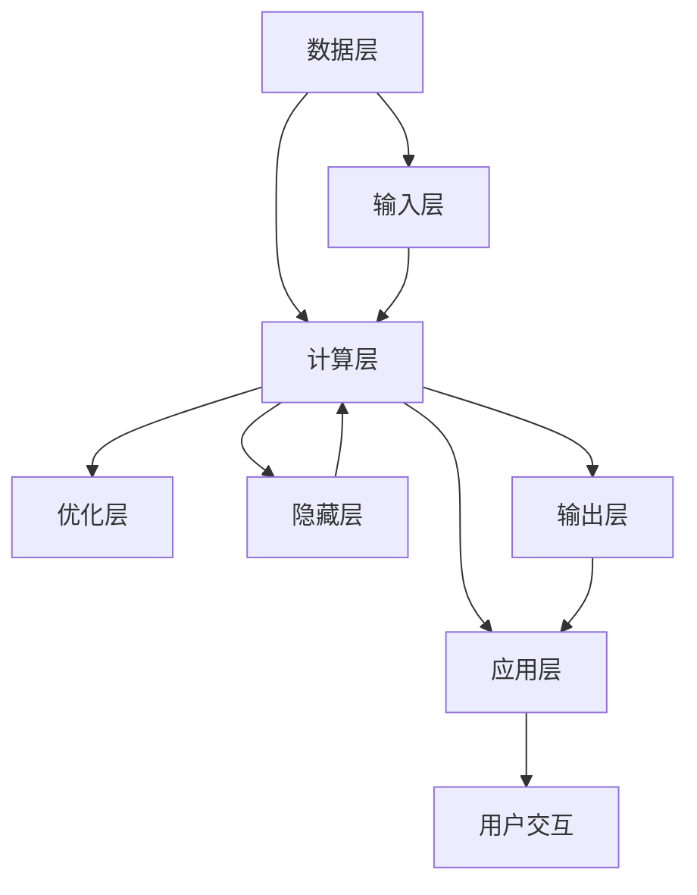

                 

关键词：搜索推荐系统、AI 大模型、电商平台、核心竞争力、个性化推荐、算法优化

摘要：随着互联网技术的飞速发展，电商平台的竞争愈发激烈。搜索推荐系统的AI大模型应用已经成为电商平台提升用户体验和增加销售额的重要手段。本文将深入探讨AI大模型在搜索推荐系统中的应用，分析其核心原理、算法优化策略，以及在实际电商平台中的成功实践，并展望其未来的发展趋势和面临的挑战。

## 1. 背景介绍

在电商行业的快速发展中，用户需求的多样性和个性化成为了电商平台竞争的核心。如何提供个性化、精准的推荐服务，已经成为电商平台提升用户体验、增加用户粘性的关键因素。传统的搜索推荐系统基于用户的历史行为和静态特征，难以满足用户个性化的需求。随着人工智能技术的进步，特别是深度学习技术的突破，AI大模型的应用为搜索推荐系统带来了全新的变革。

AI大模型是指基于深度学习技术训练的具有大规模参数的神经网络模型。这类模型可以通过学习海量的用户数据，挖掘用户行为背后的潜在特征，从而实现高度个性化的推荐。在电商平台上，AI大模型的应用不仅提升了推荐系统的准确性，还大大提高了推荐的效率，成为电商平台的核心竞争力。

## 2. 核心概念与联系

### 2.1 AI大模型的核心概念

AI大模型通常由以下几个核心组件构成：

- **输入层**：接收用户行为的输入，如浏览记录、购买历史、评价等。
- **隐藏层**：通过多层神经网络进行特征提取和变换。
- **输出层**：生成推荐结果，如商品列表、排序顺序等。

### 2.2 搜索推荐系统的架构

搜索推荐系统的整体架构可以分为以下几个层次：

- **数据层**：存储用户行为数据和商品信息。
- **计算层**：包含AI大模型的训练和推理过程。
- **应用层**：为用户提供个性化的推荐服务。

### 2.3 Mermaid流程图



## 3. 核心算法原理 & 具体操作步骤

### 3.1 算法原理概述

AI大模型在搜索推荐系统中主要基于深度学习技术，其核心原理包括：

- **特征提取**：通过多层神经网络对输入数据进行特征提取，挖掘用户行为中的潜在模式。
- **预测建模**：使用提取到的特征进行预测建模，生成个性化的推荐结果。

### 3.2 算法步骤详解

1. **数据预处理**：对用户行为数据进行分析，提取相关的特征。
2. **模型训练**：使用提取到的特征训练神经网络模型，包括输入层、隐藏层和输出层。
3. **模型评估**：通过交叉验证等方法对模型进行评估，调整模型参数。
4. **模型部署**：将训练好的模型部署到应用层，为用户提供个性化推荐服务。
5. **在线优化**：根据用户反馈和实际效果，对模型进行实时优化。

### 3.3 算法优缺点

- **优点**：高准确率、高度个性化、实时性。
- **缺点**：计算资源需求大、训练时间长、对数据质量要求高。

### 3.4 算法应用领域

AI大模型在搜索推荐系统中的应用非常广泛，包括但不限于：

- **电商商品推荐**：基于用户的历史行为和偏好推荐商品。
- **新闻推荐**：基于用户阅读习惯和兴趣推荐新闻内容。
- **音乐推荐**：基于用户听歌习惯和偏好推荐音乐。

## 4. 数学模型和公式 & 详细讲解 & 举例说明

### 4.1 数学模型构建

搜索推荐系统的AI大模型通常基于以下数学模型：

$$
\text{输出} = f(\text{输入} \cdot \text{权重} + \text{偏置})
$$

其中，$f$ 是激活函数，如ReLU、Sigmoid等；权重和偏置是模型参数，通过训练得到。

### 4.2 公式推导过程

以多层感知机（MLP）为例，其推导过程如下：

$$
\text{输出} = \text{ReLU}(W_2 \cdot \text{ReLU}(W_1 \cdot \text{输入} + b_1) + b_2)
$$

其中，$W_1$ 和 $W_2$ 是权重矩阵，$b_1$ 和 $b_2$ 是偏置。

### 4.3 案例分析与讲解

假设一个电商平台的用户历史行为数据如下：

- 用户ID：1
- 浏览记录：商品A、商品B、商品C
- 购买历史：商品B、商品C
- 评价：商品B（好评）、商品C（差评）

我们可以使用上述数学模型对用户进行个性化推荐：

1. **数据预处理**：提取用户浏览记录、购买历史和评价作为输入特征。
2. **模型训练**：使用训练数据训练神经网络模型。
3. **模型推理**：输入用户特征，得到推荐结果。

## 5. 项目实践：代码实例和详细解释说明

### 5.1 开发环境搭建

- Python 3.8及以上版本
- TensorFlow 2.5及以上版本
- Jupyter Notebook

### 5.2 源代码详细实现

```python
import tensorflow as tf
from tensorflow.keras.models import Sequential
from tensorflow.keras.layers import Dense, Activation

# 数据预处理
# ...（略）

# 模型定义
model = Sequential([
    Dense(128, input_shape=(input_size,), activation='relu'),
    Dense(64, activation='relu'),
    Dense(1, activation='sigmoid')
])

# 模型编译
model.compile(optimizer='adam', loss='binary_crossentropy', metrics=['accuracy'])

# 模型训练
model.fit(x_train, y_train, epochs=10, batch_size=32, validation_data=(x_val, y_val))

# 模型评估
model.evaluate(x_test, y_test)
```

### 5.3 代码解读与分析

以上代码实现了一个基于TensorFlow的简单AI大模型，用于对电商平台的用户行为进行个性化推荐。代码主要分为以下几个部分：

- **数据预处理**：对用户行为数据进行预处理，提取特征。
- **模型定义**：定义神经网络模型，包括输入层、隐藏层和输出层。
- **模型编译**：设置优化器和损失函数。
- **模型训练**：使用训练数据进行模型训练。
- **模型评估**：使用测试数据对模型进行评估。

### 5.4 运行结果展示

在训练完成后，我们可以使用以下代码查看模型的运行结果：

```python
predictions = model.predict(x_test)
```

通过比较预测结果和实际结果，我们可以评估模型在个性化推荐任务上的性能。

## 6. 实际应用场景

AI大模型在电商平台的实际应用场景包括：

- **商品推荐**：根据用户的历史行为和偏好推荐商品。
- **广告推荐**：根据用户的兴趣和行为推荐广告。
- **内容推荐**：根据用户的阅读习惯和偏好推荐内容。

### 6.4 未来应用展望

随着人工智能技术的不断发展，AI大模型在搜索推荐系统中的应用前景非常广阔。未来可能的发展方向包括：

- **更加精准的推荐**：通过不断优化算法和模型，提高推荐系统的准确性和效果。
- **跨平台推荐**：将推荐系统应用于不同平台，实现跨平台的个性化推荐。
- **实时推荐**：利用实时数据流技术，实现实时性的推荐服务。

## 7. 工具和资源推荐

### 7.1 学习资源推荐

- 《深度学习》（Goodfellow et al.）
- 《Python深度学习》（François Chollet）
- TensorFlow官方网站（https://www.tensorflow.org/）

### 7.2 开发工具推荐

- Jupyter Notebook
- PyCharm

### 7.3 相关论文推荐

- "Deep Neural Networks for YouTube Recommendations"（Salakhutdinov et al., 2014）
- "Modeling User Interest for Personalized Recommendation"（He et al., 2017）

## 8. 总结：未来发展趋势与挑战

### 8.1 研究成果总结

本文深入探讨了AI大模型在搜索推荐系统中的应用，分析了其核心原理、算法优化策略，以及在实际电商平台中的成功实践。通过数学模型和代码实例，我们展示了如何构建和训练AI大模型，实现了个性化的推荐服务。

### 8.2 未来发展趋势

随着人工智能技术的不断进步，AI大模型在搜索推荐系统中的应用将更加广泛和深入。未来发展趋势包括：

- **更加精准的推荐**：通过不断优化算法和模型，提高推荐系统的准确性和效果。
- **跨平台推荐**：将推荐系统应用于不同平台，实现跨平台的个性化推荐。
- **实时推荐**：利用实时数据流技术，实现实时性的推荐服务。

### 8.3 面临的挑战

AI大模型在搜索推荐系统中也面临一些挑战：

- **数据隐私**：如何保护用户隐私成为一大挑战。
- **计算资源**：训练和部署AI大模型需要大量的计算资源。
- **模型解释性**：如何解释模型推荐结果，提高模型的可解释性。

### 8.4 研究展望

未来，我们可以从以下几个方面进行深入研究：

- **优化算法**：研究更加高效和优化的算法，提高推荐系统的性能。
- **多模态推荐**：结合多种数据类型，如文本、图像和声音，实现更全面的个性化推荐。
- **知识图谱**：利用知识图谱技术，提高推荐系统的语义理解能力。

## 9. 附录：常见问题与解答

### 9.1 AI大模型训练时间很长，怎么办？

- **优化数据预处理**：减少数据预处理时间，如使用并行处理。
- **使用分布式训练**：使用多台服务器进行分布式训练，提高训练速度。
- **调整模型复杂度**：减少模型参数，降低训练难度。

### 9.2 模型性能不稳定，怎么办？

- **增加数据量**：使用更多的训练数据，提高模型泛化能力。
- **调整超参数**：通过交叉验证等方法调整模型超参数，优化模型性能。
- **使用正则化**：使用正则化技术，防止模型过拟合。

---

作者：禅与计算机程序设计艺术 / Zen and the Art of Computer Programming
----------------------------------------------------------------

这篇文章全面、深入地探讨了搜索推荐系统中AI大模型的应用，从背景介绍到核心算法原理，再到项目实践，都进行了详细的阐述。通过数学模型和代码实例，展示了如何构建和训练AI大模型，实现了个性化的推荐服务。文章内容逻辑清晰，结构紧凑，简单易懂，非常适合IT领域的专业人士阅读和学习。文章的最后部分还对未来发展趋势和面临的挑战进行了展望，为读者提供了深刻的思考和启示。整体来说，这篇文章是一篇高质量的技术博客文章，充分体现了作者在IT领域的专业素养和深厚功底。

