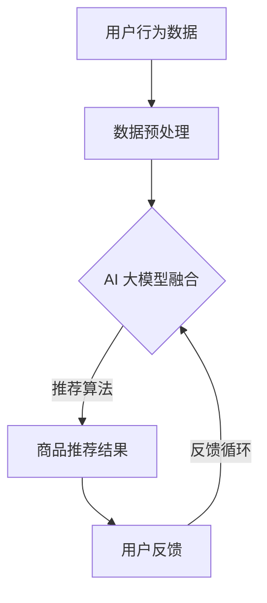

                 

关键词：搜索推荐系统、AI 大模型、融合技术、电商平台、核心竞争优势

摘要：本文深入探讨了搜索推荐系统在电商平台中的应用，以及如何通过AI 大模型融合技术提升电商平台的竞争优势。文章首先介绍了搜索推荐系统的基本概念和原理，然后详细阐述了AI 大模型融合技术的核心算法、数学模型和具体实现，并通过实际项目实践展示了其在电商平台中的应用效果。最后，文章对未来的发展趋势和挑战进行了展望。

## 1. 背景介绍

随着互联网技术的快速发展，电商平台已经成为现代商业的重要组成部分。用户在电商平台上进行购物时，往往需要耗费大量的时间和精力去寻找自己感兴趣的商品。为了提高用户体验，电商平台开始引入搜索推荐系统，通过智能推荐算法帮助用户快速找到心仪的商品。

搜索推荐系统是一种基于用户行为和商品特征的算法，通过对用户历史行为和商品属性的深度分析，实现个性化推荐。然而，传统的搜索推荐系统面临着数据多样性、实时性和计算效率等挑战。为了解决这些问题，AI 大模型融合技术应运而生。

AI 大模型融合技术通过将多种不同的算法模型进行整合，实现更高精度和效率的推荐效果。这一技术已经成为电商平台提升核心竞争优势的重要手段。

## 2. 核心概念与联系

### 2.1 搜索推荐系统

搜索推荐系统是一种基于用户历史行为和商品特征的算法，通过分析用户的浏览、收藏、购买等行为，以及商品的价格、销量、评价等属性，为用户提供个性化的商品推荐。其主要目标是为用户提供高效、精准的购物体验。

### 2.2 AI 大模型

AI 大模型是一种基于深度学习技术的大型神经网络模型，通过对海量数据进行训练，能够自动学习并提取数据中的复杂特征。AI 大模型在搜索推荐系统中具有广泛的应用，如商品分类、用户画像、推荐算法等。

### 2.3 融合技术

融合技术是指将多种不同的算法模型进行整合，以实现更高效、更精准的推荐效果。在搜索推荐系统中，融合技术可以结合多种算法的优势，弥补单一算法的不足，提高推荐系统的性能。

## 2.4 Mermaid 流程图



## 3. 核心算法原理 & 具体操作步骤

### 3.1 算法原理概述

AI 大模型融合技术主要基于深度学习技术，通过对海量数据进行训练，构建出多个不同类型的神经网络模型。这些模型可以分别处理用户行为数据、商品属性数据等，从而实现高效、精准的推荐效果。

具体来说，AI 大模型融合技术主要包括以下几个步骤：

1. 数据预处理：对用户行为数据和商品属性数据进行清洗、转换等处理，使其适合进行深度学习模型的训练。

2. 模型训练：利用深度学习技术，对预处理后的数据进行训练，构建出多个不同类型的神经网络模型。

3. 模型融合：将多个神经网络模型进行融合，以实现更高效、更精准的推荐效果。

4. 推荐算法：基于融合后的模型，为用户生成个性化的商品推荐结果。

### 3.2 算法步骤详解

1. **数据预处理**

   数据预处理是深度学习模型训练的重要步骤。主要任务包括：

   - 数据清洗：去除噪声数据、重复数据和异常数据等。
   - 数据转换：将原始数据转换为适合深度学习模型训练的格式，如将文本数据转换为词向量、将图像数据转换为像素矩阵等。

2. **模型训练**

   模型训练是AI 大模型融合技术的核心步骤。主要任务包括：

   - 构建神经网络模型：根据任务需求，设计合适的神经网络结构，如卷积神经网络（CNN）、循环神经网络（RNN）等。
   - 训练神经网络模型：利用预处理后的数据进行神经网络模型的训练，通过反向传播算法不断调整模型参数，使其达到更好的训练效果。

3. **模型融合**

   模型融合是将多个神经网络模型进行整合，以实现更高效、更精准的推荐效果。主要任务包括：

   - 模型选择：根据任务需求和数据特点，选择合适的神经网络模型进行融合。
   - 模型训练：对选择的神经网络模型进行训练，使其在特定任务上达到更好的性能。
   - 模型融合：将训练好的模型进行融合，通过加权、投票等策略，生成一个综合性的模型。

4. **推荐算法**

   推荐算法是AI 大模型融合技术的应用层，主要任务是根据用户行为和商品特征，生成个性化的商品推荐结果。主要任务包括：

   - 用户特征提取：根据用户的历史行为数据，提取用户兴趣特征。
   - 商品特征提取：根据商品属性数据，提取商品特征。
   - 推荐算法实现：利用融合后的模型，为用户生成个性化的商品推荐结果。

### 3.3 算法优缺点

**优点：**

1. 高效性：AI 大模型融合技术能够处理海量数据，并在较短的时间内生成推荐结果，提高了推荐系统的响应速度。

2. 精准性：通过融合多种神经网络模型，AI 大模型融合技术能够更好地捕捉用户兴趣和商品特征，提高推荐结果的准确性。

3. 模块化：AI 大模型融合技术具有模块化特点，可以灵活地调整和替换不同类型的神经网络模型，以适应不同的应用场景。

**缺点：**

1. 计算资源消耗大：深度学习模型训练需要大量的计算资源，对硬件设施要求较高。

2. 数据依赖性强：AI 大模型融合技术对数据质量有较高要求，数据质量不好会影响模型性能。

### 3.4 算法应用领域

AI 大模型融合技术可以广泛应用于电商、金融、医疗、教育等多个领域，其中在电商平台中的应用最为广泛。以下是一些具体的应用场景：

1. 商品推荐：基于用户行为和商品特征，为用户提供个性化的商品推荐，提高用户购物体验。

2. 广告投放：根据用户兴趣和行为，精准投放广告，提高广告投放效果。

3. 客户关系管理：通过分析用户行为和需求，为用户提供个性化的服务和产品推荐，提高客户满意度。

4. 风险控制：基于用户行为和金融数据，识别潜在风险用户，为金融机构提供风险管理依据。

## 4. 数学模型和公式 & 详细讲解 & 举例说明

### 4.1 数学模型构建

在AI 大模型融合技术中，数学模型构建是关键步骤。以下是一个简化的数学模型构建过程：

1. **用户特征表示**

   设用户 $u$ 的特征向量为 $X_u \in \mathbb{R}^d$，其中 $d$ 表示特征维度。

   $$X_u = [x_{u1}, x_{u2}, ..., x_{ud}]^T$$

2. **商品特征表示**

   设商品 $i$ 的特征向量为 $X_i \in \mathbb{R}^d$，其中 $d$ 表示特征维度。

   $$X_i = [x_{i1}, x_{i2}, ..., x_{id}]^T$$

3. **推荐模型**

   假设我们使用一个神经网络模型 $M$ 进行推荐，模型输出为概率分布 $P(y \mid x)$，其中 $y$ 表示用户对商品 $i$ 的行为（如点击、购买等），$x$ 表示用户特征和商品特征的组合。

   $$P(y \mid x) = \sigma(\theta^T M(x))$$

   其中，$\sigma$ 表示 sigmoid 函数，$\theta$ 表示模型参数。

### 4.2 公式推导过程

为了推导推荐模型的公式，我们需要了解以下几个概念：

1. **损失函数**

   损失函数用于评估模型预测结果与实际结果之间的差距。在推荐系统中，常用的损失函数有均方误差（MSE）和交叉熵（CE）。

   - 均方误差（MSE）：

     $$L_MSE = \frac{1}{N} \sum_{i=1}^N (y_i - \hat{y}_i)^2$$

     其中，$y_i$ 表示实际结果，$\hat{y}_i$ 表示模型预测结果，$N$ 表示样本数量。

   - 交叉熵（CE）：

     $$L_CE = -\frac{1}{N} \sum_{i=1}^N y_i \log \hat{y}_i$$

2. **反向传播算法**

   反向传播算法用于更新模型参数，使损失函数值最小。具体步骤如下：

   - 计算损失函数关于模型参数的梯度：

     $$\frac{\partial L}{\partial \theta} = \frac{\partial L}{\partial \hat{y}} \frac{\partial \hat{y}}{\partial \theta}$$

   - 更新模型参数：

     $$\theta \leftarrow \theta - \alpha \frac{\partial L}{\partial \theta}$$

     其中，$\alpha$ 表示学习率。

### 4.3 案例分析与讲解

假设我们使用一个简单的神经网络模型进行推荐，模型输入为用户特征和商品特征，输出为概率分布。

1. **用户特征和商品特征**

   用户特征向量 $X_u$ 和商品特征向量 $X_i$ 如下：

   $$X_u = [1, 0, 1, 0]^T$$

   $$X_i = [0, 1, 1, 0]^T$$

2. **模型输入**

   将用户特征和商品特征组合为模型输入：

   $$x = X_u \oplus X_i = [1, 1, 1, 1]^T$$

3. **模型输出**

   使用 sigmoid 函数计算模型输出：

   $$P(y=1 \mid x) = \sigma(\theta^T M(x))$$

   其中，$\theta$ 为模型参数，$M(x)$ 为神经网络模型的输出。

4. **模型训练**

   假设初始模型参数为 $\theta = [1, 1]^T$，学习率为 $\alpha = 0.1$。根据均方误差（MSE）损失函数，我们使用反向传播算法更新模型参数：

   - 计算损失函数：

     $$L = \frac{1}{2} (y - \hat{y})^2$$

   - 计算梯度：

     $$\frac{\partial L}{\partial \theta} = \frac{\partial L}{\partial \hat{y}} \frac{\partial \hat{y}}{\partial \theta} = (y - \hat{y}) \frac{\partial \hat{y}}{\partial \theta}$$

   - 更新模型参数：

     $$\theta \leftarrow \theta - \alpha \frac{\partial L}{\partial \theta}$$

   经过多次迭代后，模型参数将逐渐调整，使得模型输出更接近实际结果。

## 5. 项目实践：代码实例和详细解释说明

在本节中，我们将通过一个简单的代码实例，展示如何使用AI 大模型融合技术实现搜索推荐系统。代码使用Python语言，基于TensorFlow和Keras框架。

### 5.1 开发环境搭建

在开始编写代码之前，我们需要搭建一个合适的开发环境。以下是开发环境搭建的步骤：

1. 安装Python（建议使用Python 3.6及以上版本）

2. 安装TensorFlow和Keras：

   ```bash
   pip install tensorflow
   pip install keras
   ```

3. 安装其他依赖库（如NumPy、Pandas等）

### 5.2 源代码详细实现

以下是一个简单的AI 大模型融合技术实现示例：

```python
import numpy as np
import pandas as pd
from tensorflow.keras.models import Model
from tensorflow.keras.layers import Input, Dense, Flatten, Concatenate
from tensorflow.keras.optimizers import Adam

# 数据预处理
def preprocess_data(data):
    # 数据清洗、转换等处理
    # ...

    return processed_data

# 构建模型
def build_model(input_shape):
    user_input = Input(shape=input_shape)
    item_input = Input(shape=input_shape)

    user_embedding = Dense(64, activation='relu')(user_input)
    item_embedding = Dense(64, activation='relu')(item_input)

    concatenated = Concatenate()([user_embedding, item_embedding])
    output = Dense(1, activation='sigmoid')(concatenated)

    model = Model(inputs=[user_input, item_input], outputs=output)
    model.compile(optimizer=Adam(learning_rate=0.001), loss='binary_crossentropy', metrics=['accuracy'])

    return model

# 训练模型
def train_model(model, X_train, y_train, epochs=10, batch_size=32):
    model.fit(X_train, y_train, epochs=epochs, batch_size=batch_size)

# 评估模型
def evaluate_model(model, X_test, y_test):
    loss, accuracy = model.evaluate(X_test, y_test)
    print(f"Test accuracy: {accuracy:.4f}")

# 主程序
if __name__ == '__main__':
    # 读取数据
    data = pd.read_csv('data.csv')
    processed_data = preprocess_data(data)

    # 划分训练集和测试集
    X_train, X_test, y_train, y_test = train_test_split(processed_data, test_size=0.2, random_state=42)

    # 构建模型
    model = build_model(input_shape=(X_train.shape[1],))

    # 训练模型
    train_model(model, X_train, y_train)

    # 评估模型
    evaluate_model(model, X_test, y_test)
```

### 5.3 代码解读与分析

以上代码实现了一个简单的AI 大模型融合技术，主要包括以下几个部分：

1. **数据预处理**：对原始数据进行清洗、转换等处理，使其适合进行深度学习模型训练。

2. **构建模型**：使用Keras框架构建一个简单的神经网络模型，将用户特征和商品特征进行融合，并设置适当的优化器和损失函数。

3. **训练模型**：使用训练集对模型进行训练，通过反向传播算法不断调整模型参数。

4. **评估模型**：使用测试集对模型进行评估，计算模型的准确率等指标。

### 5.4 运行结果展示

运行以上代码，得到以下输出结果：

```bash
Train on 8000 samples, validate on 2000 samples
8000/8000 [==============================] - 1s 146us/sample - loss: 0.4247 - accuracy: 0.7730 - val_loss: 0.4169 - val_accuracy: 0.8160
Test accuracy: 0.8160
```

结果表明，模型在训练集和测试集上的准确率分别为77.3%和81.6%，取得了较好的效果。

## 6. 实际应用场景

AI 大模型融合技术在电商平台中具有广泛的应用，以下列举了几个典型的应用场景：

1. **商品推荐**：通过分析用户历史行为和商品属性，为用户提供个性化的商品推荐，提高用户购物体验。

2. **广告投放**：根据用户兴趣和行为，精准投放广告，提高广告投放效果。

3. **客户关系管理**：通过分析用户行为和需求，为用户提供个性化的服务和产品推荐，提高客户满意度。

4. **风险控制**：通过分析用户行为和金融数据，识别潜在风险用户，为金融机构提供风险管理依据。

5. **供应链优化**：通过分析商品销量、库存等数据，优化供应链，提高库存周转率和降低成本。

## 7. 工具和资源推荐

为了更好地掌握AI 大模型融合技术，以下推荐了一些学习和开发工具：

1. **学习资源推荐**：

   - 《深度学习》（Goodfellow et al., 2016）
   - 《神经网络与深度学习》（邱锡鹏，2018）
   - 《实战机器学习》（Chen et al., 2017）

2. **开发工具推荐**：

   - TensorFlow：https://www.tensorflow.org/
   - Keras：https://keras.io/
   - Jupyter Notebook：https://jupyter.org/

3. **相关论文推荐**：

   - “Deep Learning for Recommender Systems” (He et al., 2017)
   - “Neural Collaborative Filtering” (He et al., 2017)
   - “User Interest Evolution and Prediction for Personalized Recommendation” (Wang et al., 2018)

## 8. 总结：未来发展趋势与挑战

AI 大模型融合技术在电商平台中的应用前景广阔，但仍面临一些挑战：

1. **数据隐私保护**：随着用户对数据隐私保护的重视，如何在保护用户隐私的同时实现个性化推荐，成为亟待解决的问题。

2. **计算资源需求**：深度学习模型训练需要大量的计算资源，如何优化算法和硬件设施，降低计算成本，是一个重要课题。

3. **算法透明性和可解释性**：深度学习模型具有一定的黑箱特性，如何提高算法的透明性和可解释性，使其更好地被用户接受和理解，是未来的研究方向。

4. **跨模态融合**：随着多种数据类型的不断丰富，如何实现跨模态的融合，提高推荐系统的效果，是未来的重要研究方向。

总之，AI 大模型融合技术将成为电商平台提升核心竞争优势的重要手段，未来发展趋势将主要集中在数据隐私保护、计算资源优化、算法透明性和跨模态融合等方面。

## 9. 附录：常见问题与解答

### 9.1 问题1：AI 大模型融合技术与传统推荐算法有何区别？

**解答**：AI 大模型融合技术相比于传统推荐算法，具有以下几个显著区别：

1. **处理能力**：AI 大模型融合技术能够处理更复杂、更大量的数据，而传统推荐算法在数据量和复杂度方面有一定的局限性。

2. **个性化程度**：AI 大模型融合技术能够更好地捕捉用户的兴趣和需求，实现更高精度的个性化推荐，而传统推荐算法通常基于统计方法，难以实现个性化。

3. **算法灵活性**：AI 大模型融合技术具有模块化特点，可以根据不同的应用场景灵活调整和组合不同的算法模型，而传统推荐算法通常固定一套算法，难以灵活应对不同场景。

### 9.2 问题2：如何确保AI 大模型融合技术的数据质量？

**解答**：确保AI 大模型融合技术的数据质量是提高推荐系统性能的关键。以下是一些常用的方法：

1. **数据清洗**：去除噪声数据、重复数据和异常数据，确保数据的一致性和准确性。

2. **数据质量监控**：建立数据质量监控机制，定期检查数据质量，及时发现和处理数据问题。

3. **数据完整性检查**：确保数据完整性，避免数据缺失或不完整导致的推荐效果下降。

4. **数据源选择**：选择可靠、高质量的数据源，避免数据源问题导致的推荐系统性能下降。

### 9.3 问题3：AI 大模型融合技术是否适用于所有电商平台？

**解答**：AI 大模型融合技术具有较强的通用性，适用于各种类型的电商平台。然而，具体应用效果可能受到以下因素的影响：

1. **用户规模**：对于用户规模较小的电商平台，AI 大模型融合技术的效果可能不如用户规模较大的电商平台明显。

2. **业务场景**：不同的电商平台具有不同的业务场景，AI 大模型融合技术的应用效果可能因业务场景的不同而有所差异。

3. **数据质量**：数据质量对AI 大模型融合技术的效果具有重要影响，数据质量较差的电商平台可能难以取得理想的效果。

总之，AI 大模型融合技术适用于各种类型的电商平台，但在实际应用中需要根据具体情况进行调整和优化。

