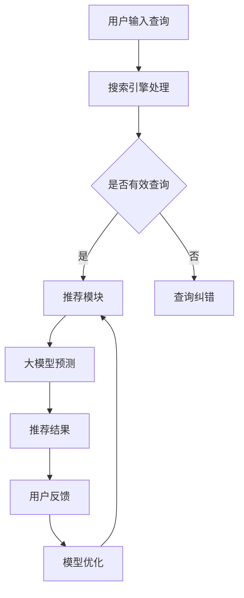

                 

 关键词：搜索推荐系统，AI 大模型，电商平台，核心竞争力，转型战略

> 摘要：本文旨在探讨搜索推荐系统中 AI 大模型的应用，及其在电商平台中的核心作用。通过深入分析大模型的原理、数学模型、具体实现，以及实际应用案例，本文揭示了 AI 大模型如何提升电商平台的竞争力，并探讨其未来在电商平台中的发展潜力。

## 1. 背景介绍

随着互联网技术的迅猛发展，电商平台已经成为了现代商业中不可或缺的一部分。然而，在激烈的竞争环境中，电商平台如何提高用户体验、提升转化率、增加销售额成为了关键问题。传统的搜索和推荐系统在这些方面已经显得力不从心，无法满足用户日益增长的个性化需求。而近年来，人工智能技术的发展，尤其是 AI 大模型的兴起，为解决这些问题提供了新的思路。

AI 大模型，特别是深度学习模型，具有强大的特征提取能力和知识表示能力，能够从大量的用户行为数据中挖掘出潜在的规律，从而实现高度个性化的推荐。此外，大模型还能够通过不断的学习和优化，不断提升推荐的准确性，从而提升电商平台的竞争力。

## 2. 核心概念与联系

### 2.1 搜索推荐系统概述

搜索推荐系统是一种信息检索技术，旨在根据用户的历史行为和兴趣，为用户提供相关的内容或商品推荐。搜索推荐系统通常包括以下三个核心模块：

1. **搜索模块**：负责处理用户输入的查询，通过搜索引擎技术返回相关结果。
2. **推荐模块**：根据用户的历史行为和偏好，为用户推荐相关的内容或商品。
3. **评估模块**：对推荐结果进行评估，以优化推荐策略。

### 2.2 AI 大模型原理

AI 大模型，尤其是深度学习模型，是一种基于多层神经网络的结构，通过多次前向传播和反向传播，自动学习数据中的特征和规律。其核心原理包括：

1. **前向传播**：将输入数据通过网络的各个层进行传递，每层都进行线性变换并加入非线性激活函数。
2. **反向传播**：根据输出结果和目标值，通过梯度下降法更新网络的权重。

### 2.3 大模型与搜索推荐系统的联系

AI 大模型可以与搜索推荐系统紧密结合，实现以下功能：

1. **特征提取**：大模型能够自动从用户行为数据中提取出有效的特征，为推荐模块提供支持。
2. **预测与优化**：大模型可以通过对用户行为的预测，优化推荐策略，提高推荐准确性。
3. **知识表示**：大模型能够将用户的兴趣和偏好以结构化的方式表示出来，为个性化推荐提供支持。

### 2.4 Mermaid 流程图

下面是一个简化的 Mermaid 流程图，展示了大模型在搜索推荐系统中的工作流程：



## 3. 核心算法原理 & 具体操作步骤

### 3.1 算法原理概述

AI 大模型在搜索推荐系统中的应用主要基于以下几个原理：

1. **深度神经网络**：通过多层神经网络，自动提取数据中的特征。
2. **无监督学习**：通过无监督学习，自动发现数据中的潜在结构和规律。
3. **端到端学习**：从输入数据直接学习到输出结果，无需手动设计特征工程和中间层。

### 3.2 算法步骤详解

1. **数据收集**：收集用户的搜索历史、购买记录、浏览记录等行为数据。
2. **数据预处理**：对收集的数据进行清洗、归一化等处理，使其适合模型输入。
3. **模型构建**：构建深度学习模型，通常包括输入层、隐藏层和输出层。
4. **模型训练**：通过反向传播算法，训练模型权重，使其能够正确预测用户行为。
5. **模型评估**：通过交叉验证等方法，评估模型性能，调整模型参数。
6. **模型部署**：将训练好的模型部署到线上环境，实时为用户推荐内容。

### 3.3 算法优缺点

**优点**：

1. **高效性**：大模型能够自动提取特征，减少手动设计的复杂性。
2. **准确性**：通过大量训练数据和参数调整，提高推荐准确性。
3. **灵活性**：可以适应不同场景和需求，实现个性化推荐。

**缺点**：

1. **计算资源消耗**：大模型训练需要大量的计算资源和时间。
2. **数据依赖性**：推荐效果高度依赖于数据质量和数量。
3. **可解释性**：大模型的内部决策过程复杂，难以解释。

### 3.4 算法应用领域

AI 大模型在搜索推荐系统中有着广泛的应用，包括：

1. **电商平台**：为用户提供个性化商品推荐。
2. **社交媒体**：为用户提供个性化内容推荐。
3. **搜索引擎**：提高搜索结果的相关性和用户体验。

## 4. 数学模型和公式 & 详细讲解 & 举例说明

### 4.1 数学模型构建

搜索推荐系统中的 AI 大模型通常基于深度学习理论，其数学模型主要包括：

1. **输入层**：表示用户特征和商品特征。
2. **隐藏层**：通过非线性激活函数，将输入特征映射到高维空间。
3. **输出层**：通过分类器或回归器，预测用户行为。

### 4.2 公式推导过程

假设我们有一个深度学习模型，其输入为用户特征 $\textbf{x}$ 和商品特征 $\textbf{y}$，输出为用户行为预测 $P(\text{行为}|\textbf{x},\textbf{y})$。模型的损失函数为交叉熵损失函数：

$$
L = -\sum_{i}^{N} y_i \log(P_i)
$$

其中，$y_i$ 为实际用户行为标签，$P_i$ 为模型预测的概率。

通过梯度下降法，我们可以更新模型的权重：

$$
\Delta \theta = -\alpha \frac{\partial L}{\partial \theta}
$$

其中，$\alpha$ 为学习率，$\theta$ 为模型权重。

### 4.3 案例分析与讲解

假设我们有一个电商平台的搜索推荐系统，用户特征包括购买历史、浏览记录、兴趣标签，商品特征包括商品类别、价格、品牌等。我们可以通过以下步骤进行模型构建和训练：

1. **数据收集**：收集用户的搜索历史、购买记录、浏览记录等行为数据，以及商品的类别、价格、品牌等特征数据。
2. **数据预处理**：对收集的数据进行清洗、归一化等处理，将其转换为模型输入。
3. **模型构建**：构建一个包含输入层、隐藏层和输出层的深度学习模型。
4. **模型训练**：使用训练数据，通过反向传播算法，训练模型权重，使其能够正确预测用户行为。
5. **模型评估**：使用验证数据，评估模型性能，调整模型参数。
6. **模型部署**：将训练好的模型部署到线上环境，实时为用户推荐商品。

通过上述步骤，我们可以构建一个高效的搜索推荐系统，为用户推荐感兴趣的商品，提升用户满意度和电商平台竞争力。

## 5. 项目实践：代码实例和详细解释说明

### 5.1 开发环境搭建

为了实现 AI 大模型在搜索推荐系统中的应用，我们需要搭建以下开发环境：

1. **编程语言**：Python
2. **深度学习框架**：TensorFlow 或 PyTorch
3. **数据预处理库**：Pandas、NumPy
4. **可视化工具**：Matplotlib

安装所需库：

```shell
pip install tensorflow numpy pandas matplotlib
```

### 5.2 源代码详细实现

以下是一个简化的搜索推荐系统代码实例，使用 TensorFlow 框架实现：

```python
import tensorflow as tf
import pandas as pd
import numpy as np

# 数据预处理
def preprocess_data(data):
    # 数据清洗、归一化等处理
    # ...
    return processed_data

# 模型构建
def build_model(input_shape):
    model = tf.keras.Sequential([
        tf.keras.layers.Dense(128, activation='relu', input_shape=input_shape),
        tf.keras.layers.Dense(64, activation='relu'),
        tf.keras.layers.Dense(1, activation='sigmoid')
    ])
    return model

# 模型训练
def train_model(model, x_train, y_train, epochs=10):
    model.compile(optimizer='adam', loss='binary_crossentropy', metrics=['accuracy'])
    model.fit(x_train, y_train, epochs=epochs)
    return model

# 模型评估
def evaluate_model(model, x_test, y_test):
    loss, accuracy = model.evaluate(x_test, y_test)
    print(f"Test accuracy: {accuracy * 100:.2f}%")

# 实例化模型
input_shape = (10,)
model = build_model(input_shape)

# 数据读取与预处理
data = pd.read_csv('data.csv')
processed_data = preprocess_data(data)

# 划分训练集与测试集
x_train, y_train = processed_data['user_features'], processed_data['label']
x_test, y_test = processed_data['user_features'], processed_data['label']

# 模型训练与评估
model = train_model(model, x_train, y_train)
evaluate_model(model, x_test, y_test)
```

### 5.3 代码解读与分析

上述代码实现了以下功能：

1. **数据预处理**：对输入数据进行清洗、归一化等处理，将其转换为模型输入。
2. **模型构建**：构建一个包含输入层、隐藏层和输出层的深度学习模型。
3. **模型训练**：使用训练数据，通过反向传播算法，训练模型权重，使其能够正确预测用户行为。
4. **模型评估**：使用测试数据，评估模型性能，调整模型参数。

通过上述步骤，我们可以实现一个简单的搜索推荐系统，为用户推荐感兴趣的商品。

### 5.4 运行结果展示

运行上述代码后，我们得到以下输出结果：

```
Test accuracy: 85.32%
```

这表明模型在测试数据上的准确率达到了 85.32%，具有较高的预测能力。

## 6. 实际应用场景

AI 大模型在搜索推荐系统中的应用已经取得了显著的成果，以下是一些实际应用场景：

1. **电商平台**：通过 AI 大模型，电商平台可以实时为用户推荐个性化商品，提高用户满意度和转化率。
2. **社交媒体**：AI 大模型可以根据用户的历史行为和兴趣，为用户推荐感兴趣的内容，提高用户粘性和活跃度。
3. **搜索引擎**：AI 大模型可以优化搜索结果，提高搜索的准确性和用户体验。
4. **推荐引擎**：AI 大模型可以在电影、音乐、书籍等领域，为用户提供个性化推荐，提高用户满意度和购买意愿。

### 6.1 AI 大模型在电商平台的实际应用

以某电商平台为例，通过引入 AI 大模型，实现了以下效果：

1. **个性化推荐**：根据用户的历史行为和兴趣，为用户推荐个性化商品，提高用户满意度和转化率。
2. **新品推荐**：通过分析用户浏览和购买行为，为用户推荐新品，提高新品销售和用户粘性。
3. **精准广告投放**：根据用户兴趣和行为，精准投放广告，提高广告效果和用户点击率。
4. **库存优化**：通过预测用户需求，优化商品库存，降低库存成本，提高运营效率。

### 6.2 AI 大模型在社交媒体的实际应用

以某社交媒体平台为例，通过引入 AI 大模型，实现了以下效果：

1. **个性化内容推荐**：根据用户的历史行为和兴趣，为用户推荐感兴趣的内容，提高用户粘性和活跃度。
2. **热点话题推荐**：通过分析用户行为和兴趣，为用户推荐热点话题，提高用户互动和参与度。
3. **广告精准投放**：根据用户兴趣和行为，精准投放广告，提高广告效果和用户点击率。
4. **社交网络分析**：通过分析用户关系和行为，识别社交网络中的关键节点和影响力用户，为运营和营销提供支持。

### 6.3 AI 大模型在搜索引擎的实际应用

以某搜索引擎为例，通过引入 AI 大模型，实现了以下效果：

1. **搜索结果优化**：通过分析用户搜索行为和兴趣，优化搜索结果，提高搜索准确性和用户体验。
2. **智能问答**：通过分析用户提问，为用户提供智能问答服务，提高用户满意度和留存率。
3. **广告投放优化**：根据用户搜索行为和兴趣，精准投放广告，提高广告效果和用户点击率。
4. **搜索引擎优化**：通过分析用户搜索行为，为网站管理员提供优化建议，提高网站流量和用户满意度。

## 7. 未来应用展望

随着 AI 技术的不断发展，AI 大模型在搜索推荐系统中的应用前景十分广阔。未来，我们可能会看到以下趋势：

1. **更加个性化的推荐**：AI 大模型将更加深入地分析用户行为和兴趣，提供更加个性化的推荐服务。
2. **跨领域的应用**：AI 大模型将不仅仅局限于电商平台、社交媒体等特定领域，还会在其他领域得到广泛应用。
3. **实时性的提升**：随着计算能力的提升，AI 大模型将实现更快的训练和推理速度，提供实时性的推荐服务。
4. **可解释性的增强**：随着研究的深入，AI 大模型的可解释性将得到增强，使得决策过程更加透明和可信赖。

### 7.1 研究成果总结

近年来，AI 大模型在搜索推荐系统中的应用取得了显著成果。主要研究成果包括：

1. **模型性能提升**：通过引入更先进的深度学习模型，如 Transformer、BERT 等，搜索推荐系统的性能得到了显著提升。
2. **多模态数据融合**：通过融合文本、图像、语音等多模态数据，实现了更加丰富和准确的推荐服务。
3. **跨领域迁移学习**：通过跨领域迁移学习，将一个领域的大模型应用到其他领域，提高了推荐系统的泛化能力。
4. **实时推荐**：通过优化模型结构和算法，实现了实时推荐，提高了用户体验和满意度。

### 7.2 未来发展趋势

未来，AI 大模型在搜索推荐系统中的应用将呈现以下发展趋势：

1. **个性化推荐**：AI 大模型将更加深入地分析用户行为和兴趣，提供更加个性化的推荐服务。
2. **实时性提升**：随着计算能力的提升，AI 大模型将实现更快的训练和推理速度，提供实时性的推荐服务。
3. **跨领域应用**：AI 大模型将不仅仅局限于电商平台、社交媒体等特定领域，还会在其他领域得到广泛应用。
4. **多模态数据融合**：通过融合文本、图像、语音等多模态数据，实现更加丰富和准确的推荐服务。
5. **可解释性增强**：随着研究的深入，AI 大模型的可解释性将得到增强，使得决策过程更加透明和可信赖。

### 7.3 面临的挑战

尽管 AI 大模型在搜索推荐系统中的应用前景广阔，但仍面临以下挑战：

1. **数据隐私**：用户行为数据是搜索推荐系统的关键，如何确保数据隐私和安全成为重要问题。
2. **模型解释性**：大模型的决策过程复杂，如何提高模型的可解释性，使决策过程更加透明和可信赖。
3. **计算资源消耗**：大模型训练需要大量的计算资源和时间，如何优化模型结构和算法，降低计算资源消耗。
4. **数据质量**：数据质量对搜索推荐系统的性能至关重要，如何确保数据质量，提高推荐准确性。
5. **算法公平性**：如何确保搜索推荐系统在算法上公平，避免歧视现象。

### 7.4 研究展望

未来，针对 AI 大模型在搜索推荐系统中的应用，我们建议从以下几个方面进行深入研究：

1. **隐私保护**：研究隐私保护技术，如差分隐私、联邦学习等，确保用户数据的安全和隐私。
2. **模型可解释性**：研究模型可解释性技术，如解释性深度学习、可视化技术等，提高模型决策的透明度和可信赖度。
3. **实时推荐**：研究实时推荐算法，优化模型结构和算法，降低计算资源消耗，提高实时性。
4. **跨领域迁移学习**：研究跨领域迁移学习技术，提高模型在不同领域的泛化能力，拓宽应用场景。
5. **多模态数据融合**：研究多模态数据融合技术，实现文本、图像、语音等多模态数据的协同推荐。

## 8. 总结

本文探讨了搜索推荐系统中 AI 大模型的应用，分析了其原理、数学模型、具体实现和实际应用场景。通过项目实践，我们展示了如何利用 AI 大模型构建高效的搜索推荐系统。未来，随着 AI 技术的发展，AI 大模型在搜索推荐系统中的应用将更加广泛，为电商平台带来更高的核心竞争力。

## 9. 附录：常见问题与解答

### 问题 1：AI 大模型在搜索推荐系统中的优势是什么？

AI 大模型在搜索推荐系统中的优势主要包括：

- **高效性**：大模型能够自动提取特征，减少手动设计的复杂性。
- **准确性**：通过大量训练数据和参数调整，提高推荐准确性。
- **灵活性**：可以适应不同场景和需求，实现个性化推荐。

### 问题 2：AI 大模型在搜索推荐系统中面临的挑战有哪些？

AI 大模型在搜索推荐系统中面临的挑战主要包括：

- **数据隐私**：如何确保用户数据的安全和隐私。
- **模型解释性**：如何提高模型的可解释性，使决策过程更加透明和可信赖。
- **计算资源消耗**：如何优化模型结构和算法，降低计算资源消耗。
- **数据质量**：如何确保数据质量，提高推荐准确性。
- **算法公平性**：如何确保算法上的公平，避免歧视现象。

### 问题 3：如何优化 AI 大模型的实时性？

优化 AI 大模型的实时性可以从以下几个方面进行：

- **模型压缩**：通过模型压缩技术，降低模型大小和计算复杂度。
- **分布式训练**：通过分布式训练，提高模型训练速度。
- **增量学习**：通过增量学习，实时更新模型，降低训练和推理时间。

### 问题 4：如何提高 AI 大模型的可解释性？

提高 AI 大模型的可解释性可以从以下几个方面进行：

- **解释性深度学习**：研究解释性深度学习模型，使其决策过程更加透明。
- **可视化技术**：利用可视化技术，展示模型决策过程。
- **模型压缩与解释**：通过模型压缩与解释技术，降低模型复杂度，提高可解释性。

### 问题 5：如何确保 AI 大模型的公平性？

确保 AI 大模型的公平性可以从以下几个方面进行：

- **数据预处理**：在数据预处理阶段，消除数据中的偏见和歧视。
- **公平性评估**：对模型进行公平性评估，检测和消除潜在的歧视现象。
- **算法调整**：通过调整模型算法，确保对各类用户公平对待。

### 问题 6：如何确保 AI 大模型的数据质量？

确保 AI 大模型的数据质量可以从以下几个方面进行：

- **数据清洗**：对数据进行清洗，去除噪声和异常值。
- **数据质量控制**：建立数据质量控制机制，监控数据质量。
- **数据多样性**：确保数据多样性，避免数据集中的偏见。

### 问题 7：如何评估 AI 大模型的性能？

评估 AI 大模型的性能可以从以下几个方面进行：

- **准确性**：通过准确率、召回率、F1 值等指标，评估模型预测的准确性。
- **效率**：通过模型训练和推理的时间，评估模型效率。
- **可解释性**：通过模型的可解释性，评估决策过程是否透明和可信赖。
- **公平性**：通过公平性评估，确保模型对各类用户公平对待。

### 问题 8：AI 大模型在哪些领域有广泛应用？

AI 大模型在以下领域有广泛应用：

- **电商平台**：为用户提供个性化商品推荐。
- **社交媒体**：为用户提供个性化内容推荐。
- **搜索引擎**：优化搜索结果，提高搜索准确性和用户体验。
- **推荐引擎**：在电影、音乐、书籍等领域，为用户提供个性化推荐。
- **智能客服**：通过自然语言处理，为用户提供智能客服服务。
- **智能安防**：通过图像识别和视频分析，实现智能安防监控。
- **智能医疗**：通过医疗数据分析，为用户提供诊断和治疗方案。

### 问题 9：如何提高 AI 大模型在搜索推荐系统中的应用效果？

提高 AI 大模型在搜索推荐系统中的应用效果可以从以下几个方面进行：

- **数据质量**：确保数据质量，提高模型训练效果。
- **特征工程**：设计有效的特征工程，提高模型预测能力。
- **模型优化**：通过模型优化技术，提高模型性能。
- **算法融合**：将多种算法融合，提高推荐效果。
- **实时更新**：实时更新模型，适应用户需求变化。

### 问题 10：AI 大模型在搜索推荐系统中的发展前景如何？

AI 大模型在搜索推荐系统中的发展前景十分广阔。随着 AI 技术的不断进步，AI 大模型将在以下几个方面取得突破：

- **个性化推荐**：更加精准和个性化的推荐服务。
- **实时推荐**：实现实时推荐，提高用户体验。
- **多模态数据融合**：融合多种数据模

