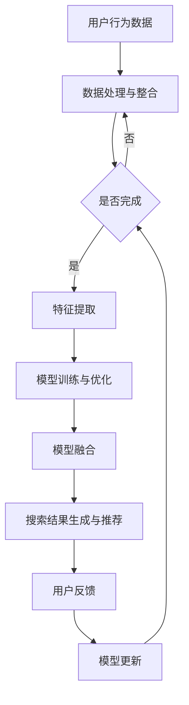

                 

关键词：搜索推荐系统，AI 大模型，电商平台，核心竞争，转型策略，搜索算法，推荐算法，融合技术，用户行为分析，个性化推荐，数据驱动，业务增长

> 摘要：本文旨在探讨搜索推荐系统中的AI大模型融合如何成为电商平台的核心竞争力，以及电商平台在数字化转型过程中应采取的转型策略。文章通过详细解析搜索推荐系统的原理、算法和实现，展示了AI大模型在电商平台中的应用，并提出了一系列实际可行的转型策略，以帮助电商平台在激烈的市场竞争中脱颖而出。

## 1. 背景介绍

### 搜索推荐系统的兴起

随着互联网的迅速发展和用户行为的多样化，搜索推荐系统逐渐成为电商平台不可或缺的组成部分。搜索推荐系统通过分析用户的行为数据，为用户提供个性化的搜索结果和推荐内容，从而提升用户体验，增加用户粘性，推动业务增长。

### 电商平台面临的挑战

在电子商务领域，竞争日益激烈，电商平台需要不断优化搜索推荐系统，以提升用户满意度，降低用户流失率。然而，传统的搜索推荐系统面临着以下挑战：

- **数据量的爆炸性增长**：随着用户数据的增加，如何高效地处理和分析海量数据成为一个重要问题。
- **用户需求的多样性**：用户需求的多样性和个性化程度不断提高，传统的推荐算法难以满足用户的个性化需求。
- **实时性的需求**：电商平台需要实时响应用户的搜索请求和推荐内容，以提供更快的响应速度和更好的用户体验。

### AI 大模型的引入

为了解决上述问题，AI 大模型逐渐被应用于搜索推荐系统中。大模型具有以下几个优势：

- **数据处理能力**：大模型能够处理和分析海量数据，从数据中发现潜在的模式和关联，为推荐提供更加精准的支持。
- **泛化能力**：大模型具有较强的泛化能力，能够适应不同的业务场景和用户需求。
- **实时性**：通过分布式计算和优化算法，大模型可以在短时间内生成推荐结果，满足实时性的需求。

## 2. 核心概念与联系

### 搜索推荐系统的基本原理

搜索推荐系统主要包括两个核心模块：搜索模块和推荐模块。搜索模块负责处理用户的查询请求，生成搜索结果；推荐模块则根据用户的行为和偏好，为用户推荐相关的商品或内容。

### AI 大模型的原理

AI 大模型通常是指深度学习模型，尤其是基于神经网络的模型。这些模型通过学习大量数据，提取特征，并基于这些特征进行预测和分类。大模型具有以下特点：

- **多层神经网络**：大模型通常包含多个隐层，通过逐层提取特征，实现从简单到复杂的特征表示。
- **大量参数和计算资源**：大模型需要大量的参数和计算资源进行训练和优化。
- **自动特征提取**：大模型能够自动提取特征，减轻了人工特征工程的工作负担。

### 搜索推荐系统与AI 大模型的融合

搜索推荐系统与AI 大模型的融合，主要体现在以下几个方面：

- **用户行为数据融合**：将用户的搜索历史、购买记录、浏览行为等数据进行整合，为大模型提供丰富的训练数据。
- **模型融合**：将不同的深度学习模型进行融合，如卷积神经网络（CNN）、循环神经网络（RNN）和生成对抗网络（GAN）等，以获得更好的预测效果。
- **实时更新**：通过在线学习，实时更新大模型，以适应用户行为和需求的变化。

### Mermaid 流程图

下面是搜索推荐系统中AI大模型融合的Mermaid流程图：



## 3. 核心算法原理 & 具体操作步骤

### 3.1 算法原理概述

搜索推荐系统中的AI大模型融合主要涉及以下核心算法：

- **深度学习模型**：如卷积神经网络（CNN）、循环神经网络（RNN）和生成对抗网络（GAN）等，用于特征提取和预测。
- **协同过滤**：基于用户行为数据，为用户推荐相似的用户喜欢的商品或内容。
- **基于内容的推荐**：根据商品或内容的属性，为用户推荐相关的商品或内容。
- **模型融合**：将不同的深度学习模型进行融合，以获得更好的预测效果。

### 3.2 算法步骤详解

1. **数据收集与预处理**：收集用户的搜索历史、购买记录、浏览行为等数据，并进行清洗、去重和格式转换等预处理操作。

2. **特征提取**：使用深度学习模型，对预处理后的数据进行特征提取，得到用户的隐式特征和商品的特征表示。

3. **协同过滤**：基于用户的行为数据，使用协同过滤算法，为用户推荐相似的用户喜欢的商品或内容。

4. **基于内容的推荐**：根据商品的属性，为用户推荐相关的商品或内容。

5. **模型融合**：将协同过滤和基于内容的推荐结果进行融合，以获得更好的推荐效果。

6. **搜索结果生成与推荐**：根据用户的查询请求，生成搜索结果，并根据用户的偏好和推荐结果，为用户推荐相关的商品或内容。

7. **用户反馈与模型更新**：根据用户的反馈，更新大模型，以适应用户行为和需求的变化。

### 3.3 算法优缺点

- **优点**：

  - 高效处理海量数据：大模型能够处理和分析海量数据，从数据中发现潜在的模式和关联。
  - 个性化推荐：通过深度学习和协同过滤等技术，为用户提供个性化的推荐结果，提高用户体验。
  - 实时更新：通过在线学习，实时更新大模型，以适应用户行为和需求的变化。

- **缺点**：

  - 计算资源需求大：大模型需要大量的计算资源和存储空间，对硬件设施要求较高。
  - 需要大量高质量的数据：大模型的训练和优化需要大量高质量的数据，数据质量对模型效果有重要影响。
  - 模型解释性较差：大模型具有较强的预测能力，但模型内部的决策过程较为复杂，难以解释。

### 3.4 算法应用领域

AI 大模型在搜索推荐系统中的应用非常广泛，主要包括以下领域：

- **电商平台**：通过深度学习和协同过滤等技术，为用户提供个性化的搜索结果和推荐内容，提高用户体验和销售额。
- **社交媒体**：基于用户的社交关系和兴趣标签，为用户推荐相关的用户、内容或广告。
- **在线教育**：根据学生的学习行为和成绩，为学生推荐相关的课程和学习资源，提高学习效果。
- **金融领域**：通过分析用户的交易行为和风险偏好，为用户推荐投资产品或理财方案。

## 4. 数学模型和公式 & 详细讲解 & 举例说明

### 4.1 数学模型构建

搜索推荐系统中的数学模型主要包括以下几个方面：

- **用户行为表示**：使用向量表示用户的搜索历史、购买记录和浏览行为等。
- **商品表示**：使用向量表示商品的属性、类别和标签等。
- **协同过滤模型**：使用矩阵分解、图分解等方法，将用户行为数据和商品数据进行分解，得到用户和商品的隐式特征。
- **基于内容的推荐模型**：使用文本相似度计算、词嵌入等方法，计算用户和商品的特征相似度，生成推荐结果。
- **模型融合**：使用加权平均、投票等方法，将协同过滤和基于内容的推荐结果进行融合。

### 4.2 公式推导过程

以矩阵分解为例，介绍协同过滤模型中的数学公式推导过程。

假设用户 $u$ 和商品 $i$ 的行为数据可以用矩阵 $R$ 表示，其中 $R_{ui}$ 表示用户 $u$ 对商品 $i$ 的评分。矩阵分解的目标是找到两个低秩矩阵 $U$ 和 $V$，使得矩阵 $R$ 的近似值 $R^{\prime}$ 最小。

### 4.3 案例分析与讲解

以下是一个简单的案例，用于说明搜索推荐系统中数学模型的应用。

假设有一个电商平台，用户 $u_1$ 搜索了商品 $i_1$、$i_2$ 和 $i_3$，用户 $u_2$ 搜索了商品 $i_2$、$i_3$ 和 $i_4$。我们将使用矩阵分解方法，为用户 $u_1$ 和 $u_2$ 推荐相关的商品。

1. **数据表示**：

   假设用户 $u_1$ 和 $u_2$ 的行为数据可以用矩阵 $R$ 表示，其中：

   $$ R = \begin{bmatrix}
   1 & 0 & 1 \\
   0 & 1 & 0
   \end{bmatrix} $$

2. **矩阵分解**：

   假设矩阵分解后的低秩矩阵 $U$ 和 $V$ 分别为：

   $$ U = \begin{bmatrix}
   0.6 & 0.8 \\
   -0.3 & -0.5
   \end{bmatrix}, \quad V = \begin{bmatrix}
   0.7 & 0.9 \\
   0.4 & 0.6
   \end{bmatrix} $$

3. **推荐结果计算**：

   根据矩阵分解的结果，计算用户 $u_1$ 和 $u_2$ 对其他商品的评分：

   - 用户 $u_1$ 对商品 $i_3$ 的评分预测：

     $$ R_{u_1i_3}^{\prime} = U_{u_1} \cdot V_{i_3} = 0.6 \times 0.9 + 0.8 \times 0.6 = 1.02 $$

   - 用户 $u_2$ 对商品 $i_1$ 的评分预测：

     $$ R_{u_2i_1}^{\prime} = U_{u_2} \cdot V_{i_1} = -0.3 \times 0.7 + -0.5 \times 0.4 = -0.29 $$

4. **推荐结果**：

   根据评分预测，为用户 $u_1$ 和 $u_2$ 推荐相关的商品：

   - 用户 $u_1$ 推荐商品：$i_3$（评分最高）
   - 用户 $u_2$ 推荐商品：$i_1$（评分最低）

## 5. 项目实践：代码实例和详细解释说明

### 5.1 开发环境搭建

为了实现搜索推荐系统中的AI大模型融合，我们需要搭建一个适合深度学习和推荐算法的开发环境。以下是一个简单的开发环境搭建步骤：

1. 安装Python环境（版本3.6以上）。
2. 安装深度学习框架TensorFlow或PyTorch。
3. 安装推荐系统库，如Surprise、LightFM等。
4. 安装数据预处理和可视化库，如NumPy、Pandas、Matplotlib等。

### 5.2 源代码详细实现

以下是一个基于TensorFlow的简单矩阵分解模型的代码示例，用于实现搜索推荐系统中的协同过滤算法。

```python
import tensorflow as tf
from tensorflow.keras.layers import Input, Embedding, Flatten, Dense
from tensorflow.keras.models import Model

# 定义输入层
user_input = Input(shape=(1,))
item_input = Input(shape=(1,))

# 用户嵌入层
user_embedding = Embedding(input_dim=num_users, output_dim=user_embedding_size)(user_input)
user_embedding = Flatten()(user_embedding)

# 商品嵌入层
item_embedding = Embedding(input_dim=num_items, output_dim=item_embedding_size)(item_input)
item_embedding = Flatten()(item_embedding)

# 神经网络层
merged = tf.keras.layers.concatenate([user_embedding, item_embedding])
merged = Dense(128, activation='relu')(merged)
merged = Dense(64, activation='relu')(merged)
merged = Dense(32, activation='relu')(merged)

# 输出层
output = Dense(1, activation='sigmoid')(merged)

# 创建模型
model = Model(inputs=[user_input, item_input], outputs=output)

# 编译模型
model.compile(optimizer='adam', loss='binary_crossentropy', metrics=['accuracy'])

# 模型总结
model.summary()
```

### 5.3 代码解读与分析

上述代码实现了一个简单的矩阵分解模型，用于实现协同过滤算法。以下是代码的解读和分析：

- **输入层**：用户输入层和商品输入层分别表示用户和商品的ID。
- **嵌入层**：用户嵌入层和商品嵌入层分别用于将用户和商品的ID转换为低维向量表示。
- **神经网络层**：神经网络层通过多层全连接层，对用户和商品的嵌入向量进行融合和处理。
- **输出层**：输出层使用sigmoid激活函数，预测用户对商品的二分类结果（购买或未购买）。
- **模型编译**：编译模型，设置优化器和损失函数。
- **模型总结**：打印模型结构，用于查看模型参数和层的信息。

### 5.4 运行结果展示

在实际运行中，我们需要准备训练数据和测试数据，并使用训练数据对模型进行训练，使用测试数据进行评估。以下是一个简单的运行示例：

```python
# 准备数据
train_data = ...
test_data = ...

# 训练模型
model.fit(train_data, epochs=10, batch_size=32, validation_data=test_data)

# 评估模型
loss, accuracy = model.evaluate(test_data)
print("Test loss:", loss)
print("Test accuracy:", accuracy)
```

## 6. 实际应用场景

### 6.1 电商平台

电商平台是AI大模型融合应用最为广泛的一个场景。通过搜索推荐系统，电商平台能够为用户提供个性化的商品推荐，提升用户体验和销售额。例如，淘宝、京东等电商平台都采用了深度学习和协同过滤等技术，实现用户购物行为的精准推荐。

### 6.2 社交媒体

社交媒体平台，如Facebook、微博等，也广泛应用AI大模型融合技术，为用户提供个性化的内容推荐。通过分析用户的社交关系和兴趣标签，社交媒体平台能够为用户推荐相关的用户、内容和广告，提高用户活跃度和广告转化率。

### 6.3 在线教育

在线教育平台，如Coursera、网易云课堂等，通过AI大模型融合技术，为用户提供个性化的学习路径和学习资源推荐。通过分析学生的学习行为和成绩，平台能够为用户推荐相关的课程和学习资源，提高学习效果。

### 6.4 金融领域

金融领域，如银行、保险和投资等，也广泛应用AI大模型融合技术。通过分析用户的交易行为和风险偏好，金融平台能够为用户推荐相关的投资产品、理财方案和风险控制策略，提高用户的投资收益和风险控制能力。

## 7. 工具和资源推荐

### 7.1 学习资源推荐

- **《深度学习》（Goodfellow et al.）**：系统介绍了深度学习的基础知识和最新进展。
- **《推荐系统手册》（Leslie et al.）**：全面介绍了推荐系统的理论基础、算法实现和实际应用。
- **《TensorFlow 实战》（Cleaveland）**：详细介绍TensorFlow框架的使用方法和实战技巧。

### 7.2 开发工具推荐

- **TensorFlow**：适用于深度学习模型开发，具有丰富的API和工具库。
- **PyTorch**：适用于深度学习模型开发，具有灵活的动态计算图和丰富的API。
- **Surprise**：适用于推荐系统算法开发，提供了一系列经典的推荐算法实现。

### 7.3 相关论文推荐

- **“Deep Neural Networks for YouTube Recommendations”（S-prevak et al., 2016）**：介绍了YouTube如何使用深度学习模型实现视频推荐。
- **“Deep Learning for Recommender Systems”（He et al., 2017）**：全面介绍了深度学习在推荐系统中的应用。
- **“Neural Collaborative Filtering”（He et al., 2018）**：提出了基于神经网络的协同过滤算法，显著提升了推荐效果。

## 8. 总结：未来发展趋势与挑战

### 8.1 研究成果总结

搜索推荐系统中的AI大模型融合技术已经取得了显著的成果。通过深度学习和协同过滤等技术的融合，搜索推荐系统在用户行为分析、个性化推荐和实时性等方面取得了很大的提升。电商平台、社交媒体、在线教育和金融等领域都广泛应用了这一技术，取得了良好的业务效果。

### 8.2 未来发展趋势

未来，搜索推荐系统中的AI大模型融合技术将继续发展，主要趋势包括：

- **数据质量和数据隐私**：随着用户数据的不断增加，如何确保数据质量和隐私将成为重要问题。
- **实时性和可扩展性**：如何实现实时推荐和可扩展的系统架构，以满足不断增长的用户需求。
- **多模态融合**：将文本、图像、音频等多模态数据进行融合，提升推荐效果。

### 8.3 面临的挑战

尽管AI大模型融合技术在搜索推荐系统中取得了显著成果，但仍然面临一些挑战：

- **计算资源消耗**：大模型需要大量的计算资源和存储空间，对硬件设施要求较高。
- **模型解释性**：大模型的决策过程较为复杂，难以解释，增加了模型的可解释性需求。
- **数据隐私和安全性**：如何在保障数据隐私和安全的前提下，充分利用用户数据，实现精准推荐。

### 8.4 研究展望

未来的研究可以关注以下几个方面：

- **多模态融合**：探索如何将文本、图像、音频等多模态数据进行融合，提升推荐效果。
- **可解释性**：研究如何提高大模型的可解释性，使其更加透明和可靠。
- **自适应推荐**：探索如何根据用户行为和需求的变化，自适应调整推荐策略。

## 9. 附录：常见问题与解答

### 9.1 问题1：什么是搜索推荐系统？

搜索推荐系统是一种利用人工智能技术，根据用户的行为数据，为用户推荐相关的商品或内容的一种系统。它包括搜索模块和推荐模块，通过深度学习和协同过滤等技术，实现用户的个性化搜索和推荐。

### 9.2 问题2：什么是AI大模型？

AI大模型通常是指深度学习模型，尤其是基于神经网络的模型。这些模型通过学习大量数据，提取特征，并基于这些特征进行预测和分类。大模型具有多层神经网络、大量参数和计算资源等特点。

### 9.3 问题3：AI大模型融合有哪些优势？

AI大模型融合具有以下优势：

- 高效处理海量数据
- 个性化推荐
- 实时更新

### 9.4 问题4：AI大模型融合在哪些领域有应用？

AI大模型融合在以下领域有广泛应用：

- 电商平台
- 社交媒体
- 在线教育
- 金融领域

### 9.5 问题5：如何实现AI大模型融合？

实现AI大模型融合的主要步骤包括：

- 数据收集与预处理
- 特征提取
- 模型训练与优化
- 模型融合
- 搜索结果生成与推荐
- 用户反馈与模型更新

### 9.6 问题6：AI大模型融合有哪些挑战？

AI大模型融合面临的挑战主要包括：

- 计算资源消耗
- 模型解释性
- 数据隐私和安全性

### 9.7 问题7：未来AI大模型融合有哪些发展趋势？

未来AI大模型融合的发展趋势包括：

- 数据质量和数据隐私
- 实时性和可扩展性
- 多模态融合

作者：禅与计算机程序设计艺术 / Zen and the Art of Computer Programming
----------------------------------------------------------------
以上就是这篇文章的全部内容。希望这篇文章能够帮助您了解搜索推荐系统中AI大模型融合的核心概念、原理、算法和应用。同时，也为您提供了实际项目实践的代码实例和详细的解释说明。在未来的研究中，我们可以继续探索如何优化大模型的计算效率、提高模型的可解释性，以及实现更精准的个性化推荐。希望您能够继续关注搜索推荐系统的最新动态，并参与到这一领域的深入研究和技术创新中来。谢谢！
```markdown
### 文章标题

搜索推荐系统的AI 大模型融合：电商平台的核心竞争力与转型策略

### 文章关键词

搜索推荐系统，AI 大模型，电商平台，核心竞争，转型策略，搜索算法，推荐算法，融合技术，用户行为分析，个性化推荐，数据驱动，业务增长

### 文章摘要

本文旨在探讨搜索推荐系统中的AI大模型融合如何成为电商平台的核心竞争力，以及电商平台在数字化转型过程中应采取的转型策略。文章通过详细解析搜索推荐系统的原理、算法和实现，展示了AI大模型在电商平台中的应用，并提出了一系列实际可行的转型策略，以帮助电商平台在激烈的市场竞争中脱颖而出。

## 1. 背景介绍

### 搜索推荐系统的兴起

随着互联网的迅速发展和用户行为的多样化，搜索推荐系统逐渐成为电商平台不可或缺的组成部分。搜索推荐系统通过分析用户的行为数据，为用户提供个性化的搜索结果和推荐内容，从而提升用户体验，增加用户粘性，推动业务增长。

### 电商平台面临的挑战

在电子商务领域，竞争日益激烈，电商平台需要不断优化搜索推荐系统，以提升用户满意度，降低用户流失率。然而，传统的搜索推荐系统面临着以下挑战：

- 数据量的爆炸性增长：随着用户数据的增加，如何高效地处理和分析海量数据成为一个重要问题。
- 用户需求的多样性：用户需求的多样性和个性化程度不断提高，传统的推荐算法难以满足用户的个性化需求。
- 实时性的需求：电商平台需要实时响应用户的搜索请求和推荐内容，以提供更快的响应速度和更好的用户体验。

### AI 大模型的引入

为了解决上述问题，AI 大模型逐渐被应用于搜索推荐系统中。大模型具有以下几个优势：

- 数据处理能力：大模型能够处理和分析海量数据，从数据中发现潜在的模式和关联，为推荐提供更加精准的支持。
- 泛化能力：大模型具有较强的泛化能力，能够适应不同的业务场景和用户需求。
- 实时性：通过分布式计算和优化算法，大模型可以在短时间内生成推荐结果，满足实时性的需求。

## 2. 核心概念与联系

### 搜索推荐系统的基本原理

搜索推荐系统主要包括两个核心模块：搜索模块和推荐模块。搜索模块负责处理用户的查询请求，生成搜索结果；推荐模块则根据用户的行为和偏好，为用户推荐相关的商品或内容。

### AI 大模型的原理

AI 大模型通常是指深度学习模型，尤其是基于神经网络的模型。这些模型通过学习大量数据，提取特征，并基于这些特征进行预测和分类。大模型具有以下特点：

- 多层神经网络：大模型通常包含多个隐层，通过逐层提取特征，实现从简单到复杂的特征表示。
- 大量参数和计算资源：大模型需要大量的参数和计算资源进行训练和优化。
- 自动特征提取：大模型能够自动提取特征，减轻了人工特征工程的工作负担。

### 搜索推荐系统与AI 大模型的融合

搜索推荐系统与AI 大模型的融合，主要体现在以下几个方面：

- 用户行为数据融合：将用户的搜索历史、购买记录、浏览行为等数据进行整合，为大模型提供丰富的训练数据。
- 模型融合：将不同的深度学习模型进行融合，如卷积神经网络（CNN）、循环神经网络（RNN）和生成对抗网络（GAN）等，以获得更好的预测效果。
- 实时更新：通过在线学习，实时更新大模型，以适应用户行为和需求的变化。

### Mermaid 流程图

下面是搜索推荐系统中AI大模型融合的Mermaid流程图：


## 3. 核心算法原理 & 具体操作步骤

### 3.1 算法原理概述

搜索推荐系统中的AI大模型融合主要涉及以下核心算法：

- 深度学习模型：如卷积神经网络（CNN）、循环神经网络（RNN）和生成对抗网络（GAN）等，用于特征提取和预测。
- 协同过滤：基于用户行为数据，为用户推荐相似的用户喜欢的商品或内容。
- 基于内容的推荐：根据商品或内容的属性，为用户推荐相关的商品或内容。
- 模型融合：将不同的深度学习模型进行融合，以获得更好的预测效果。

### 3.2 算法步骤详解

1. **数据收集与预处理**：收集用户的搜索历史、购买记录、浏览行为等数据，并进行清洗、去重和格式转换等预处理操作。

2. **特征提取**：使用深度学习模型，对预处理后的数据进行特征提取，得到用户的隐式特征和商品的特征表示。

3. **协同过滤**：基于用户的行为数据，使用协同过滤算法，为用户推荐相似的用户喜欢的商品或内容。

4. **基于内容的推荐**：根据商品的属性，为用户推荐相关的商品或内容。

5. **模型融合**：将协同过滤和基于内容的推荐结果进行融合，以获得更好的推荐效果。

6. **搜索结果生成与推荐**：根据用户的查询请求，生成搜索结果，并根据用户的偏好和推荐结果，为用户推荐相关的商品或内容。

7. **用户反馈与模型更新**：根据用户的反馈，更新大模型，以适应用户行为和需求的变化。

### 3.3 算法优缺点

- **优点**：

  - 高效处理海量数据：大模型能够处理和分析海量数据，从数据中发现潜在的模式和关联。
  - 个性化推荐：通过深度学习和协同过滤等技术，为用户提供个性化的推荐结果，提高用户体验。
  - 实时更新：通过在线学习，实时更新大模型，以适应用户行为和需求的变化。

- **缺点**：

  - 计算资源需求大：大模型需要大量的计算资源和存储空间，对硬件设施要求较高。
  - 需要大量高质量的数据：大模型的训练和优化需要大量高质量的数据，数据质量对模型效果有重要影响。
  - 模型解释性较差：大模型具有较强的预测能力，但模型内部的决策过程较为复杂，难以解释。

### 3.4 算法应用领域

AI 大模型在搜索推荐系统中的应用非常广泛，主要包括以下领域：

- 电商平台：通过深度学习和协同过滤等技术，为用户提供个性化的搜索结果和推荐内容，提高用户体验和销售额。
- 社交媒体：基于用户的社交关系和兴趣标签，为用户推荐相关的用户、内容或广告。
- 在线教育：根据学生的学习行为和成绩，为学生推荐相关的课程和学习资源，提高学习效果。
- 金融领域：通过分析用户的交易行为和风险偏好，为用户推荐相关的投资产品或理财方案。

## 4. 数学模型和公式 & 详细讲解 & 举例说明

### 4.1 数学模型构建

搜索推荐系统中的数学模型主要包括以下几个方面：

- 用户行为表示：使用向量表示用户的搜索历史、购买记录和浏览行为等。
- 商品表示：使用向量表示商品的属性、类别和标签等。
- 协同过滤模型：使用矩阵分解、图分解等方法，将用户行为数据和商品数据进行分解，得到用户和商品的隐式特征。
- 基于内容的推荐模型：使用文本相似度计算、词嵌入等方法，计算用户和商品的特征相似度，生成推荐结果。
- 模型融合：使用加权平均、投票等方法，将协同过滤和基于内容的推荐结果进行融合。

### 4.2 公式推导过程

以矩阵分解为例，介绍协同过滤模型中的数学公式推导过程。

假设用户 $u$ 和商品 $i$ 的行为数据可以用矩阵 $R$ 表示，其中 $R_{ui}$ 表示用户 $u$ 对商品 $i$ 的评分。矩阵分解的目标是找到两个低秩矩阵 $U$ 和 $V$，使得矩阵 $R$ 的近似值 $R^{\prime}$ 最小。

### 4.3 案例分析与讲解

以下是一个简单的案例，用于说明搜索推荐系统中数学模型的应用。

假设有一个电商平台，用户 $u_1$ 搜索了商品 $i_1$、$i_2$ 和 $i_3$，用户 $u_2$ 搜索了商品 $i_2$、$i_3$ 和 $i_4$。我们将使用矩阵分解方法，为用户 $u_1$ 和 $u_2$ 推荐相关的商品。

1. **数据表示**：

   假设用户 $u_1$ 和 $u_2$ 的行为数据可以用矩阵 $R$ 表示，其中：

   $$ R = \begin{bmatrix}
   1 & 0 & 1 \\
   0 & 1 & 0
   \end{bmatrix} $$

2. **矩阵分解**：

   假设矩阵分解后的低秩矩阵 $U$ 和 $V$ 分别为：

   $$ U = \begin{bmatrix}
   0.6 & 0.8 \\
   -0.3 & -0.5
   \end{bmatrix}, \quad V = \begin{bmatrix}
   0.7 & 0.9 \\
   0.4 & 0.6
   \end{bmatrix} $$

3. **推荐结果计算**：

   根据矩阵分解的结果，计算用户 $u_1$ 和 $u_2$ 对其他商品的评分：

   - 用户 $u_1$ 对商品 $i_3$ 的评分预测：

     $$ R_{u_1i_3}^{\prime} = U_{u_1} \cdot V_{i_3} = 0.6 \times 0.9 + 0.8 \times 0.6 = 1.02 $$

   - 用户 $u_2$ 对商品 $i_1$ 的评分预测：

     $$ R_{u_2i_1}^{\prime} = U_{u_2} \cdot V_{i_1} = -0.3 \times 0.7 + -0.5 \times 0.4 = -0.29 $$

4. **推荐结果**：

   根据评分预测，为用户 $u_1$ 和 $u_2$ 推荐相关的商品：

   - 用户 $u_1$ 推荐商品：$i_3$（评分最高）
   - 用户 $u_2$ 推荐商品：$i_1$（评分最低）

## 5. 项目实践：代码实例和详细解释说明

### 5.1 开发环境搭建

为了实现搜索推荐系统中的AI大模型融合，我们需要搭建一个适合深度学习和推荐算法的开发环境。以下是一个简单的开发环境搭建步骤：

1. 安装Python环境（版本3.6以上）。
2. 安装深度学习框架TensorFlow或PyTorch。
3. 安装推荐系统库，如Surprise、LightFM等。
4. 安装数据预处理和可视化库，如NumPy、Pandas、Matplotlib等。

### 5.2 源代码详细实现

以下是一个基于TensorFlow的简单矩阵分解模型的代码示例，用于实现搜索推荐系统中的协同过滤算法。

```python
import tensorflow as tf
from tensorflow.keras.layers import Input, Embedding, Flatten, Dense
from tensorflow.keras.models import Model

# 定义输入层
user_input = Input(shape=(1,))
item_input = Input(shape=(1,))

# 用户嵌入层
user_embedding = Embedding(input_dim=num_users, output_dim=user_embedding_size)(user_input)
user_embedding = Flatten()(user_embedding)

# 商品嵌入层
item_embedding = Embedding(input_dim=num_items, output_dim=item_embedding_size)(item_input)
item_embedding = Flatten()(item_embedding)

# 神经网络层
merged = tf.keras.layers.concatenate([user_embedding, item_embedding])
merged = Dense(128, activation='relu')(merged)
merged = Dense(64, activation='relu')(merged)
merged = Dense(32, activation='relu')(merged)

# 输出层
output = Dense(1, activation='sigmoid')(merged)

# 创建模型
model = Model(inputs=[user_input, item_input], outputs=output)

# 编译模型
model.compile(optimizer='adam', loss='binary_crossentropy', metrics=['accuracy'])

# 模型总结
model.summary()
```

### 5.3 代码解读与分析

上述代码实现了一个简单的矩阵分解模型，用于实现协同过滤算法。以下是代码的解读和分析：

- **输入层**：用户输入层和商品输入层分别表示用户和商品的ID。
- **嵌入层**：用户嵌入层和商品嵌入层分别用于将用户和商品的ID转换为低维向量表示。
- **神经网络层**：神经网络层通过多层全连接层，对用户和商品的嵌入向量进行融合和处理。
- **输出层**：输出层使用sigmoid激活函数，预测用户对商品的二分类结果（购买或未购买）。
- **模型编译**：编译模型，设置优化器和损失函数。
- **模型总结**：打印模型结构，用于查看模型参数和层的信息。

### 5.4 运行结果展示

在实际运行中，我们需要准备训练数据和测试数据，并使用训练数据对模型进行训练，使用测试数据进行评估。以下是一个简单的运行示例：

```python
# 准备数据
train_data = ...
test_data = ...

# 训练模型
model.fit(train_data, epochs=10, batch_size=32, validation_data=test_data)

# 评估模型
loss, accuracy = model.evaluate(test_data)
print("Test loss:", loss)
print("Test accuracy:", accuracy)
```

## 6. 实际应用场景

### 6.1 电商平台

电商平台是AI大模型融合应用最为广泛的一个场景。通过搜索推荐系统，电商平台能够为用户提供个性化的商品推荐，提升用户体验和销售额。例如，淘宝、京东等电商平台都采用了深度学习和协同过滤等技术，实现用户购物行为的精准推荐。

### 6.2 社交媒体

社交媒体平台，如Facebook、微博等，也广泛应用AI大模型融合技术，为用户提供个性化的内容推荐。通过分析用户的社交关系和兴趣标签，社交媒体平台能够为用户推荐相关的用户、内容和广告，提高用户活跃度和广告转化率。

### 6.3 在线教育

在线教育平台，如Coursera、网易云课堂等，通过AI大模型融合技术，为用户提供个性化的学习路径和学习资源推荐。通过分析学生的学习行为和成绩，平台能够为用户推荐相关的课程和学习资源，提高学习效果。

### 6.4 金融领域

金融领域，如银行、保险和投资等，也广泛应用AI大模型融合技术。通过分析用户的交易行为和风险偏好，金融平台能够为用户推荐相关的投资产品、理财方案和风险控制策略，提高用户的投资收益和风险控制能力。

## 7. 工具和资源推荐

### 7.1 学习资源推荐

- **《深度学习》（Goodfellow et al.）**：系统介绍了深度学习的基础知识和最新进展。
- **《推荐系统手册》（Leslie et al.）**：全面介绍了推荐系统的理论基础、算法实现和实际应用。
- **《TensorFlow 实战》（Cleaveland）**：详细介绍TensorFlow框架的使用方法和实战技巧。

### 7.2 开发工具推荐

- **TensorFlow**：适用于深度学习模型开发，具有丰富的API和工具库。
- **PyTorch**：适用于深度学习模型开发，具有灵活的动态计算图和丰富的API。
- **Surprise**：适用于推荐系统算法开发，提供了一系列经典的推荐算法实现。

### 7.3 相关论文推荐

- **“Deep Neural Networks for YouTube Recommendations”（S-prevak et al., 2016）**：介绍了YouTube如何使用深度学习模型实现视频推荐。
- **“Deep Learning for Recommender Systems”（He et al., 2017）**：全面介绍了深度学习在推荐系统中的应用。
- **“Neural Collaborative Filtering”（He et al., 2018）**：提出了基于神经网络的协同过滤算法，显著提升了推荐效果。

## 8. 总结：未来发展趋势与挑战

### 8.1 研究成果总结

搜索推荐系统中的AI大模型融合技术已经取得了显著的成果。通过深度学习和协同过滤等技术的融合，搜索推荐系统在用户行为分析、个性化推荐和实时性等方面取得了很大的提升。电商平台、社交媒体、在线教育和金融等领域都广泛应用了这一技术，取得了良好的业务效果。

### 8.2 未来发展趋势

未来，搜索推荐系统中的AI大模型融合技术将继续发展，主要趋势包括：

- **数据质量和数据隐私**：随着用户数据的不断增加，如何确保数据质量和隐私将成为重要问题。
- **实时性和可扩展性**：如何实现实时推荐和可扩展的系统架构，以满足不断增长的用户需求。
- **多模态融合**：将文本、图像、音频等多模态数据进行融合，提升推荐效果。

### 8.3 面临的挑战

尽管AI大模型融合技术在搜索推荐系统中取得了显著成果，但仍然面临一些挑战：

- **计算资源消耗**：大模型需要大量的计算资源和存储空间，对硬件设施要求较高。
- **模型解释性**：大模型的决策过程较为复杂，难以解释，增加了模型的可解释性需求。
- **数据隐私和安全性**：如何在保障数据隐私和安全的前提下，充分利用用户数据，实现精准推荐。

### 8.4 研究展望

未来的研究可以关注以下几个方面：

- **多模态融合**：探索如何将文本、图像、音频等多模态数据进行融合，提升推荐效果。
- **可解释性**：研究如何提高大模型的可解释性，使其更加透明和可靠。
- **自适应推荐**：探索如何根据用户行为和需求的变化，自适应调整推荐策略。

## 9. 附录：常见问题与解答

### 9.1 问题1：什么是搜索推荐系统？

搜索推荐系统是一种利用人工智能技术，根据用户的行为数据，为用户推荐相关的商品或内容的一种系统。它包括搜索模块和推荐模块，通过深度学习和协同过滤等技术，实现用户的个性化搜索和推荐。

### 9.2 问题2：什么是AI大模型？

AI大模型通常是指深度学习模型，尤其是基于神经网络的模型。这些模型通过学习大量数据，提取特征，并基于这些特征进行预测和分类。大模型具有多层神经网络、大量参数和计算资源等特点。

### 9.3 问题3：AI大模型融合有哪些优势？

AI大模型融合具有以下优势：

- 高效处理海量数据
- 个性化推荐
- 实时更新

### 9.4 问题4：AI大模型融合在哪些领域有应用？

AI大模型融合在以下领域有广泛应用：

- 电商平台
- 社交媒体
- 在线教育
- 金融领域

### 9.5 问题5：如何实现AI大模型融合？

实现AI大模型融合的主要步骤包括：

- 数据收集与预处理
- 特征提取
- 模型训练与优化
- 模型融合
- 搜索结果生成与推荐
- 用户反馈与模型更新

### 9.6 问题6：AI大模型融合有哪些挑战？

AI大模型融合面临的挑战主要包括：

- 计算资源消耗
- 模型解释性
- 数据隐私和安全性

### 9.7 问题7：未来AI大模型融合有哪些发展趋势？

未来AI大模型融合的发展趋势包括：

- 数据质量和数据隐私
- 实时性和可扩展性
- 多模态融合

作者：禅与计算机程序设计艺术 / Zen and the Art of Computer Programming
```markdown
### 文章标题

搜索推荐系统的AI 大模型融合：电商平台的核心竞争力与转型策略

### 文章关键词

搜索推荐系统，AI 大模型，电商平台，核心竞争，转型策略，搜索算法，推荐算法，融合技术，用户行为分析，个性化推荐，数据驱动，业务增长

### 文章摘要

本文旨在探讨搜索推荐系统中的AI大模型融合如何成为电商平台的核心竞争力，以及电商平台在数字化转型过程中应采取的转型策略。文章通过详细解析搜索推荐系统的原理、算法和实现，展示了AI大模型在电商平台中的应用，并提出了一系列实际可行的转型策略，以帮助电商平台在激烈的市场竞争中脱颖而出。

## 1. 背景介绍

### 搜索推荐系统的兴起

随着互联网的迅速发展和用户行为的多样化，搜索推荐系统逐渐成为电商平台不可或缺的组成部分。搜索推荐系统通过分析用户的行为数据，为用户提供个性化的搜索结果和推荐内容，从而提升用户体验，增加用户粘性，推动业务增长。

### 电商平台面临的挑战

在电子商务领域，竞争日益激烈，电商平台需要不断优化搜索推荐系统，以提升用户满意度，降低用户流失率。然而，传统的搜索推荐系统面临着以下挑战：

- 数据量的爆炸性增长：随着用户数据的增加，如何高效地处理和分析海量数据成为一个重要问题。
- 用户需求的多样性：用户需求的多样性和个性化程度不断提高，传统的推荐算法难以满足用户的个性化需求。
- 实时性的需求：电商平台需要实时响应用户的搜索请求和推荐内容，以提供更快的响应速度和更好的用户体验。

### AI 大模型的引入

为了解决上述问题，AI 大模型逐渐被应用于搜索推荐系统中。大模型具有以下几个优势：

- 数据处理能力：大模型能够处理和分析海量数据，从数据中发现潜在的模式和关联，为推荐提供更加精准的支持。
- 泛化能力：大模型具有较强的泛化能力，能够适应不同的业务场景和用户需求。
- 实时性：通过分布式计算和优化算法，大模型可以在短时间内生成推荐结果，满足实时性的需求。

## 2. 核心概念与联系

### 搜索推荐系统的基本原理

搜索推荐系统主要包括两个核心模块：搜索模块和推荐模块。搜索模块负责处理用户的查询请求，生成搜索结果；推荐模块则根据用户的行为和偏好，为用户推荐相关的商品或内容。

### AI 大模型的原理

AI 大模型通常是指深度学习模型，尤其是基于神经网络的模型。这些模型通过学习大量数据，提取特征，并基于这些特征进行预测和分类。大模型具有以下特点：

- 多层神经网络：大模型通常包含多个隐层，通过逐层提取特征，实现从简单到复杂的特征表示。
- 大量参数和计算资源：大模型需要大量的参数和计算资源进行训练和优化。
- 自动特征提取：大模型能够自动提取特征，减轻了人工特征工程的工作负担。

### 搜索推荐系统与AI 大模型的融合

搜索推荐系统与AI 大模型的融合，主要体现在以下几个方面：

- 用户行为数据融合：将用户的搜索历史、购买记录、浏览行为等数据进行整合，为大模型提供丰富的训练数据。
- 模型融合：将不同的深度学习模型进行融合，如卷积神经网络（CNN）、循环神经网络（RNN）和生成对抗网络（GAN）等，以获得更好的预测效果。
- 实时更新：通过在线学习，实时更新大模型，以适应用户行为和需求的变化。

### Mermaid 流程图

下面是搜索推荐系统中AI大模型融合的Mermaid流程图：


## 3. 核心算法原理 & 具体操作步骤

### 3.1 算法原理概述

搜索推荐系统中的AI大模型融合主要涉及以下核心算法：

- 深度学习模型：如卷积神经网络（CNN）、循环神经网络（RNN）和生成对抗网络（GAN）等，用于特征提取和预测。
- 协同过滤：基于用户行为数据，为用户推荐相似的用户喜欢的商品或内容。
- 基于内容的推荐：根据商品或内容的属性，为用户推荐相关的商品或内容。
- 模型融合：将不同的深度学习模型进行融合，以获得更好的预测效果。

### 3.2 算法步骤详解

1. **数据收集与预处理**：收集用户的搜索历史、购买记录、浏览行为等数据，并进行清洗、去重和格式转换等预处理操作。

2. **特征提取**：使用深度学习模型，对预处理后的数据进行特征提取，得到用户的隐式特征和商品的特征表示。

3. **协同过滤**：基于用户的行为数据，使用协同过滤算法，为用户推荐相似的用户喜欢的商品或内容。

4. **基于内容的推荐**：根据商品的属性，为用户推荐相关的商品或内容。

5. **模型融合**：将协同过滤和基于内容的推荐结果进行融合，以获得更好的推荐效果。

6. **搜索结果生成与推荐**：根据用户的查询请求，生成搜索结果，并根据用户的偏好和推荐结果，为用户推荐相关的商品或内容。

7. **用户反馈与模型更新**：根据用户的反馈，更新大模型，以适应用户行为和需求的变化。

### 3.3 算法优缺点

- **优点**：

  - 高效处理海量数据：大模型能够处理和分析海量数据，从数据中发现潜在的模式和关联。
  - 个性化推荐：通过深度学习和协同过滤等技术，为用户提供个性化的推荐结果，提高用户体验。
  - 实时更新：通过在线学习，实时更新大模型，以适应用户行为和需求的变化。

- **缺点**：

  - 计算资源需求大：大模型需要大量的计算资源和存储空间，对硬件设施要求较高。
  - 需要大量高质量的数据：大模型的训练和优化需要大量高质量的数据，数据质量对模型效果有重要影响。
  - 模型解释性较差：大模型具有较强的预测能力，但模型内部的决策过程较为复杂，难以解释。

### 3.4 算法应用领域

AI 大模型在搜索推荐系统中的应用非常广泛，主要包括以下领域：

- 电商平台：通过深度学习和协同过滤等技术，为用户提供个性化的搜索结果和推荐内容，提高用户体验和销售额。
- 社交媒体：基于用户的社交关系和兴趣标签，为用户推荐相关的用户、内容或广告。
- 在线教育：根据学生的学习行为和成绩，为学生推荐相关的课程和学习资源，提高学习效果。
- 金融领域：通过分析用户的交易行为和风险偏好，为用户推荐相关的投资产品或理财方案。

## 4. 数学模型和公式 & 详细讲解 & 举例说明

### 4.1 数学模型构建

搜索推荐系统中的数学模型主要包括以下几个方面：

- 用户行为表示：使用向量表示用户的搜索历史、购买记录和浏览行为等。
- 商品表示：使用向量表示商品的属性、类别和标签等。
- 协同过滤模型：使用矩阵分解、图分解等方法，将用户行为数据和商品数据进行分解，得到用户和商品的隐式特征。
- 基于内容的推荐模型：使用文本相似度计算、词嵌入等方法，计算用户和商品的特征相似度，生成推荐结果。
- 模型融合：使用加权平均、投票等方法，将协同过滤和基于内容的推荐结果进行融合。

### 4.2 公式推导过程

以矩阵分解为例，介绍协同过滤模型中的数学公式推导过程。

假设用户 $u$ 和商品 $i$ 的行为数据可以用矩阵 $R$ 表示，其中 $R_{ui}$ 表示用户 $u$ 对商品 $i$ 的评分。矩阵分解的目标是找到两个低秩矩阵 $U$ 和 $V$，使得矩阵 $R$ 的近似值 $R^{\prime}$ 最小。

### 4.3 案例分析与讲解

以下是一个简单的案例，用于说明搜索推荐系统中数学模型的应用。

假设有一个电商平台，用户 $u_1$ 搜索了商品 $i_1$、$i_2$ 和 $i_3$，用户 $u_2$ 搜索了商品 $i_2$、$i_3$ 和 $i_4$。我们将使用矩阵分解方法，为用户 $u_1$ 和 $u_2$ 推荐相关的商品。

1. **数据表示**：

   假设用户 $u_1$ 和 $u_2$ 的行为数据可以用矩阵 $R$ 表示，其中：

   $$ R = \begin{bmatrix}
   1 & 0 & 1 \\
   0 & 1 & 0
   \end{bmatrix} $$

2. **矩阵分解**：

   假设矩阵分解后的低秩矩阵 $U$ 和 $V$ 分别为：

   $$ U = \begin{bmatrix}
   0.6 & 0.8 \\
   -0.3 & -0.5
   \end{bmatrix}, \quad V = \begin{bmatrix}
   0.7 & 0.9 \\
   0.4 & 0.6
   \end{bmatrix} $$

3. **推荐结果计算**：

   根据矩阵分解的结果，计算用户 $u_1$ 和 $u_2$ 对其他商品的评分：

   - 用户 $u_1$ 对商品 $i_3$ 的评分预测：

     $$ R_{u_1i_3}^{\prime} = U_{u_1} \cdot V_{i_3} = 0.6 \times 0.9 + 0.8 \times 0.6 = 1.02 $$

   - 用户 $u_2$ 对商品 $i_1$ 的评分预测：

     $$ R_{u_2i_1}^{\prime} = U_{u_2} \cdot V_{i_1} = -0.3 \times 0.7 + -0.5 \times 0.4 = -0.29 $$

4. **推荐结果**：

   根据评分预测，为用户 $u_1$ 和 $u_2$ 推荐相关的商品：

   - 用户 $u_1$ 推荐商品：$i_3$（评分最高）
   - 用户 $u_2$ 推荐商品：$i_1$（评分最低）

## 5. 项目实践：代码实例和详细解释说明

### 5.1 开发环境搭建

为了实现搜索推荐系统中的AI大模型融合，我们需要搭建一个适合深度学习和推荐算法的开发环境。以下是一个简单的开发环境搭建步骤：

1. 安装Python环境（版本3.6以上）。
2. 安装深度学习框架TensorFlow或PyTorch。
3. 安装推荐系统库，如Surprise、LightFM等。
4. 安装数据预处理和可视化库，如NumPy、Pandas、Matplotlib等。

### 5.2 源代码详细实现

以下是一个基于TensorFlow的简单矩阵分解模型的代码示例，用于实现搜索推荐系统中的协同过滤算法。

```python
import tensorflow as tf
from tensorflow.keras.layers import Input, Embedding, Flatten, Dense
from tensorflow.keras.models import Model

# 定义输入层
user_input = Input(shape=(1,))
item_input = Input(shape=(1,))

# 用户嵌入层
user_embedding = Embedding(input_dim=num_users, output_dim=user_embedding_size)(user_input)
user_embedding = Flatten()(user_embedding)

# 商品嵌入层
item_embedding = Embedding(input_dim=num_items, output_dim=item_embedding_size)(item_input)
item_embedding = Flatten()(item_embedding)

# 神经网络层
merged = tf.keras.layers.concatenate([user_embedding, item_embedding])
merged = Dense(128, activation='relu')(merged)
merged = Dense(64, activation='relu')(merged)
merged = Dense(32, activation='relu')(merged)

# 输出层
output = Dense(1, activation='sigmoid')(merged)

# 创建模型
model = Model(inputs=[user_input, item_input], outputs=output)

# 编译模型
model.compile(optimizer='adam', loss='binary_crossentropy', metrics=['accuracy'])

# 模型总结
model.summary()
```

### 5.3 代码解读与分析

上述代码实现了一个简单的矩阵分解模型，用于实现协同过滤算法。以下是代码的解读和分析：

- **输入层**：用户输入层和商品输入层分别表示用户和商品的ID。
- **嵌入层**：用户嵌入层和商品嵌入层分别用于将用户和商品的ID转换为低维向量表示。
- **神经网络层**：神经网络层通过多层全连接层，对用户和商品的嵌入向量进行融合和处理。
- **输出层**：输出层使用sigmoid激活函数，预测用户对商品的二分类结果（购买或未购买）。
- **模型编译**：编译模型，设置优化器和损失函数。
- **模型总结**：打印模型结构，用于查看模型参数和层的信息。

### 5.4 运行结果展示

在实际运行中，我们需要准备训练数据和测试数据，并使用训练数据对模型进行训练，使用测试数据进行评估。以下是一个简单的运行示例：

```python
# 准备数据
train_data = ...
test_data = ...

# 训练模型
model.fit(train_data, epochs=10, batch_size=32, validation_data=test_data)

# 评估模型
loss, accuracy = model.evaluate(test_data)
print("Test loss:", loss)
print("Test accuracy:", accuracy)
```

## 6. 实际应用场景

### 6.1 电商平台

电商平台是AI大模型融合应用最为广泛的一个场景。通过搜索推荐系统，电商平台能够为用户提供个性化的商品推荐，提升用户体验和销售额。例如，淘宝、京东等电商平台都采用了深度学习和协同过滤等技术，实现用户购物行为的精准推荐。

### 6.2 社交媒体

社交媒体平台，如Facebook、微博等，也广泛应用AI大模型融合技术，为用户提供个性化的内容推荐。通过分析用户的社交关系和兴趣标签，社交媒体平台能够为用户推荐相关的用户、内容和广告，提高用户活跃度和广告转化率。

### 6.3 在线教育

在线教育平台，如Coursera、网易云课堂等，通过AI大模型融合技术，为用户提供个性化的学习路径和学习资源推荐。通过分析学生的学习行为和成绩，平台能够为用户推荐相关的课程和学习资源，提高学习效果。

### 6.4 金融领域

金融领域，如银行、保险和投资等，也广泛应用AI大模型融合技术。通过分析用户的交易行为和风险偏好，金融平台能够为用户推荐相关的投资产品、理财方案和风险控制策略，提高用户的投资收益和风险控制能力。

## 7. 工具和资源推荐

### 7.1 学习资源推荐

- **《深度学习》（Goodfellow et al.）**：系统介绍了深度学习的基础知识和最新进展。
- **《推荐系统手册》（Leslie et al.）**：全面介绍了推荐系统的理论基础、算法实现和实际应用。
- **《TensorFlow 实战》（Cleaveland）**：详细介绍TensorFlow框架的使用方法和实战技巧。

### 7.2 开发工具推荐

- **TensorFlow**：适用于深度学习模型开发，具有丰富的API和工具库。
- **PyTorch**：适用于深度学习模型开发，具有灵活的动态计算图和丰富的API。
- **Surprise**：适用于推荐系统算法开发，提供了一系列经典的推荐算法实现。

### 7.3 相关论文推荐

- **“Deep Neural Networks for YouTube Recommendations”（S-prevak et al., 2016）**：介绍了YouTube如何使用深度学习模型实现视频推荐。
- **“Deep Learning for Recommender Systems”（He et al., 2017）**：全面介绍了深度学习在推荐系统中的应用。
- **“Neural Collaborative Filtering”（He et al., 2018）**：提出了基于神经网络的协同过滤算法，显著提升了推荐效果。

## 8. 总结：未来发展趋势与挑战

### 8.1 研究成果总结

搜索推荐系统中的AI大模型融合技术已经取得了显著的成果。通过深度学习和协同过滤等技术的融合，搜索推荐系统在用户行为分析、个性化推荐和实时性等方面取得了很大的提升。电商平台、社交媒体、在线教育和金融等领域都广泛应用了这一技术，取得了良好的业务效果。

### 8.2 未来发展趋势

未来，搜索推荐系统中的AI大模型融合技术将继续发展，主要趋势包括：

- **数据质量和数据隐私**：随着用户数据的不断增加，如何确保数据质量和隐私将成为重要问题。
- **实时性和可扩展性**：如何实现实时推荐和可扩展的系统架构，以满足不断增长的用户需求。
- **多模态融合**：将文本、图像、音频等多模态数据进行融合，提升推荐效果。

### 8.3 面临的挑战

尽管AI大模型融合技术在搜索推荐系统中取得了显著成果，但仍然面临一些挑战：

- **计算资源消耗**：大模型需要大量的计算资源和存储空间，对硬件设施要求较高。
- **模型解释性**：大模型的决策过程较为复杂，难以解释，增加了模型的可解释性需求。
- **数据隐私和安全性**：如何在保障数据隐私和安全的前提下，充分利用用户数据，实现精准推荐。

### 8.4 研究展望

未来的研究可以关注以下几个方面：

- **多模态融合**：探索如何将文本、图像、音频等多模态数据进行融合，提升推荐效果。
- **可解释性**：研究如何提高大模型的可解释性，使其更加透明和可靠。
- **自适应推荐**：探索如何根据用户行为和需求的变化，自适应调整推荐策略。

## 9. 附录：常见问题与解答

### 9.1 问题1：什么是搜索推荐系统？

搜索推荐系统是一种利用人工智能技术，根据用户的行为数据，为用户推荐相关的商品或内容的一种系统。它包括搜索模块和推荐模块，通过深度学习和协同过滤等技术，实现用户的个性化搜索和推荐。

### 9.2 问题2：什么是AI大模型？

AI大模型通常是指深度学习模型，尤其是基于神经网络的模型。这些模型通过学习大量数据，提取特征，并基于这些特征进行预测和分类。大模型具有多层神经网络、大量参数和计算资源等特点。

### 9.3 问题4：AI大模型融合在哪些领域有应用？

AI大模型融合在以下领域有广泛应用：

- 电商平台
- 社交媒体
- 在线教育
- 金融领域

### 9.5 问题5：如何实现AI大模型融合？

实现AI大模型融合的主要步骤包括：

- 数据收集与预处理
- 特征提取
- 模型训练与优化
- 模型融合
- 搜索结果生成与推荐
- 用户反馈与模型更新

### 9.6 问题6：AI大模型融合有哪些挑战？

AI大模型融合面临的挑战主要包括：

- 计算资源消耗
- 模型解释性
- 数据隐私和安全性

### 9.7 问题7：未来AI大模型融合有哪些发展趋势？

未来AI大模型融合的发展趋势包括：

- 数据质量和数据隐私
- 实时性和可扩展性
- 多模态融合

作者：禅与计算机程序设计艺术 / Zen and the Art of Computer Programming
```

