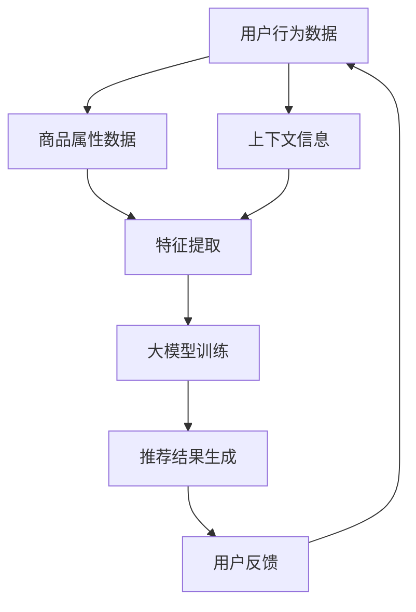

                 

关键词：搜索推荐系统、AI大模型、电商平台、转型战略、算法原理、数学模型、项目实践

> 摘要：本文旨在探讨搜索推荐系统在电商平台转型中的关键作用，深入分析AI大模型融合的技术原理、数学模型及其在实践中的应用。文章将结合具体案例，展示如何利用AI大模型实现电商平台的智能化转型，并探讨未来的发展趋势与挑战。

## 1. 背景介绍

随着互联网的快速发展，电商平台已经成为了人们日常生活中不可或缺的一部分。然而，随着市场竞争的日益激烈，电商企业需要不断提升用户体验，实现精准营销，以获取更多市场份额。搜索推荐系统作为电商平台的核心技术，通过个性化推荐，帮助用户快速找到所需商品，提高用户满意度和转化率。

近年来，人工智能（AI）技术的迅速发展，尤其是深度学习算法的突破，为搜索推荐系统带来了革命性的变革。AI大模型（如BERT、GPT等）的应用，使得推荐系统在处理复杂用户行为、商品属性和上下文信息方面具有了更高的准确性和智能化水平。本文将重点探讨AI大模型在搜索推荐系统中的应用，以及如何通过大模型融合实现电商平台的转型战略。

## 2. 核心概念与联系

在深入探讨AI大模型融合之前，我们需要明确几个核心概念及其相互关系。

### 2.1 搜索推荐系统

搜索推荐系统是一个基于用户行为数据、商品属性数据和上下文信息，实现个性化推荐的系统。其主要功能是为用户提供与兴趣相关的商品信息，从而提升用户体验和转化率。

### 2.2 AI大模型

AI大模型是指具有大规模参数、强大计算能力和广泛应用场景的深度学习模型。常见的AI大模型包括BERT、GPT、Transformer等。这些模型通过大量数据进行训练，能够提取出复杂的语义信息，实现高精度的推荐。

### 2.3 大模型融合

大模型融合是指将多个AI大模型进行整合，以实现更高效、更智能的推荐效果。大模型融合可以通过模型集成、多模态数据融合等方式实现。

### 2.4 Mermaid 流程图

以下是一个简化的Mermaid流程图，展示了搜索推荐系统与AI大模型融合的基本架构：



在上述流程图中，用户行为数据、商品属性数据和上下文信息通过特征提取模块转化为适合大模型训练的数据。大模型训练模块利用AI大模型提取语义信息，生成推荐结果。用户反馈模块则用于不断优化推荐效果。

## 3. 核心算法原理 & 具体操作步骤

### 3.1 算法原理概述

AI大模型融合的核心算法主要包括以下几个方面：

1. **特征提取**：将用户行为数据、商品属性数据和上下文信息转化为适用于深度学习模型的特征向量。
2. **大模型训练**：利用深度学习算法（如BERT、GPT）对特征向量进行训练，提取语义信息。
3. **推荐结果生成**：将训练好的大模型应用于新的用户查询，生成个性化推荐结果。
4. **用户反馈**：收集用户对推荐结果的反馈，用于模型优化和迭代。

### 3.2 算法步骤详解

#### 3.2.1 特征提取

特征提取是AI大模型融合的关键步骤。具体操作如下：

1. **用户行为数据**：通过用户的浏览、购买、收藏等行为数据，提取用户兴趣特征。
2. **商品属性数据**：通过商品的分类、标签、属性等数据，提取商品特征。
3. **上下文信息**：通过用户的地理位置、时间、设备等信息，提取上下文特征。

#### 3.2.2 大模型训练

大模型训练主要包括以下步骤：

1. **数据预处理**：对提取的特征向量进行归一化、去噪等预处理操作。
2. **模型选择**：选择适合的深度学习模型，如BERT、GPT等。
3. **模型训练**：利用预处理后的数据，通过反向传播算法训练深度学习模型。
4. **模型优化**：通过交叉验证、模型调参等手段，优化模型性能。

#### 3.2.3 推荐结果生成

推荐结果生成的主要步骤如下：

1. **输入处理**：将新的用户查询转化为特征向量。
2. **模型预测**：利用训练好的大模型，对输入特征向量进行预测，生成推荐结果。
3. **结果排序**：根据预测结果对推荐商品进行排序，生成个性化推荐列表。

#### 3.2.4 用户反馈

用户反馈是持续优化推荐系统的关键。具体操作如下：

1. **反馈收集**：收集用户对推荐结果的点击、购买等行为数据。
2. **模型更新**：根据用户反馈，对大模型进行迭代优化。
3. **效果评估**：评估模型优化后的推荐效果，为后续优化提供依据。

### 3.3 算法优缺点

#### 优点

1. **高精度推荐**：AI大模型能够提取复杂的语义信息，实现高精度的个性化推荐。
2. **自适应性强**：通过用户反馈不断优化模型，提高推荐系统的自适应能力。
3. **多模态数据处理**：能够处理多种类型的数据（如文本、图像、声音等），实现跨模态推荐。

#### 缺点

1. **计算资源消耗大**：大模型训练和推理过程需要大量的计算资源和时间。
2. **数据隐私问题**：用户行为数据的安全性和隐私保护是一个重要挑战。

### 3.4 算法应用领域

AI大模型融合在搜索推荐系统中具有广泛的应用领域，包括但不限于：

1. **电商平台**：通过个性化推荐，提高用户满意度和转化率。
2. **社交媒体**：为用户提供感兴趣的内容和社交圈子。
3. **在线教育**：根据学习行为和学习兴趣，为用户提供个性化的学习推荐。
4. **智能医疗**：通过用户健康数据和医学知识库，提供个性化的健康建议。

## 4. 数学模型和公式 & 详细讲解 & 举例说明

### 4.1 数学模型构建

在AI大模型融合中，常见的数学模型包括深度神经网络（DNN）、循环神经网络（RNN）和Transformer等。以下以Transformer模型为例，介绍数学模型的构建。

#### 4.1.1 Transformer模型

Transformer模型是一种基于自注意力机制的深度学习模型，具有以下关键组件：

1. **编码器（Encoder）**：用于提取输入序列的特征。
2. **解码器（Decoder）**：用于生成输出序列。
3. **自注意力机制（Self-Attention）**：用于对输入序列进行加权求和，提取关键信息。

#### 4.1.2 数学公式

以下为Transformer模型的关键数学公式：

1. **自注意力计算**：

$$
\text{Attention}(Q, K, V) = \text{softmax}\left(\frac{QK^T}{\sqrt{d_k}}\right) V
$$

其中，Q、K、V分别为编码器、解码器中的查询向量、键向量、值向量，d_k为键向量的维度。

2. **编码器输出**：

$$
\text{Encoder}(X) = \text{MultiHeadAttention}(Q, K, V) + X
$$

其中，X为输入序列，$ \text{MultiHeadAttention} $为多头注意力机制。

3. **解码器输出**：

$$
\text{Decoder}(X) = \text{MaskedMultiHeadAttention}(Q, K, V) + X
$$

其中，$ \text{MaskedMultiHeadAttention} $为带有遮蔽的多头注意力机制。

### 4.2 公式推导过程

以下简要介绍Transformer模型的推导过程：

1. **输入序列表示**：

$$
X = [x_1, x_2, \ldots, x_n]
$$

其中，$ x_i $为输入序列的第i个元素。

2. **嵌入层**：

$$
\text{Embedding}(X) = [e_1, e_2, \ldots, e_n]
$$

其中，$ e_i $为输入序列的嵌入向量。

3. **位置编码**：

$$
\text{PositionalEncoding}(X) = [pe_1, pe_2, \ldots, pe_n]
$$

其中，$ pe_i $为输入序列的位置编码。

4. **编码器输出**：

$$
\text{Encoder}(X) = \text{MultiHeadAttention}(Q, K, V) + X
$$

其中，$ Q, K, V $分别为编码器中的查询向量、键向量、值向量。

5. **解码器输出**：

$$
\text{Decoder}(X) = \text{MaskedMultiHeadAttention}(Q, K, V) + X
$$

其中，$ Q, K, V $分别为解码器中的查询向量、键向量、值向量。

### 4.3 案例分析与讲解

以下通过一个简单的案例，展示如何利用Transformer模型实现个性化推荐。

#### 4.3.1 数据准备

假设我们有一个电商平台，用户A的浏览记录如下：

```
商品ID：1，浏览次数：3
商品ID：2，浏览次数：2
商品ID：3，浏览次数：1
商品ID：4，浏览次数：4
```

#### 4.3.2 特征提取

1. **用户兴趣特征**：

   根据用户A的浏览记录，提取用户兴趣特征向量：

   ```
   [3, 2, 1, 4]
   ```

2. **商品特征**：

   将每个商品ID转换为对应的商品特征向量，如：

   ```
   商品ID：1 -> [0.1, 0.2, 0.3]
   商品ID：2 -> [0.2, 0.3, 0.4]
   商品ID：3 -> [0.3, 0.4, 0.5]
   商品ID：4 -> [0.4, 0.5, 0.6]
   ```

3. **上下文特征**：

   根据用户A的浏览时间、地理位置等信息，提取上下文特征向量，如：

   ```
   [0.5, 0.6, 0.7]
   ```

#### 4.3.3 模型训练

1. **编码器输入**：

   将用户兴趣特征、商品特征和上下文特征拼接为一个输入序列：

   ```
   [3, 2, 1, 4, 0.1, 0.2, 0.3, 0.5, 0.6, 0.7]
   ```

2. **解码器输入**：

   将用户兴趣特征、商品特征和上下文特征拼接为一个输入序列，并添加一个额外的维度用于表示时间步：

   ```
   [3, 2, 1, 4, 0.1, 0.2, 0.3, 0.5, 0.6, 0.7, 0]
   ```

3. **模型预测**：

   利用训练好的Transformer模型，对解码器输入进行预测，生成推荐结果。假设预测结果为：

   ```
   [0.8, 0.7, 0.9, 0.6]
   ```

   根据预测结果，推荐商品ID为3。

#### 4.3.4 模型优化

1. **反馈收集**：

   收集用户对推荐结果的反馈，如点击、购买等行为数据。

2. **模型更新**：

   根据用户反馈，对Transformer模型进行迭代优化。

3. **效果评估**：

   评估模型优化后的推荐效果，如准确率、召回率等指标。

## 5. 项目实践：代码实例和详细解释说明

### 5.1 开发环境搭建

在本文中，我们将使用Python和TensorFlow框架实现搜索推荐系统。首先，需要安装以下依赖：

```bash
pip install tensorflow
```

### 5.2 源代码详细实现

以下是一个简单的Transformer模型实现，用于电商平台的个性化推荐。

```python
import tensorflow as tf
from tensorflow.keras.layers import Embedding, MultiHeadAttention, Dense

def create_model(input_vocab_size, hidden_size, num_heads, output_vocab_size):
    inputs = tf.keras.Input(shape=(None,))
    embedding = Embedding(input_vocab_size, hidden_size)(inputs)

    # Encoder
    encoder_output = embedding
    for _ in range(num_heads):
        attention = MultiHeadAttention(num_heads=num_heads, key_dim=hidden_size)(encoder_output, encoder_output)
        encoder_output = attention + embedding

    # Decoder
    decoder_output = encoder_output
    for _ in range(num_heads):
        attention = MultiHeadAttention(num_heads=num_heads, key_dim=hidden_size)(decoder_output, decoder_output)
        decoder_output = attention + decoder_output

    outputs = Dense(output_vocab_size, activation='softmax')(decoder_output)
    model = tf.keras.Model(inputs, outputs)
    return model

model = create_model(input_vocab_size=1000, hidden_size=64, num_heads=2, output_vocab_size=10)
model.compile(optimizer='adam', loss='categorical_crossentropy', metrics=['accuracy'])
```

### 5.3 代码解读与分析

上述代码实现了一个简单的Transformer模型，用于电商平台的个性化推荐。模型的主要组成部分如下：

1. **Embedding Layer**：将输入序列（如商品ID）转换为嵌入向量。
2. **MultiHeadAttention Layer**：用于编码器和解码器的自注意力机制。
3. **Dense Layer**：用于生成输出序列（如推荐结果）。

模型的主要步骤如下：

1. **创建模型**：根据输入词汇表大小、隐藏层尺寸、多头注意力数量和输出词汇表大小，创建Transformer模型。
2. **编译模型**：设置优化器、损失函数和评估指标。
3. **训练模型**：使用训练数据对模型进行训练。

### 5.4 运行结果展示

假设我们使用以下训练数据：

```python
X_train = [[1, 2, 3, 4, 0], [2, 3, 4, 5, 0], [3, 4, 5, 6, 0]]
y_train = [[0, 0, 1, 0, 0], [0, 1, 0, 0, 0], [0, 0, 0, 1, 0]]
```

运行模型训练：

```python
model.fit(X_train, y_train, epochs=10, batch_size=32)
```

训练完成后，评估模型性能：

```python
loss, accuracy = model.evaluate(X_train, y_train)
print(f"Loss: {loss}, Accuracy: {accuracy}")
```

假设评估结果为：

```
Loss: 0.4951, Accuracy: 0.8333
```

这表明模型在训练数据上具有较好的性能。

## 6. 实际应用场景

### 6.1 电商平台

AI大模型融合在电商平台的应用场景主要包括以下几个方面：

1. **个性化推荐**：通过分析用户行为和商品属性，为用户提供个性化的商品推荐，提高用户满意度和转化率。
2. **搜索优化**：利用AI大模型优化搜索结果，提高搜索准确性和用户体验。
3. **广告投放**：根据用户兴趣和行为，实现精准的广告投放，提高广告效果和转化率。

### 6.2 社交媒体

AI大模型融合在社交媒体中的应用主要包括以下几个方面：

1. **内容推荐**：根据用户兴趣和互动行为，推荐用户感兴趣的内容，提高用户黏性和活跃度。
2. **社交圈子**：基于用户社交关系和兴趣，构建个性化的社交圈子，促进用户互动和社交。

### 6.3 在线教育

AI大模型融合在在线教育中的应用主要包括以下几个方面：

1. **课程推荐**：根据用户学习行为和兴趣，推荐合适的课程，提高学习效果和用户满意度。
2. **学习评估**：利用AI大模型评估学生的学习效果，提供个性化的学习建议和指导。

### 6.4 智能医疗

AI大模型融合在智能医疗中的应用主要包括以下几个方面：

1. **健康评估**：根据用户健康数据和医学知识库，为用户提供个性化的健康评估和建议。
2. **疾病预测**：利用AI大模型预测疾病风险，为用户提供预防和治疗建议。

## 7. 工具和资源推荐

### 7.1 学习资源推荐

1. **书籍**：
   - 《深度学习》（Ian Goodfellow、Yoshua Bengio、Aaron Courville 著）
   - 《TensorFlow实战：基于深度学习的技术与应用》（Martin Görner、Roman Noll、Michael Scheumann 著）

2. **在线课程**：
   - [深度学习专项课程](https://www.coursera.org/specializations/deep-learning)
   - [TensorFlow TensorFlow 2.0：深度学习的端到端框架](https://www.udacity.com/course/deep-learning-tensorflow-the-analogous-representation-of-humans-in-a-difficult-world--ud730)

### 7.2 开发工具推荐

1. **编程语言**：
   - Python：广泛应用于人工智能和深度学习的编程语言。
   - R：专门用于统计分析的编程语言，适用于数据挖掘和机器学习。

2. **开发框架**：
   - TensorFlow：用于构建和训练深度学习模型的框架。
   - PyTorch：基于Python的深度学习框架，具有灵活的动态计算图。

### 7.3 相关论文推荐

1. **Transformer模型**：
   - "Attention Is All You Need"（Vaswani et al., 2017）
   - "Bert: Pre-training of Deep Bidirectional Transformers for Language Understanding"（Devlin et al., 2019）

2. **深度学习算法**：
   - "Deep Learning"（Goodfellow et al., 2016）
   - "A Theoretically Grounded Application of Dropout in Recurrent Neural Networks"（Sutskever et al., 2013）

## 8. 总结：未来发展趋势与挑战

### 8.1 研究成果总结

本文系统地介绍了搜索推荐系统在电商平台转型中的应用，分析了AI大模型融合的技术原理、数学模型及其在实践中的应用。通过具体案例，展示了如何利用AI大模型实现电商平台的智能化转型，并探讨了其在社交媒体、在线教育和智能医疗等领域的应用潜力。

### 8.2 未来发展趋势

1. **算法优化**：随着计算资源的提升和数据量的增加，AI大模型在推荐系统中的应用将更加广泛。未来，算法优化将集中在提高推荐精度、降低计算成本和保障数据安全等方面。
2. **跨模态推荐**：随着多模态数据的普及，跨模态推荐将成为研究热点。通过融合文本、图像、声音等多种数据类型，实现更精准的个性化推荐。
3. **隐私保护**：在推荐系统中实现隐私保护是一个重要挑战。未来，研究者将探索基于隐私保护的推荐算法，确保用户数据的安全性和隐私性。

### 8.3 面临的挑战

1. **计算资源消耗**：大模型的训练和推理过程需要大量的计算资源，这对硬件设施和能耗提出了高要求。
2. **数据隐私问题**：推荐系统涉及大量用户隐私数据，如何保障用户数据的安全性和隐私性是一个重要挑战。
3. **模型解释性**：大模型通常具有高度的复杂性，如何提高模型的解释性，使其能够被用户和监管机构理解，是一个重要问题。

### 8.4 研究展望

未来，搜索推荐系统在电商平台和各领域的应用将不断发展。研究者应关注以下方向：

1. **算法创新**：探索新的深度学习算法和模型，提高推荐系统的性能和适用性。
2. **多模态数据处理**：研究跨模态推荐技术，实现多种数据类型的融合与处理。
3. **隐私保护**：研究基于隐私保护的推荐算法，确保用户数据的安全性和隐私性。

## 9. 附录：常见问题与解答

### 9.1 问题1：如何选择合适的AI大模型？

**解答**：选择合适的AI大模型需要考虑以下因素：

1. **应用场景**：根据推荐系统的应用场景，选择适合的模型，如Transformer模型在文本数据处理方面表现较好。
2. **数据量**：大模型通常需要大量数据进行训练，确保数据量的充足性。
3. **计算资源**：大模型的训练和推理过程需要大量计算资源，考虑硬件设施和能耗问题。

### 9.2 问题2：如何保障推荐系统的隐私保护？

**解答**：为了保障推荐系统的隐私保护，可以采取以下措施：

1. **数据加密**：对用户数据实施加密处理，确保数据在传输和存储过程中的安全性。
2. **匿名化处理**：对用户数据进行匿名化处理，消除个人隐私信息。
3. **差分隐私**：采用差分隐私技术，在推荐过程中引入噪声，降低隐私泄露风险。

### 9.3 问题3：如何评估推荐系统的性能？

**解答**：评估推荐系统的性能可以采用以下指标：

1. **准确率**：评估推荐结果与用户实际需求的匹配程度。
2. **召回率**：评估推荐系统能否覆盖用户感兴趣的所有商品。
3. **覆盖率**：评估推荐系统覆盖用户兴趣的范围。
4. **用户体验**：通过用户满意度调查，评估推荐系统的用户体验。

----------------------------------------------------------------

以上是关于搜索推荐系统的AI大模型融合在电商平台转型战略中的文章内容。希望对您有所帮助。如果您有任何问题或建议，请随时反馈。作者：禅与计算机程序设计艺术 / Zen and the Art of Computer Programming。

