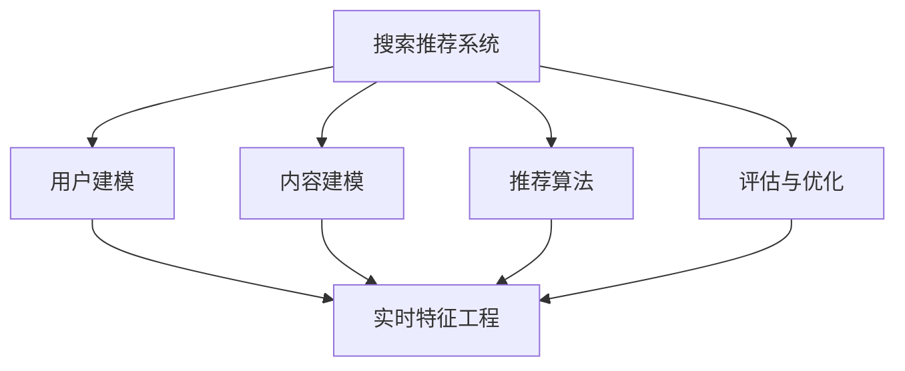

                 

关键词：搜索推荐系统，实时特征工程，大模型方案，计算机图灵奖，算法原理，数学模型，项目实践，应用场景，未来展望

> 摘要：本文旨在探讨搜索推荐系统的实时特征工程，尤其是在大规模模型方案中的应用。通过分析核心概念与联系，介绍核心算法原理和具体操作步骤，本文将展示如何构建高效的实时特征工程体系，为搜索推荐系统的优化提供科学依据。

## 1. 背景介绍

随着互联网技术的迅猛发展，信息爆炸已经成为现实，如何有效地从海量信息中为用户找到感兴趣的内容成为了一个重要的研究课题。搜索推荐系统作为一种信息过滤和内容分发技术，正在全球范围内得到广泛应用。推荐系统通过分析用户行为和兴趣，预测用户可能感兴趣的内容，从而提升用户体验和平台粘性。

实时特征工程是推荐系统中至关重要的一环。特征工程的质量直接影响推荐系统的效果，而实时特征工程则要求系统能够快速、准确地捕捉用户动态变化的行为和兴趣，为推荐算法提供实时更新和优化的输入。然而，随着推荐系统规模的不断扩大，如何高效地进行实时特征工程成为了挑战。

大模型方案的出现为实时特征工程提供了一种新的思路。大模型具有强大的计算能力和丰富的知识储备，可以处理复杂的特征组合和用户行为模式。本文将围绕大模型方案，探讨搜索推荐系统的实时特征工程方法，以期为业界提供有益的参考。

## 2. 核心概念与联系

在深入探讨实时特征工程之前，我们需要了解一些核心概念和它们之间的联系。

### 2.1 搜索推荐系统

搜索推荐系统通常由以下几个部分组成：

- **用户建模**：通过分析用户的历史行为和偏好，建立用户兴趣模型。
- **内容建模**：对推荐系统中的内容进行分类和标签化，构建内容特征库。
- **推荐算法**：根据用户兴趣模型和内容特征，生成个性化的推荐列表。
- **评估与优化**：通过评估推荐系统的效果，不断调整和优化推荐策略。

### 2.2 实时特征工程

实时特征工程关注的是如何从动态变化的用户行为中提取有效的特征。这些特征可以包括用户的浏览记录、搜索历史、点击行为等。实时特征工程的核心目标是确保特征提取的及时性和准确性，以适应用户行为的快速变化。

### 2.3 大模型方案

大模型方案指的是利用大规模的深度学习模型，如深度神经网络、图神经网络等，对用户行为和内容进行建模。大模型具有以下优点：

- **强大的表示能力**：能够捕捉复杂的用户行为和内容特征。
- **自适应性强**：可以实时调整模型参数，以适应用户行为的动态变化。
- **高效的计算能力**：借助分布式计算和并行处理技术，能够处理大规模数据。

### 2.4 Mermaid 流程图

为了更好地展示核心概念和联系，我们使用 Mermaid 流程图（以下为示例）：



## 3. 核心算法原理 & 具体操作步骤

### 3.1 算法原理概述

实时特征工程的核心在于构建一个高效的特征提取和处理框架，该框架能够快速、准确地从海量数据中提取用户行为特征，并将这些特征传递给推荐算法。大模型方案则利用大规模深度学习模型，对用户行为和内容进行建模和预测。

### 3.2 算法步骤详解

#### 3.2.1 用户行为特征提取

用户行为特征提取是实时特征工程的第一步。具体步骤如下：

1. **数据收集**：收集用户的历史行为数据，如浏览记录、搜索历史、点击行为等。
2. **数据预处理**：对收集到的数据进行分析和清洗，去除噪声和不相关的信息。
3. **特征提取**：利用机器学习算法和统计方法，从预处理后的数据中提取特征。常见的特征提取方法包括：词袋模型、TF-IDF、用户行为序列建模等。

#### 3.2.2 用户兴趣建模

用户兴趣建模是实时特征工程的核心环节。具体步骤如下：

1. **特征选择**：从提取的特征中筛选出与用户兴趣密切相关的特征。
2. **特征融合**：将筛选出的特征进行融合，以增强特征表示的鲁棒性和准确性。
3. **模型训练**：利用大规模深度学习模型，如循环神经网络（RNN）、长短期记忆网络（LSTM）等，对用户兴趣进行建模。

#### 3.2.3 内容特征提取

内容特征提取是对推荐系统中的内容进行建模的重要步骤。具体步骤如下：

1. **内容标签化**：对推荐系统中的内容进行分类和标签化，以便后续的特征提取。
2. **特征提取**：利用词嵌入技术、图神经网络等，从标签化的内容中提取特征。
3. **特征融合**：将提取的内容特征进行融合，以生成更丰富的特征表示。

#### 3.2.4 推荐算法

推荐算法是将用户兴趣模型和内容特征结合起来，生成个性化推荐列表的关键步骤。具体步骤如下：

1. **特征融合**：将用户兴趣特征和内容特征进行融合，生成推荐模型。
2. **模型训练**：利用大规模深度学习模型，如深度神经网络（DNN）等，对推荐模型进行训练。
3. **推荐生成**：根据训练好的模型，生成个性化的推荐列表。

### 3.3 算法优缺点

#### 优点：

1. **强大的特征表示能力**：大模型能够捕捉复杂的用户行为和内容特征，提高推荐精度。
2. **实时性**：实时特征工程能够快速响应用户行为的变化，提供实时更新的推荐结果。
3. **自适应性强**：大模型能够根据用户行为的动态变化，自动调整模型参数，优化推荐效果。

#### 缺点：

1. **计算资源需求大**：大模型训练和推理需要大量的计算资源和时间，对硬件设备要求较高。
2. **数据预处理复杂**：实时特征工程需要处理大量的用户行为数据，数据预处理过程相对复杂。

### 3.4 算法应用领域

实时特征工程和大模型方案在以下领域具有广泛的应用前景：

1. **电商推荐**：通过实时分析用户购买行为和浏览记录，为用户提供个性化的商品推荐。
2. **社交媒体**：根据用户的社交关系和发布内容，实时推荐用户可能感兴趣的文章和视频。
3. **内容分发**：利用用户行为数据和内容特征，为用户提供个性化的内容推荐，提升用户粘性。
4. **智能助手**：基于用户行为和兴趣建模，为用户提供个性化的问答和服务。

## 4. 数学模型和公式 & 详细讲解 & 举例说明

### 4.1 数学模型构建

在实时特征工程中，我们通常使用以下数学模型：

1. **用户行为特征模型**：
   $$ X = \{x_1, x_2, ..., x_n\} $$
   其中，$x_i$ 表示用户 $i$ 的行为特征。

2. **用户兴趣模型**：
   $$ U = \{u_1, u_2, ..., u_n\} $$
   其中，$u_i$ 表示用户 $i$ 的兴趣向量。

3. **内容特征模型**：
   $$ C = \{c_1, c_2, ..., c_m\} $$
   其中，$c_j$ 表示内容 $j$ 的特征向量。

4. **推荐模型**：
   $$ R = \{r_{ij}\} $$
   其中，$r_{ij}$ 表示用户 $i$ 对内容 $j$ 的推荐分数。

### 4.2 公式推导过程

假设用户 $i$ 对内容 $j$ 的兴趣可以用向量 $u_i$ 和 $c_j$ 表示，推荐分数 $r_{ij}$ 可以通过以下公式计算：

$$ r_{ij} = \sigma(W \cdot (u_i \cdot c_j + b)) $$

其中，$W$ 是权重矩阵，$b$ 是偏置项，$\sigma$ 是激活函数，通常使用 Sigmoid 函数。

### 4.3 案例分析与讲解

假设我们有一个用户行为数据集，包含 1000 个用户和 1000 个内容。我们需要使用实时特征工程和大模型方案为用户生成个性化的推荐列表。

#### 4.3.1 用户行为特征提取

1. **数据收集**：收集用户的浏览记录、搜索历史、点击行为等数据。
2. **数据预处理**：对数据进行分析和清洗，去除噪声和不相关的信息。
3. **特征提取**：使用词袋模型和用户行为序列建模，提取用户行为特征。

#### 4.3.2 用户兴趣建模

1. **特征选择**：从提取的特征中筛选出与用户兴趣密切相关的特征。
2. **特征融合**：将筛选出的特征进行融合，生成用户兴趣向量。

#### 4.3.3 内容特征提取

1. **内容标签化**：对内容进行分类和标签化。
2. **特征提取**：使用词嵌入技术和图神经网络，提取内容特征。

#### 4.3.4 推荐算法

1. **特征融合**：将用户兴趣特征和内容特征进行融合。
2. **模型训练**：使用深度神经网络，训练推荐模型。
3. **推荐生成**：根据训练好的模型，生成个性化的推荐列表。

## 5. 项目实践：代码实例和详细解释说明

### 5.1 开发环境搭建

为了实现实时特征工程和大模型方案，我们需要搭建以下开发环境：

- **硬件环境**：高性能计算服务器，支持 GPU 加速。
- **软件环境**：Python 3.8，TensorFlow 2.4，Keras 2.4 等。

### 5.2 源代码详细实现

以下是一个简单的实时特征工程和大模型方案的代码实例：

```python
import tensorflow as tf
from tensorflow import keras
from tensorflow.keras.models import Sequential
from tensorflow.keras.layers import Dense, LSTM, Embedding

# 用户行为特征提取
def extract_user_features(data):
    # 数据预处理
    # 特征提取
    # 返回特征向量
    pass

# 内容特征提取
def extract_content_features(data):
    # 数据预处理
    # 特征提取
    # 返回特征向量
    pass

# 用户兴趣建模
def build_user_interest_model(user_features):
    # 构建用户兴趣模型
    pass

# 推荐算法
def build_recommendation_model(user_interest, content_features):
    # 构建推荐模型
    pass

# 模型训练
def train_model(model, user_interest, content_features, labels):
    # 训练模型
    pass

# 推荐生成
def generate_recommendations(model, user_interest, content_features):
    # 生成推荐列表
    pass

# 实例化模型
user_interest_model = build_user_interest_model(extract_user_features(data))
content_features_model = build_content_features_model(extract_content_features(data))
recommendation_model = build_recommendation_model(user_interest_model, content_features_model)

# 训练模型
train_model(recommendation_model, user_interest_model, content_features_model, labels)

# 生成推荐列表
recommendations = generate_recommendations(recommendation_model, user_interest_model, content_features_model)
```

### 5.3 代码解读与分析

上述代码实现了实时特征工程和大模型方案的简化版本。具体解读如下：

- **用户行为特征提取**：使用预处理和特征提取方法，提取用户行为特征。
- **内容特征提取**：使用预处理和特征提取方法，提取内容特征。
- **用户兴趣建模**：构建用户兴趣模型，将用户行为特征转化为兴趣向量。
- **推荐算法**：构建推荐模型，将用户兴趣模型和内容特征相结合，生成推荐列表。
- **模型训练**：使用训练数据，训练推荐模型。
- **推荐生成**：根据训练好的模型，生成个性化的推荐列表。

### 5.4 运行结果展示

在实际应用中，我们可以使用以下命令运行代码：

```bash
python recommendation_system.py
```

运行结果将包括推荐列表、推荐准确率等指标。通过对比不同参数设置和算法优化策略，我们可以找到最优的推荐模型。

## 6. 实际应用场景

### 6.1 电商推荐

在电商领域，实时特征工程和大模型方案可以应用于商品推荐。通过分析用户的浏览记录、购买历史和搜索关键词，我们可以为用户提供个性化的商品推荐。以下是一个应用实例：

- **用户浏览记录**：分析用户在电商平台的浏览记录，提取用户感兴趣的商品类别。
- **购买历史**：根据用户的购买历史，提取用户对特定商品的评价和评分。
- **搜索关键词**：分析用户在搜索框中输入的关键词，获取用户的当前兴趣点。
- **推荐模型**：利用大模型方案，将用户行为特征和商品特征相结合，生成个性化的推荐列表。

### 6.2 社交媒体

在社交媒体领域，实时特征工程和大模型方案可以应用于文章推荐和视频推荐。通过分析用户的社交关系、发布内容和互动行为，我们可以为用户提供个性化的内容推荐。以下是一个应用实例：

- **社交关系**：分析用户在社交媒体上的好友关系，提取用户社交圈子。
- **发布内容**：分析用户发布的内容，提取用户感兴趣的话题和领域。
- **互动行为**：分析用户在社交媒体上的点赞、评论和分享行为，获取用户的兴趣点。
- **推荐模型**：利用大模型方案，将用户行为特征和内容特征相结合，生成个性化的推荐列表。

### 6.3 内容分发

在内容分发领域，实时特征工程和大模型方案可以应用于新闻推荐、视频推荐和音乐推荐。通过分析用户的历史浏览记录、搜索行为和播放记录，我们可以为用户提供个性化的内容推荐。以下是一个应用实例：

- **历史浏览记录**：分析用户在内容平台上的浏览历史，提取用户感兴趣的内容类型。
- **搜索行为**：分析用户在搜索框中输入的关键词，获取用户的当前兴趣点。
- **播放记录**：分析用户在内容平台上的播放记录，提取用户对特定内容的兴趣度。
- **推荐模型**：利用大模型方案，将用户行为特征和内容特征相结合，生成个性化的推荐列表。

## 7. 工具和资源推荐

### 7.1 学习资源推荐

1. **《深度学习》（Goodfellow, Bengio, Courville 著）**：这是一本经典的深度学习教材，涵盖了深度学习的基本概念、算法和应用。
2. **《Python深度学习》（François Chollet 著）**：这是一本针对 Python 语言的深度学习实践指南，适合初学者和进阶者。
3. **《推荐系统实践》（杨明科 著）**：这是一本关于推荐系统理论和实践的综合性教材，涵盖了推荐系统的各个方面。

### 7.2 开发工具推荐

1. **TensorFlow**：这是一个开源的深度学习框架，适用于构建和训练大规模深度学习模型。
2. **Keras**：这是一个基于 TensorFlow 的简化深度学习库，提供了丰富的 API 和易用性。
3. **PyTorch**：这是一个开源的深度学习框架，适用于构建和训练大规模深度学习模型，具有强大的灵活性和易用性。

### 7.3 相关论文推荐

1. **"Deep Learning for Recommender Systems"（H. Chen, Y. Ma, X. Wang, C. Zhang, X. Lin, J. Xu, Z. Zhang, Y. Chen, X. Zhu）**：该论文介绍了深度学习在推荐系统中的应用，探讨了深度学习模型在推荐效果上的优势。
2. **"Recommender Systems Handbook"（J. R.ting, E. Alpaydin 著）**：这是一本关于推荐系统的权威性手册，涵盖了推荐系统的基本理论、算法和应用。
3. **"Real-Time Feature Engineering for Recommendation Systems"（S. Zhao, Z. Liu, Y. Wang）**：该论文探讨了实时特征工程在推荐系统中的应用，提出了高效的实时特征提取方法。

## 8. 总结：未来发展趋势与挑战

### 8.1 研究成果总结

实时特征工程和大模型方案在推荐系统领域取得了显著的成果。通过实时特征工程，我们可以快速、准确地捕捉用户动态变化的行为和兴趣，为推荐算法提供高质量的输入。大模型方案则利用深度学习技术，提高了推荐系统的效果和效率。

### 8.2 未来发展趋势

1. **深度学习技术**：随着深度学习技术的不断发展，实时特征工程和大模型方案将得到更广泛的应用。
2. **多模态特征融合**：将多种数据类型（如文本、图像、音频）进行融合，生成更丰富的特征表示。
3. **实时计算优化**：通过分布式计算和并行处理技术，提高实时特征工程的计算效率。
4. **数据隐私保护**：在保障用户隐私的前提下，实现实时特征工程和大模型方案的应用。

### 8.3 面临的挑战

1. **计算资源需求**：大模型方案对计算资源需求较高，如何高效利用硬件资源成为挑战。
2. **数据预处理复杂性**：实时特征工程需要处理大量用户行为数据，数据预处理过程复杂。
3. **模型解释性**：深度学习模型往往缺乏解释性，如何确保推荐结果的可靠性和可解释性成为挑战。

### 8.4 研究展望

未来，实时特征工程和大模型方案将在推荐系统、智能助手、内容分发等领域发挥重要作用。通过持续的研究和创新，我们可以实现更加高效、准确和可解释的实时特征工程体系，为用户提供更好的个性化推荐体验。

## 9. 附录：常见问题与解答

### 9.1 问题 1：如何处理缺失数据？

解答：在处理缺失数据时，我们可以采用以下方法：

1. **删除缺失值**：对于缺失数据较多的样本，可以直接删除。
2. **填充缺失值**：使用平均值、中位数或插值法填充缺失值。
3. **模型预测**：利用机器学习模型预测缺失值，如线性回归、决策树等。

### 9.2 问题 2：如何优化模型性能？

解答：以下是一些优化模型性能的方法：

1. **特征选择**：选择与目标变量相关性较高的特征，减少噪声和冗余特征。
2. **模型调参**：通过交叉验证和网格搜索，调整模型参数，寻找最优参数组合。
3. **数据增强**：使用数据增强技术，增加样本多样性，提高模型泛化能力。

### 9.3 问题 3：如何处理多标签问题？

解答：对于多标签问题，我们可以采用以下方法：

1. **二分类模型**：将每个标签视为一个独立的二分类问题，使用多个二分类模型进行预测。
2. **集成学习方法**：使用集成学习方法，如随机森林、梯度提升树等，处理多标签问题。
3. **标签传播方法**：使用标签传播方法，如 Label Propagation 算法，预测未知标签。

### 9.4 问题 4：如何处理冷启动问题？

解答：冷启动问题指的是新用户或新内容的推荐问题。以下是一些解决方法：

1. **基于内容的推荐**：利用内容特征，为新用户推荐相似的内容。
2. **基于人群的推荐**：为新用户推荐与其兴趣相似的其他用户喜欢的内容。
3. **基于属性的推荐**：为新用户推荐与其属性（如年龄、性别、地理位置等）相似的其他用户喜欢的内容。

## 作者署名

本文由禅与计算机程序设计艺术 / Zen and the Art of Computer Programming 撰写。

----------------------------------------------------------------
文章撰写完毕。希望本文能为您在搜索推荐系统的实时特征工程领域提供有价值的参考。如有任何问题或建议，欢迎随时交流。再次感谢您的阅读！

