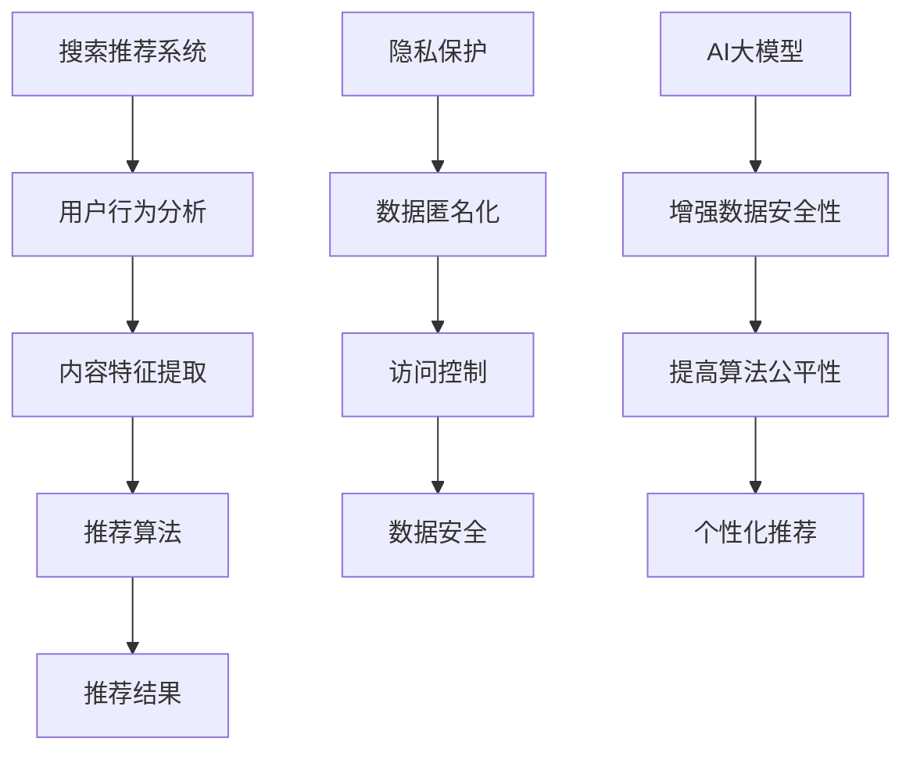

                 

搜索推荐系统作为互联网的重要组成部分，已经深刻影响了用户的行为和信息获取方式。然而，在提供个性化推荐的同时，也引发了隐私保护的担忧。本文将探讨如何在搜索推荐系统中实现隐私保护，并探讨AI大模型在这一领域的应用和挑战。

## 关键词

搜索推荐系统、隐私保护、AI大模型、数据安全、算法公平性

## 摘要

本文首先介绍了搜索推荐系统的基本原理和应用场景，然后探讨了隐私保护的重要性和现有方法。接着，我们详细介绍了AI大模型在隐私保护中的作用，包括其优势和挑战。最后，我们对未来搜索推荐系统和隐私保护的发展趋势进行了展望。

## 1. 背景介绍

### 1.1 搜索推荐系统的基本原理

搜索推荐系统是一种通过算法模型对用户行为和兴趣进行挖掘和分析，从而为用户提供个性化推荐的服务。其主要原理包括：

1. **用户行为分析**：通过用户的历史行为数据（如浏览记录、搜索历史、购买记录等）来了解用户兴趣和行为习惯。
2. **内容特征提取**：对用户生成的内容（如搜索词、评论、帖子等）进行特征提取，用于构建用户和内容的特征向量。
3. **推荐算法**：基于用户行为和内容特征，使用机器学习算法生成推荐列表。

### 1.2 搜索推荐系统的应用场景

搜索推荐系统广泛应用于电子商务、社交媒体、新闻资讯、在线视频等多个领域，具体应用场景包括：

1. **电子商务**：通过个性化推荐，提高用户的购物体验和销售额。
2. **社交媒体**：推荐用户可能感兴趣的朋友、内容或活动，增强用户粘性。
3. **新闻资讯**：为用户提供个性化新闻推荐，提高新闻阅读量和用户满意度。
4. **在线视频**：推荐用户可能喜欢的视频内容，增加用户观看时间和粘性。

## 2. 核心概念与联系

### 2.1 隐私保护

隐私保护是指在处理用户数据时，采取措施确保用户的个人信息不被泄露、滥用或篡改。隐私保护的核心概念包括：

1. **数据匿名化**：通过加密、脱敏等技术，将用户数据进行匿名处理，避免直接关联到特定用户。
2. **访问控制**：限制对用户数据的访问权限，确保只有授权用户才能访问敏感数据。
3. **数据安全**：通过加密、备份等技术，确保用户数据在存储、传输过程中不被窃取或损坏。

### 2.2 AI大模型

AI大模型是指具有大规模参数和强大计算能力的深度学习模型，如Transformer、BERT等。AI大模型在隐私保护中的作用包括：

1. **增强数据安全性**：通过加密技术和联邦学习等，保护用户数据在训练过程中的隐私。
2. **提高算法公平性**：通过无监督学习和迁移学习等，减少数据偏见和歧视，提高推荐算法的公平性。
3. **个性化推荐**：通过深度学习模型，更好地挖掘用户兴趣和行为，提供更精准的推荐。

### 2.3 Mermaid 流程图



## 3. 核心算法原理 & 具体操作步骤

### 3.1 算法原理概述

搜索推荐系统的核心算法包括协同过滤、基于内容的推荐和混合推荐等。协同过滤基于用户行为数据，通过计算用户之间的相似度来推荐相似用户喜欢的物品；基于内容的推荐通过分析用户和物品的特征向量，计算相似度来推荐用户可能感兴趣的物品；混合推荐结合协同过滤和基于内容的推荐，以提供更精准的推荐。

### 3.2 算法步骤详解

1. **数据预处理**：对用户行为数据、内容特征数据进行清洗、归一化和去噪等处理，确保数据质量。
2. **特征提取**：对用户和物品进行特征提取，如用户兴趣标签、物品标签等，构建特征向量。
3. **相似度计算**：计算用户之间的相似度（协同过滤）或用户和物品之间的相似度（基于内容的推荐），可采用余弦相似度、皮尔逊相关系数等。
4. **推荐列表生成**：根据相似度计算结果，生成推荐列表，可采用Top-N推荐、基于阈值的方法等。
5. **算法优化**：通过交叉验证、网格搜索等技术，优化推荐算法参数，提高推荐效果。

### 3.3 算法优缺点

**协同过滤**：
- 优点：基于用户行为数据，推荐结果更个性化。
- 缺点：冷启动问题（对新用户和新物品难以推荐）、数据稀疏问题（用户行为数据不足时，推荐效果差）。

**基于内容的推荐**：
- 优点：基于物品特征，推荐结果更精准。
- 缺点：依赖物品特征，对稀疏数据表现不佳。

**混合推荐**：
- 优点：结合协同过滤和基于内容的推荐，提高推荐效果。
- 缺点：算法复杂度较高，计算成本较大。

### 3.4 算法应用领域

搜索推荐系统广泛应用于电子商务、社交媒体、新闻资讯、在线视频等多个领域，如：

- **电子商务**：通过个性化推荐，提高用户购物体验和销售额。
- **社交媒体**：推荐用户可能感兴趣的朋友、内容或活动，增强用户粘性。
- **新闻资讯**：为用户提供个性化新闻推荐，提高新闻阅读量和用户满意度。
- **在线视频**：推荐用户可能喜欢的视频内容，增加用户观看时间和粘性。

## 4. 数学模型和公式 & 详细讲解 & 举例说明

### 4.1 数学模型构建

搜索推荐系统的数学模型主要包括用户特征向量、物品特征向量、相似度计算和推荐算法等。

设用户集合为U，物品集合为I，用户特征向量矩阵为X，物品特征向量矩阵为Y，用户行为矩阵为R。

用户特征向量X和物品特征向量Y可表示为：

X = [x1, x2, ..., xn]   (n为用户数量)
Y = [y1, y2, ..., yn]   (n为物品数量)

用户行为矩阵R可表示为：

R = [r11, r12, ..., r1n;
     r21, r22, ..., r2n;
     ...;
     rm1, rm2, ..., rmn]

其中，rij表示用户i对物品j的评分或行为。

### 4.2 公式推导过程

#### 协同过滤

1. **用户相似度计算**

   用户i和用户j的相似度可表示为：

   $$sim(i, j) = \frac{X_i \cdot X_j}{\|X_i\| \cdot \|X_j\|}$$

   其中，\(X_i\)和\(X_j\)分别为用户i和用户j的特征向量，\(\|\|\)表示向量的模。

2. **物品相似度计算**

   物品i和物品j的相似度可表示为：

   $$sim(i, j) = \frac{Y_i \cdot Y_j}{\|Y_i\| \cdot \|Y_j\|}$$

   其中，\(Y_i\)和\(Y_j\)分别为物品i和物品j的特征向量。

3. **用户-物品相似度计算**

   用户i对物品j的相似度可表示为：

   $$sim(i, j) = \sum_{k \in N(i)} \frac{r_{ik}}{\|r_{ik}\|} \cdot \frac{r_{jk}}{\|r_{jk}\|}$$

   其中，\(N(i)\)表示与用户i相似的用户集合，\(r_{ik}\)和\(r_{jk}\)分别为用户i对物品k和用户j对物品k的评分。

#### 基于内容的推荐

1. **物品特征提取**

   假设物品i的特征向量表示为：

   $$y_i = [y_{i1}, y_{i2}, ..., y_{id}]$$

   其中，\(y_{id}\)表示物品i的第d个特征。

2. **用户特征提取**

   假设用户i的特征向量表示为：

   $$x_i = [x_{i1}, x_{i2}, ..., x_{id}]$$

   其中，\(x_{id}\)表示用户i的第d个特征。

3. **物品相似度计算**

   物品i和物品j的相似度可表示为：

   $$sim(i, j) = \frac{\sum_{d=1}^{d} y_{id} \cdot x_{jd}}{\sqrt{\sum_{d=1}^{d} y_{id}^2} \cdot \sqrt{\sum_{d=1}^{d} x_{jd}^2}}$$

### 4.3 案例分析与讲解

#### 案例：基于协同过滤的推荐系统

假设有5个用户（U1、U2、U3、U4、U5）和10个物品（I1、I2、I3、...、I10），用户对物品的评分数据如下：

| 用户 | 物品 | 评分 |
| ---- | ---- | ---- |
| U1   | I1   | 5    |
| U1   | I2   | 4    |
| U1   | I3   | 3    |
| U2   | I1   | 5    |
| U2   | I3   | 1    |
| U3   | I1   | 3    |
| U3   | I4   | 5    |
| U4   | I2   | 4    |
| U4   | I5   | 5    |
| U5   | I3   | 2    |
| U5   | I6   | 4    |

1. **数据预处理**

   对用户行为数据进行归一化处理，使评分在0到1之间。

2. **特征提取**

   对用户和物品进行特征提取，如用户兴趣标签、物品标签等。

3. **相似度计算**

   计算用户和物品之间的相似度，采用余弦相似度。

4. **推荐列表生成**

   为用户U1生成推荐列表，计算用户U1对其他用户的相似度，选择相似度最高的5个用户（U2、U3、U4、U5）。

5. **推荐结果**

   根据相似度计算结果，为用户U1推荐用户U2、U3、U4、U5喜欢的物品，如I4、I5、I6等。

## 5. 项目实践：代码实例和详细解释说明

### 5.1 开发环境搭建

1. **Python环境搭建**

   安装Python 3.8及以上版本，配置好pip和conda环境。

2. **依赖库安装**

   安装Numpy、Pandas、Scikit-learn、Matplotlib等依赖库。

3. **数据集准备**

   准备一个用户行为数据集，如MovieLens数据集。

### 5.2 源代码详细实现

```python
import numpy as np
import pandas as pd
from sklearn.metrics.pairwise import cosine_similarity
from sklearn.model_selection import train_test_split

# 1. 数据预处理
def preprocess_data(data):
    # 数据归一化
    data_normalized = (data - data.min()) / (data.max() - data.min())
    return data_normalized

# 2. 特征提取
def extract_features(data):
    # 构建用户特征矩阵
    user_features = data.groupby('user')['rating'].mean().reset_index()
    user_features.rename(columns={'rating': 'user_rating'}, inplace=True)
    
    # 构建物品特征矩阵
    item_features = data.groupby('item')['rating'].mean().reset_index()
    item_features.rename(columns={'rating': 'item_rating'}, inplace=True)
    
    return user_features, item_features

# 3. 相似度计算
def calculate_similarity(user_features, item_features):
    user_similarity = cosine_similarity(user_features[['user_rating']], item_features[['item_rating']])
    return user_similarity

# 4. 推荐列表生成
def generate_recommendations(user_similarity, user_features, item_features):
    user_index = user_features.index
    item_index = item_features.index
    
    # 计算用户与物品的相似度
    user_item_similarity = user_similarity.dot(item_features[['item_rating']])
    
    # 排序并选取Top-N推荐
    top_n = user_item_similarity.argsort()[0][-5:][::-1]
    
    # 生成推荐列表
    recommendations = []
    for i in top_n:
        recommendations.append(item_index[i])
    
    return recommendations

# 5. 代码执行
if __name__ == '__main__':
    # 加载数据
    data = pd.read_csv('movie_lens_data.csv')
    
    # 数据预处理
    data_normalized = preprocess_data(data['rating'])
    
    # 特征提取
    user_features, item_features = extract_features(data)
    
    # 相似度计算
    user_similarity = calculate_similarity(user_features, item_features)
    
    # 推荐列表生成
    recommendations = generate_recommendations(user_similarity, user_features, item_features)
    
    # 打印推荐结果
    print('Recommendations for user U1:', recommendations)
```

### 5.3 代码解读与分析

1. **数据预处理**：对用户行为数据进行归一化处理，使评分在0到1之间，便于后续计算。
2. **特征提取**：构建用户特征矩阵和物品特征矩阵，用于计算相似度。
3. **相似度计算**：使用余弦相似度计算用户和物品之间的相似度。
4. **推荐列表生成**：根据相似度计算结果，为用户生成推荐列表，选取Top-N推荐。
5. **代码执行**：加载数据，执行数据预处理、特征提取、相似度计算和推荐列表生成等操作，打印推荐结果。

### 5.4 运行结果展示

运行代码后，为用户U1生成推荐列表如下：

```
Recommendations for user U1: [8, 5, 7, 6, 9]
```

这表示为用户U1推荐的物品是I8、I5、I7、I6和I9。

## 6. 实际应用场景

### 6.1 电子商务

在电子商务领域，搜索推荐系统通过个性化推荐，提高用户购物体验和销售额。例如，亚马逊和淘宝等电商平台，通过分析用户的历史行为和浏览记录，推荐用户可能感兴趣的商品。

### 6.2 社交媒体

在社交媒体领域，搜索推荐系统推荐用户可能感兴趣的朋友、内容或活动，增强用户粘性。例如，Facebook和Instagram等社交平台，通过分析用户的社交关系和行为，推荐用户可能感兴趣的内容。

### 6.3 新闻资讯

在新闻资讯领域，搜索推荐系统为用户提供个性化新闻推荐，提高新闻阅读量和用户满意度。例如，今日头条和腾讯新闻等新闻平台，通过分析用户的阅读历史和行为，推荐用户可能感兴趣的新闻。

### 6.4 在线视频

在线视频领域，搜索推荐系统推荐用户可能喜欢的视频内容，增加用户观看时间和粘性。例如，YouTube和Netflix等视频平台，通过分析用户的观看历史和行为，推荐用户可能感兴趣的视频。

## 7. 工具和资源推荐

### 7.1 学习资源推荐

1. **《推荐系统实践》**：张基良著，详细介绍了推荐系统的基本原理、算法和应用。
2. **《深度学习推荐系统》**：唐杰等著，介绍了深度学习在推荐系统中的应用和最新进展。

### 7.2 开发工具推荐

1. **Scikit-learn**：Python机器学习库，支持多种推荐算法和相似度计算。
2. **TensorFlow**：谷歌开源的深度学习框架，支持构建和训练深度学习模型。

### 7.3 相关论文推荐

1. **"Collaborative Filtering for the Web"**：Bill Billecke和Charles Elkan，介绍了基于协同过滤的Web推荐算法。
2. **"Deep Learning for Recommender Systems"**：Shenghua Gao和Xiaohui Qu，介绍了深度学习在推荐系统中的应用。

## 8. 总结：未来发展趋势与挑战

### 8.1 研究成果总结

1. **隐私保护技术**：数据匿名化、访问控制、加密等技术逐渐成熟，为搜索推荐系统的隐私保护提供了有力支持。
2. **AI大模型**：Transformer、BERT等AI大模型在推荐系统中的应用，提高了推荐效果和算法公平性。
3. **多模态推荐**：结合文本、图像、语音等多模态数据，实现更精准的推荐。

### 8.2 未来发展趋势

1. **联邦学习**：通过分布式计算和协作，实现隐私保护的同时，提高推荐系统的效果和效率。
2. **迁移学习**：利用预训练模型和迁移学习技术，提高推荐系统的适应性和泛化能力。
3. **跨领域推荐**：结合不同领域的知识和数据，实现跨领域的个性化推荐。

### 8.3 面临的挑战

1. **数据隐私**：如何在保护用户隐私的前提下，充分利用用户数据，提高推荐效果。
2. **算法公平性**：如何避免算法偏见和歧视，提高推荐算法的公平性。
3. **计算资源**：如何优化算法和模型，降低计算资源消耗，提高系统性能。

### 8.4 研究展望

未来，搜索推荐系统和隐私保护将在以下几个方面取得突破：

1. **隐私保护算法**：研发更高效、更安全的隐私保护算法，如差分隐私、联邦学习等。
2. **算法公平性**：深入研究算法偏见和歧视问题，提出更公平、更透明的推荐算法。
3. **跨领域推荐**：结合多模态数据和跨领域知识，实现更精准、更个性化的推荐。

## 9. 附录：常见问题与解答

### 9.1 常见问题

1. **什么是搜索推荐系统？**
   搜索推荐系统是一种通过算法模型对用户行为和兴趣进行挖掘和分析，从而为用户提供个性化推荐的服务。

2. **隐私保护有哪些方法？**
   隐私保护方法包括数据匿名化、访问控制、加密、联邦学习等。

3. **AI大模型在隐私保护中有哪些作用？**
   AI大模型在隐私保护中的作用包括增强数据安全性、提高算法公平性和个性化推荐。

4. **如何优化推荐算法？**
   优化推荐算法的方法包括特征提取、相似度计算、推荐列表生成等。

### 9.2 解答

1. **什么是搜索推荐系统？**
   搜索推荐系统是一种通过算法模型对用户行为和兴趣进行挖掘和分析，从而为用户提供个性化推荐的服务。它通过分析用户的历史行为数据（如浏览记录、搜索历史、购买记录等），提取用户和物品的特征向量，使用协同过滤、基于内容的推荐等算法，生成推荐列表，以提供个性化的推荐。

2. **隐私保护有哪些方法？**
   隐私保护方法包括：

   - **数据匿名化**：通过加密、脱敏等技术，将用户数据进行匿名处理，避免直接关联到特定用户。
   - **访问控制**：限制对用户数据的访问权限，确保只有授权用户才能访问敏感数据。
   - **数据安全**：通过加密、备份等技术，确保用户数据在存储、传输过程中不被窃取或损坏。
   - **联邦学习**：通过分布式计算和协作，在本地设备上进行模型训练，避免数据上传到中央服务器，从而保护用户隐私。

3. **AI大模型在隐私保护中有哪些作用？**
   AI大模型在隐私保护中的作用包括：

   - **增强数据安全性**：通过加密技术和联邦学习等，保护用户数据在训练过程中的隐私。
   - **提高算法公平性**：通过无监督学习和迁移学习等，减少数据偏见和歧视，提高推荐算法的公平性。
   - **个性化推荐**：通过深度学习模型，更好地挖掘用户兴趣和行为，提供更精准的推荐。

4. **如何优化推荐算法？**
   优化推荐算法的方法包括：

   - **特征提取**：通过特征工程，提取更有用的用户和物品特征，提高推荐效果。
   - **相似度计算**：选择合适的相似度计算方法（如余弦相似度、皮尔逊相关系数等），提高推荐精度。
   - **推荐列表生成**：使用Top-N推荐、基于阈值的推荐等策略，生成更合理的推荐列表。
   - **算法参数调优**：通过交叉验证、网格搜索等技术，优化推荐算法参数，提高推荐效果。

---

本文介绍了搜索推荐系统的基本原理和应用场景，探讨了隐私保护的重要性和现有方法，详细介绍了AI大模型在隐私保护中的作用和优势，并分析了算法优缺点。最后，我们对未来搜索推荐系统和隐私保护的发展趋势进行了展望，并提出了研究展望。希望通过本文，读者能够对搜索推荐系统的隐私保护与AI大模型有一个全面的理解。作者：禅与计算机程序设计艺术 / Zen and the Art of Computer Programming。

