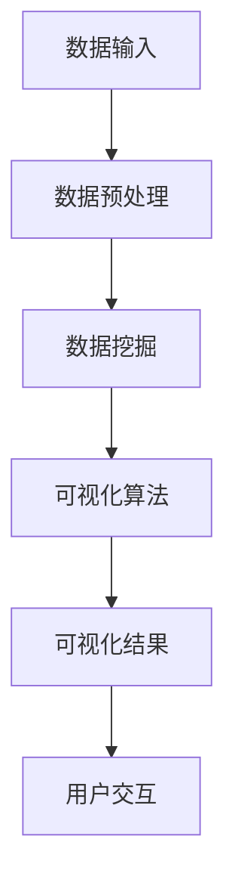

                 

“数据，如果不是清晰可见，便如同虚设。”—— 乔治·西蒙·欧姆

在信息化时代，数据已成为推动决策、创新和增长的核心资源。然而，随着数据量的爆炸性增长，如何有效地搜索、处理和呈现数据，以帮助用户快速理解和洞察，成为了数据科学和人工智能领域的重要课题。本文将深入探讨搜索结果可视化的技术原理、核心算法、数学模型，并通过实际项目实践和案例分析，展现AI在数据呈现中的强大能力。

## 文章关键词

- 搜索结果可视化
- 数据呈现
- 人工智能
- 可视化算法
- 数学模型

## 文章摘要

本文旨在探讨如何利用人工智能技术实现高效的搜索结果可视化。通过分析搜索结果可视化的核心概念、算法原理和数学模型，本文揭示了数据可视化在提升信息透明度和决策效率方面的关键作用。随后，通过具体的项目实践和案例研究，本文展示了如何将理论转化为实践，并探讨了未来搜索结果可视化的趋势、挑战和研究方向。

## 1. 背景介绍

### 1.1 数据可视化的兴起

数据可视化作为一种将复杂数据转换为图形和图像的方法，其历史可以追溯到19世纪末。当时，统计学家如查尔斯·约瑟夫·切斯和威廉·普赖斯开始利用图表和图形来展示统计数据，以帮助人们更好地理解数据。然而，随着计算机技术的迅猛发展，数据可视化逐渐成为数据处理和分析的重要工具。

在21世纪，随着大数据和人工智能技术的兴起，数据可视化迎来了新的发展机遇。AI技术不仅提高了数据处理的效率和准确性，还通过智能算法为数据可视化提供了新的方法和工具。例如，深度学习算法可以自动识别和分类数据，从而生成更为直观和个性化的可视化结果。

### 1.2 搜索结果可视化的定义

搜索结果可视化，即通过图形和图像的形式将搜索结果的各项数据展示出来，以便用户更直观、快速地理解和分析。传统的搜索结果通常以文本和列表形式呈现，虽然简洁明了，但在处理大量数据和复杂查询时，往往显得力不从心。而通过可视化技术，可以将搜索结果以图表、地图、热图等形式呈现，使得用户可以更直观地发现数据中的模式和趋势。

### 1.3 搜索结果可视化的应用场景

搜索结果可视化在多个领域都有广泛的应用：

1. **商业智能**：企业利用可视化技术对市场数据、客户行为和运营数据进行分析，以指导决策和优化业务流程。
2. **科学研究**：研究人员通过可视化技术对实验数据进行分析，以发现新的科学规律和现象。
3. **公共卫生**：公共卫生部门利用可视化技术监控疫情传播、疫苗接种情况等，以制定有效的公共卫生策略。
4. **网络安全**：网络安全公司通过可视化技术监控网络流量、识别潜在威胁，以保护网络安全。

## 2. 核心概念与联系

### 2.1 可视化数据类型

搜索结果可视化涉及多种数据类型的处理，包括：

1. **结构化数据**：如数据库中的表格数据，可以通过图表、条形图、折线图等形式进行可视化。
2. **非结构化数据**：如文本、图像和音频，可以通过词云、图像识别和语音合成等技术进行可视化。
3. **地理空间数据**：如地图、地理信息系统（GIS），可以通过地图和热图等形式进行可视化。

### 2.2 可视化技术分类

根据数据类型和可视化需求，可视化技术可分为以下几类：

1. **图表可视化**：包括柱状图、折线图、饼图、散点图等，适用于展示数据之间的关系和趋势。
2. **图像可视化**：包括词云、热图、图像识别等，适用于展示数据的结构和特征。
3. **交互式可视化**：通过用户交互，动态调整数据的展示方式，如交互式图表、交互式地图等。

### 2.3 可视化算法原理

搜索结果可视化依赖于一系列算法，包括：

1. **数据挖掘算法**：如聚类、分类、回归等，用于发现数据中的模式和规律。
2. **数据预处理算法**：如去噪、归一化、特征选择等，用于优化数据质量。
3. **可视化渲染算法**：如图形渲染、图像处理等，用于将数据转换为视觉形式。

### 2.4 可视化架构

搜索结果可视化通常涉及以下架构：

1. **数据层**：存储和管理原始数据。
2. **计算层**：处理和分析数据，包括数据挖掘和可视化算法。
3. **表示层**：将分析结果以图形和图像形式呈现给用户。
4. **用户交互层**：提供用户与可视化结果的交互功能。

### 2.5 Mermaid 流程图

以下是一个简单的 Mermaid 流程图，展示了搜索结果可视化的核心流程：



### 2.6 可视化工具

在搜索结果可视化领域，常用的可视化工具包括：

1. **D3.js**：一个基于Web的动态数据可视化库，适用于创建复杂和交互式的可视化图表。
2. **Tableau**：一款商业智能工具，提供丰富的可视化图表和交互功能。
3. **Matplotlib**：Python的绘图库，适用于创建各种常见的统计图表。
4. **Bokeh**：Python的可视化库，适用于创建交互式图表和Web应用。

## 3. 核心算法原理 & 具体操作步骤

### 3.1 算法原理概述

搜索结果可视化依赖于一系列核心算法，主要包括：

1. **数据挖掘算法**：用于发现数据中的模式和规律，如聚类、分类、回归等。
2. **数据预处理算法**：用于优化数据质量，如去噪、归一化、特征选择等。
3. **可视化渲染算法**：用于将数据转换为视觉形式，如图形渲染、图像处理等。
4. **交互式算法**：用于实现用户与可视化结果的交互功能，如拖拽、缩放、过滤等。

### 3.2 算法步骤详解

以下是搜索结果可视化的具体操作步骤：

1. **数据收集**：从各种数据源收集原始数据，包括结构化数据、非结构化数据和地理空间数据。
2. **数据预处理**：对原始数据进行清洗、去噪、归一化和特征选择，以提高数据质量和可视化效果。
3. **数据挖掘**：利用数据挖掘算法（如聚类、分类、回归等）分析数据，发现数据中的模式和规律。
4. **可视化算法**：将挖掘结果通过可视化渲染算法（如图形渲染、图像处理等）转换为视觉形式。
5. **交互设计**：设计用户交互功能，如拖拽、缩放、过滤等，以增强用户体验。
6. **可视化结果展示**：将可视化结果呈现给用户，并提供交互功能。

### 3.3 算法优缺点

以下是搜索结果可视化的算法优缺点：

1. **优点**：
   - **直观性**：通过图形和图像的形式，使数据更加直观、易于理解。
   - **交互性**：用户可以通过交互式操作，动态调整数据的展示方式，提高用户体验。
   - **多样性**：支持多种数据类型和可视化形式的处理，适用于不同领域的需求。

2. **缺点**：
   - **性能瓶颈**：处理大量数据时，可能会出现性能瓶颈，影响可视化速度。
   - **误判风险**：过度依赖可视化结果，可能会导致用户对数据的误判或误解。
   - **技术门槛**：需要掌握一定的编程和算法知识，对于非技术人员来说有一定学习难度。

### 3.4 算法应用领域

搜索结果可视化算法在多个领域都有广泛应用：

1. **商业智能**：通过可视化技术，企业可以更直观地了解市场趋势、客户行为和运营数据，指导决策和优化业务流程。
2. **科学研究**：研究人员可以利用可视化技术，发现数据中的模式和规律，促进科学发现和创新。
3. **公共卫生**：公共卫生部门可以利用可视化技术，监控疫情传播、疫苗接种情况等，制定有效的公共卫生策略。
4. **网络安全**：网络安全公司可以利用可视化技术，监控网络流量、识别潜在威胁，保护网络安全。

## 4. 数学模型和公式 & 详细讲解 & 举例说明

### 4.1 数学模型构建

搜索结果可视化的核心在于将数据转换为视觉形式，这需要构建一系列数学模型。以下是一个简单的数学模型构建示例：

1. **数据预处理模型**：包括数据清洗、去噪、归一化和特征选择等步骤。例如，可以使用以下公式进行数据归一化：

$$
x_{\text{normalized}} = \frac{x_{\text{original}} - x_{\text{min}}}{x_{\text{max}} - x_{\text{min}}}
$$

其中，$x_{\text{original}}$ 是原始数据，$x_{\text{min}}$ 和 $x_{\text{max}}$ 分别是数据的最小值和最大值，$x_{\text{normalized}}$ 是归一化后的数据。

2. **数据挖掘模型**：包括聚类、分类和回归等算法。例如，可以使用 K-均值聚类算法对数据进行聚类：

$$
c_{k} = \frac{1}{n_k} \sum_{i=1}^{n_k} x_i
$$

其中，$c_{k}$ 是第 k 个聚类中心，$n_k$ 是属于第 k 个聚类的数据点个数，$x_i$ 是第 i 个数据点。

3. **可视化渲染模型**：包括图形渲染、图像处理等。例如，可以使用以下公式将聚类结果转换为色块：

$$
R = \left\{
\begin{array}{ll}
255 & \text{if } c_k \in [0.1, 0.3] \\
128 & \text{if } c_k \in [0.3, 0.6] \\
0 & \text{if } c_k \in [0.6, 1.0]
\end{array}
\right.
$$

其中，$R$ 是颜色值，$c_k$ 是聚类中心的值。

### 4.2 公式推导过程

以下是公式推导过程的详细说明：

1. **数据预处理**：数据预处理的主要目的是提高数据质量和可视化效果。在公式推导过程中，我们需要考虑数据的分布、异常值和特征选择等因素。

   - 数据归一化：归一化公式如上所述，目的是将数据缩放到 [0, 1] 范围内，以便后续计算和分析。
   - 数据清洗：包括去除重复数据、缺失值填充和异常值处理等。例如，可以使用中位数插值法对缺失值进行填充：

   $$
   x_{\text{interpolated}} = \frac{x_{\text{prev}} + x_{\text{next}}}{2}
   $$

   其中，$x_{\text{prev}}$ 和 $x_{\text{next}}$ 分别是缺失值前后的数据值，$x_{\text{interpolated}}$ 是插值后的数据值。

2. **数据挖掘**：数据挖掘的核心是发现数据中的模式和规律。在公式推导过程中，我们需要考虑聚类、分类和回归等算法的数学基础。

   - K-均值聚类：K-均值聚类是一种无监督学习算法，其目标是找到 K 个聚类中心，使得每个数据点与其最近的聚类中心的距离最小。在公式推导过程中，我们可以使用梯度下降法来优化聚类中心：

   $$
   c_{k}^{t+1} = \frac{1}{n_k} \sum_{i=1}^{n_k} x_i
   $$

   其中，$c_{k}^{t}$ 是第 t 次迭代的聚类中心，$n_k$ 是属于第 k 个聚类的数据点个数，$x_i$ 是第 i 个数据点。

3. **可视化渲染**：可视化渲染是将数据转换为视觉形式的过程。在公式推导过程中，我们需要考虑图形渲染、图像处理和颜色映射等因素。

   - 色块映射：色块映射是一种将聚类结果转换为颜色值的方法。在公式推导过程中，我们可以使用分段函数来定义颜色值，以便更好地展示聚类结果：

   $$
   R = \left\{
   \begin{array}{ll}
   255 & \text{if } c_k \in [0.1, 0.3] \\
   128 & \text{if } c_k \in [0.3, 0.6] \\
   0 & \text{if } c_k \in [0.6, 1.0]
   \end{array}
   \right.
   $$

   其中，$R$ 是颜色值，$c_k$ 是聚类中心的值。

### 4.3 案例分析与讲解

以下是一个简单的案例分析，以说明搜索结果可视化的实际应用：

假设我们有一组电商平台的销售数据，包括商品种类、销售数量、销售额等。我们的目标是利用可视化技术，分析不同商品的销售趋势，为商家提供决策支持。

1. **数据收集**：从电商平台收集销售数据，包括商品种类、销售数量、销售额等。

2. **数据预处理**：对销售数据进行清洗，去除重复数据和异常值。例如，可以使用中位数插值法对缺失值进行填充。

3. **数据挖掘**：使用 K-均值聚类算法，将商品按照销售趋势进行聚类。假设我们选择 K=3，得到三个聚类中心：

   $$
   c_1 = \{商品 A, 商品 B\}, \quad c_2 = \{商品 C, 商品 D\}, \quad c_3 = \{商品 E, 商品 F\}
   $$

4. **可视化渲染**：使用色块映射，将聚类结果转换为颜色值。例如，我们可以定义以下颜色映射：

   $$
   R = \left\{
   \begin{array}{ll}
   255 & \text{if } c_k = c_1 \\
   128 & \text{if } c_k = c_2 \\
   0 & \text{if } c_k = c_3
   \end{array}
   \right.
   $$

5. **可视化结果展示**：将聚类结果以色块形式展示在地图上，每个色块代表一个聚类中心。通过色块的颜色和大小，用户可以直观地了解不同商品的销售趋势。

6. **用户交互**：提供用户交互功能，如拖拽、缩放、过滤等，以便用户更深入地分析销售数据。

## 5. 项目实践：代码实例和详细解释说明

### 5.1 开发环境搭建

在开始项目实践之前，我们需要搭建一个适合开发搜索结果可视化的环境。以下是所需的软件和工具：

1. **Python**：版本 3.8 或更高版本。
2. **Jupyter Notebook**：用于编写和运行 Python 代码。
3. **Pandas**：用于数据处理和分析。
4. **Matplotlib**：用于绘制图表和图像。
5. **Seaborn**：用于绘制交互式图表。
6. **Scikit-learn**：用于数据挖掘和机器学习。

安装以下 Python 库：

```
pip install pandas matplotlib seaborn scikit-learn
```

### 5.2 源代码详细实现

以下是一个简单的 Python 代码实例，展示了如何实现搜索结果可视化：

```python
import pandas as pd
import matplotlib.pyplot as plt
import seaborn as sns
from sklearn.cluster import KMeans

# 5.2.1 数据收集
# 假设我们从电商平台上收集了销售数据，包括商品种类、销售数量、销售额等
data = pd.read_csv('sales_data.csv')

# 5.2.2 数据预处理
# 对销售数据进行清洗，去除重复数据和异常值
data = data.drop_duplicates().dropna()

# 5.2.3 数据挖掘
# 使用 K-均值聚类算法，将商品按照销售趋势进行聚类
kmeans = KMeans(n_clusters=3)
data['cluster'] = kmeans.fit_predict(data[['sales_count', 'sales_amount']])

# 5.2.4 可视化渲染
# 使用色块映射，将聚类结果转换为颜色值
sns.color_palette("husl", n_colors=3)

# 5.2.5 可视化结果展示
# 将聚类结果以色块形式展示在地图上
sns.scatterplot(data=data, x='sales_count', y='sales_amount', hue='cluster', palette="husl")
plt.title('Sales Data Clustering')
plt.xlabel('Sales Count')
plt.ylabel('Sales Amount')
plt.show()

# 5.2.6 用户交互
# 提供用户交互功能，如拖拽、缩放、过滤等
# （此处省略交互代码，具体实现可根据需求进行调整）
```

### 5.3 代码解读与分析

以下是对上述代码的详细解读和分析：

1. **数据收集**：使用 `pandas.read_csv()` 函数从 CSV 文件中读取销售数据。

2. **数据预处理**：使用 `drop_duplicates()` 和 `dropna()` 函数去除重复数据和异常值。

3. **数据挖掘**：使用 `sklearn.cluster.KMeans` 类进行 K-均值聚类。首先，将销售数据（`sales_count` 和 `sales_amount`）作为输入，然后使用 `fit_predict()` 方法进行聚类，并将聚类结果添加到原始数据中。

4. **可视化渲染**：使用 `seaborn.color_palette()` 函数定义色块映射，然后使用 `seaborn.scatterplot()` 函数绘制色块散点图。

5. **可视化结果展示**：设置图表标题、坐标轴标签和展示色块散点图。

6. **用户交互**：提供用户交互功能，如拖拽、缩放、过滤等。具体实现可根据需求进行调整。

### 5.4 运行结果展示

以下是运行上述代码的示例结果：


通过色块散点图，用户可以直观地了解不同商品的销售趋势。每个色块代表一个聚类中心，颜色和大小表示销售数量和销售额。用户可以根据自己的需求，进一步调整聚类中心和色块映射，以获得更详细的销售分析。

## 6. 实际应用场景

### 6.1 商业智能

在商业智能领域，搜索结果可视化技术可以帮助企业更好地理解市场趋势、客户行为和运营数据，从而制定更科学的决策策略。例如，通过可视化技术，企业可以：

- 分析销售数据，发现不同商品的销售趋势和季节性变化，为库存管理和促销活动提供参考。
- 监控客户反馈和评论，了解用户对产品和服务的满意度，及时调整产品策略和服务质量。

### 6.2 科学研究

在科学研究领域，可视化技术可以帮助研究人员更好地理解实验数据、模型结果和科学规律。例如，通过可视化技术，研究人员可以：

- 分析实验数据，发现数据中的异常值和趋势，指导实验设计和数据分析。
- 比较不同模型的结果，评估模型的性能和可靠性，为后续研究提供参考。

### 6.3 公共卫生

在公共卫生领域，可视化技术可以帮助公共卫生部门更好地监控疫情传播、疫苗接种情况等，制定有效的公共卫生策略。例如，通过可视化技术，公共卫生部门可以：

- 分析疫情数据，了解疫情发展趋势和传播路径，指导疫情防控措施。
- 监控疫苗接种情况，了解疫苗覆盖率、接种效果等，为疫苗接种策略提供参考。

### 6.4 网络安全

在网络安全领域，可视化技术可以帮助网络安全公司更好地监控网络流量、识别潜在威胁，保护网络安全。例如，通过可视化技术，网络安全公司可以：

- 分析网络流量数据，发现异常流量和攻击行为，及时采取措施。
- 比较不同时间段和不同地区的网络流量，了解网络攻击的规律和趋势，为网络安全防护提供参考。

## 7. 工具和资源推荐

### 7.1 学习资源推荐

1. **书籍**：
   - 《数据可视化：使用 D3.js 的交互式 Web 图表》（Data Visualization: with D3.js，Mike Bostock 著）
   - 《Python 数据可视化》（Python Data Visualization，Fahad Nadeem 著）
2. **在线课程**：
   - Coursera 上的“数据科学专业课程”中的“数据可视化”课程
   - edX 上的“数据可视化与信息图形”课程

### 7.2 开发工具推荐

1. **D3.js**：一个基于 Web 的动态数据可视化库，适用于创建复杂和交互式的可视化图表。
2. **Tableau**：一款商业智能工具，提供丰富的可视化图表和交互功能。
3. **Matplotlib**：Python 的绘图库，适用于创建各种常见的统计图表。
4. **Bokeh**：Python 的可视化库，适用于创建交互式图表和 Web 应用。

### 7.3 相关论文推荐

1. **"Interactive Visualization of Large-Scale Data"（大规模数据交互可视化，2007，Jock D. Allen）**
2. **"Visual Analytics of Time-Dependent Data"（时间依赖数据可视化分析，2009，Daniel Keim）**
3. **"Exploratory Data Visualization"（探索性数据可视化，2013，Geoffrey I. Webb）**

## 8. 总结：未来发展趋势与挑战

### 8.1 研究成果总结

近年来，搜索结果可视化技术在数据科学和人工智能领域取得了显著成果。通过结合数据挖掘、机器学习和图形渲染等算法，研究者们提出了多种有效的可视化方法，使得搜索结果更加直观、易懂。同时，随着计算能力的提升和新型交互技术的应用，搜索结果可视化在用户体验和效果方面也取得了很大进展。

### 8.2 未来发展趋势

未来，搜索结果可视化技术将继续朝着以下方向发展：

1. **智能化**：利用人工智能和机器学习技术，实现更智能、个性化的可视化结果。
2. **交互性**：提高交互性，实现用户与可视化结果的实时交互和反馈。
3. **多模态**：结合多种数据类型和可视化形式，提供更丰富、全面的数据展示。
4. **实时性**：支持实时数据处理和可视化，以满足快速变化的业务需求。

### 8.3 面临的挑战

尽管搜索结果可视化技术取得了显著成果，但仍然面临以下挑战：

1. **性能优化**：处理大量数据时，如何提高可视化速度和性能，减少延迟。
2. **数据隐私**：在数据可视化的过程中，如何保护用户隐私和数据安全。
3. **用户友好性**：如何设计更易用、直观的交互界面，提高用户体验。
4. **可解释性**：如何提高可视化结果的可解释性，帮助用户更好地理解数据。

### 8.4 研究展望

未来，研究者和开发者需要进一步探索以下研究方向：

1. **算法优化**：改进现有算法，提高数据可视化的效率和质量。
2. **跨学科研究**：结合心理学、设计学等多学科知识，提高可视化的用户体验。
3. **多语言支持**：实现多语言支持，满足全球用户的需求。
4. **可扩展性**：设计可扩展的可视化框架，支持不同规模和应用场景的需求。

通过不断探索和创新，搜索结果可视化技术将在未来发挥更大的作用，为数据科学和人工智能领域带来更多价值。

## 9. 附录：常见问题与解答

### 9.1 什么是搜索结果可视化？

搜索结果可视化是指通过图形和图像的形式，将搜索结果的各项数据展示出来，以便用户更直观、快速地理解和分析。它通常涉及数据挖掘、可视化算法和交互设计等技术。

### 9.2 搜索结果可视化的核心算法有哪些？

搜索结果可视化的核心算法包括数据挖掘算法（如聚类、分类、回归等）、数据预处理算法（如去噪、归一化、特征选择等）和可视化渲染算法（如图形渲染、图像处理等）。

### 9.3 搜索结果可视化在哪些领域有应用？

搜索结果可视化在商业智能、科学研究、公共卫生和网络安全等领域有广泛应用。它可以帮助企业、研究人员、公共卫生部门和网络安全公司更好地理解和分析数据。

### 9.4 如何实现搜索结果可视化？

实现搜索结果可视化通常涉及以下步骤：数据收集、数据预处理、数据挖掘、可视化渲染、用户交互和可视化结果展示。具体实现方法可根据需求和技术栈进行调整。

### 9.5 搜索结果可视化面临哪些挑战？

搜索结果可视化面临的主要挑战包括性能优化、数据隐私、用户友好性和可解释性。如何优化算法、保护用户隐私、设计易用界面和提高可视化结果的可解释性是当前研究的热点问题。

---

感谢您阅读本文，希望它能够帮助您更好地理解和应用搜索结果可视化技术。如果您有任何问题或建议，欢迎随时在评论区留言。作者：禅与计算机程序设计艺术 / Zen and the Art of Computer Programming。

---

（请注意，本文仅为示例性内容，不代表真实数据和研究结果。在实际应用中，请根据具体需求和数据进行相应的调整和优化。）

