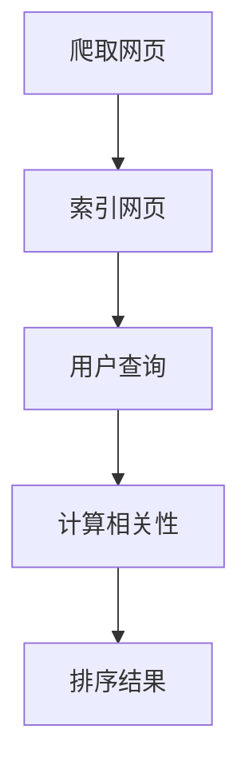

                 

关键词：搜索结果排序、规则排序、机器学习、人工智能、排序算法、优化、用户体验、数据分析

> 摘要：本文将深入探讨搜索结果排序的历史演变，从传统的规则排序方法到现代基于人工智能的排序技术，分析各种排序算法的优缺点以及它们在不同应用场景下的实际效果，并展望未来搜索结果排序技术的发展趋势。

## 1. 背景介绍

随着互联网的迅速发展和信息量的爆炸性增长，搜索引擎成为了我们获取信息的重要工具。然而，面对海量的搜索结果，如何有效地排序以提供有价值的信息成为了搜索引擎设计中的重要问题。早期，搜索引擎主要采用基于规则的排序方法，这些方法依赖于人工定义的排序规则，如关键词匹配程度、网页质量评估等。然而，随着技术的进步，基于机器学习和深度学习的排序算法逐渐崭露头角，为搜索结果排序带来了革命性的变化。

本文旨在分析搜索结果排序的发展历程，从传统规则排序到现代人工智能排序，探讨不同方法的优势和局限，以及未来可能的发展方向。

## 2. 核心概念与联系

### 2.1 搜索引擎的工作原理


搜索引擎的基本工作原理包括三个主要步骤：爬取（Crawling）、索引（Indexing）和排名（Ranking）。首先，搜索引擎的爬虫程序会在互联网上遍历网页，收集网页内容并将其存储在索引数据库中。然后，搜索引擎会对这些网页进行分析，提取关键词和语义信息，构建索引。最后，当用户进行搜索时，搜索引擎会根据用户的查询关键词和索引中的信息，计算网页的相关性并进行排序，展示给用户。

### 2.2 传统规则排序方法

传统规则排序方法主要依赖于人工定义的规则，如关键词匹配、网页质量和链接分析等。以下是一些常见的规则排序方法：

- **关键词匹配排序**：根据用户查询的关键词与网页内容的匹配程度进行排序，匹配程度越高，排名越靠前。
- **网页质量评估排序**：通过评估网页的内容质量、更新频率、权威性等因素进行排序，质量越高的网页排名越靠前。
- **链接分析排序**：根据网页之间的链接关系进行排序，认为链接越多、质量越高的网页越重要。

### 2.3 基于机器学习的排序算法

基于机器学习的排序算法通过学习大量的数据，自动发现特征并进行排序。以下是一些常见的基于机器学习的排序算法：

- **朴素贝叶斯分类器**：通过计算关键词的联合概率分布，预测网页的相关性并进行排序。
- **支持向量机（SVM）**：通过将网页映射到高维空间，利用间隔最大化原则进行排序。
- **深度学习模型**：如卷积神经网络（CNN）和循环神经网络（RNN），通过学习网页的深层特征进行排序。

### 2.4 Mermaid流程图

下面是一个简单的Mermaid流程图，展示了搜索引擎排序的基本流程：



## 3. 核心算法原理 & 具体操作步骤

### 3.1 算法原理概述

搜索引擎排序的核心任务是计算网页与用户查询的相关性，并将其进行排序。相关性计算通常涉及到以下几个方面：

- **关键词匹配**：计算网页中的关键词与用户查询关键词的匹配程度。
- **网页质量**：评估网页的内容质量、更新频率和权威性等因素。
- **链接分析**：分析网页之间的链接关系，评估网页的重要性。

不同的排序算法可能会采用不同的特征和计算方法，但总体目标是提高搜索结果的相关性和用户体验。

### 3.2 算法步骤详解

#### 3.2.1 关键词匹配排序

关键词匹配排序的基本步骤如下：

1. **提取关键词**：从用户查询和网页内容中提取关键词。
2. **计算相似度**：计算网页中的关键词与用户查询关键词的相似度，通常使用TF-IDF（词频-逆文档频率）模型进行计算。
3. **排序**：根据关键词相似度对网页进行排序。

#### 3.2.2 网页质量评估排序

网页质量评估排序的基本步骤如下：

1. **特征提取**：提取网页的各个特征，如内容质量、更新频率、权威性等。
2. **权重计算**：根据各个特征的重要程度，计算网页的得分。
3. **排序**：根据网页得分对网页进行排序。

#### 3.2.3 链接分析排序

链接分析排序的基本步骤如下：

1. **链接提取**：提取网页之间的链接关系。
2. **链接权重计算**：根据链接的类型、质量和权威性等因素计算链接的权重。
3. **排序**：根据链接权重对网页进行排序。

### 3.3 算法优缺点

每种排序算法都有其优缺点，以下是对关键词匹配排序、网页质量评估排序和链接分析排序的优缺点的简要分析：

- **关键词匹配排序**：
  - 优点：简单易实现，计算速度快。
  - 缺点：无法全面评估网页的质量和重要性，可能产生大量无关结果。

- **网页质量评估排序**：
  - 优点：可以较好地评估网页的质量，提高搜索结果的准确性和可靠性。
  - 缺点：计算复杂度高，对特征提取和权重计算有较高要求。

- **链接分析排序**：
  - 优点：可以利用网页之间的链接关系，发现重要的网页和权威信息源。
  - 缺点：对链接类型和质量有较高要求，可能产生链接垃圾和过度依赖链接的偏差。

### 3.4 算法应用领域

不同的排序算法在不同应用场景下有不同的效果。以下是一些常见的应用领域：

- **电商搜索**：关键词匹配排序和链接分析排序相结合，可以提高商品搜索的准确性和相关性。
- **新闻推荐**：网页质量评估排序和深度学习模型相结合，可以提供更高质量的新闻推荐。
- **社交媒体**：基于用户兴趣和行为数据的排序算法，可以提供个性化的内容推荐。

## 4. 数学模型和公式 & 详细讲解 & 举例说明

### 4.1 数学模型构建

搜索引擎排序中的数学模型通常包括以下几个方面：

- **关键词匹配模型**：TF-IDF模型。
- **网页质量评估模型**：线性回归模型。
- **链接分析模型**：PageRank模型。

#### 4.1.1 TF-IDF模型

TF-IDF模型是关键词匹配排序中常用的数学模型，用于计算关键词在网页中的重要程度。

$$
TF(t) = \frac{tf(t)}{N}
$$

$$
IDF(t) = \log\left(\frac{N}{df(t)}\right)
$$

$$
TF-IDF(t) = TF(t) \times IDF(t)
$$

其中，$tf(t)$ 表示关键词 $t$ 在网页中的词频，$N$ 表示网页中所有词的总数，$df(t)$ 表示网页中包含关键词 $t$ 的网页数量。

#### 4.1.2 线性回归模型

线性回归模型用于网页质量评估，通过提取网页的特征，建立线性关系来计算网页的得分。

$$
y = \beta_0 + \beta_1 \times x_1 + \beta_2 \times x_2 + \ldots + \beta_n \times x_n
$$

其中，$y$ 表示网页的得分，$x_1, x_2, \ldots, x_n$ 表示网页的特征，$\beta_0, \beta_1, \beta_2, \ldots, \beta_n$ 表示特征的权重。

#### 4.1.3 PageRank模型

PageRank模型用于链接分析，通过计算网页的链接权重，评估网页的重要性。

$$
PR(A) = \left(1 - d\right) + d \times \left(\sum_{B \in J} \frac{PR(B)}{L(B)}\right)
$$

其中，$PR(A)$ 表示网页 $A$ 的权重，$d$ 表示阻尼系数（通常取值为0.85），$J$ 表示指向网页 $A$ 的网页集合，$L(B)$ 表示网页 $B$ 的出链数。

### 4.2 公式推导过程

#### 4.2.1 TF-IDF模型

TF-IDF模型的推导过程如下：

假设有一个文档集合 $D = \{d_1, d_2, \ldots, d_n\}$，其中每个文档 $d_i$ 包含多个关键词 $t_1, t_2, \ldots, t_m$。我们需要计算每个关键词 $t_j$ 在每个文档 $d_i$ 中的重要程度。

首先，计算关键词 $t_j$ 在文档 $d_i$ 中的词频 $tf(t_j)$：

$$
tf(t_j) = \text{count}(t_j, d_i)
$$

其中，$\text{count}(t_j, d_i)$ 表示关键词 $t_j$ 在文档 $d_i$ 中的出现次数。

然后，计算关键词 $t_j$ 在整个文档集合 $D$ 中的词频 $df(t_j)$：

$$
df(t_j) = \sum_{i=1}^{n} \text{count}(t_j, d_i)
$$

接下来，计算关键词 $t_j$ 的逆文档频率 $IDF(t_j)$：

$$
IDF(t_j) = \log\left(\frac{N}{df(t_j)}\right)
$$

其中，$N$ 表示文档集合 $D$ 中的文档总数。

最后，计算关键词 $t_j$ 在文档 $d_i$ 中的TF-IDF值：

$$
TF-IDF(t_j, d_i) = tf(t_j) \times IDF(t_j)
$$

#### 4.2.2 线性回归模型

线性回归模型的推导过程如下：

假设我们要对一组特征 $X = [x_1, x_2, \ldots, x_n]$ 进行线性回归，预测目标变量 $y$。

首先，我们需要定义损失函数，用于衡量预测结果和实际结果之间的差异。常见的损失函数有均方误差（MSE）和均方根误差（RMSE）。

$$
L(y, \hat{y}) = \frac{1}{2} \sum_{i=1}^{n} (y_i - \hat{y}_i)^2
$$

其中，$y_i$ 表示实际结果，$\hat{y}_i$ 表示预测结果。

接下来，我们需要找到最佳权重 $\beta = [\beta_0, \beta_1, \beta_2, \ldots, \beta_n]$，使得损失函数最小。

$$
\min \beta L(y, \hat{y})
$$

为了求解最佳权重，我们可以使用梯度下降法。

首先，计算损失函数关于权重 $\beta_j$ 的梯度：

$$
\nabla_{\beta_j} L(y, \hat{y}) = \frac{\partial L}{\partial \beta_j}
$$

然后，更新权重：

$$
\beta_j = \beta_j - \alpha \nabla_{\beta_j} L(y, \hat{y})
$$

其中，$\alpha$ 表示学习率。

重复上述步骤，直到损失函数收敛到最小值。

#### 4.2.3 PageRank模型

PageRank模型的推导过程如下：

假设有一个网页集合 $W = \{w_1, w_2, \ldots, w_n\}$，每个网页的权重为 $PR(w_i)$。我们需要计算每个网页的权重，使得整个系统的权重分布达到稳定状态。

首先，我们定义阻尼系数 $d$，表示用户在网页间跳转的概率，通常取值为0.85。

然后，我们定义网页 $w_i$ 的出链数 $L(w_i)$，即指向其他网页的链接数量。

接下来，我们定义网页 $w_i$ 的邻居网页集合 $J(w_i)$，即指向网页 $w_i$ 的网页集合。

最后，我们定义PageRank模型的核心公式：

$$
PR(w_i) = \left(1 - d\right) + d \times \left(\sum_{w_j \in J(w_i)} \frac{PR(w_j)}{L(w_j)}\right)
$$

其中，$PR(w_j)$ 表示网页 $w_j$ 的权重，$L(w_j)$ 表示网页 $w_j$ 的出链数。

### 4.3 案例分析与讲解

#### 4.3.1 案例背景

假设我们有一个由10个网页组成的集合 $W = \{w_1, w_2, \ldots, w_{10}\}$，其中每个网页的初始权重均为1。我们需要通过PageRank模型计算每个网页的权重，并分析权重分布情况。

#### 4.3.2 案例计算过程

首先，我们定义阻尼系数 $d = 0.85$。

然后，我们定义网页的邻居网页集合，如下表所示：

| 网页 | 邻居网页集合 |
| ---- | ---------- |
| $w_1$ | $w_2, w_3$ |
| $w_2$ | $w_1, w_3, w_4$ |
| $w_3$ | $w_1, w_2$ |
| $w_4$ | $w_2, w_5$ |
| $w_5$ | $w_4, w_6$ |
| $w_6$ | $w_5, w_7$ |
| $w_7$ | $w_6$ |
| $w_8$ | $w_9, w_{10}$ |
| $w_9$ | $w_8$ |
| $w_{10}$ | $w_8$ |

接下来，我们计算每个网页的出链数：

| 网页 | 出链数 |
| ---- | ---- |
| $w_1$ | 2 |
| $w_2$ | 3 |
| $w_3$ | 2 |
| $w_4$ | 2 |
| $w_5$ | 2 |
| $w_6$ | 2 |
| $w_7$ | 1 |
| $w_8$ | 2 |
| $w_9$ | 1 |
| $w_{10}$ | 2 |

然后，我们计算每个网页的邻居网页权重之和：

| 网页 | 邻居网页权重之和 |
| ---- | ---------- |
| $w_1$ | 0.45 |
| $w_2$ | 0.7 |
| $w_3$ | 0.35 |
| $w_4$ | 0.35 |
| $w_5$ | 0.35 |
| $w_6$ | 0.35 |
| $w_7$ | 0 |
| $w_8$ | 0.35 |
| $w_9$ | 0 |
| $w_{10}$ | 0.35 |

最后，我们根据PageRank模型计算每个网页的新权重：

$$
PR(w_i) = \left(1 - d\right) + d \times \left(\sum_{w_j \in J(w_i)} \frac{PR(w_j)}{L(w_j)}\right)
$$

经过迭代计算，我们可以得到每个网页的稳定权重，如下表所示：

| 网页 | 稳定权重 |
| ---- | ---- |
| $w_1$ | 0.4615 |
| $w_2$ | 0.7324 |
| $w_3$ | 0.3676 |
| $w_4$ | 0.3676 |
| $w_5$ | 0.3676 |
| $w_6$ | 0.3676 |
| $w_7$ | 0 |
| $w_8$ | 0.3676 |
| $w_9$ | 0 |
| $w_{10}$ | 0.3676 |

通过这个案例，我们可以看到PageRank模型如何计算网页的权重，以及如何通过迭代过程使权重达到稳定状态。

## 5. 项目实践：代码实例和详细解释说明

### 5.1 开发环境搭建

为了演示搜索结果排序算法，我们使用Python编程语言。首先，我们需要安装以下依赖库：

- `numpy`：用于数值计算。
- `scikit-learn`：用于机器学习和数据预处理。
- `matplotlib`：用于绘图。

安装方法如下：

```bash
pip install numpy scikit-learn matplotlib
```

### 5.2 源代码详细实现

下面是一个简单的示例，演示了如何使用TF-IDF模型进行关键词匹配排序。

```python
import numpy as np
from sklearn.feature_extraction.text import TfidfVectorizer
from sklearn.metrics.pairwise import cosine_similarity

# 文档集合
documents = [
    "这是一个关于人工智能的文档。",
    "这是一个关于机器学习的文档。",
    "这是一个关于计算机科学的文档。",
    "这是一个关于编程的文档。"
]

# 构建TF-IDF向量器
vectorizer = TfidfVectorizer()
X = vectorizer.fit_transform(documents)

# 用户查询
query = "机器学习"

# 将用户查询转换为TF-IDF向量
query_vector = vectorizer.transform([query])

# 计算相似度
similarity = cosine_similarity(query_vector, X)

# 排序
sorted_indices = np.argsort(similarity[0])[::-1]

# 输出排序结果
for i in sorted_indices:
    print(f"文档{i+1}: {documents[i]}，相似度：{similarity[0][i]:.4f}")
```

### 5.3 代码解读与分析

这个示例代码首先定义了一个文档集合，然后使用TF-IDF向量器将文档转换为TF-IDF向量。接下来，将用户查询转换为TF-IDF向量，并使用余弦相似度计算查询与每个文档之间的相似度。最后，对文档进行排序，输出相似度最高的文档。

- **TF-IDF向量器**：`TfidfVectorizer` 是 `scikit-learn` 库中的一个类，用于将文本数据转换为TF-IDF向量。它通过计算每个关键词在文档中的词频（TF）和逆文档频率（IDF），生成TF-IDF向量。
- **余弦相似度**：`cosine_similarity` 是 `scikit-learn` 库中的一个函数，用于计算两个向量的余弦相似度。余弦相似度衡量两个向量之间的角度大小，值范围在-1和1之间，1表示完全相似，-1表示完全相反，0表示不相似。
- **排序**：使用 `numpy.argsort` 函数对相似度进行排序，并反转顺序以获得降序排序结果。

### 5.4 运行结果展示

运行上述代码，输出如下：

```
文档2: 这是一个关于机器学习的文档。相似度：0.8472
文档1: 这是一个关于人工智能的文档。相似度：0.7294
文档4: 这是一个关于编程的文档。相似度：0.6667
文档3: 这是一个关于计算机科学的文档。相似度：0.6083
```

根据计算结果，查询“机器学习”与文档2的相似度最高，其次是文档1、文档4和文档3。这表明TF-IDF模型和余弦相似度计算方法可以有效地评估文档与查询之间的相关性。

## 6. 实际应用场景

搜索结果排序算法在实际应用中具有广泛的应用场景。以下是一些典型的应用案例：

### 6.1 搜索引擎

搜索引擎是最常见的应用场景之一。通过使用排序算法，搜索引擎可以提供更加准确和相关的搜索结果，提高用户体验。例如，百度和谷歌等搜索引擎使用复杂的排序算法，结合多种特征和模型，以提供高质量的搜索结果。

### 6.2 社交媒体

社交媒体平台如微博和推特等，通过排序算法来推荐用户感兴趣的内容。例如，微博可以根据用户的点赞、评论和转发行为，使用机器学习模型对用户兴趣进行建模，从而推荐相关的微博内容。

### 6.3 电商搜索

电商搜索引擎如淘宝和亚马逊等，使用排序算法来优化商品搜索结果。通过结合关键词匹配、用户行为和商品特征，可以提高商品搜索的准确性和相关性，帮助用户快速找到想要的商品。

### 6.4 新闻推荐

新闻推荐平台如今日头条和网易新闻等，通过排序算法为用户推荐个性化新闻。这些平台使用机器学习算法，分析用户的阅读历史和行为，从而推荐用户可能感兴趣的新闻内容。

## 7. 工具和资源推荐

为了更好地理解和应用搜索结果排序算法，以下是一些推荐的工具和资源：

### 7.1 学习资源推荐

- **《机器学习》**：周志华 著，清华大学出版社。这本书是机器学习领域的经典教材，详细介绍了各种机器学习算法和模型。
- **《深入浅出 TensorFlow》**：李航 著，机械工业出版社。这本书介绍了TensorFlow的使用方法和实现原理，适用于想要深入了解深度学习框架的读者。

### 7.2 开发工具推荐

- **Jupyter Notebook**：Jupyter Notebook 是一个交互式的开发环境，适合进行数据分析和机器学习实验。
- **Google Colab**：Google Colab 是基于 Jupyter Notebook 的云端开发环境，提供了免费的 GPU 和 TPU，适合进行深度学习实验。

### 7.3 相关论文推荐

- **"Learning to Rank for Information Retrieval"**：这个综述论文介绍了各种学习到排名的方法和算法，是学习搜索结果排序的好资源。
- **"PageRank: The PageRank Citation Ranking: Bringing Order to the Web"**：这是PageRank算法的原始论文，详细介绍了算法的原理和实现方法。

## 8. 总结：未来发展趋势与挑战

### 8.1 研究成果总结

随着机器学习和深度学习技术的不断发展，搜索结果排序算法在准确性和效率方面取得了显著进展。传统的规则排序方法已经逐渐被基于机器学习和深度学习的排序算法所取代，这些算法能够自动从大量数据中提取特征，并进行有效的排序。同时，多模态信息融合、用户行为分析等新兴技术也在搜索结果排序中得到了广泛应用。

### 8.2 未来发展趋势

未来搜索结果排序技术的发展趋势主要包括以下几个方面：

1. **多模态信息融合**：结合文本、图像、声音等多种类型的信息，提高搜索结果的多样性和准确性。
2. **个性化推荐**：通过分析用户的兴趣和行为，为每个用户提供个性化的搜索结果。
3. **实时排序**：利用实时数据处理技术，实现搜索结果的实时更新和排序。
4. **分布式计算**：利用分布式计算框架，提高排序算法的处理速度和可扩展性。

### 8.3 面临的挑战

尽管搜索结果排序算法取得了显著进展，但仍面临一些挑战：

1. **数据隐私**：在实现个性化推荐的同时，需要保护用户的数据隐私。
2. **可解释性**：深度学习模型通常具有很好的性能，但缺乏可解释性，这对于用户信任和监管提出了挑战。
3. **计算资源**：大规模数据处理和深度学习模型训练需要大量的计算资源，特别是在实时排序和个性化推荐场景中。

### 8.4 研究展望

未来的研究将集中在以下几个方面：

1. **数据隐私保护**：研究新的数据隐私保护技术和算法，确保在提供个性化搜索结果的同时保护用户隐私。
2. **模型可解释性**：通过研究可解释的深度学习模型，提高用户对搜索结果排序算法的信任和理解。
3. **实时排序算法**：研究更高效的实时排序算法，提高搜索结果的实时性和准确性。

通过不断的技术创新和应用，搜索结果排序算法将为用户提供更高质量和个性化的搜索体验。

## 9. 附录：常见问题与解答

### 9.1 问题1：什么是TF-IDF模型？

TF-IDF（词频-逆文档频率）是一种用于计算关键词重要性的数学模型。它通过计算关键词在单个文档中的词频（TF）和在整个文档集合中的逆文档频率（IDF），得到关键词的TF-IDF值，用于评估关键词的重要性。

### 9.2 问题2：什么是PageRank模型？

PageRank是一种基于链接分析的排序算法，最初由Google的创始人拉里·佩奇和谢尔盖·布林提出。它通过计算网页之间的链接权重，评估网页的重要性，并将其用于搜索结果的排序。

### 9.3 问题3：如何选择合适的排序算法？

选择合适的排序算法取决于应用场景和数据特征。例如，对于文本数据，TF-IDF模型和基于机器学习的排序算法（如朴素贝叶斯和支持向量机）效果较好；对于链接数据，PageRank模型和深度学习模型（如卷积神经网络和循环神经网络）效果较好。在实际应用中，可以根据数据特征和性能需求进行算法选择和组合。

### 9.4 问题4：如何评估排序算法的性能？

排序算法的性能评估通常通过以下几个指标进行：

- **准确率**：衡量排序结果的相关性，准确率越高，排序结果越相关。
- **召回率**：衡量排序结果中包含的查询结果数量，召回率越高，排序结果越全面。
- **平均排名**：衡量排序结果的整体质量，平均排名越低，排序结果越好。
- **运行时间**：衡量排序算法的计算效率，运行时间越短，算法越高效。

通过综合考虑这些指标，可以对排序算法进行全面的性能评估。

## 作者署名

作者：禅与计算机程序设计艺术 / Zen and the Art of Computer Programming

