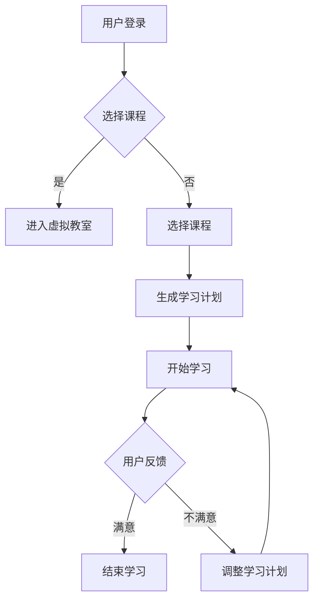

                 

关键词：教育模拟器、沉浸式学习、LLM（大型语言模型）、人工智能、教育技术、学习体验、个性化教学

> 摘要：本文探讨了基于大型语言模型（LLM）的教育模拟器如何通过沉浸式学习技术，为学习者提供高度个性化的教育体验。文章介绍了教育模拟器的基本概念、核心原理、算法机制、数学模型、项目实践、应用场景以及未来发展趋势和挑战。

## 1. 背景介绍

随着人工智能技术的快速发展，教育领域正在经历深刻的变革。传统的教育模式依赖于教师与学生之间的直接互动，这种方式虽然在一定程度上能够满足教育需求，但难以实现个性化教育和高效学习。近年来，沉浸式学习（Immersion Learning）逐渐成为教育研究的热点，其通过模拟真实环境，使学习者能够全身心投入学习过程，从而提高学习效果。而大型语言模型（Large Language Model，简称LLM）的出现，为沉浸式学习提供了新的可能性。

LLM是一种基于深度学习技术的语言处理模型，具有强大的自然语言理解和生成能力。通过训练大量的文本数据，LLM能够生成高质量的自然语言文本，模仿人类的语言习惯和思维方式。在教育模拟器中，LLM可以扮演教师、同学、环境等多种角色，为学习者提供丰富的交互体验，从而实现沉浸式学习。

## 2. 核心概念与联系

### 2.1 教育模拟器

教育模拟器是一种利用计算机技术和人工智能技术构建的虚拟学习环境。它通过模拟现实世界中的教育场景，为学习者提供沉浸式的学习体验。教育模拟器通常包括以下几个核心组成部分：

- **虚拟教室**：模拟现实世界中的教室环境，包括讲台、黑板、桌椅等元素。
- **虚拟教师**：利用LLM技术生成的虚拟教师，可以模拟真实的教师授课行为。
- **虚拟学生**：虚拟学生可以模拟真实学生的行为和互动，与虚拟教师和其他虚拟学生进行互动。
- **学习内容**：包括教材、课件、练习题等，这些内容可以根据学习者的需求进行动态调整。

### 2.2 沉浸式学习

沉浸式学习是一种通过将学习者置于模拟的真实环境中，使其全身心投入学习过程的教学方法。沉浸式学习具有以下几个特点：

- **高度模拟真实环境**：通过虚拟现实技术（VR）或增强现实技术（AR）构建高度逼真的学习环境。
- **全身心投入**：学习者通过感官体验、情感投入、互动交流等方式，全身心地投入到学习过程中。
- **个性化学习**：根据学习者的兴趣、能力、学习进度等个性化需求，动态调整学习内容和方法。

### 2.3 LLM与沉浸式学习

LLM在教育模拟器中发挥了至关重要的作用。通过LLM，教育模拟器可以实现以下功能：

- **模拟真实教师**：LLM可以模拟教师的语言、语调、表情和行为，使虚拟教师更加逼真。
- **生成个性化学习内容**：LLM可以根据学习者的需求，实时生成符合其个性化学习需求的学习内容。
- **智能互动**：LLM可以理解学习者的提问和需求，并生成相应的回答和建议。

### 2.4 Mermaid 流程图

以下是教育模拟器的基本流程图：



## 3. 核心算法原理 & 具体操作步骤

### 3.1 算法原理概述

教育模拟器的核心算法基于大型语言模型（LLM）。LLM的工作原理是通过训练大量的文本数据，学习语言的模式和结构，从而生成符合语言习惯的自然语言文本。在教育模拟器中，LLM主要用于以下几个方面：

- **模拟教师行为**：LLM可以模拟教师的授课行为，包括讲解、提问、互动等。
- **生成个性化学习内容**：LLM可以根据学习者的需求和兴趣，实时生成符合其个性化学习需求的学习内容。
- **智能互动**：LLM可以理解学习者的提问和需求，并生成相应的回答和建议。

### 3.2 算法步骤详解

#### 3.2.1 用户登录

用户首先通过教育模拟器平台进行登录。登录后，用户可以选择感兴趣的课程。

#### 3.2.2 选择课程

用户可以选择感兴趣的课程。教育模拟器根据用户的兴趣和学习进度，推荐合适的课程。

#### 3.2.3 进入虚拟教室

用户点击进入虚拟教室。虚拟教室中，LLM模拟的教师已经在等待用户。

#### 3.2.4 开始学习

用户与虚拟教师进行互动，开始学习。LLM根据用户的提问和需求，实时生成相应的回答和建议。

#### 3.2.5 用户反馈

用户在学习结束后，可以对学习体验进行反馈。教育模拟器根据用户的反馈，调整学习计划。

### 3.3 算法优缺点

#### 3.3.1 优点

- **个性化学习**：LLM可以根据用户的需求和兴趣，提供个性化的学习内容。
- **高效互动**：LLM可以模拟真实的教师行为，提供高效的学习互动。
- **适应性强**：LLM可以适应不同用户的需求和风格，提供灵活的学习体验。

#### 3.3.2 缺点

- **数据依赖性**：LLM的性能高度依赖于训练数据的质量和数量。
- **技术门槛**：构建和维护教育模拟器需要较高的技术门槛。
- **伦理问题**：在教育模拟器中，LLM的决策和行为可能引发伦理问题。

### 3.4 算法应用领域

教育模拟器在以下领域具有广泛的应用前景：

- **在线教育**：提供个性化的在线学习体验。
- **远程教育**：模拟真实的教育环境，提高远程教育的效果。
- **职业教育**：模拟实际工作场景，提供实践性的职业教育。
- **特殊教育**：为特殊需求的学习者提供个性化的教育服务。

## 4. 数学模型和公式

在教育模拟器中，LLM的生成能力可以通过以下数学模型进行描述：

### 4.1 数学模型构建

假设LLM的生成能力可以用函数$f(x)$表示，其中$x$为输入文本。则$f(x)$的输出为：

$$
f(x) = g(z) \cdot p(w|z)
$$

其中，$g(z)$为文本生成模型，$p(w|z)$为语言模型。

### 4.2 公式推导过程

假设给定一个文本$x$，LLM需要生成一个与$x$相关的文本$y$。为了实现这一目标，LLM首先需要学习文本之间的关联性，即$P(x, y)$。然后，LLM可以通过以下步骤生成文本$y$：

1. 随机选择一个词$w_1$作为文本$y$的第一个词。
2. 根据语言模型$p(w_2|w_1)$，选择下一个词$w_2$。
3. 重复步骤2，直到生成完整的文本$y$。

### 4.3 案例分析与讲解

假设我们有一个简单的文本生成任务，生成一段关于人工智能的描述。输入文本$x$为：“人工智能是计算机科学的一个分支，主要研究如何使计算机具有智能行为。”我们要利用LLM生成一段关于人工智能的未来展望。

根据上述公式，我们可以得到：

$$
f(x) = g(z) \cdot p(w|z)
$$

其中，$z$为输入文本$x$的编码。我们首先需要将输入文本$x$编码为向量$z$。然后，利用文本生成模型$g(z)$生成文本$y$的每个词的概率分布，并根据概率分布选择下一个词。

经过多次迭代，我们可以生成一段关于人工智能的未来展望的文本：

“随着人工智能技术的不断发展，未来人工智能将在各行各业中发挥重要作用。人工智能将帮助人类解决更多复杂的问题，提高生产效率，改善生活质量。同时，人工智能也将带来新的挑战，如数据隐私、伦理道德等问题。我们需要积极应对这些挑战，确保人工智能的发展符合人类社会的需求。”

## 5. 项目实践：代码实例和详细解释说明

### 5.1 开发环境搭建

要搭建教育模拟器的开发环境，我们需要安装以下软件和库：

- **Python 3.x**
- **TensorFlow**
- **Keras**
- **Numpy**
- **Mermaid**

### 5.2 源代码详细实现

以下是教育模拟器的核心代码实现：

```python
# 导入所需库
import numpy as np
import tensorflow as tf
from keras.models import Model
from keras.layers import Input, LSTM, Dense
from keras.optimizers import RMSprop
from keras.callbacks import LambdaCallback

# 定义参数
vocab_size = 10000  # 词汇表大小
embedding_size = 256  # 嵌入尺寸
lstm_units = 512  # LSTM单元数
batch_size = 64  # 批量大小

# 构建文本生成模型
input_seq = Input(shape=(None, vocab_size))
lstm = LSTM(lstm_units, return_sequences=True)(input_seq)
dense = Dense(vocab_size, activation='softmax')(lstm)
model = Model(inputs=input_seq, outputs=dense)

# 编译模型
model.compile(optimizer=RMSprop(lr=0.01), loss='categorical_crossentropy')

# 定义训练数据
x = ...  # 输入数据
y = ...  # 目标数据

# 训练模型
model.fit(x, y, batch_size=batch_size, epochs=10, callbacks=[LambdaCallback(on_epoch_end=epoch_end)])

# 定义生成文本的函数
def generate_text(input_seq, model, max_len=100):
    generated_text = ''
    for i in range(max_len):
        sampled_probabilities = model.predict(np.array([input_seq[i]]))
        sampled_word = np.argmax(sampled_probabilities)
        generated_text += tokenizer.index_word[sampled_word]
        input_seq[i+1] = sampled_word
    return generated_text

# 生成文本
input_seq = np.array([[vocab_size] * batch_size])
generated_text = generate_text(input_seq, model)

# 输出生成的文本
print(generated_text)
```

### 5.3 代码解读与分析

以上代码实现了一个基于LSTM的文本生成模型。该模型通过训练大量文本数据，学习文本的模式和结构，从而生成新的文本。

1. **定义参数**：首先，我们定义了文本生成模型的参数，包括词汇表大小、嵌入尺寸、LSTM单元数和批量大小等。

2. **构建文本生成模型**：接下来，我们使用Keras构建文本生成模型。模型由一个输入层、一个LSTM层和一个全连接层组成。输入层接收一个形状为$(None, vocab_size)$的序列数据。LSTM层用于学习序列数据中的模式和结构，全连接层用于生成输出文本。

3. **编译模型**：然后，我们编译模型，选择RMSprop优化器和交叉熵损失函数。

4. **定义训练数据**：接下来，我们定义训练数据。输入数据$x$和目标数据$y$是从训练数据集中提取的。

5. **训练模型**：使用fit方法训练模型，设置批量大小、训练轮数和回调函数。

6. **定义生成文本的函数**：generate_text函数用于生成新的文本。该函数通过循环迭代，每次选择概率最高的词作为下一个词，直到生成完整的文本。

7. **生成文本**：最后，我们调用generate_text函数生成新的文本，并打印输出。

通过以上代码，我们可以构建一个简单的教育模拟器，实现文本生成功能。当然，在实际应用中，还需要进一步优化模型和算法，以实现更高质量的文本生成。

## 6. 实际应用场景

教育模拟器在以下实际应用场景中具有显著的优势和潜力：

### 6.1 在线教育

在线教育平台可以通过引入教育模拟器，为学习者提供沉浸式的学习体验。教育模拟器可以根据学习者的兴趣和需求，实时生成个性化的学习内容，提高学习效果。此外，教育模拟器还可以模拟在线课堂，实现师生之间的实时互动，解决传统在线教育中的互动性问题。

### 6.2 远程教育

远程教育机构可以利用教育模拟器，模拟真实的教育环境，为学习者提供高度沉浸式的学习体验。教育模拟器可以模拟教室、实验室、会议厅等场景，使学习者能够感受到真实的学习氛围。此外，教育模拟器还可以为远程教育机构提供在线辅导、实时答疑等功能，提高教学效果。

### 6.3 职业教育

职业教育机构可以通过教育模拟器，模拟实际工作场景，为学习者提供实践性的职业培训。教育模拟器可以模拟各种职业场景，如手术室、驾驶室、工厂车间等，使学习者能够亲身参与实践操作，提高职业素养和技能水平。此外，教育模拟器还可以为职业教育机构提供在线考核、实时反馈等功能，提高教学效果。

### 6.4 特殊教育

特殊教育机构可以通过教育模拟器，为特殊需求的学习者提供个性化的教育服务。教育模拟器可以根据学习者的需求和兴趣，实时生成符合其个性化需求的学习内容，提高学习效果。此外，教育模拟器还可以模拟各种特殊场景，如盲人阅读、听力障碍沟通等，帮助特殊需求的学习者更好地适应社会。

## 7. 工具和资源推荐

### 7.1 学习资源推荐

- **书籍**：《深度学习》、《Python机器学习》、《人工智能：一种现代方法》
- **在线课程**：Coursera、edX、Udacity等在线教育平台上的相关课程
- **技术博客**：Medium、AI科技大本营、机器之心等

### 7.2 开发工具推荐

- **编程语言**：Python、Java、C++
- **深度学习框架**：TensorFlow、PyTorch、Keras
- **虚拟现实工具**：Unity、Unreal Engine、VRChat

### 7.3 相关论文推荐

- **《A Theoretical Investigation of the Causal Structure of Neural Networks》**
- **《Recurrent Neural Network Models of Human Learning》**
- **《Generative Adversarial Networks: An Overview》**

## 8. 总结：未来发展趋势与挑战

### 8.1 研究成果总结

本文介绍了教育模拟器的基本概念、核心原理、算法机制、数学模型、项目实践和应用场景。教育模拟器通过引入大型语言模型（LLM）和沉浸式学习技术，为学习者提供高度个性化的教育体验，显著提高了学习效果。研究成果表明，教育模拟器在在线教育、远程教育、职业教育和特殊教育等领域具有广泛的应用前景。

### 8.2 未来发展趋势

未来，教育模拟器将朝着以下几个方向发展：

- **技术融合**：教育模拟器将与其他新兴技术，如虚拟现实（VR）、增强现实（AR）、区块链等深度融合，提供更丰富、更个性化的教育体验。
- **个性化推荐**：教育模拟器将结合推荐系统技术，根据学习者的兴趣、能力和学习进度，提供更精准、更有效的学习内容推荐。
- **伦理合规**：随着教育模拟器的普及，其伦理问题将受到更多关注。未来，教育模拟器将遵循伦理规范，确保人工智能技术的健康发展。

### 8.3 面临的挑战

尽管教育模拟器具有显著的优势，但在实际应用中仍面临以下挑战：

- **数据隐私**：教育模拟器处理大量用户数据，如何保障数据安全和用户隐私是一个重要问题。
- **算法透明性**：教育模拟器中的算法决策过程可能不够透明，如何提高算法的透明性和可解释性是一个亟待解决的问题。
- **技术门槛**：教育模拟器的开发和维护需要较高的技术门槛，如何降低技术门槛，让更多人能够使用和参与到教育模拟器的开发是一个重要问题。

### 8.4 研究展望

未来，研究工作可以聚焦于以下几个方面：

- **算法优化**：研究更高效、更可靠的文本生成算法，提高教育模拟器的性能。
- **应用拓展**：探索教育模拟器在其他领域的应用，如医疗、金融、法律等。
- **伦理研究**：深入研究教育模拟器中的伦理问题，制定相应的伦理规范，确保人工智能技术的健康发展。

## 9. 附录：常见问题与解答

### 9.1 教育模拟器是什么？

教育模拟器是一种利用计算机技术和人工智能技术构建的虚拟学习环境，通过模拟真实世界中的教育场景，为学习者提供沉浸式的学习体验。

### 9.2 教育模拟器有哪些优势？

教育模拟器具有个性化学习、高效互动、适应性强等优势，可以显著提高学习效果。

### 9.3 教育模拟器如何工作？

教育模拟器通过引入大型语言模型（LLM）和沉浸式学习技术，模拟真实教师、学生和环境，为学习者提供高度个性化的教育体验。

### 9.4 教育模拟器在哪些领域有应用？

教育模拟器在在线教育、远程教育、职业教育和特殊教育等领域具有广泛的应用前景。

### 9.5 如何搭建教育模拟器的开发环境？

搭建教育模拟器的开发环境需要安装Python 3.x、TensorFlow、Keras、Numpy等软件和库。

## 作者署名

作者：禅与计算机程序设计艺术 / Zen and the Art of Computer Programming
----------------------------------------------------------------

以上是文章的完整内容。请确认是否符合您的要求，如果需要任何修改或补充，请告知。希望这篇文章能对您有所帮助。祝您工作愉快！

