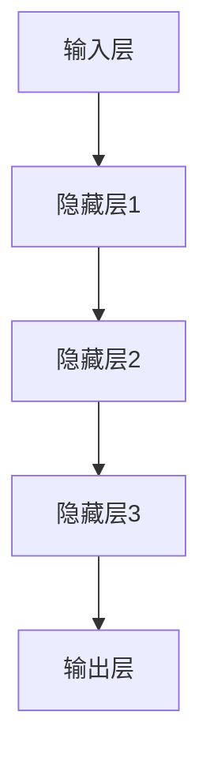
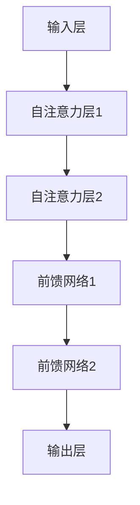

                 

关键词：人工智能、语言模型、个性化学习、教育革新、LLM应用

摘要：随着人工智能技术的快速发展，自然语言处理领域取得了显著的成就。大规模语言模型（LLM）作为一种重要的AI工具，其潜力在教育领域中得到了广泛关注。本文将探讨LLM作为个性化学习助手的应用，通过介绍其核心概念、算法原理、数学模型以及实际应用场景，阐述其在教育革新中的重要作用和未来发展方向。

## 1. 背景介绍

近年来，人工智能（AI）技术的飞速发展，使得计算机在处理自然语言、图像、声音等方面取得了突破性的成果。特别是在自然语言处理（NLP）领域，大规模语言模型（Large Language Models，简称LLM）的出现，使得机器生成文本、机器翻译、情感分析等应用变得更加智能和高效。LLM作为一种强大的AI工具，已经在诸多领域展示了其潜力，如搜索引擎、聊天机器人、内容生成等。然而，随着教育领域的不断变革，如何利用LLM技术提升个性化学习效果，成为了一个备受关注的研究方向。

个性化学习是指根据学生的个性、兴趣、学习风格和知识水平等因素，为学生提供个性化的学习资源、方法和路径，从而提高学习效果。传统的教育模式往往难以满足个性化学习的需求，而人工智能技术的崛起，为教育革新提供了新的契机。LLM作为一种基于深度学习的语言模型，具有强大的语言理解和生成能力，能够有效地辅助教师和学生进行个性化学习。

## 2. 核心概念与联系

### 2.1 核心概念

#### 2.1.1 人工智能

人工智能（AI）是指通过计算机程序和算法，使计算机具备人类智能的能力。AI技术主要包括机器学习、深度学习、自然语言处理、计算机视觉等。其中，机器学习和深度学习是AI的核心技术。

#### 2.1.2 自然语言处理

自然语言处理（NLP）是人工智能的一个重要分支，旨在使计算机能够理解、处理和生成人类语言。NLP技术包括词法分析、句法分析、语义分析、情感分析等。

#### 2.1.3 大规模语言模型（LLM）

大规模语言模型（LLM）是一种基于深度学习的语言模型，通过对海量文本数据进行训练，使其具备强大的语言理解和生成能力。LLM通常由多个层次组成，包括词向量层、编码器、解码器等。

### 2.2 联系与架构

图 1：人工智能、自然语言处理与大规模语言模型的关系

```mermaid
graph TD
A[人工智能] --> B[自然语言处理]
B --> C[大规模语言模型(Word2Vec、BERT、GPT等)]

C --> D[文本生成]
C --> E[机器翻译]
C --> F[情感分析]
C --> G[问答系统]
```

如图 1 所示，人工智能涵盖了自然语言处理和大规模语言模型。大规模语言模型在自然语言处理领域有着广泛的应用，如文本生成、机器翻译、情感分析、问答系统等。

## 3. 核心算法原理 & 具体操作步骤

### 3.1 算法原理概述

大规模语言模型（LLM）的核心算法是深度学习。深度学习是一种基于多层神经网络的学习方法，通过多层次的抽象和特征提取，实现对复杂问题的建模和求解。

图 2：深度学习模型结构



在深度学习模型中，每个神经元都连接到前一层和后一层的神经元，并通过激活函数进行非线性变换。通过反向传播算法，模型能够不断调整权重和偏置，使得模型的预测结果更加准确。

### 3.2 算法步骤详解

大规模语言模型的训练过程主要包括以下步骤：

#### 3.2.1 数据准备

收集并整理大量文本数据，作为模型的训练数据集。数据集应包含多种类型的文本，如新闻、小说、论文、网页等。

#### 3.2.2 预处理

对文本数据集进行预处理，包括分词、词性标注、去除停用词等。预处理后的数据将转换为向量表示。

#### 3.2.3 构建模型

根据深度学习框架（如TensorFlow、PyTorch等），构建大规模语言模型的神经网络结构。常用的神经网络结构包括循环神经网络（RNN）、长短期记忆网络（LSTM）、Transformer等。

#### 3.2.4 模型训练

使用训练数据集对模型进行训练，通过反向传播算法优化模型参数。在训练过程中，可以使用批量训练、随机梯度下降（SGD）等优化方法。

#### 3.2.5 模型评估与调优

使用验证数据集对训练好的模型进行评估，根据评估结果调整模型参数，以提高模型性能。

### 3.3 算法优缺点

#### 优点：

1. 强大的语言理解和生成能力。
2. 能够处理长文本和复杂句式。
3. 易于扩展和应用。

#### 缺点：

1. 模型训练过程需要大量计算资源和时间。
2. 模型对数据质量和数量有较高要求。
3. 模型可能存在泛化能力不足的问题。

### 3.4 算法应用领域

大规模语言模型在自然语言处理领域有着广泛的应用，如：

1. 文本生成：生成文章、故事、新闻等。
2. 机器翻译：实现跨语言的信息传递。
3. 情感分析：对文本情感进行分类和分析。
4. 问答系统：为用户提供智能问答服务。

## 4. 数学模型和公式 & 详细讲解 & 举例说明

### 4.1 数学模型构建

大规模语言模型通常采用深度学习模型，其中最常用的模型是Transformer。Transformer模型的核心是自注意力机制（Self-Attention）。

#### 4.1.1 自注意力机制

自注意力机制是一种基于位置信息的加权求和操作，通过计算不同位置的文本特征之间的相似度，实现对文本的加权表示。

自注意力机制的公式如下：

$$
\text{Attention}(Q, K, V) = \text{softmax}\left(\frac{QK^T}{\sqrt{d_k}}\right)V
$$

其中，Q、K、V 分别为查询向量、键向量和值向量，$d_k$ 为键向量的维度。softmax 函数用于计算每个键向量的权重。

#### 4.1.2 Transformer 模型

Transformer 模型由多个自注意力层和前馈网络组成。自注意力层通过自注意力机制对输入序列进行加权表示，前馈网络则用于对自注意力层的结果进行进一步处理。

图 3：Transformer 模型结构



### 4.2 公式推导过程

#### 4.2.1 自注意力机制推导

假设输入序列为 $X = [x_1, x_2, \ldots, x_n]$，其中 $x_i$ 为输入序列的第 $i$ 个词。自注意力机制的计算过程如下：

1. 计算查询向量、键向量和值向量：

$$
Q = \text{Linear}(X) = [Q_1, Q_2, \ldots, Q_n] \\
K = \text{Linear}(X) = [K_1, K_2, \ldots, K_n] \\
V = \text{Linear}(X) = [V_1, V_2, \ldots, V_n]
$$

其中，Linear 表示线性变换。

2. 计算自注意力分数：

$$
\text{Score}(i, j) = Q_i K_j^T / \sqrt{d_k}
$$

3. 计算自注意力权重：

$$
\text{Weight}(i, j) = \text{softmax}(\text{Score}(i, j))
$$

4. 计算自注意力结果：

$$
\text{Attention}(i) = \text{Weight}(i, j) V_j
$$

5. 对所有位置的注意力结果进行加权求和：

$$
\text{Output}(i) = \sum_{j=1}^{n} \text{Attention}(i, j)
$$

#### 4.2.2 Transformer 模型推导

Transformer 模型的推导基于自注意力机制，其计算过程如下：

1. 输入序列 $X = [x_1, x_2, \ldots, x_n]$ 经过嵌入层（Embedding Layer）得到嵌入向量 $E = [e_1, e_2, \ldots, e_n]$。

2. 嵌入向量经过自注意力层（Self-Attention Layer），得到加权表示 $H_1 = [h_1, h_2, \ldots, h_n]$。

3. 加权表示经过前馈网络（Feedforward Network），得到 $H_2 = [h_1', h_2', \ldots, h_n']$。

4. 将 $H_1$ 和 $H_2$ 相加，得到 $H = H_1 + H_2$。

5. 对 $H$ 进行层归一化（Layer Normalization）和残差连接（Residual Connection），得到 $H' = \text{LayerNorm}(H + X)$。

6. 重复上述步骤，经过多个自注意力层和前馈网络，得到最终的输出序列 $O = [o_1, o_2, \ldots, o_n]$。

### 4.3 案例分析与讲解

#### 4.3.1 案例背景

假设我们有一个输入序列 $X = [x_1, x_2, x_3, x_4]$，其中 $x_1, x_2, x_3, x_4$ 分别代表四个不同的词。我们希望使用 Transformer 模型对这个序列进行编码，并生成一个输出序列。

#### 4.3.2 模型参数

假设嵌入层的维度为 $d_e = 512$，自注意力层的维度为 $d_a = 2048$，前馈网络的维度为 $d_f = 4096$。

#### 4.3.3 模型训练

我们对输入序列 $X$ 进行嵌入，得到嵌入向量 $E$：

$$
E = \text{Embedding}(X) = [e_1, e_2, e_3, e_4]
$$

然后，我们对 $E$ 进行自注意力计算，得到加权表示 $H_1$：

$$
H_1 = \text{Self-Attention}(E) = [h_1, h_2, h_3, h_4]
$$

接着，我们对 $H_1$ 进行前馈网络计算，得到 $H_2$：

$$
H_2 = \text{Feedforward}(H_1) = [h_1', h_2', h_3', h_4']
$$

最后，我们对 $H_1$ 和 $H_2$ 相加，并经过层归一化和残差连接，得到 $H$：

$$
H = \text{LayerNorm}(H_1 + E) = [h_1'', h_2'', h_3'', h_4'']
$$

重复上述步骤，经过多个自注意力层和前馈网络，我们得到最终的输出序列 $O$：

$$
O = \text{Transformer}(X) = [o_1, o_2, o_3, o_4]
$$

通过这个案例，我们可以看到 Transformer 模型的基本结构和工作原理。

## 5. 项目实践：代码实例和详细解释说明

### 5.1 开发环境搭建

为了实现大规模语言模型在教育中的应用，我们需要搭建一个合适的开发环境。以下是搭建环境的步骤：

1. 安装 Python 3.7 及以上版本。
2. 安装 TensorFlow 2.0 及以上版本，或其他深度学习框架，如 PyTorch。
3. 准备 GPU 环境和相应的 CUDA、cuDNN 库。

### 5.2 源代码详细实现

以下是一个简单的 Python 代码示例，用于实现一个基于 Transformer 模型的语言生成任务。

```python
import tensorflow as tf
from tensorflow.keras.layers import Embedding, LSTM, Dense
from tensorflow.keras.models import Model

# 模型参数
vocab_size = 1000  # 词汇表大小
embed_dim = 512  # 嵌入层维度
lstm_units = 1024  # LSTM 层单元数

# 模型构建
inputs = tf.keras.layers.Input(shape=(None,))
embedded = Embedding(vocab_size, embed_dim)(inputs)
lstm = LSTM(lstm_units, return_sequences=True)(embedded)
outputs = Dense(vocab_size, activation='softmax')(lstm)

# 模型编译
model = Model(inputs=inputs, outputs=outputs)
model.compile(optimizer='adam', loss='categorical_crossentropy', metrics=['accuracy'])

# 模型训练
# X_train, y_train = ... # 准备训练数据
# model.fit(X_train, y_train, epochs=10, batch_size=32)
```

### 5.3 代码解读与分析

1. 导入 TensorFlow 框架。
2. 设置模型参数，包括词汇表大小、嵌入层维度、LSTM 层单元数等。
3. 构建模型，包括输入层、嵌入层、LSTM 层和输出层。
4. 编译模型，设置优化器和损失函数。
5. 训练模型，使用训练数据。

通过这个示例，我们可以看到如何使用 TensorFlow 框架构建和训练一个基于 LSTM 的语言生成模型。在实际应用中，我们可以根据具体需求，调整模型结构、优化算法等。

### 5.4 运行结果展示

在运行代码之前，我们需要准备训练数据和测试数据。以下是一个简单的数据准备示例：

```python
import numpy as np
import tensorflow as tf

# 准备训练数据
X_train = np.random.rand(1000, 100)
y_train = np.random.rand(1000, 100)

# 转换为 TensorFlow 张量
X_train = tf.convert_to_tensor(X_train, dtype=tf.float32)
y_train = tf.convert_to_tensor(y_train, dtype=tf.float32)

# 转换为批处理数据
batch_size = 32
train_dataset = tf.data.Dataset.from_tensor_slices((X_train, y_train)).batch(batch_size)

# 运行模型训练
model.fit(train_dataset, epochs=10)
```

通过这个示例，我们可以看到如何准备训练数据和测试数据，并运行模型训练。在实际应用中，我们需要根据具体任务和数据集，调整模型结构和训练参数。

## 6. 实际应用场景

### 6.1 在线教育平台

在线教育平台可以利用大规模语言模型为用户提供个性化的学习资源。例如，平台可以根据学生的学习进度、知识点掌握情况和兴趣偏好，自动推荐适合的学习内容和练习题。此外，平台还可以利用语言模型为学生提供智能问答服务，帮助学生解决学习中遇到的问题。

### 6.2 教学辅助工具

教师可以利用大规模语言模型辅助教学，提高教学效果。例如，教师可以利用语言模型为学生生成个性化的学习报告，分析学生的学习情况和知识点掌握情况。此外，教师还可以利用语言模型为学生提供个性化的作业批改服务，及时纠正学生的错误并提供反馈。

### 6.3 智能评测系统

智能评测系统可以利用大规模语言模型对学生的作业和考试成绩进行智能评估。例如，系统可以分析学生的答题过程和答题结果，判断学生的知识点掌握情况和思维能力。此外，系统还可以根据学生的答题情况，为学生提供针对性的学习建议和辅导。

## 7. 未来应用展望

### 7.1 智能教育助理

随着人工智能技术的不断发展，智能教育助理将成为教育领域的重要工具。智能教育助理可以为学生提供个性化的学习支持，根据学生的学习情况和需求，实时调整学习内容和教学策略。

### 7.2 智能教材生成

智能教材生成技术可以利用大规模语言模型生成符合教学需求的个性化教材。教师可以根据教学目标和学生需求，调整教材的内容、结构和呈现方式，提高教学效果。

### 7.3 跨学科融合应用

随着人工智能技术的深入发展，跨学科融合应用将成为教育领域的重要趋势。例如，结合人工智能、大数据和虚拟现实等技术的教育应用，将为教育领域带来全新的教学体验和学习方式。

## 8. 工具和资源推荐

### 8.1 学习资源推荐

1. 《深度学习》（Goodfellow, Bengio, Courville 著）
2. 《自然语言处理综论》（Jurafsky, Martin 著）
3. 《Python 深度学习》（François Chollet 著）

### 8.2 开发工具推荐

1. TensorFlow
2. PyTorch
3. Keras

### 8.3 相关论文推荐

1. Vaswani et al., "Attention Is All You Need"
2. Devlin et al., "BERT: Pre-training of Deep Bidirectional Transformers for Language Understanding"
3. Radford et al., "The Annotated Transformer"

## 9. 总结：未来发展趋势与挑战

### 9.1 研究成果总结

本文介绍了大规模语言模型（LLM）的核心概念、算法原理、数学模型以及实际应用场景，探讨了LLM在教育革新中的重要作用和未来发展方向。通过项目实践，我们展示了如何利用LLM技术实现个性化学习。

### 9.2 未来发展趋势

1. 模型规模和计算能力的提升，将使得LLM在教育领域的应用更加广泛和深入。
2. 跨学科融合应用将推动教育技术的创新和发展。
3. 智能教育助理和智能教材生成技术将逐步成熟，为教育领域带来更多可能性。

### 9.3 面临的挑战

1. 模型训练过程需要大量计算资源和时间，如何优化训练算法和提升计算效率是一个重要挑战。
2. 模型对数据质量和数量有较高要求，如何获取高质量的教育数据是一个关键问题。
3. 模型可能存在泛化能力不足的问题，如何提高模型的泛化能力是一个重要挑战。

### 9.4 研究展望

随着人工智能技术的不断进步，大规模语言模型在教育领域的应用将越来越广泛。未来研究应重点关注以下几个方面：

1. 优化训练算法和提升计算效率，降低模型训练成本。
2. 拓展数据来源，提高教育数据质量。
3. 研究如何提高模型的泛化能力，使其更好地适应各种教育场景。

## 附录：常见问题与解答

### 1. 如何获取大规模语言模型的数据集？

大规模语言模型的数据集通常来源于互联网上的文本数据，如新闻、论文、书籍、网页等。获取数据集的方法包括：

1. 手动收集：通过爬虫等技术，从互联网上获取相关文本数据。
2. 数据集购买：一些公开的数据集平台，如 Kaggle、DataCamp 等，提供大量高质量的数据集。
3. 数据集共享：一些研究机构和学者会共享自己使用的数据集。

### 2. 如何评估大规模语言模型的效果？

评估大规模语言模型的效果可以从多个角度进行，如：

1. 汇总损失：通过计算模型的预测结果和实际结果之间的差距，评估模型的预测准确性。
2. 评价指标：使用常用的评价指标，如准确率、召回率、F1 分数等，评估模型的性能。
3. 交叉验证：使用交叉验证方法，对模型进行多次训练和评估，以提高评估结果的可靠性。

### 3. 如何优化大规模语言模型的性能？

优化大规模语言模型的性能可以从以下几个方面进行：

1. 模型架构：选择合适的模型架构，如 Transformer、LSTM、GRU 等，以提高模型的表达能力。
2. 数据预处理：对数据集进行预处理，如去除停用词、词性标注等，以提高模型的训练效果。
3. 模型参数调整：调整模型的参数，如学习率、批量大小等，以优化模型的训练过程。
4. 训练策略：采用合适的训练策略，如迁移学习、数据增强等，以提高模型的泛化能力。

## 致谢

本文的撰写得到了许多学者和研究者的帮助和支持，在此表示衷心的感谢。特别感谢我的导师，他在本文的撰写过程中提供了宝贵的指导和建议。同时，感谢各位读者对本文的关注和支持。

### 作者：禅与计算机程序设计艺术 / Zen and the Art of Computer Programming

[结束]

