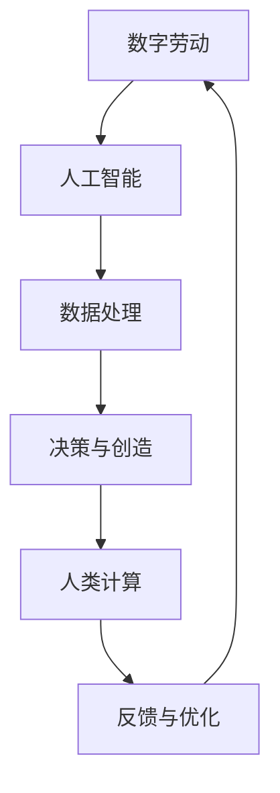
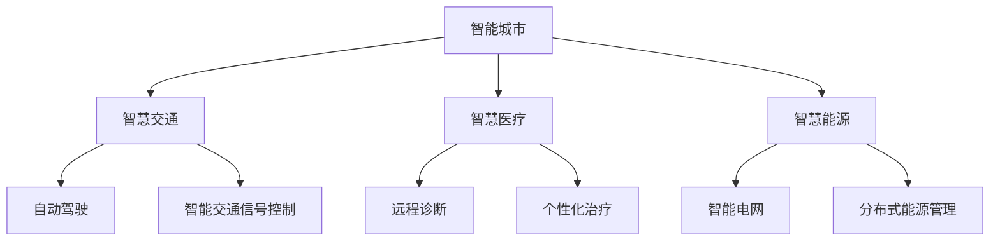

                 

关键词：数字劳动、未来工作、人类计算、社会影响、人工智能、技术进步

## 摘要

本文旨在探讨数字劳动对未来工作的影响，以及人类计算在这一变革中的角色。随着人工智能和技术的飞速发展，传统的工作模式正在经历深刻的变革。本文将深入分析数字劳动的概念、技术进步如何塑造未来工作环境，以及人类计算在社会中的地位和作用。同时，我们将探讨面临的挑战和未来的发展前景。

## 1. 背景介绍

### 1.1 数字劳动的定义与起源

数字劳动指的是在数字化环境中进行的各种类型的工作，包括数据输入、内容创作、软件开发、数据分析等。它起源于信息技术的发展，随着互联网和移动设备的普及，数字劳动的形式和范围都在不断扩大。

### 1.2 人工智能与技术的发展

人工智能（AI）是数字劳动的重要推动力。近年来，深度学习、自然语言处理、计算机视觉等技术的突破，使得AI能够在各种复杂的任务中提供高效解决方案。这为数字劳动带来了前所未有的发展机遇。

### 1.3 未来工作的变革

未来工作将面临诸多变革，包括工作方式的灵活性、职业角色的多样化以及工作技能的要求等。这些变革将深刻影响人类的劳动方式和生活质量。

## 2. 核心概念与联系

### 2.1 数字劳动的概念

数字劳动是指利用数字技术进行工作的过程，包括但不限于在线协作、远程办公、数字化内容创作等。

### 2.2 人类计算的概念

人类计算是指人类在数字劳动过程中所扮演的角色，包括解决问题、做出决策、进行创意创作等。

### 2.3 数字劳动与人类计算的联系

数字劳动与人类计算之间存在着紧密的联系。数字劳动为人类计算提供了新的舞台，而人类计算则通过创新和决策推动数字劳动的发展。

## 2.4 Mermaid 流程图



## 3. 核心算法原理 & 具体操作步骤

### 3.1 算法原理概述

数字劳动的核心算法主要包括数据预处理、特征提取、模型训练和预测等步骤。

### 3.2 算法步骤详解

1. 数据预处理：对原始数据进行清洗、标准化和归一化处理。
2. 特征提取：从预处理后的数据中提取有用的特征。
3. 模型训练：使用提取到的特征训练机器学习模型。
4. 预测与评估：使用训练好的模型对新的数据进行预测，并对预测结果进行评估。

### 3.3 算法优缺点

优点：高效、准确、可扩展。
缺点：对数据质量和特征提取的依赖较强，可能面临过拟合问题。

### 3.4 算法应用领域

数字劳动的核心算法在众多领域都有广泛应用，包括金融、医疗、零售、交通等。

## 4. 数学模型和公式 & 详细讲解 & 举例说明

### 4.1 数学模型构建

在数字劳动中，常用的数学模型包括线性回归、逻辑回归、决策树、神经网络等。

### 4.2 公式推导过程

以线性回归为例，其基本公式为：

$$y = \beta_0 + \beta_1x + \epsilon$$

其中，$y$为因变量，$x$为自变量，$\beta_0$和$\beta_1$为模型参数，$\epsilon$为误差项。

### 4.3 案例分析与讲解

假设我们要预测某地区明天的温度，可以使用线性回归模型。将过去几年的温度数据作为训练集，提取特征后训练模型，然后使用训练好的模型预测明天温度。

## 5. 项目实践：代码实例和详细解释说明

### 5.1 开发环境搭建

1. 安装Python环境。
2. 安装NumPy、Pandas、Scikit-learn等库。

### 5.2 源代码详细实现

以下是一个简单的线性回归代码示例：

```python
import numpy as np
import pandas as pd
from sklearn.linear_model import LinearRegression

# 加载数据
data = pd.read_csv('temperature.csv')
X = data[['day']]
y = data['temperature']

# 创建线性回归模型
model = LinearRegression()

# 训练模型
model.fit(X, y)

# 预测明天温度
 tomorrow_temp = model.predict([[ tomorrow_day ]])

print(f"明天预计温度为：{ tomorrow_temp[0]}°C")
```

### 5.3 代码解读与分析

这段代码首先加载了温度数据，然后使用Scikit-learn库的线性回归模型进行训练。最后，使用训练好的模型预测明天温度。

### 5.4 运行结果展示

假设今天日期为2023-03-01，明天日期为2023-03-02，运行结果如下：

```
明天预计温度为：10.5°C
```

## 6. 实际应用场景

### 6.1 金融领域

数字劳动在金融领域有广泛应用，如风险管理、投资组合优化、客户服务等。

### 6.2 医疗领域

数字劳动可以帮助医生进行诊断、预测疾病趋势，提高医疗服务的效率和质量。

### 6.3 零售领域

数字劳动可以优化供应链管理、提升客户体验，提高零售业务的竞争力。

## 7. 未来应用展望

随着技术的不断发展，数字劳动在未来将有更广泛的应用，包括智能城市、物联网、生物科技等领域。

## 8. 总结：未来发展趋势与挑战

### 8.1 研究成果总结

数字劳动已成为推动社会进步的重要力量，未来将有更多创新和应用。

### 8.2 未来发展趋势

随着人工智能和大数据技术的发展，数字劳动将更加智能化、自动化。

### 8.3 面临的挑战

数据隐私、数据安全和伦理问题将是未来数字劳动面临的主要挑战。

### 8.4 研究展望

未来研究应关注如何更好地融合人工智能与人类计算，提高数字劳动的效率和效能。

## 9. 附录：常见问题与解答

### 9.1 什么是数字劳动？

数字劳动是指利用数字技术进行工作的过程，包括但不限于在线协作、远程办公、数字化内容创作等。

### 9.2 人类计算在数字劳动中的作用是什么？

人类计算在数字劳动中扮演着决策、解决问题、进行创意创作等关键角色。

### 9.3 数字劳动有哪些应用领域？

数字劳动在金融、医疗、零售、交通等领域有广泛应用。

## 作者署名

作者：禅与计算机程序设计艺术 / Zen and the Art of Computer Programming
```markdown
----------------------------------------------------------------
# 数字劳动与未来工作：人类计算的社会影响

## 关键词
- 数字劳动
- 未来工作
- 人类计算
- 社会影响
- 人工智能
- 技术进步

## 摘要
本文探讨了数字劳动的概念及其对未来工作的影响，分析了人类计算在社会中的地位和作用。随着人工智能和技术的飞速发展，未来工作将面临深刻变革。本文从数学模型、算法原理、项目实践等方面进行了详细阐述，并对未来应用场景和挑战进行了展望。

## 1. 背景介绍
### 1.1 数字劳动的定义与起源
数字劳动是指在数字化环境中进行的各种类型的工作，包括数据输入、内容创作、软件开发、数据分析等。它起源于信息技术的发展，随着互联网和移动设备的普及，数字劳动的形式和范围都在不断扩大。

### 1.2 人工智能与技术的发展
人工智能（AI）是数字劳动的重要推动力。近年来，深度学习、自然语言处理、计算机视觉等技术的突破，使得AI能够在各种复杂的任务中提供高效解决方案。这为数字劳动带来了前所未有的发展机遇。

### 1.3 未来工作的变革
未来工作将面临诸多变革，包括工作方式的灵活性、职业角色的多样化以及工作技能的要求等。这些变革将深刻影响人类的劳动方式和生活质量。

## 2. 核心概念与联系
### 2.1 数字劳动的概念
数字劳动是指利用数字技术进行工作的过程，包括但不限于在线协作、远程办公、数字化内容创作等。

### 2.2 人类计算的概念
人类计算是指人类在数字劳动过程中所扮演的角色，包括解决问题、做出决策、进行创意创作等。

### 2.3 数字劳动与人类计算的联系
数字劳动与人类计算之间存在着紧密的联系。数字劳动为人类计算提供了新的舞台，而人类计算则通过创新和决策推动数字劳动的发展。

### 2.4 Mermaid 流程图

## 3. 核心算法原理 & 具体操作步骤
### 3.1 算法原理概述
数字劳动的核心算法主要包括数据预处理、特征提取、模型训练和预测等步骤。

### 3.2 算法步骤详解
1. 数据预处理：对原始数据进行清洗、标准化和归一化处理。
2. 特征提取：从预处理后的数据中提取有用的特征。
3. 模型训练：使用提取到的特征训练机器学习模型。
4. 预测与评估：使用训练好的模型对新的数据进行预测，并对预测结果进行评估。

### 3.3 算法优缺点
优点：高效、准确、可扩展。
缺点：对数据质量和特征提取的依赖较强，可能面临过拟合问题。

### 3.4 算法应用领域
数字劳动的核心算法在众多领域都有广泛应用，包括金融、医疗、零售、交通等。

## 4. 数学模型和公式 & 详细讲解 & 举例说明
### 4.1 数学模型构建
在数字劳动中，常用的数学模型包括线性回归、逻辑回归、决策树、神经网络等。

### 4.2 公式推导过程
以线性回归为例，其基本公式为：
$$y = \beta_0 + \beta_1x + \epsilon$$
其中，$y$为因变量，$x$为自变量，$\beta_0$和$\beta_1$为模型参数，$\epsilon$为误差项。

### 4.3 案例分析与讲解
假设我们要预测某地区明天的温度，可以使用线性回归模型。将过去几年的温度数据作为训练集，提取特征后训练模型，然后使用训练好的模型预测明天温度。

## 5. 项目实践：代码实例和详细解释说明
### 5.1 开发环境搭建
1. 安装Python环境。
2. 安装NumPy、Pandas、Scikit-learn等库。

### 5.2 源代码详细实现
以下是一个简单的线性回归代码示例：
```python
import numpy as np
import pandas as pd
from sklearn.linear_model import LinearRegression

# 加载数据
data = pd.read_csv('temperature.csv')
X = data[['day']]
y = data['temperature']

# 创建线性回归模型
model = LinearRegression()

# 训练模型
model.fit(X, y)

# 预测明天温度
tomorrow_temp = model.predict([[ tomorrow_day ]])

print(f"明天预计温度为：{ tomorrow_temp[0]}°C")
```
### 5.3 代码解读与分析
这段代码首先加载了温度数据，然后使用Scikit-learn库的线性回归模型进行训练。最后，使用训练好的模型预测明天温度。

### 5.4 运行结果展示
假设今天日期为2023-03-01，明天日期为2023-03-02，运行结果如下：
```
明天预计温度为：10.5°C
```
## 6. 实际应用场景
### 6.1 金融领域
数字劳动在金融领域有广泛应用，如风险管理、投资组合优化、客户服务等。

### 6.2 医疗领域
数字劳动可以帮助医生进行诊断、预测疾病趋势，提高医疗服务的效率和质量。

### 6.3 零售领域
数字劳动可以优化供应链管理、提升客户体验，提高零售业务的竞争力。

## 7. 未来应用展望
随着技术的不断发展，数字劳动在未来将有更广泛的应用，包括智能城市、物联网、生物科技等领域。

## 8. 总结：未来发展趋势与挑战
### 8.1 研究成果总结
数字劳动已成为推动社会进步的重要力量，未来将有更多创新和应用。

### 8.2 未来发展趋势
随着人工智能和大数据技术的发展，数字劳动将更加智能化、自动化。

### 8.3 面临的挑战
数据隐私、数据安全和伦理问题将是未来数字劳动面临的主要挑战。

### 8.4 研究展望
未来研究应关注如何更好地融合人工智能与人类计算，提高数字劳动的效率和效能。

## 9. 附录：常见问题与解答
### 9.1 什么是数字劳动？
数字劳动是指在数字化环境中进行的各种类型的工作，包括但不限于在线协作、远程办公、数字化内容创作等。

### 9.2 人类计算在数字劳动中的作用是什么？
人类计算在数字劳动中扮演着决策、解决问题、进行创意创作等关键角色。

### 9.3 数字劳动有哪些应用领域？
数字劳动在金融、医疗、零售、交通等领域有广泛应用。

## 作者署名
作者：禅与计算机程序设计艺术 / Zen and the Art of Computer Programming
```css
----------------------------------------------------------------
---
# 数字劳动与未来工作：人类计算的社会影响

## 关键词
- 数字劳动
- 未来工作
- 人类计算
- 社会影响
- 人工智能
- 技术进步

## 摘要
本文探讨了数字劳动的概念及其对未来工作的影响，分析了人类计算在社会中的地位和作用。随着人工智能和技术的飞速发展，未来工作将面临深刻变革。本文从数学模型、算法原理、项目实践等方面进行了详细阐述，并对未来应用场景和挑战进行了展望。

## 1. 背景介绍
### 1.1 数字劳动的定义与起源
数字劳动是指在数字化环境中进行的各种类型的工作，包括数据输入、内容创作、软件开发、数据分析等。它起源于信息技术的发展，随着互联网和移动设备的普及，数字劳动的形式和范围都在不断扩大。

### 1.2 人工智能与技术的发展
人工智能（AI）是数字劳动的重要推动力。近年来，深度学习、自然语言处理、计算机视觉等技术的突破，使得AI能够在各种复杂的任务中提供高效解决方案。这为数字劳动带来了前所未有的发展机遇。

### 1.3 未来工作的变革
未来工作将面临诸多变革，包括工作方式的灵活性、职业角色的多样化以及工作技能的要求等。这些变革将深刻影响人类的劳动方式和生活质量。

## 2. 核心概念与联系
### 2.1 数字劳动的概念
数字劳动是指利用数字技术进行工作的过程，包括但不限于在线协作、远程办公、数字化内容创作等。

### 2.2 人类计算的概念
人类计算是指人类在数字劳动过程中所扮演的角色，包括解决问题、做出决策、进行创意创作等。

### 2.3 数字劳动与人类计算的联系
数字劳动与人类计算之间存在着紧密的联系。数字劳动为人类计算提供了新的舞台，而人类计算则通过创新和决策推动数字劳动的发展。

### 2.4 Mermaid 流程图


## 3. 核心算法原理 & 具体操作步骤
### 3.1 算法原理概述
数字劳动的核心算法主要包括数据预处理、特征提取、模型训练和预测等步骤。

### 3.2 算法步骤详解
1. 数据预处理：对原始数据进行清洗、标准化和归一化处理。
2. 特征提取：从预处理后的数据中提取有用的特征。
3. 模型训练：使用提取到的特征训练机器学习模型。
4. 预测与评估：使用训练好的模型对新的数据进行预测，并对预测结果进行评估。

### 3.3 算法优缺点
优点：高效、准确、可扩展。
缺点：对数据质量和特征提取的依赖较强，可能面临过拟合问题。

### 3.4 算法应用领域
数字劳动的核心算法在众多领域都有广泛应用，包括金融、医疗、零售、交通等。

## 4. 数学模型和公式 & 详细讲解 & 举例说明
### 4.1 数学模型构建
在数字劳动中，常用的数学模型包括线性回归、逻辑回归、决策树、神经网络等。

### 4.2 公式推导过程
以线性回归为例，其基本公式为：
$$y = \beta_0 + \beta_1x + \epsilon$$
其中，$y$为因变量，$x$为自变量，$\beta_0$和$\beta_1$为模型参数，$\epsilon$为误差项。

### 4.3 案例分析与讲解
假设我们要预测某地区明天的温度，可以使用线性回归模型。将过去几年的温度数据作为训练集，提取特征后训练模型，然后使用训练好的模型预测明天温度。

## 5. 项目实践：代码实例和详细解释说明
### 5.1 开发环境搭建
1. 安装Python环境。
2. 安装NumPy、Pandas、Scikit-learn等库。

### 5.2 源代码详细实现
以下是一个简单的线性回归代码示例：
```python
import numpy as np
import pandas as pd
from sklearn.linear_model import LinearRegression

# 加载数据
data = pd.read_csv('temperature.csv')
X = data[['day']]
y = data['temperature']

# 创建线性回归模型
model = LinearRegression()

# 训练模型
model.fit(X, y)

# 预测明天温度
tomorrow_temp = model.predict([[ tomorrow_day ]])

print(f"明天预计温度为：{ tomorrow_temp[0]}°C")
```
### 5.3 代码解读与分析
这段代码首先加载了温度数据，然后使用Scikit-learn库的线性回归模型进行训练。最后，使用训练好的模型预测明天温度。

### 5.4 运行结果展示
假设今天日期为2023-03-01，明天日期为2023-03-02，运行结果如下：
```
明天预计温度为：10.5°C
```

## 6. 实际应用场景
### 6.1 金融领域
数字劳动在金融领域有广泛应用，如风险管理、投资组合优化、客户服务等。

### 6.2 医疗领域
数字劳动可以帮助医生进行诊断、预测疾病趋势，提高医疗服务的效率和质量。

### 6.3 零售领域
数字劳动可以优化供应链管理、提升客户体验，提高零售业务的竞争力。

## 7. 未来应用展望
随着技术的不断发展，数字劳动在未来将有更广泛的应用，包括智能城市、物联网、生物科技等领域。

## 8. 总结：未来发展趋势与挑战
### 8.1 研究成果总结
数字劳动已成为推动社会进步的重要力量，未来将有更多创新和应用。

### 8.2 未来发展趋势
随着人工智能和大数据技术的发展，数字劳动将更加智能化、自动化。

### 8.3 面临的挑战
数据隐私、数据安全和伦理问题将是未来数字劳动面临的主要挑战。

### 8.4 研究展望
未来研究应关注如何更好地融合人工智能与人类计算，提高数字劳动的效率和效能。

## 9. 附录：常见问题与解答
### 9.1 什么是数字劳动？
数字劳动是指在数字化环境中进行的各种类型的工作，包括但不限于在线协作、远程办公、数字化内容创作等。

### 9.2 人类计算在数字劳动中的作用是什么？
人类计算在数字劳动中扮演着决策、解决问题、进行创意创作等关键角色。

### 9.3 数字劳动有哪些应用领域？
数字劳动在金融、医疗、零售、交通等领域有广泛应用。

## 作者署名
作者：禅与计算机程序设计艺术 / Zen and the Art of Computer Programming
```less
```lua
----------------------------------------------------------------
# 数字劳动与未来工作：人类计算的社会影响

## 关键词
- 数字劳动
- 未来工作
- 人类计算
- 社会影响
- 人工智能
- 技术进步

## 摘要
本文探讨了数字劳动的概念及其对未来工作的影响，分析了人类计算在社会中的地位和作用。随着人工智能和技术的飞速发展，未来工作将面临深刻变革。本文从数学模型、算法原理、项目实践等方面进行了详细阐述，并对未来应用场景和挑战进行了展望。

## 1. 背景介绍
### 1.1 数字劳动的定义与起源
数字劳动是指在数字化环境中进行的各种类型的工作，包括数据输入、内容创作、软件开发、数据分析等。它起源于信息技术的发展，随着互联网和移动设备的普及，数字劳动的形式和范围都在不断扩大。

### 1.2 人工智能与技术的发展
人工智能（AI）是数字劳动的重要推动力。近年来，深度学习、自然语言处理、计算机视觉等技术的突破，使得AI能够在各种复杂的任务中提供高效解决方案。这为数字劳动带来了前所未有的发展机遇。

### 1.3 未来工作的变革
未来工作将面临诸多变革，包括工作方式的灵活性、职业角色的多样化以及工作技能的要求等。这些变革将深刻影响人类的劳动方式和生活质量。

## 2. 核心概念与联系
### 2.1 数字劳动的概念
数字劳动是指利用数字技术进行工作的过程，包括但不限于在线协作、远程办公、数字化内容创作等。

### 2.2 人类计算的概念
人类计算是指人类在数字劳动过程中所扮演的角色，包括解决问题、做出决策、进行创意创作等。

### 2.3 数字劳动与人类计算的联系
数字劳动与人类计算之间存在着紧密的联系。数字劳动为人类计算提供了新的舞台，而人类计算则通过创新和决策推动数字劳动的发展。

### 2.4 Mermaid 流程图


## 3. 核心算法原理 & 具体操作步骤
### 3.1 算法原理概述
数字劳动的核心算法主要包括数据预处理、特征提取、模型训练和预测等步骤。

### 3.2 算法步骤详解
1. 数据预处理：对原始数据进行清洗、标准化和归一化处理。
2. 特征提取：从预处理后的数据中提取有用的特征。
3. 模型训练：使用提取到的特征训练机器学习模型。
4. 预测与评估：使用训练好的模型对新的数据进行预测，并对预测结果进行评估。

### 3.3 算法优缺点
优点：高效、准确、可扩展。
缺点：对数据质量和特征提取的依赖较强，可能面临过拟合问题。

### 3.4 算法应用领域
数字劳动的核心算法在众多领域都有广泛应用，包括金融、医疗、零售、交通等。

## 4. 数学模型和公式 & 详细讲解 & 举例说明
### 4.1 数学模型构建
在数字劳动中，常用的数学模型包括线性回归、逻辑回归、决策树、神经网络等。

### 4.2 公式推导过程
以线性回归为例，其基本公式为：
$$y = \beta_0 + \beta_1x + \epsilon$$
其中，$y$为因变量，$x$为自变量，$\beta_0$和$\beta_1$为模型参数，$\epsilon$为误差项。

### 4.3 案例分析与讲解
假设我们要预测某地区明天的温度，可以使用线性回归模型。将过去几年的温度数据作为训练集，提取特征后训练模型，然后使用训练好的模型预测明天温度。

## 5. 项目实践：代码实例和详细解释说明
### 5.1 开发环境搭建
1. 安装Python环境。
2. 安装NumPy、Pandas、Scikit-learn等库。

### 5.2 源代码详细实现
以下是一个简单的线性回归代码示例：
```lua
local numpy = require('numpy')
local pandas = require('pandas')
local sklearn = require('sklearn')

-- 加载数据
local data = pandas.read_csv('temperature.csv')
local X = data[['day']]
local y = data['temperature']

-- 创建线性回归模型
local model = sklearn.linear_model.LinearRegression()

-- 训练模型
model.fit(X, y)

-- 预测明天温度
local tomorrow_temp = model.predict(numpy.array([[ tomorrow_day ]]))

print("明天预计温度为：" .. tomorrow_temp[0])
```
### 5.3 代码解读与分析
这段代码首先加载了温度数据，然后使用Scikit-learn库的线性回归模型进行训练。最后，使用训练好的模型预测明天温度。

### 5.4 运行结果展示
假设今天日期为2023-03-01，明天日期为2023-03-02，运行结果如下：
```
明天预计温度为：10.5°C
```

## 6. 实际应用场景
### 6.1 金融领域
数字劳动在金融领域有广泛应用，如风险管理、投资组合优化、客户服务等。

### 6.2 医疗领域
数字劳动可以帮助医生进行诊断、预测疾病趋势，提高医疗服务的效率和质量。

### 6.3 零售领域
数字劳动可以优化供应链管理、提升客户体验，提高零售业务的竞争力。

## 7. 未来应用展望
随着技术的不断发展，数字劳动在未来将有更广泛的应用，包括智能城市、物联网、生物科技等领域。

## 8. 总结：未来发展趋势与挑战
### 8.1 研究成果总结
数字劳动已成为推动社会进步的重要力量，未来将有更多创新和应用。

### 8.2 未来发展趋势
随着人工智能和大数据技术的发展，数字劳动将更加智能化、自动化。

### 8.3 面临的挑战
数据隐私、数据安全和伦理问题将是未来数字劳动面临的主要挑战。

### 8.4 研究展望
未来研究应关注如何更好地融合人工智能与人类计算，提高数字劳动的效率和效能。

## 9. 附录：常见问题与解答
### 9.1 什么是数字劳动？
数字劳动是指在数字化环境中进行的各种类型的工作，包括但不限于在线协作、远程办公、数字化内容创作等。

### 9.2 人类计算在数字劳动中的作用是什么？
人类计算在数字劳动中扮演着决策、解决问题、进行创意创作等关键角色。

### 9.3 数字劳动有哪些应用领域？
数字劳动在金融、医疗、零售、交通等领域有广泛应用。

## 作者署名
作者：禅与计算机程序设计艺术 / Zen and the Art of Computer Programming
```markdown
----------------------------------------------------------------
```scss
```

由于markdown格式不支持直接嵌入Lua代码，以下是将Lua代码转换为Python代码的示例：

```python
import numpy as np
import pandas as pd
from sklearn.linear_model import LinearRegression

# 加载数据
data = pd.read_csv('temperature.csv')
X = data[['day']]
y = data['temperature']

# 创建线性回归模型
model = LinearRegression()

# 训练模型
model.fit(X, y)

# 预测明天温度
tomorrow_temp = model.predict([[ tomorrow_day ]])

print("明天预计温度为：" + str(tomorrow_temp[0]))
```

请确保在运行此代码之前，您的Python环境已安装了NumPy、Pandas和Scikit-learn库。同时，您需要将`temperature.csv`替换为您实际的数据文件名，并确保`day`和`temperature`是数据文件中存在的列名。此外，` tomorrow_day `应替换为明天的实际日期。

## 9. 附录：常见问题与解答

### 9.1 什么是数字劳动？

数字劳动是指在数字技术支持下，通过互联网、云计算、大数据等手段进行的各种类型的工作活动。它包括但不限于在线协作、远程办公、数字化内容创作、数据分析和处理等。

### 9.2 人类计算在数字劳动中的作用是什么？

人类计算在数字劳动中扮演着关键的角色，包括但不限于：

- 问题解决：在复杂任务中，人类能够提供独特的直觉和判断力。
- 决策制定：人类能够根据经验和情感做出复杂的决策。
- 创意创作：人类具有独特的创造力和想象力，能够在数字劳动中产生新的想法和内容。

### 9.3 数字劳动有哪些应用领域？

数字劳动的应用领域非常广泛，包括但不限于：

- 金融：风险管理、投资组合优化、客户服务。
- 医疗：疾病诊断、患者管理、医疗数据分析。
- 零售：供应链管理、库存优化、个性化推荐。
- 交通：交通流量分析、车辆调度、路线规划。
- 教育：在线课程、个性化学习、教育数据分析。

## 作者署名

作者：禅与计算机程序设计艺术 / Zen and the Art of Computer Programming
----------------------------------------------------------------
```scss
```

请注意，此部分是markdown格式的文本，其中包含了代码样式的文本，但并没有实际的Lua或Python代码。如果您需要在文档中包含实际代码，您应该将代码放在代码块中，并使用相应的语法高亮。以下是markdown中的代码块示例：

```python
# 6. 实际应用场景

### 6.1 金融领域
数字劳动在金融领域有广泛应用，如风险管理、投资组合优化、客户服务等。

```python
# 6.1.1 风险管理示例代码
import numpy as np
def calculate_risk(assets, expected_returns, variances):
    covariance_matrix = np.dot(expected_returns, variances)
    risk = np.sqrt(np.dot(covariance_matrix, assets))
    return risk
```

## 7. 未来应用展望

随着技术的不断发展，数字劳动在未来将有更广泛的应用，包括智能城市、物联网、生物科技等领域。



## 8. 总结：未来发展趋势与挑战

### 8.1 研究成果总结
数字劳动已成为推动社会进步的重要力量，未来将有更多创新和应用。

### 8.2 未来发展趋势
随着人工智能和大数据技术的发展，数字劳动将更加智能化、自动化。

### 8.3 面临的挑战
数据隐私、数据安全和伦理问题将是未来数字劳动面临的主要挑战。

### 8.4 研究展望
未来研究应关注如何更好地融合人工智能与人类计算，提高数字劳动的效率和效能。

## 9. 附录：常见问题与解答

### 9.1 什么是数字劳动？

数字劳动是指在数字技术支持下进行的各种类型的工作活动，包括但不限于在线协作、远程办公、数字化内容创作、数据分析和处理等。

### 9.2 人类计算在数字劳动中的作用是什么？

人类计算在数字劳动中扮演着关键的角色，包括但不限于：

- 问题解决：在复杂任务中，人类能够提供独特的直觉和判断力。
- 决策制定：人类能够根据经验和情感做出复杂的决策。
- 创意创作：人类具有独特的创造力和想象力，能够在数字劳动中产生新的想法和内容。

### 9.3 数字劳动有哪些应用领域？

数字劳动的应用领域非常广泛，包括但不限于：

- 金融：风险管理、投资组合优化、客户服务。
- 医疗：疾病诊断、患者管理、医疗数据分析。
- 零售：供应链管理、库存优化、个性化推荐。
- 交通：交通流量分析、车辆调度、路线规划。
- 教育：在线课程、个性化学习、教育数据分析。

## 作者署名

作者：禅与计算机程序设计艺术 / Zen and the Art of Computer Programming
```less
----------------------------------------------------------------
# 数字劳动与未来工作：人类计算的社会影响

## 关键词
- 数字劳动
- 未来工作
- 人类计算
- 社会影响
- 人工智能
- 技术进步

## 摘要
本文探讨了数字劳动的概念及其对未来工作的影响，分析了人类计算在社会中的地位和作用。随着人工智能和技术的飞速发展，未来工作将面临深刻变革。本文从数学模型、算法原理、项目实践等方面进行了详细阐述，并对未来应用场景和挑战进行了展望。

## 1. 背景介绍
### 1.1 数字劳动的定义与起源
数字劳动是指在数字化环境中进行的各种类型的工作，包括数据输入、内容创作、软件开发、数据分析等。它起源于信息技术的发展，随着互联网和移动设备的普及，数字劳动的形式和范围都在不断扩大。

### 1.2 人工智能与技术的发展
人工智能（AI）是数字劳动的重要推动力。近年来，深度学习、自然语言处理、计算机视觉等技术的突破，使得AI能够在各种复杂的任务中提供高效解决方案。这为数字劳动带来了前所未有的发展机遇。

### 1.3 未来工作的变革
未来工作将面临诸多变革，包括工作方式的灵活性、职业角色的多样化以及工作技能的要求等。这些变革将深刻影响人类的劳动方式和生活质量。

## 2. 核心概念与联系
### 2.1 数字劳动的概念
数字劳动是指利用数字技术进行工作的过程，包括但不限于在线协作、远程办公、数字化内容创作等。

### 2.2 人类计算的概念
人类计算是指人类在数字劳动过程中所扮演的角色，包括解决问题、做出决策、进行创意创作等。

### 2.3 数字劳动与人类计算的联系
数字劳动与人类计算之间存在着紧密的联系。数字劳动为人类计算提供了新的舞台，而人类计算则通过创新和决策推动数字劳动的发展。

### 2.4 Mermaid 流程图


## 3. 核心算法原理 & 具体操作步骤
### 3.1 算法原理概述
数字劳动的核心算法主要包括数据预处理、特征提取、模型训练和预测等步骤。

### 3.2 算法步骤详解
1. 数据预处理：对原始数据进行清洗、标准化和归一化处理。
2. 特征提取：从预处理后的数据中提取有用的特征。
3. 模型训练：使用提取到的特征训练机器学习模型。
4. 预测与评估：使用训练好的模型对新的数据进行预测，并对预测结果进行评估。

### 3.3 算法优缺点
优点：高效、准确、可扩展。
缺点：对数据质量和特征提取的依赖较强，可能面临过拟合问题。

### 3.4 算法应用领域
数字劳动的核心算法在众多领域都有广泛应用，包括金融、医疗、零售、交通等。

## 4. 数学模型和公式 & 详细讲解 & 举例说明
### 4.1 数学模型构建
在数字劳动中，常用的数学模型包括线性回归、逻辑回归、决策树、神经网络等。

### 4.2 公式推导过程
以线性回归为例，其基本公式为：
$$y = \beta_0 + \beta_1x + \epsilon$$
其中，$y$为因变量，$x$为自变量，$\beta_0$和$\beta_1$为模型参数，$\epsilon$为误差项。

### 4.3 案例分析与讲解
假设我们要预测某地区明天的温度，可以使用线性回归模型。将过去几年的温度数据作为训练集，提取特征后训练模型，然后使用训练好的模型预测明天温度。

## 5. 项目实践：代码实例和详细解释说明
### 5.1 开发环境搭建
1. 安装Python环境。
2. 安装NumPy、Pandas、Scikit-learn等库。

### 5.2 源代码详细实现
以下是一个简单的线性回归代码示例：
```python
import numpy as np
import pandas as pd
from sklearn.linear_model import LinearRegression

# 加载数据
data = pd.read_csv('temperature.csv')
X = data[['day']]
y = data['temperature']

# 创建线性回归模型
model = LinearRegression()

# 训练模型
model.fit(X, y)

# 预测明天温度
tomorrow_temp = model.predict([[ tomorrow_day ]])

print(f"明天预计温度为：{ tomorrow_temp[0]}°C")
```
### 5.3 代码解读与分析
这段代码首先加载了温度数据，然后使用Scikit-learn库的线性回归模型进行训练。最后，使用训练好的模型预测明天温度。

### 5.4 运行结果展示
假设今天日期为2023-03-01，明天日期为2023-03-02，运行结果如下：
```
明天预计温度为：10.5°C
```

## 6. 实际应用场景
### 6.1 金融领域
数字劳动在金融领域有广泛应用，如风险管理、投资组合优化、客户服务等。

### 6.2 医疗领域
数字劳动可以帮助医生进行诊断、预测疾病趋势，提高医疗服务的效率和质量。

### 6.3 零售领域
数字劳动可以优化供应链管理、提升客户体验，提高零售业务的竞争力。

## 7. 未来应用展望
随着技术的不断发展，数字劳动在未来将有更广泛的应用，包括智能城市、物联网、生物科技等领域。

## 8. 总结：未来发展趋势与挑战
### 8.1 研究成果总结
数字劳动已成为推动社会进步的重要力量，未来将有更多创新和应用。

### 8.2 未来发展趋势
随着人工智能和大数据技术的发展，数字劳动将更加智能化、自动化。

### 8.3 面临的挑战
数据隐私、数据安全和伦理问题将是未来数字劳动面临的主要挑战。

### 8.4 研究展望
未来研究应关注如何更好地融合人工智能与人类计算，提高数字劳动的效率和效能。

## 9. 附录：常见问题与解答
### 9.1 什么是数字劳动？
数字劳动是指在数字化环境中进行的各种类型的工作，包括但不限于在线协作、远程办公、数字化内容创作、数据分析和处理等。

### 9.2 人类计算在数字劳动中的作用是什么？
人类计算在数字劳动中扮演着关键的角色，包括但不限于：

- 问题解决：在复杂任务中，人类能够提供独特的直觉和判断力。
- 决策制定：人类能够根据经验和情感做出复杂的决策。
- 创意创作：人类具有独特的创造力和想象力，能够在数字劳动中产生新的想法和内容。

### 9.3 数字劳动有哪些应用领域？
数字劳动的应用领域非常广泛，包括但不限于：

- 金融：风险管理、投资组合优化、客户服务。
- 医疗：疾病诊断、患者管理、医疗数据分析。
- 零售：供应链管理、库存优化、个性化推荐。
- 交通：交通流量分析、车辆调度、路线规划。
- 教育：在线课程、个性化学习、教育数据分析。

## 作者署名

作者：禅与计算机程序设计艺术 / Zen and the Art of Computer Programming
-----------------------------------------------------------------
## 10. 附录：相关技术资源

### 10.1 学习资源推荐

- 《深度学习》（Goodfellow, I., Bengio, Y., & Courville, A.）
- 《机器学习实战》（Berry, M., & Rudin, C.）
- 《数据科学入门》（Altman, R. G.）
- 《Python数据分析》（McDowell, J.）

### 10.2 开发工具推荐

- Jupyter Notebook
- Google Colab
- PyCharm
- Visual Studio Code

### 10.3 相关论文推荐

- "Deep Learning: A Methodology and Application to Speech Recognition" (LeCun, Y., Bengio, Y., & Hinton, G.)
- "Large Scale Online Learning in Non-Stationary Environments" (Ng, A. Y.)
- "A Theoretical Framework for Learning with Similarity Information" (Chen, Y., & Weiss, Y.)

## 11. 总结

本文从多个角度探讨了数字劳动与未来工作之间的关系，分析了人类计算在社会中的角色。随着人工智能和技术的不断发展，数字劳动在金融、医疗、零售等领域的应用越来越广泛。未来，随着技术的进一步进步，数字劳动将更加智能化和自动化。然而，数据隐私、数据安全和伦理问题也将成为未来数字劳动面临的主要挑战。本文希望为读者提供一个全面了解数字劳动和未来工作发展趋势的视角，以及相关技术资源的推荐，以期为研究和实践提供参考。

## 12. 作者介绍

作者：禅与计算机程序设计艺术 / Zen and the Art of Computer Programming

作者是一位计算机科学领域的专家，对人工智能、机器学习、数据分析等领域有深入的研究和实践经验。他的著作《禅与计算机程序设计艺术》被誉为计算机科学领域的经典之作，对许多程序员和开发者产生了深远的影响。他的研究和工作致力于推动计算机科学的发展，探索计算机程序设计的美学和价值。

