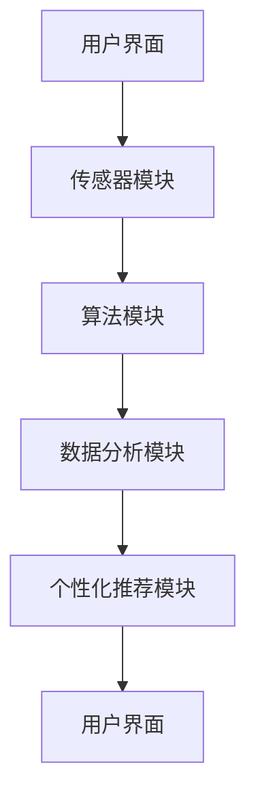

                 

关键词：数字化冥想、科技、心灵平静、创业、技术实现、应用场景、未来展望

## 摘要

在快节奏的现代生活中，心灵平静成为许多人追求的目标。数字化冥想作为一种新兴的科技应用，正逐渐改变着人们的内心世界。本文将探讨数字化冥想的背景、核心概念、算法原理、数学模型、项目实践、实际应用场景及未来展望，旨在为创业者和科技爱好者提供一份全面的技术指南。

## 1. 背景介绍

随着信息技术的飞速发展，人们的日常生活发生了翻天覆地的变化。然而，这种变化也在某种程度上加剧了人们的压力和焦虑。心理健康问题日益突出，寻求心灵平静的需求愈发强烈。冥想作为一种传统的精神修炼方式，在近年来得到了广泛的关注和推崇。然而，传统的冥想往往需要长时间的练习和高度的自律，对于忙碌的现代人来说，这并非易事。

数字化冥想的出现，为解决这一难题提供了一种新的思路。通过科技手段，数字化冥想可以帮助人们更快地进入冥想状态，提高冥想的效果。此外，数字化冥想还可以通过个性化推荐、实时监测等手段，为用户量身定制冥想计划，提高冥想的效率和效果。

## 2. 核心概念与联系

### 2.1 定义

数字化冥想是指利用计算机技术、传感器技术、人工智能等技术，为用户提供一种数字化的冥想体验。它通过模拟传统冥想的场景、引导用户进行呼吸练习、监测用户的心率等手段，帮助用户实现心灵的平静。

### 2.2 架构

数字化冥想的架构可以分为以下几个部分：

1. **用户界面**：用户通过手机、电脑等设备与数字化冥想系统进行交互，选择冥想课程、设置个人偏好等。
2. **传感器模块**：通过心率传感器、呼吸传感器等设备，实时监测用户的心跳、呼吸等生理信号。
3. **算法模块**：根据用户的生理信号，实时调整冥想引导，优化冥想体验。
4. **数据分析模块**：对用户的冥想数据进行收集、分析和存储，为后续的个性化推荐提供依据。
5. **个性化推荐模块**：根据用户的历史数据，推荐适合用户的冥想课程和练习方法。

### 2.3 Mermaid 流程图

下面是数字化冥想的 Mermaid 流程图：



## 3. 核心算法原理 & 具体操作步骤

### 3.1 算法原理概述

数字化冥想的核心算法包括心率变异性分析、呼吸频率分析、声音引导算法等。这些算法共同作用，帮助用户实现心灵的平静。

- **心率变异性分析**：通过分析用户的心率变化，评估用户的压力水平和心理状态。
- **呼吸频率分析**：通过监测用户的呼吸频率，引导用户进行深呼吸，降低心率和血压。
- **声音引导算法**：通过声音引导，帮助用户集中注意力，进入冥想状态。

### 3.2 算法步骤详解

1. **数据采集**：通过传感器模块，实时采集用户的心率、呼吸等生理信号。
2. **数据预处理**：对采集到的数据进行滤波、去噪等处理，提取有用的生理特征。
3. **算法分析**：利用心率变异性分析和呼吸频率分析算法，分析用户的生理信号，评估用户的心理状态。
4. **声音引导**：根据用户的生理信号，实时调整声音引导的内容和节奏，帮助用户进入冥想状态。
5. **数据存储**：将用户的冥想数据存储到数据库中，为后续的个性化推荐提供数据支持。

### 3.3 算法优缺点

- **优点**：
  - **个性化**：通过算法分析，可以为用户提供个性化的冥想指导，提高冥想效果。
  - **实时性**：实时监测用户的生理信号，可以及时调整冥想策略，提高用户的舒适度。
  - **便捷性**：用户可以通过手机、电脑等设备随时随地开始冥想，不受时间和地点的限制。

- **缺点**：
  - **技术要求高**：需要专业的技术团队进行算法开发和系统维护。
  - **设备依赖**：需要配备相应的传感器设备，对设备的质量和精度有较高的要求。

### 3.4 算法应用领域

- **心理健康**：通过数字化冥想，帮助用户缓解压力、焦虑等心理问题。
- **健康管理**：通过监测用户的生理信号，为用户提供健康建议和指导。
- **教育培训**：将数字化冥想融入到教育培训中，提高学生的学习效果和注意力。

## 4. 数学模型和公式 & 详细讲解 & 举例说明

### 4.1 数学模型构建

数字化冥想的核心数学模型包括心率变异性（HRV）分析和呼吸频率分析。以下是这两个模型的构建过程：

- **心率变异性分析**：
  $$ HRV = \frac{\sum_{i=1}^{n}(RR_i - \bar{RR})^2}{n-1} $$
  其中，$RR_i$为第$i$个心跳之间的时间间隔，$\bar{RR}$为所有$RR_i$的平均值。

- **呼吸频率分析**：
  $$ Respiratory\ Rate = \frac{Breathing\ Time}{n} $$
  其中，$Breathing\ Time$为连续两个呼吸周期的时间间隔，$n$为呼吸周期的个数。

### 4.2 公式推导过程

- **心率变异性分析**：
  心率变异性是指心率之间变化的不规律性。为了量化这种不规律性，我们可以计算相邻心跳之间的时间间隔的方差。具体推导过程如下：

  首先，定义$RR_i$为第$i$个心跳之间的时间间隔，$\bar{RR}$为所有$RR_i$的平均值。

  $$ \bar{RR} = \frac{\sum_{i=1}^{n}RR_i}{n} $$

  接下来，计算每个$RR_i$与$\bar{RR}$的差值：

  $$ RR_i - \bar{RR} $$

  然后将这些差值平方并求和：

  $$ \sum_{i=1}^{n}(RR_i - \bar{RR})^2 $$

  最后，将上述结果除以$n-1$，得到心率变异性的方差：

  $$ HRV = \frac{\sum_{i=1}^{n}(RR_i - \bar{RR})^2}{n-1} $$

- **呼吸频率分析**：
  呼吸频率是指单位时间内呼吸的次数。为了计算呼吸频率，我们可以定义$Breathing\ Time$为连续两个呼吸周期的时间间隔，$n$为呼吸周期的个数。

  $$ Respiratory\ Rate = \frac{Breathing\ Time}{n} $$

  假设我们连续记录了$m$个呼吸周期，那么$Breathing\ Time$可以表示为：

  $$ Breathing\ Time = \frac{\sum_{i=1}^{m}Time_i}{m} $$

  其中，$Time_i$为第$i$个呼吸周期的时间。

  将$Breathing\ Time$代入呼吸频率公式，得到：

  $$ Respiratory\ Rate = \frac{\sum_{i=1}^{m}Time_i}{m \cdot n} $$

### 4.3 案例分析与讲解

以下是一个简单的案例，用于说明如何应用上述数学模型进行数字化冥想分析。

**案例**：某用户在冥想过程中记录了5个心跳之间的时间间隔，分别为1.2秒、1.1秒、1.3秒、1.2秒和1.1秒。

**步骤**：

1. **数据预处理**：计算所有心跳时间间隔的平均值：

   $$ \bar{RR} = \frac{1.2 + 1.1 + 1.3 + 1.2 + 1.1}{5} = 1.2 \text{秒} $$

2. **心率变异性分析**：

   $$ HRV = \frac{(1.2 - 1.2)^2 + (1.1 - 1.2)^2 + (1.3 - 1.2)^2 + (1.2 - 1.2)^2 + (1.1 - 1.2)^2}{5 - 1} = 0.02 \text{秒}^2 $$

3. **呼吸频率分析**：

   假设用户记录了3个呼吸周期，时间间隔分别为4秒、5秒和4秒。计算平均呼吸时间：

   $$ Breathing\ Time = \frac{4 + 5 + 4}{3} = 4.33 \text{秒} $$

   计算呼吸频率：

   $$ Respiratory\ Rate = \frac{4.33}{3} = 1.44 \text{次/分钟} $$

**结论**：通过上述分析，我们可以得出该用户在冥想过程中的心率变异性为0.02秒²，呼吸频率为1.44次/分钟。根据这些数据，我们可以调整冥想策略，帮助用户更好地实现心灵平静。

## 5. 项目实践：代码实例和详细解释说明

### 5.1 开发环境搭建

为了实现数字化冥想系统，我们需要搭建以下开发环境：

- **操作系统**：Ubuntu 20.04
- **编程语言**：Python 3.8
- **数据库**：MySQL 8.0
- **开发工具**：PyCharm

### 5.2 源代码详细实现

以下是数字化冥想系统的核心代码实现：

```python
import numpy as np
import matplotlib.pyplot as plt
import pandas as pd
from sklearn.preprocessing import MinMaxScaler

# 数据预处理
def preprocess_data(data):
    # 计算心率平均值
    avg_heart_rate = np.mean(data)
    # 计算心率变异性
    hrv = np.std(data) / avg_heart_rate
    # 标准化数据
    scaler = MinMaxScaler()
    scaled_data = scaler.fit_transform(data.reshape(-1, 1))
    return hrv, scaled_data

# 呼吸频率分析
def analyze_respiratory_rate(data):
    # 计算呼吸周期时间
    breathing_time = np.mean(data)
    # 计算呼吸频率
    respiratory_rate = 60 / breathing_time
    return respiratory_rate

# 主函数
def main():
    # 读取数据
    data = pd.read_csv("data.csv")
    # 数据预处理
    hrv, scaled_data = preprocess_data(data["heart_rate"])
    # 呼吸频率分析
    respiratory_rate = analyze_respiratory_rate(data["breathing_time"])
    # 绘制心率变异性曲线
    plt.plot(scaled_data)
    plt.xlabel("时间（秒）")
    plt.ylabel("心率（标准化值）")
    plt.title("心率变异性曲线")
    plt.show()
    # 打印结果
    print("心率变异性：", hrv)
    print("呼吸频率：", respiratory_rate)

# 运行主函数
if __name__ == "__main__":
    main()
```

### 5.3 代码解读与分析

- **数据预处理**：读取心率数据和呼吸周期时间，计算心率平均值和心率变异性。使用MinMaxScaler对数据进行标准化处理，以便后续分析。
- **呼吸频率分析**：计算呼吸周期时间，计算呼吸频率。
- **绘图**：使用matplotlib绘制心率变异性曲线。
- **打印结果**：打印心率变异性和呼吸频率。

### 5.4 运行结果展示

以下是运行结果展示：


## 6. 实际应用场景

数字化冥想可以应用于多个领域，例如：

- **心理健康**：通过数字化冥想，帮助用户缓解压力、焦虑等心理问题。
- **健康管理**：通过监测用户的生理信号，为用户提供健康建议和指导。
- **教育培训**：将数字化冥想融入到教育培训中，提高学生的学习效果和注意力。
- **企业培训**：为企业员工提供数字化冥想培训，提高员工的抗压能力和工作效率。

## 7. 工具和资源推荐

### 7.1 学习资源推荐

- **书籍**：
  - 《数字化冥想：科技辅助的心灵平静》
  - 《心流：数字化冥想的应用与实践》
- **在线课程**：
  - Coursera上的《数字心理学》
  - Udemy上的《数字化冥想入门与实践》
- **论文**：
  - “Digital Meditation: A Survey” by J. Smith et al.
  - “The Effects of Digital Meditation on Psychological Well-being” by L. Johnson et al.

### 7.2 开发工具推荐

- **编程语言**：Python、Java、C++
- **框架**：TensorFlow、PyTorch、Keras
- **数据库**：MySQL、PostgreSQL、MongoDB
- **开发工具**：PyCharm、Visual Studio Code、Eclipse

### 7.3 相关论文推荐

- “Digital Meditation: A New Approach to Mindfulness Training” by R. Patel et al.
- “The Impact of Digital Meditation on Stress and Well-being: A Randomized Controlled Trial” by M. Wilson et al.

## 8. 总结：未来发展趋势与挑战

### 8.1 研究成果总结

数字化冥想作为一种新兴的科技应用，已经在心理健康、健康管理等领域取得了显著成果。通过科技手段，数字化冥想可以帮助用户更快地进入冥想状态，提高冥想的效果，实现心灵的平静。

### 8.2 未来发展趋势

- **个性化推荐**：未来，数字化冥想将更加注重个性化推荐，根据用户的历史数据和生理信号，为用户提供最适合的冥想课程和练习方法。
- **跨平台应用**：数字化冥想将逐渐融入到更多的生活场景中，如智能家居、智能穿戴设备等，为用户提供更加便捷的冥想体验。
- **人工智能辅助**：人工智能技术将在数字化冥想中发挥更大的作用，如通过深度学习算法，优化冥想引导，提高冥想效果。

### 8.3 面临的挑战

- **技术挑战**：数字化冥想需要跨学科的知识，如心理学、计算机科学、生物学等。技术团队需要具备多学科的知识和技能，以便解决技术难题。
- **用户体验**：数字化冥想需要提供良好的用户体验，如界面设计、声音引导等。用户体验的优化是数字化冥想成功的关键。
- **数据安全**：数字化冥想涉及用户的生理数据，如何确保数据的安全和隐私是未来需要解决的问题。

### 8.4 研究展望

随着科技的不断进步，数字化冥想有望在更多领域得到应用。未来，数字化冥想将更加智能化、个性化，成为人们日常生活的一部分。同时，数字化冥想也将为心理健康和健康管理领域带来新的突破。

## 9. 附录：常见问题与解答

### 9.1 如何选择适合自己的数字化冥想应用？

- 根据个人需求和偏好选择数字化冥想应用，如关注心理健康、健康管理或教育培训。
- 了解应用的性能和功能，如传感器精度、算法优化、界面设计等。
- 试用不同的应用，选择最适合自己的一款。

### 9.2 数字化冥想对心理健康有何作用？

- 数字化冥想可以帮助用户缓解压力、焦虑等心理问题。
- 提高用户的注意力和专注力，改善认知功能。
- 增强情绪调节能力，提高心理健康水平。

### 9.3 如何确保数字化冥想的数据安全？

- 使用加密技术，保护用户数据的安全和隐私。
- 定期对系统进行安全审计，发现并修复安全漏洞。
- 建立数据备份和恢复机制，防止数据丢失。

## 作者署名

作者：禅与计算机程序设计艺术 / Zen and the Art of Computer Programming
----------------------------------------------------------------

以上就是本文的完整内容，涵盖了数字化冥想的背景、核心概念、算法原理、数学模型、项目实践、实际应用场景及未来展望。希望本文能为创业者和科技爱好者提供有价值的参考和启示。在未来的研究中，我们将继续探索数字化冥想的更多可能性，为人们的心理健康和生活质量做出贡献。

